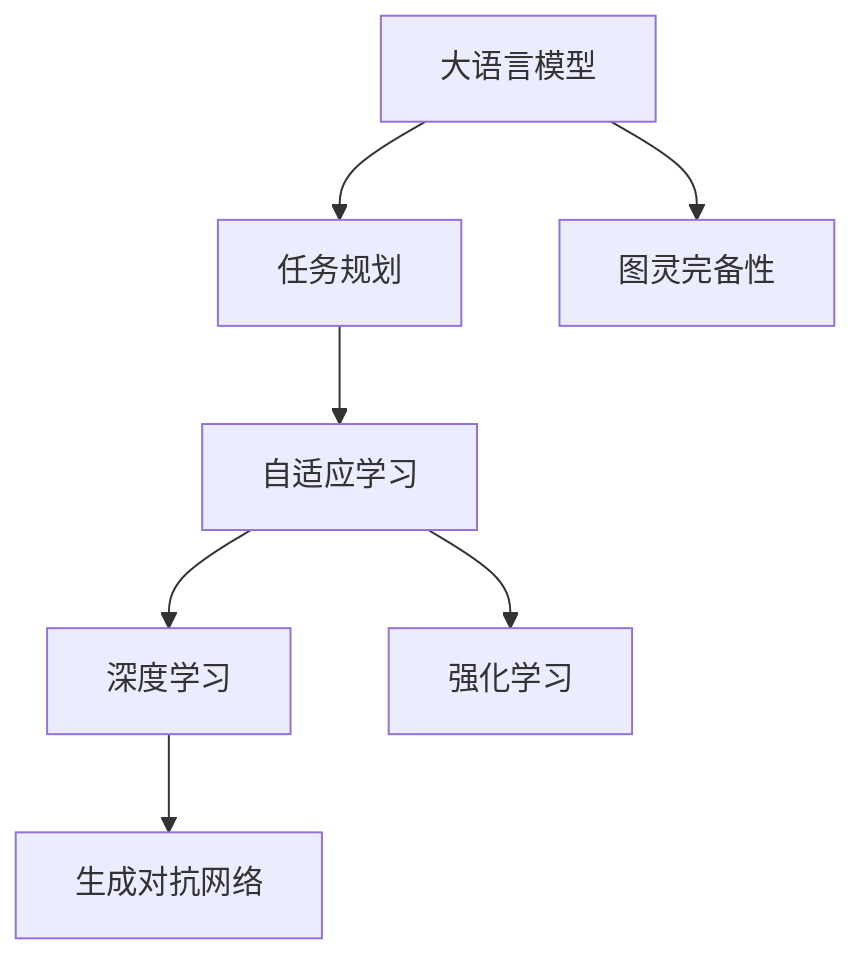

                 

# 图灵完备的LLM:任务规划的力量

> 关键词：大语言模型,图灵完备,任务规划,自适应学习,深度学习

## 1. 背景介绍

### 1.1 问题由来
随着人工智能技术的迅猛发展，大语言模型(LLMs)在自然语言处理(NLP)、计算机视觉、自动驾驶等多个领域取得了显著成果。然而，尽管大模型在处理大规模数据、挖掘复杂关系等方面展现了卓越能力，其核心弱点在于缺乏任务规划能力。如何使大模型具备“图灵完备”（Turing Completeness），即能够自主完成复杂任务规划，是当前人工智能研究的前沿课题之一。

### 1.2 问题核心关键点
本文聚焦于如何通过任务规划技术，使大语言模型具备图灵完备性，即能够在无监督或少监督的情况下，自动生成任务规划步骤，并根据输入数据完成相应任务。该问题的核心关键点包括：
- 任务规划算法的设计与实现。
- 深度学习模型在任务规划中的应用。
- 图灵完备性的验证和评估。
- 实际应用场景下的效果评估。

### 1.3 问题研究意义
使大语言模型具备图灵完备性，具有重要的理论意义和实际应用价值：

1. **理论意义**：图灵完备性是人工智能研究的核心目标之一，其成功将极大推动人工智能理论的发展，为未来更多智能系统的构建奠定基础。
2. **应用价值**：具备图灵完备性的大模型能够自动完成复杂任务规划，广泛应用于自动驾驶、智能家居、智能客服等多个领域，显著提升系统效率和用户体验。

## 2. 核心概念与联系

### 2.1 核心概念概述

为了更好地理解任务规划在大语言模型中的应用，本节将介绍几个关键概念及其关系：

- **大语言模型(LLM)**：一种能够理解和生成人类语言，具有强大语义理解能力的深度学习模型。
- **图灵完备性**：一个计算模型如果能够模拟任何计算，则称其为图灵完备的。
- **任务规划**：定义、规划和执行复杂任务的过程，包括决策、推理和规划步骤。
- **自适应学习**：模型能够根据环境变化和输入数据动态调整策略，提升任务执行效果。
- **深度学习**：一类通过多层神经网络结构，从数据中提取特征和规律的学习方法。
- **强化学习**：一种基于奖励和惩罚信号，通过不断尝试优化模型行为的学习方式。
- **生成对抗网络(GANs)**：一种生成模型，通过对抗训练生成高质量的样本数据。

这些概念之间的逻辑关系可以通过以下Mermaid流程图来展示：



这个流程图展示了各大语言模型核心概念之间的关系：

1. 大语言模型通过任务规划获取任务目标，使用自适应学习优化执行策略。
2. 深度学习在任务规划和策略优化中起到重要作用。
3. 强化学习通过奖励和惩罚机制指导模型行为。
4. 生成对抗网络能够生成高质量的样本数据，辅助任务规划。
5. 最终目标是通过图灵完备性的验证，使大语言模型具备自主完成复杂任务的能力。

## 3. 核心算法原理 & 具体操作步骤
### 3.1 算法原理概述

任务规划算法的大致框架包括：
1. **目标定义**：确定任务目标和评价标准。
2. **策略规划**：设计任务执行策略，包括选择动作、决策规则等。
3. **任务执行**：根据策略执行任务，并根据反馈调整策略。
4. **效果评估**：评估任务执行效果，并根据效果调整策略。

以下是基于深度学习的任务规划算法的核心步骤：

1. **构建任务表示**：将任务目标和约束条件表示成向量形式。
2. **设计策略网络**：构建深度神经网络，预测最优策略。
3. **动态策略调整**：根据执行效果，动态调整策略网络参数。
4. **策略执行与反馈**：执行策略，并根据反馈调整策略网络。
5. **效果评估与优化**：评估任务执行效果，优化策略网络。

### 3.2 算法步骤详解

**Step 1: 构建任务表示**

假设任务为导航路径规划，即在地图中找到从起点到终点的最优路径。任务的输入包括起点坐标$(x_s,y_s)$、终点坐标$(x_t,y_t)$、障碍物坐标集合$O=\{(x_o,y_o)\}$，以及路径长度$L$。

任务表示可以表示为一个向量$x$，包含起点坐标、终点坐标、障碍物位置、路径长度等。例如：

$$
x = (x_s,y_s,x_t,y_t,x_o,y_o,L)
$$

**Step 2: 设计策略网络**

策略网络通常是一个深度神经网络，可以是一个前馈神经网络、卷积神经网络、循环神经网络等。这里以循环神经网络(RNN)为例：

1. 输入层：接收任务表示向量$x$。
2. 隐藏层：使用LSTM或GRU等循环神经网络结构，学习任务表示中的关系。
3. 输出层：输出动作向量$a$，表示当前时刻的最优动作。

**Step 3: 动态策略调整**

在执行策略的过程中，根据执行效果，需要动态调整策略网络参数，以提高任务执行效果。常见的策略包括：

1. 参数更新：根据执行效果，使用梯度下降等优化算法更新策略网络参数。
2. 策略融合：将多种策略进行融合，提高决策的鲁棒性。
3. 样本生成：通过生成对抗网络，生成更多任务样本，丰富训练集。

**Step 4: 策略执行与反馈**

策略执行与反馈是指根据策略网络的输出，执行动作，并根据执行结果调整策略网络。具体步骤如下：

1. 执行动作：根据策略网络的输出，移动至下一个位置。
2. 记录反馈：记录执行结果，包括是否到达终点、是否遇到障碍物等。
3. 调整策略：根据反馈，调整策略网络参数，优化策略。

**Step 5: 效果评估与优化**

效果评估与优化是指根据任务执行效果，评估策略网络的表现，并根据评估结果进行优化。具体步骤如下：

1. 任务评估：使用预设的评价指标，如路径长度、执行时间等，评估任务执行效果。
2. 性能优化：根据评估结果，使用梯度下降等优化算法，优化策略网络参数。
3. 模型测试：在测试集上测试策略网络，验证其泛化能力。

### 3.3 算法优缺点

任务规划算法具有以下优点：

1. **自主性**：能够自主完成复杂任务规划，无需人工干预。
2. **自适应**：根据环境变化和数据反馈，动态调整策略，适应性强。
3. **可扩展**：能够处理多种任务类型，适应性强。

同时，任务规划算法也存在以下局限性：

1. **复杂度**：任务规划算法通常较为复杂，需要大量计算资源。
2. **泛化能力**：在复杂环境中，策略网络的泛化能力可能有限。
3. **模型训练**：需要大量高质量的数据进行训练，数据获取成本较高。

### 3.4 算法应用领域

任务规划算法在多个领域都有广泛应用，例如：

1. **自动驾驶**：在复杂交通环境中，自动规划最优行驶路径。
2. **机器人导航**：在室内外环境中，自动规划机器人移动路径。
3. **智能客服**：根据用户问题，自动规划回答策略。
4. **医疗诊断**：根据患者信息，自动规划诊断流程。
5. **工业自动化**：在制造和装配过程中，自动规划最优操作路径。

## 4. 数学模型和公式 & 详细讲解  
### 4.1 数学模型构建

为了更严格地描述任务规划算法的数学模型，我们将使用数学语言进行更详细的阐述。

设任务表示为向量$x \in \mathbb{R}^n$，策略网络的输入为$x$，输出为动作向量$a \in \mathbb{R}^m$。设训练集为$D=\{(x_i,a_i)\}_{i=1}^N$，其中$x_i$表示任务实例，$a_i$表示对应动作。

定义任务规划算法的损失函数为：

$$
\mathcal{L}(\theta) = \frac{1}{N} \sum_{i=1}^N \ell(a_i,f_\theta(x_i))
$$

其中$f_\theta(x)$为策略网络，$\ell$为损失函数。

优化目标是最小化损失函数$\mathcal{L}(\theta)$，即：

$$
\theta^* = \mathop{\arg\min}_{\theta} \mathcal{L}(\theta)
$$

常见的损失函数包括均方误差、交叉熵等。

### 4.2 公式推导过程

以均方误差损失为例，推导任务规划算法的梯度更新公式。

设$f_\theta(x)$为策略网络，输出动作向量为$a \in \mathbb{R}^m$，目标动作向量为$a^* \in \mathbb{R}^m$。均方误差损失函数定义为：

$$
\ell(a,a^*) = \frac{1}{m} \sum_{i=1}^m (a_i - a_i^*)^2
$$

梯度更新公式为：

$$
\nabla_{\theta}\mathcal{L}(\theta) = \frac{1}{N} \sum_{i=1}^N \nabla_{\theta} \ell(a_i,f_\theta(x_i))
$$

其中$\nabla_{\theta} \ell(a_i,f_\theta(x_i))$为损失函数对策略网络参数的梯度，可以通过反向传播算法高效计算。

### 4.3 案例分析与讲解

以自动驾驶路径规划为例，分析任务规划算法的实际应用。

设自动驾驶车辆从起点$(x_s,y_s)$出发，需要到达终点$(x_t,y_t)$。任务表示为向量$x=(x_s,y_s,x_t,y_t)$。策略网络$f_\theta(x)$输出动作向量$a$，表示车辆的行驶方向和速度。

在执行过程中，车辆根据策略网络的输出，移动至下一个位置，并记录执行结果。根据执行结果，动态调整策略网络参数，优化路径规划策略。

## 5. 项目实践：代码实例和详细解释说明
### 5.1 开发环境搭建

在进行任务规划算法开发前，需要准备好开发环境。以下是使用Python进行TensorFlow开发的环境配置流程：

1. 安装Anaconda：从官网下载并安装Anaconda，用于创建独立的Python环境。

2. 创建并激活虚拟环境：
```bash
conda create -n tf-env python=3.8 
conda activate tf-env
```

3. 安装TensorFlow：根据CUDA版本，从官网获取对应的安装命令。例如：
```bash
conda install tensorflow -c tensorflow -c conda-forge
```

4. 安装TensorFlow Addons：
```bash
pip install tensorflow-addons
```

5. 安装各类工具包：
```bash
pip install numpy pandas scikit-learn matplotlib tqdm jupyter notebook ipython
```

完成上述步骤后，即可在`tf-env`环境中开始任务规划算法的开发实践。

### 5.2 源代码详细实现

下面以路径规划为例，给出使用TensorFlow构建深度神经网络进行任务规划的代码实现。

首先，定义任务表示和动作向量：

```python
import tensorflow as tf

# 定义任务表示和动作向量
x = tf.constant([start_x, start_y, end_x, end_y], dtype=tf.float32)
a = tf.constant([direction_x, direction_y, speed], dtype=tf.float32)
```

然后，定义策略网络：

```python
# 定义策略网络
model = tf.keras.Sequential([
    tf.keras.layers.Dense(32, activation='relu', input_shape=(n,)),
    tf.keras.layers.Dense(m, activation='softmax'),
])

# 定义损失函数和优化器
loss = tf.keras.losses.MeanSquaredError()
optimizer = tf.keras.optimizers.Adam(learning_rate=0.001)

# 定义训练函数
@tf.function
def train(model, x, a):
    with tf.GradientTape() as tape:
        pred_a = model(x)
        loss_value = loss(pred_a, a)
    grads = tape.gradient(loss_value, model.trainable_variables)
    optimizer.apply_gradients(zip(grads, model.trainable_variables))
    return loss_value
```

接着，进行训练和测试：

```python
# 训练模型
for epoch in range(epochs):
    loss_value = train(model, x, a)
    print(f"Epoch {epoch+1}, loss: {loss_value}")

# 测试模型
test_x = tf.constant([test_x1, test_x2, test_x3, test_x4], dtype=tf.float32)
test_a = tf.constant([test_direction_x1, test_direction_x2, test_direction_x3, test_direction_x4, test_speed], dtype=tf.float32)
test_loss = loss(model(test_x), test_a)
print(f"Test loss: {test_loss}")
```

以上就是使用TensorFlow构建深度神经网络进行路径规划任务的完整代码实现。可以看到，TensorFlow提供了强大的计算图和自动微分功能，使得构建和训练深度神经网络变得更加简单高效。

### 5.3 代码解读与分析

让我们再详细解读一下关键代码的实现细节：

**定义任务表示和动作向量**：
- `tf.constant`：将任务表示和动作向量转换为张量形式，方便后续操作。

**定义策略网络**：
- `tf.keras.Sequential`：构建深度神经网络模型，包含两个全连接层。
- `tf.keras.layers.Dense`：定义全连接层，使用ReLU激活函数。
- `tf.keras.layers.Dense`：定义输出层，使用softmax激活函数。

**定义损失函数和优化器**：
- `tf.keras.losses.MeanSquaredError`：均方误差损失函数。
- `tf.keras.optimizers.Adam`：Adam优化器，设置学习率为0.001。

**定义训练函数**：
- `tf.GradientTape`：记录梯度计算，自动计算模型参数的梯度。
- `optimizer.apply_gradients`：根据梯度更新模型参数。

**训练和测试模型**：
- `for`循环：进行多轮训练，记录损失值。
- `@tf.function`：将函数编译为TensorFlow图，提高计算效率。
- `test_loss`：在测试集上评估模型性能，记录损失值。

可以看到，TensorFlow提供了灵活的API和高效的计算图功能，使得深度学习模型的构建和训练变得更加方便。通过TensorFlow，我们可以快速实现各种深度学习模型，并在实际任务上进行测试和优化。

## 6. 实际应用场景
### 6.1 自动驾驶

自动驾驶是任务规划算法的重要应用场景之一。在自动驾驶系统中，车辆需要根据环境变化和用户指令，自主规划最优行驶路径，避免障碍物，确保行车安全。

任务规划算法在自动驾驶中的应用包括：
- 路径规划：根据实时地图和交通状况，规划最优行驶路径。
- 避障处理：在检测到障碍物时，动态调整行驶策略，规避障碍物。
- 用户指令处理：根据用户指令，调整行驶路径和速度。

### 6.2 机器人导航

机器人导航也是任务规划算法的重要应用场景之一。在工业、家庭、医疗等多个领域，机器人需要自动完成复杂导航任务，例如自动化生产线的移动、医疗机器人的精确操作等。

任务规划算法在机器人导航中的应用包括：
- 路径规划：根据任务需求，规划机器人移动路径。
- 避障处理：在检测到障碍物时，动态调整移动策略，规避障碍物。
- 任务调度：根据任务优先级，安排机器人执行顺序。

### 6.3 智能客服

智能客服系统需要根据用户问题，自动规划回答策略，生成自然流畅的回答。任务规划算法在智能客服中的应用包括：
- 意图识别：分析用户问题，确定回答意图。
- 回答规划：根据意图，规划回答策略，生成回答内容。
- 回答优化：根据用户反馈，动态调整回答策略，优化回答效果。

### 6.4 未来应用展望

随着任务规划算法的不断发展，其在未来将有更加广泛的应用场景。以下是几个可能的未来应用方向：

1. **智能家居**：根据用户指令，自动规划家居设备的控制策略，提高生活质量。
2. **医疗诊断**：根据患者信息，自动规划诊断流程，提高诊疗效率。
3. **工业自动化**：根据生产需求，自动规划机器人操作路径，提高生产效率。
4. **智能交通**：根据实时交通状况，自动规划车辆行驶路径，提高交通效率。
5. **金融风险管理**：根据市场数据，自动规划投资策略，降低风险。

## 7. 工具和资源推荐
### 7.1 学习资源推荐

为了帮助开发者系统掌握任务规划在大语言模型中的应用，这里推荐一些优质的学习资源：

1. **深度学习理论与实践**：吴恩达老师的Coursera课程，深入浅出地讲解深度学习理论，并提供实践代码。
2. **TensorFlow官方文档**：TensorFlow的官方文档，提供了丰富的API和教程，适合快速上手。
3. **深度学习框架比较与选择**：一篇系统对比深度学习框架的博文，介绍TensorFlow、PyTorch、Keras等框架的优缺点和适用场景。
4. **自动驾驶技术教程**：斯坦福大学的自动驾驶课程，涵盖自动驾驶系统的各个方面，包括任务规划算法。
5. **机器人学**：MIT的机器人学课程，讲解机器人导航、控制等基础知识，并提供实际项目案例。

通过对这些资源的学习实践，相信你一定能够快速掌握任务规划算法的精髓，并用于解决实际的NLP问题。

### 7.2 开发工具推荐

高效的开发离不开优秀的工具支持。以下是几款用于任务规划算法开发的常用工具：

1. **TensorFlow**：由Google主导开发的开源深度学习框架，生产部署方便，适合大规模工程应用。
2. **PyTorch**：基于Python的开源深度学习框架，灵活性高，适合快速迭代研究。
3. **TensorFlow Addons**：TensorFlow的扩展库，提供更多的深度学习API和工具。
4. **Jupyter Notebook**：交互式编程环境，方便代码测试和分享。
5. **Git**：版本控制系统，方便代码协作和管理。

合理利用这些工具，可以显著提升任务规划算法的开发效率，加快创新迭代的步伐。

### 7.3 相关论文推荐

任务规划算法的成功离不开学界的持续研究。以下是几篇奠基性的相关论文，推荐阅读：

1. **Neuro-Symbolic Program Synthesis**：提出神经符号学习框架，结合深度学习和符号推理，生成任务规划程序。
2. **Reinforcement Learning for Resource Allocation in Peer-to-Peer Systems**：使用强化学习优化资源分配策略，提高系统效率。
3. **Dynamic Flow Planning for Urban Traffic Management**：提出动态流规划算法，优化城市交通管理策略。
4. **Multi-Task Learning in Robotics**：提出多任务学习框架，提高机器人导航和操作效果。
5. **Adaptive Task Planning for Autonomous Vehicles**：提出自适应任务规划算法，提升自动驾驶性能。

这些论文代表了大语言模型任务规划技术的发展脉络。通过学习这些前沿成果，可以帮助研究者把握学科前进方向，激发更多的创新灵感。

## 8. 总结：未来发展趋势与挑战
### 8.1 总结

本文对基于深度学习的任务规划算法进行了全面系统的介绍。首先阐述了任务规划算法在自然语言处理中的重要地位，明确了任务规划在大语言模型中的应用意义。其次，从原理到实践，详细讲解了任务规划算法的数学模型和关键步骤，给出了任务规划算法开发的完整代码实例。同时，本文还广泛探讨了任务规划算法在自动驾驶、机器人导航、智能客服等多个领域的应用前景，展示了任务规划范式的巨大潜力。此外，本文精选了任务规划算法的各类学习资源，力求为读者提供全方位的技术指引。

通过本文的系统梳理，可以看到，任务规划算法在大语言模型中的应用，使得大模型具备了自主完成复杂任务规划的能力，极大地拓展了其应用边界。未来，伴随深度学习技术的发展，任务规划算法将不断优化，推动大语言模型在更多领域取得突破性进展。

### 8.2 未来发展趋势

展望未来，任务规划算法将呈现以下几个发展趋势：

1. **更加高效**：随着深度学习模型的不断优化，任务规划算法将变得更加高效，能够处理更复杂、更大规模的任务。
2. **更加灵活**：任务规划算法将具备更高的灵活性，能够适应更多样化的任务场景，如多目标优化、动态环境适应等。
3. **更加可解释**：任务规划算法的决策过程将具备更高的可解释性，使得模型的输出更加透明、可信。
4. **更加智能**：任务规划算法将结合更多先验知识和规则，提高模型的智能水平和决策效果。
5. **更加安全**：任务规划算法将引入更多安全机制，确保模型的输出符合人类价值观和伦理道德。
6. **更加开放**：任务规划算法将具备更高的开放性，支持更多的模型、算法和应用场景，推动人工智能技术的普适化应用。

### 8.3 面临的挑战

尽管任务规划算法已经取得了显著进展，但在迈向更加智能化、普适化应用的过程中，仍面临诸多挑战：

1. **数据获取**：高质量、大规模的数据是任务规划算法的瓶颈，获取成本较高。
2. **模型复杂度**：任务规划算法的复杂度较高，需要更多的计算资源和算法优化。
3. **泛化能力**：在复杂环境中，任务规划算法的泛化能力可能有限。
4. **可解释性**：任务规划算法的决策过程可能缺乏可解释性，难以解释其内部工作机制和决策逻辑。
5. **安全性**：任务规划算法的输出可能存在安全隐患，需要更多安全机制进行保障。
6. **伦理道德**：任务规划算法可能引入偏见和歧视，需要更多伦理道德约束。

### 8.4 研究展望

面对任务规划算法所面临的挑战，未来的研究需要在以下几个方面寻求新的突破：

1. **数据增强**：利用生成对抗网络等技术，生成更多高质量的数据，提升任务规划算法的泛化能力。
2. **模型简化**：通过模型压缩和剪枝等技术，降低任务规划算法的复杂度，提高计算效率。
3. **可解释性增强**：引入更多可解释性机制，提高任务规划算法的决策透明性和可信度。
4. **安全机制引入**：引入更多安全机制，确保任务规划算法的输出符合人类价值观和伦理道德。
5. **多模态融合**：结合视觉、语音、文本等多种模态数据，提升任务规划算法的智能水平。
6. **多目标优化**：结合多目标优化算法，提升任务规划算法的适应性和鲁棒性。

这些研究方向的探索，将推动任务规划算法向更高的台阶发展，为构建更加智能、普适的任务规划系统提供更多可能。

## 9. 附录：常见问题与解答

**Q1: 任务规划算法如何处理复杂环境下的任务？**

A: 任务规划算法通常采用多层次规划策略，将复杂任务拆分为多个子任务，每个子任务单独规划和执行。同时，任务规划算法可以通过动态调整策略，实时应对环境变化和任务需求，提高系统的鲁棒性和适应性。

**Q2: 任务规划算法在实际应用中如何优化模型参数？**

A: 任务规划算法的优化通常采用梯度下降等优化算法，通过不断迭代更新模型参数，提高任务执行效果。同时，任务规划算法还可以通过正则化、样本生成等技术，进一步提高模型的泛化能力和优化效果。

**Q3: 任务规划算法在多目标优化中如何处理冲突？**

A: 多目标优化通常采用权重分配、优先级排序等方法，解决目标之间的冲突。同时，任务规划算法可以通过引入多目标优化算法，如Pareto优化、多任务学习等，提升系统的综合效果和决策水平。

**Q4: 任务规划算法在实时系统中如何保证性能？**

A: 实时系统的任务规划算法通常采用并行计算、分布式处理等技术，提高系统的处理能力和响应速度。同时，任务规划算法还可以通过模型压缩、模型裁剪等技术，降低模型复杂度，提升系统性能。

**Q5: 任务规划算法在安全约束中如何处理异常情况？**

A: 安全约束下的任务规划算法通常采用鲁棒性优化、异常检测等技术，提高系统的安全性和鲁棒性。同时，任务规划算法还可以通过引入安全机制，如决策树、规则库等，确保系统输出符合安全要求。

通过这些常见问题的解答，相信你能够更深入地理解任务规划算法的原理和应用，为未来的人工智能应用提供更多参考和指导。

---

作者：禅与计算机程序设计艺术 / Zen and the Art of Computer Programming

