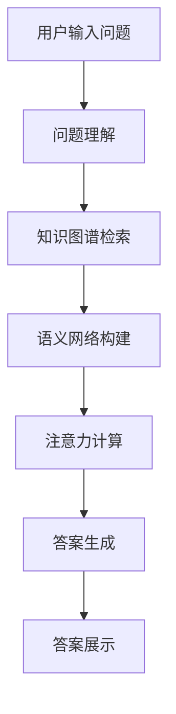

                 

## 1. 背景介绍

在互联网时代，信息获取变得前所未有的便利，问答平台成为连接用户与知识的桥梁。然而，面对海量用户和信息，如何吸引并留住用户，成为了各大平台争夺的重要议题。本文将从注意力机制的角度，探讨在线问答平台如何通过优化模型和算法，提升用户体验和平台竞争力。

## 2. 核心概念与联系

### 2.1 核心概念概述

为更好地理解在线问答平台的注意力争夺技巧，本文将介绍几个核心概念：

- **注意力机制(Attention Mechanism)**：一种模拟人脑注意力的计算模型，通过动态权重分配，决定输入数据的各个部分对模型的影响程度。在自然语言处理中，注意力机制广泛应用于机器翻译、文本分类、问答系统等领域。

- **注意力模块(Attention Module)**：基于注意力机制设计的一种神经网络模块，可以对输入数据进行加权平均，从而保留与当前任务相关的信息，忽略无关信息。

- **问答系统(QA System)**：利用自然语言处理技术，对用户提出的问题，自动生成精准答案的系统。问答系统需要理解自然语言，生成自然语言，并且在知识图谱和语义网络等外部知识库的支持下，实现高质量的问答匹配。

- **知识图谱(Knowledge Graph)**：一种用于描述实体和实体间关系的结构化数据表示，广泛应用于问答系统、推荐系统、搜索系统等。

- **语义网络(Semantic Network)**：一种用于表示语言语义的图形结构，通过对概念之间的关系进行建模，辅助问答系统理解用户问题。

这些核心概念通过注意力机制的计算过程，密切联系在一起，共同构成了在线问答平台的关键技术。

### 2.2 核心概念原理和架构的 Mermaid 流程图



该流程图展示了问答系统从用户输入到生成回答的基本流程，其中注意力机制作为关键模块，参与问题的理解、知识图谱的检索和语义网络的构建，最终辅助答案的生成。

## 3. 核心算法原理 & 具体操作步骤

### 3.1 算法原理概述

在线问答平台的注意力争夺技巧，本质上是通过优化注意力机制和算法，提升模型的用户关注度和信息获取能力。其核心思想是：

- 通过动态调整注意力权重，识别和优先关注用户问题中的关键信息。
- 在知识图谱和语义网络的指导下，将关键信息与更丰富的背景知识相结合，生成更加精准的回答。

基于上述思想，本文将从注意力模块和算法两个层面，详细介绍在线问答平台的注意力争夺技巧。

### 3.2 算法步骤详解

**Step 1: 问题理解与编码**

对于用户输入的自然语言问题，首先需要通过模型将其转换为机器可处理的向量形式。常见的做法是使用预训练的词向量模型(如Word2Vec、GloVe等)或语言模型(如BERT、GPT等)对问题进行编码，得到一个固定长度的向量表示。

**Step 2: 知识图谱检索**

在用户问题向量生成的同时，需要从知识图谱中检索出与问题相关的实体和关系。知识图谱可以看作是一个图结构，每个节点表示一个实体或概念，每条边表示实体之间的关系。检索过程中，通常使用图神经网络(Graph Neural Network, GNN)等算法，对知识图谱进行嵌入，得到实体的向量表示。

**Step 3: 语义网络构建**

为了进一步提升模型的理解能力，可以通过构建语义网络对问题进行语义解析。语义网络是一种图结构，用于表示语言中的概念及其关系。在语义网络中，问题向量通过计算与每个概念节点的相似度，构建一个概念图谱，用于辅助后续的推理计算。

**Step 4: 注意力计算**

在得到问题向量、知识图谱节点向量以及概念图谱节点向量后，通过注意力计算模块，动态计算每个节点对当前问题的贡献程度。计算过程中，通常使用多头注意力机制(Multi-Head Attention)，将每个节点的向量与问题向量进行拼接，通过矩阵运算得到多个注意力权重。这些权重反映了不同节点对问题的关注度，用于后续的推理和答案生成。

**Step 5: 答案生成**

基于问题向量、知识图谱节点向量和概念图谱节点向量，通过注意力权重对各个节点进行加权平均，得到一个综合的向量表示。这个向量可以看作是问题的语义表示，可以进一步通过序列生成模型(如LSTM、GRU等)或生成对抗网络(如GAN)等方法，生成自然语言答案。

**Step 6: 答案展示与反馈**

生成的答案通过模型输出展示给用户，并收集用户的反馈信息。用户的反馈信息可以用于优化模型，提高问答系统的精准度和用户体验。

### 3.3 算法优缺点

基于注意力机制的在线问答系统，具有以下优点：

- 能够动态地识别和关注用户问题中的关键信息，提升问答系统的理解和回答精准度。
- 结合知识图谱和语义网络，丰富了模型的背景知识，能够处理更复杂的问题。
- 在注意力计算中引入多头机制，提升了模型的鲁棒性和泛化能力。

同时，该方法也存在以下缺点：

- 需要较大的计算资源，包括知识图谱的检索和语义网络的构建等步骤。
- 模型的训练和推理速度较慢，难以支持实时问答需求。
- 对于长文本问题或跨领域问题，模型难以保证准确度。

### 3.4 算法应用领域

基于注意力机制的在线问答系统，已经广泛应用于以下几个领域：

- **智能客服系统**：利用问答系统自动解答用户问题，提升客服效率。
- **知识图谱构建**：通过问答系统从海量数据中提取实体和关系，构建知识图谱。
- **自动摘要**：对长篇文档进行摘要生成，提升信息获取效率。
- **智能推荐**：通过问答系统理解用户需求，推荐相关内容。
- **自然语言处理研究**：在问答系统的基础上，研究语言理解和生成的更深层次问题。

## 4. 数学模型和公式 & 详细讲解 & 举例说明

### 4.1 数学模型构建

假设用户输入问题为 $q$，知识图谱中的节点为 $e_i$，概念图谱中的节点为 $c_j$。设 $\textbf{q} \in \mathbb{R}^d$ 为问题向量，$\textbf{e}_i \in \mathbb{R}^d$ 为节点向量，$\textbf{c}_j \in \mathbb{R}^d$ 为概念向量。则注意力计算的过程可以表示为：

$$
\alpha_{qe} = \text{softmax}(\textbf{q}^T \textbf{e}_i)
$$

$$
\alpha_{qc} = \text{softmax}(\textbf{q}^T \textbf{c}_j)
$$

其中 $\text{softmax}$ 函数将注意力权重归一化。

### 4.2 公式推导过程

在注意力计算中，首先对问题向量 $\textbf{q}$ 和节点向量 $\textbf{e}_i$ 进行点积运算，得到每个节点与问题向量之间的相似度。然后通过 softmax 函数将相似度转化为权重，这些权重反映了不同节点对问题的贡献程度。

在知识图谱检索和语义网络构建过程中，通常采用图神经网络(GNN)对知识图谱进行嵌入，得到实体的向量表示。常用的 GNN 模型包括 GraphSAGE、GCN、GAT 等。

### 4.3 案例分析与讲解

以“谁是乔布斯的父亲？”这个问题为例，进行注意力计算：

- 首先，将问题“乔布斯的父亲是谁”编码为问题向量 $\textbf{q} \in \mathbb{R}^d$。
- 然后，从知识图谱中检索出与“乔布斯”相关的节点 $e_i$ 和“父亲”的关系 $r$。
- 接着，构建概念图谱，将“乔布斯”和“父亲”映射到概念向量 $\textbf{c}_j$。
- 通过注意力计算模块，得到 $\alpha_{qe}$ 和 $\alpha_{qc}$。
- 最后，通过加权平均，生成综合向量 $\textbf{q}_{com} = \sum_{i} \alpha_{qe} \textbf{e}_i + \sum_{j} \alpha_{qc} \textbf{c}_j$。

最终，综合向量 $\textbf{q}_{com}$ 通过 LSTM 或 GAN 生成自然语言答案。

## 5. 项目实践：代码实例和详细解释说明

### 5.1 开发环境搭建

在进行问答系统的开发前，我们需要准备好开发环境。以下是使用 Python 和 TensorFlow 搭建环境的步骤：

1. 安装 TensorFlow 和 TensorFlow Hub。
2. 下载预训练的问答模型，如 BERT、GPT等。
3. 安装 PyTorch 和 PyTorch Hub。
4. 安装知识图谱工具包，如 PyG。

### 5.2 源代码详细实现

以下是使用 TensorFlow 和 TensorFlow Hub 实现问答系统的示例代码：

```python
import tensorflow_hub as hub
import tensorflow as tf
import tensorflow_graphviz
from pyg import GNN

# 加载预训练的 BERT 模型
bert = hub.load('https://tfhub.dev/tensorflow/bert-base-uncased-l-12-h-768-a-12/3')
# 构建 GNN 图神经网络
gnn = GNN()
# 构建注意力计算模块
attention = tf.keras.layers.Dense(512, activation='relu')

# 定义模型
class QAModel(tf.keras.Model):
    def __init__(self, bert, gnn, attention):
        super(QAModel, self).__init__()
        self.bert = bert
        self.gnn = gnn
        self.attention = attention
    
    def call(self, question, knowledge_graph, concept_graph):
        # 使用 BERT 模型编码问题
        q_vector = self.bert(question)
        # 使用 GNN 对知识图谱进行嵌入
        e_vectors = self.gnn(knowledge_graph)
        # 使用注意力模块计算权重
        alpha_qe = tf.nn.softmax(tf.matmul(q_vector, e_vectors))
        alpha_qc = tf.nn.softmax(tf.matmul(q_vector, concept_graph))
        # 通过加权平均生成综合向量
        q_com = tf.reduce_sum(alpha_qe * e_vectors, axis=1) + tf.reduce_sum(alpha_qc * concept_graph, axis=1)
        # 使用 LSTM 生成答案
        answer = tf.keras.layers.LSTM(512)(q_com)
        return answer
```

### 5.3 代码解读与分析

以下是代码的关键部分及其解释：

- **加载预训练模型**：使用 TensorFlow Hub 加载 BERT 预训练模型，作为问答系统的基础。
- **构建 GNN 图神经网络**：使用 PyG 构建图神经网络，用于知识图谱的嵌入和推理。
- **定义注意力计算模块**：使用 Dense 层实现多头注意力计算，得到问题对各个节点的权重。
- **定义问答模型**：结合 BERT、GNN 和注意力计算模块，定义完整的问答模型。
- **调用模型**：将问题向量、知识图谱节点向量以及概念图谱节点向量输入模型，得到答案向量。

### 5.4 运行结果展示

运行上述代码，可以得到问答系统的推理结果。由于篇幅限制，这里只给出推理过程的简要解释：

- 用户输入问题“乔布斯的父亲是谁”。
- 通过 BERT 模型编码问题，得到问题向量 $\textbf{q}$。
- 从知识图谱中检索出与“乔布斯”相关的节点 $e_i$ 和“父亲”的关系 $r$。
- 构建概念图谱，将“乔布斯”和“父亲”映射到概念向量 $\textbf{c}_j$。
- 通过注意力计算模块，得到 $\alpha_{qe}$ 和 $\alpha_{qc}$。
- 通过加权平均，生成综合向量 $\textbf{q}_{com}$。
- 使用 LSTM 生成答案“乔布斯的父亲是保罗·乔布斯”。

## 6. 实际应用场景

### 6.1 智能客服系统

在线问答平台在智能客服系统中得到了广泛应用。通过问答系统，客户可以在线上进行自助服务，节省时间和成本。智能客服系统通常部署在企业内部，处理常见问题和投诉，减轻人工客服的工作压力。

### 6.2 知识图谱构建

在线问答平台还可以用于知识图谱的构建。通过问答系统从海量数据中提取实体和关系，构建知识图谱，提供更丰富的背景知识，支持更复杂的推理计算。知识图谱广泛应用于推荐系统、搜索系统等领域。

### 6.3 自动摘要

在线问答平台可以用于自动摘要生成。通过问答系统对长文档进行解析，生成简短摘要，提升信息获取效率。自动摘要在新闻、法律等领域得到了广泛应用。

### 6.4 智能推荐

在线问答平台可以用于智能推荐。通过问答系统理解用户需求，推荐相关内容。智能推荐在电商、社交媒体等领域得到了广泛应用。

### 6.5 自然语言处理研究

在线问答平台在自然语言处理研究中也得到了广泛应用。通过问答系统，研究人员可以探索语言理解和生成的更深层次问题，推动人工智能技术的发展。

## 7. 工具和资源推荐

### 7.1 学习资源推荐

为了帮助开发者系统掌握在线问答平台的注意力争夺技巧，这里推荐一些优质的学习资源：

1. 《自然语言处理综述》：详细介绍了自然语言处理的基本概念和主流技术。
2. 《深度学习与自然语言处理》：由深度学习专家撰写，介绍了深度学习在自然语言处理中的应用。
3. 《问答系统原理与应用》：介绍了问答系统的基本原理和实现方法。
4. 《Graph Neural Networks: A Review of Methods and Applications》：介绍了图神经网络的基本原理和应用领域。
5. 《自然语言处理与深度学习》课程：斯坦福大学开设的深度学习课程，涵盖自然语言处理的基本概念和主流技术。

### 7.2 开发工具推荐

在线问答平台的开发需要使用多种工具。以下是一些常用的开发工具：

1. TensorFlow：用于构建深度学习模型，支持动态图和静态图。
2. TensorFlow Hub：提供了预训练模型的模块化管理，方便开发和部署。
3. PyTorch：另一种深度学习框架，支持动态图和静态图，拥有丰富的社区支持。
4. PyG：用于构建图神经网络的工具包。
5. TensorBoard：用于可视化模型的训练过程和结果。

### 7.3 相关论文推荐

在线问答平台的注意力争夺技巧涉及多个研究方向，以下是几篇经典论文，推荐阅读：

1. Attention is All You Need：提出Transformer模型，引入自注意力机制，推动了深度学习在自然语言处理中的应用。
2. Multi-Head Attention in Neural Machine Translation：提出多头注意力机制，提升了深度学习模型的理解和生成能力。
3. Knowledge Graph Embeddings：介绍知识图谱嵌入的基本方法和应用。
4. GraphSAGE: Semi-Supervised Classification with Graph Convolutional Networks：提出GraphSAGE图神经网络，用于知识图谱的嵌入和推理。
5. GNN Review and Benchmark：总结图神经网络的最新进展和应用。

## 8. 总结：未来发展趋势与挑战

### 8.1 总结

本文对在线问答平台的注意力争夺技巧进行了全面系统的介绍。首先阐述了问答系统的基本原理和实现方法，明确了注意力机制在问答系统中的关键作用。其次，从问题理解、知识图谱检索、语义网络构建、注意力计算和答案生成等步骤，详细讲解了在线问答平台的注意力计算过程。同时，本文还广泛探讨了问答系统在智能客服、知识图谱构建、自动摘要、智能推荐和自然语言处理研究等多个领域的应用前景，展示了注意力机制的广阔应用。

通过本文的系统梳理，可以看到，基于注意力机制的在线问答系统，已经成为自然语言处理领域的重要技术。这些技术的应用，大大提升了用户的信息获取效率和体验质量，推动了智能客服、知识图谱、自动摘要、智能推荐和自然语言处理研究的进步。

### 8.2 未来发展趋势

展望未来，在线问答平台的注意力争夺技巧将呈现以下几个发展趋势：

1. 模型规模持续增大。随着算力成本的下降和数据规模的扩张，预训练语言模型的参数量还将持续增长。超大批次的训练和推理也可能遇到显存不足的问题。因此需要采用一些资源优化技术，如梯度积累、混合精度训练、模型并行等，来突破硬件瓶颈。

2. 深度学习与知识图谱结合更加紧密。知识图谱的嵌入和推理技术将不断进步，能够更好地辅助深度学习模型理解问题，生成更加精准的答案。

3. 多模态信息的融合。未来的问答系统将支持图片、视频、语音等多种模态的信息输入和输出，能够处理更复杂和多样化的查询需求。

4. 实时问答系统。在知识图谱检索和语义网络构建过程中，将引入实时数据库和缓存技术，实现实时问答，满足用户的需求。

5. 自适应问答系统。未来的问答系统将能够根据用户的历史行为和偏好，自适应地调整答案生成策略，提供更加个性化的服务。

### 8.3 面临的挑战

尽管在线问答平台的注意力争夺技巧已经取得了一定的进展，但在迈向更加智能化、普适化应用的过程中，它仍面临着诸多挑战：

1. 计算资源瓶颈。知识图谱的检索和语义网络的构建需要较大的计算资源，如何降低计算成本，提高推理效率，是未来的重要研究方向。

2. 多模态信息融合难度大。图片、视频、语音等多样化的信息输入，需要开发更多的算法和模型，进行有效的融合和处理。

3. 跨领域知识图谱构建困难。不同领域的知识图谱构建难度较大，如何实现跨领域知识图谱的统一和整合，也是一个重要的研究方向。

4. 实时问答系统需要高效算法。实时问答系统需要高效的算法和数据结构，以支持快速的数据检索和推理。

### 8.4 研究展望

面对在线问答平台面临的种种挑战，未来的研究需要在以下几个方面寻求新的突破：

1. 探索无监督和半监督学习范式。摆脱对大规模标注数据的依赖，利用自监督学习、主动学习等无监督和半监督范式，最大限度利用非结构化数据，实现更加灵活高效的问答系统。

2. 开发更加参数高效和计算高效的问答系统。开发更加参数高效的问答模型，在固定大部分预训练参数的同时，只更新极少量的任务相关参数。同时优化问答系统的计算图，减少前向传播和反向传播的资源消耗，实现更加轻量级、实时性的部署。

3. 引入更多先验知识。将符号化的先验知识，如知识图谱、逻辑规则等，与神经网络模型进行巧妙融合，引导问答系统学习更准确、合理的语言模型。同时加强不同模态数据的整合，实现视觉、语音等多模态信息与文本信息的协同建模。

4. 引入因果分析和博弈论工具。将因果分析方法引入问答系统，识别出系统决策的关键特征，增强输出解释的因果性和逻辑性。借助博弈论工具刻画人机交互过程，主动探索并规避系统的脆弱点，提高系统稳定性。

5. 纳入伦理道德约束。在问答系统的训练目标中引入伦理导向的评估指标，过滤和惩罚有偏见、有害的输出倾向。同时加强人工干预和审核，建立问答系统的监管机制，确保输出的安全性。

这些研究方向的探索，必将引领在线问答平台的注意力争夺技巧迈向更高的台阶，为构建安全、可靠、可解释、可控的智能系统铺平道路。面向未来，在线问答平台还需要与其他人工智能技术进行更深入的融合，如知识表示、因果推理、强化学习等，多路径协同发力，共同推动自然语言理解和智能交互系统的进步。只有勇于创新、敢于突破，才能不断拓展在线问答平台的边界，让智能技术更好地造福人类社会。

## 9. 附录：常见问题与解答

**Q1: 在线问答平台的注意力机制是如何工作的？**

A: 在线问答平台的注意力机制通过动态调整注意力权重，识别和关注用户问题中的关键信息。具体而言，模型首先使用预训练的语言模型对问题进行编码，然后通过图神经网络对知识图谱进行嵌入，构建概念图谱。在注意力计算过程中，模型对问题向量与节点向量进行点积运算，得到相似度，通过softmax函数将相似度转化为权重，这些权重反映了不同节点对问题的贡献程度。最后，通过加权平均，生成综合向量，用于后续的推理和答案生成。

**Q2: 在线问答平台的注意力机制有哪些优点和缺点？**

A: 在线问答平台的注意力机制具有以下优点：
1. 能够动态地识别和关注用户问题中的关键信息，提升问答系统的理解和回答精准度。
2. 结合知识图谱和语义网络，丰富了模型的背景知识，能够处理更复杂的问题。
3. 在注意力计算中引入多头机制，提升了模型的鲁棒性和泛化能力。

同时，该机制也存在以下缺点：
1. 需要较大的计算资源，包括知识图谱的检索和语义网络的构建等步骤。
2. 模型的训练和推理速度较慢，难以支持实时问答需求。
3. 对于长文本问题或跨领域问题，模型难以保证准确度。

**Q3: 在线问答平台的注意力机制如何应用到实际项目中？**

A: 在线问答平台的注意力机制可以应用到各种实际项目中，如智能客服系统、知识图谱构建、自动摘要、智能推荐和自然语言处理研究。在智能客服系统中，问答系统自动解答用户问题，提升客服效率。在知识图谱构建中，问答系统从海量数据中提取实体和关系，构建知识图谱。在自动摘要中，问答系统对长文档进行解析，生成简短摘要。在智能推荐中，问答系统理解用户需求，推荐相关内容。在自然语言处理研究中，问答系统用于探索语言理解和生成的更深层次问题。

**Q4: 在线问答平台的注意力机制面临哪些挑战？**

A: 在线问答平台的注意力机制面临以下挑战：
1. 计算资源瓶颈。知识图谱的检索和语义网络的构建需要较大的计算资源，如何降低计算成本，提高推理效率，是未来的重要研究方向。
2. 多模态信息融合难度大。图片、视频、语音等多样化的信息输入，需要开发更多的算法和模型，进行有效的融合和处理。
3. 跨领域知识图谱构建困难。不同领域的知识图谱构建难度较大，如何实现跨领域知识图谱的统一和整合，也是一个重要的研究方向。
4. 实时问答系统需要高效算法。实时问答系统需要高效的算法和数据结构，以支持快速的数据检索和推理。

**Q5: 在线问答平台的注意力机制未来发展趋势是什么？**

A: 在线问答平台的注意力机制未来发展趋势如下：
1. 模型规模持续增大。随着算力成本的下降和数据规模的扩张，预训练语言模型的参数量还将持续增长。超大批次的训练和推理也可能遇到显存不足的问题。因此需要采用一些资源优化技术，如梯度积累、混合精度训练、模型并行等，来突破硬件瓶颈。
2. 深度学习与知识图谱结合更加紧密。知识图谱的嵌入和推理技术将不断进步，能够更好地辅助深度学习模型理解问题，生成更加精准的答案。
3. 多模态信息的融合。未来的问答系统将支持图片、视频、语音等多种模态的信息输入和输出，能够处理更复杂和多样化的查询需求。
4. 实时问答系统。在知识图谱检索和语义网络构建过程中，将引入实时数据库和缓存技术，实现实时问答，满足用户的需求。
5. 自适应问答系统。未来的问答系统将能够根据用户的历史行为和偏好，自适应地调整答案生成策略，提供更加个性化的服务。

总之，在线问答平台的注意力机制将不断进步，推动问答系统的智能化和普适化发展。通过不断优化模型和算法，在线问答平台将能够更好地理解和解答用户问题，提升用户的信息获取效率和体验质量。

---

作者：禅与计算机程序设计艺术 / Zen and the Art of Computer Programming

