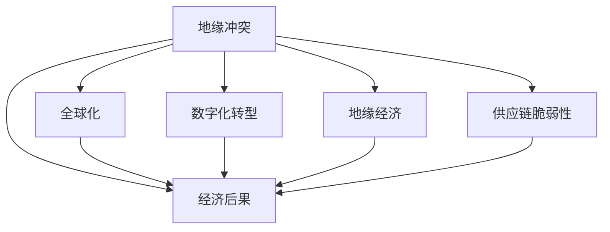

                 

## 1. 背景介绍

### 1.1 问题由来

近年来，全球地缘政治紧张局势不断升级，以俄乌冲突、美中对抗为代表的地区性冲突愈演愈烈，引发了全球范围内的广泛关注和深度讨论。这些地缘冲突不仅影响到国家的安全稳定，也对全球经济秩序、供应链、金融市场等多个方面产生了深远的影响。

### 1.2 问题核心关键点

- **地缘冲突**：指特定区域内国家间的军事、政治对抗，包括但不限于俄罗斯与乌克兰之间的冲突、美国与中国之间的贸易摩擦、美国与中东国家的紧张关系等。
- **经济后果**：地缘冲突所引发的各种经济问题，包括但不限于金融市场波动、供应链中断、投资环境恶化、贸易摩擦加剧等。
- **全球化**：地缘冲突通过跨国贸易、资本流动、信息传递等机制影响全球经济。
- **数字化转型**：疫情期间加速的数字经济转型，使得经济更加依赖网络空间，地缘冲突对数字空间的冲击更加显著。

### 1.3 问题研究意义

理解地缘冲突加剧对经济的影响，有助于各国政府、企业、投资者等更好地应对未来不确定性，制定更加稳健的经济政策和投资策略。通过系统性分析，可以为政策制定者提供科学依据，为投资者规避风险提供参考。

## 2. 核心概念与联系

### 2.1 核心概念概述

为更好地理解地缘冲突加剧的经济后果，本节将介绍几个密切相关的核心概念：

- **地缘冲突**：涉及特定区域的军事、政治对抗，通常包括但不限于边界争端、军事演习、制裁和反制裁等。
- **经济后果**：包括股市波动、汇率变化、国际合作减少等直接和间接的经济影响。
- **全球化**：跨国贸易、资本流动、信息传递等全球范围内的经济一体化过程。
- **数字化转型**：疫情期间加速的企业数字化、产业数字化转型，使得经济更加依赖网络空间。
- **地缘经济**：通过地缘政治因素影响区域或全球经济活动，如贸易通道控制、资源争夺等。
- **供应链脆弱性**：全球化背景下，各国供应链的相互依赖导致地缘冲突对供应链的冲击。

这些核心概念之间的逻辑关系可以通过以下Mermaid流程图来展示：



这个流程图展示了大规模语言模型微调的各个核心概念及其之间的关联：

1. 地缘冲突是引发经济后果的直接原因。
2. 全球化和数字化转型使得地缘冲突的影响范围更广，影响深度更深。
3. 地缘经济通过控制贸易通道、争夺资源等方式，进一步加剧了地缘冲突的经济后果。
4. 供应链脆弱性则放大了地缘冲突对经济的冲击力。

## 3. 核心算法原理 & 具体操作步骤
### 3.1 算法原理概述

地缘冲突对经济影响的研究通常采用定量分析与定性分析相结合的方法。定性分析主要通过政治、经济、历史等多角度理解地缘冲突的背景及影响机制，定量分析则通过统计模型、经济模型等工具，对冲突对经济各维度的具体影响进行量化评估。

### 3.2 算法步骤详解

#### 3.2.1 数据收集与预处理

1. **数据来源**：收集冲突发生国家的历史和当前经济数据，包括GDP、通货膨胀率、失业率、财政赤字、贸易额、外资流入等指标。同时收集冲突发生前后的相关数据，以便进行对比分析。
2. **数据清洗**：处理缺失值、异常值，对数据进行标准化处理。

#### 3.2.2 模型选择与构建

1. **选择模型**：根据研究问题的特点选择合适的经济模型，如向量自回归(VAR)模型、面板数据模型、因果推断模型等。
2. **构建模型**：构建模型，并进行模型参数估计。使用统计软件如STATA、R、Python的SciPy等进行模型构建和参数估计。

#### 3.2.3 数据验证与模型评估

1. **模型验证**：使用历史数据验证模型的有效性，如预测误差、残差分析等。
2. **模型评估**：通过不同冲突案例验证模型的普适性，如中东冲突、俄乌冲突等。

#### 3.2.4 结果分析与解释

1. **结果分析**：对模型输出结果进行解读，分析地缘冲突对经济各维度的具体影响。
2. **结果可视化**：使用可视化工具如Matplotlib、Tableau等进行结果展示，如图表、动态图等。

### 3.3 算法优缺点

#### 3.3.1 优点

1. **系统性**：通过多维数据分析，系统地理解地缘冲突对经济的影响。
2. **准确性**：使用经济模型对地缘冲突的经济后果进行量化评估，结果较为可靠。
3. **可操作性**：研究结果能够为政府、企业、投资者等提供决策依据。

#### 3.3.2 缺点

1. **复杂性**：模型构建和参数估计较为复杂，需要专业知识和技能。
2. **不确定性**：地缘冲突影响因素复杂多样，模型结果存在一定的不确定性。
3. **数据限制**：历史数据和冲突数据的获取和处理可能存在限制。

### 3.4 算法应用领域

地缘冲突对经济影响的研究具有广泛的应用领域，主要包括以下几个方面：

1. **政策制定**：政府可根据研究结果，调整经济政策，缓解冲突对经济的影响。
2. **企业决策**：企业可依据研究结果，调整投资策略，规避风险。
3. **学术研究**：研究者可通过实证分析，验证理论模型的有效性，推动学术进步。
4. **投资者风险管理**：投资者可利用研究结果，进行风险评估，制定合理的投资组合。

## 4. 数学模型和公式 & 详细讲解 & 举例说明

### 4.1 数学模型构建

构建经济影响模型的第一步是定义模型，以下是一些常见的经济模型：

- **VAR模型**：用于描述经济系统中多个变量之间相互作用关系的模型。
- **Granger因果模型**：用于检验变量之间是否存在因果关系的模型。
- **面板数据模型**：用于分析不同国家（截面）或同一国家不同时间（时间序列）的数据。
- **因果推断模型**：用于估计因果效应，如匹配方法、工具变量法等。

### 4.2 公式推导过程

以Granger因果模型为例，其基本原理是检验一个变量是否能够预测另一个变量的未来值。假设Y表示目标变量，X表示预测变量，Granger因果模型的公式为：

$$
Y_t = \alpha + \beta Y_{t-1} + \gamma X_{t-1} + \epsilon_t
$$

其中，$\alpha$为常数项，$\beta$和$\gamma$为系数，$\epsilon_t$为误差项。通过对上述模型进行估计，可以判断变量X是否对Y有预测能力，进而评估地缘冲突对经济的影响。

### 4.3 案例分析与讲解

以俄乌冲突为例，分析其对全球股市、大宗商品价格的影响。构建Granger因果模型，检验地缘冲突对股市的因果关系，并使用VAR模型分析地缘冲突对大宗商品价格的影响。

## 5. 项目实践：代码实例和详细解释说明
### 5.1 开发环境搭建

在进行地缘冲突研究时，需要搭建Python开发环境。以下是Python开发环境的配置流程：

1. **安装Python**：从官网下载并安装Python，确保安装版本为3.x或更高版本。
2. **安装SciPy**：使用pip安装SciPy，用于数据分析和建模。
3. **安装Pandas**：使用pip安装Pandas，用于数据处理和分析。
4. **安装Matplotlib**：使用pip安装Matplotlib，用于数据可视化。
5. **安装Seaborn**：使用pip安装Seaborn，用于数据可视化。
6. **安装STATA**：安装STATA软件，用于更复杂的数据分析和建模。

### 5.2 源代码详细实现

以下是使用Python进行Granger因果模型构建的代码实现：

```python
import pandas as pd
from statsmodels.tsa.vector_ar.var_model import VAR
from statsmodels.tsa.stattools import adfuller

# 加载数据
data = pd.read_csv('data.csv')

# 数据处理
data.fillna(method='ffill', inplace=True)

# 单位根检验
def unit_root_test(series):
    result = adfuller(series)
    print(f'ADF Statistic: {result[0]}')
    print(f'p-value: {result[1]}')

unit_root_test(data['Y'])
unit_root_test(data['X'])

# 构建VAR模型
model = VAR(data)
model_fit = model.fit()

# 输出模型结果
print(model_fit.summary())
```

### 5.3 代码解读与分析

**数据加载与处理**：
- 使用Pandas加载数据，并进行基本的缺失值处理。

**单位根检验**：
- 使用ADF检验判断时间序列是否存在单位根，是否平稳。

**VAR模型构建**：
- 使用VAR模型，估计模型参数，得到模型结果。

### 5.4 运行结果展示

运行上述代码后，输出VAR模型的结果，包括各个变量的系数、方差和协方差矩阵等。同时，输出单位根检验结果，判断各变量是否平稳。

## 6. 实际应用场景
### 6.1 企业风险管理

地缘冲突加剧使得全球经济环境充满不确定性，企业需要在投资决策中更加谨慎。通过对地缘冲突对经济影响的系统性分析，企业能够更好地评估特定区域或行业的风险，制定更稳健的投资策略。

**案例**：美国企业在进行对华投资时，需要考虑到中美贸易摩擦带来的经济风险。通过构建Granger因果模型和VAR模型，评估地缘冲突对美国对华投资的影响，进而调整投资策略，规避风险。

### 6.2 政府政策制定

地缘冲突对全球经济有深远影响，政府需要根据研究结果，制定相应的经济政策，保障经济稳定。

**案例**：美国政府在应对俄乌冲突时，需要评估地缘冲突对全球能源市场的影响。通过构建VAR模型，分析地缘冲突对石油价格、天然气价格等能源市场的影响，进而制定相应的能源政策，确保国内能源供应稳定。

### 6.3 投资者风险评估

地缘冲突对金融市场的波动影响显著，投资者需要实时关注地缘冲突动态，评估其对投资组合的影响。

**案例**：投资者在进行对中东地区的投资时，需要考虑到中东地区地缘冲突对国际油价的影响。通过构建Granger因果模型，评估地缘冲突对国际油价的影响，进而调整投资组合，降低风险。

## 7. 工具和资源推荐
### 7.1 学习资源推荐

为了帮助开发者系统掌握地缘冲突加剧的经济影响，以下是一些优质的学习资源：

1. **《经济学人》地缘政治分析**：提供深度地缘政治分析文章，帮助理解地缘冲突对经济的影响。
2. **牛津经济研究院报告**：提供地缘政治对全球经济影响的定量分析报告，详细解读模型和数据。
3. **Bloomberg全球市场分析**：提供地缘冲突对全球市场影响的实时分析，帮助投资者评估风险。
4. **MIT斯隆管理学院课程**：提供全球经济和地缘政治分析的课程，涵盖模型构建和案例分析。

通过对这些资源的学习实践，相信你一定能够快速掌握地缘冲突对经济影响的精髓，并用于解决实际的NLP问题。

### 7.2 开发工具推荐

高效的工具是进行地缘冲突研究的重要保障。以下是几款常用的地缘冲突研究工具：

1. **Python**：灵活的编程语言，适合进行数据分析和建模。
2. **SciPy**：Python的科学计算库，提供多种统计模型。
3. **R语言**：专业的统计分析语言，适合进行复杂的数据分析和建模。
4. **STATA**：专业的统计分析软件，适合进行面板数据和因果推断分析。
5. **Matplotlib**：数据可视化工具，适合进行图表展示。
6. **Seaborn**：基于Matplotlib的数据可视化库，支持更高级的统计图表。

合理利用这些工具，可以显著提升地缘冲突研究的开发效率，加快创新迭代的步伐。

### 7.3 相关论文推荐

地缘冲突对经济影响的研究源于学界的持续研究。以下是几篇奠基性的相关论文，推荐阅读：

1. **《Granger Causality in Time Series》**：Granger因果关系的重要理论基础，阐述了因果关系在时间序列中的应用。
2. **《Econometric Analysis of Panel Data》**：面板数据的建模和分析方法，适合进行地缘冲突的实证研究。
3. **《Dynamic Models and Causal Inference》**：动态经济模型和因果推断方法的经典教材，提供系统的理论基础。
4. **《Modeling Economic Dynamics Using Vector Autoregressive Models》**：VAR模型在经济动态分析中的应用，提供系统的方法和案例。
5. **《Predicting Economic Crises Using Causal Models》**：通过因果模型预测经济危机的研究，提供实际的实证分析方法。

这些论文代表了大规模语言模型微调技术的发展脉络。通过学习这些前沿成果，可以帮助研究者把握学科前进方向，激发更多的创新灵感。

## 8. 总结：未来发展趋势与挑战

### 8.1 总结

本文对地缘冲突加剧的经济影响进行了全面系统的介绍。首先阐述了地缘冲突的背景和影响机制，明确了地缘冲突在经济领域的广泛应用。其次，从原理到实践，详细讲解了地缘冲突经济影响的数学模型和代码实现，给出了系统性分析的完整代码实例。同时，本文还探讨了地缘冲突对企业风险管理、政府政策制定、投资者风险评估等多个领域的实际应用，展示了地缘冲突研究的广阔前景。此外，本文精选了地缘冲突研究的各类学习资源，力求为读者提供全方位的技术指引。

通过本文的系统梳理，可以看到，地缘冲突加剧的经济影响研究具有重要的实践价值，为政府、企业、投资者等提供了科学决策的依据。未来，随着地缘政治环境的不断变化，地缘冲突对经济的影响将更加复杂多变，需要更多的系统性研究来支撑决策。

### 8.2 未来发展趋势

展望未来，地缘冲突经济影响的研究将呈现以下几个发展趋势：

1. **数字化智能化**：利用大数据、人工智能等技术，提升地缘冲突经济影响的分析精度和效率。
2. **全球化复杂化**：全球经济和地缘政治的复杂性加剧，需要更复杂的模型和分析方法。
3. **数据驱动**：更多地依靠实证数据，通过机器学习等技术，提升模型预测的准确性。
4. **多维度融合**：结合政治、经济、历史等多维度因素，进行更全面的分析。
5. **动态监测**：实时监测地缘冲突动态，及时评估其经济影响。

这些趋势凸显了地缘冲突经济影响研究的广阔前景。这些方向的探索发展，必将进一步提升地缘冲突经济影响研究的科学性、系统性和实用性，为决策者提供更可靠的依据。

### 8.3 面临的挑战

尽管地缘冲突经济影响研究已经取得了诸多成果，但在应对未来不确定性的过程中，它仍面临诸多挑战：

1. **数据获取困难**：获取高质量的地缘冲突和经济数据存在困难，影响研究的科学性。
2. **模型复杂性高**：地缘冲突的复杂性导致模型构建和参数估计复杂，难以获得普适性强的模型。
3. **结果不确定性**：地缘冲突的影响因素复杂多样，模型的预测结果存在一定的不确定性。
4. **国际合作难**：地缘冲突对国际合作的冲击导致数据共享和信息交流困难。

尽管存在这些挑战，但通过进一步的研究和技术创新，未来的地缘冲突经济影响研究有望在数据获取、模型构建、结果解读等方面取得新的突破，推动其向更加科学、系统的方向发展。

### 8.4 研究展望

未来的地缘冲突经济影响研究需要在以下几个方面寻求新的突破：

1. **大数据和人工智能**：利用大数据和人工智能技术，提升地缘冲突经济影响的分析精度和效率。
2. **全球合作**：加强国际合作，共享数据和信息，提升研究结果的普适性。
3. **模型优化**：引入先进的建模方法和技术，提升模型的预测准确性和普适性。
4. **政策建议**：通过系统性分析，提出科学的政策建议，为决策者提供有力支持。
5. **风险管理**：结合地缘冲突的动态监测，及时评估其经济影响，提供风险预警和应对策略。

这些研究方向的探索，必将引领地缘冲突经济影响研究迈向更高的台阶，为决策者提供更可靠、更系统的决策依据。

## 9. 附录：常见问题与解答

**Q1：地缘冲突加剧对全球经济有哪些主要影响？**

A: 地缘冲突加剧对全球经济的主要影响包括：
1. **金融市场波动**：地缘冲突引发投资者恐慌，导致股市、债市、汇市等金融市场波动加剧。
2. **供应链中断**：地缘冲突导致重要物资供应中断，如石油、天然气等，影响全球供应链稳定。
3. **投资环境恶化**：地缘冲突影响政治稳定性，投资者对特定地区或行业的信心下降，投资环境恶化。
4. **贸易摩擦加剧**：地缘冲突导致贸易保护主义抬头，引发贸易摩擦，影响国际贸易格局。

**Q2：如何评估地缘冲突对特定行业的影响？**

A: 评估地缘冲突对特定行业的影响，通常采用以下方法：
1. **实证分析**：收集相关行业的经济数据，使用Granger因果模型、VAR模型等进行实证分析。
2. **专家访谈**：通过专家访谈获取行业专家的看法，结合数据进行综合分析。
3. **案例研究**：选取具有代表性的地缘冲突案例，进行深入的案例研究。
4. **情景分析**：构建不同情景的模拟模型，评估地缘冲突在不同情景下的影响。

**Q3：地缘冲突对金融市场的影响机制是什么？**

A: 地缘冲突对金融市场的影响机制包括：
1. **风险偏好下降**：地缘冲突导致投资者对未来不确定性增加，风险偏好下降。
2. **资本流动变化**：地缘冲突影响资本流动，导致资本流入流出变化。
3. **市场情绪影响**：地缘冲突引发市场情绪变化，导致资产价格波动。
4. **货币政策变化**：地缘冲突影响央行货币政策，导致货币市场波动。

**Q4：如何应对地缘冲突带来的经济风险？**

A: 应对地缘冲突带来的经济风险，通常采取以下措施：
1. **多元化投资**：通过多元化投资，分散风险，降低单一地区的经济波动对整体投资组合的影响。
2. **风险预警**：利用地缘冲突经济影响研究的预测结果，及时发布风险预警，提前采取应对措施。
3. **储备建设**：建立储备基金，应对突发事件带来的经济冲击。
4. **政策调整**：根据地缘冲突的实际影响，及时调整经济政策，保障经济稳定。

**Q5：地缘冲突经济影响研究的技术难点是什么？**

A: 地缘冲突经济影响研究的技术难点包括：
1. **数据获取困难**：获取高质量的地缘冲突和经济数据存在困难。
2. **模型复杂性高**：地缘冲突的复杂性导致模型构建和参数估计复杂。
3. **结果不确定性**：地缘冲突的影响因素复杂多样，模型的预测结果存在一定的不确定性。
4. **国际合作难**：地缘冲突对国际合作的冲击导致数据共享和信息交流困难。

以上问题需要进一步的研究和技术创新，才能在实际应用中发挥地缘冲突经济影响研究的最大价值。

---

作者：禅与计算机程序设计艺术 / Zen and the Art of Computer Programming

