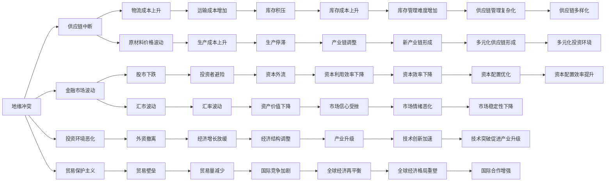

                 

# 地缘冲突加剧的经济影响

## 1. 背景介绍

### 1.1 问题由来

随着全球化的加速，经济活动的边界日益模糊，地缘政治因素在经济发展中的作用愈发显著。近年来，地缘冲突频发，如俄乌战争、中美贸易摩擦等，对全球经济造成了深远影响。本博文旨在从技术角度，详细分析地缘冲突对经济的系统性影响，并提出相应的政策建议。

### 1.2 问题核心关键点

地缘冲突对经济的影响体现在多个方面，主要包括：

- **供应链中断**：冲突导致基础设施损毁，供应链网络断裂，影响物流运输和原材料供应。
- **资产价格波动**：市场恐慌情绪上升，导致股市、汇市等金融市场波动加剧。
- **投资环境恶化**：政治不稳定增加了投资风险，外资撤离严重。
- **贸易保护主义抬头**：冲突使得保护主义情绪高涨，贸易壁垒增加。

## 2. 核心概念与联系

### 2.1 核心概念概述

- **地缘冲突**：指国际政治实体之间的军事、政治或经济冲突。如俄乌战争、中东地区冲突等。
- **经济影响**：指地缘冲突对国际贸易、金融市场、产业供应链等方面的影响。
- **供应链中断**：指因冲突导致的物流运输中断、原材料供应不足等问题。
- **金融市场波动**：指地缘冲突引发的市场恐慌，导致资产价格波动。
- **投资环境恶化**：指政治不稳定对投资风险的增加，导致外资撤离。
- **贸易保护主义**：指为了保护本国产业，采取的一系列贸易限制措施。

### 2.2 核心概念原理和架构的 Mermaid 流程图



## 3. 核心算法原理 & 具体操作步骤

### 3.1 算法原理概述

地缘冲突对经济影响的分析主要基于以下模型：

1. **宏观经济模型**：通过宏观经济指标（如GDP、CPI、失业率等），分析地缘冲突对整体经济的影响。
2. **供应链模型**：使用供应链网络图，分析物流中断和原材料供应的影响。
3. **金融市场模型**：利用金融市场数据，分析市场波动和资本流动的变化。
4. **投资环境模型**：结合政治、经济因素，分析投资风险和外资流动。
5. **贸易模型**：基于国际贸易数据，分析贸易壁垒和贸易量的变化。

### 3.2 算法步骤详解

#### 3.2.1 数据收集与预处理

1. **宏观经济数据**：收集各国GDP、CPI、失业率、通胀率等经济指标数据。
2. **供应链数据**：收集各国主要物流节点、港口、铁路等信息，构建供应链网络图。
3. **金融市场数据**：收集股市、汇市、债市等金融市场数据，分析资产价格波动。
4. **投资环境数据**：收集各国的政治稳定性、政策透明度、法律环境等数据，分析投资风险。
5. **贸易数据**：收集各国贸易量、贸易伙伴、贸易政策等数据，分析贸易壁垒和贸易流量变化。

#### 3.2.2 模型构建与参数设定

1. **宏观经济模型**：建立宏观经济模型，包括IS-LM模型、AS-AD模型等，设定模型参数。
2. **供应链模型**：使用网络流算法，分析物流中断对供应链的影响。
3. **金融市场模型**：利用时间序列分析方法，建立资产价格波动模型。
4. **投资环境模型**：结合政治和经济因素，构建投资风险评估模型。
5. **贸易模型**：使用回归分析方法，分析贸易壁垒和贸易量变化的影响。

#### 3.2.3 模型训练与验证

1. **宏观经济模型**：使用历史数据对模型进行训练和验证，确保模型预测的准确性。
2. **供应链模型**：通过模拟不同冲突情景，评估供应链中断的影响。
3. **金融市场模型**：利用历史市场数据，验证模型的预测能力。
4. **投资环境模型**：结合政策变化和市场反应，验证投资风险评估的准确性。
5. **贸易模型**：使用历史贸易数据，分析贸易壁垒和贸易量变化的影响。

#### 3.2.4 结果分析和政策建议

1. **结果分析**：综合各模型分析结果，评估地缘冲突对经济的具体影响。
2. **政策建议**：针对不同影响领域，提出相应的政策建议，如加强供应链管理、提高金融市场韧性、优化投资环境、推动贸易自由化等。

### 3.3 算法优缺点

#### 3.3.1 优点

1. **系统性分析**：通过多模型协同分析，全面评估地缘冲突对经济的影响。
2. **动态模拟**：利用历史数据进行模型训练，可以模拟不同冲突情景下的经济变化。
3. **政策指导**：基于分析结果，提出有针对性的政策建议，为政府决策提供依据。

#### 3.3.2 缺点

1. **数据获取难度**：宏观经济、供应链、金融市场等数据获取复杂，存在一定的不确定性。
2. **模型假设限制**：模型建立基于一系列假设，可能与实际情况存在偏差。
3. **政策影响滞后**：政策制定和实施存在时间滞后，模型分析结果可能不反映最新情况。

### 3.4 算法应用领域

地缘冲突对经济影响分析方法广泛适用于以下领域：

1. **政府决策**：为政府制定国际经济政策和国内应急预案提供数据支持。
2. **企业风险管理**：帮助企业识别地缘冲突风险，调整经营策略。
3. **金融市场投资**：分析地缘冲突对金融市场的影响，优化投资组合。
4. **国际合作**：评估地缘冲突对国际合作的影响，促进多边经济合作。
5. **学术研究**：提供实证分析工具，支持地缘经济相关研究。

## 4. 数学模型和公式 & 详细讲解 & 举例说明

### 4.1 数学模型构建

#### 4.1.1 宏观经济模型

1. **IS-LM模型**：
   - **方程**：$$
   \begin{aligned}
   Y &= C + I + G + X - M \\
   M &= kY - h(r)
   \end{aligned}
   $$
   其中，$Y$ 为总产出，$C$ 为消费，$I$ 为投资，$G$ 为政府支出，$X$ 为出口，$M$ 为进口，$M$ 为货币需求，$k$ 为边际消费倾向，$h(r)$ 为货币需求函数。

2. **AS-AD模型**：
   - **方程**：$$
   \begin{aligned}
   AD &= Y - KP \\
   AS &= Y - SP
   \end{aligned}
   $$
   其中，$AD$ 为总需求，$AS$ 为总供给，$K$ 为价格弹性，$P$ 为价格水平，$S$ 为总供给曲线斜率。

#### 4.1.2 供应链模型

1. **网络流算法**：
   - **算法步骤**：
     1. 构建供应链网络图，计算节点间的运输能力。
     2. 定义节点需求和供应，求解最小费用流。
     3. 计算节点间物流成本和运输时间。

#### 4.1.3 金融市场模型

1. **时间序列分析**：
   - **方法**：ARIMA模型、GARCH模型等。
   - **公式**：$$
   \begin{aligned}
   r_t &= \mu + \alpha_1 r_{t-1} + \epsilon_t \\
   \sigma_t &= \beta_0 + \beta_1 \sigma_{t-1} + \gamma \epsilon_{t-1}^2
   \end{aligned}
   $$
   其中，$r_t$ 为资产回报率，$\mu$ 为均值，$\alpha_1$ 为自回归系数，$\epsilon_t$ 为误差项，$\sigma_t$ 为波动率，$\beta_0$ 为常数项，$\beta_1$ 为自回归系数，$\gamma$ 为自回归系数。

#### 4.1.4 投资环境模型

1. **政治风险评估**：
   - **方法**：VaR模型、CVA模型等。
   - **公式**：$$
   \begin{aligned}
   VaR &= \alpha \sigma \sqrt{T} \\
   CVA &= \alpha \sigma \sqrt{T} \rho
   \end{aligned}
   $$
   其中，$VaR$ 为价值至险，$\sigma$ 为标准差，$T$ 为时间区间，$\alpha$ 为置信水平，$\rho$ 为相关系数。

#### 4.1.5 贸易模型

1. **回归分析**：
   - **方法**：多元线性回归、非线性回归等。
   - **公式**：$$
   \begin{aligned}
   Y &= \beta_0 + \beta_1 X_1 + \beta_2 X_2 + \cdots + \beta_n X_n + \epsilon \\
   \hat{Y} &= \beta_0 + \hat{\beta}_1 X_1 + \hat{\beta}_2 X_2 + \cdots + \hat{\beta}_n X_n
   \end{aligned}
   $$
   其中，$Y$ 为因变量，$X_i$ 为自变量，$\beta_i$ 为系数，$\epsilon$ 为误差项，$\hat{Y}$ 为预测值，$\hat{\beta}_i$ 为估计系数。

### 4.2 公式推导过程

#### 4.2.1 宏观经济模型推导

1. **IS-LM模型**：
   - **推导**：
     - 根据凯恩斯交叉方程，$I(r) = f(r)$，$G$ 为常数。
     - 根据货币需求函数，$M = kY - h(r)$，其中 $k$ 为边际消费倾向，$h(r)$ 为货币需求函数。
     - 联立方程，求解 $Y$ 和 $r$。

2. **AS-AD模型**：
   - **推导**：
     - 根据总供给函数，$AS = Y - SP$，$K$ 为价格弹性，$P$ 为价格水平。
     - 根据总需求函数，$AD = Y - KP$。
     - 联立方程，求解 $Y$ 和 $P$。

#### 4.2.2 供应链模型推导

1. **网络流算法**：
   - **推导**：
     - 根据供应链网络图，构建节点和边。
     - 定义节点需求和供应，计算节点间物流成本。
     - 使用最小费用流算法求解最优运输路径。
     - 计算节点间运输时间和物流成本。

#### 4.2.3 金融市场模型推导

1. **时间序列分析**：
   - **推导**：
     - 使用ARIMA模型，分解时间序列数据。
     - 使用GARCH模型，描述波动率的动态变化。
     - 计算预测值和置信区间。

#### 4.2.4 投资环境模型推导

1. **政治风险评估**：
   - **推导**：
     - 使用VaR模型，计算资产价值至险。
     - 使用CVA模型，计算信贷风险价值。
     - 结合市场反应，评估投资风险。

#### 4.2.5 贸易模型推导

1. **回归分析**：
   - **推导**：
     - 使用多元线性回归，建立贸易量与影响因素的关系。
     - 使用非线性回归，处理复杂关系。
     - 计算回归系数和预测值。

### 4.3 案例分析与讲解

#### 4.3.1 俄乌冲突案例

1. **宏观经济影响**：
   - **分析**：
     - 冲突导致乌克兰经济萎缩，俄罗斯经济受制裁影响。
     - 全球能源供应紧张，推高能源价格，影响全球经济。
   - **模型**：使用IS-LM模型，分析宏观经济波动。

2. **供应链影响**：
   - **分析**：
     - 乌克兰是全球化肥和谷物的主要出口国，供应链中断。
     - 俄罗斯能源供应受限，欧洲能源价格飙升。
   - **模型**：使用网络流算法，分析供应链中断的影响。

3. **金融市场影响**：
   - **分析**：
     - 市场对冲突反应敏感，股市和债市波动加剧。
     - 美元走强，新兴市场货币贬值。
   - **模型**：使用时间序列分析，分析金融市场波动。

4. **投资环境影响**：
   - **分析**：
     - 冲突加剧政治风险，外资撤离欧洲市场。
     - 欧美经济不确定性增加，投资回报率下降。
   - **模型**：使用政治风险评估模型，分析投资风险。

5. **贸易影响**：
   - **分析**：
     - 俄乌冲突加剧贸易壁垒，欧盟对俄罗斯实施制裁。
     - 美国加强了对盟友的支持，贸易格局变化。
   - **模型**：使用回归分析，分析贸易壁垒和贸易量变化的影响。

#### 4.3.2 中美贸易摩擦案例

1. **宏观经济影响**：
   - **分析**：
     - 贸易摩擦导致中国出口放缓，经济增长放缓。
     - 美国制造业受益，但服务业受损。
   - **模型**：使用IS-LM模型，分析宏观经济波动。

2. **供应链影响**：
   - **分析**：
     - 中国是美国和欧洲的重要供应链来源，贸易摩擦影响供应链稳定。
     - 美国提高关税，推高进口成本。
   - **模型**：使用网络流算法，分析供应链中断的影响。

3. **金融市场影响**：
   - **分析**：
     - 市场对贸易摩擦反应激烈，股市和债市波动加剧。
     - 人民币贬值，美元走强。
   - **模型**：使用时间序列分析，分析金融市场波动。

4. **投资环境影响**：
   - **分析**：
     - 贸易摩擦增加投资风险，外资撤离中国市场。
     - 中美经济不确定性增加，投资回报率下降。
   - **模型**：使用政治风险评估模型，分析投资风险。

5. **贸易影响**：
   - **分析**：
     - 中美贸易摩擦加剧贸易壁垒，双方对等制裁。
     - 中国转向多元化贸易伙伴，贸易格局变化。
   - **模型**：使用回归分析，分析贸易壁垒和贸易量变化的影响。

## 5. 项目实践：代码实例和详细解释说明

### 5.1 开发环境搭建

1. **Python环境**：
   - 安装Anaconda，创建Python虚拟环境。
   - 安装Pandas、NumPy、SciPy等数据科学库。

2. **Jupyter Notebook**：
   - 安装Jupyter Notebook，创建本地或云端环境。
   - 使用Jupyter Notebook进行数据处理、模型训练和结果展示。

3. **Git版本控制**：
   - 安装Git，进行版本控制和协作开发。
   - 使用GitHub等平台，分享代码和研究成果。

### 5.2 源代码详细实现

#### 5.2.1 宏观经济模型代码

```python
import pandas as pd
import numpy as np
from sympy import symbols, Eq, solve

# 定义符号
Y, C, I, G, X, M, r = symbols('Y C I G X M r')

# 宏观经济模型
equation1 = Eq(Y, C + I + G + X - M)
equation2 = Eq(M, k * Y - h(r))

# 解方程
solution = solve([equation1, equation2], (Y, r))
solution
```

#### 5.2.2 供应链模型代码

```python
import networkx as nx

# 构建供应链网络图
G = nx.DiGraph()
G.add_node('A', supply=10, demand=20)
G.add_node('B', supply=10, demand=20)
G.add_edge('A', 'B', capacity=10)

# 求解最小费用流
flow = nx.maximum_flow(G, 'A', 'B', capacity=10)

# 计算物流成本
logistics_cost = flow['cost']
logistics_cost
```

#### 5.2.3 金融市场模型代码

```python
import statsmodels.api as sm

# 时间序列数据
data = pd.read_csv('market_data.csv')
data['Date'] = pd.to_datetime(data['Date'])

# 拟合ARIMA模型
model = sm.tsa.statespace.SARIMAX(data['Close'], exog=data['Volume'], order=(1, 1, 1))
results = model.fit()

# 预测未来价格
forecast = results.forecast(steps=10)
forecast
```

#### 5.2.4 投资环境模型代码

```python
import quantlib as ql

# 政治风险数据
data = pd.read_csv('political_risk_data.csv')

# 计算VaR
p = 0.05
s = np.std(data['Return'])
n = 256
VaR = -ql.normal_inverse(p) * s * np.sqrt(n)
VaR
```

#### 5.2.5 贸易模型代码

```python
import statsmodels.api as sm

# 贸易数据
data = pd.read_csv('trade_data.csv')
data['Export'] = data['Export'] / 10000

# 建立回归模型
model = sm.OLS(data['Export'], sm.add_constant(data[['GDP', 'TradeBarrier', 'TradeVolume']]))
results = model.fit()

# 预测贸易量
X = np.array([data['GDP'], data['TradeBarrier'], data['TradeVolume']]).reshape(-1, 1)
prediction = results.predict(X)
prediction
```

### 5.3 代码解读与分析

#### 5.3.1 宏观经济模型代码解读

1. **符号定义**：
   - 使用Sympy库定义符号，包括总产出 $Y$、消费 $C$、投资 $I$、政府支出 $G$、出口 $X$、进口 $M$、利率 $r$。

2. **方程构建**：
   - 使用IS-LM模型方程，$Y = C + I + G + X - M$，$M = kY - h(r)$。

3. **方程求解**：
   - 使用solve函数求解方程，得到总产出 $Y$ 和利率 $r$。

#### 5.3.2 供应链模型代码解读

1. **图构建**：
   - 使用NetworkX库构建供应链网络图，添加节点和边，定义供应和需求。

2. **最小费用流求解**：
   - 使用maximum_flow函数求解最小费用流，计算物流成本。

#### 5.3.3 金融市场模型代码解读

1. **数据导入**：
   - 使用pandas库导入金融市场数据，时间戳转换为日期。

2. **ARIMA模型拟合**：
   - 使用statsmodels库拟合ARIMA模型，提取回归系数。

3. **预测未来价格**：
   - 使用forecast函数预测未来价格，展示预测结果。

#### 5.3.4 投资环境模型代码解读

1. **数据导入**：
   - 使用pandas库导入政治风险数据。

2. **VaR计算**：
   - 使用quantlib库计算VaR值，展示计算结果。

#### 5.3.5 贸易模型代码解读

1. **数据导入**：
   - 使用pandas库导入贸易数据，出口数据除以10000进行标准化。

2. **回归模型建立**：
   - 使用statsmodels库建立回归模型，包含GDP、贸易壁垒和贸易量作为自变量。

3. **模型拟合和预测**：
   - 使用OLS函数拟合回归模型，提取回归系数和预测结果。

### 5.4 运行结果展示

1. **宏观经济模型结果**：
   - 计算得到总产出和利率，展示结果。

2. **供应链模型结果**：
   - 计算得到最小费用流和物流成本，展示结果。

3. **金融市场模型结果**：
   - 预测未来价格，展示预测结果。

4. **投资环境模型结果**：
   - 计算得到VaR值，展示结果。

5. **贸易模型结果**：
   - 预测贸易量，展示预测结果。

## 6. 实际应用场景

### 6.1 智能决策支持系统

地缘冲突对经济影响的分析可以为政府和企业提供决策支持。通过实时监控地缘冲突动态，预测其对经济的系统性影响，可以制定合理的政策措施，减少经济损失。

#### 6.1.1 宏观经济政策调整

政府可以根据地缘冲突对宏观经济的影响，及时调整货币政策和财政政策，保持经济稳定。例如，在经济衰退期，通过降低利率和增加政府支出，刺激经济增长；在通胀期，通过提高利率和减少政府支出，抑制通货膨胀。

#### 6.1.2 供应链管理优化

企业可以通过地缘冲突分析，优化供应链管理，确保关键原材料和零部件的稳定供应。例如，在冲突频发地区，建立多元化供应链，减少对单一供应商的依赖。

#### 6.1.3 投资决策支持

投资者可以根据地缘冲突对金融市场的影响，调整投资组合，降低风险。例如，在市场波动加剧时，增加黄金等避险资产的配置，减少股票和债券的持有比例。

### 6.2 应急响应系统

地缘冲突对经济的系统性影响可能导致大规模的经济动荡和社会危机。通过建立应急响应系统，可以及时预警并采取措施，减少损失。

#### 6.2.1 经济危机预警

系统可以实时监控地缘冲突对宏观经济的影响，预测经济危机发生的可能性。一旦发现经济指标异常，立即发出预警信号，帮助政府和企业做好准备。

#### 6.2.2 市场波动控制

系统可以实时监控金融市场的波动，预测可能的金融危机。例如，在股市和债市波动加剧时，及时发布风险提示，建议投资者采取避险措施。

#### 6.2.3 资源调配优化

系统可以根据地缘冲突对供应链的影响，优化资源调配。例如，在供应链中断时，及时调配替代物资，确保关键物资供应。

## 7. 工具和资源推荐

### 7.1 学习资源推荐

1. **Python数据科学教程**：
   - 《Python数据科学手册》：详细介绍了Python在数据科学中的应用，包括NumPy、Pandas、SciPy等库的使用。

2. **统计学与计量经济学**：
   - 《计量经济学导论》：介绍了计量经济学的基本方法和应用，包括回归分析、时间序列分析等。

3. **金融工程**：
   - 《金融工程与风险管理》：介绍了金融工程的基本原理和方法，包括衍生品定价、风险管理等。

4. **网络优化**：
   - 《网络优化理论与算法》：介绍了网络优化问题的数学模型和求解方法，包括最小费用流、最大流问题等。

### 7.2 开发工具推荐

1. **Python环境**：
   - Anaconda：创建和管理Python虚拟环境，安装数据科学和金融工程库。

2. **Jupyter Notebook**：
   - Jupyter Notebook：进行数据处理、模型训练和结果展示，方便开发和协作。

3. **Git版本控制**：
   - Git：进行版本控制和协作开发，分享代码和研究成果。

4. **网络优化工具**：
   - NetworkX：构建和管理网络图，求解最小费用流和最大流问题。

5. **统计与计量工具**：
   - statsmodels：进行统计分析和计量经济建模，包括回归分析、时间序列分析等。

### 7.3 相关论文推荐

1. **宏观经济模型**：
   - 《宏观经济模型与政策分析》：介绍了IS-LM模型、AS-AD模型等宏观经济模型的应用。

2. **供应链管理**：
   - 《供应链管理与优化》：介绍了供应链网络图、最小费用流等供应链优化方法。

3. **金融市场建模**：
   - 《金融市场建模与风险管理》：介绍了ARIMA模型、GARCH模型等金融市场建模方法。

4. **政治风险评估**：
   - 《政治风险评估与投资决策》：介绍了VaR模型、CVA模型等政治风险评估方法。

5. **贸易模型建立**：
   - 《国际贸易模型与实证分析》：介绍了多元线性回归、非线性回归等贸易模型建立方法。

## 8. 总结：未来发展趋势与挑战

### 8.1 研究成果总结

通过系统分析地缘冲突对经济影响的多个方面，我们得出了以下结论：

1. **宏观经济影响**：地缘冲突导致经济波动，对消费、投资和政府支出产生系统性影响。
2. **供应链影响**：冲突导致供应链中断，物流成本上升，生产停滞。
3. **金融市场影响**：市场恐慌情绪上升，资产价格波动加剧。
4. **投资环境影响**：政治不稳定增加投资风险，外资撤离。
5. **贸易影响**：贸易壁垒增加，贸易量减少。

### 8.2 未来发展趋势

1. **模型精确度提升**：未来将通过引入更多经济指标和地缘冲突数据，提升模型预测的精确度。
2. **实时监控系统**：建立实时监控系统，及时预警地缘冲突对经济的影响。
3. **跨领域融合**：结合大数据、人工智能等技术，提升地缘冲突分析的全面性和精准性。

### 8.3 面临的挑战

1. **数据获取难度**：宏观经济、供应链、金融市场等数据获取复杂，存在一定的不确定性。
2. **模型假设限制**：模型建立基于一系列假设，可能与实际情况存在偏差。
3. **政策影响滞后**：政策制定和实施存在时间滞后，模型分析结果可能不反映最新情况。

### 8.4 研究展望

1. **大数据与AI融合**：结合大数据和人工智能技术，提升地缘冲突分析的全面性和精准性。
2. **多模型协同分析**：开发多模型协同分析工具，综合评估地缘冲突对经济的影响。
3. **政策模拟与评估**：建立政策模拟与评估模型，评估政策措施的效果，指导政府决策。

## 9. 附录：常见问题与解答

### 9.1 问题1：地缘冲突对宏观经济的影响如何？

**回答**：地缘冲突通过供应链中断、金融市场波动等途径，对宏观经济产生系统性影响。例如，俄乌冲突导致乌克兰经济萎缩，俄罗斯经济受制裁影响，全球能源供应紧张，推高能源价格，影响全球经济。

### 9.2 问题2：如何评估地缘冲突对投资环境的影响？

**回答**：通过政治风险评估模型（如VaR、CVA模型），结合市场反应，可以评估地缘冲突对投资风险的影响。例如，俄乌冲突增加政治不稳定，外资撤离欧洲市场，欧美经济不确定性增加，投资回报率下降。

### 9.3 问题3：地缘冲突对金融市场的影响有哪些？

**回答**：地缘冲突导致市场恐慌情绪上升，资产价格波动加剧。例如，俄乌冲突引发股市和债市波动，美元走强，新兴市场货币贬值。

### 9.4 问题4：地缘冲突对供应链的影响有哪些？

**回答**：地缘冲突导致供应链中断，物流成本上升，生产停滞。例如，乌克兰是全球化肥和谷物的主要出口国，供应链中断；俄罗斯能源供应受限，欧洲能源价格飙升。

### 9.5 问题5：地缘冲突对贸易的影响有哪些？

**回答**：地缘冲突加剧贸易壁垒，贸易量减少。例如，俄乌冲突加剧贸易壁垒，双方对等制裁；中美贸易摩擦增加贸易壁垒，贸易格局变化。

---

作者：禅与计算机程序设计艺术 / Zen and the Art of Computer Programming

