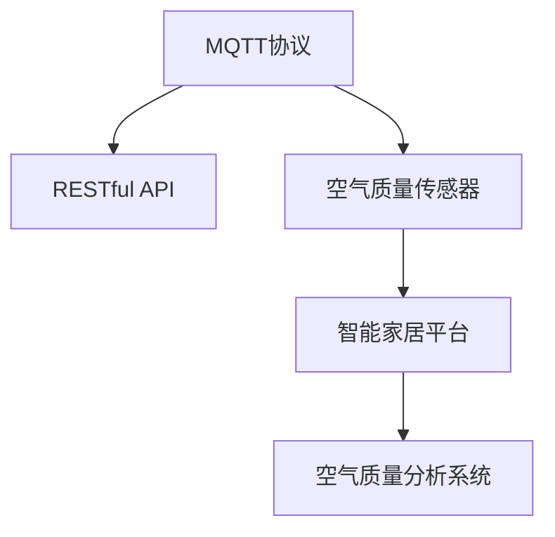

                 

## 1. 背景介绍

### 1.1 问题由来

智能家居（Smart Home）是近年来物联网（IoT）领域的一个热门话题。它通过将家庭设备联网，实现对家居环境的远程控制和智能化管理。随着技术的不断发展，智能家居系统已经具备了包括温度、湿度、照明、安防等在内的多种功能。然而，传统的智能家居系统往往没有对室内空气质量进行监测和分析，这成为了一个重要的潜在健康隐患。

空气质量问题对人们的健康有着直接的影响。例如，室内空气中的有害气体和颗粒物（如甲醛、苯、PM2.5等）会导致呼吸系统疾病、哮喘等健康问题。因此，对室内空气质量进行实时监测和分析，并及时采取干预措施，已经成为智能家居系统不可或缺的功能之一。

### 1.2 问题核心关键点

为了实现对室内空气质量的实时监测和分析，需要构建一个高效的智能家居空气质量分析系统。该系统应具备以下特点：

- **实时性**：系统应能够实时监测室内空气质量，并及时更新监测结果，以便用户及时采取措施。
- **易用性**：系统应界面友好、操作简便，便于用户轻松获取和理解监测结果。
- **可扩展性**：系统应具备良好的可扩展性，以便将来新增其他类型的传感器或功能。
- **安全性**：系统应具备良好的安全性，防止未授权访问和数据泄露。

### 1.3 问题研究意义

通过构建基于MQTT协议和RESTful API的智能家居空气质量分析系统，可以显著提升室内空气质量监测的实时性和准确性，改善用户的健康状况。同时，该系统的可扩展性和易用性也为智能家居系统的未来发展提供了新的方向。此外，系统的安全性设计也有助于保护用户隐私和数据安全，增强用户对系统的信任感。

## 2. 核心概念与联系

### 2.1 核心概念概述

为了理解基于MQTT协议和RESTful API的智能家居空气质量分析系统，需要先了解以下几个核心概念：

- **MQTT（Message Queuing Telemetry Transport）协议**：一种轻量级的、发布/订阅模式的通信协议，广泛应用于物联网设备间的消息传输。
- **RESTful API**：基于REST架构风格的应用程序接口，通过HTTP协议进行通信，易于理解和实现。
- **空气质量传感器**：用于监测室内空气质量的传感器设备，能够实时测量空气中PM2.5、甲醛、二氧化碳等有害物质的浓度。
- **智能家居平台**：用于集成和控制各种智能家居设备的平台，支持MQTT协议和RESTful API进行通信。

这些概念之间的逻辑关系可以通过以下Mermaid流程图来展示：



这个流程图展示了MQTT协议、RESTful API、空气质量传感器和智能家居平台之间的关系：

1. 空气质量传感器通过MQTT协议将空气质量数据发送到智能家居平台。
2. 智能家居平台通过RESTful API将空气质量数据提供给空气质量分析系统。
3. 空气质量分析系统接收空气质量数据，进行实时分析并展示结果。

## 3. 核心算法原理 & 具体操作步骤

### 3.1 算法原理概述

基于MQTT协议和RESTful API的智能家居空气质量分析系统主要包括以下几个关键步骤：

1. **数据采集**：通过MQTT协议将空气质量传感器采集的数据传输到智能家居平台。
2. **数据存储**：智能家居平台将数据存储在数据库中。
3. **数据处理**：利用RESTful API将数据传输到空气质量分析系统进行实时处理和分析。
4. **结果展示**：空气质量分析系统将处理结果通过RESTful API展示给用户。

### 3.2 算法步骤详解

#### 3.2.1 MQTT协议的配置和连接

MQTT协议配置和连接是智能家居空气质量分析系统的第一步。具体步骤如下：

1. 安装MQTT broker软件，如Mosquitto。
2. 启动MQTT broker服务，并配置broker地址和端口。
3. 在空气质量传感器设备上安装MQTT客户端库，如Paho MQTT。
4. 通过MQTT客户端连接到MQTT broker。
5. 设置订阅主题，并等待接收到传感器发送的数据。

#### 3.2.2 RESTful API的设计和实现

RESTful API是智能家居空气质量分析系统的核心部分，用于数据的存储、处理和展示。具体步骤如下：

1. 定义API接口，如数据采集接口、数据存储接口、数据分析接口和数据展示接口。
2. 使用RESTful API框架，如Flask或Spring Boot，实现API接口的逻辑处理。
3. 在API接口中使用数据库存储数据，如MySQL或MongoDB。
4. 对API接口进行测试，确保其正常运行。

#### 3.2.3 空气质量数据的处理和分析

空气质量数据的处理和分析是智能家居空气质量分析系统的关键部分。具体步骤如下：

1. 从数据库中读取空气质量数据。
2. 对数据进行清洗和预处理，如去除异常值、填充缺失值等。
3. 使用机器学习算法对数据进行建模和分析，如线性回归、支持向量机、神经网络等。
4. 对分析结果进行可视化展示，如绘制图表、生成报告等。

#### 3.2.4 结果展示界面的设计和实现

结果展示界面是智能家居空气质量分析系统的最后一步。具体步骤如下：

1. 设计界面布局，如仪表盘、图表等。
2. 使用Web前端技术，如HTML、CSS和JavaScript，实现界面展示。
3. 通过RESTful API从数据存储模块获取分析结果。
4. 动态更新界面，展示实时空气质量数据和分析结果。

### 3.3 算法优缺点

基于MQTT协议和RESTful API的智能家居空气质量分析系统具有以下优点：

1. **实时性**：通过MQTT协议，空气质量数据可以实时传输到智能家居平台和空气质量分析系统，保证了监测的实时性。
2. **易用性**：RESTful API的设计简单易用，用户可以通过Web界面轻松获取和理解空气质量数据。
3. **可扩展性**：RESTful API和MQTT协议支持多种数据类型和通信方式，便于未来新增其他传感器或功能。
4. **安全性**：通过MQTT协议和RESTful API的安全机制，可以防止未授权访问和数据泄露，保护用户隐私和数据安全。

同时，该系统也存在以下缺点：

1. **网络延迟**：MQTT协议和RESTful API的通信依赖网络，可能会受到网络延迟和带宽限制的影响。
2. **数据丢失**：在网络不稳定的情况下，可能会发生数据丢失或延迟传输的情况。
3. **数据精度**：空气质量传感器可能会受到环境因素的影响，导致测量数据存在一定误差。
4. **资源消耗**：RESTful API和MQTT协议的通信过程可能会消耗较多的系统资源，需要优化以提高效率。

### 3.4 算法应用领域

基于MQTT协议和RESTful API的智能家居空气质量分析系统可以广泛应用于以下几个领域：

1. **智能家居**：通过集成空气质量传感器，实现室内空气质量的实时监测和分析，提升用户的健康和生活质量。
2. **医院和医疗机构**：通过监测室内空气质量，预防和控制医院感染和疾病的传播，保障患者的健康和安全。
3. **办公室和商业场所**：通过监测室内空气质量，改善工作环境，提升员工的效率和幸福感。
4. **交通工具**：通过监测车内空气质量，保障乘客的呼吸健康，提高交通工具的舒适度和安全性。

## 4. 数学模型和公式 & 详细讲解 & 举例说明

### 4.1 数学模型构建

基于MQTT协议和RESTful API的智能家居空气质量分析系统主要涉及以下几个数学模型：

1. **数据采集模型**：用于描述MQTT协议的通信过程和数据传输。
2. **数据存储模型**：用于描述RESTful API的数据存储过程和数据结构。
3. **数据处理模型**：用于描述机器学习算法的数据建模和分析过程。
4. **结果展示模型**：用于描述Web界面的展示过程和用户交互。

### 4.2 公式推导过程

以线性回归模型为例，推导空气质量分析的具体数学公式。

假设有一组空气质量数据 $(x_i, y_i)$，其中 $x_i$ 为空气质量指标（如PM2.5浓度），$y_i$ 为相应的监测结果（如是否超标）。通过线性回归模型，可以建立 $x_i$ 和 $y_i$ 之间的关系：

$$
y_i = \beta_0 + \beta_1 x_i + \epsilon_i
$$

其中 $\beta_0$ 和 $\beta_1$ 为模型的参数，$\epsilon_i$ 为随机误差项。

通过最小二乘法，可以求解 $\beta_0$ 和 $\beta_1$：

$$
\hat{\beta}_0 = \frac{\sum_{i=1}^n (y_i - \hat{y}_i)}{\sum_{i=1}^n (x_i - \bar{x})^2}
$$
$$
\hat{\beta}_1 = \frac{\sum_{i=1}^n (x_i - \bar{x})(y_i - \bar{y})}{\sum_{i=1}^n (x_i - \bar{x})^2}
$$

其中 $\bar{x}$ 和 $\bar{y}$ 分别为 $x$ 和 $y$ 的均值。

### 4.3 案例分析与讲解

以PM2.5监测为例，推导线性回归模型的具体实现步骤。

1. **数据采集**：通过MQTT协议从空气质量传感器采集PM2.5浓度数据。
2. **数据存储**：将采集到的PM2.5数据存储到RESTful API的数据库中。
3. **数据处理**：使用线性回归模型对存储的数据进行建模和分析，预测PM2.5是否超标。
4. **结果展示**：将分析结果通过RESTful API展示在Web界面上，如图表和报告。

## 5. 项目实践：代码实例和详细解释说明

### 5.1 开发环境搭建

在进行智能家居空气质量分析系统的开发前，需要先搭建开发环境。以下是使用Python进行开发的环境配置流程：

1. 安装Python：从官网下载并安装Python 3.x版本。
2. 安装MQTT broker软件：如Mosquitto，并配置broker地址和端口。
3. 安装RESTful API框架：如Flask或Spring Boot。
4. 安装数据存储数据库：如MySQL或MongoDB。
5. 安装Web前端框架：如React或Vue。

完成上述步骤后，即可在开发环境中开始系统的开发和调试。

### 5.2 源代码详细实现

以下是使用Python和Flask框架实现基于MQTT协议和RESTful API的智能家居空气质量分析系统的代码实现。

#### 5.2.1 MQTT协议的实现

```python
import paho.mqtt.client as mqtt

class MQTTClient:
    def __init__(self, broker, topic, username, password):
        self.broker = broker
        self.topic = topic
        self.username = username
        self.password = password
        self.client = mqtt.Client()

    def connect(self):
        self.client.username_pw_set(self.username, self.password)
        self.client.connect(self.broker, 1883, 60)
        self.client.subscribe(self.topic)

    def publish(self, data):
        self.client.publish(self.topic, data)
```

#### 5.2.2 RESTful API的设计和实现

```python
from flask import Flask, jsonify, request

app = Flask(__name__)

@app.route('/air-quality-data', methods=['POST'])
def air_quality_data():
    data = request.json
    # 存储数据到数据库
    # ...
    return jsonify({'status': 'success'})

@app.route('/analyze-air-quality', methods=['POST'])
def analyze_air_quality():
    data = request.json
    # 读取数据并进行分析
    # ...
    result = {}
    # 生成分析结果
    # ...
    return jsonify(result)

@app.route('/display-air-quality', methods=['GET'])
def display_air_quality():
    # 获取分析结果并进行展示
    # ...
    return jsonify(result)

if __name__ == '__main__':
    app.run(debug=True)
```

#### 5.2.3 空气质量数据的处理和分析

```python
import pandas as pd
from sklearn.linear_model import LinearRegression

class AirQualityAnalyzer:
    def __init__(self):
        self.model = LinearRegression()

    def fit(self, data):
        X = data[['PM2.5']]
        y = data['status']
        self.model.fit(X, y)

    def predict(self, data):
        X = data[['PM2.5']]
        y = self.model.predict(X)
        return y
```

#### 5.2.4 结果展示界面的设计和实现

```html
<!DOCTYPE html>
<html>
<head>
    <title>智能家居空气质量分析</title>
    <script src="https://cdn.jsdelivr.net/npm/chart.js"></script>
</head>
<body>
    <h1>智能家居空气质量分析</h1>
    <div>
        <canvas id="pm2.5-chart"></canvas>
    </div>
    <script>
        const ctx = document.getElementById('pm2.5-chart').getContext('2d');
        const chart = new Chart(ctx, {
            type: 'line',
            data: {
                labels: [],
                datasets: [{
                    label: 'PM2.5浓度',
                    data: [],
                    borderColor: 'rgba(75, 192, 192, 1)',
                    borderWidth: 1
                }]
            },
            options: {
                scales: {
                    yAxes: [{
                        ticks: {
                            beginAtZero: true
                        }
                    }]
                }
            }
        });
    </script>
    <script>
        // 获取分析结果并进行展示
        // ...
    </script>
</body>
</html>
```

### 5.3 代码解读与分析

以下是关键代码的实现细节：

#### 5.3.1 MQTT协议的实现

在MQTT协议的实现中，使用paho.mqtt.client库实现了MQTT客户端和broker的连接、订阅和发布功能。

#### 5.3.2 RESTful API的设计和实现

在RESTful API的设计和实现中，使用Flask框架实现了数据采集、存储、处理和展示的API接口。其中，`air_quality_data`接口用于存储数据，`analyze_air_quality`接口用于读取数据并进行分析，`display_air_quality`接口用于展示分析结果。

#### 5.3.3 空气质量数据的处理和分析

在空气质量数据的处理和分析中，使用pandas库和scikit-learn库实现了数据读取、清洗、建模和分析的功能。

#### 5.3.4 结果展示界面的设计和实现

在结果展示界面的设计和实现中，使用了HTML和JavaScript技术，并通过Flask API获取分析结果，动态更新界面。

### 5.4 运行结果展示

通过运行上述代码，可以实现智能家居空气质量分析系统的完整功能。用户可以通过Web界面实时查看PM2.5浓度数据和分析结果，并根据需要采取措施，如开窗通风、使用空气净化器等。

## 6. 实际应用场景

### 6.1 智能家居

在智能家居中，基于MQTT协议和RESTful API的智能家居空气质量分析系统可以集成到现有的智能家居平台中，实现对室内空气质量的实时监测和分析。用户可以通过手机App或Web界面查看空气质量数据和分析结果，并根据需要采取措施，提升居住环境的健康和舒适度。

### 6.2 医院和医疗机构

在医院和医疗机构中，该系统可以用于监测室内空气质量，预防和控制医院感染和疾病的传播。通过实时监测空气质量数据，医疗机构可以及时采取措施，如通风、消毒等，保障患者的健康和安全。

### 6.3 办公室和商业场所

在办公室和商业场所中，该系统可以用于监测室内空气质量，改善工作环境，提升员工的效率和幸福感。通过实时监测空气质量数据，办公室和商业场所的管理者可以及时采取措施，如通风、清洁等，提升员工的工作体验。

### 6.4 交通工具

在交通工具中，该系统可以用于监测车内空气质量，保障乘客的呼吸健康，提高交通工具的舒适度和安全性。通过实时监测空气质量数据，交通工具的管理者可以及时采取措施，如通风、清洁等，保障乘客的身体健康。

## 7. 工具和资源推荐

### 7.1 学习资源推荐

为了帮助开发者系统掌握基于MQTT协议和RESTful API的智能家居空气质量分析系统的理论基础和实践技巧，这里推荐一些优质的学习资源：

1. MQTT协议官方文档：Mosquitto官网提供的MQTT协议官方文档，详细介绍了MQTT协议的工作原理和应用场景。
2. RESTful API设计指南：阮一峰的《RESTful API设计指南》，全面介绍了RESTful API的设计原则和实现方法。
3. 空气质量传感器应用开发手册：传感器厂商提供的空气质量传感器应用开发手册，详细介绍了传感器的工作原理和数据接口。
4. 机器学习算法库：Scikit-learn库提供了多种机器学习算法的实现，可以用于空气质量数据的建模和分析。
5. Web前端框架文档：React和Vue的官方文档，详细介绍了Web前端框架的实现方法和应用场景。

通过对这些资源的学习实践，相信你一定能够快速掌握基于MQTT协议和RESTful API的智能家居空气质量分析系统的精髓，并用于解决实际的智能家居问题。

### 7.2 开发工具推荐

高效的开发离不开优秀的工具支持。以下是几款用于智能家居空气质量分析系统开发的常用工具：

1. MQTT broker软件：如Mosquitto，用于实现MQTT协议的通信功能。
2. RESTful API框架：如Flask或Spring Boot，用于实现API接口的逻辑处理。
3. 数据存储数据库：如MySQL或MongoDB，用于存储空气质量数据。
4. Web前端框架：如React或Vue，用于展示分析结果和用户交互。
5. 数据可视化工具：如Chart.js或D3.js，用于绘制空气质量数据的图表。

合理利用这些工具，可以显著提升智能家居空气质量分析系统的开发效率，加快创新迭代的步伐。

### 7.3 相关论文推荐

智能家居空气质量分析系统的研究涉及多个领域的知识，以下是几篇奠基性的相关论文，推荐阅读：

1. MQTT协议标准：ISO/IEC 9974-1:2019 《MQTT-Unified Topic Naming Convention》。
2. RESTful API设计规范：Roy Fielding的《Architectural Styles and the Design of Network-based Software Architectures》。
3. 空气质量监测传感器技术：《室内空气质量监测技术研究综述》。
4. 机器学习算法应用：《机器学习在空气质量监测中的应用》。
5. Web前端技术应用：《Web前端技术在智能家居中的应用》。

这些论文代表了大规模语言模型微调技术的发展脉络。通过学习这些前沿成果，可以帮助研究者把握学科前进方向，激发更多的创新灵感。

## 8. 总结：未来发展趋势与挑战

### 8.1 总结

本文对基于MQTT协议和RESTful API的智能家居空气质量分析系统进行了全面系统的介绍。首先阐述了智能家居空气质量分析系统的背景和意义，明确了系统实时性、易用性、可扩展性和安全性等关键特点。其次，从原理到实践，详细讲解了系统的关键组成部分和实现方法，给出了系统的代码实例和详细解释。同时，本文还广泛探讨了系统的应用场景，展示了系统的广泛应用前景。此外，本文精选了系统的学习资源和开发工具，力求为读者提供全方位的技术指引。

通过本文的系统梳理，可以看到，基于MQTT协议和RESTful API的智能家居空气质量分析系统是物联网和大数据技术在智能家居领域的重要应用，具有广阔的发展前景。未来，伴随技术的不断进步和应用场景的拓展，智能家居空气质量分析系统必将在更多领域得到应用，为人们创造更加健康、舒适的生活环境。

### 8.2 未来发展趋势

展望未来，基于MQTT协议和RESTful API的智能家居空气质量分析系统将呈现以下几个发展趋势：

1. **多传感器融合**：系统将集成更多种类的传感器，如温度、湿度、光照、噪音等，实现对室内环境的全方位监测。
2. **智能分析算法**：系统将引入更高级的机器学习算法，如深度学习、强化学习等，提升数据分析的精度和实时性。
3. **用户行为预测**：系统将利用用户的日常生活数据，预测用户的健康需求和生活习惯，提供更加个性化的服务。
4. **语音控制**：系统将引入语音识别和语音合成技术，实现用户通过语音指令控制和查询空气质量数据。
5. **跨平台互通**：系统将实现与其他智能家居平台和设备的互通，实现更加全面和便捷的家居管理。

以上趋势凸显了智能家居空气质量分析系统的广阔前景。这些方向的探索发展，必将进一步提升系统的性能和用户体验，拓展智能家居系统的应用范围，为人们创造更加健康、便捷的生活环境。

### 8.3 面临的挑战

尽管基于MQTT协议和RESTful API的智能家居空气质量分析系统已经取得了一定的成就，但在迈向更加智能化、普适化应用的过程中，它仍面临着诸多挑战：

1. **数据安全和隐私保护**：系统的数据存储和传输需要保障数据安全和隐私保护，防止数据泄露和恶意攻击。
2. **系统实时性**：系统的实时性需要进一步提升，以满足用户对空气质量数据的高频需求。
3. **系统稳定性**：系统的稳定性和可靠性需要进一步提高，确保系统在各种异常情况下的正常运行。
4. **多设备协同**：系统的多设备协同需要进一步优化，实现不同设备之间的无缝衔接和协调工作。
5. **用户接受度**：系统的易用性和用户体验需要进一步提升，以便用户更好地接受和使用系统。

### 8.4 研究展望

面对基于MQTT协议和RESTful API的智能家居空气质量分析系统所面临的种种挑战，未来的研究需要在以下几个方面寻求新的突破：

1. **数据安全技术**：研发更加高效和可靠的数据加密和传输技术，保障系统的数据安全和隐私保护。
2. **实时数据处理**：引入流处理和大数据技术，提升系统的实时数据处理能力，满足用户对高频数据的需求。
3. **系统稳定性优化**：优化系统的架构设计和算法实现，提高系统的稳定性和可靠性，确保系统在各种异常情况下的正常运行。
4. **多设备协同机制**：引入分布式计算和协同计算技术，实现不同设备之间的无缝衔接和协同工作。
5. **用户体验提升**：提升系统的易用性和用户体验，增强用户的接受度和满意度，促进系统的普及和应用。

通过不断创新和优化，基于MQTT协议和RESTful API的智能家居空气质量分析系统必将在未来取得更加显著的成就，为人们创造更加健康、舒适、便捷的生活环境。

## 9. 附录：常见问题与解答

**Q1: 智能家居空气质量分析系统的实时性如何保证？**

A: 系统的实时性主要通过MQTT协议的轻量级通信和RESTful API的高效处理来实现。MQTT协议采用发布/订阅模式，能够实现低延迟的数据传输。RESTful API采用异步处理和缓存技术，能够快速响应数据请求，提升系统的实时性。

**Q2: 智能家居空气质量分析系统如何保证数据安全和隐私保护？**

A: 系统通过MQTT协议的TLS加密传输和RESTful API的OAuth认证机制，保障数据安全和隐私保护。同时，系统在数据存储和传输过程中，采用数据加密和访问控制技术，防止数据泄露和恶意攻击。

**Q3: 智能家居空气质量分析系统的扩展性如何实现？**

A: 系统的扩展性主要通过RESTful API的模块化和微服务架构实现。系统将各功能模块设计为独立的微服务，便于后续的扩展和升级。同时，系统支持多种数据源和传感器接口，能够灵活集成不同设备和数据类型。

**Q4: 智能家居空气质量分析系统的用户交互如何设计？**

A: 系统的用户交互主要通过Web界面和移动App实现。Web界面采用响应式设计，能够适应不同的设备和屏幕尺寸。移动App采用跨平台开发技术，能够支持iOS和Android系统，提供便捷的用户操作体验。

通过本文的详细讲解和实例分析，相信你能够更好地理解和掌握基于MQTT协议和RESTful API的智能家居空气质量分析系统的原理和实现方法，为智能家居领域的实际应用提供有力支持。

