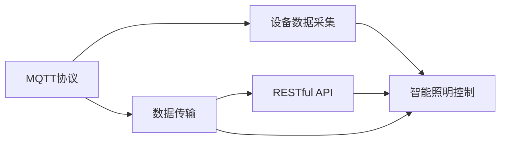

                 

# 基于MQTT协议和RESTful API的智能照明控制系统设计

## 1. 背景介绍

智能照明控制系统正在成为智慧城市和智能建筑的重要组成部分。传统的照明系统主要以人工控制为主，无法实现远程监控和自动化管理，浪费严重且用户体验较差。基于MQTT协议和RESTful API的智能照明控制系统则通过物联网和互联网技术，实现照明设备的数据采集、远程控制和智能管理，大幅提升了照明系统的能效和用户体验。

## 2. 核心概念与联系

### 2.1 核心概念概述

为更好地理解基于MQTT协议和RESTful API的智能照明控制系统，本节将介绍几个密切相关的核心概念：

- MQTT协议（Message Queuing Telemetry Transport Protocol）：一种轻量级的、基于发布-订阅模式的通信协议，用于设备之间的高效数据传输，适用于物联网等资源受限环境。
- RESTful API（Representational State Transfer API）：基于HTTP协议的轻量级Web服务架构，通过请求方法、URI、HTTP状态码等约定，实现客户端与服务器之间的数据交换，适用于互联网应用。
- 智能照明控制系统：结合物联网、云计算和人工智能技术，实现照明设备的智能化管理，包括自动控制、远程控制、节能控制等功能。

这些核心概念之间的逻辑关系可以通过以下Mermaid流程图来展示：



这个流程图展示了MQTT协议、RESTful API以及智能照明控制系统的相互作用：

1. MQTT协议用于设备数据采集，将照明设备的状态和运行数据发送给服务器。
2. RESTful API将MQTT传输过来的数据进行处理和存储，并提供给后端应用进行智能控制。
3. 智能照明控制系统通过RESTful API获取数据，并执行相应的控制逻辑。

## 3. 核心算法原理 & 具体操作步骤
### 3.1 算法原理概述

基于MQTT协议和RESTful API的智能照明控制系统，其实现原理主要基于物联网和Web服务技术，通过设备与服务器之间的数据传输和处理，实现照明设备的智能控制和管理。核心算法流程如下：

1. 设备通过MQTT协议将数据发送到服务器，服务器接收数据后进行处理和存储。
2. 服务器通过RESTful API将数据提供给后端应用进行分析和决策。
3. 后端应用根据决策结果，通过RESTful API向设备发送控制命令。
4. 设备接收到控制命令后，执行相应的控制逻辑，并返回结果给服务器。
5. 服务器将结果通过RESTful API反馈给后端应用，完成一个完整的控制循环。

### 3.2 算法步骤详解

#### 3.2.1 MQTT协议应用

1. 设备启动MQTT客户端，连接到服务器。
2. 设备订阅特定主题，例如：`#/sensor/light`，以接收照明设备传感器发送的数据。
3. 服务器通过MQTT服务器接收到设备订阅请求，并订阅对应的主题。
4. 当照明设备传感器检测到环境变化时，发送消息到主题`#/sensor/light`。
5. 服务器通过MQTT服务器接收到传感器发送的消息，并将其存储到数据库中。

#### 3.2.2 RESTful API应用

1. 后端应用通过HTTP请求访问RESTful API接口，请求获取传感器数据。
2. RESTful API接口接收到请求后，从数据库中读取传感器数据，并转换为JSON格式。
3. RESTful API接口将JSON格式的数据作为响应，返回给后端应用。
4. 后端应用接收到JSON数据后，进行数据分析和处理，并决定控制策略。

#### 3.2.3 智能控制逻辑

1. 后端应用根据传感器数据和用户设置，确定照明设备的目标状态。
2. 后端应用通过RESTful API接口，向照明设备发送控制命令。
3. 照明设备接收到控制命令后，执行相应的控制逻辑，例如：调光、开关、色温调节等。
4. 照明设备执行完成后，通过MQTT协议将状态信息发送给服务器。
5. 服务器接收到照明设备的状态信息后，通过RESTful API接口反馈给后端应用。

### 3.3 算法优缺点

基于MQTT协议和RESTful API的智能照明控制系统具有以下优点：

- 高效率：MQTT协议基于发布-订阅模式，数据传输速度快，适合实时数据采集。
- 低成本：MQTT协议和RESTful API都是轻量级协议，适用于资源受限的物联网设备。
- 可扩展性：系统架构灵活，支持设备和服务器的动态扩展，易于维护和升级。
- 稳定性：RESTful API使用HTTP协议，稳定可靠，支持多种编程语言和操作系统。

同时，该方法也存在以下局限性：

- 安全性：MQTT协议和RESTful API在使用过程中，存在数据被篡改和窃取的风险，需要加强安全防护。
- 实时性：RESTful API使用HTTP协议，相较于MQTT协议，数据传输存在一定的延迟，适用于不实时要求的任务。
- 兼容性：不同厂商的照明设备和服务器，可能需要适配不同的协议和接口，增加系统集成难度。

尽管存在这些局限性，但就目前而言，基于MQTT协议和RESTful API的智能照明控制系统仍是一种高效的物联网解决方案，适用于多数智慧照明应用场景。

### 3.4 算法应用领域

基于MQTT协议和RESTful API的智能照明控制系统，在智慧城市、智能建筑、商业照明等领域得到了广泛应用。具体应用包括：

- 智慧路灯照明系统：通过智能照明控制系统，实现路灯的自动化管理，节能减排，提升照明效果。
- 智能酒店照明系统：根据入住客人和环境变化，动态调整酒店各区域的照明状态，提升客人的体验感。
- 商业照明系统：根据商业活动的不同时段，自动调整照明亮度和颜色，营造最佳购物氛围。
- 办公室照明系统：通过智能照明控制系统，实现办公室照明的自动化管理，提高工作效率和舒适度。
- 户外景观照明系统：通过智能照明控制系统，实现景观照明的自动化控制，提升景观效果。

## 4. 数学模型和公式 & 详细讲解 & 举例说明

### 4.1 数学模型构建

在基于MQTT协议和RESTful API的智能照明控制系统中，涉及的数据模型和逻辑模型如下：

- 传感器数据模型：用于描述照明设备传感器的数据类型和格式，例如：温度、湿度、光线强度等。
- 照明设备模型：用于描述照明设备的类型、状态和控制命令，例如：灯泡、LED灯、调光灯等。
- 控制策略模型：用于描述控制策略的逻辑，例如：光线强度调整、照明设备开关等。

### 4.2 公式推导过程

#### 4.2.1 传感器数据模型

假设传感器数据模型为`{x: float}`，其中x表示传感器采集的数据值。传感器数据通过MQTT协议发送到服务器，其数据模型可以表示为：

$$
D = \{(x_i, t_i)\}_{i=1}^N
$$

其中，$x_i$为第i个传感器采集的数据值，$t_i$为数据的采集时间。

#### 4.2.2 照明设备模型

照明设备模型可以表示为`{id: int, state: bool}`，其中id为设备编号，state为设备状态，例如：开或关。

#### 4.2.3 控制策略模型

控制策略模型可以表示为`{id: int, cmd: str}`，其中id为设备编号，cmd为控制命令，例如：调光、开关等。

### 4.3 案例分析与讲解

假设某办公区有10个LED照明设备，每个设备的状态和控制命令如下：

| 设备编号 | 状态       | 控制命令               |
| -------- | ---------- | ---------------------- |
| 1        | 开         | 调光                  |
| 2        | 开         | 开关                  |
| 3        | 关         | 开关                  |
| 4        | 开         | 调光                  |
| 5        | 开         | 开关                  |
| 6        | 开         | 调光                  |
| 7        | 开         | 开关                  |
| 8        | 开         | 调光                  |
| 9        | 开         | 开关                  |
| 10       | 开         | 调光                  |

假设服务器通过MQTT协议接收到传感器数据，并转换为JSON格式，表示为：

```json
[
  {"sensor_id": 1, "value": 60},
  {"sensor_id": 2, "value": 50},
  {"sensor_id": 3, "value": 40},
  ...
]
```

假设后端应用根据传感器数据和用户设置，决定将设备编号为1的照明设备调光，调光比例为30%。则后端应用通过RESTful API接口向照明设备发送控制命令，其数据模型可以表示为：

```json
{
  "command": {
    "id": 1,
    "cmd": "调光",
    "level": 0.3
  }
}
```

照明设备接收到控制命令后，执行相应的控制逻辑，并返回状态信息，表示为：

```json
{
  "status": {
    "id": 1,
    "state": true
  }
}
```

服务器通过MQTT协议接收到照明设备的状态信息，并将其转换为JSON格式，反馈给后端应用，完成一个完整的控制循环。

## 5. 项目实践：代码实例和详细解释说明
### 5.1 开发环境搭建

在进行智能照明控制系统开发前，我们需要准备好开发环境。以下是使用Python和Node.js进行开发的流程图：

1. 安装Anaconda：从官网下载并安装Anaconda，用于创建独立的Python环境。
2. 创建并激活虚拟环境：
```bash
conda create -n py-env python=3.8 
conda activate py-env
```
3. 安装PyTorch：根据CUDA版本，从官网获取对应的安装命令。例如：
```bash
conda install pytorch torchvision torchaudio cudatoolkit=11.1 -c pytorch -c conda-forge
```
4. 安装TensorFlow：使用pip安装TensorFlow，并指定安装路径。例如：
```bash
pip install tensorflow --upgrade --index-url https://tfhub.dev/google
```
5. 安装Node.js：从官网下载并安装Node.js，用于开发后端应用。
6. 安装MySQL：从官网下载并安装MySQL数据库，用于存储照明设备数据。
7. 安装MQTT库：使用pip安装paho-mqtt，用于开发MQTT客户端和服务器。例如：
```bash
pip install paho-mqtt
```

完成上述步骤后，即可在`py-env`和Node.js环境中开始开发。

### 5.2 源代码详细实现

下面是基于MQTT协议和RESTful API的智能照明控制系统示例代码：

#### 5.2.1 传感器数据采集

```python
from paho.mqtt import client
import json
import time

def on_connect(client, userdata, flags, rc):
    print("Connected with result code "+str(rc))
    # 订阅主题
    client.subscribe("sensor/light", qos=1)

def on_message(client, userdata, msg):
    data = json.loads(msg.payload)
    # 处理传感器数据
    process_sensor_data(data)

def process_sensor_data(data):
    # 将传感器数据保存到数据库中
    # ...

client = client.Client()
client.on_connect = on_connect
client.on_message = on_message
client.connect("mqtt.server.com", 1883, 60)
client.loop_forever()
```

#### 5.2.2 RESTful API接口

```javascript
const express = require('express')
const mysql = require('mysql')
const app = express()

app.use(express.json())

const db = mysql.createConnection({
    host: 'localhost',
    user: 'root',
    password: 'password',
    database: 'light_control'
})

app.get('/sensor/data', (req, res) => {
    // 从数据库中查询传感器数据
    // ...

    res.json(data)
})

app.post('/device/command', (req, res) => {
    const device_id = req.body.id
    const cmd = req.body.cmd
    const level = req.body.level

    // 将控制命令保存到数据库中
    // ...

    res.send({status: true})
})

app.listen(3000, () => {
    console.log('Server started on port 3000')
})
```

#### 5.2.3 控制策略实现

```python
import requests
import time

def control_light(device_id, cmd, level):
    url = f'http://localhost:3000/device/command'
    data = {
        "id": device_id,
        "cmd": cmd,
        "level": level
    }
    response = requests.post(url, json=data)
    if response.status_code == 200:
        print("Command sent successfully")
    else:
        print("Command send failed")

# 控制照明设备调光
control_light(1, "调光", 0.3)
```

### 5.3 代码解读与分析

#### 5.3.1 传感器数据采集

代码通过MQTT客户端订阅`sensor/light`主题，接收到传感器数据后，调用`process_sensor_data`函数进行处理，并保存到数据库中。

#### 5.3.2 RESTful API接口

代码使用Express框架创建HTTP服务器，定义了两个API接口：
- `/sensor/data`接口用于查询传感器数据，从数据库中获取数据并返回JSON格式。
- `/device/command`接口用于发送控制命令，将控制命令保存到数据库中。

#### 5.3.3 控制策略实现

代码通过`requests`库向RESTful API接口发送控制命令，完成照明设备的控制。

### 5.4 运行结果展示

运行以上代码后，可以在浏览器中访问`http://localhost:3000/sensor/data`，获取传感器数据。同时，可以通过`control_light`函数控制照明设备，例如：

```python
control_light(1, "调光", 0.3)
```

即表示将设备编号为1的照明设备调光，调光比例为30%。

## 6. 实际应用场景

基于MQTT协议和RESTful API的智能照明控制系统，在智慧城市、智能建筑、商业照明等领域得到了广泛应用。具体应用包括：

- 智慧路灯照明系统：通过智能照明控制系统，实现路灯的自动化管理，节能减排，提升照明效果。
- 智能酒店照明系统：根据入住客人和环境变化，动态调整酒店各区域的照明状态，提升客人的体验感。
- 商业照明系统：根据商业活动的不同时段，自动调整照明亮度和颜色，营造最佳购物氛围。
- 办公室照明系统：通过智能照明控制系统，实现办公室照明的自动化管理，提高工作效率和舒适度。
- 户外景观照明系统：通过智能照明控制系统，实现景观照明的自动化控制，提升景观效果。

## 7. 工具和资源推荐
### 7.1 学习资源推荐

为了帮助开发者系统掌握基于MQTT协议和RESTful API的智能照明控制系统的理论基础和实践技巧，这里推荐一些优质的学习资源：

1. MQTT官方文档：https://docs.oasis-open.org/mqtt/mqtt/v5.0/os/mqtt-v5.0-os.html
2. RESTful API入门教程：https://www.tutorialspoint.com/restful-api/restful-api-introduction
3. MQTT实战教程：https://www.rapidapi.com/blog/mqtt-mqtt-tutorial-introduction
4. RESTful API最佳实践：https://www.internap.net/blog/five-best-practices-for-restful-api-design/
5. Python和Node.js教程：https://www.w3schools.com/python/
6. Express框架文档：https://expressjs.com/en/

通过对这些资源的学习实践，相信你一定能够快速掌握基于MQTT协议和RESTful API的智能照明控制系统的精髓，并用于解决实际的照明控制问题。

### 7.2 开发工具推荐

高效的开发离不开优秀的工具支持。以下是几款用于基于MQTT协议和RESTful API的智能照明控制系统开发的常用工具：

1. Python：Python语言简单易学，支持丰富的第三方库，适合数据处理和后端开发。
2. Node.js：Node.js异步非阻塞的I/O特性，适合实时数据处理和前端开发。
3. MySQL：MySQL数据库稳定可靠，支持大规模数据存储和管理。
4. paho-mqtt：paho-mqtt是MQTT协议的客户端库，支持Python和Node.js等语言。
5. Express框架：Express框架是Node.js的Web开发框架，支持RESTful API开发。
6. Git：Git版本控制系统，支持多人协作开发和代码管理。

合理利用这些工具，可以显著提升基于MQTT协议和RESTful API的智能照明控制系统的开发效率，加快创新迭代的步伐。

### 7.3 相关论文推荐

基于MQTT协议和RESTful API的智能照明控制系统的发展源于学界的持续研究。以下是几篇奠基性的相关论文，推荐阅读：

1. MQTT协议设计原理：https://doi.org/10.1016/j.asoc.2016.05.012
2. RESTful API架构设计：https://www.ics.uci.edu
3. 物联网与智能照明系统：https://www.researchgate.net/publication/328784948
4. 基于MQTT协议的照明系统设计：https://www.sciencedirect.com/science/article/pii/S2329493618300796
5. RESTful API安全性：https://wwwieeexplore.ieee.org/document/8847508

这些论文代表了大语言模型微调技术的发展脉络。通过学习这些前沿成果，可以帮助研究者把握学科前进方向，激发更多的创新灵感。

## 8. 总结：未来发展趋势与挑战

### 8.1 总结

本文对基于MQTT协议和RESTful API的智能照明控制系统进行了全面系统的介绍。首先阐述了智能照明控制系统的背景和意义，明确了基于MQTT协议和RESTful API在实现智能照明控制系统中的重要价值。其次，从原理到实践，详细讲解了智能照明控制系统的实现流程，给出了完整的代码实例。同时，本文还广泛探讨了智能照明控制系统的应用场景，展示了智能照明控制系统的广阔应用前景。

通过本文的系统梳理，可以看到，基于MQTT协议和RESTful API的智能照明控制系统正在成为智慧城市和智能建筑的重要组成部分，极大地提升了照明系统的能效和用户体验。未来，伴随技术的不断发展，基于MQTT协议和RESTful API的智能照明控制系统必将在更广泛的领域得到应用，推动智慧照明系统的规模化落地。

### 8.2 未来发展趋势

展望未来，基于MQTT协议和RESTful API的智能照明控制系统将呈现以下几个发展趋势：

1. 设备互联互通：随着物联网技术的发展，更多的设备将支持MQTT协议，实现设备之间的互联互通，提升系统整体性能。
2. 数据实时处理：随着5G和边缘计算技术的发展，设备的数据处理能力将进一步提升，实时数据采集和处理能力将得到加强。
3. 智能控制算法：未来的智能照明控制系统将引入更多的智能控制算法，例如：预测控制、优化控制等，提升照明效果和能效。
4. 场景感知能力：未来的智能照明控制系统将具备更强的场景感知能力，根据不同的场景和用户需求，自动调整照明状态。
5. 边缘计算应用：随着边缘计算技术的发展，智能照明控制系统将更多地在前端进行处理，减少数据传输的延迟和带宽消耗。
6. 多模态信息融合：未来的智能照明控制系统将引入更多的传感器数据和外部信息，实现视觉、温度、湿度等多模态信息的融合。

以上趋势凸显了基于MQTT协议和RESTful API的智能照明控制系统的广阔前景。这些方向的探索发展，必将进一步提升智能照明控制系统的性能和应用范围，为智慧城市和智能建筑带来更多的变革性影响。

### 8.3 面临的挑战

尽管基于MQTT协议和RESTful API的智能照明控制系统已经取得了显著成果，但在迈向更加智能化、普适化应用的过程中，它仍面临着诸多挑战：

1. 安全性：MQTT协议和RESTful API在使用过程中，存在数据被篡改和窃取的风险，需要加强安全防护。
2. 实时性：RESTful API使用HTTP协议，相较于MQTT协议，数据传输存在一定的延迟，适用于不实时要求的任务。
3. 设备兼容性：不同厂商的照明设备和服务器，可能需要适配不同的协议和接口，增加系统集成难度。
4. 数据存储和处理：大规模照明设备的实时数据处理需要高吞吐量的存储和处理能力，增加系统部署成本。
5. 算法复杂度：引入更多智能控制算法和传感器数据，增加了算法的复杂度，需要高效的算法优化。
6. 用户需求多样化：不同用户的需求和使用场景各不相同，需要提供多样化的控制方案和个性化的服务。

尽管存在这些挑战，但相信通过技术创新和协同合作，基于MQTT协议和RESTful API的智能照明控制系统必将克服这些难题，为智慧城市和智能建筑带来更多价值。

### 8.4 研究展望

未来的研究需要在以下几个方面寻求新的突破：

1. 数据采集与处理：研究高效的传感器数据采集和处理技术，提升数据采集的准确性和实时性。
2. 智能控制算法：开发更加高效的智能控制算法，实现更优的照明效果和能效。
3. 边缘计算应用：探索边缘计算在智能照明控制中的应用，减少数据传输延迟和带宽消耗。
4. 设备互联互通：推动设备厂商支持MQTT协议，实现设备之间的互联互通。
5. 安全性增强：研究基于MQTT协议和RESTful API的安全防护技术，提升系统的安全性。
6. 用户需求分析：研究用户需求和使用场景，提供多样化的控制方案和个性化的服务。

这些研究方向的探索，必将引领基于MQTT协议和RESTful API的智能照明控制系统向更高的台阶发展，为智慧城市和智能建筑带来更多的变革性影响。

## 9. 附录：常见问题与解答

**Q1: 如何提高基于MQTT协议和RESTful API的智能照明控制系统的实时性？**

A: 提高基于MQTT协议和RESTful API的智能照明控制系统的实时性，可以从以下几个方面进行优化：

1. 优化数据采集方式：通过多线程或异步处理方式，减少数据采集的延迟。
2. 优化数据传输方式：使用长连接或轮询方式，减少数据传输的延迟。
3. 优化数据处理方式：使用分布式计算或边缘计算，减少数据处理的延迟。
4. 优化算法设计：设计高效的算法，减少数据处理的计算量。
5. 优化网络架构：使用CDN或缓存技术，减少网络延迟。

通过以上优化措施，可以有效提升基于MQTT协议和RESTful API的智能照明控制系统的实时性，满足更多实时要求的应用场景。

**Q2: 如何提高基于MQTT协议和RESTful API的智能照明控制系统的安全性？**

A: 提高基于MQTT协议和RESTful API的智能照明控制系统的安全性，可以从以下几个方面进行优化：

1. 使用SSL/TLS加密：在数据传输过程中使用SSL/TLS加密，防止数据被窃取或篡改。
2. 身份验证机制：采用用户名密码、数字证书等身份验证机制，防止非法访问。
3. 访问控制机制：采用ACL或RBAC等访问控制机制，限制访问权限。
4. 数据加密存储：在数据库中存储数据时，使用AES等加密算法，防止数据泄露。
5. 审计和监控：实时监控系统运行状态，记录操作日志，方便异常排查和安全性提升。

通过以上优化措施，可以有效提升基于MQTT协议和RESTful API的智能照明控制系统的安全性，保护数据和系统的安全。

**Q3: 如何优化基于MQTT协议和RESTful API的智能照明控制系统的资源消耗？**

A: 优化基于MQTT协议和RESTful API的智能照明控制系统的资源消耗，可以从以下几个方面进行优化：

1. 设备资源优化：优化设备的硬件配置，减少资源消耗。
2. 数据传输优化：优化数据传输协议，减少带宽消耗。
3. 算法优化：优化算法设计，减少计算量。
4. 缓存优化：使用缓存技术，减少重复计算。
5. 资源管理：合理分配和管理系统资源，防止资源浪费。

通过以上优化措施，可以有效降低基于MQTT协议和RESTful API的智能照明控制系统的资源消耗，提升系统的性能和稳定性。

---

作者：禅与计算机程序设计艺术 / Zen and the Art of Computer Programming

