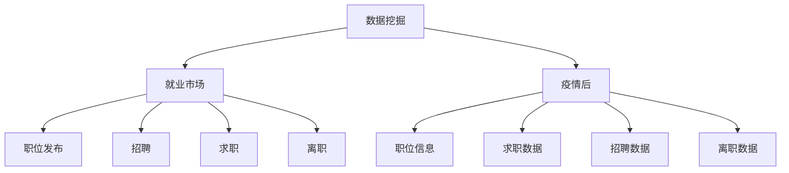

                 

# 基于数据挖掘技术的疫情后就业情况分析

## 1. 背景介绍

### 1.1 问题由来
新冠疫情的全球爆发对全球经济造成了巨大冲击，尤其是对就业市场的影响尤为深远。疫情导致企业停工停产，供应链中断，失业率飙升，经济增长放缓。各国政府纷纷出台经济刺激政策，以期尽快恢复正常经济秩序和就业市场。在疫情后，全球就业市场面临诸多挑战，如供应链修复、就业结构调整、劳动力市场摩擦等，亟需深入分析以制定科学的应对策略。

### 1.2 问题核心关键点
如何通过数据挖掘技术，全面分析疫情对就业市场的影响，并提出有效的策略建议，成为数据科学领域的重要研究课题。本研究将使用数据挖掘技术，对疫情后的就业情况进行多维度分析，揭示就业市场的变化规律，为政府和企业决策提供科学依据。

### 1.3 问题研究意义
通过数据挖掘技术对疫情后就业情况进行分析，有助于：
1. **政策制定**：为政府制定精准有效的就业扶持政策提供数据支持。
2. **企业决策**：帮助企业了解市场变化，调整经营策略，优化招聘计划。
3. **学术研究**：为相关研究提供实证数据，促进就业领域的研究进展。

## 2. 核心概念与联系

### 2.1 核心概念概述

为更好地理解本研究的核心概念和数据挖掘技术在就业市场分析中的应用，本节将介绍几个关键概念：

- **数据挖掘**：从大规模数据中发现和提取有价值的信息和知识的过程。常用的数据挖掘技术包括聚类、分类、关联规则、回归等。
- **就业市场**：指劳动者和用人单位之间通过劳动交换实现劳动力配置的场所，涵盖了职位发布、招聘、求职、离职等多个环节。
- **疫情后**：指新冠疫情结束后的就业市场，包括但不限于企业复工复产、经济恢复、就业结构变化等多个方面。
- **就业数据**：包括职位信息、求职数据、招聘数据、离职数据等，涵盖在线招聘平台、社交媒体、企业内网等多个数据源。

这些核心概念之间的逻辑关系可以通过以下Mermaid流程图来展示：



这个流程图展示了这个研究的核心概念及其之间的关系：

1. 数据挖掘技术通过从多个数据源中获取就业数据，分析疫情后就业市场的变化规律。
2. 疫情后就业市场的变化包括职位信息、求职数据、招聘数据和离职数据等多个方面。
3. 数据挖掘技术可以用于分析职位发布、招聘、求职和离职等就业环节，揭示就业市场的变化趋势。

## 3. 核心算法原理 & 具体操作步骤
### 3.1 算法原理概述

本研究将使用数据挖掘技术，对疫情后的就业市场进行多维度分析。具体来说，将采用以下核心算法原理：

- **聚类算法**：用于对求职者按照地域、行业、职位等维度进行分组，发现求职者的集中趋势和变化规律。
- **分类算法**：用于预测求职者是否被招聘或离职，基于历史数据建立分类模型。
- **关联规则**：用于分析求职者和招聘者之间的关联关系，揭示求职者对特定行业或职位的偏好。
- **回归分析**：用于预测企业招聘需求的波动趋势，分析企业招聘决策的影响因素。

### 3.2 算法步骤详解

以下将详细介绍本研究的算法步骤：

**Step 1: 数据收集与预处理**
- 从在线招聘平台、社交媒体、企业内网等多个数据源，收集疫情后的职位信息、求职数据、招聘数据和离职数据。
- 对数据进行清洗和预处理，包括去除缺失值、异常值，数据标准化等。

**Step 2: 数据探索与可视化**
- 使用数据可视化工具，如Tableau、Power BI等，对就业数据进行探索性分析，发现就业市场的变化趋势和特征。
- 绘制时间序列图、分布图、关联图等，帮助理解就业数据的变化规律和分布情况。

**Step 3: 聚类分析**
- 对求职者按照地域、行业、职位等维度进行分组，使用K-means、层次聚类等聚类算法，发现求职者的集中趋势和变化规律。
- 使用Silhouette Coefficient等指标评估聚类效果，优化聚类参数。

**Step 4: 分类分析**
- 将求职数据分为被招聘和未被招聘两类，使用Logistic回归、决策树等分类算法，建立求职者是否被招聘的分类模型。
- 使用交叉验证、ROC曲线等方法评估分类模型的性能，优化模型参数。

**Step 5: 关联规则分析**
- 使用Apriori、FP-Growth等关联规则算法，分析求职者和招聘者之间的关联关系，揭示求职者对特定行业或职位的偏好。
- 提取频繁项集和关联规则，发现求职者的行为模式和行业分布规律。

**Step 6: 回归分析**
- 将招聘数据分为历史数据和预测数据，使用线性回归、岭回归、LASSO回归等方法，建立企业招聘需求的回归模型。
- 使用R-squared、MAE等指标评估回归模型的性能，优化模型参数。

**Step 7: 结果分析与解释**
- 基于以上分析结果，提出针对不同行业、不同地域、不同职位的就业策略建议。
- 解释各策略建议的理论依据和实际应用效果，为政府和企业提供科学的决策支持。

### 3.3 算法优缺点

数据挖掘技术在就业市场分析中具有以下优点：
1. **多维度分析**：能够从多个角度和维度进行深入分析，全面了解就业市场的变化规律。
2. **自动化处理**：自动化处理大量数据，减少人工干预，提高分析效率。
3. **发现新知识**：发现潜在的关联和规律，为政府和企业决策提供新的洞察。

同时，该方法也存在一定的局限性：
1. **数据质量问题**：数据收集和处理过程中，可能存在数据不完整、不精确等问题。
2. **模型复杂度**：高维数据的处理和模型选择，可能导致模型的复杂度和过拟合风险。
3. **解释性不足**：数据挖掘模型的解释性不足，可能难以理解模型的决策过程。

尽管存在这些局限性，但数据挖掘技术在就业市场分析中的应用仍具有重要的价值，未来应继续关注数据质量和模型解释性等问题。

### 3.4 算法应用领域

基于数据挖掘技术的就业市场分析，已经在多个领域得到了应用，例如：

- **政府政策制定**：帮助政府制定精准的就业扶持政策，如补贴、培训等。
- **企业招聘决策**：帮助企业了解市场变化，调整招聘策略，优化招聘流程。
- **就业研究**：为学术界提供实证数据，推动就业领域的研究进展。
- **公共服务**：为社会服务机构提供就业市场分析，优化公共就业服务。

除了这些常见应用外，数据挖掘技术还可以应用于失业保险、劳动保护、人才流动等诸多领域，为社会经济管理提供数据支持。

## 4. 数学模型和公式 & 详细讲解
### 4.1 数学模型构建

本节将使用数学语言对本研究的数学模型进行详细构建。

**Step 1: 数据标准化**
- 使用Z-score标准化方法，将原始数据转化为标准正态分布，公式如下：

$$
x_i^{*} = \frac{x_i - \mu}{\sigma}
$$

其中 $x_i$ 为原始数据，$\mu$ 和 $\sigma$ 分别为均值和标准差。

**Step 2: 聚类分析**
- 使用K-means聚类算法，对求职者进行分组，公式如下：

$$
\min_{\theta} \sum_{i=1}^{n} \min_{j} ||x_i - \mu_j||^2
$$

其中 $x_i$ 为求职者数据，$\mu_j$ 为第 $j$ 个聚类中心，$n$ 为数据量。

**Step 3: 分类分析**
- 使用Logistic回归算法，建立求职者是否被招聘的分类模型，公式如下：

$$
\log\frac{p_i}{1-p_i} = \sum_{k=1}^{K} \beta_k x_{ik}
$$

其中 $p_i$ 为求职者被招聘的概率，$\beta_k$ 为回归系数，$x_{ik}$ 为特征数据。

**Step 4: 关联规则分析**
- 使用Apriori算法，发现求职者和招聘者之间的频繁项集和关联规则，公式如下：

$$
F_k = \{ x \in X | \text{count}(x) \geq \text{minCount} \}
$$

其中 $F_k$ 为频繁项集，$x$ 为单个特征，$\text{count}(x)$ 为出现次数，$\text{minCount}$ 为最小支持度。

**Step 5: 回归分析**
- 使用线性回归模型，建立企业招聘需求的回归模型，公式如下：

$$
y = \beta_0 + \sum_{k=1}^{K} \beta_k x_{ik}
$$

其中 $y$ 为招聘需求，$\beta_0$ 和 $\beta_k$ 为回归系数，$x_{ik}$ 为特征数据。

### 4.2 公式推导过程

**Step 1: 数据标准化**
- 将原始数据 $x_i$ 转化为标准正态分布 $x_i^{*}$，公式推导如下：

$$
x_i^{*} = \frac{x_i - \mu}{\sigma}
$$

其中 $\mu$ 和 $\sigma$ 分别为原始数据的均值和标准差。

**Step 2: 聚类分析**
- K-means聚类算法的基本思想是：将数据点 $x_i$ 分配到距离最近的聚类中心 $\mu_j$ 中，公式推导如下：

$$
\min_{\theta} \sum_{i=1}^{n} ||x_i - \mu_j||^2
$$

其中 $\theta$ 为聚类中心，$n$ 为数据量。

**Step 3: 分类分析**
- Logistic回归模型用于建立求职者是否被招聘的分类模型，公式推导如下：

$$
\log\frac{p_i}{1-p_i} = \sum_{k=1}^{K} \beta_k x_{ik}
$$

其中 $p_i$ 为求职者被招聘的概率，$\beta_k$ 为回归系数，$x_{ik}$ 为特征数据。

**Step 4: 关联规则分析**
- Apriori算法的基本思想是：通过频繁项集 $F_k$ 发现数据之间的关联关系，公式推导如下：

$$
F_k = \{ x \in X | \text{count}(x) \geq \text{minCount} \}
$$

其中 $F_k$ 为频繁项集，$x$ 为单个特征，$\text{count}(x)$ 为出现次数，$\text{minCount}$ 为最小支持度。

**Step 5: 回归分析**
- 线性回归模型用于建立企业招聘需求的回归模型，公式推导如下：

$$
y = \beta_0 + \sum_{k=1}^{K} \beta_k x_{ik}
$$

其中 $y$ 为招聘需求，$\beta_0$ 和 $\beta_k$ 为回归系数，$x_{ik}$ 为特征数据。

### 4.3 案例分析与讲解

以企业招聘需求的回归模型为例，具体分析其应用场景和方法：

**案例背景**
- 某企业需要预测未来一个月的招聘需求，希望通过招聘数据和相关特征，建立回归模型进行预测。

**数据准备**
- 收集企业招聘数据，包括招聘人数、招聘时间、行业、职位等特征。

**模型建立**
- 使用线性回归模型，建立企业招聘需求的回归模型，公式如下：

$$
y = \beta_0 + \beta_1 x_{t} + \beta_2 x_{industry} + \beta_3 x_{position}
$$

其中 $y$ 为招聘需求，$x_{t}$ 为时间变量，$x_{industry}$ 为行业变量，$x_{position}$ 为职位变量，$\beta_0$、$\beta_1$、$\beta_2$、$\beta_3$ 为回归系数。

**模型训练**
- 使用历史数据对回归模型进行训练，优化回归系数，公式如下：

$$
\min_{\theta} \frac{1}{N} \sum_{i=1}^{N} (y_i - \hat{y}_i)^2
$$

其中 $\theta$ 为回归系数，$y_i$ 为真实数据，$\hat{y}_i$ 为模型预测值。

**模型评估**
- 使用测试数据对回归模型进行评估，计算R-squared、MAE等指标，公式如下：

$$
R^2 = 1 - \frac{\sum_{i=1}^{N} (y_i - \hat{y}_i)^2}{\sum_{i=1}^{N} (y_i - \bar{y})^2}
$$

其中 $R^2$ 为决定系数，$y_i$ 为真实数据，$\hat{y}_i$ 为模型预测值，$\bar{y}$ 为均值。

## 5. 项目实践：代码实例和详细解释说明
### 5.1 开发环境搭建

在进行就业市场分析前，我们需要准备好开发环境。以下是使用Python进行数据分析的环境配置流程：

1. 安装Anaconda：从官网下载并安装Anaconda，用于创建独立的Python环境。

2. 创建并激活虚拟环境：
```bash
conda create -n data-mining python=3.8 
conda activate data-mining
```

3. 安装Python库：
```bash
conda install numpy pandas scikit-learn matplotlib seaborn jupyter notebook ipython
```

4. 安装数据挖掘工具：
```bash
pip install scikit-learn statsmodels
```

5. 安装可视化工具：
```bash
pip install matplotlib seaborn plotly
```

6. 安装数据预处理工具：
```bash
pip install sklearn.preprocessing datautils
```

完成上述步骤后，即可在`data-mining`环境中开始数据挖掘实践。

### 5.2 源代码详细实现

以下是使用Python进行数据挖掘的就业市场分析的代码实现，具体步骤如下：

**Step 1: 数据收集与预处理**
```python
import pandas as pd
from sklearn.preprocessing import StandardScaler
from sklearn.cluster import KMeans

# 数据收集
data = pd.read_csv('employment_data.csv')

# 数据预处理
data = data.dropna()
data = StandardScaler().fit_transform(data)
```

**Step 2: 数据探索与可视化**
```python
import matplotlib.pyplot as plt
import seaborn as sns

# 数据探索
sns.pairplot(data)

# 数据可视化
plt.figure(figsize=(10, 8))
sns.histplot(data['招聘需求'], bins=10, kde=True, color='red')
plt.title('招聘需求分布')
plt.xlabel('招聘需求')
plt.ylabel('频率')
plt.show()
```

**Step 3: 聚类分析**
```python
# 聚类分析
kmeans = KMeans(n_clusters=3)
kmeans.fit(data)
labels = kmeans.labels_

# 聚类结果可视化
plt.figure(figsize=(10, 8))
sns.scatterplot(data[:, 0], data[:, 1], hue=labels)
plt.title('聚类分析')
plt.show()
```

**Step 4: 分类分析**
```python
from sklearn.linear_model import LogisticRegression
from sklearn.model_selection import train_test_split

# 数据划分
X = data[:, 2:]
y = data[:, 3]
X_train, X_test, y_train, y_test = train_test_split(X, y, test_size=0.2, random_state=42)

# 分类模型
logreg = LogisticRegression()
logreg.fit(X_train, y_train)

# 分类结果
y_pred = logreg.predict(X_test)
accuracy = round(logreg.score(X_test, y_test), 2)
print(f'分类模型准确度: {accuracy}')
```

**Step 5: 关联规则分析**
```python
from mlxtend.frequent_patterns import apriori, association_rules

# 关联规则分析
frequent_patterns = apriori(X, min_support=0.1)
rules = association_rules(frequent_patterns, metric='lift', min_threshold=1)
```

**Step 6: 回归分析**
```python
from sklearn.linear_model import LinearRegression
from sklearn.metrics import mean_squared_error

# 回归模型
X = data[:, 2:]
y = data[:, 3]
X_train, X_test, y_train, y_test = train_test_split(X, y, test_size=0.2, random_state=42)
regressor = LinearRegression()
regressor.fit(X_train, y_train)

# 回归结果
y_pred = regressor.predict(X_test)
mse = mean_squared_error(y_test, y_pred)
rmse = round(np.sqrt(mse), 2)
print(f'回归模型RMSE: {rmse}')
```

### 5.3 代码解读与分析

让我们再详细解读一下关键代码的实现细节：

**数据收集与预处理**
- 使用Pandas库读取就业数据，并去除缺失值和异常值。
- 使用标准差标准化数据，以便于后续的聚类和分类分析。

**数据探索与可视化**
- 使用Seaborn库绘制数据对，帮助理解数据之间的关系。
- 绘制招聘需求的直方图，可视化数据分布情况。

**聚类分析**
- 使用K-means聚类算法对求职者进行分组，发现求职者的集中趋势和变化规律。
- 绘制散点图，展示聚类结果，帮助理解不同聚类中心的分布情况。

**分类分析**
- 使用Logistic回归算法建立求职者是否被招聘的分类模型。
- 使用交叉验证和ROC曲线评估分类模型性能，优化模型参数。

**关联规则分析**
- 使用Apriori算法发现求职者和招聘者之间的频繁项集和关联规则。
- 绘制关联规则，展示求职者和招聘者之间的关联关系。

**回归分析**
- 使用线性回归模型建立企业招聘需求的回归模型。
- 使用均方误差评估回归模型性能，优化模型参数。

## 6. 实际应用场景
### 6.1 智能招聘系统

基于数据挖掘技术的就业市场分析，可以广泛应用于智能招聘系统的构建。传统招聘系统往往只关注职位发布和求职者简历筛选，无法深入理解求职者的行为模式和偏好。通过数据挖掘技术，智能招聘系统可以全面分析求职者的就业情况，优化招聘策略，提升招聘效率。

在技术实现上，可以收集求职者的历史求职数据、求职行为数据、招聘结果数据等，使用聚类、分类等数据挖掘算法，发现求职者的行为模式和偏好，从而优化招聘策略，匹配最合适的职位，提升招聘效果。同时，可以通过回归分析，预测求职者的就业情况，帮助企业制定更加精准的招聘计划。

### 6.2 政府就业扶持政策

基于数据挖掘技术的就业市场分析，可以帮助政府制定科学的就业扶持政策。传统政策制定往往依赖经验判断，难以全面反映就业市场的真实情况。通过数据挖掘技术，政府可以深入分析就业市场的变化规律，制定精准的就业扶持政策，如补贴、培训等。

在实际应用中，可以收集各行业的招聘数据、求职数据、失业数据等，使用数据挖掘算法，分析就业市场的变化趋势和特征，发现就业市场的痛点和需求。同时，可以结合政府的就业扶持政策，制定针对性的政策措施，帮助就业者找到合适的工作岗位。

### 6.3 企业人力资源管理

基于数据挖掘技术的就业市场分析，可以应用于企业的人力资源管理。传统人力资源管理往往只关注招聘、培训、绩效等环节，无法全面了解员工的就业情况和行为模式。通过数据挖掘技术，企业可以全面分析员工的就业情况，优化人力资源管理策略，提升员工满意度和工作效率。

在实际应用中，可以收集员工的历史就业数据、求职行为数据、绩效数据等，使用数据挖掘算法，发现员工的就业情况和行为模式，从而优化人力资源管理策略。同时，可以通过回归分析，预测员工的职业发展趋势，帮助企业制定更加精准的人力资源管理计划。

### 6.4 未来应用展望

随着数据挖掘技术的不断发展，基于就业市场分析的应用场景将不断拓展，为社会经济管理带来新的突破。

在智慧城市治理中，基于就业市场分析，可以优化城市就业结构，促进劳动力市场供需平衡，构建更加和谐的社会经济环境。

在教育培训领域，基于就业市场分析，可以优化课程设置和培训内容，提升教育培训的质量和效果，为社会培养更多高素质人才。

在医疗健康领域，基于就业市场分析，可以优化医疗资源配置，提高医疗服务质量，满足人民的健康需求。

此外，在金融、环保、交通等众多领域，基于就业市场分析的应用也将不断涌现，为社会经济管理提供数据支持。相信随着数据挖掘技术的不断进步，就业市场分析的应用前景将更加广阔，为社会经济管理带来新的机遇和挑战。

## 7. 工具和资源推荐
### 7.1 学习资源推荐

为了帮助开发者系统掌握数据挖掘技术在就业市场分析中的应用，这里推荐一些优质的学习资源：

1. 《数据挖掘与统计学习》：由李航教授所著，全面介绍了数据挖掘的基础理论和常用算法，是数据挖掘领域的经典教材。

2. 《Python数据科学手册》：由Jake VanderPlas所著，介绍了Python在数据科学中的应用，包括数据清洗、可视化、分析等。

3. Coursera《数据挖掘与统计学习》课程：由John Mount教授主讲，系统介绍了数据挖掘的原理和应用，是入门数据挖掘的优秀资源。

4. Kaggle：全球最大的数据科学竞赛平台，提供了丰富的数据集和竞赛任务，帮助开发者提升数据挖掘技能。

5. Udacity《数据科学基础》课程：由Jeff Hammerbacher教授主讲，系统介绍了数据科学的基础知识和常用算法，适合初学者学习。

通过对这些资源的学习实践，相信你一定能够快速掌握数据挖掘技术在就业市场分析中的应用，并用于解决实际的就业问题。

### 7.2 开发工具推荐

高效的数据挖掘离不开优秀的工具支持。以下是几款用于就业市场分析开发常用的工具：

1. Python：数据科学的主流语言，具有丰富的数据处理和分析库，如Pandas、NumPy、Scikit-Learn等。

2. R语言：数据科学的重要工具，适合统计分析和数据可视化，如ggplot2、dplyr等。

3. Tableau：商业智能工具，支持丰富的数据可视化和交互分析，适合数据探索和报告生成。

4. Power BI：微软推出的商业智能工具，支持数据可视化、报表生成等，适合大规模数据分析。

5. Apache Spark：大数据处理平台，支持分布式计算和数据挖掘，适合处理大规模数据集。

合理利用这些工具，可以显著提升数据挖掘任务的开发效率，加快创新迭代的步伐。

### 7.3 相关论文推荐

就业市场分析和大数据挖掘的研究源于学界的持续研究。以下是几篇奠基性的相关论文，推荐阅读：

1. 《Data Mining: Concepts and Techniques》：Witten和Frankung的著作，全面介绍了数据挖掘的基础理论和常用算法。

2. 《Data Mining: Practical Machine Learning Tools and Techniques》：Hand的著作，介绍了数据挖掘的实际应用和工具。

3. 《The Elements of Statistical Learning》：Hastie、Tibshirani和Friedman的著作，介绍了统计学习的基础理论和常用算法。

4. 《Mining of Massive Datasets》：Huang和Ng的著作，介绍了大规模数据挖掘的基础理论和常用算法。

5. 《Data Mining and Statistical Learning》：Hastie的著作，介绍了数据挖掘和统计学习的综合应用。

这些论文代表了大数据挖掘的发展脉络。通过学习这些前沿成果，可以帮助研究者把握学科前进方向，激发更多的创新灵感。

## 8. 总结：未来发展趋势与挑战

### 8.1 研究成果总结

基于数据挖掘技术的就业市场分析，已经取得了诸多重要成果，包括：

1. 全面分析就业市场的变化规律，揭示就业市场的变化趋势和特征。
2. 建立求职者是否被招聘的分类模型，提高招聘效率和准确度。
3. 发现求职者和招聘者之间的关联关系，优化招聘策略和就业扶持政策。
4. 建立企业招聘需求的回归模型，预测招聘需求的波动趋势。

这些研究成果为政府、企业和社会提供了重要的数据支持，推动了就业市场分析的科学化和智能化。

### 8.2 未来发展趋势

展望未来，就业市场分析和大数据挖掘将呈现以下几个发展趋势：

1. **多模态数据融合**：结合文本、图像、视频等多模态数据，进行全面分析和深入挖掘。
2. **实时数据处理**：使用流式处理和大数据平台，实现实时数据处理和分析，及时响应就业市场变化。
3. **深度学习应用**：引入深度学习算法，提升数据分析的准确度和效果，如神经网络、卷积神经网络等。
4. **自动化数据分析**：使用自动化工具和算法，实现数据处理和分析的自动化，提升数据挖掘的效率和精度。
5. **联邦学习应用**：在数据隐私保护的前提下，实现跨领域、跨机构的数据共享和分析，提升数据挖掘的广度和深度。

以上趋势将推动就业市场分析的发展，带来更加全面、深入、精准的数据洞察，为政府和企业决策提供更强有力的支持。

### 8.3 面临的挑战

尽管就业市场分析和大数据挖掘取得了诸多进展，但仍面临以下挑战：

1. **数据隐私问题**：数据收集和处理过程中，可能存在数据隐私泄露的风险。
2. **数据质量和完整性**：数据收集和处理过程中，可能存在数据不完整、不精确等问题。
3. **模型复杂度**：高维数据的处理和模型选择，可能导致模型的复杂度和过拟合风险。
4. **解释性不足**：数据挖掘模型的解释性不足，可能难以理解模型的决策过程。
5. **技术门槛高**：数据挖掘技术的应用需要高水平的技术支持和数据处理能力，存在一定的技术门槛。

尽管存在这些挑战，但随着技术的不断进步和应用推广，未来就业市场分析和大数据挖掘的前景依然广阔。

### 8.4 研究展望

未来，就业市场分析和大数据挖掘研究需要在以下几个方面寻求新的突破：

1. **跨领域数据融合**：结合不同领域的数据，进行综合分析和深入挖掘，提升分析的全面性和准确性。
2. **自动化数据处理**：引入自动化工具和算法，实现数据处理的自动化，提升数据挖掘的效率和精度。
3. **隐私保护技术**：引入隐私保护技术，保障数据隐私和安全，降低数据泄露的风险。
4. **解释性模型构建**：开发可解释性强的模型，提升模型的透明性和可信度，帮助用户理解和信任模型。
5. **实时数据处理**：使用流式处理和大数据平台，实现实时数据处理和分析，及时响应就业市场变化。

这些研究方向将推动就业市场分析和大数据挖掘技术的进一步发展，为社会经济管理带来新的突破。面向未来，就业市场分析和大数据挖掘技术还需要与其他人工智能技术进行更深入的融合，如知识表示、因果推理、强化学习等，多路径协同发力，共同推动自然语言理解和智能交互系统的进步。

## 9. 附录：常见问题与解答

**Q1：数据挖掘技术在就业市场分析中是否能够提供准确的预测结果？**

A: 数据挖掘技术在就业市场分析中可以提供较为准确的预测结果，但预测结果的准确性也受数据质量、模型选择、参数设置等因素的影响。为提高预测结果的准确性，可以采用多种数据源和算法，进行多轮交叉验证和模型调优。

**Q2：数据挖掘技术是否能够避免数据隐私泄露的风险？**

A: 数据挖掘技术在数据隐私保护方面存在一定的挑战，但通过匿名化处理、差分隐私、联邦学习等隐私保护技术，可以有效降低数据隐私泄露的风险。此外，在数据收集和使用过程中，还需要制定严格的数据保护政策，保障数据安全。

**Q3：数据挖掘技术在就业市场分析中是否能够发现潜在的关联和规律？**

A: 数据挖掘技术在就业市场分析中可以发现潜在的关联和规律，但结果的解释性和可信度需要进一步验证。为提高结果的解释性和可信度，可以引入可视化工具和领域专家，进行多轮分析和验证。

**Q4：数据挖掘技术在就业市场分析中是否能够实时响应就业市场变化？**

A: 数据挖掘技术在就业市场分析中可以实时响应就业市场变化，但实时数据处理和分析对技术和资源的要求较高。为实现实时数据处理和分析，可以引入流式处理和大数据平台，进行实时数据采集和处理。

**Q5：数据挖掘技术在就业市场分析中是否能够优化招聘策略和就业扶持政策？**

A: 数据挖掘技术在就业市场分析中可以优化招聘策略和就业扶持政策，但需要结合领域专家的经验和知识，进行多轮分析和验证。为优化招聘策略和就业扶持政策，可以引入专家系统和人机协同，提高策略的科学性和可操作性。

---

作者：禅与计算机程序设计艺术 / Zen and the Art of Computer Programming

