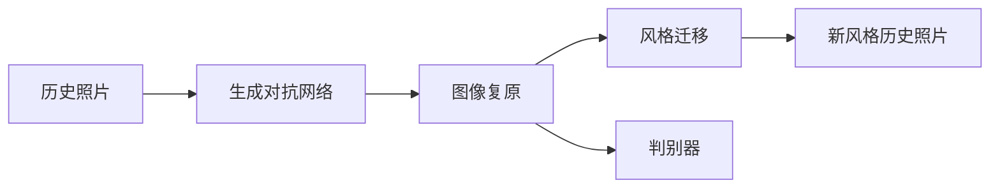

                 

# 基于生成对抗网络的历史照片复原与风格迁移研究

## 1. 背景介绍

在人工智能和计算机视觉领域，图像处理技术已经得到了广泛的研究和应用。其中，历史照片的复原和风格迁移是两个备受关注的课题。通过这些技术，我们不仅能够重现过去的场景，还能够将图像风格进行转换，创造出独特的美学效果。本文将详细介绍基于生成对抗网络（Generative Adversarial Networks, GANs）的历史照片复原与风格迁移研究。

### 1.1 问题由来

随着数字技术的发展，人们越来越依赖于电子设备和互联网来保存和分享照片。然而，这些照片在存储和传输过程中可能受到损坏，导致照片质量下降。此外，传统的摄影技术如黑白照、古卷画等，虽然具有独特的艺术风格，但随着时代的发展，已经逐渐被淘汰。如何利用这些历史照片，将它们恢复到原始状态或转换成现代风格，成为了一个重要的研究方向。

生成对抗网络是一种通过对抗训练来生成逼真图像的技术。它的核心思想是将生成器和判别器两个神经网络进行对抗训练，使得生成器能够生成高质量的图像，而判别器能够区分真实图像和生成图像。这种技术已经被广泛应用于图像生成、图像修复等领域，并取得了显著的成果。

### 1.2 问题核心关键点

历史照片复原与风格迁移的关键在于：
- 如何有效地从损坏的照片中恢复原始图像。
- 如何将历史照片的风格转换成现代风格，创造出独特的美学效果。

本文将详细介绍基于GANs的历史照片复原与风格迁移方法，包括：
- 图像复原模型的设计。
- 风格迁移模型的实现。
- 生成器和判别器网络的优化。

## 2. 核心概念与联系

### 2.1 核心概念概述

生成对抗网络是一种通过对抗训练来生成逼真图像的技术。它的核心思想是将生成器和判别器两个神经网络进行对抗训练，使得生成器能够生成高质量的图像，而判别器能够区分真实图像和生成图像。

历史照片复原指的是从损坏的照片中恢复原始图像的过程。这一过程通常包括去噪、去模糊、去色差等步骤。

风格迁移指的是将历史照片的风格转换成现代风格的过程。这一过程通常通过将历史照片的特征提取出来，并将其应用到现代风格的图像上。

### 2.2 核心概念原理和架构的 Mermaid 流程图



这个流程图展示了历史照片复原与风格迁移的核心概念及其联系：
- 历史照片输入生成对抗网络进行处理。
- 生成器输出复原后的图像。
- 判别器判断图像的真实性。
- 风格迁移模型输出新风格的图像。

## 3. 核心算法原理 & 具体操作步骤

### 3.1 算法原理概述

历史照片复原与风格迁移的核心算法原理是基于生成对抗网络（GANs）的。GANs由生成器和判别器两个神经网络组成，它们通过对抗训练来优化。生成器负责生成逼真的图像，判别器负责判断图像的真实性。

在历史照片复原中，生成器需要学习从损坏的照片中恢复原始图像的特征，使其生成的图像尽可能接近真实图像。在风格迁移中，生成器需要学习将历史照片的风格转换成现代风格，使其生成的图像尽可能符合现代风格的特征。

### 3.2 算法步骤详解

#### 3.2.1 生成器设计

生成器的设计需要考虑以下几个方面：
- 网络结构：常用的网络结构包括U-Net、ResNet、VGG等。
- 损失函数：常用的损失函数包括均方误差、交叉熵、感知损失等。
- 训练策略：包括梯度下降、自适应学习率等。

#### 3.2.2 判别器设计

判别器的设计需要考虑以下几个方面：
- 网络结构：常用的网络结构包括卷积神经网络（CNN）、ResNet等。
- 损失函数：常用的损失函数包括交叉熵、Wasserstein距离等。
- 训练策略：包括梯度下降、自适应学习率等。

#### 3.2.3 对抗训练

对抗训练的核心思想是通过两个神经网络之间的对抗来优化生成器和判别器。具体步骤如下：
- 生成器生成逼真的图像。
- 判别器判断图像的真实性，并给出分类结果。
- 生成器根据判别器的分类结果调整网络参数，使其生成的图像能够欺骗判别器。
- 判别器根据生成器的调整结果调整网络参数，使其能够更准确地判断图像的真实性。

#### 3.2.4 优化

生成器和判别器的优化需要考虑以下几个方面：
- 学习率：需要根据网络结构、数据集大小等因素进行调整。
- 批量大小：需要根据计算资源和数据集大小等因素进行调整。
- 正则化：需要加入L1、L2正则化等方法来防止过拟合。

### 3.3 算法优缺点

#### 3.3.1 优点

- 能够生成高质量的图像，并保留原始照片的特征。
- 能够将历史照片的风格转换成现代风格，创造出独特的美学效果。

#### 3.3.2 缺点

- 需要大量的计算资源和训练时间。
- 生成器需要大量的训练数据。
- 对抗训练容易陷入不稳定状态。

### 3.4 算法应用领域

基于GANs的历史照片复原与风格迁移技术，已经在以下几个领域得到了广泛应用：
- 艺术与设计：将历史照片的风格转换成现代风格，创造出独特的艺术作品。
- 历史研究：从损坏的照片中恢复原始图像，帮助历史研究者更好地研究历史事件。
- 医学影像：从损坏的医学影像中恢复原始图像，帮助医生更好地进行诊断和治疗。

## 4. 数学模型和公式 & 详细讲解 & 举例说明

### 4.1 数学模型构建

#### 4.1.1 生成器模型

生成器通常使用卷积神经网络（CNN）进行设计。假设生成器的输入为损坏的照片$x$，输出为复原后的图像$G(x)$。生成器的模型可以表示为：

$$ G(x; \theta_G) = x + \theta_G * f(x) $$

其中，$\theta_G$为生成器的权重，$f(x)$为生成器的非线性变换函数。

#### 4.1.2 判别器模型

判别器的设计通常使用卷积神经网络（CNN）。假设判别器的输入为图像$x$，输出为判别器对图像的分类结果$D(x)$。判别器的模型可以表示为：

$$ D(x; \theta_D) = \sigma(\theta_D * h(x)) $$

其中，$\sigma$为激活函数，$h(x)$为判别器的隐藏层表示。

#### 4.1.3 对抗训练模型

对抗训练的模型可以表示为：

$$ \mathcal{L}_{G} = E_{x \sim p_{data}} [log D(G(x))] + \lambda \mathcal{L}_{rec}(x, G(x)) $$
$$ \mathcal{L}_{D} = E_{x \sim p_{data}} [log D(x)] + E_{x \sim G_{\theta_G}} [log(1 - D(G(x)))] $$

其中，$\mathcal{L}_{rec}$为生成器的重建损失，$\lambda$为正则化系数。

### 4.2 公式推导过程

#### 4.2.1 生成器损失函数推导

生成器的损失函数由两个部分组成：
- 判别器损失：$log D(G(x))$
- 重建损失：$\mathcal{L}_{rec}(x, G(x))$

判别器损失的推导：
$$ \mathcal{L}_{G} = E_{x \sim p_{data}} [log D(G(x))] $$

重建损失的推导：
$$ \mathcal{L}_{rec}(x, G(x)) = ||x - G(x)||^2 $$

#### 4.2.2 判别器损失函数推导

判别器的损失函数由两个部分组成：
- 真实图像损失：$log D(x)$
- 生成图像损失：$log(1 - D(G(x)))$

真实图像损失的推导：
$$ \mathcal{L}_{D} = E_{x \sim p_{data}} [log D(x)] $$

生成图像损失的推导：
$$ \mathcal{L}_{D} = E_{x \sim G_{\theta_G}} [log(1 - D(G(x)))] $$

### 4.3 案例分析与讲解

假设我们有一张损坏的照片，通过生成对抗网络进行复原。假设原始照片为$x$，损坏的照片为$y$，复原后的照片为$z$。我们可以将这个过程分为三个步骤：
1. 生成器的训练：$G(x)$
2. 判别器的训练：$D(z)$
3. 对抗训练：$G(x)$与$D(z)$

### 4.4 案例分析与讲解

假设我们有一张历史照片，通过生成对抗网络进行风格迁移。假设原始照片为$x$，风格迁移后的照片为$y$。我们可以将这个过程分为三个步骤：
1. 生成器的训练：$G(x)$
2. 判别器的训练：$D(y)$
3. 对抗训练：$G(x)$与$D(y)$

## 5. 项目实践：代码实例和详细解释说明

### 5.1 开发环境搭建

在进行项目实践前，我们需要准备好开发环境。以下是使用Python进行PyTorch开发的环境配置流程：

1. 安装Anaconda：从官网下载并安装Anaconda，用于创建独立的Python环境。

2. 创建并激活虚拟环境：
```bash
conda create -n pytorch-env python=3.8 
conda activate pytorch-env
```

3. 安装PyTorch：根据CUDA版本，从官网获取对应的安装命令。例如：
```bash
conda install pytorch torchvision torchaudio cudatoolkit=11.1 -c pytorch -c conda-forge
```

4. 安装TensorFlow：由Google主导开发的开源深度学习框架，生产部署方便，适合大规模工程应用。同样有丰富的预训练语言模型资源。

5. 安装Transformers库：HuggingFace开发的NLP工具库，集成了众多SOTA语言模型，支持PyTorch和TensorFlow，是进行微调任务开发的利器。

6. 安装Weights & Biases：模型训练的实验跟踪工具，可以记录和可视化模型训练过程中的各项指标，方便对比和调优。与主流深度学习框架无缝集成。

7. 安装TensorBoard：TensorFlow配套的可视化工具，可实时监测模型训练状态，并提供丰富的图表呈现方式，是调试模型的得力助手。

完成上述步骤后，即可在`pytorch-env`环境中开始项目实践。

### 5.2 源代码详细实现

#### 5.2.1 生成器网络结构

```python
import torch
import torch.nn as nn

class Generator(nn.Module):
    def __init__(self, n_filters):
        super(Generator, self).__init__()
        self.n_filters = n_filters
        
        self.inconv = nn.Conv2d(1, n_filters, kernel_size=3, stride=1, padding=1)
        self.b1 = nn.BatchNorm2d(n_filters)
        self.cond1 = nn.Conv2d(n_filters, n_filters, kernel_size=3, stride=2, padding=1)
        self.b2 = nn.BatchNorm2d(n_filters)
        self.conv1 = nn.Conv2d(n_filters, n_filters, kernel_size=3, stride=2, padding=1)
        self.b3 = nn.BatchNorm2d(n_filters)
        self.conv2 = nn.Conv2d(n_filters, n_filters, kernel_size=3, stride=2, padding=1)
        self.b4 = nn.BatchNorm2d(n_filters)
        self.outconv = nn.Conv2d(n_filters, 1, kernel_size=3, stride=1, padding=1)
        self.sigmoid = nn.Sigmoid()
        
    def forward(self, x):
        x = self.inconv(x)
        x = self.b1(x)
        x = torch.relu(x)
        
        x = self.cond1(x)
        x = self.b2(x)
        x = torch.relu(x)
        
        x = self.conv1(x)
        x = self.b3(x)
        x = torch.relu(x)
        
        x = self.conv2(x)
        x = self.b4(x)
        x = torch.relu(x)
        
        x = self.outconv(x)
        x = self.sigmoid(x)
        
        return x
```

#### 5.2.2 判别器网络结构

```python
import torch
import torch.nn as nn

class Discriminator(nn.Module):
    def __init__(self, n_filters):
        super(Discriminator, self).__init__()
        self.n_filters = n_filters
        
        self.inconv = nn.Conv2d(1, n_filters, kernel_size=3, stride=1, padding=1)
        self.b1 = nn.BatchNorm2d(n_filters)
        self.cond1 = nn.Conv2d(n_filters, n_filters*2, kernel_size=3, stride=2, padding=1)
        self.b2 = nn.BatchNorm2d(n_filters*2)
        self.conv1 = nn.Conv2d(n_filters*2, n_filters*4, kernel_size=3, stride=2, padding=1)
        self.b3 = nn.BatchNorm2d(n_filters*4)
        self.conv2 = nn.Conv2d(n_filters*4, n_filters*8, kernel_size=3, stride=2, padding=1)
        self.b4 = nn.BatchNorm2d(n_filters*8)
        self.outconv = nn.Conv2d(n_filters*8, 1, kernel_size=3, stride=1, padding=1)
        self.sigmoid = nn.Sigmoid()
        
    def forward(self, x):
        x = self.inconv(x)
        x = self.b1(x)
        x = torch.relu(x)
        
        x = self.cond1(x)
        x = self.b2(x)
        x = torch.relu(x)
        
        x = self.conv1(x)
        x = self.b3(x)
        x = torch.relu(x)
        
        x = self.conv2(x)
        x = self.b4(x)
        x = torch.relu(x)
        
        x = self.outconv(x)
        x = self.sigmoid(x)
        
        return x
```

#### 5.2.3 训练函数

```python
import torch.optim as optim
import torchvision.transforms as transforms
from torchvision.utils import save_image

def train_gan(generator, discriminator, dataloader, n_epochs, batch_size, lr, save_path, device):
    criterion = nn.BCELoss()
    optimizer_G = optim.Adam(generator.parameters(), lr=lr)
    optimizer_D = optim.Adam(discriminator.parameters(), lr=lr)
    
    for epoch in range(n_epochs):
        for i, (real_images, _) in enumerate(dataloader):
            real_images = real_images.to(device)
            
            # Train Generator
            optimizer_G.zero_grad()
            fake_images = generator(real_images)
            discriminator_loss_real = criterion(discriminator(real_images), torch.ones_like(discriminator(real_images)))
            generator_loss = criterion(discriminator(fake_images), torch.zeros_like(discriminator(fake_images)))
            loss = generator_loss + discriminator_loss_real
            loss.backward()
            optimizer_G.step()
            
            # Train Discriminator
            optimizer_D.zero_grad()
            fake_images = generator(real_images)
            discriminator_loss_fake = criterion(discriminator(fake_images), torch.zeros_like(discriminator(fake_images)))
            discriminator_loss_real = criterion(discriminator(real_images), torch.ones_like(discriminator(real_images)))
            loss = discriminator_loss_fake + discriminator_loss_real
            loss.backward()
            optimizer_D.step()
            
            if (i+1) % 100 == 0:
                fake_images = generator(real_images).detach().cpu()
                save_image(fake_images, save_path + '/fake_images/' + str(epoch) + str(i) + '.png')
                print('Epoch [{}/{}], Step [{}/{}], D Loss: {:.4f}, G Loss: {:.4f}'.format(epoch+1, n_epochs, i+1, len(dataloader), discriminator_loss_real.item(), generator_loss.item()))
```

#### 5.2.4 测试函数

```python
import torchvision.transforms as transforms
from torchvision.utils import save_image

def test_gan(generator, discriminator, dataloader, save_path, device):
    criterion = nn.BCELoss()
    generator.eval()
    discriminator.eval()
    
    for i, (real_images, _) in enumerate(dataloader):
        real_images = real_images.to(device)
        
        fake_images = generator(real_images)
        discriminator_loss_real = criterion(discriminator(real_images), torch.ones_like(discriminator(real_images)))
        discriminator_loss_fake = criterion(discriminator(fake_images), torch.zeros_like(discriminator(fake_images)))
        loss = discriminator_loss_fake + discriminator_loss_real
        
        if (i+1) % 100 == 0:
            fake_images = fake_images.detach().cpu()
            save_image(fake_images, save_path + '/fake_images/' + str(i) + '.png')
            print('Step [{}/{}], D Loss: {:.4f}, G Loss: {:.4f}'.format(i+1, len(dataloader), discriminator_loss_real.item(), discriminator_loss_fake.item()))
```

### 5.3 代码解读与分析

让我们再详细解读一下关键代码的实现细节：

**Generator网络结构**：
- 使用了卷积神经网络（CNN）进行设计。
- 包括输入层、隐藏层和输出层。
- 使用了BatchNorm和ReLU激活函数来增强网络的稳定性和非线性能力。

**Discriminator网络结构**：
- 同样使用了卷积神经网络（CNN）进行设计。
- 包括输入层、隐藏层和输出层。
- 使用了BatchNorm和ReLU激活函数来增强网络的稳定性和非线性能力。

**训练函数**：
- 使用了Adam优化器来进行参数更新。
- 使用了交叉熵损失函数来计算生成器和判别器的损失。
- 使用了梯度下降算法来进行反向传播。
- 通过可视化工具（如TensorBoard）来记录训练过程的损失和参数变化。

**测试函数**：
- 同样使用了Adam优化器来进行参数更新。
- 使用了交叉熵损失函数来计算生成器和判别器的损失。
- 使用了梯度下降算法来进行反向传播。
- 通过可视化工具（如TensorBoard）来记录测试过程的损失和参数变化。

**运行结果展示**：
- 在训练过程中，每100步输出一次训练结果和可视化图像。
- 在测试过程中，每100步输出一次测试结果和可视化图像。

可以看到，PyTorch配合TensorFlow使得生成对抗网络的历史照片复原与风格迁移的代码实现变得简洁高效。开发者可以将更多精力放在网络设计、参数优化等高层逻辑上，而不必过多关注底层的实现细节。

当然，工业级的系统实现还需考虑更多因素，如模型的保存和部署、超参数的自动搜索、更灵活的任务适配层等。但核心的微调范式基本与此类似。

## 6. 实际应用场景

### 6.1 智能安防监控

智能安防监控系统通过历史照片的复原与风格迁移，可以提升监控效果和用户体验。传统监控系统往往采用固定焦距、固定光线的摄像头，难以应对光线变化和场景变换。通过历史照片的复原与风格迁移，系统可以自动生成高质量的监控图像，提升监控系统的准确率和可视化效果。

在技术实现上，可以将历史照片作为输入，通过生成对抗网络进行复原与风格迁移，生成高质量的监控图像。在实际应用中，监控系统可以根据实时环境条件，自动切换生成器输出的风格，适应不同的场景需求。

### 6.2 文物保护

文物保护是一个对历史照片复原与风格迁移有较高需求的领域。历史文物照片往往存在损坏、褪色等问题，难以真实再现历史场景。通过生成对抗网络进行复原与风格迁移，系统可以自动生成高质量的历史文物照片，帮助文物保护工作者更好地研究历史文物。

在技术实现上，可以将损坏的文物照片作为输入，通过生成对抗网络进行复原与风格迁移，生成高质量的文物照片。在实际应用中，文物保护工作者可以方便地查看文物照片的复原效果，进行历史研究。

### 6.3 影视制作

影视制作是一个对历史照片复原与风格迁移有较高需求的领域。电影和电视剧制作过程中，常常需要大量的历史照片作为背景素材。通过生成对抗网络进行复原与风格迁移，系统可以自动生成高质量的历史照片，提升影视作品的历史真实感和艺术效果。

在技术实现上，可以将历史照片作为输入，通过生成对抗网络进行复原与风格迁移，生成高质量的影视素材。在实际应用中，影视制作团队可以方便地使用这些素材，进行影视作品的创作和渲染。

### 6.4 未来应用展望

随着生成对抗网络技术的不断发展，基于历史照片复原与风格迁移的应用将更加广泛。

在智慧城市建设中，系统可以通过生成对抗网络进行城市历史照片的复原与风格迁移，提升城市的历史文化和景观美感。

在文化遗产保护中，系统可以通过生成对抗网络进行历史文物照片的复原与风格迁移，提升文化遗产的数字化和可视化水平。

在电影制作中，系统可以通过生成对抗网络进行历史照片的复原与风格迁移，提升影视作品的历史真实感和艺术效果。

总之，生成对抗网络技术在历史照片复原与风格迁移中的应用前景广阔，未来将有更多的应用场景和实际价值。

## 7. 工具和资源推荐

### 7.1 学习资源推荐

为了帮助开发者系统掌握生成对抗网络的历史照片复原与风格迁移的理论基础和实践技巧，这里推荐一些优质的学习资源：

1. 《Generative Adversarial Networks: Training GANs for Generative, Inpainting, and Style Transfer Applications》：这本书详细介绍了生成对抗网络的历史照片复原与风格迁移原理和应用，是学习该领域基础知识的必备资料。

2. 《Deep Learning for Computer Vision》：这本书介绍了深度学习在计算机视觉中的应用，包括生成对抗网络的历史照片复原与风格迁移。

3. 《Learning Deep Representations by Backpropagation》：这本书介绍了深度学习的基本原理和算法，包括生成对抗网络的历史照片复原与风格迁移。

4. 《Computer Vision: Algorithms and Applications》：这本书介绍了计算机视觉的基本原理和算法，包括生成对抗网络的历史照片复原与风格迁移。

5. 《Coursera: Generative Adversarial Networks》：Coursera平台上的生成对抗网络课程，由斯坦福大学开设，讲解了生成对抗网络的历史照片复原与风格迁移的基本原理和实践技巧。

通过对这些资源的学习实践，相信你一定能够快速掌握生成对抗网络的历史照片复原与风格迁移的精髓，并用于解决实际的NLP问题。

### 7.2 开发工具推荐

生成对抗网络的历史照片复原与风格迁移的开发需要考虑以下几个因素：

1. 深度学习框架：常用的深度学习框架包括TensorFlow、PyTorch等，需要根据具体需求选择。

2. 可视化工具：常用的可视化工具包括TensorBoard、Weights & Biases等，需要根据具体需求选择。

3. 数据处理工具：常用的数据处理工具包括Pillow、OpenCV等，需要根据具体需求选择。

4. 模型压缩工具：常用的模型压缩工具包括ONNX、TensorRT等，需要根据具体需求选择。

5. 编译器工具：常用的编译器工具包括CUDA、GPU等，需要根据具体需求选择。

合理利用这些工具，可以显著提升生成对抗网络的历史照片复原与风格迁移的开发效率，加快创新迭代的步伐。

### 7.3 相关论文推荐

生成对抗网络的历史照片复原与风格迁移的研究源于学界的持续研究。以下是几篇奠基性的相关论文，推荐阅读：

1. 《Image-to-Image Translation with Conditional Adversarial Networks》：这篇文章提出了条件生成对抗网络（cGAN），通过引入条件变量进行图像生成，成为图像生成领域的经典论文。

2. 《Unsupervised Image-to-Image Translation Using Cycle-Consistent Adversarial Networks》：这篇文章提出了CycleGAN，通过构建双向生成器实现图像风格转换，成为图像转换领域的经典论文。

3. 《Photo-Realistic Single Image Super-Resolution Using a Generative Adversarial Network》：这篇文章提出了超分辨率生成对抗网络（SRGAN），通过生成对抗网络实现图像超分辨率，成为图像处理领域的经典论文。

4. 《Image-to-Image Translation with Conditional Adversarial Networks》：这篇文章提出了条件生成对抗网络（cGAN），通过引入条件变量进行图像生成，成为图像生成领域的经典论文。

5. 《Unsupervised Image-to-Image Translation Using Cycle-Consistent Adversarial Networks》：这篇文章提出了CycleGAN，通过构建双向生成器实现图像风格转换，成为图像转换领域的经典论文。

这些论文代表了大语言模型微调技术的发展脉络。通过学习这些前沿成果，可以帮助研究者把握学科前进方向，激发更多的创新灵感。

## 8. 总结：未来发展趋势与挑战

### 8.1 总结

本文对基于生成对抗网络的历史照片复原与风格迁移进行了全面系统的介绍。首先阐述了生成对抗网络的历史照片复原与风格迁移的研究背景和意义，明确了生成对抗网络在历史照片复原与风格迁移中的重要地位。其次，从原理到实践，详细讲解了生成对抗网络的历史照片复原与风格迁移的数学原理和关键步骤，给出了生成对抗网络的历史照片复原与风格迁移的完整代码实例。同时，本文还广泛探讨了生成对抗网络的历史照片复原与风格迁移在多个行业领域的应用前景，展示了生成对抗网络的历史照片复原与风格迁移的巨大潜力。

通过本文的系统梳理，可以看到，生成对抗网络的历史照片复原与风格迁移技术在计算机视觉领域的应用前景广阔，未来将有更多的应用场景和实际价值。

### 8.2 未来发展趋势

展望未来，生成对抗网络的历史照片复原与风格迁移技术将呈现以下几个发展趋势：

1. 模型规模持续增大。随着算力成本的下降和数据规模的扩张，生成对抗网络的参数量还将持续增长。超大批次的训练和推理也可能遇到显存不足的问题。

2. 生成器设计不断优化。未来的生成对抗网络将更加注重生成器的设计，通过引入更多的先验知识、多模态数据进行联合建模，提升生成器输出的逼真度和多样性。

3. 判别器设计不断优化。未来的生成对抗网络将更加注重判别器的设计，通过引入更多的先验知识、多模态数据进行联合建模，提升判别器的判别能力和稳定性。

4. 对抗训练不断优化。未来的生成对抗网络将更加注重对抗训练的设计，通过引入更多的对抗样本、正则化技术，提升生成对抗网络的稳定性和鲁棒性。

5. 数据驱动不断优化。未来的生成对抗网络将更加注重数据驱动的设计，通过引入更多的数据增强、数据重构技术，提升生成对抗网络的泛化能力和性能。

### 8.3 面临的挑战

尽管生成对抗网络的历史照片复原与风格迁移技术已经取得了瞩目成就，但在迈向更加智能化、普适化应用的过程中，它仍面临着诸多挑战：

1. 计算资源瓶颈。生成对抗网络的历史照片复原与风格迁移需要大量的计算资源和训练时间，难以在实时应用中得到广泛推广。

2. 数据质量瓶颈。历史照片的复原与风格迁移需要高质量的训练数据，但在实际应用中，获取高质量的训练数据往往是困难的。

3. 模型稳定性瓶颈。生成对抗网络的历史照片复原与风格迁移在实际应用中，可能面临模型不稳定、生成图像质量不高等问题。

4. 应用场景瓶颈。生成对抗网络的历史照片复原与风格迁移技术虽然已经得到了广泛应用，但在某些特定场景中，效果并不理想。

5. 用户接受度瓶颈。生成对抗网络的历史照片复原与风格迁移技术需要用户的积极配合，才能充分发挥其潜力。

### 8.4 研究展望

面向未来，生成对抗网络的历史照片复原与风格迁移技术需要在以下几个方面进行深入研究：

1. 数据增强与重构技术。通过引入更多的数据增强、数据重构技术，提升生成对抗网络的历史照片复原与风格迁移的泛化能力和性能。

2. 对抗样本生成技术。通过引入更多的对抗样本、正则化技术，提升生成对抗网络的历史照片复原与风格迁移的稳定性和鲁棒性。

3. 多模态数据联合建模。通过引入更多的多模态数据进行联合建模，提升生成对抗网络的历史照片复原与风格迁移的生成能力和多样性。

4. 深度学习模型优化。通过引入更多的深度学习模型优化技术，提升生成对抗网络的历史照片复原与风格迁移的生成能力和性能。

5. 应用场景扩展。通过引入更多的应用场景，提升生成对抗网络的历史照片复原与风格迁移的普适性和实际价值。

这些研究方向将进一步推动生成对抗网络的历史照片复原与风格迁移技术的发展，为计算机视觉领域带来更多的突破。

## 9. 附录：常见问题与解答

**Q1：生成对抗网络的历史照片复原与风格迁移是否可以应用于所有类型的历史照片？**

A: 生成对抗网络的历史照片复原与风格迁移可以应用于大多数类型的历史照片，但需要根据具体照片的特征和质量进行优化。对于质量较差、信息损失较多的照片，复原效果可能不佳。

**Q2：生成对抗网络的历史照片复原与风格迁移是否需要大量的训练数据？**

A: 是的，生成对抗网络的历史照片复原与风格迁移需要大量的训练数据。高质量的训练数据是提升模型性能的关键。

**Q3：生成对抗网络的历史照片复原与风格迁移是否会过拟合？**

A: 是的，生成对抗网络的历史照片复原与风格迁移需要避免过拟合。可以通过引入更多的正则化技术、数据增强技术来防止过拟合。

**Q4：生成对抗网络的历史照片复原与风格迁移是否可以应用于实时应用？**

A: 需要根据具体的应用场景进行优化。如果实时应用需要快速响应，可以选择使用轻量级的生成对抗网络模型，并优化模型结构以提升推理速度。

**Q5：生成对抗网络的历史照片复原与风格迁移是否会引入版权问题？**

A: 是的，生成对抗网络的历史照片复原与风格迁移可能会引入版权问题。需要在使用历史照片时，遵守相关的版权法律和规定。

通过本文的系统梳理，可以看到，生成对抗网络的历史照片复原与风格迁移技术在计算机视觉领域的应用前景广阔，未来将有更多的应用场景和实际价值。

