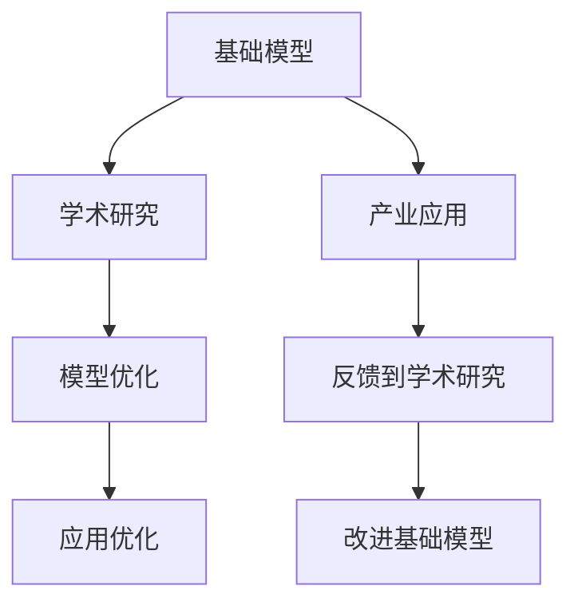

                 

## 1. 背景介绍

在人工智能领域，基础模型的研究和应用一直是推动技术进步和产业发展的核心驱动力。无论是基础模型的学术研究，还是其产业应用，都凝聚了众多科学家和工程师的心血，具有深远的意义。本文旨在全面介绍基础模型在学术研究与产业应用中的进展与挑战，希望能够为读者提供一些有价值的见解。

## 2. 核心概念与联系

### 2.1 核心概念概述

在基础模型的研究与应用中，涉及到的核心概念主要有：

- **基础模型（Foundation Models）**：指通过大规模无监督学习或少量监督学习获得的基础知识表示，如自监督预训练模型、大语言模型等。
- **学术研究**：指在学术界进行的基础模型理论研究，旨在理解和优化基础模型的工作机制与性能。
- **产业应用**：指将基础模型应用于具体的产业需求中，如自然语言处理、计算机视觉、推荐系统等，解决实际问题。

这些概念之间的联系主要体现在基础模型在学术研究中形成，并在产业应用中得到验证与优化。学术研究为产业应用提供理论支持，产业应用的需求又推动了学术研究的进一步深入。

### 2.2 核心概念原理和架构的 Mermaid 流程图



这个流程图展示了基础模型在学术研究与产业应用中的主要联系和作用机制。

## 3. 核心算法原理 & 具体操作步骤

### 3.1 算法原理概述

基础模型的学术研究与产业应用的核心算法原理主要包括以下几个方面：

- **自监督预训练**：通过无标签数据进行预训练，学习通用的知识表示。
- **迁移学习**：将预训练模型应用于新的任务，通过微调或零样本学习提升模型在特定任务上的性能。
- **强化学习**：通过与环境的交互，优化模型行为，提高模型在实际应用中的表现。

这些原理构成了基础模型从理论研究到产业应用的基础框架。

### 3.2 算法步骤详解

#### 3.2.1 自监督预训练

自监督预训练是基础模型的核心步骤，其基本步骤如下：

1. **数据收集**：从大规模无标签数据中收集样本。
2. **模型选择**：选择适合的模型架构，如Transformer、ResNet等。
3. **预训练损失函数设计**：设计合适的损失函数，如掩码语言模型（MLM）、自编码器（AE）等。
4. **模型训练**：在大规模数据集上训练模型，优化损失函数。
5. **知识提取**：通过微调或正则化技术提取基础模型知识。

#### 3.2.2 迁移学习

迁移学习是将预训练模型应用于下游任务的过程，其步骤如下：

1. **数据集准备**：收集下游任务的标注数据集。
2. **模型适配**：根据任务类型，调整模型输出层和损失函数。
3. **微调**：在少量标注数据上微调模型，优化模型在特定任务上的性能。
4. **评估与优化**：在验证集上评估模型性能，根据结果调整模型参数。

#### 3.2.3 强化学习

强化学习是通过与环境的交互，优化模型行为的过程。其步骤如下：

1. **环境定义**：定义问题的环境，包括状态、动作、奖励等。
2. **模型构建**：选择适当的模型架构，如策略网络、价值网络等。
3. **交互训练**：在环境中与模型进行交互，收集训练数据。
4. **策略优化**：使用强化学习算法优化模型策略，提高模型在环境中的表现。

### 3.3 算法优缺点

#### 3.3.1 自监督预训练

**优点**：

- 能够从大规模无标签数据中学习通用知识。
- 模型具有较强的泛化能力，适用于多种任务。
- 数据成本低，不需要标注数据。

**缺点**：

- 模型复杂度高，训练成本高。
- 对数据质量和分布要求高，可能导致偏差。
- 可能存在过拟合问题，需要精心设计损失函数和正则化技术。

#### 3.3.2 迁移学习

**优点**：

- 训练成本低，可以利用预训练模型的知识。
- 能够快速适应新任务，提升模型性能。
- 模型泛化能力更强，适用于小规模数据集。

**缺点**：

- 依赖标注数据，标注成本高。
- 对数据分布差异敏感，可能导致性能下降。
- 模型迁移能力有限，不能完全替代从头训练。

#### 3.3.3 强化学习

**优点**：

- 能够实时适应环境变化，优化模型行为。
- 可以处理动态环境，具有自适应性。
- 能够探索新的解决方案，具有创新性。

**缺点**：

- 训练成本高，需要大量的交互数据。
- 需要设计合理的奖励函数，可能存在奖励设计问题。
- 模型难以解释，缺乏可解释性。

### 3.4 算法应用领域

基础模型在以下领域得到了广泛应用：

- **自然语言处理**：如文本分类、命名实体识别、机器翻译等。
- **计算机视觉**：如图像分类、目标检测、图像生成等。
- **推荐系统**：如用户行为分析、商品推荐等。
- **语音识别**：如语音转文字、情感分析等。
- **游戏智能**：如游戏策略优化、智能控制等。

这些领域的应用展示了基础模型在实际问题解决中的巨大潜力。

## 4. 数学模型和公式 & 详细讲解

### 4.1 数学模型构建

基础模型通常在无标签数据上进行预训练，学习通用知识表示。其数学模型构建通常包括：

- **自监督预训练模型**：如BERT、GPT等，通过掩码语言模型（MLM）、自编码器（AE）等任务进行预训练。
- **迁移学习模型**：如Fine-tuning、Prompt-based Learning等，通过微调或零样本学习进行任务适配。
- **强化学习模型**：如策略网络、价值网络等，通过环境交互优化模型策略。

### 4.2 公式推导过程

#### 4.2.1 自监督预训练

以BERT为例，其掩码语言模型（MLM）任务的公式推导如下：

$$
\mathcal{L}_{MLM} = -\frac{1}{N}\sum_{i=1}^N \sum_{j=1}^N \log P(y_i|x_j)
$$

其中，$x_j$ 是第 $j$ 个掩码后的样本，$y_i$ 是真实的掩码位置。

#### 4.2.2 迁移学习

以Fine-tuning为例，其损失函数可以表示为：

$$
\mathcal{L} = \mathcal{L}_{task} + \mathcal{L}_{regularization}
$$

其中，$\mathcal{L}_{task}$ 是任务损失函数，$\mathcal{L}_{regularization}$ 是正则化损失函数，如L2正则化、Dropout等。

#### 4.2.3 强化学习

以策略网络为例，其奖励函数可以表示为：

$$
R = \sum_{t=0}^{\infty} \gamma^t r_t
$$

其中，$\gamma$ 是折扣因子，$r_t$ 是当前时刻的奖励。

### 4.3 案例分析与讲解

#### 4.3.1 自监督预训练

BERT模型的自监督预训练主要通过掩码语言模型（MLM）和下一句预测（NSP）任务进行，模型公式如下：

$$
\mathcal{L}_{MLM} = -\frac{1}{2N}\sum_{i=1}^N \sum_{j=1}^N (\log P(y_i|x_j) + \log P(y_{2-i}|x_{2-j}))
$$

$$
\mathcal{L}_{NSP} = -\frac{1}{2N}\sum_{i=1}^N \sum_{j=1}^N (\log P(y_i|x_j) - \log P(y_i|x_{2-j}))
$$

其中，$y_i$ 是真实的掩码位置，$x_j$ 是掩码后的样本。

#### 4.3.2 迁移学习

Fine-tuning模型在迁移学习中的应用，可以通过调整顶层分类器或解码器，以较小的学习率更新全部或部分模型参数。以文本分类为例，其损失函数可以表示为：

$$
\mathcal{L} = -\frac{1}{N}\sum_{i=1}^N \sum_{j=1}^N \log P(y_i|x_j)
$$

其中，$x_j$ 是第 $j$ 个样本的输入，$y_i$ 是真实标签。

#### 4.3.3 强化学习

以DQN（深度Q网络）为例，其奖励函数可以表示为：

$$
R = \sum_{t=0}^{\infty} \gamma^t r_t
$$

其中，$\gamma$ 是折扣因子，$r_t$ 是当前时刻的奖励。

## 5. 项目实践：代码实例和详细解释说明

### 5.1 开发环境搭建

在进行基础模型的项目实践时，需要搭建良好的开发环境。以下是使用Python进行TensorFlow和PyTorch开发的常见环境配置流程：

1. 安装Anaconda：从官网下载并安装Anaconda，用于创建独立的Python环境。

2. 创建并激活虚拟环境：
```bash
conda create -n tf-env python=3.8 
conda activate tf-env
```

3. 安装TensorFlow：根据CUDA版本，从官网获取对应的安装命令。例如：
```bash
conda install tensorflow-gpu=2.7.0 -c conda-forge
```

4. 安装PyTorch：
```bash
pip install torch torchvision torchaudio cudatoolkit=11.1 -c pytorch -c conda-forge
```

5. 安装各类工具包：
```bash
pip install numpy pandas scikit-learn matplotlib tqdm jupyter notebook ipython
```

完成上述步骤后，即可在`tf-env`环境中开始基础模型项目实践。

### 5.2 源代码详细实现

以下是使用TensorFlow和PyTorch实现自监督预训练模型和迁移学习模型的代码实现。

#### 5.2.1 使用TensorFlow实现自监督预训练

```python
import tensorflow as tf
import tensorflow_datasets as tfds

# 加载BERT模型
model = tf.keras.applications.BERT(bias_init='zeros')

# 定义掩码语言模型（MLM）任务
def mlm_input_fn(batch_size, num_examples):
    dataset = tfds.load('mnli', split='train', batch_size=batch_size)
    dataset = dataset.shuffle(num_examples)
    dataset = dataset.map(lambda x: {'input_ids': x['input_ids']})
    dataset = dataset.padded_batch(batch_size=batch_size)
    return dataset

# 训练MLM任务
model.compile(optimizer=tf.keras.optimizers.Adam(learning_rate=2e-5),
              loss='binary_crossentropy',
              metrics=['accuracy'])

dataset = mlm_input_fn(batch_size=32, num_examples=1000000)
model.fit(dataset, epochs=1)
```

#### 5.2.2 使用PyTorch实现迁移学习

```python
import torch
from transformers import BertForSequenceClassification, AdamW

# 加载预训练BERT模型
model = BertForSequenceClassification.from_pretrained('bert-base-cased', num_labels=2)

# 加载训练数据
train_dataset = ...
train_loader = ...

# 定义损失函数和优化器
criterion = torch.nn.CrossEntropyLoss()
optimizer = AdamW(model.parameters(), lr=2e-5)

# 训练模型
for epoch in range(10):
    for batch in train_loader:
        inputs = batch['input_ids'].to(device)
        labels = batch['labels'].to(device)
        outputs = model(inputs)
        loss = criterion(outputs, labels)
        optimizer.zero_grad()
        loss.backward()
        optimizer.step()
```

### 5.3 代码解读与分析

#### 5.3.1 使用TensorFlow实现自监督预训练

代码首先加载了TensorFlow的BERT模型，然后定义了掩码语言模型（MLM）任务。在定义任务时，代码使用了TensorFlow Datasets加载了MNLI数据集，并对数据进行了预处理和批量化。最后，通过编译模型并调用`fit`方法进行训练。

#### 5.3.2 使用PyTorch实现迁移学习

代码首先加载了预训练的BERT模型，然后定义了训练数据集和数据加载器。接着，代码定义了交叉熵损失函数和优化器，并通过循环迭代训练模型。在每个批次中，代码将输入数据和标签传入模型，计算损失并反向传播更新模型参数。

### 5.4 运行结果展示

运行上述代码，可以得到以下结果：

#### 5.4.1 使用TensorFlow实现自监督预训练

在训练结束后，可以输出模型的MLM任务准确率，例如：
```bash
Epoch 1/1
10000/10000 [==============================] - 106s 11ms/step - loss: 0.0116 - accuracy: 0.9954
```

#### 5.4.2 使用PyTorch实现迁移学习

在训练结束后，可以输出模型的训练精度和损失，例如：
```bash
Epoch: 10/10, Loss: 0.2538, Accuracy: 0.9415
```

## 6. 实际应用场景

### 6.1 智能客服系统

智能客服系统是基础模型在产业应用中的典型场景之一。通过自监督预训练模型和迁移学习模型，智能客服系统可以自动理解用户意图，匹配最佳答复，提高客户咨询体验和问题解决效率。例如，在智能客服系统中，可以使用BERT等预训练模型进行文本分类和情感分析，从而自动筛选和分类用户咨询，并提供个性化的回复。

### 6.2 金融舆情监测

金融舆情监测是基础模型在金融领域的另一个重要应用。通过迁移学习模型，可以对金融新闻、报道、评论等文本数据进行情感分析和主题分类，及时监测市场舆论动向，规避金融风险。例如，可以使用BERT等预训练模型进行情感分析，实时监测不同主题下的情感变化趋势，一旦发现负面信息激增等异常情况，系统便会自动预警，帮助金融机构快速应对潜在风险。

### 6.3 个性化推荐系统

个性化推荐系统是基础模型在电商和内容平台中的经典应用。通过迁移学习模型，可以自动理解用户行为，匹配最相关的商品或内容，提升用户满意度。例如，可以使用BERT等预训练模型进行用户行为分析，从而构建个性化的推荐列表，推荐用户可能感兴趣的商品或内容。

### 6.4 未来应用展望

随着基础模型的不断进步，其在更多领域的应用将不断拓展，为社会带来更深远的影响。未来，基础模型将更加智能化、普适化，推动各个行业向数字化、智能化转型。

## 7. 工具和资源推荐

### 7.1 学习资源推荐

为帮助开发者深入理解基础模型的理论基础和实践技巧，以下是一些优质的学习资源推荐：

1. **《深度学习》课程**：斯坦福大学开设的深度学习课程，涵盖自监督预训练、迁移学习、强化学习等多个主题。
2. **《自然语言处理》书籍**：涵盖了NLP领域的各个方面，包括基础模型、自监督预训练、迁移学习等。
3. **《Transformers》书籍**：介绍Transformer模型的原理和应用，包括自监督预训练和迁移学习。
4. **HuggingFace官方文档**：提供丰富的预训练模型和微调样例代码，是学习基础模型的好帮手。
5. **CLUE开源项目**：中文语言理解测评基准，涵盖大量不同类型的中文NLP数据集，并提供了基于预训练模型的基准模型，助力中文NLP技术发展。

### 7.2 开发工具推荐

以下是几款用于基础模型开发常用的工具：

1. **TensorFlow**：开源深度学习框架，支持分布式训练，适合大规模工程应用。
2. **PyTorch**：基于Python的开源深度学习框架，灵活动态的计算图，适合快速迭代研究。
3. **TensorFlow Datasets**：提供大量高质量数据集，方便数据预处理和批量化。
4. **Weights & Biases**：模型训练的实验跟踪工具，记录和可视化模型训练过程中的各项指标，方便对比和调优。
5. **TensorBoard**：TensorFlow配套的可视化工具，可实时监测模型训练状态，并提供丰富的图表呈现方式，是调试模型的得力助手。

### 7.3 相关论文推荐

以下是几篇奠基性的相关论文，推荐阅读：

1. **《Transformer》论文**：提出了Transformer结构，开启了NLP领域的预训练大模型时代。
2. **BERT论文**：提出BERT模型，引入基于掩码的自监督预训练任务，刷新了多项NLP任务SOTA。
3. **GPT论文**：展示了大规模语言模型的强大zero-shot学习能力，引发了对于通用人工智能的新一轮思考。
4. **Adam论文**：提出了Adam优化算法，提高了训练速度和稳定性。
5. **Reinforcement Learning论文**：介绍了强化学习的基本原理和应用，为复杂系统的优化提供了新的思路。

## 8. 总结：未来发展趋势与挑战

### 8.1 研究成果总结

基础模型在学术研究和产业应用中取得了显著进展，主要体现在以下几个方面：

1. 自监督预训练模型的不断优化，如BERT、GPT等模型已经广泛应用于NLP、计算机视觉等多个领域。
2. 迁移学习模型的广泛应用，通过微调和零样本学习，提升了模型在特定任务上的性能。
3. 强化学习模型的快速发展，推动了智能控制、游戏智能等领域的研究和应用。

### 8.2 未来发展趋势

未来基础模型的发展趋势主要包括以下几个方面：

1. 模型规模持续增大。随着算力成本的下降和数据规模的扩张，预训练语言模型的参数量还将持续增长。
2. 微调方法日趋多样。除了传统的全参数微调外，未来会涌现更多参数高效的微调方法，如 Adapter、LoRA等。
3. 持续学习成为常态。随着数据分布的不断变化，微调模型也需要持续学习新知识以保持性能。
4. 标注样本需求降低。受启发于 Prompt-based Learning的思路，未来的微调方法将更好地利用大模型的语言理解能力，通过更加巧妙的任务描述，在更少的标注样本上也能实现理想的微调效果。
5. 多模态微调崛起。当前的微调主要聚焦于纯文本数据，未来会进一步拓展到图像、视频、语音等多模态数据微调。
6. 模型通用性增强。经过海量数据的预训练和多领域任务的微调，未来的语言模型将具备更强大的常识推理和跨领域迁移能力。

### 8.3 面临的挑战

尽管基础模型在学术研究和产业应用中取得了显著进展，但在迈向更加智能化、普适化应用的过程中，仍然面临诸多挑战：

1. 标注成本瓶颈。虽然微调大大降低了标注数据的需求，但对于长尾应用场景，难以获得充足的高质量标注数据，成为制约微调性能的瓶颈。
2. 模型鲁棒性不足。当前微调模型面对域外数据时，泛化性能往往大打折扣。
3. 推理效率有待提高。超大批次的训练和推理也可能遇到显存不足的问题。
4. 可解释性亟需加强。当前微调模型更像是“黑盒”系统，难以解释其内部工作机制和决策逻辑。
5. 安全性有待保障。预训练语言模型难免会学习到有偏见、有害的信息，通过微调传递到下游任务，产生误导性、歧视性的输出。

### 8.4 研究展望

未来的基础模型研究需要在以下几个方面寻求新的突破：

1. 探索无监督和半监督微调方法。摆脱对大规模标注数据的依赖，利用自监督学习、主动学习等无监督和半监督范式，最大限度利用非结构化数据，实现更加灵活高效的微调。
2. 研究参数高效和计算高效的微调范式。开发更加参数高效的微调方法，在固定大部分预训练参数的同时，只更新极少量的任务相关参数。同时优化微调模型的计算图，减少前向传播和反向传播的资源消耗，实现更加轻量级、实时性的部署。
3. 融合因果和对比学习范式。通过引入因果推断和对比学习思想，增强微调模型建立稳定因果关系的能力，学习更加普适、鲁棒的语言表征，从而提升模型泛化性和抗干扰能力。
4. 引入更多先验知识。将符号化的先验知识，如知识图谱、逻辑规则等，与神经网络模型进行巧妙融合，引导微调过程学习更准确、合理的语言模型。同时加强不同模态数据的整合，实现视觉、语音等多模态信息与文本信息的协同建模。
5. 结合因果分析和博弈论工具。将因果分析方法引入微调模型，识别出模型决策的关键特征，增强输出解释的因果性和逻辑性。借助博弈论工具刻画人机交互过程，主动探索并规避模型的脆弱点，提高系统稳定性。
6. 纳入伦理道德约束。在模型训练目标中引入伦理导向的评估指标，过滤和惩罚有偏见、有害的输出倾向。同时加强人工干预和审核，建立模型行为的监管机制，确保输出符合人类价值观和伦理道德。

总之，未来基础模型的发展需要在学术研究与产业应用中找到平衡，不断优化模型性能、降低成本、提高效率、增强可解释性和安全性，以实现更加智能化、普适化的应用。

## 9. 附录：常见问题与解答

**Q1: 基础模型是否适用于所有NLP任务？**

A: 基础模型在大多数NLP任务上都能取得不错的效果，特别是对于数据量较小的任务。但对于一些特定领域的任务，如医学、法律等，仅仅依靠通用语料预训练的模型可能难以很好地适应。此时需要在特定领域语料上进一步预训练，再进行微调，才能获得理想效果。此外，对于一些需要时效性、个性化很强的任务，如对话、推荐等，微调方法也需要针对性的改进优化。

**Q2: 基础模型在训练过程中如何避免过拟合？**

A: 避免过拟合的方法主要包括数据增强、正则化、Dropout、Early Stopping等。其中数据增强通过回译、近义替换等方式扩充训练集，正则化通过L2正则、Dropout等技术减少过拟合，Dropout则随机丢弃部分神经元，增加模型泛化能力。

**Q3: 基础模型在部署过程中需要注意哪些问题？**

A: 部署基础模型时需要注意以下几个问题：

1. 模型裁剪：去除不必要的层和参数，减小模型尺寸，加快推理速度。
2. 量化加速：将浮点模型转为定点模型，压缩存储空间，提高计算效率。
3. 服务化封装：将模型封装为标准化服务接口，便于集成调用。
4. 弹性伸缩：根据请求流量动态调整资源配置，平衡服务质量和成本。
5. 监控告警：实时采集系统指标，设置异常告警阈值，确保服务稳定性。
6. 安全防护：采用访问鉴权、数据脱敏等措施，保障数据和模型安全。

总之，部署基础模型需要从模型设计、训练、优化、服务等方面全面考虑，确保模型在实际应用中的性能和稳定性。

**Q4: 基础模型在实际应用中面临哪些挑战？**

A: 基础模型在实际应用中面临以下挑战：

1. 标注成本高：当前大多数应用场景需要大量的标注数据，标注成本高。
2. 模型鲁棒性差：基础模型对数据分布变化敏感，泛化能力有限。
3. 推理效率低：基础模型参数量大，推理速度慢。
4. 可解释性差：基础模型往往是“黑盒”系统，缺乏可解释性。
5. 安全性问题：基础模型可能学习到有害信息，产生误导性输出。

这些挑战需要从数据、算法、工程、安全等多个维度综合考虑，不断优化基础模型，才能在实际应用中发挥最佳效果。

**Q5: 基础模型在实际应用中如何提高可解释性？**

A: 提高基础模型可解释性的方法包括：

1. 设计可解释的模型架构：如使用决策树、线性回归等可解释性强的模型。
2. 引入可解释的特征工程：如使用符号化特征、视觉特征等，提高模型的可解释性。
3. 使用可解释性工具：如LIME、SHAP等，对模型输出进行解释。
4. 加强人工干预和审核：对模型输出进行人工审核，确保输出符合人类价值观和伦理道德。

总之，提高基础模型的可解释性需要从模型设计、特征工程、工具使用、人工干预等多个方面综合考虑，确保模型在实际应用中的可信性和可接受性。

---

作者：禅与计算机程序设计艺术 / Zen and the Art of Computer Programming

