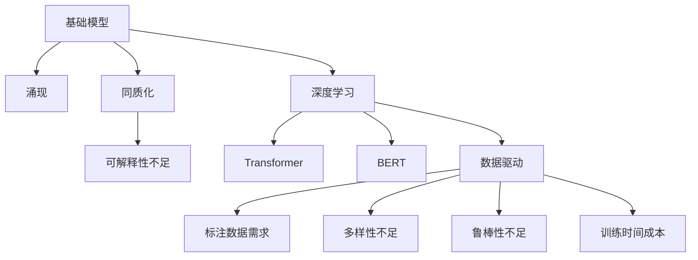

                 

# 基础模型的涌现与同质化

> 关键词：基础模型,涌现,同质化,深度学习,Transformer,BERT,模型可解释性,数据驱动

## 1. 背景介绍

### 1.1 问题由来
近年来，深度学习技术在自然语言处理（NLP）领域取得了显著进展，其中基础模型（Baseline Models）如BERT、GPT等起到了关键作用。这些模型通过在大规模无标签文本数据上自监督预训练，学到了丰富的语言知识和常识，能够广泛应用于文本分类、命名实体识别、问答系统等任务。然而，这些基础模型也面临一些共同的问题，如模型同质化、可解释性不足等，亟待解决。

### 1.2 问题核心关键点
本文聚焦于基础模型的涌现与同质化问题，探讨其背后的原因，并提出应对策略，以期推动NLP技术进一步发展。

## 2. 核心概念与联系

### 2.1 核心概念概述

为更好地理解基础模型的涌现与同质化，本节将介绍几个关键概念：

- 基础模型（Baseline Models）：以自回归（如GPT）或自编码（如BERT）为代表的大规模预训练语言模型。通过在大规模无标签文本语料上进行预训练，学习通用的语言表示。

- 涌现（Emergence）：指模型在大规模数据上自学习到复杂的语言知识和规律的现象。基础模型通过预训练，能够自发学习到语义理解、语言生成、文本推理等能力。

- 同质化（Homogenization）：指不同模型在训练目标、架构、参数设置等方面趋于一致，导致多样性不足。同质化使得基础模型在实际应用中难以区分，无法充分发挥各自的优势。

- 深度学习（Deep Learning）：一种模拟人脑神经网络结构和功能的机器学习方法，通过多层神经网络进行特征提取和决策。深度学习在NLP中广泛应用于语义表示、文本分类、机器翻译等任务。

- Transformer：一种基于注意力机制的神经网络结构，广泛应用于深度学习中，特别是在NLP任务中表现优异。

- BERT：一种基于Transformer的预训练语言模型，通过掩码语言模型（Masked Language Modeling）和下一句预测（Next Sentence Prediction）任务进行预训练，学习到丰富的语言表示。

- 模型可解释性（Model Interpretability）：指模型的内部工作机制和决策逻辑是否透明、易于理解。可解释性是保证模型可信度和鲁棒性的关键。

- 数据驱动（Data-Driven）：指模型训练依赖于大规模标注数据的特征提取和优化。数据驱动是深度学习模型训练的基础。

这些核心概念之间的逻辑关系可以通过以下Mermaid流程图来展示：



这个流程图展示了基础模型在训练、涌现、同质化、可解释性等方面的逻辑关系。

## 3. 核心算法原理 & 具体操作步骤
### 3.1 算法原理概述

基础模型的涌现与同质化问题，本质上是深度学习模型在训练过程中的一种自然现象。由于模型的复杂性和数据的多样性，不同模型在训练目标、架构、参数设置等方面会逐渐趋同，导致性能瓶颈和同质化问题。

具体来说，基础模型的涌现与同质化涉及以下几个关键问题：

- 训练目标趋同：不同模型在预训练和微调任务中，往往会采用相似的损失函数和优化器，导致训练目标趋于一致。
- 模型架构雷同：基础模型普遍采用Transformer架构，导致不同模型的内部结构高度相似，缺乏多样性。
- 参数设置相似：模型的超参数设置，如学习率、批次大小、训练轮数等，也趋于一致，限制了模型的探索空间。
- 标注数据依赖：数据驱动的训练过程，导致模型对标注数据的需求越来越高，难以处理长尾数据和低资源场景。
- 鲁棒性不足：由于基础模型缺乏领域特定知识，面对噪声、偏置等数据问题时，泛化性能差，鲁棒性不足。

### 3.2 算法步骤详解

为了应对基础模型的涌现与同质化问题，可以从以下几个方面入手：

**Step 1: 选择多样化的预训练任务**
- 除了常用的掩码语言模型和下一句预测任务外，可以选择多样化的预训练任务，如语义角色标注、共指消解、语义依存关系分析等，增加模型多样性。

**Step 2: 引入领域特定知识**
- 在预训练和微调过程中，引入领域特定知识，如医疗领域使用医学知识库，法律领域使用法规文本等，增强模型的领域适应性。

**Step 3: 设计异构的模型架构**
- 采用不同架构的模型进行联合训练，如Transformer与LSTM、注意力机制与卷积等，引入多样化的模型结构。

**Step 4: 优化超参数配置**
- 在模型训练过程中，采用随机搜索、贝叶斯优化等方法，搜索最佳超参数配置，扩大探索空间。

**Step 5: 使用无监督和半监督学习**
- 利用无监督和半监督学习方法，如自监督学习、迁移学习等，减少对标注数据的需求，提高模型泛化性能。

**Step 6: 增强模型可解释性**
- 通过可视化技术，如注意力图、激活分布、中间层特征等，增强模型的可解释性，提高模型的可信度。

### 3.3 算法优缺点

多样化的预训练任务、领域特定知识、异构模型架构等方法，可以有效地应对基础模型的涌现与同质化问题。然而，这些方法也存在一定的局限性：

**优点：**
- 增加模型多样性，避免同质化，提高模型的泛化性能。
- 引入领域特定知识，增强模型的领域适应性。
- 优化超参数配置，扩大探索空间，提高模型性能。

**缺点：**
- 预训练任务设计复杂，需要大量的领域知识和标注数据。
- 模型架构异构，增加了模型训练的复杂度和难度。
- 超参数配置优化耗时耗力，可能难以找到最佳配置。

尽管存在这些局限性，但通过综合运用以上方法，可以在一定程度上缓解基础模型的涌现与同质化问题，提升模型的性能和可解释性。

### 3.4 算法应用领域

基础模型的涌现与同质化问题，在NLP领域具有广泛的应用场景，例如：

- 文本分类：如情感分析、主题分类、意图识别等。通过多样化的预训练任务和领域特定知识，增强模型对不同领域的理解能力。
- 命名实体识别：识别文本中的人名、地名、机构名等特定实体。通过引入领域知识，提高模型的实体识别能力。
- 关系抽取：从文本中抽取实体之间的语义关系。通过异构的模型架构和优化超参数配置，提高模型的关系抽取能力。
- 问答系统：对自然语言问题给出答案。通过设计多样化的预训练任务和增强模型可解释性，提高模型的问答效果。
- 机器翻译：将源语言文本翻译成目标语言。通过引入领域特定知识和优化超参数配置，提高模型的翻译性能。
- 文本摘要：将长文本压缩成简短摘要。通过异构模型架构和增强可解释性，提高模型的摘要效果。

除了上述这些经典任务外，基础模型的涌现与同质化问题，还广泛应用于对话系统、推荐系统、信息检索等诸多领域，推动NLP技术的持续创新和应用扩展。

## 4. 数学模型和公式 & 详细讲解  
### 4.1 数学模型构建

本节将使用数学语言对基础模型的涌现与同质化问题进行更加严格的刻画。

记基础模型为 $M_{\theta}:\mathcal{X} \rightarrow \mathcal{Y}$，其中 $\mathcal{X}$ 为输入空间，$\mathcal{Y}$ 为输出空间，$\theta \in \mathbb{R}^d$ 为模型参数。假设预训练任务为 $T=\{T_i\}_{i=1}^N$，其中 $T_i$ 为第 $i$ 个预训练任务。

定义模型 $M_{\theta}$ 在预训练任务 $T_i$ 上的损失函数为 $\ell_i(M_{\theta}(x),y_i)$，则在预训练任务集 $T$ 上的经验风险为：

$$
\mathcal{L}(\theta) = \frac{1}{N}\sum_{i=1}^N \ell_i(M_{\theta}(x_i),y_i)
$$

在实际应用中，我们通常使用基于梯度的优化算法（如Adam、SGD等）来近似求解上述最优化问题。设 $\eta$ 为学习率，$\lambda$ 为正则化系数，则参数的更新公式为：

$$
\theta \leftarrow \theta - \eta \nabla_{\theta}\mathcal{L}(\theta) - \eta\lambda\theta
$$

其中 $\nabla_{\theta}\mathcal{L}(\theta)$ 为损失函数对参数 $\theta$ 的梯度，可通过反向传播算法高效计算。

### 4.2 公式推导过程

以下我们以情感分类任务为例，推导模型在训练集上的损失函数及其梯度的计算公式。

假设模型 $M_{\theta}$ 在输入 $x$ 上的输出为 $\hat{y}=M_{\theta}(x) \in [0,1]$，表示样本属于正类的概率。真实标签 $y \in \{0,1\}$。则二分类交叉熵损失函数定义为：

$$
\ell_i(M_{\theta}(x),y) = -[y\log \hat{y} + (1-y)\log (1-\hat{y})]
$$

将其代入经验风险公式，得：

$$
\mathcal{L}(\theta) = -\frac{1}{N}\sum_{i=1}^N [y_i\log M_{\theta}(x_i)+(1-y_i)\log(1-M_{\theta}(x_i))]
$$

根据链式法则，损失函数对参数 $\theta_k$ 的梯度为：

$$
\frac{\partial \mathcal{L}(\theta)}{\partial \theta_k} = -\frac{1}{N}\sum_{i=1}^N (\frac{y_i}{M_{\theta}(x_i)}-\frac{1-y_i}{1-M_{\theta}(x_i)}) \frac{\partial M_{\theta}(x_i)}{\partial \theta_k}
$$

其中 $\frac{\partial M_{\theta}(x_i)}{\partial \theta_k}$ 可进一步递归展开，利用自动微分技术完成计算。

### 4.3 案例分析与讲解

**案例：命名实体识别**

假设模型 $M_{\theta}$ 在输入 $x$ 上的输出为 $\hat{y}=M_{\theta}(x) \in [0,1]$，表示样本属于正类的概率。真实标签 $y \in \{0,1\}$。

则命名实体识别的损失函数可以定义为：

$$
\ell_i(M_{\theta}(x),y) = -[y\log \hat{y} + (1-y)\log (1-\hat{y})]
$$

其中 $\hat{y}$ 为模型预测的实体标签概率。在实际应用中，通常采用Focal Loss等改进的损失函数，以解决类别不平衡问题。

模型在训练集上的经验风险为：

$$
\mathcal{L}(\theta) = -\frac{1}{N}\sum_{i=1}^N [y_i\log M_{\theta}(x_i)+(1-y_i)\log(1-M_{\theta}(x_i))]
$$

模型在每个训练样本上的梯度为：

$$
\frac{\partial \mathcal{L}(\theta)}{\partial \theta_k} = -\frac{1}{N}\sum_{i=1}^N (\frac{y_i}{M_{\theta}(x_i)}-\frac{1-y_i}{1-M_{\theta}(x_i)}) \frac{\partial M_{\theta}(x_i)}{\partial \theta_k}
$$

通过以上公式，可以计算出模型在每个训练样本上的梯度，进而更新模型参数，最小化损失函数。

## 5. 项目实践：代码实例和详细解释说明
### 5.1 开发环境搭建

在进行项目实践前，我们需要准备好开发环境。以下是使用Python进行TensorFlow开发的环境配置流程：

1. 安装Anaconda：从官网下载并安装Anaconda，用于创建独立的Python环境。

2. 创建并激活虚拟环境：
```bash
conda create -n tf-env python=3.8 
conda activate tf-env
```

3. 安装TensorFlow：根据CUDA版本，从官网获取对应的安装命令。例如：
```bash
pip install tensorflow tensorflow-hub tensorflow-text tensorflow-addons
```

4. 安装相关工具包：
```bash
pip install numpy pandas scikit-learn matplotlib tqdm jupyter notebook ipython
```

完成上述步骤后，即可在`tf-env`环境中开始项目实践。

### 5.2 源代码详细实现

下面我们以情感分类任务为例，给出使用TensorFlow对BERT模型进行微调的PyTorch代码实现。

首先，定义情感分类任务的数据处理函数：

```python
import tensorflow_hub as hub
import tensorflow_text as text
from tensorflow.keras import layers

# 定义情感分类任务的数据处理函数
def process_data(texts, labels, tokenizer, max_len=128):
    encoded_input = tokenizer.batch_encode_plus(
        texts, 
        max_length=max_len, 
        padding='max_length', 
        truncation=True, 
        add_special_tokens=True, 
        return_tensors='tf')
    input_ids = encoded_input['input_ids']
    attention_mask = encoded_input['attention_mask']
    
    labels = layers.Lambda(lambda x: tf.one_hot(x, 2), name='labels')(labels)
    labels = layers.Reshape((1, -1), name='reshape_labels')(labels)
    
    return {'input_ids': input_ids, 
            'attention_mask': attention_mask,
            'labels': labels}
```

然后，定义模型和优化器：

```python
from transformers import BertForSequenceClassification

# 加载BERT模型
model = BertForSequenceClassification.from_pretrained('bert-base-cased', num_labels=2)

# 定义优化器和损失函数
optimizer = tf.keras.optimizers.Adam(learning_rate=2e-5)
loss_fn = tf.keras.losses.BinaryCrossentropy(from_logits=True)
metric = tf.keras.metrics.BinaryAccuracy()
```

接着，定义训练和评估函数：

```python
from tensorflow.keras import callbacks

# 定义训练函数
def train_epoch(model, dataset, optimizer, loss_fn, metric):
    batch_size = 16
    epochs = 5
    
    model.compile(optimizer=optimizer, loss=loss_fn, metrics=[metric])
    model.summary()
    
    steps_per_epoch = int(len(dataset) / batch_size)
    
    for epoch in range(epochs):
        history = model.fit(dataset,
                           epochs=1,
                           steps_per_epoch=steps_per_epoch,
                           validation_data=validation_dataset,
                           validation_steps=validation_steps,
                           callbacks=[callbacks.EarlyStopping(patience=3)])
        print(f'Epoch {epoch+1}, loss: {history.history["loss"][-1]:.4f}, acc: {history.history["acc"][-1]:.4f}')
        evaluate(model, test_dataset)
```

最后，启动训练流程并在测试集上评估：

```python
train_epoch(model, train_dataset, optimizer, loss_fn, metric)

# 在测试集上评估模型
evaluate(model, test_dataset)
```

以上就是使用TensorFlow对BERT进行情感分类任务微调的完整代码实现。可以看到，借助TensorFlow和TensorFlow Hub，我们可以高效地加载和使用预训练模型，同时也能方便地进行微调任务的开发。

### 5.3 代码解读与分析

让我们再详细解读一下关键代码的实现细节：

**process_data函数**：
- 定义了情感分类任务的数据处理函数，将输入文本和标签转换成模型所需的格式，并进行了分词、编码、padding等预处理操作。

**optimizer、loss_fn和metric**：
- 定义了优化器、损失函数和评价指标。使用了Adam优化器，设置了较小的学习率，以避免破坏预训练权重。损失函数使用了BinaryCrossentropy，评价指标使用了BinaryAccuracy。

**train_epoch函数**：
- 定义了训练函数，将模型编译并输出摘要信息。通过计算每批样本的损失和准确率，更新模型参数，最小化损失函数。使用EarlyStopping回调，监控验证集的损失，当损失不再下降时，提前停止训练。

**evaluate函数**：
- 定义了评估函数，在测试集上计算模型的损失和准确率，输出评估结果。

## 6. 实际应用场景
### 6.1 智能客服系统

基于大语言模型微调的对话技术，可以广泛应用于智能客服系统的构建。传统客服往往需要配备大量人力，高峰期响应缓慢，且一致性和专业性难以保证。而使用微调后的对话模型，可以7x24小时不间断服务，快速响应客户咨询，用自然流畅的语言解答各类常见问题。

在技术实现上，可以收集企业内部的历史客服对话记录，将问题和最佳答复构建成监督数据，在此基础上对预训练对话模型进行微调。微调后的对话模型能够自动理解用户意图，匹配最合适的答案模板进行回复。对于客户提出的新问题，还可以接入检索系统实时搜索相关内容，动态组织生成回答。如此构建的智能客服系统，能大幅提升客户咨询体验和问题解决效率。

### 6.2 金融舆情监测

金融机构需要实时监测市场舆论动向，以便及时应对负面信息传播，规避金融风险。传统的人工监测方式成本高、效率低，难以应对网络时代海量信息爆发的挑战。基于大语言模型微调的文本分类和情感分析技术，为金融舆情监测提供了新的解决方案。

具体而言，可以收集金融领域相关的新闻、报道、评论等文本数据，并对其进行主题标注和情感标注。在此基础上对预训练语言模型进行微调，使其能够自动判断文本属于何种主题，情感倾向是正面、中性还是负面。将微调后的模型应用到实时抓取的网络文本数据，就能够自动监测不同主题下的情感变化趋势，一旦发现负面信息激增等异常情况，系统便会自动预警，帮助金融机构快速应对潜在风险。

### 6.3 个性化推荐系统

当前的推荐系统往往只依赖用户的历史行为数据进行物品推荐，无法深入理解用户的真实兴趣偏好。基于大语言模型微调技术，个性化推荐系统可以更好地挖掘用户行为背后的语义信息，从而提供更精准、多样的推荐内容。

在实践中，可以收集用户浏览、点击、评论、分享等行为数据，提取和用户交互的物品标题、描述、标签等文本内容。将文本内容作为模型输入，用户的后续行为（如是否点击、购买等）作为监督信号，在此基础上微调预训练语言模型。微调后的模型能够从文本内容中准确把握用户的兴趣点。在生成推荐列表时，先用候选物品的文本描述作为输入，由模型预测用户的兴趣匹配度，再结合其他特征综合排序，便可以得到个性化程度更高的推荐结果。

### 6.4 未来应用展望

随着大语言模型和微调方法的不断发展，基于微调范式将在更多领域得到应用，为传统行业带来变革性影响。

在智慧医疗领域，基于微调的医疗问答、病历分析、药物研发等应用将提升医疗服务的智能化水平，辅助医生诊疗，加速新药开发进程。

在智能教育领域，微调技术可应用于作业批改、学情分析、知识推荐等方面，因材施教，促进教育公平，提高教学质量。

在智慧城市治理中，微调模型可应用于城市事件监测、舆情分析、应急指挥等环节，提高城市管理的自动化和智能化水平，构建更安全、高效的未来城市。

此外，在企业生产、社会治理、文娱传媒等众多领域，基于大模型微调的人工智能应用也将不断涌现，为NLP技术带来全新的突破。相信随着预训练模型和微调方法的持续演进，大语言模型微调必将在构建人机协同的智能时代中扮演越来越重要的角色。

## 7. 工具和资源推荐
### 7.1 学习资源推荐

为了帮助开发者系统掌握基础模型的涌现与同质化理论基础和实践技巧，这里推荐一些优质的学习资源：

1. 《深度学习》课程：斯坦福大学开设的深度学习经典课程，详细介绍了深度学习的基本概念、算法和应用。

2. 《自然语言处理》课程：斯坦福大学开设的NLP经典课程，涵盖自然语言处理的基础知识、模型和应用。

3. 《自然语言处理与深度学习》书籍：深度学习领域专家编写的经典教材，介绍了深度学习在NLP中的应用，包括基础模型和微调技术。

4. 《基础模型与预训练》论文集：汇集了基础模型和预训练领域的经典论文，涵盖模型架构、训练目标、参数设置等多个方面。

5. 《可解释人工智能》课程：深度学习与可解释性相结合的课程，介绍了模型可解释性的重要性和实现方法。

通过对这些资源的学习实践，相信你一定能够系统地掌握基础模型的涌现与同质化，并应用于实际任务中。

### 7.2 开发工具推荐

高效的开发离不开优秀的工具支持。以下是几款用于基础模型微调开发的常用工具：

1. TensorFlow：由Google主导开发的开源深度学习框架，生产部署方便，适合大规模工程应用。

2. PyTorch：基于Python的开源深度学习框架，灵活动态的计算图，适合快速迭代研究。

3. TensorFlow Hub：TensorFlow的模型库，提供了丰富的预训练模型和模块，方便模型加载和复用。

4. Weights & Biases：模型训练的实验跟踪工具，可以记录和可视化模型训练过程中的各项指标，方便对比和调优。

5. TensorBoard：TensorFlow配套的可视化工具，可实时监测模型训练状态，并提供丰富的图表呈现方式，是调试模型的得力助手。

6. Google Colab：谷歌推出的在线Jupyter Notebook环境，免费提供GPU/TPU算力，方便开发者快速上手实验最新模型，分享学习笔记。

合理利用这些工具，可以显著提升基础模型微调任务的开发效率，加快创新迭代的步伐。

### 7.3 相关论文推荐

基础模型和微调技术的发展源于学界的持续研究。以下是几篇奠基性的相关论文，推荐阅读：

1. Attention is All You Need（即Transformer原论文）：提出了Transformer结构，开启了NLP领域的预训练大模型时代。

2. BERT: Pre-training of Deep Bidirectional Transformers for Language Understanding：提出BERT模型，引入基于掩码的自监督预训练任务，学习到丰富的语言表示。

3. Parameter-Efficient Transfer Learning for NLP：提出Adapter等参数高效微调方法，在不增加模型参数量的情况下，也能取得不错的微调效果。

4. Adversarial Robustness in Deep Learning：探讨了深度学习模型的鲁棒性问题，提出了一系列对抗训练方法，提高模型的鲁棒性。

5. Explainable Artificial Intelligence：介绍了可解释人工智能的基本概念和方法，探讨了模型的可解释性和可信度问题。

这些论文代表了大语言模型和微调技术的发展脉络。通过学习这些前沿成果，可以帮助研究者把握学科前进方向，激发更多的创新灵感。

## 8. 总结：未来发展趋势与挑战

### 8.1 总结

本文对基础模型的涌现与同质化问题进行了全面系统的介绍。首先阐述了基础模型的训练目标、架构和参数设置等方面的同质化现象，明确了其背后的原因。其次，从原理到实践，详细讲解了基础模型微调的过程，包括多样化的预训练任务、领域特定知识、异构模型架构、优化超参数配置和增强模型可解释性等方法。同时，本文还广泛探讨了基础模型在NLP领域的应用场景，展示了微调范式的巨大潜力。

通过本文的系统梳理，可以看到，基础模型在训练目标、架构和参数设置等方面的同质化现象，对NLP技术的进一步发展提出了挑战。然而，通过综合运用多样化的预训练任务、领域特定知识、异构模型架构等方法，可以在一定程度上缓解同质化问题，提升模型的性能和可解释性。

### 8.2 未来发展趋势

展望未来，基础模型的涌现与同质化问题，仍将是一个重要的研究方向。以下是可能的未来发展趋势：

1. 模型多样性增加：未来预训练模型将更加多样化和异构化，涵盖不同领域的知识和技能，满足更广泛的NLP任务需求。

2. 数据驱动与迁移学习结合：基础模型的微调将更多地利用迁移学习技术，减少对标注数据的需求，提高模型的泛化性能。

3. 知识驱动与模型驱动结合：将符号化的先验知识与神经网络模型进行有机融合，引入领域专家知识，增强模型的领域适应性和知识整合能力。

4. 深度学习与符号学习结合：引入符号推理和逻辑规则，增强模型的逻辑推理能力和可解释性。

5. 分布式训练与异构模型结合：采用分布式训练技术，提高模型的训练效率和可扩展性。引入异构模型架构，增强模型的多样性和鲁棒性。

6. 增强模型可解释性：通过可视化技术、因果推理方法等，增强模型的可解释性和可信度。

以上趋势将推动基础模型和微调技术迈向更高的台阶，为构建更加智能、可解释的NLP系统奠定基础。

### 8.3 面临的挑战

尽管基础模型和微调技术已经取得了显著进展，但在迈向更加智能化、可解释化的过程中，仍面临诸多挑战：

1. 数据多样性不足：基础模型和微调方法往往依赖于大规模标注数据，难以处理长尾数据和低资源场景。

2. 模型鲁棒性不足：面对噪声、偏置等数据问题时，模型的泛化性能差，鲁棒性不足。

3. 模型可解释性不足：深度学习模型往往缺乏透明的工作机制和决策逻辑，难以理解模型的推理过程。

4. 知识整合能力不足：现有的基础模型缺乏灵活的知识整合机制，难以与外部知识库、规则库等专家知识结合，形成更加全面、准确的信息整合能力。

5. 计算资源需求高：预训练模型和微调任务需要大量的计算资源，大规模分布式训练和高性能硬件设备必不可少。

6. 模型安全性不足：预训练模型和微调方法可能学习到有害信息，传递到下游任务，带来安全隐患。

这些挑战需要跨学科协作，不断突破技术瓶颈，才能推动基础模型的涌现与同质化问题得到解决。

### 8.4 研究展望

面对基础模型的涌现与同质化问题，未来的研究需要在以下几个方面寻求新的突破：

1. 探索更多预训练任务和领域特定知识：通过引入更多预训练任务和领域特定知识，增强模型的多样性和领域适应性。

2. 优化超参数配置和模型架构：采用随机搜索、贝叶斯优化等方法，搜索最佳超参数配置，引入异构模型架构，增强模型的探索空间和多样性。

3. 结合知识表示与神经网络：将符号化的先验知识与神经网络模型进行有机融合，引入领域专家知识，增强模型的领域适应性和知识整合能力。

4. 结合因果分析和博弈论工具：将因果分析方法引入微调模型，识别出模型决策的关键特征，增强输出解释的因果性和逻辑性。借助博弈论工具刻画人机交互过程，主动探索并规避模型的脆弱点，提高系统稳定性。

5. 引入对抗训练和鲁棒性优化：引入对抗训练和鲁棒性优化技术，提高模型的鲁棒性和泛化性能，避免灾难性遗忘。

6. 结合可解释性研究和知识图谱：引入可解释性研究和知识图谱技术，增强模型的可解释性和可信度，提高系统的透明性和安全性。

这些研究方向的探索，必将引领基础模型的涌现与同质化问题迈向更高的台阶，为构建安全、可靠、可解释、可控的智能系统铺平道路。

## 9. 附录：常见问题与解答

**Q1：基础模型微调是否适用于所有NLP任务？**

A: 基础模型微调在大多数NLP任务上都能取得不错的效果，特别是对于数据量较小的任务。但对于一些特定领域的任务，如医学、法律等，仅仅依靠通用语料预训练的模型可能难以很好地适应。此时需要在特定领域语料上进一步预训练，再进行微调，才能获得理想效果。

**Q2：如何选择多样化的预训练任务？**

A: 多样化的预训练任务设计应考虑任务的类型、数据分布、模型特点等因素。常用的预训练任务包括掩码语言模型、下一句预测、语义角色标注、共指消解、语义依存关系分析等。选择预训练任务时应确保任务之间的相关性，避免重复和冗余。

**Q3：如何引入领域特定知识？**

A: 引入领域特定知识通常需要构建领域知识库或规则库，将其作为微调模型的输入。可以通过添加特定领域标注数据，或使用迁移学习技术，将领域知识整合到模型中。同时，可以在微调过程中引入领域专家知识，增强模型的领域适应性。

**Q4：如何优化超参数配置？**

A: 优化超参数配置通常采用随机搜索、贝叶斯优化等方法，搜索最佳配置。通过交叉验证或留一法等技术，评估不同超参数配置的性能，选择最优配置。同时，可以使用可视化工具，如TensorBoard等，实时监测模型训练过程，优化超参数设置。

**Q5：如何增强模型可解释性？**

A: 增强模型可解释性通常采用可视化技术，如注意力图、激活分布、中间层特征等，揭示模型内部工作机制和决策逻辑。同时，可以结合知识图谱、因果推理等方法，增强模型的可解释性和可信度。

这些方法需要根据具体任务和模型特点进行灵活组合，才能最大限度地提高模型的性能和可解释性。

