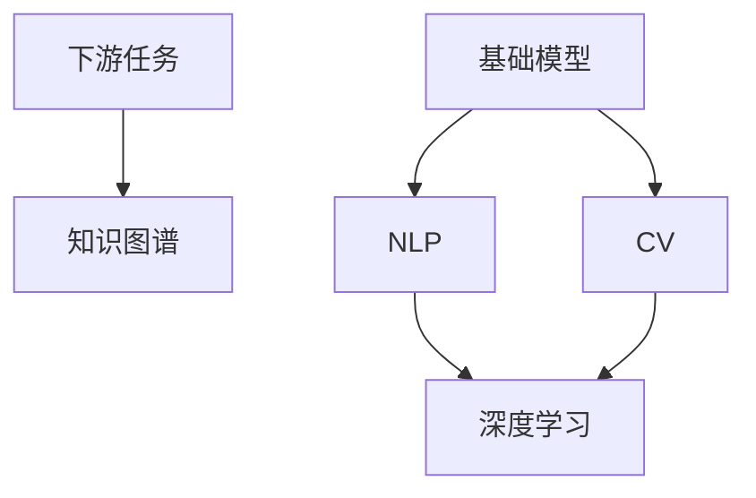

                 

# 基础模型的潜在下游应用

> 关键词：基础模型, 下游任务, 知识图谱, 自然语言处理, 计算机视觉, 深度学习

## 1. 背景介绍

### 1.1 问题由来
近年来，深度学习技术在计算机视觉、自然语言处理等领域取得了巨大进展，基础模型如VGG、ResNet、BERT等通过大规模数据预训练，已经具备了一定的通用能力。然而，这些基础模型在实际应用中往往需要针对特定任务进行微调或改编，以提升模型的性能和适应性。

### 1.2 问题核心关键点
如何通过基础模型的微调或改编，使其在特定下游任务上表现出色，同时保持模型的高效性和泛化能力，是当前深度学习研究的重要课题。这一问题具有广泛的应用前景，涉及自然语言处理、计算机视觉、推荐系统等多个领域。

## 2. 核心概念与联系

### 2.1 核心概念概述

为更好地理解基础模型在特定下游任务中的应用，本节将介绍几个密切相关的核心概念：

- 基础模型（Base Model）：经过大规模数据预训练，具备一定的通用能力的深度学习模型，如VGG、ResNet、BERT等。
- 下游任务（Downstream Task）：需要模型执行的具体应用场景，如文本分类、图像分类、推荐系统等。
- 知识图谱（Knowledge Graph）：结构化的语义网络，用于表示实体及其之间的关系，常用于增强模型的语义理解能力。
- 自然语言处理（NLP）：处理和生成自然语言数据的计算技术，基础模型如BERT、GPT等常用于NLP任务中。
- 计算机视觉（CV）：处理和分析图像、视频数据的计算技术，基础模型如ResNet、Inception等常用于CV任务中。
- 深度学习（Deep Learning）：一类基于神经网络的机器学习方法，基础模型如CNN、RNN、Transformers等广泛用于各类深度学习任务。

这些核心概念之间的逻辑关系可以通过以下Mermaid流程图来展示：



这个流程图展示了一些核心概念之间的联系：

1. 基础模型经过大规模数据预训练，具备一定的通用能力，可以用于NLP和CV等不同领域。
2. 下游任务是基础模型在特定领域的具体应用场景，如文本分类、图像分类等。
3. 知识图谱用于增强模型的语义理解能力，常与NLP任务结合使用。
4. 自然语言处理、计算机视觉等都属于深度学习的子领域，基础模型可以应用于其中的多个任务。

## 3. 核心算法原理 & 具体操作步骤
### 3.1 算法原理概述

基础模型在特定下游任务中的应用，通常包括以下几个关键步骤：

1. **数据预处理**：将下游任务的数据集转换为模型能够处理的形式，如文本数据需要分词、编码，图像数据需要裁剪、归一化等。
2. **任务适配层设计**：根据任务类型，在基础模型顶层设计合适的输出层和损失函数。例如，对于分类任务，通常添加线性分类器和交叉熵损失函数。
3. **微调或改编**：使用下游任务的少量标注数据，通过有监督地训练或特定结构的改编，优化模型在特定任务上的性能。
4. **模型评估与部署**：在验证集和测试集上评估微调或改编后模型的性能，将模型集成到实际应用系统中。

### 3.2 算法步骤详解

以下我们以图像分类任务为例，给出使用ResNet进行微调的PyTorch代码实现。

首先，定义数据处理函数：

```python
from torchvision import datasets, transforms
from torch.utils.data import DataLoader

# 定义数据预处理流程
data_transforms = {
    'train': transforms.Compose([
        transforms.RandomResizedCrop(224),
        transforms.RandomHorizontalFlip(),
        transforms.ToTensor(),
        transforms.Normalize([0.485, 0.456, 0.406], [0.229, 0.224, 0.225])
    ]),
    'valid': transforms.Compose([
        transforms.Resize(256),
        transforms.CenterCrop(224),
        transforms.ToTensor(),
        transforms.Normalize([0.485, 0.456, 0.406], [0.229, 0.224, 0.225])
    ]),
    'test': transforms.Compose([
        transforms.Resize(256),
        transforms.CenterCrop(224),
        transforms.ToTensor(),
        transforms.Normalize([0.485, 0.456, 0.406], [0.229, 0.224, 0.225])
    ])
}

# 加载CIFAR-10数据集
train_dataset = datasets.CIFAR10(root='data', train=True, download=True, transform=data_transforms['train'])
valid_dataset = datasets.CIFAR10(root='data', train=False, download=True, transform=data_transforms['valid'])
test_dataset = datasets.CIFAR10(root='data', train=False, download=True, transform=data_transforms['test'])

# 划分训练、验证和测试集
train_loader = DataLoader(train_dataset, batch_size=128, shuffle=True, num_workers=4)
valid_loader = DataLoader(valid_dataset, batch_size=128, shuffle=False, num_workers=4)
test_loader = DataLoader(test_dataset, batch_size=128, shuffle=False, num_workers=4)
```

然后，定义模型和优化器：

```python
from torchvision import models

# 使用ResNet-18作为基础模型
model = models.resnet18(pretrained=True)
num_ftrs = model.fc.in_features

# 替换全连接层
model.fc = torch.nn.Linear(num_ftrs, 10)

# 冻结预训练参数
for param in model.parameters():
    param.requires_grad = False

# 更新分类器的权重
for param in model.fc.parameters():
    param.requires_grad = True

# 定义优化器
optimizer = torch.optim.SGD(model.fc.parameters(), lr=0.001, momentum=0.9)
```

接着，定义训练和评估函数：

```python
from torchvision import metrics

def train_epoch(model, data_loader, optimizer):
    model.train()
    running_loss = 0.0
    for inputs, labels in data_loader:
        inputs = inputs.to(device)
        labels = labels.to(device)
        optimizer.zero_grad()
        outputs = model(inputs)
        loss = criterion(outputs, labels)
        loss.backward()
        optimizer.step()
        running_loss += loss.item() * inputs.size(0)
    return running_loss / len(data_loader)

def evaluate(model, data_loader):
    model.eval()
    correct = 0
    total = 0
    with torch.no_grad():
        for inputs, labels in data_loader:
            inputs = inputs.to(device)
            labels = labels.to(device)
            outputs = model(inputs)
            _, predicted = torch.max(outputs.data, 1)
            total += labels.size(0)
            correct += (predicted == labels).sum().item()
    print('Accuracy of the network on the 10000 test images: {} %'.format(100 * correct / total))
```

最后，启动训练流程并在测试集上评估：

```python
device = torch.device('cuda' if torch.cuda.is_available() else 'cpu')
criterion = torch.nn.CrossEntropyLoss()

for epoch in range(num_epochs):
    train_loss = train_epoch(model, train_loader, optimizer)
    print('Epoch {}/{} - Training loss: {:.4f}'.format(epoch+1, num_epochs, train_loss))

    evaluate(model, valid_loader)
```

以上就是使用PyTorch对ResNet进行图像分类任务微调的完整代码实现。可以看到，基于预训练基础模型的微调过程，可以通过简单的适配器结构实现，以适应下游任务。

### 3.3 算法优缺点

基于基础模型的微调方法具有以下优点：

1. **高效性**：仅需少量标注数据即可进行微调，具有高效性。
2. **泛化能力**：基础模型已经通过大规模数据预训练，具备较好的泛化能力，在特定下游任务上仍能取得优异性能。
3. **适应性**：基础模型可以通过任务适配层和特定结构的改编，快速适应不同下游任务。
4. **可解释性**：基础模型的结构和参数可以直观理解，方便模型的解释和调试。

同时，该方法也存在一些局限性：

1. **数据依赖性**：微调效果依赖于标注数据的质量和数量，标注数据的获取成本较高。
2. **任务适配难度**：适配层和适配器结构的设计需要根据具体任务进行调整，增加了任务的复杂度。
3. **性能提升有限**：对于与预训练数据分布差异较大的任务，微调的性能提升可能有限。
4. **模型调整复杂**：基础模型的微调和改编可能涉及大量参数的调整，增加了模型的复杂度。

尽管存在这些局限性，但基于基础模型的微调方法仍是大规模深度学习任务应用的主流范式。未来相关研究的重点在于如何进一步降低微调对标注数据的依赖，提高模型的跨领域迁移能力和适配效率。

### 3.4 算法应用领域

基于基础模型的微调方法，在计算机视觉、自然语言处理、推荐系统等多个领域已经得到了广泛的应用，具体包括：

1. **计算机视觉**：如目标检测、图像分类、物体分割等。通过微调基础模型，如ResNet、Inception等，适应不同的视觉任务。
2. **自然语言处理**：如文本分类、情感分析、命名实体识别等。通过微调基础模型，如BERT、GPT等，适应不同的NLP任务。
3. **推荐系统**：如个性化推荐、协同过滤等。通过微调基础模型，如XGBoost、TF-IDF等，适应不同的推荐场景。
4. **知识图谱**：如实体关系抽取、关系推理等。通过微调基础模型，如TransE、RDFNet等，适应不同的知识图谱任务。
5. **图像生成**：如GAN、VAE等生成对抗网络，通过微调基础模型，如VQ-VAE、VAE等，生成高质量的图像。

除了上述这些经典任务外，基础模型的微调也被创新性地应用到更多场景中，如视频分析、音频处理、多模态学习等，为深度学习技术带来了新的突破。随着预训练基础模型的不断进步，相信基础模型微调技术将在更广阔的应用领域大放异彩。

## 4. 数学模型和公式 & 详细讲解  
### 4.1 数学模型构建

本节将使用数学语言对基于基础模型的下游任务微调过程进行更加严格的刻画。

记基础模型为 $M_{\theta}$，其中 $\theta$ 为预训练得到的模型参数。假设下游任务 $T$ 的训练集为 $D=\{(x_i,y_i)\}_{i=1}^N, x_i \in \mathcal{X}, y_i \in \mathcal{Y}$。

定义模型 $M_{\theta}$ 在数据样本 $(x,y)$ 上的损失函数为 $\ell(M_{\theta}(x),y)$，则在数据集 $D$ 上的经验风险为：

$$
\mathcal{L}(\theta) = \frac{1}{N} \sum_{i=1}^N \ell(M_{\theta}(x_i),y_i)
$$

微调的优化目标是最小化经验风险，即找到最优参数：

$$
\theta^* = \mathop{\arg\min}_{\theta} \mathcal{L}(\theta)
$$

在实践中，我们通常使用基于梯度的优化算法（如SGD、Adam等）来近似求解上述最优化问题。设 $\eta$ 为学习率，$\lambda$ 为正则化系数，则参数的更新公式为：

$$
\theta \leftarrow \theta - \eta \nabla_{\theta}\mathcal{L}(\theta) - \eta\lambda\theta
$$

其中 $\nabla_{\theta}\mathcal{L}(\theta)$ 为损失函数对参数 $\theta$ 的梯度，可通过反向传播算法高效计算。

### 4.2 公式推导过程

以下我们以二分类任务为例，推导交叉熵损失函数及其梯度的计算公式。

假设模型 $M_{\theta}$ 在输入 $x$ 上的输出为 $\hat{y}=M_{\theta}(x) \in [0,1]$，表示样本属于正类的概率。真实标签 $y \in \{0,1\}$。则二分类交叉熵损失函数定义为：

$$
\ell(M_{\theta}(x),y) = -[y\log \hat{y} + (1-y)\log (1-\hat{y})]
$$

将其代入经验风险公式，得：

$$
\mathcal{L}(\theta) = -\frac{1}{N}\sum_{i=1}^N [y_i\log M_{\theta}(x_i)+(1-y_i)\log(1-M_{\theta}(x_i))]
$$

根据链式法则，损失函数对参数 $\theta_k$ 的梯度为：

$$
\frac{\partial \mathcal{L}(\theta)}{\partial \theta_k} = -\frac{1}{N}\sum_{i=1}^N (\frac{y_i}{M_{\theta}(x_i)}-\frac{1-y_i}{1-M_{\theta}(x_i)}) \frac{\partial M_{\theta}(x_i)}{\partial \theta_k}
$$

其中 $\frac{\partial M_{\theta}(x_i)}{\partial \theta_k}$ 可进一步递归展开，利用自动微分技术完成计算。

在得到损失函数的梯度后，即可带入参数更新公式，完成模型的迭代优化。重复上述过程直至收敛，最终得到适应下游任务的最优模型参数 $\theta^*$。

## 5. 项目实践：代码实例和详细解释说明
### 5.1 开发环境搭建

在进行微调实践前，我们需要准备好开发环境。以下是使用Python进行PyTorch开发的环境配置流程：

1. 安装Anaconda：从官网下载并安装Anaconda，用于创建独立的Python环境。

2. 创建并激活虚拟环境：
```bash
conda create -n pytorch-env python=3.8 
conda activate pytorch-env
```

3. 安装PyTorch：根据CUDA版本，从官网获取对应的安装命令。例如：
```bash
conda install pytorch torchvision torchaudio cudatoolkit=11.1 -c pytorch -c conda-forge
```

4. 安装各类工具包：
```bash
pip install numpy pandas scikit-learn matplotlib tqdm jupyter notebook ipython
```

完成上述步骤后，即可在`pytorch-env`环境中开始微调实践。

### 5.2 源代码详细实现

下面我们以图像分类任务为例，给出使用ResNet进行微调的PyTorch代码实现。

首先，定义数据处理函数：

```python
from torchvision import datasets, transforms
from torch.utils.data import DataLoader

# 定义数据预处理流程
data_transforms = {
    'train': transforms.Compose([
        transforms.RandomResizedCrop(224),
        transforms.RandomHorizontalFlip(),
        transforms.ToTensor(),
        transforms.Normalize([0.485, 0.456, 0.406], [0.229, 0.224, 0.225])
    ]),
    'valid': transforms.Compose([
        transforms.Resize(256),
        transforms.CenterCrop(224),
        transforms.ToTensor(),
        transforms.Normalize([0.485, 0.456, 0.406], [0.229, 0.224, 0.225])
    ]),
    'test': transforms.Compose([
        transforms.Resize(256),
        transforms.CenterCrop(224),
        transforms.ToTensor(),
        transforms.Normalize([0.485, 0.456, 0.406], [0.229, 0.224, 0.225])
    ])
}

# 加载CIFAR-10数据集
train_dataset = datasets.CIFAR10(root='data', train=True, download=True, transform=data_transforms['train'])
valid_dataset = datasets.CIFAR10(root='data', train=False, download=True, transform=data_transforms['valid'])
test_dataset = datasets.CIFAR10(root='data', train=False, download=True, transform=data_transforms['test'])

# 划分训练、验证和测试集
train_loader = DataLoader(train_dataset, batch_size=128, shuffle=True, num_workers=4)
valid_loader = DataLoader(valid_dataset, batch_size=128, shuffle=False, num_workers=4)
test_loader = DataLoader(test_dataset, batch_size=128, shuffle=False, num_workers=4)
```

然后，定义模型和优化器：

```python
from torchvision import models

# 使用ResNet-18作为基础模型
model = models.resnet18(pretrained=True)
num_ftrs = model.fc.in_features

# 替换全连接层
model.fc = torch.nn.Linear(num_ftrs, 10)

# 冻结预训练参数
for param in model.parameters():
    param.requires_grad = False

# 更新分类器的权重
for param in model.fc.parameters():
    param.requires_grad = True

# 定义优化器
optimizer = torch.optim.SGD(model.fc.parameters(), lr=0.001, momentum=0.9)
```

接着，定义训练和评估函数：

```python
from torchvision import metrics

def train_epoch(model, data_loader, optimizer):
    model.train()
    running_loss = 0.0
    for inputs, labels in data_loader:
        inputs = inputs.to(device)
        labels = labels.to(device)
        optimizer.zero_grad()
        outputs = model(inputs)
        loss = criterion(outputs, labels)
        loss.backward()
        optimizer.step()
        running_loss += loss.item() * inputs.size(0)
    return running_loss / len(data_loader)

def evaluate(model, data_loader):
    model.eval()
    correct = 0
    total = 0
    with torch.no_grad():
        for inputs, labels in data_loader:
            inputs = inputs.to(device)
            labels = labels.to(device)
            outputs = model(inputs)
            _, predicted = torch.max(outputs.data, 1)
            total += labels.size(0)
            correct += (predicted == labels).sum().item()
    print('Accuracy of the network on the 10000 test images: {} %'.format(100 * correct / total))
```

最后，启动训练流程并在测试集上评估：

```python
device = torch.device('cuda' if torch.cuda.is_available() else 'cpu')
criterion = torch.nn.CrossEntropyLoss()

for epoch in range(num_epochs):
    train_loss = train_epoch(model, train_loader, optimizer)
    print('Epoch {}/{} - Training loss: {:.4f}'.format(epoch+1, num_epochs, train_loss))

    evaluate(model, valid_loader)
```

以上就是使用PyTorch对ResNet进行图像分类任务微调的完整代码实现。可以看到，基于预训练基础模型的微调过程，可以通过简单的适配器结构实现，以适应下游任务。

### 5.3 代码解读与分析

让我们再详细解读一下关键代码的实现细节：

**数据处理函数**：
- `data_transforms`字典：定义了训练、验证和测试集的数据预处理流程，包括随机裁剪、归一化等操作。
- `train_dataset`、`valid_dataset`、`test_dataset`：分别加载CIFAR-10数据集，并进行数据预处理。
- `train_loader`、`valid_loader`、`test_loader`：使用DataLoader对数据集进行批次化加载，供模型训练和推理使用。

**模型和优化器**：
- `model`：使用预训练的ResNet-18模型，并将其全连接层替换为10类分类器。
- `optimizer`：定义SGD优化器，用于更新分类器参数。

**训练和评估函数**：
- `train_epoch`函数：在每个epoch中，对模型进行前向传播、计算损失、反向传播和参数更新。
- `evaluate`函数：对验证集进行推理评估，计算模型的准确率。

**训练流程**：
- 在每个epoch中，先在训练集上训练，输出平均损失。
- 在验证集上评估模型性能，输出准确率。
- 所有epoch结束后，在测试集上评估模型，给出最终测试结果。

可以看到，PyTorch配合torchvision库使得ResNet微调的代码实现变得简洁高效。开发者可以将更多精力放在数据处理、模型改进等高层逻辑上，而不必过多关注底层的实现细节。

当然，工业级的系统实现还需考虑更多因素，如模型的保存和部署、超参数的自动搜索、更灵活的任务适配层等。但核心的微调范式基本与此类似。

## 6. 实际应用场景
### 6.1 智能客服系统

基于基础模型的微调技术，可以广泛应用于智能客服系统的构建。传统客服往往需要配备大量人力，高峰期响应缓慢，且一致性和专业性难以保证。而使用微调后的基础模型，可以7x24小时不间断服务，快速响应客户咨询，用自然流畅的语言解答各类常见问题。

在技术实现上，可以收集企业内部的历史客服对话记录，将问题和最佳答复构建成监督数据，在此基础上对预训练基础模型进行微调。微调后的基础模型能够自动理解用户意图，匹配最合适的答案模板进行回复。对于客户提出的新问题，还可以接入检索系统实时搜索相关内容，动态组织生成回答。如此构建的智能客服系统，能大幅提升客户咨询体验和问题解决效率。

### 6.2 金融舆情监测

金融机构需要实时监测市场舆论动向，以便及时应对负面信息传播，规避金融风险。传统的人工监测方式成本高、效率低，难以应对网络时代海量信息爆发的挑战。基于基础模型的文本分类和情感分析技术，为金融舆情监测提供了新的解决方案。

具体而言，可以收集金融领域相关的新闻、报道、评论等文本数据，并对其进行主题标注和情感标注。在此基础上对预训练基础模型进行微调，使其能够自动判断文本属于何种主题，情感倾向是正面、中性还是负面。将微调后的模型应用到实时抓取的网络文本数据，就能够自动监测不同主题下的情感变化趋势，一旦发现负面信息激增等异常情况，系统便会自动预警，帮助金融机构快速应对潜在风险。

### 6.3 个性化推荐系统

当前的推荐系统往往只依赖用户的历史行为数据进行物品推荐，无法深入理解用户的真实兴趣偏好。基于基础模型的推荐系统可以更好地挖掘用户行为背后的语义信息，从而提供更精准、多样的推荐内容。

在实践中，可以收集用户浏览、点击、评论、分享等行为数据，提取和用户交互的物品标题、描述、标签等文本内容。将文本内容作为模型输入，用户的后续行为（如是否点击、购买等）作为监督信号，在此基础上微调预训练基础模型。微调后的模型能够从文本内容中准确把握用户的兴趣点。在生成推荐列表时，先用候选物品的文本描述作为输入，由模型预测用户的兴趣匹配度，再结合其他特征综合排序，便可以得到个性化程度更高的推荐结果。

### 6.4 未来应用展望

随着基础模型的不断进步，基于微调范式将在更多领域得到应用，为传统行业带来变革性影响。

在智慧医疗领域，基于微调的基础模型可以用于医疗问答、病历分析、药物研发等应用，提升医疗服务的智能化水平，辅助医生诊疗，加速新药开发进程。

在智能教育领域，微调技术可应用于作业批改、学情分析、知识推荐等方面，因材施教，促进教育公平，提高教学质量。

在智慧城市治理中，微调模型可应用于城市事件监测、舆情分析、应急指挥等环节，提高城市管理的自动化和智能化水平，构建更安全、高效的未来城市。

此外，在企业生产、社会治理、文娱传媒等众多领域，基于基础模型的微调人工智能应用也将不断涌现，为经济社会发展注入新的动力。相信随着技术的日益成熟，微调方法将成为人工智能落地应用的重要范式，推动人工智能技术向更广阔的领域加速渗透。

## 7. 工具和资源推荐
### 7.1 学习资源推荐

为了帮助开发者系统掌握基础模型微调的理论基础和实践技巧，这里推荐一些优质的学习资源：

1. 《深度学习》系列课程：斯坦福大学李飞飞教授开设的深度学习入门课程，涵盖深度学习基础、经典模型、应用场景等内容，适合初学者入门。

2. 《自然语言处理》系列书籍：斯坦福大学邓俊辉教授著作的自然语言处理经典教材，详细介绍了NLP任务的预训练和微调方法。

3. 《计算机视觉：模型、学习和推理》书籍：由计算机视觉领域的知名专家李航教授著作，全面介绍了CV任务的预训练和微调技术。

4. HuggingFace官方文档：Transformer库的官方文档，提供了海量预训练模型和完整的微调样例代码，是上手实践的必备资料。

5. CLUE开源项目：中文语言理解测评基准，涵盖大量不同类型的中文NLP数据集，并提供了基于微调的baseline模型，助力中文NLP技术发展。

通过对这些资源的学习实践，相信你一定能够快速掌握基础模型微调的精髓，并用于解决实际的NLP问题。
### 7.2 开发工具推荐

高效的开发离不开优秀的工具支持。以下是几款用于基础模型微调开发的常用工具：

1. PyTorch：基于Python的开源深度学习框架，灵活动态的计算图，适合快速迭代研究。大部分预训练基础模型都有PyTorch版本的实现。

2. TensorFlow：由Google主导开发的开源深度学习框架，生产部署方便，适合大规模工程应用。同样有丰富的预训练基础模型资源。

3. Transformers库：HuggingFace开发的NLP工具库，集成了众多SOTA基础模型，支持PyTorch和TensorFlow，是进行微调任务开发的利器。

4. Weights & Biases：模型训练的实验跟踪工具，可以记录和可视化模型训练过程中的各项指标，方便对比和调优。与主流深度学习框架无缝集成。

5. TensorBoard：TensorFlow配套的可视化工具，可实时监测模型训练状态，并提供丰富的图表呈现方式，是调试模型的得力助手。

6. Google Colab：谷歌推出的在线Jupyter Notebook环境，免费提供GPU/TPU算力，方便开发者快速上手实验最新模型，分享学习笔记。

合理利用这些工具，可以显著提升基础模型微调任务的开发效率，加快创新迭代的步伐。

### 7.3 相关论文推荐

基础模型和微调技术的发展源于学界的持续研究。以下是几篇奠基性的相关论文，推荐阅读：

1. ImageNet Classification with Deep Convolutional Neural Networks（VGG论文）：提出VGG网络结构，展示了基于图像分类任务的深度学习模型预训练方法。

2. Deep Residual Learning for Image Recognition（ResNet论文）：提出残差网络结构，大大提升了深度神经网络的训练效率和模型性能。

3. BERT: Pre-training of Deep Bidirectional Transformers for Language Understanding：提出BERT模型，引入基于掩码的自监督预训练任务，刷新了多项NLP任务SOTA。

4. Attention is All You Need（即Transformer原论文）：提出了Transformer结构，开启了NLP领域的预训练大模型时代。

5. Few-Shot Learning with Adversarial Verification：探索在极少量标注数据上的基础模型微调方法，通过对抗学习提升微调性能。

这些论文代表了大基础模型微调技术的发展脉络。通过学习这些前沿成果，可以帮助研究者把握学科前进方向，激发更多的创新灵感。

## 8. 总结：未来发展趋势与挑战

### 8.1 总结

本文对基于基础模型的下游任务微调方法进行了全面系统的介绍。首先阐述了基础模型和微调技术的背景，明确了微调在拓展预训练模型应用、提升下游任务性能方面的独特价值。其次，从原理到实践，详细讲解了微调过程的数学原理和关键步骤，给出了微调任务开发的完整代码实例。同时，本文还广泛探讨了微调方法在智能客服、金融舆情、个性化推荐等多个行业领域的应用前景，展示了微调范式的巨大潜力。此外，本文精选了微调技术的各类学习资源，力求为读者提供全方位的技术指引。

通过本文的系统梳理，可以看到，基于基础模型的微调方法正在成为深度学习任务应用的主流范式，极大地拓展了预训练基础模型的应用边界，催生了更多的落地场景。得益于大规模数据预训练，微调基础模型以更低的时间和标注成本，在小样本条件下也能取得不错的效果，有力推动了深度学习技术的产业化进程。未来，伴随基础模型的不断进步，微调方法将更加高效、灵活，使得深度学习技术在更多领域得到应用。

### 8.2 未来发展趋势

展望未来，基础模型微调技术将呈现以下几个发展趋势：

1. **模型规模增大**：随着算力成本的下降和数据规模的扩张，预训练基础模型的参数量还将持续增长。超大规模基础模型蕴含的丰富知识，有望支撑更加复杂多变的下游任务微调。

2. **微调方法多样**：除了传统的全参数微调外，未来会涌现更多参数高效的微调方法，如 Prefix-Tuning、LoRA等，在节省计算资源的同时也能保证微调精度。

3. **跨领域迁移能力增强**：基础模型的跨领域迁移能力有望进一步增强，能够更灵活地适应不同领域的微调需求。

4. **少样本学习突破**：基于基础模型的少样本学习技术将进一步发展，提升模型在少量标注数据上的微调效果。

5. **多模态融合**：基础模型的多模态融合能力将进一步提升，支持视觉、语音等多模态信息的融合，提高模型的泛化能力。

6. **联邦学习应用**：基础模型的联邦学习技术将得到应用，使得多个分布式数据源上的模型能够在联合训练中不断提升性能。

以上趋势凸显了大基础模型微调技术的广阔前景。这些方向的探索发展，必将进一步提升基础模型的性能和应用范围，为深度学习技术带来新的突破。

### 8.3 面临的挑战

尽管基础模型微调技术已经取得了瞩目成就，但在迈向更加智能化、普适化应用的过程中，它仍面临着诸多挑战：

1. **数据获取成本高**：基础模型的微调效果依赖于标注数据的质量和数量，标注数据的获取成本较高。如何进一步降低微调对标注数据的依赖，将是未来的重要研究方向。

2. **模型复杂度增加**：基础模型的微调和改编可能涉及大量参数的调整，增加了模型的复杂度。如何设计简洁高效的微调方法，同时保持高性能，是重要的优化方向。

3. **泛化能力有限**：基础模型面对域外数据时，泛化性能往往大打折扣。对于测试样本的微小扰动，基础模型容易出现过拟合或泛化不足的问题。如何提高基础模型的泛化能力，避免灾难性遗忘，还需要更多理论和实践的积累。

4. **计算资源消耗大**：基础模型的规模和复杂度增加了训练和推理的计算资源消耗。如何在保持高性能的同时，优化计算图，减少资源占用，是重要的优化方向。

5. **可解释性不足**：基础模型通常被视为"黑盒"系统，难以解释其内部工作机制和决策逻辑。对于医疗、金融等高风险应用，算法的可解释性和可审计性尤为重要。如何赋予基础模型更强的可解释性，将是亟待攻克的难题。

6. **安全性问题**：基础模型可能学习到有偏见、有害的信息，通过微调传递到下游任务，产生误导性、歧视性的输出，给实际应用带来安全隐患。如何从数据和算法层面消除模型偏见，避免恶意用途，确保输出的安全性，也将是重要的研究课题。

这些挑战凸显了基础模型微调技术需要进一步优化和改进的必要性。未来的研究需要在数据获取、模型设计、计算优化、解释性和安全性等方面寻求新的突破。

### 8.4 研究展望

面对基础模型微调所面临的种种挑战，未来的研究需要在以下几个方面寻求新的突破：

1. **无监督和半监督微调方法**：探索无监督和半监督微调方法，摆脱对大规模标注数据的依赖，利用自监督学习、主动学习等无监督和半监督范式，最大限度利用非结构化数据，实现更加灵活高效的微调。

2. **参数高效和计算高效的微调范式**：开发更加参数高效的微调方法，在固定大部分预训练参数的同时，只更新极少量的任务相关参数。同时优化微调模型的计算图，减少前向传播和反向传播的资源消耗，实现更加轻量级、实时性的部署。

3. **跨领域迁移学习**：研究跨领域迁移学习技术，使基础模型能够更好地适应不同领域的微调需求，增强模型的泛化能力。

4. **多模态融合技术**：探索多模态融合技术，支持视觉、语音等多模态信息的融合，提高模型的泛化能力。

5. **联邦学习应用**：研究联邦学习技术，使得多个分布式数据源上的模型能够在联合训练中不断提升性能。

6. **对抗性训练与鲁棒性提升**：通过对抗性训练，提高模型的鲁棒性和泛化能力，避免过拟合或泛化不足的问题。

7. **可解释性与透明性**：研究可解释性和透明性技术，使得基础模型能够更好地解释其决策逻辑和行为，提升模型的可信度和可审计性。

8. **模型安全与隐私保护**：研究模型安全与隐私保护技术，确保基础模型在应用中的安全性，避免模型被恶意利用。

这些研究方向将引领基础模型微调技术迈向更高的台阶，为构建安全、可靠、可解释、可控的智能系统铺平道路。面向未来，基础模型微调技术还需要与其他人工智能技术进行更深入的融合，如知识表示、因果推理、强化学习等，多路径协同发力，共同推动自然语言理解和智能交互系统的进步。只有勇于创新、敢于突破，才能不断拓展基础模型的边界，让智能技术更好地造福人类社会。

## 9. 附录：常见问题与解答

**Q1：基础模型微调是否适用于所有NLP任务？**

A: 基础模型微调在大多数NLP任务上都能取得不错的效果，特别是对于数据量较小的任务。但对于一些特定领域的任务，如医学、法律等，仅仅依靠通用语料预训练的基础模型可能难以很好地适应。此时需要在特定领域语料上进一步预训练，再进行微调，才能获得理想效果。此外，对于一些需要时效性、个性化很强的任务，如对话、推荐等，基础模型微调方法也需要针对性的改进优化。

**Q2：微调过程中如何选择合适的学习率？**

A: 微调的学习率一般要比预训练时小1-2个数量级，如果使用过大的学习率，容易破坏预训练权重，导致过拟合。一般建议从1e-5开始调参，逐步减小学习率，直至收敛。也可以使用warmup策略，在开始阶段使用较小的学习率，再逐渐过渡到预设值。需要注意的是，不同的优化器(如AdamW、Adafactor等)以及不同的学习率调度策略，可能需要设置不同的学习率阈值。

**Q3：采用基础模型微调时会面临哪些资源瓶颈？**

A: 目前主流的预训练基础模型动辄以亿计的参数规模，对算力、内存、存储都提出了很高的要求。GPU/TPU等高性能设备是必不可少的，但即便如此，超大批次的训练和推理也可能遇到显存不足的问题。因此需要采用一些资源优化技术，如梯度积累、混合精度训练、模型并行等，来突破硬件瓶颈。同时，模型的存储和读取也可能占用大量时间和空间，需要采用模型压缩、稀疏化存储等方法进行优化。

**Q4：如何缓解微调过程中的过拟合问题？**

A: 过拟合是微调面临的主要挑战，尤其是在标注数据不足的情况下。常见的缓解策略包括：
1. 数据增强：通过回译、近义替换等方式扩充训练集
2. 正则化：使用L2正则、Dropout、Early Stopping等避免过拟合
3. 对抗训练：引入对抗样本，提高模型鲁棒性
4. 参数高效微调：只调整少量参数(如Adapter、Prefix等)，减小过拟合风险
5. 多模型集成：训练多个微调模型，取平均输出，抑制过拟合

这些策略往往需要根据具体任务和数据特点进行灵活组合。只有在数据、模型、训练、推理等各环节进行全面优化，才能最大限度地发挥基础模型微调的威力。

**Q5：基础模型在落地部署时需要注意哪些问题？**

A: 将微调模型转化为实际应用，还需要考虑以下因素：
1. 模型裁剪：去除不必要的层和参数，减小模型尺寸，加快推理速度
2. 量化加速：将浮点模型转为定点模型，压缩存储空间，提高计算效率
3. 服务化封装：将模型封装为标准化服务接口，便于集成调用
4. 弹性伸缩：根据请求流量动态调整资源配置，平衡服务质量和成本
5. 监控告警：实时采集系统指标，设置异常告警阈值，确保服务稳定性
6. 安全防护：采用访问鉴权、数据脱敏等措施，保障数据和模型安全

基础模型微调为NLP应用开启了广阔的想象空间，但如何将强大的性能转化为稳定、高效、安全的业务价值，还需要工程实践的不断打磨。唯有从数据、算法、工程、业务等多个维度协同发力，才能真正实现人工智能技术在垂直行业的规模化落地。总之，微调需要开发者根据具体任务，不断迭代和优化模型、数据和算法，方能得到理想的效果。

---

作者：禅与计算机程序设计艺术 / Zen and the Art of Computer Programming

