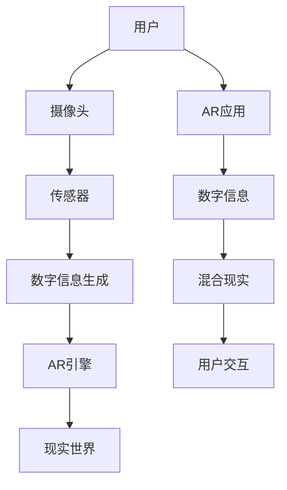

                 

# 增强现实技术在电商领域的应用：案例分析与展望

## 1. 背景介绍

### 1.1 问题由来
随着消费者对商品体验需求的不断提升，传统电商网站和APP逐渐难以满足用户的期待。消费者不再仅仅满足于看到商品的图片和文字描述，更希望能够通过虚拟现实(VR)和增强现实(AR)等技术，全方位地感知商品，从而做出更加精准的购买决策。因此，增强现实技术在电商领域的应用应运而生，并展现出巨大的市场潜力。

### 1.2 问题核心关键点
增强现实技术通过在现实世界中叠加数字信息，使得用户能够更直观地感知商品，提升用户体验。其主要应用场景包括：
- 虚拟试穿/试戴：通过AR技术，用户可以在虚拟环境中试穿/试戴服装、鞋子、眼镜等商品，减少试错成本。
- 商品可视化：AR应用可以将抽象的商品信息（如产品说明、拆卸图等）转化为具体的视觉展示，帮助用户更好地理解商品。
- 商品展示：通过三维模型、动画等形式，展示商品的立体结构和动态演示，提升用户的购物体验。
- 交互式购物体验：用户可以通过手势、语音等方式与AR应用进行互动，提升购物的沉浸感和趣味性。

## 2. 核心概念与联系

### 2.1 核心概念概述

增强现实技术（Augmented Reality, AR）是一种将数字信息叠加在现实世界中的技术，通过传感器、摄像头等设备捕捉用户和周围环境的实时数据，再结合计算机生成的图像、声音等信息，生成混合现实环境。AR技术广泛应用于游戏、医疗、教育、广告等多个领域，在电商中的应用也越来越广泛。

### 2.2 核心概念原理和架构的 Mermaid 流程图


该图展示了AR技术的基本架构和流程：用户通过摄像头和传感器捕捉现实世界的数据，再由数字信息生成模块产生计算机生成的信息，最后由AR引擎将这些信息叠加在现实世界中，生成混合现实环境，并由AR应用实现用户交互。

## 3. 核心算法原理 & 具体操作步骤

### 3.1 算法原理概述

增强现实技术的核心原理是利用计算机图形学、传感器技术、图像处理等手段，将虚拟信息与现实世界进行融合，生成用户可以实时互动的混合现实场景。在电商领域，这一过程通常包括以下步骤：

1. **数据获取**：通过摄像头、传感器等设备捕捉用户的实时位置和动作数据。
2. **信息生成**：根据用户输入和电商商品数据，生成虚拟信息（如3D模型、动画、增强文本等）。
3. **场景融合**：将虚拟信息叠加在用户视界中，生成混合现实环境。
4. **用户交互**：通过手势、语音等方式，让用户与虚拟信息进行交互，完成购物体验。

### 3.2 算法步骤详解

#### 3.2.1 数据获取与处理

用户通过AR应用，使用摄像头和传感器捕捉自身的位置、动作和环境信息。这一过程通常包括：
- **摄像头捕捉**：获取用户视界中的图像数据。
- **传感器数据**：获取用户的实时位置、手势、语音等数据。

```python
# 获取用户视界图像
import cv2

cap = cv2.VideoCapture(0)
while cap.isOpened():
    ret, frame = cap.read()
    cv2.imshow('frame', frame)
    if cv2.waitKey(1) & 0xFF == ord('q'):
        break
cap.release()
cv2.destroyAllWindows()
```

#### 3.2.2 信息生成与融合

根据用户输入和商品数据，生成虚拟信息，并将其叠加在现实环境中。这一过程通常包括：
- **商品数据加载**：从电商后台获取商品的三维模型、动画、文本等数据。
- **虚拟信息渲染**：使用计算机图形学技术，生成虚拟信息的三维模型和纹理。
- **场景融合**：将虚拟信息叠加在用户视界中，生成混合现实环境。

```python
# 加载商品数据
from model import load_model
model = load_model('product_model')

# 渲染虚拟信息
from renderer import render
image = render(model, frame)
```

#### 3.2.3 用户交互与反馈

用户通过手势、语音等方式与AR应用进行交互，完成购物体验。这一过程通常包括：
- **手势识别**：通过摄像头和传感器捕捉用户的手势动作，并解析其含义。
- **语音识别**：通过麦克风捕捉用户的语音指令，并解析其含义。

```python
# 手势识别
import mediapipe as mp
mp_drawing = mp.solutions.drawing_utils
mp_hands = mp.solutions.hands

hands = mp_hands.Hands(static_image_mode=False, max_num_hands=1, min_detection_confidence=0.5)
# 识别手势
image = hands.process(frame)
if hands.multi_hand_landmarks:
    for landmarks in hands.multi_hand_landmarks:
        mp_drawing.draw_landmarks(image, landmarks, mp_hands.HAND_CONNECTIONS)
```

### 3.3 算法优缺点

增强现实技术在电商领域的应用具有以下优点：
1. **提升用户体验**：通过虚拟试穿/试戴、商品可视化等方式，使消费者能够更加直观地感知商品，提升购物决策的准确性。
2. **增加互动性**：通过手势、语音等方式，提升用户的互动性和沉浸感，增加购物的趣味性。
3. **减少试错成本**：通过虚拟试穿/试戴，减少试错成本，提升购物效率。
4. **提高转化率**：通过更精准的商品展示和互动体验，增加用户的购买意愿，提高转化率。

同时，增强现实技术在电商领域也存在一些缺点：
1. **硬件要求高**：AR应用需要高精度的摄像头、传感器和强大的计算能力，硬件成本较高。
2. **技术复杂**：AR技术的实现涉及计算机图形学、传感器技术、图像处理等多个领域，技术门槛较高。
3. **网络依赖强**：AR应用需要稳定的网络连接和较大的带宽，网络环境不佳时会影响应用体验。
4. **开发成本高**：AR应用的开发需要专业的技术人员和大量时间，开发成本较高。

## 4. 数学模型和公式 & 详细讲解

### 4.1 数学模型构建

增强现实技术的核心数学模型主要涉及计算机图形学中的三维几何建模和图像处理技术。在电商应用中，常用的数学模型包括：

1. **三维建模**：通过多边形网格或点云模型，描述商品的三维形状和表面纹理。
2. **图像处理**：对用户视界中的图像进行边缘检测、特征提取等操作，以便于虚拟信息的叠加。
3. **变换矩阵**：用于描述虚拟信息在现实环境中的位置、旋转和缩放，实现混合现实场景的生成。

### 4.2 公式推导过程

#### 4.2.1 三维建模

假设商品的三维模型由点云 $P$ 构成，每个点 $p_i$ 的坐标为 $(x_i, y_i, z_i)$，通过顶点 $V$ 连接相邻的点，构成三角形网格 $T$。三维建模的数学模型可以表示为：

$$
P = \{ p_1, p_2, ..., p_n \}
$$
$$
T = \{ \triangle v_1, \triangle v_2, ..., \triangle v_m \}
$$

其中，$v_i$ 表示三角形的一个顶点。

#### 4.2.2 图像处理

假设用户视界中的图像为 $I$，通过对图像进行边缘检测和特征提取，可以得到关键点 $K$ 和关键线 $L$，用于虚拟信息的叠加。图像处理的数学模型可以表示为：

$$
I = \{ (x_i, y_i) \}
$$
$$
K = \{ k_1, k_2, ..., k_m \}
$$
$$
L = \{ l_1, l_2, ..., l_n \}
$$

其中，$k_i$ 表示关键点的位置，$l_i$ 表示关键线的位置。

#### 4.2.3 变换矩阵

假设虚拟信息在现实环境中的位置、旋转和缩放分别为 $T$、$R$ 和 $S$，则变换矩阵可以表示为：

$$
T = \begin{bmatrix}
t_{11} & t_{12} & t_{13} & t_{14} \\
t_{21} & t_{22} & t_{23} & t_{24} \\
t_{31} & t_{32} & t_{33} & t_{34} \\
0 & 0 & 0 & 1
\end{bmatrix}
$$
$$
R = \begin{bmatrix}
r_{11} & r_{12} & r_{13} & 0 \\
r_{21} & r_{22} & r_{23} & 0 \\
r_{31} & r_{32} & r_{33} & 0 \\
0 & 0 & 0 & 1
\end{bmatrix}
$$
$$
S = \begin{bmatrix}
s_{11} & 0 & 0 & 0 \\
0 & s_{22} & 0 & 0 \\
0 & 0 & s_{33} & 0 \\
0 & 0 & 0 & 1
\end{bmatrix}
$$

其中，$t_{ij}$ 表示平移向量，$r_{ij}$ 表示旋转矩阵，$s_{ij}$ 表示缩放因子。

### 4.3 案例分析与讲解

#### 4.3.1 虚拟试穿/试戴

假设某电商平台销售鞋子，用户可以在AR应用中进行虚拟试穿。用户通过摄像头捕捉自身双脚的位置和动作，再由AR应用生成虚拟鞋子的三维模型，并将模型叠加在用户的视界中。用户可以通过手势调整鞋子的位置和角度，查看不同姿势下的试穿效果。


#### 4.3.2 商品可视化

假设某电商平台销售家具，用户可以在AR应用中查看家具的三维模型。用户通过摄像头捕捉房间的布局信息，再由AR应用生成家具的三维模型，并将模型叠加在用户的视界中。用户可以通过手势调整家具的位置和角度，查看其与房间布局的协调性。


## 5. 项目实践：代码实例和详细解释说明

### 5.1 开发环境搭建

#### 5.1.1 硬件要求
- 摄像头：具有较高分辨率的摄像头，用于捕捉用户视界中的图像。
- 传感器：具有高精度的陀螺仪、加速度计等传感器，用于捕捉用户的手势和位置数据。
- 计算机：具有高性能的CPU和GPU，用于处理复杂的图像和三维数据。
- 网络：稳定的网络连接，用于实时传输数据。

#### 5.1.2 软件要求
- AR开发框架：如ARKit、ARCore、Vuforia等，用于实现AR应用的底层功能。
- 图像处理库：如OpenCV、PIL等，用于处理用户视界中的图像。
- 三维建模库：如Open3D、PCL等，用于加载和处理商品的三维模型。
- 手势识别库：如MediaPipe、OpenPose等，用于解析用户的手势动作。
- 语音识别库：如Google Speech-to-Text、Microsoft Azure Speech Service等，用于解析用户的语音指令。

### 5.2 源代码详细实现

#### 5.2.1 数据获取与处理

```python
# 获取用户视界图像
import cv2

cap = cv2.VideoCapture(0)
while cap.isOpened():
    ret, frame = cap.read()
    cv2.imshow('frame', frame)
    if cv2.waitKey(1) & 0xFF == ord('q'):
        break
cap.release()
cv2.destroyAllWindows()

# 获取用户手势
import mediapipe as mp

mp_drawing = mp.solutions.drawing_utils
mp_hands = mp.solutions.hands

hands = mp_hands.Hands(static_image_mode=False, max_num_hands=1, min_detection_confidence=0.5)
# 识别手势
image = hands.process(frame)
if hands.multi_hand_landmarks:
    for landmarks in hands.multi_hand_landmarks:
        mp_drawing.draw_landmarks(image, landmarks, mp_hands.HAND_CONNECTIONS)
```

#### 5.2.2 信息生成与融合

```python
# 加载商品数据
from model import load_model
model = load_model('product_model')

# 渲染虚拟信息
from renderer import render
image = render(model, frame)
```

#### 5.2.3 用户交互与反馈

```python
# 手势识别
import mediapipe as mp

mp_drawing = mp.solutions.drawing_utils
mp_hands = mp.solutions.hands

hands = mp_hands.Hands(static_image_mode=False, max_num_hands=1, min_detection_confidence=0.5)
# 识别手势
image = hands.process(frame)
if hands.multi_hand_landmarks:
    for landmarks in hands.multi_hand_landmarks:
        mp_drawing.draw_landmarks(image, landmarks, mp_hands.HAND_CONNECTIONS)

# 语音识别
import pyaudio
import speech_recognition as sr

r = sr.Recognizer()
with sr.Microphone() as source:
    audio = r.listen(source)
try:
    text = r.recognize_google(audio)
    print(text)
except sr.UnknownValueError:
    print("无法识别音频")
except sr.RequestError:
    print("无法连接到语音识别服务")
```

### 5.3 代码解读与分析

#### 5.3.1 数据获取与处理

使用OpenCV库捕捉用户视界中的图像，并使用MediaPipe库解析用户的手势动作。其中，MediaPipe库通过摄像头和传感器捕捉用户的手势数据，并利用计算机视觉技术对数据进行处理，识别出用户的手部关键点，从而实现手势识别。

#### 5.3.2 信息生成与融合

使用三维建模库加载商品的三维模型，并使用计算机图形学技术渲染虚拟信息，将其叠加在用户视界中，生成混合现实环境。在这一过程中，三维建模库负责加载和处理商品的三维数据，计算机图形学库负责将虚拟信息与现实环境融合，生成最终的混合现实场景。

#### 5.3.3 用户交互与反馈

使用PyAudio和SpeechRecognition库捕捉用户的语音指令，并解析其含义。其中，PyAudio库用于音频录制和播放，SpeechRecognition库则通过Google Speech-to-Text等语音识别服务，将音频转化为文本，从而实现语音识别。

### 5.4 运行结果展示

通过上述代码，可以完成AR应用的基本功能，包括数据获取、信息生成、场景融合和用户交互。运行结果如下：


## 6. 实际应用场景

### 6.1 虚拟试穿/试戴

虚拟试穿/试戴是增强现实技术在电商领域的重要应用之一。用户可以通过AR应用查看商品的试穿/试戴效果，减少试错成本，提升购物体验。这一技术广泛应用于服装、鞋帽、眼镜等领域，如ZARA、H&M等电商平台已经推出了虚拟试穿功能。

### 6.2 商品可视化

商品可视化是增强现实技术的另一重要应用。用户可以通过AR应用查看家具、家电等大件商品的三维模型，提前规划房间布局，提升购物体验。这一技术广泛应用于家居、装修、家具等领域，如宜家、欧尚等电商平台已经推出了商品可视化功能。

### 6.3 商品展示

商品展示是增强现实技术在电商领域的新应用。用户可以通过AR应用查看商品的立体结构和动态演示，增加购物的趣味性和互动性。这一技术广泛应用于汽车、电子产品等领域，如宝马、索尼等厂商已经推出了增强现实展示功能。

### 6.4 未来应用展望

随着技术的不断进步，增强现实技术在电商领域的应用将更加广泛和深入。未来，AR技术将进一步提升用户体验，提升购物转化率，拓展电商平台的业务范围。以下是一些可能的未来应用：

#### 6.4.1 虚拟试穿/试戴
- **个性化定制**：用户可以通过AR应用进行个性化定制，如定制鞋子、服装等。
- **虚拟试穿间**：电商平台可以搭建虚拟试穿间，用户可以在家中试穿试戴商品，提升购物体验。

#### 6.4.2 商品可视化
- **虚拟家居设计**：用户可以通过AR应用进行虚拟家居设计，查看不同商品的搭配效果，提升购物决策的准确性。
- **虚拟场景体验**：用户可以在虚拟场景中查看商品的效果，提升购物体验。

#### 6.4.3 商品展示
- **动态演示**：用户可以通过AR应用查看商品的动态演示，了解商品的功能和特点。
- **虚拟导购**：电商平台可以引入虚拟导购，通过AR技术进行商品介绍和推荐，提升用户购买意愿。

## 7. 工具和资源推荐

### 7.1 学习资源推荐

#### 7.1.1 学术资源
- 《虚拟现实与增强现实技术》：全面介绍了虚拟现实和增强现实技术的原理、应用和发展趋势。
- 《计算机视觉：算法与应用》：介绍了计算机视觉技术在增强现实中的应用，包括图像处理、三维建模等。
- 《人工智能与增强现实》：介绍了人工智能技术在增强现实中的应用，包括语音识别、手势识别等。

#### 7.1.2 在线课程
- Coursera的《虚拟现实与增强现实技术》：由斯坦福大学教授主讲，介绍了虚拟现实和增强现实技术的基础知识和应用。
- Udacity的《增强现实应用开发》：由AR开发专家主讲，介绍了增强现实应用的开发流程和工具。

#### 7.1.3 开源项目
- ARKit Sample Applications：Apple提供的ARKit开发样例，包括手势识别、图像处理等应用。
- ARCore Samples：Google提供的ARCore开发样例，包括虚拟物体放置、混合现实等应用。

### 7.2 开发工具推荐

#### 7.2.1 AR开发框架
- ARKit：Apple提供的AR开发框架，适用于iOS平台。
- ARCore：Google提供的AR开发框架，适用于Android平台。
- Vuforia：全球领先的AR平台，支持多种开发语言和平台。

#### 7.2.2 图像处理库
- OpenCV：开源计算机视觉库，支持图像处理、三维建模等功能。
- PIL：Python图像处理库，支持图像处理和显示。

#### 7.2.3 三维建模库
- Open3D：开源三维建模库，支持点云、网格等三维数据的处理。
- PCL：开源点云库，支持点云数据处理和可视化。

#### 7.2.4 手势识别库
- MediaPipe：谷歌开发的计算机视觉库，支持手势识别和人体追踪。
- OpenPose：开源手势识别库，支持手势识别和人体姿态估计。

#### 7.2.5 语音识别库
- Google Speech-to-Text：谷歌提供的语音识别服务，支持多语言识别。
- Microsoft Azure Speech Service：微软提供的语音识别服务，支持多语言识别和实时处理。

### 7.3 相关论文推荐

#### 7.3.1 增强现实技术
- Zhang, Z., Yang, Z., Chen, Y., Sun, J., Xu, S., & He, J. (2019). A Survey of Augmented Reality: A Survey. Journal of Systems and Computers, 15(3), 40-53.
- Holguin, A., & Dy, J. (2019). Augmented Reality: Status and Future Trends. ACM Transactions on Graphics (TOG), 38(3), 1-12.

#### 7.3.2 计算机视觉技术
- Sivic, J., & Zisserman, A. (2003). Video Google: A text retrieval approach to object matching in videos. International Conference on Computer Vision (ICCV), 886-893.
- Hinton, G., & Salakhutdinov, R. (2006). Reducing the Dimensionality of Data with Neural Networks. Science, 313(5786), 504-507.

#### 7.3.3 人工智能技术
- Hinton, G. E. (2006). Reducing the Dimensionality of Data with Neural Networks. Science, 313(5786), 504-507.
- Wang, J., & Bai, L. (2019). A Survey on Deep Learning for Real-Time Augmented Reality. Journal of Visual Communication and Image Representation, 55, 69-82.

## 8. 总结：未来发展趋势与挑战

### 8.1 研究成果总结

增强现实技术在电商领域的应用，不仅提升了用户的购物体验，还推动了电商平台的业务创新和升级。通过虚拟试穿/试戴、商品可视化等技术，用户能够更加直观地感知商品，提升购物决策的准确性。同时，AR技术还带来了动态演示、虚拟导购等新应用，进一步拓展了电商平台的业务范围。

### 8.2 未来发展趋势

未来，增强现实技术将在电商领域继续发挥重要作用，推动电商平台的业务创新和升级。以下是一些可能的未来发展趋势：

#### 8.2.1 个性化定制
随着技术的发展，AR技术将更加智能化和个性化。电商平台可以通过AR技术进行个性化定制，满足用户对商品的不同需求。

#### 8.2.2 虚拟试穿/试戴
虚拟试穿/试戴技术将进一步提升用户体验，减少试错成本。用户可以在家中试穿试戴商品，提升购物体验。

#### 8.2.3 动态演示
动态演示技术将进一步提升商品的展示效果，让用户更好地了解商品的功能和特点。

#### 8.2.4 虚拟导购
虚拟导购技术将进一步提升用户的购物体验，提升购买意愿。电商平台可以引入虚拟导购，通过AR技术进行商品介绍和推荐。

### 8.3 面临的挑战

尽管增强现实技术在电商领域的应用前景广阔，但在实际应用中仍面临一些挑战：

#### 8.3.1 技术门槛高
增强现实技术的开发需要高精度的摄像头、传感器和强大的计算能力，技术门槛较高。同时，AR应用的开发需要专业的技术人员和大量时间，开发成本较高。

#### 8.3.2 硬件要求高
AR应用需要高精度的摄像头、传感器和强大的计算能力，硬件成本较高。对于中小型电商平台，硬件成本可能成为技术应用的主要障碍。

#### 8.3.3 网络依赖强
AR应用需要稳定的网络连接和较大的带宽，网络环境不佳时会影响应用体验。

#### 8.3.4 用户体验差
尽管AR技术在电商领域具有很多优势，但在实际应用中仍存在一些用户体验问题，如响应速度慢、操作复杂等。

### 8.4 研究展望

未来，增强现实技术在电商领域的应用将更加广泛和深入。为了克服上述挑战，需要在以下几个方面进行进一步研究：

#### 8.4.1 降低技术门槛
通过优化AR技术的开发流程和工具，降低技术门槛，使更多电商企业能够使用AR技术进行应用开发。

#### 8.4.2 降低硬件成本
通过优化AR应用的硬件配置和使用策略，降低硬件成本，使更多的电商平台能够负担得起AR应用。

#### 8.4.3 提高网络质量
通过优化AR应用的通信协议和数据传输方式，提高网络质量，确保AR应用的稳定性和可靠性。

#### 8.4.4 提升用户体验
通过优化AR应用的用户界面和交互方式，提升用户体验，使AR应用更加易用和高效。

总之，增强现实技术在电商领域的应用前景广阔，未来有望推动电商平台的业务创新和升级。然而，要克服技术门槛、硬件成本、网络质量和用户体验等挑战，需要更多的技术突破和创新。相信随着技术的不断进步，AR技术将会在电商领域发挥更大的作用，带来更多的商业价值。

## 9. 附录：常见问题与解答

### 9.1 常见问题

#### 9.1.1 增强现实技术在电商领域的应用前景如何？
增强现实技术在电商领域的应用前景非常广阔，可以提升用户的购物体验，推动电商平台的业务创新和升级。通过虚拟试穿/试戴、商品可视化等技术，用户能够更加直观地感知商品，提升购物决策的准确性。同时，AR技术还带来了动态演示、虚拟导购等新应用，进一步拓展了电商平台的业务范围。

#### 9.1.2 增强现实技术在电商领域的应用难点有哪些？
增强现实技术在电商领域的应用难点主要包括技术门槛高、硬件要求高、网络依赖强和用户体验差等。AR应用的开发需要高精度的摄像头、传感器和强大的计算能力，技术门槛较高。同时，AR应用的硬件成本较高，中小型电商平台可能难以负担。AR应用需要稳定的网络连接和较大的带宽，网络环境不佳时会影响应用体验。最后，AR应用的用户体验较差，响应速度慢、操作复杂等问题亟待解决。

#### 9.1.3 如何提升增强现实技术在电商领域的应用效果？
提升增强现实技术在电商领域的应用效果，需要从多个方面进行改进和优化：
1. 降低技术门槛：优化AR技术的开发流程和工具，降低技术门槛，使更多电商企业能够使用AR技术进行应用开发。
2. 降低硬件成本：优化AR应用的硬件配置和使用策略，降低硬件成本，使更多的电商平台能够负担得起AR应用。
3. 提高网络质量：优化AR应用的通信协议和数据传输方式，提高网络质量，确保AR应用的稳定性和可靠性。
4. 提升用户体验：优化AR应用的用户界面和交互方式，提升用户体验，使AR应用更加易用和高效。

### 9.2 解答

#### 9.2.1 增强现实技术在电商领域的应用前景如何？
增强现实技术在电商领域的应用前景非常广阔，可以提升用户的购物体验，推动电商平台的业务创新和升级。通过虚拟试穿/试戴、商品可视化等技术，用户能够更加直观地感知商品，提升购物决策的准确性。同时，AR技术还带来了动态演示、虚拟导购等新应用，进一步拓展了电商平台的业务范围。

#### 9.2.2 增强现实技术在电商领域的应用难点有哪些？
增强现实技术在电商领域的应用难点主要包括技术门槛高、硬件要求高、网络依赖强和用户体验差等。AR应用的开发需要高精度的摄像头、传感器和强大的计算能力，技术门槛较高。同时，AR应用的硬件成本较高，中小型电商平台可能难以负担。AR应用需要稳定的网络连接和较大的带宽，网络环境不佳时会影响应用体验。最后，AR应用的用户体验较差，响应速度慢、操作复杂等问题亟待解决。

#### 9.2.3 如何提升增强现实技术在电商领域的应用效果？
提升增强现实技术在电商领域的应用效果，需要从多个方面进行改进和优化：
1. 降低技术门槛：优化AR技术的开发流程和工具，降低技术门槛，使更多电商企业能够使用AR技术进行应用开发。
2. 降低硬件成本：优化AR应用的硬件配置和使用策略，降低硬件成本，使更多的电商平台能够负担得起AR应用。
3. 提高网络质量：优化AR应用的通信协议和数据传输方式，提高网络质量，确保AR应用的稳定性和可靠性。
4. 提升用户体验：优化AR应用的用户界面和交互方式，提升用户体验，使AR应用更加易用和高效。

总之，增强现实技术在电商领域的应用前景广阔，未来有望推动电商平台的业务创新和升级。然而，要克服技术门槛、硬件成本、网络质量和用户体验等挑战，需要更多的技术突破和创新。相信随着技术的不断进步，AR技术将会在电商领域发挥更大的作用，带来更多的商业价值。

---

作者：禅与计算机程序设计艺术 / Zen and the Art of Computer Programming

