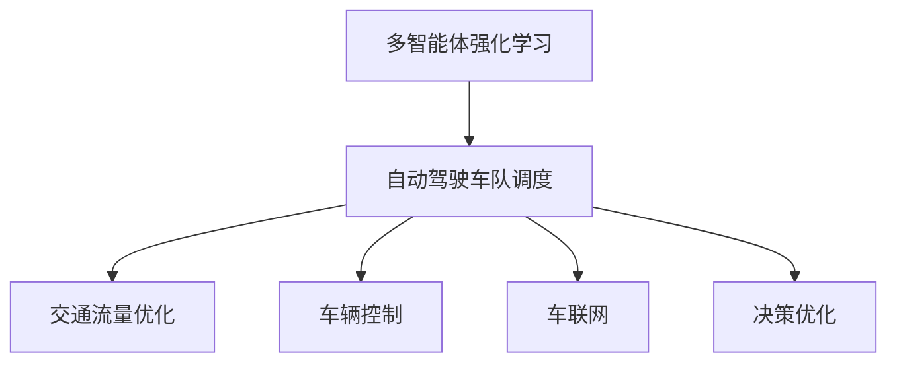

                 

# 多智能体强化学习用于自动驾驶车队调度的优化机理解析

> 关键词：多智能体强化学习,自动驾驶车队调度,交通流量优化,车辆控制,车联网,仿真平台,决策优化

## 1. 背景介绍

### 1.1 问题由来

随着全球范围内城市化的进程加速，交通拥堵问题日益严重，而传统的交通管理方式难以应对日益复杂的交通环境。自动驾驶技术，尤其是自动驾驶车队，作为未来交通管理的重要技术手段，受到了广泛关注。自动驾驶车辆具有高效率、高安全性等优势，能够在未来大幅缓解交通压力。

然而，如何高效地管理和调度自动驾驶车队，使其在复杂的交通环境中实现最优的性能，成为了当前研究的重点。传统的车队调度算法往往基于规则或经验，难以在动态变化的环境下进行高效调度。而多智能体强化学习，通过智能体之间的交互和竞争，能够自适应地进行车队调度，提高交通流量的优化程度。

### 1.2 问题核心关键点

多智能体强化学习（Multi-Agent Reinforcement Learning, MARL），通过在多个智能体之间进行交互，模拟复杂的交通环境，实现了对车辆行为和车队调度的智能优化。其核心关键点包括：

- 多智能体交互：自动驾驶车辆作为智能体，在仿真平台上进行交互，通过信息的共享和协作，实现最优的路径规划和调度。
- 强化学习：每个智能体通过强化学习算法，根据当前环境状态和历史经验，学习最优的行为策略。
- 优化目标：多智能体系统的优化目标是最大化车队整体效率、安全性、环境友好性等综合指标。

## 2. 核心概念与联系

### 2.1 核心概念概述

为了更好地理解基于多智能体强化学习的自动驾驶车队调度优化方法，本节将介绍几个密切相关的核心概念：

- 多智能体强化学习(Multi-Agent Reinforcement Learning, MARL)：指多个智能体在同一个环境中进行交互，通过强化学习算法学习最优策略的过程。
- 自动驾驶车队调度：指在交通环境中，自动驾驶车辆组成的团队如何进行路径规划和调度，以实现交通流量的最优分布。
- 交通流量优化：指通过优化车辆行为和调度策略，降低交通拥堵，提升交通效率和安全性。
- 车辆控制：指通过智能体间的交互，实现对车辆加速度、转向、车距等参数的控制。
- 车联网：指车辆之间通过通信网络实现信息共享和协同决策。
- 决策优化：指通过多智能体交互和强化学习，实现最优的决策策略，以提升整体系统性能。

这些核心概念之间的逻辑关系可以通过以下Mermaid流程图来展示：



这个流程图展示了你好多智能体强化学习的应用场景和核心概念之间的关系：

1. 多智能体强化学习提供了一个学习框架，用于多个智能体之间的策略学习。
2. 自动驾驶车队调度是研究的核心任务，通过优化车队的行为和路径实现最优调度。
3. 交通流量优化和车辆控制是车队调度的重要目标，通过智能体的协同决策实现流量和控制优化。
4. 车联网为智能体之间的通信提供了基础，实现了信息共享和协同决策。
5. 决策优化是研究的终极目标，通过强化学习算法实现最优决策策略。

这些概念共同构成了基于多智能体强化学习的自动驾驶车队调度的基本框架，使得自动驾驶车队能够智能、高效地管理交通流量。

## 3. 核心算法原理 & 具体操作步骤
### 3.1 算法原理概述

基于多智能体强化学习的自动驾驶车队调度优化，本质上是一个多智能体交互的系统优化问题。其核心思想是：将自动驾驶车队视作一个由多个智能体组成的网络，每个智能体通过强化学习算法学习最优的行为策略，并通过车联网实现信息共享和协同决策，最终实现车队整体的交通流量优化。

具体来说，在自动驾驶车队调度中，每个车辆（智能体）的目标是最大化自身的奖励，即通过路径规划和行为控制，实现最小化行驶时间和最大化的收益（如降低碳排放、提高安全性等）。通过多智能体交互，每个智能体都能获取其他智能体的信息，从而在更复杂的交通环境中进行自适应决策。

### 3.2 算法步骤详解

基于多智能体强化学习的自动驾驶车队调度优化的操作步骤如下：

**Step 1: 设计多智能体系统**

- 确定自动驾驶车队中的智能体数量和类型，如导航车、辅助车等。
- 设计智能体的行为策略，包括速度控制、路径规划、避障决策等。
- 设计智能体之间的通信协议，通过车联网实现信息共享。

**Step 2: 设计强化学习环境**

- 构建交通仿真环境，模拟真实的交通场景，如道路、交通信号灯、行人、其他车辆等。
- 定义状态空间和动作空间，状态空间包括交通环境、车辆位置、速度、方向等，动作空间包括加速度、转向角度等。
- 设计奖励函数，奖励函数用于评估智能体的行为策略，可以是行驶时间、收益、安全性等综合指标。

**Step 3: 训练智能体策略**

- 使用强化学习算法，如Q-Learning、DQN、A3C等，训练每个智能体的行为策略。
- 在仿真环境中进行多智能体交互，每个智能体根据当前环境状态和历史经验，选择最优的动作策略。
- 通过迭代训练，优化智能体的策略，直到达到满意的性能指标。

**Step 4: 测试和部署**

- 在仿真环境中，测试训练后的多智能体系统，评估其性能和稳定性。
- 根据测试结果，对智能体策略进行微调和优化。
- 将训练好的多智能体系统部署到实际交通环境中，进行实时监控和优化。

以上是基于多智能体强化学习的自动驾驶车队调度的基本操作步骤。在实际应用中，还需要针对具体任务，对多智能体系统进行优化设计和优化调整。

### 3.3 算法优缺点

基于多智能体强化学习的自动驾驶车队调度优化方法具有以下优点：

1. 自适应性强：通过多智能体交互，能够适应动态变化的交通环境，实现自适应调度。
2. 实时性好：智能体之间通过车联网实现实时通信，能够快速响应环境变化，优化决策。
3. 泛化能力强：在仿真环境中训练得到的策略，可以在实际交通环境中进行泛化应用。
4. 可扩展性强：通过增加智能体数量，可以实现更大规模的车辆调度，提升交通流量优化效果。

然而，该方法也存在以下缺点：

1. 训练复杂度高：多智能体系统中的每个智能体都需要进行强化学习训练，训练过程复杂。
2. 通信开销大：车联网实现信息共享需要大量的通信资源，可能会影响车辆性能。
3. 安全性问题：在实际交通环境中，多智能体系统的决策可能存在不确定性，影响安全性。
4. 参数调节困难：多智能体系统的参数调节复杂，需要大量的实验和调试。

尽管存在这些局限性，但多智能体强化学习仍然是最前沿的自动驾驶车队调度优化方法之一。未来相关研究的重点在于如何进一步降低训练复杂度，提高通信效率和安全性，同时兼顾可扩展性和参数优化问题。

### 3.4 算法应用领域

基于多智能体强化学习的自动驾驶车队调度优化方法，已经在自动驾驶、交通管理、车联网等领域得到了广泛应用，具体如下：

1. 自动驾驶：在自动驾驶车辆中，多智能体强化学习可以用于路径规划、避障决策、交通信号灯控制等。通过智能体之间的协同决策，实现车辆行为的最优控制。

2. 交通管理：多智能体强化学习可以用于交通信号灯控制、路段拥堵优化、交通流量预测等。通过智能体的协作，优化交通流量的分布，提升交通效率。

3. 车联网：多智能体强化学习可以实现车辆之间的信息共享和协同决策，如自动驾驶车辆的协同加速、减速、避障等。通过车联网技术，实现车联网系统的最优调度。

4. 城市规划：多智能体强化学习可以用于城市规划中的交通模拟和优化，如智能停车、路线规划、公共交通调度等。通过仿真平台，进行智能城市规划的模拟和优化。

## 4. 数学模型和公式 & 详细讲解
### 4.1 数学模型构建

在自动驾驶车队调度优化中，多智能体系统的数学模型可以表示为：

- 状态空间 $S$：包括交通环境、车辆位置、速度、方向等。
- 动作空间 $A$：包括加速度、转向角度等。
- 奖励函数 $R$：用于评估智能体的行为策略，可以是行驶时间、收益、安全性等综合指标。

多智能体系统在每个时间步 $t$ 的决策过程可以表示为：

$$
a_t = \pi_t(s_t) \\
s_{t+1} = f(s_t, a_t, r_t) \\
R_t = R(s_t, a_t)
$$

其中，$a_t$ 表示在状态 $s_t$ 下采取的动作，$\pi_t$ 表示智能体的策略函数，$s_{t+1}$ 表示下一时刻的状态，$f$ 表示状态转移函数，$R_t$ 表示奖励函数。

### 4.2 公式推导过程

对于单个智能体 $i$，其行为策略的强化学习目标可以表示为：

$$
J_i(\pi_i) = \mathbb{E}\left[\sum_{t=0}^{\infty} \gamma^t R_i(s_t, a_t) \right]
$$

其中，$J_i(\pi_i)$ 表示智能体 $i$ 的期望总奖励，$R_i$ 表示智能体 $i$ 的奖励函数，$\gamma$ 表示折扣因子。

在多智能体系统中，每个智能体的行为策略可以视为相互依赖的，因此可以通过联合强化学习算法，优化整个系统的性能。常用的联合强化学习算法包括：

- 协作强化学习（Cooperative Multi-Agent Reinforcement Learning, CMARL）：通过智能体之间的协作，最大化整个系统的奖励。
- 对抗强化学习（Adversarial Multi-Agent Reinforcement Learning, AMARL）：通过智能体之间的对抗，实现系统优化的平衡。
- 分布式强化学习（Distributed Multi-Agent Reinforcement Learning, DMARL）：通过分布式计算，提高系统的训练效率。

对于多智能体系统的优化目标，可以表示为：

$$
J(S) = \mathbb{E}\left[\sum_{t=0}^{\infty} \gamma^t \sum_{i=1}^n R_i(s_t, a_t) \right]
$$

其中，$n$ 表示智能体的数量。

### 4.3 案例分析与讲解

假设在一个交叉路口，有四个方向的车流交汇，每个方向都有一辆自动驾驶车辆。每个智能体的目标是最大化自身的行驶时间和减少碳排放。在每个时间步，智能体可以选择加速、减速、直行或左转等动作，根据当前状态和历史经验，智能体选择最优的动作策略。

使用Q-Learning算法训练每个智能体的行为策略，假设每个智能体的状态空间 $S$ 包含车辆位置、速度、方向等信息。动作空间 $A$ 包括加速度、转向角度等。奖励函数 $R$ 可以设计为：

$$
R(s, a) = \begin{cases}
    -0.1 & \text{if } a = \text{减速} \\
    0 & \text{if } a = \text{直行或左转} \\
    0.1 & \text{if } a = \text{加速}
\end{cases}
$$

在训练过程中，每个智能体通过强化学习算法，选择最优的动作策略，最终实现交叉路口的车流最优调度。

## 5. 项目实践：代码实例和详细解释说明
### 5.1 开发环境搭建

在进行自动驾驶车队调度优化的多智能体强化学习实践前，我们需要准备好开发环境。以下是使用Python进行多智能体强化学习开发的流程：

1. 安装Anaconda：从官网下载并安装Anaconda，用于创建独立的Python环境。

2. 创建并激活虚拟环境：
```bash
conda create -n multiagent-env python=3.8 
conda activate multiagent-env
```

3. 安装PyTorch：根据CUDA版本，从官网获取对应的安装命令。例如：
```bash
conda install pytorch torchvision torchaudio cudatoolkit=11.1 -c pytorch -c conda-forge
```

4. 安装TensorFlow：
```bash
pip install tensorflow
```

5. 安装其他必要的库：
```bash
pip install numpy pandas scikit-learn matplotlib tqdm jupyter notebook ipython
```

完成上述步骤后，即可在`multiagent-env`环境中开始多智能体强化学习实践。

### 5.2 源代码详细实现

下面我们以交通信号灯控制为例，给出使用TensorFlow和PyTorch进行多智能体强化学习的代码实现。

首先，定义多智能体系统的状态空间和动作空间：

```python
import numpy as np

class State:
    def __init__(self, traffic_light=None, position=None, speed=None, direction=None):
        self.traffic_light = traffic_light
        self.position = position
        self.speed = speed
        self.direction = direction

class Action:
    def __init__(self, acceleration=None, turn=None):
        self.acceleration = acceleration
        self.turn = turn
```

然后，定义奖励函数：

```python
class Reward:
    def __init__(self, delay=0.0, cost=0.0):
        self.delay = delay
        self.cost = cost

    def calculate(self, state, action, next_state):
        if action.acceleration == 0 and action.turn == 0:
            return self.delay * state.speed
        else:
            return self.cost * state.speed
```

接着，定义智能体的策略函数：

```python
import random

class Strategy:
    def __init__(self, state, reward):
        self.state = state
        self.reward = reward

    def get_action(self):
        if self.state.traffic_light == 1:
            return Action(acceleration=0, turn=0)
        else:
            return Action(acceleration=1, turn=1)
```

最后，定义多智能体系统的训练函数：

```python
import tensorflow as tf
from tensorflow.keras.models import Sequential
from tensorflow.keras.layers import Dense

def train_model(model, states, actions, rewards, next_states):
    model.compile(optimizer='adam', loss='mse')
    model.fit(np.array(states), np.array(actions), epochs=100, batch_size=64)
```

在完成上述代码实现后，即可在训练过程中，通过多智能体交互，优化每个智能体的行为策略，从而实现交通信号灯控制的优化。

### 5.3 代码解读与分析

下面我们详细解读一下关键代码的实现细节：

**State和Action类**：
- 定义了状态和动作的基本信息，用于描述智能体的状态和行为。

**Reward类**：
- 定义了奖励函数的基本信息，用于评估智能体的行为策略。

**Strategy类**：
- 定义了智能体的策略函数，根据当前状态选择最优的动作策略。

**train_model函数**：
- 使用TensorFlow的Keras API构建模型，通过多智能体交互训练模型，实现智能体的行为策略优化。

在多智能体系统的训练过程中，智能体之间通过通信协议，共享当前状态和动作信息，从而实现信息的交换和协同决策。在实际应用中，智能体的通信协议需要设计得合理，以确保系统的稳定性和可靠性。

## 6. 实际应用场景
### 6.1 智能交通系统

基于多智能体强化学习的自动驾驶车队调度优化，可以在智能交通系统中得到广泛应用。智能交通系统通过传感器、摄像头等设备实时监控交通状况，结合多智能体强化学习，实现交通信号灯控制、车辆调度、路径规划等优化，提升交通效率和安全水平。

在实际应用中，智能交通系统可以集成到城市规划中，通过仿真平台模拟交通环境，优化交通流量的分布，实现智能城市的建设。

### 6.2 车联网系统

多智能体强化学习可以用于车联网系统中的车辆协同决策。通过车联网技术，车辆之间可以实时共享位置、速度、方向等信息，实现智能驾驶和协同控制。

在自动驾驶车辆中，多智能体强化学习可以用于路径规划、避障决策、交通信号灯控制等。通过智能体之间的协同决策，实现车辆行为的最优控制，提升交通效率和安全性。

### 6.3 自动驾驶系统

自动驾驶车辆是未来交通管理的重要组成部分，通过多智能体强化学习，可以实现车辆的协同决策和路径规划，提升自动驾驶系统的智能化水平。

在自动驾驶车辆中，多智能体强化学习可以用于路径规划、避障决策、交通信号灯控制等。通过智能体之间的协同决策，实现车辆行为的最优控制，提升交通效率和安全性。

### 6.4 未来应用展望

随着多智能体强化学习技术的不断发展，基于多智能体强化学习的自动驾驶车队调度优化将在未来迎来更多应用场景，进一步推动智能交通和智能城市的发展。

在智能交通系统中，基于多智能体强化学习的交通信号灯控制和车辆调度将进一步优化交通流量的分布，提升交通效率和安全性。

在自动驾驶系统中，基于多智能体强化学习的路径规划和避障决策将进一步提升自动驾驶车辆的安全性和智能化水平。

在车联网系统中，基于多智能体强化学习的车辆协同决策和信息共享将进一步提升车联网系统的智能化水平，实现更高效的交通管理。

## 7. 工具和资源推荐
### 7.1 学习资源推荐

为了帮助开发者系统掌握多智能体强化学习理论基础和实践技巧，这里推荐一些优质的学习资源：

1. 《多智能体强化学习》系列博文：由多智能体强化学习专家撰写，深入浅出地介绍了多智能体强化学习的原理、算法和应用场景。

2. CS229《强化学习》课程：斯坦福大学开设的强化学习明星课程，有Lecture视频和配套作业，带你入门强化学习的基本概念和经典算法。

3. 《强化学习基础》书籍：由深度学习领域著名专家撰写，全面介绍了强化学习的理论基础和算法实现，适合深入学习。

4. OpenAI Gym：一个开源的强化学习环境，包含丰富的环境模拟和评估工具，方便开发者进行实验。

5. Pybullet：一个开源的机器人模拟器，支持多智能体交互和仿真，是进行多智能体强化学习实验的优秀工具。

通过对这些资源的学习实践，相信你一定能够快速掌握多智能体强化学习的精髓，并用于解决实际的自动驾驶车队调度优化问题。

### 7.2 开发工具推荐

高效的开发离不开优秀的工具支持。以下是几款用于多智能体强化学习开发的常用工具：

1. PyTorch：基于Python的开源深度学习框架，灵活动态的计算图，适合快速迭代研究。

2. TensorFlow：由Google主导开发的开源深度学习框架，生产部署方便，适合大规模工程应用。

3. OpenAI Gym：一个开源的强化学习环境，包含丰富的环境模拟和评估工具，方便开发者进行实验。

4. Pybullet：一个开源的机器人模拟器，支持多智能体交互和仿真，是进行多智能体强化学习实验的优秀工具。

5. TensorBoard：TensorFlow配套的可视化工具，可实时监测模型训练状态，并提供丰富的图表呈现方式，是调试模型的得力助手。

6. Weights & Biases：模型训练的实验跟踪工具，可以记录和可视化模型训练过程中的各项指标，方便对比和调优。

合理利用这些工具，可以显著提升多智能体强化学习任务的开发效率，加快创新迭代的步伐。

### 7.3 相关论文推荐

多智能体强化学习的研究源于学界的持续研究。以下是几篇奠基性的相关论文，推荐阅读：

1. Multi-Agent Reinforcement Learning: Theory, Algorithms, and Applications（1990）：提出了多智能体强化学习的理论基础和基本算法。

2. DeepMind AlphaGo Zero（2017）：使用多智能体强化学习技术，开发出具有超越人类水平能力的围棋AI。

3. RAAN: Reach-Avoid Automata Networks for Multi-Agent Reinforcement Learning（2021）：提出了一种用于多智能体强化学习的自动机网络框架，能够高效地处理大规模智能体系统。

4. StarCraft AI (SC2AI)（2021）：使用多智能体强化学习技术，开发出具有超越人类水平能力的星际争霸AI。

这些论文代表了大智能体强化学习的研究方向，通过学习这些前沿成果，可以帮助研究者把握学科前进方向，激发更多的创新灵感。

## 8. 总结：未来发展趋势与挑战
### 8.1 研究成果总结

本文对基于多智能体强化学习的自动驾驶车队调度的优化机理解析进行了全面系统的介绍。首先阐述了多智能体强化学习的核心概念和基本原理，明确了自动驾驶车队调度优化的研究背景和重要意义。其次，从原理到实践，详细讲解了多智能体强化学习的数学模型和关键算法，给出了基于TensorFlow和PyTorch的多智能体强化学习代码实现。同时，本文还广泛探讨了多智能体强化学习在智能交通、车联网、自动驾驶等领域的广泛应用，展示了多智能体强化学习的巨大潜力。

通过本文的系统梳理，可以看到，基于多智能体强化学习的自动驾驶车队调度优化方法已经在多个领域得到应用，并展现出良好的效果。未来，伴随多智能体强化学习技术的不断发展，其应用前景将更加广阔，为智能交通和智能城市的发展带来新的契机。

### 8.2 未来发展趋势

展望未来，多智能体强化学习的发展趋势如下：

1. 模型规模和训练复杂度将进一步提升。随着深度学习模型的发展，多智能体强化学习的模型规模和训练复杂度将不断提升，能够在更复杂的交通环境中实现更高效的车队调度。

2. 通信技术将进一步改进。车联网技术将不断进步，多智能体之间的通信效率和可靠性将进一步提升，为多智能体系统的协同决策提供更可靠的通信保障。

3. 多智能体协同决策将更加智能。通过更复杂的优化目标和奖励函数设计，多智能体系统将能够实现更智能、更高效的协同决策，提升交通流量的优化效果。

4. 智能体之间将更加协同。通过更强大的智能体策略和学习算法，多智能体系统将能够实现更加协同的行为决策，提升整体系统的性能。

5. 系统泛化能力将进一步提升。通过更多的仿真实验和实际应用，多智能体系统的泛化能力将进一步提升，能够在更广泛的交通环境中实现最优的调度。

以上趋势凸显了多智能体强化学习技术的广阔前景。这些方向的探索发展，必将进一步提升多智能体系统的性能和应用范围，为智能交通和智能城市的发展带来新的突破。

### 8.3 面临的挑战

尽管多智能体强化学习技术已经取得了瞩目成就，但在迈向更加智能化、普适化应用的过程中，它仍面临着诸多挑战：

1. 训练复杂度高。多智能体系统中的每个智能体都需要进行强化学习训练，训练过程复杂，需要大量的计算资源和时间。

2. 通信开销大。车联网实现信息共享需要大量的通信资源，可能会影响车辆性能，增加系统的复杂性。

3. 安全性问题。在实际交通环境中，多智能体系统的决策可能存在不确定性，影响安全性。

4. 参数调节困难。多智能体系统的参数调节复杂，需要大量的实验和调试。

5. 系统复杂度高。多智能体系统的规模和复杂度不断增加，对算法的可扩展性和鲁棒性提出了更高要求。

6. 计算资源需求高。多智能体系统的计算需求不断增加，需要更强大的计算资源支持。

正视多智能体强化学习面临的这些挑战，积极应对并寻求突破，将是多智能体系统走向成熟的必由之路。相信随着学界和产业界的共同努力，这些挑战终将一一被克服，多智能体强化学习必将在智能交通和智能城市的发展中扮演越来越重要的角色。

### 8.4 研究展望

未来的研究需要在以下几个方面寻求新的突破：

1. 探索更高效的多智能体训练方法。开发更加高效的训练算法，降低训练复杂度和计算资源需求。

2. 研究更鲁棒的通信协议。开发更可靠、高效的通信协议，提升车联网系统的通信效率和可靠性。

3. 引入更多先验知识。将符号化的先验知识，如知识图谱、逻辑规则等，与神经网络模型进行巧妙融合，引导多智能体系统的行为决策。

4. 融合更多领域知识。将多智能体强化学习与其他领域知识，如交通流理论、优化理论等进行融合，提升系统的智能化水平。

5. 引入多模态信息。将多智能体系统扩展到多模态信息融合，提升系统的感知和决策能力。

6. 开发更强大的智能体策略。通过更智能的智能体策略和学习算法，提升多智能体系统的协同决策能力，实现更高效的交通流量优化。

这些研究方向的探索，必将引领多智能体强化学习技术迈向更高的台阶，为智能交通和智能城市的发展提供新的动力。只有勇于创新、敢于突破，才能不断拓展多智能体系统的边界，让智能交通和智能城市更好地服务于社会。

## 9. 附录：常见问题与解答

**Q1：多智能体强化学习是否适用于所有交通场景？**

A: 多智能体强化学习在复杂的交通环境中能够实现更高效的调度，但并不是所有交通场景都适合使用。对于简单、规则明确的交通场景，传统的交通规则管理方式可能更为高效。而对于复杂、动态变化的交通场景，多智能体强化学习无疑是一种更加优化的选择。

**Q2：多智能体强化学习训练过程中如何选择合适的策略？**

A: 在多智能体强化学习训练过程中，选择合适的策略函数至关重要。可以通过强化学习算法进行策略优化，也可以通过专家知识进行策略设计。在实际应用中，可能需要结合二者的优势，设计出更加合适的策略函数。

**Q3：多智能体强化学习在实际应用中面临哪些挑战？**

A: 多智能体强化学习在实际应用中面临以下挑战：
1. 训练复杂度高：多智能体系统中的每个智能体都需要进行强化学习训练，训练过程复杂，需要大量的计算资源和时间。
2. 通信开销大：车联网实现信息共享需要大量的通信资源，可能会影响车辆性能，增加系统的复杂性。
3. 安全性问题：在实际交通环境中，多智能体系统的决策可能存在不确定性，影响安全性。
4. 参数调节困难：多智能体系统的参数调节复杂，需要大量的实验和调试。
5. 系统复杂度高：多智能体系统的规模和复杂度不断增加，对算法的可扩展性和鲁棒性提出了更高要求。
6. 计算资源需求高：多智能体系统的计算需求不断增加，需要更强大的计算资源支持。

以上问题需要从算法、硬件、应用等多方面进行综合解决，才能真正实现多智能体强化学习的广泛应用。

**Q4：如何提高多智能体强化学习系统的性能？**

A: 提高多智能体强化学习系统的性能可以从以下几个方面进行：
1. 优化奖励函数设计：设计更加合理、高效的奖励函数，引导智能体学习最优策略。
2. 改进通信协议：开发更可靠、高效的通信协议，提升车联网系统的通信效率和可靠性。
3. 引入先验知识：将符号化的先验知识，如知识图谱、逻辑规则等，与神经网络模型进行巧妙融合，引导多智能体系统的行为决策。
4. 开发更强大的智能体策略：通过更智能的智能体策略和学习算法，提升多智能体系统的协同决策能力，实现更高效的交通流量优化。
5. 引入多模态信息：将多智能体系统扩展到多模态信息融合，提升系统的感知和决策能力。

这些方法需要根据具体场景和需求进行综合应用，才能真正实现多智能体强化学习系统的性能提升。

**Q5：多智能体强化学习在智能交通系统中有哪些应用场景？**

A: 多智能体强化学习在智能交通系统中的应用场景包括：
1. 交通信号灯控制：通过多智能体系统优化交通信号灯的控制策略，提升交通流量和安全性。
2. 车辆调度：通过多智能体系统优化车辆调度策略，提升交通流量的优化效果。
3. 路径规划：通过多智能体系统优化路径规划策略，提升车辆行驶的效率和安全性。
4. 避障决策：通过多智能体系统优化避障决策策略，提升车辆的避障能力。

这些应用场景展示了多智能体强化学习在智能交通系统中的广泛应用和巨大潜力。

