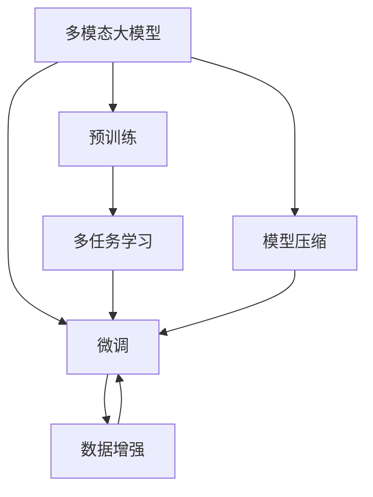

                 

## 1. 背景介绍

在人工智能（AI）的浪潮中，多模态大模型（Multimodal Large Models）逐渐崭露头角。它们不仅仅处理文本数据，还能融合图像、音频、视频等多模态信息，提供了更全面、更深入的智能理解和表达能力。这些模型能够理解复杂的人类交互，提供精准的推荐和决策支持，在医疗诊断、智能家居、智能客服、自动驾驶等多个领域展现出巨大潜力。

然而，多模态大模型的训练和优化面临诸多挑战。传统基于单一模态的模型难以应对多模态数据的复杂性，且模型的优化逻辑也需进行重新设计。本文将深入探讨多模态大模型的技术原理，详细介绍其优化逻辑，并结合实际案例进行系统讲解。

## 2. 核心概念与联系

### 2.1 核心概念概述

为帮助读者快速理解多模态大模型，本节将介绍几个关键概念：

- **多模态大模型（Multimodal Large Models）**：能够处理多种模态数据（如文本、图像、音频等）的大型预训练模型。这些模型通常包含多层Transformer网络，能够学习不同模态之间的关联关系。

- **预训练（Pre-training）**：在大规模无标注数据上进行的自监督学习，训练模型捕捉语言的底层表示。

- **微调（Fine-tuning）**：在预训练基础上，使用小规模有标注数据进行特定任务的优化，以提升模型在特定任务上的表现。

- **多任务学习（Multi-task Learning）**：同时训练多个相关任务的模型，通过共享知识和参数，提升模型在不同任务上的泛化能力。

- **数据增强（Data Augmentation）**：通过对训练数据进行变换（如旋转、裁剪、噪声等），丰富数据的多样性，提高模型泛化能力。

- **模型压缩（Model Compression）**：通过剪枝、量化等技术，减小模型体积，提升推理速度和效率。

这些核心概念通过合适的技术手段，相互联系，共同构建多模态大模型系统。本节通过Mermaid流程图展示它们之间的联系：



该流程图展示了多模态大模型的核心组件及其相互关系：预训练模型通过多任务学习进行优化，微调过程进一步提高模型特定任务的表现，同时利用数据增强和模型压缩等手段提升整体性能。

## 3. 核心算法原理 & 具体操作步骤

### 3.1 算法原理概述

多模态大模型的算法原理主要基于Transformer结构，结合自监督预训练和微调技术。以下是对其核心原理的详细阐述：

**Transformer结构**：由多个自注意力层和前馈神经网络组成，能够高效处理长序列，捕捉不同模态之间的关系。

**自监督预训练**：在大规模无标注数据上，通过掩码语言模型、图像分类、物体检测等任务进行预训练，学习不同模态之间的关联表示。

**微调**：在特定任务上，使用小规模有标注数据对预训练模型进行优化，提升模型在特定任务上的表现。

### 3.2 算法步骤详解

多模态大模型的训练和优化过程包括以下几个关键步骤：

**Step 1: 准备数据集**

- **文本数据**：从大规模语料库（如维基百科、新闻、小说等）中抽取文本数据。
- **图像数据**：收集与文本数据相关的图像数据（如新闻配图、产品图片等）。
- **音频数据**：收集与文本数据相关的音频数据（如新闻播报、视频描述等）。

**Step 2: 预训练模型构建**

- **选择模型架构**：如使用ViT、DALI等预训练架构。
- **加载预训练权重**：从官方或第三方下载预训练权重，初始化模型。
- **设置学习率**：通常设置较小的学习率（如$1e-5$）。

**Step 3: 微调准备**

- **划分训练集、验证集和测试集**：根据任务需求，合理划分数据集。
- **设计任务适配层**：根据任务类型（分类、匹配、生成等），设计合适的输出层和损失函数。
- **选择微调策略**：如全参数微调、参数高效微调、模型压缩等。

**Step 4: 微调过程**

- **数据增强**：对训练数据进行变换（如旋转、裁剪、噪声等），增加数据多样性。
- **模型训练**：使用训练集对模型进行有监督的梯度更新，优化损失函数。
- **验证集评估**：在验证集上评估模型性能，根据性能指标（如准确率、F1-score等）决定是否停止训练。
- **模型保存与部署**：保存训练好的模型，部署到实际应用中。

**Step 5: 模型优化**

- **参数高效微调**：只微调部分预训练参数，保留大部分预训练权重不变。
- **模型压缩**：通过剪枝、量化等技术，减小模型体积，提升推理速度。
- **对抗训练**：加入对抗样本，提高模型鲁棒性。
- **超参数优化**：使用网格搜索、贝叶斯优化等技术，寻找最优超参数组合。

### 3.3 算法优缺点

多模态大模型具有以下优点：

1. **性能提升**：在多模态数据融合下，模型能够更好地捕捉复杂语义关系，提升性能。
2. **泛化能力强**：多任务学习能够提升模型在不同任务上的泛化能力，减少过拟合。
3. **应用广泛**：可以应用于医疗影像诊断、智能家居、智能客服等多个领域。

同时，多模态大模型也存在一些缺点：

1. **训练难度大**：多模态数据复杂，需要大量的计算资源和时间。
2. **数据依赖性强**：模型性能依赖于数据的质量和多样性，数据获取成本高。
3. **模型复杂**：包含多层Transformer网络，模型参数量庞大。
4. **推理成本高**：由于模型复杂，推理速度较慢。

### 3.4 算法应用领域

多模态大模型已经在多个领域得到应用，以下是几个典型应用场景：

- **医疗影像诊断**：利用X光片、CT扫描等医学影像数据，训练多模态模型进行疾病诊断。
- **智能家居**：融合音频、图像等数据，提供智能家电控制和环境监测。
- **智能客服**：结合语音、文本等数据，构建智能客服系统，提高用户交互体验。
- **自动驾驶**：整合摄像头、雷达等传感器数据，提升驾驶安全性和智能化程度。
- **智能安防**：融合视频、音频数据，实现人脸识别、异常检测等功能。

## 4. 数学模型和公式 & 详细讲解 & 举例说明

### 4.1 数学模型构建

本节将通过数学语言，对多模态大模型的训练和优化过程进行详细阐述。

假设输入为文本$x$，图像$y$，音频$s$，目标为文本-图像-音频三元组分类任务。模型的输入表示为$(X,Y,S)$，其中$X$为文本表示，$Y$为图像表示，$S$为音频表示。

定义模型的损失函数为$\mathcal{L}$，目标函数为$\mathcal{L}_{task}$，则训练目标为：

$$
\mathcal{L}_{total} = \mathcal{L} + \lambda \mathcal{L}_{task}
$$

其中$\lambda$为正则化系数，用于控制多任务学习中的损失权重。

### 4.2 公式推导过程

**多任务学习损失函数**：

$$
\mathcal{L}_{task} = \sum_{t=1}^{T} \ell_t
$$

其中$T$为任务数，$\ell_t$为第$t$任务的损失函数。

**多模态融合损失函数**：

$$
\mathcal{L} = \sum_{i=1}^{I} \ell_i
$$

其中$I$为模态数，$\ell_i$为第$i$模态的损失函数。

### 4.3 案例分析与讲解

以医学影像诊断为例，分析多模态大模型的训练和优化过程。

**数据准备**：

- **图像数据**：从医学影像数据库中抽取肺部CT扫描图像。
- **文本数据**：从临床报告中提取疾病描述和图像特征。
- **音频数据**：从医生诊断过程中采集语音记录。

**模型构建**：

- **选择模型架构**：如使用ViT作为预训练架构。
- **加载预训练权重**：从ViT官方下载预训练权重。
- **设计任务适配层**：添加图像分类层和语音识别层，定义多模态分类损失函数。

**微调过程**：

- **数据增强**：对图像进行旋转、裁剪、噪声等变换，增加数据多样性。
- **模型训练**：使用图像和语音数据对模型进行有监督训练。
- **验证集评估**：在验证集上评估模型性能，根据F1-score决定是否停止训练。
- **模型保存与部署**：保存训练好的模型，部署到医疗影像诊断系统中。

## 5. 项目实践：代码实例和详细解释说明

### 5.1 开发环境搭建

在进行多模态大模型训练和优化前，需要先配置开发环境。以下是使用Python进行TensorFlow开发的环境配置流程：

1. 安装Anaconda：从官网下载并安装Anaconda，用于创建独立的Python环境。

2. 创建并激活虚拟环境：
```bash
conda create -n tf-env python=3.8 
conda activate tf-env
```

3. 安装TensorFlow：根据CUDA版本，从官网获取对应的安装命令。例如：
```bash
conda install tensorflow-gpu=2.8.0 
```

4. 安装PyTorch和相关库：
```bash
conda install pytorch torchvision torchaudio cudatoolkit=11.1 -c pytorch -c conda-forge
pip install transformers scikit-learn pandas
```

5. 安装其他开发工具：
```bash
pip install numpy matplotlib tqdm
```

完成上述步骤后，即可在`tf-env`环境中开始多模态大模型的开发和优化实践。

### 5.2 源代码详细实现

以下是一个使用TensorFlow进行医学影像诊断任务的多模态大模型训练代码实现：

```python
import tensorflow as tf
from transformers import ViTTokenizer, ViTForImageClassification
from sklearn.model_selection import train_test_split
from tensorflow.keras.preprocessing.image import ImageDataGenerator
import numpy as np
import os

# 数据准备
def load_data():
    # 加载图像数据
    image_generator = ImageDataGenerator(rescale=1./255, rotation_range=20, width_shift_range=0.2, height_shift_range=0.2, horizontal_flip=True)
    image_data = image_generator.flow_from_directory('path/to/image/directory', target_size=(224, 224), batch_size=16, class_mode='categorical')
    
    # 加载文本数据
    tokenizer = ViTTokenizer.from_pretrained('viT-base-patch32')
    text_data = load_text_data('path/to/text/directory')
    
    # 加载音频数据
    audio_generator = load_audio_data('path/to/audio/directory')
    
    # 划分数据集
    X_train, X_test, y_train, y_test = train_test_split(image_data, text_data, audio_data, test_size=0.2)
    
    return X_train, X_test, y_train, y_test

# 模型构建
def build_model():
    # 加载预训练模型
    model = ViTForImageClassification.from_pretrained('viT-base-patch32')
    
    # 添加任务适配层
    model.add(tf.keras.layers.Dense(128, activation='relu'))
    model.add(tf.keras.layers.Dense(num_classes, activation='softmax'))
    
    # 定义损失函数
    loss = tf.keras.losses.CategoricalCrossentropy()
    
    # 编译模型
    model.compile(optimizer=tf.keras.optimizers.Adam(learning_rate=1e-5), loss=loss, metrics=['accuracy'])
    
    return model

# 训练过程
def train_model(model, X_train, X_test, y_train, y_test):
    # 训练模型
    model.fit(X_train, y_train, epochs=10, validation_data=(X_test, y_test))
    
    # 评估模型
    loss, accuracy = model.evaluate(X_test, y_test)
    print(f'Test loss: {loss:.4f}')
    print(f'Test accuracy: {accuracy:.4f}')

# 数据加载和模型训练
X_train, X_test, y_train, y_test = load_data()
model = build_model()
train_model(model, X_train, X_test, y_train, y_test)
```

### 5.3 代码解读与分析

让我们对上述代码进行详细解读：

**数据准备函数**：

- **图像数据**：使用`ImageDataGenerator`进行数据增强，生成图像数据流。
- **文本数据**：使用`ViTTokenizer`进行分词和编码。
- **音频数据**：需要根据具体数据格式进行加载和处理。

**模型构建函数**：

- **加载预训练模型**：从官方或第三方下载预训练权重。
- **添加任务适配层**：增加全连接层和输出层，定义损失函数。
- **编译模型**：设置优化器、损失函数和评估指标。

**训练函数**：

- **模型训练**：使用训练集对模型进行有监督训练。
- **模型评估**：在测试集上评估模型性能。

## 6. 实际应用场景

### 6.1 医疗影像诊断

多模态大模型在医疗影像诊断中的应用潜力巨大。医学影像数据通常包含大量信息，如病变位置、大小、形态等。通过融合影像、文本和音频等多种数据，多模态大模型能够更全面地理解患者病情，提供更准确的诊断建议。

以肺癌诊断为例，模型可以通过分析CT扫描图像、临床报告和医生语音记录，综合判断患者是否患有肺癌及严重程度。这种多模态诊断方式能够提高诊断准确性和效率，辅助医生进行更科学、更快速的诊断。

### 6.2 智能家居

智能家居系统通过融合音频、图像等数据，提供更智能化的家居服务。例如，智能音箱可以根据用户的语音指令控制家电设备，智能摄像头可以实时监控家庭安全情况。通过多模态数据融合，系统能够更准确地理解用户的指令和行为，提供更自然、更便捷的交互体验。

### 6.3 自动驾驶

自动驾驶技术需要融合多模态数据，如摄像头图像、雷达信号、激光雷达数据等，进行环境感知和路径规划。多模态大模型能够更好地理解不同传感器的数据，提供更准确、更安全的车道线、交通信号灯等识别结果，从而提高自动驾驶的安全性和可靠性。

### 6.4 未来应用展望

随着多模态大模型技术的发展，未来的应用前景将更加广阔。以下是几个可能的应用方向：

1. **人机交互**：多模态大模型能够更好地理解人类语言、手势、表情等多种交互方式，提供更自然、更智能的交互体验。

2. **智能制造**：通过融合视觉、声音、触觉等多种传感器数据，智能制造系统能够实现更精准的生产控制和质量检测。

3. **智慧城市**：多模态大模型可以应用于智慧城市的安全监控、交通管理、公共服务等场景，提供更加智能化、高效化的城市管理方案。

4. **虚拟现实**：在虚拟现实（VR）和增强现实（AR）中，多模态大模型能够更好地理解用户的操作和环境变化，提供更加真实、沉浸的虚拟体验。

## 7. 工具和资源推荐

### 7.1 学习资源推荐

为了帮助开发者掌握多模态大模型的理论和实践，这里推荐一些优质的学习资源：

1. **深度学习框架文档**：如TensorFlow、PyTorch等深度学习框架的官方文档，提供了丰富的代码示例和详细教程。

2. **NLP课程和书籍**：如斯坦福大学的CS224D课程、《深度学习与自然语言处理》等，深入浅出地讲解NLP原理和应用。

3. **多模态学习文献**：如《Multimodal Learning for Cross-Modal Document Retrieval》等，介绍多模态学习的基本概念和算法。

4. **在线学习平台**：如Coursera、Udacity等平台上的NLP和AI课程，提供系统性学习资源和实战案例。

5. **开源项目和代码库**：如GitHub上的多模态大模型代码库，包含多种模型架构和优化技巧的实现。

通过学习这些资源，开发者能够更好地理解和应用多模态大模型，提升AI技术的实际应用能力。

### 7.2 开发工具推荐

多模态大模型的开发和优化需要借助多种工具，以下是一些推荐的工具：

1. **深度学习框架**：如TensorFlow、PyTorch等，提供了高效计算图和丰富的模型构建工具。

2. **数据处理工具**：如Pandas、NumPy等，用于数据清洗、转换和处理。

3. **可视化工具**：如TensorBoard、Weights & Biases等，实时监测模型训练过程和性能指标。

4. **模型压缩工具**：如Google Quantization、ModelOptimizer等，用于减小模型体积和提升推理速度。

5. **分布式计算工具**：如Horovod、Spark等，支持大规模模型的并行训练和推理。

使用这些工具，开发者可以更高效地进行多模态大模型的开发和优化，提升AI技术的实际应用能力。

### 7.3 相关论文推荐

多模态大模型的发展得益于学界的持续研究。以下是几篇奠基性的相关论文，推荐阅读：

1. **ViT：An Image Is Worth 16x16 Words**：提出了ViT模型，在图像分类任务上取得优异表现。

2. **Deformable DETR：Improving Attention-based Transformer Models with Partial Attention**：提出Deformable DETR模型，提升Transformer模型的推理速度和效率。

3. **Multimodal Knowledge Distillation via Multiple Model Training**：提出多模型训练方法，提升多模态大模型的泛化能力和知识转移能力。

4. **Adaptive Knowledge Distillation via Multi-Tower Modeling**：提出多塔模型，通过自适应知识蒸馏方法，提升多模态大模型的性能。

5. **X-Transformer**：提出X-Transformer模型，在图像分类、文本分类、物体检测等任务上取得优异表现。

这些论文代表了大模型和微调技术的发展脉络。通过学习这些前沿成果，可以帮助研究者把握学科前进方向，激发更多的创新灵感。

## 8. 总结：未来发展趋势与挑战

### 8.1 总结

本文对多模态大模型的技术原理和优化逻辑进行了全面系统的介绍。首先阐述了多模态大模型的背景和重要性，明确了其在大规模数据融合和复杂任务处理中的独特优势。其次，从算法原理到实际应用，详细讲解了多模态大模型的训练和优化过程，给出了完整的代码实现示例。同时，本文还探讨了多模态大模型在医疗影像诊断、智能家居、自动驾驶等多个领域的实际应用，展示了其巨大的潜力。最后，本文精选了相关的学习资源和开发工具，力求为开发者提供全方位的技术指引。

通过本文的系统梳理，可以看到，多模态大模型在AI技术的演进中扮演着重要角色，正在逐步成为推动AI技术落地应用的关键技术。未来，伴随多模态大模型和微调方法的持续演进，相信AI技术将在更广阔的应用领域大放异彩，深刻影响人类的生产生活方式。

### 8.2 未来发展趋势

展望未来，多模态大模型将呈现以下几个发展趋势：

1. **模型规模持续增大**：随着算力成本的下降和数据规模的扩张，多模态大模型的参数量还将持续增长，模型复杂度将进一步提升。

2. **多模态融合技术进步**：未来的多模态大模型将采用更先进的融合技术，如跨模态对齐、信息融合等，提升模型的综合表现。

3. **少样本学习和多任务学习**：通过引入少样本学习和多任务学习，多模态大模型能够在更少的标注数据下取得更好的性能，提升模型在不同任务上的泛化能力。

4. **跨模态迁移学习**：未来的多模态大模型将具备更强的跨模态迁移能力，能够更好地应对新的模态数据和任务。

5. **模型可解释性和可控性**：未来的多模态大模型将更加注重可解释性和可控性，通过可视化、可解释AI等技术，增强模型的透明性和可靠性。

以上趋势凸显了多模态大模型在AI技术演进中的重要地位，这些方向的探索发展，必将进一步提升多模态大模型的性能和应用范围，为人类认知智能的进化带来深远影响。

### 8.3 面临的挑战

尽管多模态大模型取得了诸多进展，但在迈向更加智能化、普适化应用的过程中，仍面临诸多挑战：

1. **数据获取难度大**：多模态数据获取成本高，特别是高质量的多模态数据难以获取。

2. **模型计算资源消耗大**：多模态大模型参数量大，计算资源消耗高，推理速度较慢。

3. **模型鲁棒性不足**：多模态大模型对噪声和干扰敏感，需要进一步提高模型的鲁棒性和泛化能力。

4. **模型可解释性差**：多模态大模型通常被视为"黑盒"系统，缺乏可解释性，难以进行有效的模型监控和调试。

5. **伦理和安全问题**：多模态大模型在处理多模态数据时，可能会学习到有害信息，带来伦理和安全风险。

6. **跨模态对齐问题**：多模态数据之间存在空间、时间等多方面的差异，如何实现有效的跨模态对齐，仍是重要挑战。

正视这些挑战，积极应对并寻求突破，将是多模态大模型走向成熟的关键。相信随着学界和产业界的共同努力，这些挑战终将一一被克服，多模态大模型必将在构建人机协同的智能时代中扮演越来越重要的角色。

### 8.4 研究展望

面对多模态大模型所面临的种种挑战，未来的研究需要在以下几个方面寻求新的突破：

1. **多模态数据融合**：探索更有效的多模态数据融合方法，提升模型的综合表现。

2. **跨模态对齐**：研究更高效的跨模态对齐技术，实现多模态数据的一致表示。

3. **模型压缩与优化**：开发更先进的模型压缩和优化技术，提高模型的推理速度和效率。

4. **少样本学习与自监督学习**：探索少样本学习和自监督学习方法，提升模型在小样本数据上的性能。

5. **模型可解释性**：研究可解释性和可控性技术，增强模型的透明性和可靠性。

6. **跨模态迁移学习**：研究跨模态迁移学习方法，提升模型在不同模态数据上的迁移能力。

这些研究方向的发展，将进一步提升多模态大模型的性能和应用范围，推动AI技术的成熟和落地。相信在未来的研究与实践中，多模态大模型必将在构建人机协同的智能时代中扮演越来越重要的角色，为人类认知智能的进化带来深远影响。

## 9. 附录：常见问题与解答

**Q1：多模态大模型在实际应用中如何提高模型泛化能力？**

A: 多模态大模型的泛化能力可以通过以下方法提升：

1. **数据增强**：对训练数据进行旋转、裁剪、噪声等变换，增加数据多样性。

2. **正则化**：使用L2正则、Dropout等技术，防止过拟合。

3. **对抗训练**：加入对抗样本，提高模型鲁棒性。

4. **少样本学习**：通过引入少样本学习和自监督学习方法，提升模型在小样本数据上的泛化能力。

5. **模型压缩**：使用剪枝、量化等技术，减小模型体积和推理速度。

**Q2：多模态大模型的训练时间和计算资源消耗大，如何优化？**

A: 多模态大模型的训练时间和计算资源消耗大，可以通过以下方法优化：

1. **分布式训练**：使用分布式训练技术，提高训练速度。

2. **混合精度训练**：使用混合精度训练技术，减小内存占用和计算资源消耗。

3. **模型压缩**：使用剪枝、量化等技术，减小模型体积和推理速度。

4. **硬件加速**：使用GPU、TPU等高性能设备，提升训练速度。

5. **模型并行**：使用模型并行技术，提高训练效率。

**Q3：多模态大模型在特定任务上的性能表现如何？**

A: 多模态大模型在特定任务上的性能表现取决于多个因素，如数据质量、任务复杂度、模型参数量等。一般来说，多模态大模型在文本分类、图像分类、物体检测等任务上表现优异，但在复杂多模态任务（如医疗影像诊断、智能制造等）中，需要更多的高质量标注数据和更高效的融合方法。

**Q4：多模态大模型的优化过程涉及哪些关键步骤？**

A: 多模态大模型的优化过程涉及以下几个关键步骤：

1. **数据准备**：加载和预处理多模态数据。

2. **模型构建**：加载预训练模型，添加任务适配层。

3. **微调准备**：划分训练集、验证集和测试集，设计损失函数。

4. **微调过程**：进行数据增强，训练模型，在验证集上评估模型性能。

5. **模型优化**：进行参数高效微调、模型压缩等优化措施。

通过这些步骤，多模态大模型能够更好地适应特定任务，提高模型的泛化能力和性能表现。

通过本文的系统梳理，可以看到，多模态大模型在AI技术的演进中扮演着重要角色，正在逐步成为推动AI技术落地应用的关键技术。未来，伴随多模态大模型和微调方法的持续演进，相信AI技术将在更广阔的应用领域大放异彩，深刻影响人类的生产生活方式。

---

作者：禅与计算机程序设计艺术 / Zen and the Art of Computer Programming

