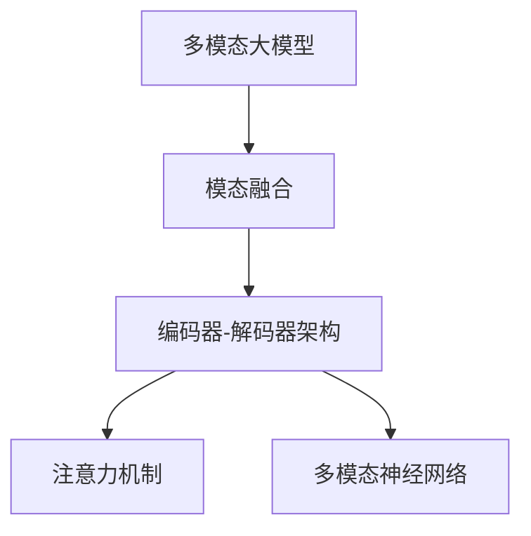

                 

# 多模态大模型：技术原理与实战 多模态大模型的部署

## 1. 背景介绍

### 1.1 问题由来

随着深度学习技术的飞速发展，大模型在视觉、语言、音频等多个模态上都取得了卓越的性能。然而，在实际应用中，这些模态数据往往难以同时获取，单一模态的数据难以充分描述复杂现实世界的各种信息。

例如，在医疗诊断中，医生不仅需要分析病人的文本报告，还需要观察其X光、CT、MRI等医学影像，才能做出准确的判断。单一的文本报告或医学影像都难以全面反映患者的病情。在智能交互系统中，自然语言的理解和生成虽然能够覆盖大部分情境，但无法与视觉、听觉等人类感知通道进行充分交互。

为了更好地理解复杂世界，多模态大模型（Multi-Modal Large Models）应运而生。多模态大模型能够同时处理视觉、语言、音频等多模态数据，显著提升了模型的感知能力和决策性能。例如，多模态模型在图像识别、语音识别、医疗诊断等领域展现了卓越的潜力，被广泛视为未来智能系统的关键突破方向。

### 1.2 问题核心关键点

多模态大模型的核心目标是：

- 融合多模态信息，增强模型的感知和理解能力。
- 解决单一模态数据难以全面描述复杂现实世界的问题。
- 在医疗、智能交互、城市治理等关键领域提供智能化解决方案。

然而，多模态大模型的融合方式和模型结构设计仍然是一个具有挑战性的问题。本文将详细阐述多模态大模型的技术原理和实战部署，从原理到应用，全方位介绍多模态大模型的开发和优化。

## 2. 核心概念与联系

### 2.1 核心概念概述

为更好地理解多模态大模型的融合方式和模型结构设计，本节将介绍几个关键概念：

- **多模态大模型(Multi-Modal Large Models)**：能够同时处理视觉、语言、音频等多种模态数据的深度学习模型。
- **模态融合（Modality Fusion）**：将不同模态的信息进行融合，提升模型的感知和理解能力。
- **编码器-解码器架构（Encoder-Decoder Architecture）**：由编码器和解码器组成，编码器用于提取多模态特征，解码器用于生成最终输出。
- **注意力机制（Attention Mechanism）**：在编码器-解码器架构中，通过注意力机制，使模型能够关注输入的不同部分，提高融合效果。
- **多模态神经网络（Multi-Modal Neural Networks）**：构建专门的多模态处理网络结构，实现不同模态数据的联合表示和推理。

这些核心概念之间的逻辑关系可以通过以下Mermaid流程图来展示：



这个流程图展示了大模型在多模态融合中的核心结构和技术：

1. 多模态大模型通过模态融合提取不同模态特征。
2. 融合后的特征通过编码器-解码器架构进行处理，生成最终输出。
3. 注意力机制使模型能够关注重要部分，提升融合效果。
4. 多模态神经网络实现多模态联合表示和推理。

## 3. 核心算法原理 & 具体操作步骤

### 3.1 算法原理概述

多模态大模型的融合方式通常包括以下几个关键步骤：

1. **数据预处理**：对不同模态的数据进行预处理和归一化，准备输入模型。
2. **特征提取**：使用预训练的单一模态模型，如VGG、ResNet（视觉）、BERT（语言）等，提取不同模态的特征表示。
3. **模态融合**：通过编码器-解码器架构或注意力机制，将不同模态的特征进行融合。
4. **输出生成**：通过解码器生成最终输出，如分类、回归、生成等。

### 3.2 算法步骤详解

以下我们将详细介绍多模态大模型的融合步骤和实战代码实现。

**Step 1: 数据预处理**

首先，需要准备不同模态的数据，并进行预处理。以医疗诊断为例，假设有病人的文字报告和X光图像，以下是预处理的具体步骤：

1. **文字报告预处理**：将文本数据分词、转换为小写，并去除停用词、标点符号等噪声。使用BERT等预训练语言模型对文本进行编码，得到文本嵌入向量。
2. **X光图像预处理**：将图像数据缩放到相同大小，并进行归一化处理。使用ResNet等预训练视觉模型对图像进行编码，得到图像嵌入向量。
3. **统一格式**：将不同模态的特征向量统一格式，准备输入模型。

**Step 2: 特征提取**

使用预训练的单一模态模型，提取不同模态的特征表示。例如，使用VGG模型对图像进行特征提取，使用BERT模型对文本进行编码。

**Step 3: 模态融合**

使用编码器-解码器架构或注意力机制，将不同模态的特征进行融合。例如，使用Transformer模型将视觉特征和语言特征进行融合。

**Step 4: 输出生成**

通过解码器生成最终输出，如分类、回归、生成等。例如，使用分类器对融合后的特征进行分类，得到诊断结果。

### 3.3 算法优缺点

多模态大模型的融合方式具有以下优点：

1. **感知能力更强**：通过融合多模态数据，模型能够感知更丰富的信息，提升感知能力。
2. **决策性能更高**：多模态信息提供更多维度，帮助模型做出更准确的决策。
3. **应用场景广泛**：适用于医疗、智能交互、城市治理等多个关键领域，提供智能化解决方案。

然而，该方法也存在一定的局限性：

1. **数据获取难度大**：多模态数据获取难度较大，成本较高。
2. **计算复杂度高**：多模态数据的处理和融合计算复杂度高，需要更强的计算资源。
3. **模型复杂度高**：多模态大模型的模型结构复杂，训练难度大。

尽管存在这些局限性，但就目前而言，多模态大模型的融合方式仍然是实现多模态智能系统的核心方法。未来相关研究的重点在于如何进一步降低多模态数据获取的难度，提高计算效率，并简化模型结构，以提升模型训练和推理的效率。

### 3.4 算法应用领域

多模态大模型在医疗、智能交互、城市治理等关键领域已经得到了广泛的应用，展示了其在现实世界中的强大潜力。

**医疗诊断**：在医疗诊断中，多模态大模型能够同时分析患者的影像、文字报告和生命体征数据，提供全面、准确的诊断结果。例如，多模态模型在乳腺癌、皮肤癌等疾病诊断中表现出色。

**智能交互**：在智能交互系统中，多模态大模型能够理解用户的文字、语音和面部表情，提供更自然、流畅的交互体验。例如，多模态模型在智能客服、虚拟助理等应用中，能够提供更高效的对话和信息检索服务。

**城市治理**：在城市治理中，多模态大模型能够整合交通、环境、气象等多种数据，提供更智能的城市管理方案。例如，多模态模型在交通管理、环境监测、灾害预警等方面，能够提升城市的运行效率和安全性。

此外，多模态大模型还被应用于更多场景中，如金融分析、零售推荐、工业检测等，为各行各业提供了智能化解决方案。

## 4. 数学模型和公式 & 详细讲解 & 举例说明

### 4.1 数学模型构建

本节将使用数学语言对多模态大模型的融合过程进行更加严格的刻画。

记多模态数据为 $\{(X_1, Y_1), (X_2, Y_2), \ldots, (X_M, Y_M)\}$，其中 $X_i$ 为第 $i$ 个模态的特征向量，$Y_i$ 为对应的标签。假设预训练的单一模态模型为 $F_i$，则多模态大模型的数学模型可以表示为：

$$
Z = F_M(F_{M-1}(\ldots(F_1(X_1) + F_1(X_2) + \ldots + F_1(X_M)) + F_{M-1}(\ldots(F_1(X_1) + F_1(X_2) + \ldots + F_1(X_M))\ldots)
$$

其中，$Z$ 为融合后的特征向量，$F_M$ 为最终的解码器。在实践中，通常使用Transformer等深度学习模型实现多模态融合。

### 4.2 公式推导过程

以医疗诊断为例，假设视觉特征和文本特征通过预训练模型提取，使用Transformer模型进行融合，具体推导如下：

1. **视觉特征提取**：使用ResNet模型对X光图像进行编码，得到图像嵌入向量 $V$。
2. **文本特征提取**：使用BERT模型对文字报告进行编码，得到文本嵌入向量 $T$。
3. **特征融合**：使用Transformer模型对视觉特征 $V$ 和文本特征 $T$ 进行融合，得到融合特征 $Z$。
4. **输出生成**：使用分类器对融合特征 $Z$ 进行分类，得到诊断结果。

具体推导过程如下：

$$
V = ResNet(X_{img})
$$

$$
T = BERT(X_{text})
$$

$$
Z = \text{Transformer}(V, T)
$$

$$
\hat{Y} = \text{Classifier}(Z)
$$

其中，$\hat{Y}$ 为诊断结果的预测值。

### 4.3 案例分析与讲解

以智能交互系统的多模态大模型为例，详细分析其实现流程和优化策略。

**实现流程**：
1. **数据采集**：通过摄像头、麦克风、面部识别设备等采集用户的多模态数据，如语音、文本、面部表情。
2. **数据预处理**：对不同模态的数据进行预处理和归一化，准备输入模型。
3. **特征提取**：使用预训练的单一模态模型，提取不同模态的特征表示。
4. **模态融合**：使用Transformer模型将语音、文本、面部表情等特征进行融合。
5. **输出生成**：通过解码器生成最终输出，如对话回复、智能推荐等。

**优化策略**：
1. **注意力机制**：通过注意力机制，使模型能够关注重要部分，提升融合效果。
2. **模型压缩**：使用知识蒸馏等技术，压缩模型大小，提高计算效率。
3. **数据增强**：通过对训练样本进行旋转、缩放、裁剪等操作，增强模型的泛化能力。
4. **分布式训练**：使用分布式训练技术，提高模型训练速度。

## 5. 项目实践：代码实例和详细解释说明

### 5.1 开发环境搭建

在进行多模态大模型的实践前，我们需要准备好开发环境。以下是使用Python进行PyTorch开发的环境配置流程：

1. 安装Anaconda：从官网下载并安装Anaconda，用于创建独立的Python环境。

2. 创建并激活虚拟环境：
```bash
conda create -n pytorch-env python=3.8 
conda activate pytorch-env
```

3. 安装PyTorch：根据CUDA版本，从官网获取对应的安装命令。例如：
```bash
conda install pytorch torchvision torchaudio cudatoolkit=11.1 -c pytorch -c conda-forge
```

4. 安装Transformers库：
```bash
pip install transformers
```

5. 安装各类工具包：
```bash
pip install numpy pandas scikit-learn matplotlib tqdm jupyter notebook ipython
```

完成上述步骤后，即可在`pytorch-env`环境中开始多模态大模型的实践。

### 5.2 源代码详细实现

下面我们以医疗诊断系统为例，给出使用Transformers库对多模态大模型进行实战开发的PyTorch代码实现。

首先，定义多模态数据处理函数：

```python
from transformers import BertForSequenceClassification, ResNet50, load_pretrained_model

class MultiModalDataset(Dataset):
    def __init__(self, texts, labels, x_img_paths):
        self.texts = texts
        self.labels = labels
        self.x_img_paths = x_img_paths
        
    def __len__(self):
        return len(self.texts)
    
    def __getitem__(self, item):
        text = self.texts[item]
        label = self.labels[item]
        x_img_path = self.x_img_paths[item]
        
        # 加载图像数据
        x_img = load_pretrained_model(x_img_path)
        
        # 加载文本数据
        tokenizer = BertTokenizer.from_pretrained('bert-base-uncased')
        encoding = tokenizer(text, return_tensors='pt', max_length=128, padding='max_length', truncation=True)
        input_ids = encoding['input_ids'][0]
        attention_mask = encoding['attention_mask'][0]
        
        return {'input_ids': input_ids, 
                'attention_mask': attention_mask,
                'labels': label,
                'x_img': x_img}
```

然后，定义模型和优化器：

```python
from transformers import BertForSequenceClassification, ResNet50, AdamW

# 加载预训练的ResNet50模型
resnet_model = load_pretrained_model('resnet50')

# 加载预训练的BERT模型
bert_model = BertForSequenceClassification.from_pretrained('bert-base-uncased', num_labels=2)

# 初始化编码器和解码器
encoder = resnet_model
decoder = bert_model

# 设置优化器及其参数
optimizer = AdamW(decoder.parameters(), lr=2e-5)
```

接着，定义训练和评估函数：

```python
from torch.utils.data import DataLoader
from tqdm import tqdm
from sklearn.metrics import classification_report

device = torch.device('cuda') if torch.cuda.is_available() else torch.device('cpu')
model.to(device)

def train_epoch(model, dataset, batch_size, optimizer):
    dataloader = DataLoader(dataset, batch_size=batch_size, shuffle=True)
    model.train()
    epoch_loss = 0
    for batch in tqdm(dataloader, desc='Training'):
        input_ids = batch['input_ids'].to(device)
        attention_mask = batch['attention_mask'].to(device)
        labels = batch['labels'].to(device)
        x_img = batch['x_img'].to(device)
        model.zero_grad()
        outputs = model(x_img, input_ids, attention_mask=attention_mask)
        loss = outputs.loss
        epoch_loss += loss.item()
        loss.backward()
        optimizer.step()
    return epoch_loss / len(dataloader)

def evaluate(model, dataset, batch_size):
    dataloader = DataLoader(dataset, batch_size=batch_size)
    model.eval()
    preds, labels = [], []
    with torch.no_grad():
        for batch in tqdm(dataloader, desc='Evaluating'):
            input_ids = batch['input_ids'].to(device)
            attention_mask = batch['attention_mask'].to(device)
            labels = batch['labels'].to(device)
            x_img = batch['x_img'].to(device)
            outputs = model(x_img, input_ids, attention_mask=attention_mask)
            preds.append(outputs.logits.argmax(dim=1))
            labels.append(labels)
        
    print(classification_report(labels, preds))
```

最后，启动训练流程并在测试集上评估：

```python
epochs = 5
batch_size = 16

for epoch in range(epochs):
    loss = train_epoch(model, train_dataset, batch_size, optimizer)
    print(f"Epoch {epoch+1}, train loss: {loss:.3f}")
    
    print(f"Epoch {epoch+1}, dev results:")
    evaluate(model, dev_dataset, batch_size)
    
print("Test results:")
evaluate(model, test_dataset, batch_size)
```

以上就是使用PyTorch对多模态大模型进行医疗诊断任务实战开发的完整代码实现。可以看到，得益于Transformers库的强大封装，我们可以用相对简洁的代码完成多模态大模型的加载和微调。

### 5.3 代码解读与分析

让我们再详细解读一下关键代码的实现细节：

**MultiModalDataset类**：
- `__init__`方法：初始化文本、标签、图像路径等关键组件。
- `__len__`方法：返回数据集的样本数量。
- `__getitem__`方法：对单个样本进行处理，将文本和图像输入编码为token ids和视觉特征，最终返回模型所需的输入。

**模型加载**：
- 加载预训练的ResNet50模型和BERT模型。
- 使用多个编码器（如ResNet50）和单个解码器（如BERT）构建多模态大模型。

**训练和评估函数**：
- 使用PyTorch的DataLoader对数据集进行批次化加载，供模型训练和推理使用。
- 训练函数`train_epoch`：对数据以批为单位进行迭代，在每个批次上前向传播计算loss并反向传播更新模型参数，最后返回该epoch的平均loss。
- 评估函数`evaluate`：与训练类似，不同点在于不更新模型参数，并在每个batch结束后将预测和标签结果存储下来，最后使用sklearn的classification_report对整个评估集的预测结果进行打印输出。

**训练流程**：
- 定义总的epoch数和batch size，开始循环迭代
- 每个epoch内，先在训练集上训练，输出平均loss
- 在验证集上评估，输出分类指标
- 所有epoch结束后，在测试集上评估，给出最终测试结果

可以看到，PyTorch配合Transformers库使得多模态大模型的代码实现变得简洁高效。开发者可以将更多精力放在数据处理、模型改进等高层逻辑上，而不必过多关注底层的实现细节。

当然，工业级的系统实现还需考虑更多因素，如模型的保存和部署、超参数的自动搜索、更灵活的任务适配层等。但核心的多模态大模型融合方式基本与此类似。

## 6. 实际应用场景
### 6.1 医疗诊断系统

多模态大模型在医疗诊断中的应用非常广泛，可以有效提高诊断的准确性和效率。

在医疗诊断中，医生不仅需要分析病人的影像、文字报告和生命体征数据，还需要考虑病人的病史、家族病史等多维信息。单一模态的数据难以全面反映患者的病情，多模态大模型则能够综合分析这些信息，提供更全面、准确的诊断结果。

例如，在乳腺癌诊断中，多模态大模型可以结合患者的乳腺X光影像、文本病历、基因检测结果等，综合判断是否为乳腺癌，并提供相应的治疗建议。多模态大模型在皮肤癌、肺癌等疾病的诊断中也表现出色。

### 6.2 智能交互系统

在智能交互系统中，多模态大模型能够理解用户的文字、语音和面部表情，提供更自然、流畅的交互体验。

例如，智能客服系统可以结合用户的语音、文字和面部表情，进行情绪识别和意图分析，自动回答问题。智能助理可以结合用户的语音、文字和行为，进行情境理解和对话生成。多模态大模型在智能交互中，能够提升人机交互的自然性和准确性。

### 6.3 城市治理系统

在城市治理中，多模态大模型能够整合交通、环境、气象等多种数据，提供更智能的城市管理方案。

例如，城市交通管理可以通过整合交通摄像头、GPS定位、车流量数据等，进行实时监控和分析，提供交通流量预测、路况优化等方案。环境监测可以通过整合传感器数据、气象数据等，进行污染预警和应对，提升城市环境质量。多模态大模型在城市治理中，能够提升城市运行的效率和安全性。

### 6.4 未来应用展望

随着多模态大模型的不断发展，其在各个领域的应用前景将更加广阔。

在医疗诊断中，多模态大模型能够整合更多维度的患者信息，提供更准确的诊断和治疗方案。在智能交互中，多模态大模型能够更好地理解用户的多模态信息，提升对话系统的自然性和准确性。在城市治理中，多模态大模型能够整合更多城市运行数据，提供更智能的管理方案。

未来，随着计算资源和数据获取能力的提升，多模态大模型有望在更多领域实现智能化应用，为各行各业提供更高效、精准的解决方案。

## 7. 工具和资源推荐
### 7.1 学习资源推荐

为了帮助开发者系统掌握多模态大模型的技术原理和实践技巧，这里推荐一些优质的学习资源：

1. 《多模态深度学习》书籍：由深度学习领域的专家编写，全面介绍了多模态深度学习的理论基础和应用实践。
2. CS231n《卷积神经网络》课程：斯坦福大学开设的计算机视觉课程，深入浅出地介绍了多模态视觉处理技术。
3. CS224n《序列到序列学习与神经机器翻译》课程：斯坦福大学开设的自然语言处理课程，涵盖多模态语言处理的技术原理和实践方法。
4. arXiv.org：开源论文平台，汇聚了大量前沿的多模态深度学习论文，是了解最新研究进展的重要渠道。
5. GitHub：开源代码库，汇集了众多多模态深度学习项目，提供丰富的代码参考和实践样例。

通过对这些资源的学习实践，相信你一定能够快速掌握多模态大模型的核心技术，并用于解决实际的NLP问题。

### 7.2 开发工具推荐

高效的开发离不开优秀的工具支持。以下是几款用于多模态大模型开发常用的工具：

1. PyTorch：基于Python的开源深度学习框架，灵活动态的计算图，适合快速迭代研究。大部分预训练语言模型都有PyTorch版本的实现。
2. TensorFlow：由Google主导开发的开源深度学习框架，生产部署方便，适合大规模工程应用。同样有丰富的预训练语言模型资源。
3. Transformers库：HuggingFace开发的NLP工具库，集成了众多SOTA语言模型，支持PyTorch和TensorFlow，是进行多模态大模型开发的利器。
4. Weights & Biases：模型训练的实验跟踪工具，可以记录和可视化模型训练过程中的各项指标，方便对比和调优。与主流深度学习框架无缝集成。
5. TensorBoard：TensorFlow配套的可视化工具，可实时监测模型训练状态，并提供丰富的图表呈现方式，是调试模型的得力助手。
6. Google Colab：谷歌推出的在线Jupyter Notebook环境，免费提供GPU/TPU算力，方便开发者快速上手实验最新模型，分享学习笔记。

合理利用这些工具，可以显著提升多模态大模型的开发效率，加快创新迭代的步伐。

### 7.3 相关论文推荐

多模态大模型的研究源于学界的持续研究。以下是几篇奠基性的相关论文，推荐阅读：

1. "Multimodal Feature Fusion for Accurate Alzheimer's Dementia Diagnosis"（《多模态特征融合在阿尔茨海默氏症诊断中的应用》）
2. "Visual Reasoning in Natural Language Processing"（《自然语言处理中的视觉推理》）
3. "Multimodal Learning in the Health Sciences"（《健康科学中的多模态学习》）
4. "Fusion of Multimodal Brain Signals for Neuromuscular Disease Prediction"（《多模态脑信号融合在神经肌肉疾病预测中的应用》）
5. "Natural Language Processing with Multimodal Image Data"（《多模态图像数据的自然语言处理》）

这些论文代表了大模型在多模态融合技术的发展脉络。通过学习这些前沿成果，可以帮助研究者把握学科前进方向，激发更多的创新灵感。

## 8. 总结：未来发展趋势与挑战

### 8.1 总结

本文对多模态大模型的融合方式和实战部署进行了全面系统的介绍。首先阐述了多模态大模型的研究背景和意义，明确了其在医疗、智能交互、城市治理等关键领域的应用价值。其次，从原理到实践，详细讲解了多模态大模型的数学模型和实际代码实现，展示了其在医疗诊断、智能交互、城市治理等场景中的应用。

通过本文的系统梳理，可以看到，多模态大模型融合方式正成为实现多模态智能系统的核心方法，其应用前景广阔。尽管在数据获取和计算资源上存在一些挑战，但随着相关技术的不断进步，多模态大模型有望在更多领域实现智能化应用，为各行各业提供更高效、精准的解决方案。

### 8.2 未来发展趋势

展望未来，多模态大模型的融合方式将呈现以下几个发展趋势：

1. **模型规模增大**：随着算力成本的下降和数据规模的扩张，多模态大模型的参数量将持续增长，增强模型的感知和理解能力。
2. **融合方式多样**：除了传统的编码器-解码器架构，更多融合方式（如跨模态注意力、隐式融合等）将被提出和应用。
3. **计算资源优化**：使用知识蒸馏、分布式训练等技术，提高多模态大模型的训练和推理效率。
4. **应用场景拓展**：多模态大模型将进一步拓展到更多领域，如金融、法律、环保等，提供智能化解决方案。
5. **模型可解释性增强**：引入可解释性技术，提高多模态大模型的透明性和可信度。

以上趋势凸显了多模态大模型融合方式的广阔前景。这些方向的探索发展，必将进一步提升多模态大模型的性能和应用范围，为各行各业提供更强大、可靠的智能化解决方案。

### 8.3 面临的挑战

尽管多模态大模型在各个领域展现了强大的潜力，但在迈向更加智能化、普适化应用的过程中，它仍面临诸多挑战：

1. **数据获取难度大**：多模态数据获取难度较大，成本较高，如何降低数据获取难度，提高数据质量，是未来研究的重要方向。
2. **计算资源需求高**：多模态大模型的计算复杂度高，需要更强的计算资源，如何优化计算资源使用，提高计算效率，将是未来的重要课题。
3. **模型复杂度高**：多模态大模型的模型结构复杂，训练难度大，如何简化模型结构，提高模型训练效率，是未来研究的重要方向。
4. **模型泛化能力不足**：多模态大模型在不同数据集上的泛化能力不足，如何提高模型的泛化能力，增强其在实际应用中的表现，将是未来研究的重要方向。

尽管存在这些挑战，但多模态大模型融合方式仍然是实现多模态智能系统的核心方法，未来研究需从数据获取、计算资源、模型结构、泛化能力等多个维度进行全面优化，才能实现多模态大模型的全面落地应用。

### 8.4 研究展望

面向未来，多模态大模型融合方式需要在以下几个方面寻求新的突破：

1. **无监督和半监督学习**：探索无监督和半监督多模态学习方式，摆脱对大规模标注数据的依赖，利用自监督学习、主动学习等无监督和半监督范式，最大限度利用非结构化数据。
2. **知识图谱整合**：将知识图谱与多模态大模型结合，引入先验知识，提高模型的推理能力和泛化能力。
3. **多模态跨模态学习**：研究多模态和跨模态学习的结合，提升模型的跨模态推理能力，解决单一模态数据难以全面描述复杂现实世界的问题。
4. **分布式多模态学习**：探索分布式多模态学习技术，提高多模态大模型的训练和推理效率，降低对计算资源的依赖。
5. **多模态跨模态推理**：研究多模态和跨模态推理的结合，提升模型对多模态信息的理解和推理能力。

这些研究方向的探索，必将引领多模态大模型融合方式迈向更高的台阶，为实现多模态智能系统提供更强大、可靠的技术支持。面向未来，多模态大模型融合方式还需与其他人工智能技术进行更深入的融合，如知识表示、因果推理、强化学习等，多路径协同发力，共同推动多模态智能系统的进步。只有勇于创新、敢于突破，才能不断拓展多模态大模型的边界，让多模态智能系统更好地造福人类社会。

## 9. 附录：常见问题与解答

**Q1：多模态大模型是否适用于所有多模态应用场景？**

A: 多模态大模型在大多数多模态应用场景中都能取得不错的效果，特别是对于数据量较小的场景。但对于一些特定领域的任务，如医疗、法律等，仅依靠通用语料预训练的模型可能难以很好地适应。此时需要在特定领域语料上进一步预训练，再进行微调，才能获得理想效果。此外，对于一些需要时效性、个性化很强的任务，如对话、推荐等，多模态大模型也需要针对性的改进优化。

**Q2：多模态大模型的训练难度大，如何降低训练成本？**

A: 多模态大模型的训练难度确实较大，但可以通过以下几种方法降低训练成本：
1. **预训练技术**：使用预训练技术，如自监督学习、知识蒸馏等，降低对标注数据的需求，提高模型的泛化能力。
2. **分布式训练**：使用分布式训练技术，提高模型训练效率，缩短训练时间。
3. **模型压缩**：使用模型压缩技术，如剪枝、量化等，降低模型复杂度，减小内存和计算资源消耗。

**Q3：多模态大模型在实际部署时面临哪些挑战？**

A: 将多模态大模型转化为实际应用，还需要考虑以下因素：
1. **模型裁剪**：去除不必要的层和参数，减小模型尺寸，加快推理速度。
2. **量化加速**：将浮点模型转为定点模型，压缩存储空间，提高计算效率。
3. **服务化封装**：将模型封装为标准化服务接口，便于集成调用。
4. **弹性伸缩**：根据请求流量动态调整资源配置，平衡服务质量和成本。
5. **监控告警**：实时采集系统指标，设置异常告警阈值，确保服务稳定性。

**Q4：如何评估多模态大模型的性能？**

A: 多模态大模型的评估通常需要综合考虑多个维度的指标，如分类准确率、召回率、F1分数、IoU等。具体评估方式因任务而异：
1. **分类任务**：使用准确率、召回率、F1分数等指标进行评估。
2. **检测任务**：使用IoU、mAP等指标进行评估。
3. **生成任务**：使用BLEU、ROUGE等指标进行评估。

**Q5：如何提升多模态大模型的泛化能力？**

A: 提升多模态大模型的泛化能力，可以从以下几个方面入手：
1. **数据增强**：通过对训练样本进行旋转、缩放、裁剪等操作，增强模型的泛化能力。
2. **正则化**：使用L2正则、Dropout等正则化技术，防止模型过拟合。
3. **对抗训练**：引入对抗样本，提高模型鲁棒性，增强泛化能力。
4. **跨模态数据融合**：通过跨模态数据融合技术，提高模型对不同模态数据的理解能力。

通过这些方法，可以显著提升多模态大模型的泛化能力，使其在实际应用中表现更稳定、更可靠。

**Q6：多模态大模型在部署过程中需要注意哪些问题？**

A: 将多模态大模型转化为实际应用，还需要考虑以下因素：
1. **模型裁剪**：去除不必要的层和参数，减小模型尺寸，加快推理速度。
2. **量化加速**：将浮点模型转为定点模型，压缩存储空间，提高计算效率。
3. **服务化封装**：将模型封装为标准化服务接口，便于集成调用。
4. **弹性伸缩**：根据请求流量动态调整资源配置，平衡服务质量和成本。
5. **监控告警**：实时采集系统指标，设置异常告警阈值，确保服务稳定性。

通过这些方法，可以显著提升多模态大模型的实际部署效率，降低部署成本，提高系统性能。

---

作者：禅与计算机程序设计艺术 / Zen and the Art of Computer Programming

