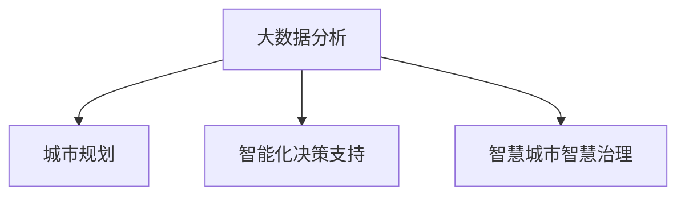

                 

# 大数据分析在城市规划中的应用：智能化决策支持

> 关键词：大数据分析,城市规划,智能化决策,城市管理,交通优化,环境保护

## 1. 背景介绍

### 1.1 问题由来

随着城市的快速发展，传统的城市规划方法逐渐显现出其局限性。传统的城市规划方法往往基于历史经验、专家判断和理论模型，但在面对大规模、复杂的城市系统时，缺乏对数据的多维度、高精度分析。这使得城市规划难以准确把握实际需求，决策的科学性和可操作性不高。而大数据分析技术的兴起，为城市规划提供了全新的数据驱动决策支持工具。

### 1.2 问题核心关键点

大数据分析在城市规划中的应用，关键在于如何充分利用城市运行过程中产生的大量数据，包括人口、交通、环境、经济等多个维度的信息，进行深度挖掘和分析，从而提升城市规划的科学性和智能化水平。主要包括以下几个方面：

- 数据收集：构建多源异构数据的采集系统，集成城市各领域数据。
- 数据整合：对不同数据源的数据进行清洗、去重、对齐和融合。
- 数据分析：应用统计分析、机器学习、深度学习等技术，发现城市运行中的模式和趋势。
- 模型构建：根据分析结果构建智能决策模型，提供支持决策的工具和方法。
- 决策支持：将智能决策模型应用于城市规划的各个环节，提升规划的精确性和实效性。

## 2. 核心概念与联系

### 2.1 核心概念概述

为更好地理解大数据分析在城市规划中的应用，本节将介绍几个关键概念：

- **大数据分析(Big Data Analytics)**：指利用先进的数据分析工具，对大规模、复杂的数据集进行快速、精准的分析，发现数据中的隐藏模式和趋势，为决策提供有力支持。

- **城市规划(Urban Planning)**：指通过科学合理地规划城市空间，优化城市功能布局，提升城市生活品质，促进可持续发展。

- **智能化决策支持**：指通过大数据、人工智能等技术，构建智能化的决策分析系统，辅助城市规划者进行更科学、更高效的决策。

- **智慧城市智慧治理**：智慧城市通过大数据、物联网、云计算等技术手段，实现城市各领域数据的集成、共享和应用，提升城市管理和服务的智能化水平。

这些核心概念之间的逻辑关系可以通过以下Mermaid流程图来展示：



这个流程图展示了大数据分析在城市规划中的应用逻辑：

1. 大数据分析获取城市运行数据。
2. 数据整合和清洗后，进行深度分析，构建智能决策模型。
3. 智能决策支持应用于城市规划各个环节。
4. 智慧城市治理使得城市各系统协同工作，提升城市管理水平。

## 3. 核心算法原理 & 具体操作步骤
### 3.1 算法原理概述

大数据分析在城市规划中的应用，本质上是通过数据挖掘和机器学习等技术手段，构建智能决策支持系统，从而提升城市规划的科学性和智能化水平。其核心思想是：

1. **数据收集**：构建数据采集系统，收集城市各领域的数据，包括交通流量、环境质量、人口分布、经济指标等。
2. **数据整合**：对采集到的数据进行清洗、去重、对齐和融合，构建统一的数据集。
3. **数据分析**：利用统计分析、机器学习、深度学习等技术，对数据集进行挖掘，发现其中的模式和趋势。
4. **模型构建**：根据分析结果，构建智能决策模型，如交通流量预测模型、空气质量预测模型、人口流动模型等。
5. **决策支持**：将智能决策模型应用于城市规划的各个环节，辅助规划者进行决策。

### 3.2 算法步骤详解

以下详细讲解大数据分析在城市规划中常用的步骤：

**Step 1: 数据收集与预处理**

1. **数据收集**：
   - 交通数据：通过交通监控设备、GPS设备、智能交通系统等收集交通流量、拥堵情况、事故信息等。
   - 环境数据：通过环境监测站、气象站、传感器等收集空气质量、水质、噪音水平等。
   - 人口数据：通过人口普查、人口流动调查、移动终端等收集人口分布、迁移、聚集等数据。
   - 经济数据：通过政府公开数据、企业报告、金融市场等收集经济指标、收入水平、就业情况等。

2. **数据预处理**：
   - 数据清洗：去除缺失值、异常值、重复数据等。
   - 数据对齐：将不同数据源的数据按照统一的时间、空间维度进行对齐。
   - 数据融合：将多个数据源的数据进行融合，构建统一的数据集。

**Step 2: 数据分析与挖掘**

1. **统计分析**：
   - 描述性统计：对数据进行基本统计，如均值、方差、标准差、百分位数等。
   - 推断性统计：通过假设检验、置信区间等方法，对数据进行推断分析。

2. **机器学习与深度学习**：
   - 监督学习：使用分类、回归等算法对数据进行建模，如决策树、支持向量机、随机森林等。
   - 无监督学习：使用聚类、降维等算法发现数据中的隐藏模式，如K-means、PCA等。
   - 深度学习：使用神经网络等模型对数据进行深度学习，如CNN、RNN、LSTM等。

**Step 3: 智能决策模型构建**

1. **模型选择与设计**：
   - 根据实际需求选择合适的模型，如时间序列预测模型、空间分布模型、推荐系统等。
   - 设计模型结构和参数，确定输入、输出、损失函数等。

2. **模型训练与评估**：
   - 使用历史数据进行模型训练，通过优化算法调整模型参数，最小化损失函数。
   - 使用测试集对模型进行评估，通过准确率、召回率、F1-score等指标衡量模型性能。

**Step 4: 决策支持与应用**

1. **模型部署**：将训练好的模型部署到生产环境，供城市规划者调用。
2. **实时监控与反馈**：在城市规划的各个环节实时监控模型预测结果，根据反馈调整模型参数和应用策略。
3. **可视化分析**：将模型预测结果和分析结果进行可视化展示，帮助规划者理解数据和模型输出。

### 3.3 算法优缺点

大数据分析在城市规划中的优点：

1. **数据驱动决策**：基于大量实际数据进行分析和建模，决策更加科学、合理。
2. **跨领域融合**：能够整合多个领域的数据，全面提升城市规划的效果。
3. **实时更新**：数据实时采集和更新，模型不断优化，适应城市发展的动态变化。

同时，也存在以下缺点：

1. **数据质量问题**：城市运行数据可能存在缺失、错误、噪声等问题，影响分析结果。
2. **计算资源需求**：大数据分析需要大量的计算资源，对硬件设施要求较高。
3. **模型复杂性**：构建高质量的智能决策模型需要复杂的算法和技术，有一定门槛。
4. **隐私与安全**：城市数据涉及个人隐私和敏感信息，数据使用需确保隐私保护和数据安全。

### 3.4 算法应用领域

大数据分析在城市规划中的应用，覆盖了城市运行和管理的各个环节，具体包括：

- **交通规划**：通过交通流量预测和分析，优化交通网络布局，缓解交通拥堵，提升出行效率。
- **环境规划**：通过空气质量、水质等数据的分析，评估城市环境健康状况，制定环保措施。
- **公共安全**：通过人口流动、事故数据等分析，预测和预防公共安全事件，提升应急响应能力。
- **资源优化**：通过能源、水资源、土地利用等数据的分析，优化城市资源配置，促进可持续发展。
- **社区管理**：通过居民反馈、公共设施使用数据等分析，提升社区服务和管理水平，增强居民满意度。

## 4. 数学模型和公式 & 详细讲解 & 举例说明

### 4.1 数学模型构建

在城市规划中，常用的数学模型包括时间序列预测模型、空间分布模型、推荐系统等。以交通流量预测模型为例，其数学模型构建过程如下：

**Step 1: 数据准备**

假设城市交通流量数据集为 $\{(t_i, x_i)\}_{i=1}^N$，其中 $t_i$ 为时间点，$x_i$ 为交通流量。

**Step 2: 模型选择与设计**

假设选择ARIMA模型进行交通流量预测，模型形式为：

$$
x_t = \phi(B) x_{t-1} + \theta(B) e_t
$$

其中，$\phi(B)$ 为自回归部分，$\theta(B)$ 为差分部分，$e_t$ 为白噪声序列。

**Step 3: 参数估计**

使用历史数据 $\{(x_t, e_t)\}_{t=1}^T$，最小化残差平方和，估计模型参数：

$$
\hat{\theta} = \mathop{\arg\min}_{\theta} \sum_{t=1}^T (x_t - \phi(B)x_{t-1} - \theta(B)e_t)^2
$$

**Step 4: 模型预测**

使用训练好的模型 $\hat{x}_t = \phi(B) \hat{x}_{t-1} + \theta(B) \hat{e}_t$，对未来时间点 $t$ 的交通流量进行预测。

### 4.2 公式推导过程

以下对ARIMA模型的参数估计过程进行详细推导：

假设 $\{x_t\}$ 为平稳序列，$e_t = x_t - \mu$ 为白噪声序列，其中 $\mu = \mathbb{E}[x_t]$。则ARIMA模型可表示为：

$$
x_t = \phi(B)x_{t-1} + \theta(B)e_t
$$

对模型两边取均值，得到：

$$
\mathbb{E}[x_t] = \phi(B)\mathbb{E}[x_{t-1}] + \theta(B)\mathbb{E}[e_t] = \mu
$$

由平稳性，$\mathbb{E}[e_t] = 0$，上式可简化为：

$$
\mathbb{E}[x_t] = \phi(B)\mathbb{E}[x_{t-1}] = \mu
$$

因此，$x_t = \phi(x_{t-1}) + \theta e_t$。

使用最小二乘法估计参数，$\hat{\phi}, \hat{\theta}$：

$$
\hat{\phi}, \hat{\theta} = \mathop{\arg\min}_{\phi, \theta} \sum_{t=1}^T (x_t - \phi x_{t-1} - \theta e_t)^2
$$

### 4.3 案例分析与讲解

以城市交通流量预测为例，展示ARIMA模型在大数据分析中的应用。

**案例背景**：
某城市交通流量数据集为 $\{(t_i, x_i)\}_{i=1}^{100}$，其中 $t_i$ 为时间点，$x_i$ 为交通流量。目标是在未来1小时预测交通流量。

**数据准备**：
- 收集城市交通流量数据，包括每天每小时的交通流量。
- 对数据进行初步处理，去除缺失值和异常值。
- 将数据集划分为训练集和测试集。

**模型构建与训练**：
- 选择ARIMA模型进行交通流量预测。
- 使用训练集数据对模型进行参数估计。
- 在测试集上评估模型性能，如使用均方误差（MSE）作为评估指标。

**模型应用**：
- 使用训练好的模型对未来1小时的交通流量进行预测。
- 在实时系统中集成模型，根据预测结果调整交通信号灯，缓解交通拥堵。

## 5. 项目实践：代码实例和详细解释说明

### 5.1 开发环境搭建

在进行大数据分析在城市规划中的应用时，首先需要搭建好开发环境。以下是使用Python进行数据分析的开发环境配置流程：

1. 安装Anaconda：从官网下载并安装Anaconda，用于创建独立的Python环境。

2. 创建并激活虚拟环境：
```bash
conda create -n city-planning python=3.8 
conda activate city-planning
```

3. 安装必要库：
```bash
conda install numpy pandas matplotlib scikit-learn statsmodels arima
```

4. 设置Jupyter Notebook：
```bash
jupyter notebook --pylab
```

完成上述步骤后，即可在`city-planning`环境中开始数据分析实践。

### 5.2 源代码详细实现

以下是使用Python和Statsmodels库进行ARIMA模型构建的代码实现：

```python
import numpy as np
import pandas as pd
import statsmodels.api as sm

# 读取数据
data = pd.read_csv('traffic_flow.csv')

# 数据清洗
data = data.dropna()

# 时间序列转换
data.index = pd.to_datetime(data['time'], format='%Y-%m-%d %H:%M:%S')
data = data.set_index('time')

# 拆分训练集和测试集
train = data[:24]  # 前24小时为训练集
test = data[24:]  # 后1小时为测试集

# 模型构建与训练
model = sm.tsa.arima.ARIMA(train, order=(1, 0, 1))
result = model.fit()

# 模型预测与评估
forecast = result.forecast(steps=1)
mse = np.mean((forecast[0] - test.values) ** 2)
print(f"MSE: {mse}")
```

### 5.3 代码解读与分析

让我们再详细解读一下关键代码的实现细节：

**数据清洗**：
- 使用`dropna`方法去除缺失值。
- 将时间转换为Pandas的`datetime`类型，方便时间序列分析。

**模型构建与训练**：
- 使用`sm.tsa.arima.ARIMA`方法构建ARIMA模型，设置模型参数。
- 使用`fit`方法拟合模型，最小化残差平方和，估计模型参数。

**模型预测与评估**：
- 使用`forecast`方法对未来1小时的交通流量进行预测。
- 使用均方误差（MSE）评估模型性能，计算预测值与真实值的误差平方和的平均值。

**运行结果展示**：
- 在测试集上评估模型性能，输出MSE值。
- 根据MSE值调整模型参数，重复训练和预测，直至达到满意的性能。

## 6. 实际应用场景

### 6.1 智能交通系统

基于大数据分析的智能交通系统，可以通过对历史交通数据的深度挖掘，预测未来交通流量，优化交通信号灯设置，缓解交通拥堵，提升出行效率。

具体实现如下：
- 收集城市交通流量数据，构建交通流量预测模型。
- 在实时系统中集成模型，根据预测结果动态调整交通信号灯。
- 使用数据分析和可视化工具，监控交通流量变化，实时调整交通管理策略。

### 6.2 城市环境监测

大数据分析在城市环境监测中的应用，可以整合空气质量、水质、噪音等数据，构建环境监测系统，提升城市环境的健康水平。

具体实现如下：
- 收集城市环境数据，包括空气质量、水质、噪音等指标。
- 构建环境质量预测模型，如时间序列预测模型、回归模型等。
- 使用数据分析和可视化工具，实时监控环境质量，评估环境健康状况。

### 6.3 公共安全预警

基于大数据分析的公共安全预警系统，可以通过人口流动、事故数据等分析，预测公共安全事件，提升应急响应能力。

具体实现如下：
- 收集人口流动、事故、灾害等数据，构建公共安全预测模型。
- 在实时系统中集成模型，根据预测结果提前预警，调配应急资源。
- 使用数据分析和可视化工具，实时监控预警情况，动态调整应急措施。

## 7. 工具和资源推荐

### 7.1 学习资源推荐

为了帮助开发者系统掌握大数据分析在城市规划中的应用，这里推荐一些优质的学习资源：

1. **《Python数据分析》**：详细介绍Python在数据分析中的应用，涵盖Pandas、NumPy、Matplotlib等库的使用方法。

2. **《城市数据分析》**：介绍城市数据挖掘和分析技术，结合实际案例讲解城市规划的应用。

3. **《深度学习与大数据分析》**：讲解深度学习和大数据分析的结合，提升城市规划的智能化水平。

4. **Coursera《城市规划数据分析》课程**：由斯坦福大学教授讲授，提供丰富的案例和实战练习。

5. **Kaggle城市规划数据集**：提供大量城市规划数据集，适合进行数据分析实践。

通过对这些资源的学习实践，相信你一定能够快速掌握大数据分析在城市规划中的应用，并用于解决实际的城市规划问题。

### 7.2 开发工具推荐

高效的开发离不开优秀的工具支持。以下是几款用于城市规划数据分析的常用工具：

1. **Python**：开源的编程语言，具有强大的数据分析和机器学习库支持。

2. **Pandas**：Python数据分析库，提供数据清洗、处理和分析的功能。

3. **NumPy**：Python科学计算库，提供高效的数值计算功能。

4. **Matplotlib**：Python数据可视化库，用于绘制图表和可视化分析结果。

5. **Jupyter Notebook**：交互式的编程环境，支持数据分析和机器学习项目的开发和展示。

6. **ArcGIS**：地理信息系统软件，支持城市规划中的空间数据分析和可视化。

合理利用这些工具，可以显著提升城市规划数据分析的开发效率，加快创新迭代的步伐。

### 7.3 相关论文推荐

大数据分析在城市规划中的应用研究，涵盖了多个方面，以下是几篇经典论文，推荐阅读：

1. **《城市数据分析：基于大数据的方法与技术》**：介绍大数据在城市规划中的应用，涵盖数据分析、建模和可视化等方面。

2. **《智能交通系统：基于大数据的建模与优化》**：探讨智能交通系统的数据分析方法和优化策略。

3. **《城市环境监测与预警：大数据分析与可视化》**：介绍城市环境监测的模型构建和应用。

4. **《公共安全事件预测与预警：大数据分析与算法》**：讨论公共安全事件的预测和预警方法。

这些论文代表了大数据分析在城市规划领域的发展脉络，通过学习这些前沿成果，可以帮助研究者把握学科前进方向，激发更多的创新灵感。

## 8. 总结：未来发展趋势与挑战

### 8.1 总结

本文对大数据分析在城市规划中的应用进行了全面系统的介绍。首先阐述了大数据分析在城市规划中的研究背景和意义，明确了数据分析在提升城市规划科学性、智能化水平方面的独特价值。其次，从原理到实践，详细讲解了大数据分析的数学模型和实现步骤，给出了实际应用中的代码实例。同时，本文还广泛探讨了大数据分析在智能交通、环境监测、公共安全等多个领域的应用前景，展示了大数据分析的广泛应用潜力。最后，本文精选了大数据分析相关的学习资源、开发工具和研究论文，力求为读者提供全方位的技术指引。

通过本文的系统梳理，可以看到，大数据分析在城市规划中的应用正日益成为城市管理的重要手段，极大地提升了城市规划的科学性和智能化水平，促进了城市的可持续发展。未来，伴随技术的不断进步，大数据分析在城市规划中的应用将更加广泛和深入，为城市管理的现代化、智能化提供坚实的数据支撑。

### 8.2 未来发展趋势

展望未来，大数据分析在城市规划中的发展趋势主要体现在以下几个方面：

1. **多源数据融合**：未来的城市规划将更注重多源异构数据的融合和分析，提升决策的全面性和准确性。

2. **实时数据处理**：实时数据处理技术的应用，使得城市规划者可以实时获取和分析数据，快速应对城市运行中的变化。

3. **深度学习应用**：深度学习技术的不断进步，使得城市规划中的数据分析和建模更加精细化、智能化。

4. **可视化与交互**：数据分析结果的可视化展示和交互式应用，将增强决策者的理解和应用效果。

5. **跨领域合作**：跨学科的合作与交流，将为城市规划带来更多的创新思路和实践经验。

6. **可持续发展**：城市规划中的数据分析，将更加注重环境保护和资源优化，推动绿色城市的建设。

这些趋势凸显了大数据分析在城市规划中的广阔前景，未来必将带来更多的创新应用，提升城市管理的智能化水平。

### 8.3 面临的挑战

尽管大数据分析在城市规划中已经取得了显著成效，但在实现普及应用的过程中，仍然面临诸多挑战：

1. **数据质量与隐私**：城市运行数据质量参差不齐，数据隐私与安全问题突出。

2. **计算资源需求**：大数据分析需要大量的计算资源，硬件设施需求高。

3. **模型复杂性**：模型构建和优化需要复杂的技术和算法，有一定门槛。

4. **技术整合**：城市规划中的大数据分析需要与其他技术如物联网、云计算等进行整合，存在技术适配问题。

5. **人才短缺**：数据分析与建模需要专业知识，专业人才储备不足。

6. **数据共享**：不同部门的数据共享和协同工作困难，数据孤岛问题突出。

正视这些挑战，积极应对并寻求突破，将是大数据分析在城市规划中实现普及应用的重要保障。相信随着技术的不断进步和应用实践的积累，大数据分析在城市规划中的应用将更加广泛和深入。

### 8.4 研究展望

面对大数据分析在城市规划中面临的诸多挑战，未来的研究需要在以下几个方面寻求新的突破：

1. **数据清洗与预处理**：研发更高效的数据清洗和预处理算法，提升数据质量。

2. **隐私保护与数据安全**：建立数据隐私保护机制，确保数据使用的合法性和安全性。

3. **模型优化与轻量化**：优化模型结构和算法，提升模型效率和可解释性。

4. **实时数据处理与流计算**：研究实时数据处理和流计算技术，支持城市规划的实时决策。

5. **跨领域融合**：研发跨领域融合技术，提升数据分析的综合性和全面性。

6. **智慧城市平台**：构建智慧城市数据平台，支持多源数据集成和共享。

这些研究方向将引领大数据分析在城市规划中的应用进入新的阶段，推动城市规划的智能化、现代化和绿色化发展。

## 9. 附录：常见问题与解答

**Q1：大数据分析在城市规划中如何保证数据质量？**

A: 保证大数据分析在城市规划中的应用效果，首先需要确保数据质量。具体措施包括：
- 数据采集：使用可靠的传感器和数据采集设备，确保数据的准确性和可靠性。
- 数据清洗：去除缺失值、异常值、重复数据等，保证数据的完整性和一致性。
- 数据对齐：对不同数据源的数据进行对齐，确保数据的一致性和完整性。

**Q2：大数据分析在城市规划中如何保护数据隐私？**

A: 在城市规划中，保护数据隐私尤为重要。具体措施包括：
- 数据脱敏：对敏感数据进行脱敏处理，避免泄露个人隐私。
- 数据匿名化：通过数据匿名化技术，保护数据隐私。
- 访问控制：设置严格的访问控制机制，确保数据只对授权人员开放。

**Q3：大数据分析在城市规划中如何处理计算资源需求？**

A: 大数据分析需要大量的计算资源，因此需要采取以下措施：
- 云计算：使用云计算平台，分散计算负载，提升计算效率。
- 分布式计算：使用分布式计算技术，将计算任务分配到多个节点上并行处理。
- 数据压缩：使用数据压缩技术，减少数据的存储空间和传输带宽。

**Q4：大数据分析在城市规划中如何优化模型？**

A: 模型优化是保证大数据分析效果的重要手段。具体措施包括：
- 模型选择：根据实际需求选择合适的模型，如ARIMA、回归模型、深度学习模型等。
- 参数调整：通过交叉验证等方法，调整模型参数，提升模型精度。
- 模型集成：使用集成学习方法，结合多个模型进行预测，提升模型性能。

**Q5：大数据分析在城市规划中如何实现实时数据处理？**

A: 实时数据处理是城市规划中的重要需求，具体措施包括：
- 流计算：使用流计算技术，对实时数据进行高效处理。
- 数据缓存：使用数据缓存技术，提高数据处理效率。
- 实时数据采集：使用实时数据采集技术，保证数据的时效性。

通过回答这些问题，我们可以更好地理解大数据分析在城市规划中的应用，并找到应对各种挑战的解决方案。大数据分析在城市规划中的应用前景广阔，相信未来将会有更多创新应用，为城市的可持续发展做出更大贡献。

---

作者：禅与计算机程序设计艺术 / Zen and the Art of Computer Programming

