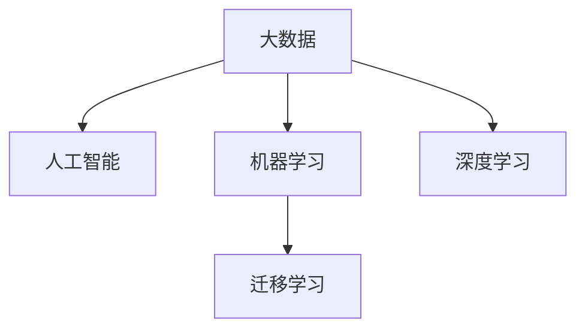
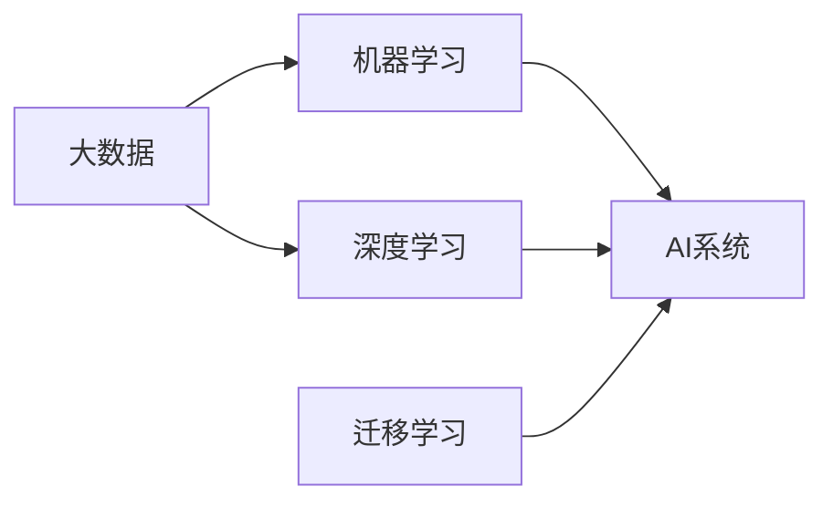

                 

# 大数据对AI学习的重要性

## 1. 背景介绍

在当今信息爆炸的时代，大数据已经成为人工智能(AI)学习的重要基石。随着互联网、物联网(IoT)、社交媒体等技术的发展，各类应用产生了海量数据，为AI模型的训练和优化提供了丰富的资源。大数据不仅仅改变了数据处理的方式，还从根本上重塑了AI学习的思路和方法。本文将从背景介绍、核心概念与联系、核心算法原理及具体操作步骤、数学模型和公式详细讲解、项目实践、实际应用场景、工具和资源推荐、总结与展望等维度，系统地探讨大数据对AI学习的重要性。

## 2. 核心概念与联系

### 2.1 核心概念概述

要理解大数据对AI学习的重要性，首先要明确几个核心概念：

- **大数据（Big Data）**：通常指规模巨大、复杂多样、更新迅速的数据集，其大小、多样性和速度（3V特性）使得传统的数据处理方式无法满足需求。大数据技术通过分布式计算、实时处理等手段，能够高效地管理和分析大规模数据。

- **人工智能（AI）**：旨在模拟人类智能行为的技术，涵盖感知、学习、推理、决策等多个方面。AI的核心在于通过算法和大数据学习模型的知识表示和推理能力。

- **机器学习（ML）**：AI的一个分支，专注于通过数据和算法自动学习规律，而非显式编程。大数据为机器学习提供了大量可分析的样本和特征，从而提升模型的泛化能力和性能。

- **深度学习（DL）**：机器学习的一个分支，使用多层神经网络对非线性复杂问题进行建模和求解。大数据为深度学习提供了充足的训练数据和计算资源，从而训练出更为复杂的神经网络模型。

- **迁移学习（Transfer Learning）**：将一个领域学到的知识迁移到另一个领域，以减少新领域数据需求和提高学习效率。大数据使得在多个领域之间进行迁移学习成为可能。

这些概念之间的联系可以通过以下Mermaid流程图来展示：



### 2.2 核心概念原理和架构的 Mermaid 流程图

下面的Mermaid流程图详细展示了大数据、机器学习、深度学习之间的联系和相互作用：



从上述流程图中可以看出，大数据不仅为机器学习和深度学习提供了数据基础，还通过迁移学习等机制，促进了AI系统在不同领域和任务之间的知识共享和融合。

## 3. 核心算法原理 & 具体操作步骤

### 3.1 算法原理概述

在大数据背景下，AI学习的主要任务是从数据中提取有价值的信息和知识，以提升模型的预测和决策能力。这一过程通常包括以下几个关键步骤：

1. **数据采集和预处理**：从不同的数据源收集原始数据，并进行清洗、去重、标准化等预处理工作，以确保数据的质量和一致性。

2. **特征工程**：从原始数据中提取有意义的特征，生成模型输入的特征向量。特征工程是提升模型性能的关键步骤，其质量直接影响最终的结果。

3. **模型训练**：选择合适的模型和算法，使用标注数据对模型进行训练，学习模型参数。训练过程通常是一个迭代优化的过程，通过反向传播等算法更新模型参数，以最小化损失函数。

4. **模型评估和优化**：在验证集和测试集上评估模型的性能，通过调整超参数、改进算法等手段，进一步优化模型。

5. **模型部署与应用**：将训练好的模型集成到实际应用系统中，进行实时推理和预测，产生业务价值。

### 3.2 算法步骤详解

#### 3.2.1 数据采集和预处理

数据采集和预处理是大数据背景下的重要环节。以下是具体步骤：

1. **数据源选择**：根据应用需求选择不同的数据源，如社交媒体数据、企业数据、公共数据集等。

2. **数据清洗**：去除噪声和错误，填补缺失值，处理异常值，确保数据的一致性和完整性。

3. **数据标准化**：对不同来源的数据进行统一格式和单位标准化，以便于后续处理和分析。

4. **数据集成**：将不同数据源的数据合并，形成统一的数据集，支持综合分析和决策。

#### 3.2.2 特征工程

特征工程是提升模型性能的重要步骤。以下是具体方法：

1. **特征选择**：从原始数据中选择最有用的特征，减少维度，提高模型训练效率。

2. **特征提取**：通过降维、特征组合、特征转换等手段，生成新的特征，提高模型的表达能力。

3. **特征归一化**：对特征进行标准化处理，使其在数值上具有可比性。

4. **特征融合**：将不同特征进行组合和融合，生成更高级的特征表示，提升模型效果。

#### 3.2.3 模型训练

模型训练是AI学习的核心步骤。以下是具体方法：

1. **模型选择**：根据应用需求选择不同的模型，如线性回归、逻辑回归、决策树、随机森林、深度神经网络等。

2. **算法选择**：根据模型选择合适的优化算法，如梯度下降、Adam、Adagrad等。

3. **参数设置**：调整学习率、批次大小、迭代次数等超参数，优化模型性能。

4. **损失函数选择**：根据任务选择合适的损失函数，如均方误差、交叉熵、对数损失等。

5. **反向传播**：通过反向传播算法更新模型参数，最小化损失函数。

#### 3.2.4 模型评估和优化

模型评估和优化是提升模型性能的关键步骤。以下是具体方法：

1. **评估指标**：选择合适的评估指标，如准确率、召回率、F1分数等，评估模型性能。

2. **模型调参**：通过交叉验证、网格搜索等方法，调整超参数，寻找最优模型。

3. **模型集成**：通过模型集成技术，如Bagging、Boosting等，提高模型鲁棒性和性能。

4. **模型优化**：使用正则化、Dropout、早停等技术，防止模型过拟合。

#### 3.2.5 模型部署与应用

模型部署与应用是AI学习的最终目标。以下是具体方法：

1. **模型保存**：将训练好的模型保存为文件或数据库，以便后续使用。

2. **模型加载**：在实际应用系统中加载模型，进行实时推理和预测。

3. **性能监控**：实时监测模型性能，及时发现和解决异常问题。

4. **持续更新**：根据新的数据和业务需求，不断更新模型，保持模型性能。

### 3.3 算法优缺点

#### 3.3.1 优点

1. **数据驱动**：大数据背景下的AI学习强调数据驱动，通过数据驱动的方式提升模型性能。

2. **泛化能力强**：大数据提供了丰富的数据样本，使得模型能够学习到更多的一般性规律，提高泛化能力。

3. **模型复杂度高**：大数据背景下的AI学习可以训练更复杂的模型，如深度神经网络，提升预测精度。

4. **应用广泛**：大数据为AI学习提供了多种应用场景，如推荐系统、智能客服、智能交通等。

#### 3.3.2 缺点

1. **数据噪声**：大数据可能包含大量的噪声和异常值，需要进行清洗和处理。

2. **计算资源需求高**：大数据处理和训练需要大量的计算资源，如GPU、TPU等高性能设备。

3. **隐私和安全问题**：大数据处理和存储可能涉及个人隐私和安全问题，需要进行严格的数据保护和隐私控制。

4. **算法复杂度高**：大数据背景下的AI学习需要使用复杂的算法和模型，对技术要求高。

### 3.4 算法应用领域

大数据在AI学习中的应用领域非常广泛，包括但不限于以下几个方面：

1. **自然语言处理（NLP）**：通过文本挖掘、情感分析、机器翻译等技术，提升NLP系统的性能。

2. **图像识别和计算机视觉**：通过图像分类、目标检测、图像生成等技术，提升图像识别系统的性能。

3. **推荐系统**：通过协同过滤、内容推荐、兴趣推荐等技术，提升推荐系统的个性化和精准度。

4. **智能交通**：通过数据挖掘和分析，提升交通流量预测、路径规划、智能交通信号控制等系统的性能。

5. **金融风控**：通过数据分析和建模，提升风险评估、信用评分、欺诈检测等金融风控系统的性能。

6. **医疗健康**：通过数据分析和建模，提升疾病预测、药物研发、医疗影像分析等系统的性能。

## 4. 数学模型和公式 & 详细讲解 & 举例说明

### 4.1 数学模型构建

在大数据背景下，AI学习通常使用以下数学模型：

1. **线性回归模型**：用于预测连续型目标变量，形式为 $y = \theta_0 + \theta_1x_1 + \theta_2x_2 + \ldots + \theta_nx_n$，其中 $\theta$ 为模型参数。

2. **逻辑回归模型**：用于预测离散型目标变量，形式为 $P(y=1) = \sigma(\theta_0 + \theta_1x_1 + \theta_2x_2 + \ldots + \theta_nx_n)$，其中 $\sigma$ 为逻辑函数。

3. **决策树模型**：通过树形结构对特征进行分割，形成决策路径，形式为 $IF\ condition THEN output$。

4. **随机森林模型**：基于决策树的集成学习，提升模型鲁棒性和泛化能力，形式为多棵决策树的集成。

5. **深度神经网络模型**：使用多层神经网络对复杂非线性问题进行建模，形式为 $y = f(x; \theta)$，其中 $f$ 为多层神经网络。

### 4.2 公式推导过程

以线性回归模型为例，其推导过程如下：

假设我们有 $m$ 个样本 $(x_i,y_i)$，其中 $x_i$ 为输入特征，$y_i$ 为输出目标。线性回归模型的目标是最小化预测值与实际值之间的误差，即损失函数 $L(\theta) = \frac{1}{2m} \sum_{i=1}^m (y_i - \theta_0 - \theta_1x_1 - \theta_2x_2 - \ldots - \theta_nx_n)^2$。

对损失函数求导，得到梯度 $\nabla_{\theta} L(\theta) = \frac{1}{m} \sum_{i=1}^m (y_i - \theta_0 - \theta_1x_1 - \theta_2x_2 - \ldots - \theta_nx_n)(x_i,1,x_i^2,x_i^3,\ldots,x_i^n)$。

通过梯度下降算法，更新模型参数 $\theta$，得到 $\theta_{new} = \theta - \eta \nabla_{\theta} L(\theta)$，其中 $\eta$ 为学习率。

### 4.3 案例分析与讲解

假设我们有一组房价数据，其中包含房屋面积 $x$ 和房价 $y$。我们的目标是训练一个线性回归模型，预测新房屋的房价。

我们首先对数据进行清洗和标准化处理，然后使用梯度下降算法对模型进行训练。具体步骤如下：

1. **数据清洗**：去除噪声和异常值，填补缺失值。

2. **数据标准化**：对房屋面积 $x$ 进行标准化处理，使其具有相同的数值范围。

3. **模型训练**：使用梯度下降算法，对线性回归模型进行训练，得到模型参数 $\theta$。

4. **模型评估**：在验证集上评估模型性能，计算误差。

5. **模型应用**：使用训练好的模型对新房屋的房价进行预测。

## 5. 项目实践：代码实例和详细解释说明

### 5.1 开发环境搭建

在进行AI学习项目时，首先需要搭建开发环境。以下是使用Python进行TensorFlow开发的配置步骤：

1. 安装Anaconda：从官网下载并安装Anaconda，用于创建独立的Python环境。

2. 创建并激活虚拟环境：
```bash
conda create -n tf-env python=3.7 
conda activate tf-env
```

3. 安装TensorFlow：根据CUDA版本，从官网获取对应的安装命令。例如：
```bash
conda install tensorflow -c tf -c conda-forge
```

4. 安装必要的库：
```bash
pip install numpy pandas matplotlib scikit-learn
```

完成上述步骤后，即可在`tf-env`环境中开始AI学习项目开发。

### 5.2 源代码详细实现

下面我们以房价预测为例，给出使用TensorFlow进行线性回归的PyTorch代码实现。

首先，导入必要的库和数据：

```python
import tensorflow as tf
import numpy as np
from sklearn.datasets import load_boston

# 加载波士顿房价数据集
boston = load_boston()
X = boston.data
y = boston.target
```

然后，定义模型和优化器：

```python
# 定义线性回归模型
model = tf.keras.Sequential([
    tf.keras.layers.Dense(1, input_shape=[X.shape[1]], activation='linear')
])

# 定义优化器
optimizer = tf.keras.optimizers.Adam(learning_rate=0.01)
```

接着，定义训练和评估函数：

```python
def train_epoch(model, X, y, batch_size, optimizer):
    X_train, X_val, y_train, y_val = train_test_split(X, y, test_size=0.2, random_state=42)
    for epoch in range(100):
        for i in range(0, X_train.shape[0], batch_size):
            X_batch = X_train[i:i+batch_size]
            y_batch = y_train[i:i+batch_size]
            with tf.GradientTape() as tape:
                y_pred = model(X_batch)
                loss = tf.reduce_mean(tf.square(y_pred - y_batch))
            gradients = tape.gradient(loss, model.trainable_variables)
            optimizer.apply_gradients(zip(gradients, model.trainable_variables))
```

最后，启动训练流程并在测试集上评估：

```python
# 训练模型
train_epoch(model, X, y, batch_size=32, optimizer=optimizer)

# 评估模型
y_pred = model(X_val)
mse = tf.reduce_mean(tf.square(y_pred - y_val))
print(f"Mean Squared Error: {mse.numpy()}")
```

以上就是一个简单的线性回归模型训练过程。可以看到，TensorFlow提供了强大的计算图和自动微分功能，使得模型训练变得简单高效。

### 5.3 代码解读与分析

让我们再详细解读一下关键代码的实现细节：

**train_epoch函数**：
- 将数据集划分为训练集和验证集，随机化数据顺序。
- 在每个epoch内，对训练集数据进行迭代。
- 对每个batch数据进行前向传播计算预测值和损失值。
- 使用梯度下降算法更新模型参数。
- 计算梯度并应用到模型中，更新模型参数。

**mse计算**：
- 在验证集上计算模型预测值与真实值之间的均方误差。
- 输出均方误差结果，评估模型性能。

## 6. 实际应用场景

### 6.1 智能推荐系统

在电商、视频、音乐等平台，推荐系统已经成为提升用户体验的重要手段。大数据背景下的推荐系统，通过分析用户行为和偏好，生成个性化推荐。

在推荐系统训练中，首先需要收集用户行为数据，如浏览记录、点击记录、评分记录等。然后，对数据进行清洗和标准化处理，生成特征向量。接着，使用深度学习模型（如协同过滤、内容推荐等）对用户和物品进行建模，训练推荐模型。最后，在实际应用中，根据用户输入的数据，实时生成推荐结果。

### 6.2 金融风控

金融领域风险控制需要实时监测用户的信用行为，预测其违约风险。大数据背景下的金融风控系统，通过分析用户的交易记录、信用历史、社交网络等多维度数据，建立风险预测模型。

在风控系统训练中，首先需要收集用户的历史交易记录和信用数据，并标注违约与否。然后，对数据进行清洗和标准化处理，生成特征向量。接着，使用深度学习模型（如逻辑回归、随机森林等）对用户进行建模，训练风控模型。最后，在实际应用中，根据用户新的交易数据，实时评估其信用风险，进行风险预警。

### 6.3 智能客服

智能客服系统通过分析用户咨询记录和反馈信息，生成自动回复或人工干预方案。大数据背景下的智能客服系统，通过分析大量的客服对话数据，生成客服模型的训练样本。

在客服系统训练中，首先需要收集客服对话记录和用户反馈数据，标注对话意图和回答质量。然后，对数据进行清洗和标准化处理，生成特征向量。接着，使用深度学习模型（如序列到序列模型、Transformer等）对对话进行建模，训练客服模型。最后，在实际应用中，根据用户输入的咨询内容，实时生成自动回复或人工干预方案。

## 7. 工具和资源推荐

### 7.1 学习资源推荐

为了帮助开发者系统掌握大数据和AI学习的知识，这里推荐一些优质的学习资源：

1. **《深度学习》（Ian Goodfellow、Yoshua Bengio和Aaron Courville合著）**：全面介绍深度学习的基本概念、算法和应用，是深度学习领域的经典教材。

2. **《机器学习实战》（Peter Harrington著）**：通过实例讲解机器学习算法和模型，适合初学者和实践者。

3. **《Python数据科学手册》（Jake VanderPlas著）**：介绍Python在数据科学和机器学习中的应用，适合Python编程者。

4. **《TensorFlow官方文档》**：提供TensorFlow的详细文档和教程，涵盖数据处理、模型训练、模型应用等多个方面。

5. **Coursera的《机器学习》课程**：由Andrew Ng教授主讲的经典课程，涵盖机器学习的基本概念和算法。

6. **Kaggle平台**：提供大量公开的数据集和竞赛，适合数据挖掘和机器学习实践者。

通过这些资源的学习实践，相信你一定能够快速掌握大数据和AI学习的精髓，并用于解决实际的AI问题。

### 7.2 开发工具推荐

高效的开发离不开优秀的工具支持。以下是几款用于大数据和AI学习开发的常用工具：

1. **TensorFlow**：由Google主导开发的开源深度学习框架，生产部署方便，适合大规模工程应用。

2. **PyTorch**：Facebook开发的深度学习框架，灵活高效，适合研究和实验。

3. **Hadoop**：Apache提供的分布式计算平台，支持大规模数据处理和存储。

4. **Spark**：Apache提供的分布式计算框架，支持数据处理、机器学习和图计算等。

5. **Jupyter Notebook**：开源的交互式编程环境，支持Python、R等多种语言。

6. **Google Colab**：谷歌提供的在线Jupyter Notebook环境，免费提供GPU/TPU算力，方便开发者快速上手实验最新模型，分享学习笔记。

合理利用这些工具，可以显著提升大数据和AI学习的开发效率，加快创新迭代的步伐。

### 7.3 相关论文推荐

大数据和AI学习的研究源于学界的持续研究。以下是几篇奠基性的相关论文，推荐阅读：

1. **《大数据时代》（Viktor Mayer-Schönberger和Kenneth Cukier合著）**：探讨大数据的背景、应用和挑战，为大数据技术的发展提供理论基础。

2. **《大数据挖掘与分析》（Patrice Laloux著）**：介绍大数据挖掘和分析的基本方法和应用，涵盖数据清洗、特征工程、模型训练等多个方面。

3. **《深度学习》（Goodfellow、Bengio和Courville合著）**：全面介绍深度学习的基本概念、算法和应用，是深度学习领域的经典教材。

4. **《大规模并行机器学习》（Hsuan-Tien Lin著）**：介绍大规模并行机器学习的基本方法和技术，涵盖分布式计算、优化算法等多个方面。

5. **《深度学习与人工神经网络》（Michael H. Nielsen著）**：介绍深度学习的基本概念、算法和应用，适合初学者和实践者。

这些论文代表了大数据和AI学习的最新进展，通过学习这些前沿成果，可以帮助研究者把握学科前进方向，激发更多的创新灵感。

## 8. 总结：未来发展趋势与挑战

### 8.1 研究成果总结

本文对大数据和AI学习的相关内容进行了系统总结。从背景介绍到核心概念、算法原理、操作步骤、数学模型、项目实践、实际应用、工具和资源推荐，全方位阐述了大数据在AI学习中的重要性。通过深入分析大数据背景下的AI学习流程，揭示了数据驱动、模型复杂化、算法多样化等关键特征，并探讨了大数据在多个领域的应用。

### 8.2 未来发展趋势

展望未来，大数据和AI学习将呈现以下几个发展趋势：

1. **数据自动化采集与处理**：随着物联网和传感技术的发展，数据采集将更加自动化、实时化。大数据处理和分析技术将进一步提高，支持大规模、高速度的数据处理。

2. **模型多样化与深度化**：深度学习模型将不断演进，产生更多的复杂模型和算法。模型复杂度的提升将带来更高的预测精度和泛化能力。

3. **分布式计算与边缘计算**：分布式计算和边缘计算技术将进一步发展，支持大规模数据处理和实时分析，提升系统的可扩展性和可靠性。

4. **模型解释与可解释性**：模型解释和可解释性将成为AI学习的重要研究方向。通过可视化、因果分析等手段，提升模型的透明性和可解释性。

5. **跨领域知识融合**：跨领域知识融合技术将进一步发展，支持多模态数据融合、知识图谱等，提升模型的知识整合能力和泛化能力。

### 8.3 面临的挑战

尽管大数据和AI学习技术已经取得了显著进展，但在实际应用中仍然面临诸多挑战：

1. **数据隐私与安全**：大数据处理和存储涉及个人隐私和安全问题，需要严格的数据保护和隐私控制。

2. **计算资源需求高**：大数据处理和训练需要大量的计算资源，如GPU、TPU等高性能设备。

3. **模型解释与透明性**：深度学习模型的复杂性使得其内部工作机制难以解释，需要更多的模型解释和透明性研究。

4. **知识整合与迁移能力**：跨领域知识融合和迁移能力有限，模型难以灵活吸收和运用更广泛的先验知识。

5. **算法公平性与偏见**：模型可能会学习到有偏见的数据，导致不公平的预测结果。如何消除模型偏见，提升公平性，成为重要研究方向。

### 8.4 研究展望

面对大数据和AI学习所面临的挑战，未来的研究需要在以下几个方面寻求新的突破：

1. **隐私保护与数据安全**：开发更高效的数据保护和隐私控制技术，支持大规模数据处理和存储。

2. **高效计算资源优化**：开发更高效的计算资源优化技术，如模型压缩、稀疏化等，支持大规模模型训练和推理。

3. **模型解释与透明性**：开发更有效的模型解释和透明性技术，支持模型的可视化、因果分析等手段，提升模型的透明性和可解释性。

4. **跨领域知识融合**：开发更有效的跨领域知识融合技术，支持多模态数据融合、知识图谱等，提升模型的知识整合能力和泛化能力。

5. **算法公平性与偏见**：开发更有效的公平性控制技术，消除模型偏见，提升模型的公平性。

这些研究方向将引领大数据和AI学习技术迈向更高的台阶，为构建安全、可靠、可解释、可控的智能系统铺平道路。面向未来，大数据和AI学习技术还需要与其他人工智能技术进行更深入的融合，如知识表示、因果推理、强化学习等，多路径协同发力，共同推动自然语言理解和智能交互系统的进步。只有勇于创新、敢于突破，才能不断拓展AI学习技术的边界，让智能技术更好地造福人类社会。

## 9. 附录：常见问题与解答

**Q1：大数据和AI学习有什么区别？**

A: 大数据是指大规模、复杂多样、更新迅速的数据集，强调数据驱动的决策和优化；AI学习是利用数据和算法，通过学习提升模型性能，强调模型驱动的智能决策。

**Q2：如何处理大数据中的噪声和异常值？**

A: 大数据中的噪声和异常值需要通过清洗和处理去除。常见的方法包括数据标准化、缺失值填补、异常值检测等。

**Q3：如何选择适合的深度学习模型？**

A: 选择深度学习模型需要考虑任务类型、数据规模、计算资源等因素。一般而言，简单任务可以使用浅层神经网络，复杂任务需要使用深层神经网络。

**Q4：如何提高模型的泛化能力？**

A: 提高模型的泛化能力需要更多的数据、更好的特征工程和更复杂的模型。数据集的多样性和规模、特征向量的质量、模型的复杂度等都是影响泛化能力的关键因素。

**Q5：如何平衡模型复杂度和性能？**

A: 模型复杂度和性能之间通常存在平衡关系。需要根据具体任务和数据特点，选择适当的模型和算法，避免过拟合和欠拟合。

通过以上系统介绍和深入分析，相信读者对大数据在AI学习中的重要性有了更深刻的理解。掌握大数据和AI学习的技术，将为人工智能技术的广泛应用提供坚实基础。面向未来，大数据和AI学习技术将进一步发展，带来更多的创新和突破，推动人工智能技术的发展，为构建智能社会做出更大贡献。

---

作者：禅与计算机程序设计艺术 / Zen and the Art of Computer Programming

