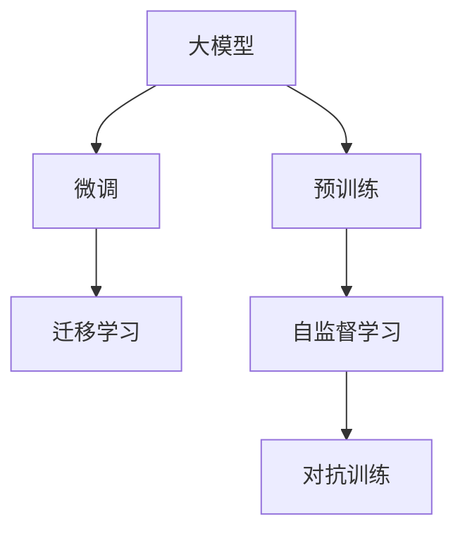

                 

# 大模型产品的挑战与乐趣

## 1. 背景介绍

随着深度学习技术的不断发展，大模型在人工智能领域的应用日益广泛。这些模型通常具有数十亿甚至数百亿的参数，能够在几乎所有的NLP任务上取得接近人类水平的性能。然而，这些模型的应用并非一帆风顺，开发、部署、维护和优化大模型产品面临着许多挑战。但同时，大模型也带来了极大的乐趣和潜在的商业价值。本文将探讨大模型产品的挑战与乐趣，以期为从事相关工作的人士提供一些有益的见解和实践建议。

## 2. 核心概念与联系

### 2.1 核心概念概述

在大模型产品的开发中，有几个核心概念是必须掌握的：

- **大模型(Large Model)**：指具有数十亿或数百亿参数的深度神经网络模型，如GPT-3、BERT等。这些模型通常在预训练阶段使用大规模无标签数据进行训练，以学习通用的语言表示。
- **预训练(Pre-training)**：指在大规模无标签数据上进行自监督学习任务，以学习通用的语言表示。预训练是构建高性能大模型的关键步骤。
- **微调(Fine-tuning)**：指在大模型基础上，使用下游任务的标注数据进行有监督学习，以适应特定任务的需求。微调可以显著提升模型在特定任务上的性能。
- **迁移学习(Transfer Learning)**：指利用预训练模型的知识，对新任务进行有监督学习的过程。迁移学习是大模型产品开发中常用的技术手段。
- **自监督学习(Self-supervised Learning)**：指在大规模无标签数据上进行的自训练过程，通过设计巧妙的任务引导模型学习语言表示。自监督学习是大模型预训练的基础。
- **对抗训练(Adversarial Training)**：指在训练过程中引入对抗样本，以提高模型的鲁棒性和泛化能力。对抗训练是大模型产品开发中的常见策略。

这些概念之间的联系可以通过以下Mermaid流程图来展示：



这个流程图展示了从预训练到微调再到迁移学习的整个流程，以及自监督学习和对抗训练在大模型产品开发中的重要位置。

## 3. 核心算法原理 & 具体操作步骤

### 3.1 算法原理概述

大模型产品的开发主要分为两个阶段：预训练和微调。预训练阶段在大规模无标签数据上进行自监督学习，以学习通用的语言表示。微调阶段使用下游任务的标注数据进行有监督学习，以适应特定任务的需求。

### 3.2 算法步骤详解

#### 预训练步骤：

1. **数据准备**：收集大规模无标签数据，如维基百科、新闻、社交媒体等。
2. **模型选择**：选择合适的预训练模型，如BERT、GPT-3等。
3. **自监督学习任务设计**：设计自监督学习任务，如掩码语言模型、下一句预测等。
4. **模型训练**：在大规模无标签数据上训练模型，最小化自监督学习任务的目标函数。

#### 微调步骤：

1. **任务适配**：根据下游任务，设计合适的任务适配层和损失函数。
2. **数据准备**：收集下游任务的标注数据，划分训练集、验证集和测试集。
3. **模型加载**：加载预训练模型，并将其作为初始化参数。
4. **微调训练**：在标注数据上使用较小的学习率进行微调，以适应特定任务。
5. **性能评估**：在测试集上评估微调后的模型性能，对比预训练和微调后的效果。

### 3.3 算法优缺点

#### 优点：

1. **性能提升显著**：大模型通过预训练学习到通用的语言表示，微调后能够在特定任务上取得优异的表现。
2. **泛化能力强**：大模型具有较强的泛化能力，能够适应多种下游任务。
3. **参数高效**：在微调过程中，可以通过参数高效方法只更新少量的模型参数，以降低计算资源消耗。
4. **可解释性强**：大模型可以通过输入输出进行解释，有助于理解模型的决策过程。

#### 缺点：

1. **资源需求高**：大模型需要大量的计算资源和存储空间，训练和推理速度较慢。
2. **标注数据需求高**：微调过程需要大量的标注数据，对于小规模任务可能难以获得高质量标注。
3. **过拟合风险**：由于模型复杂度高，容易出现过拟合问题。
4. **公平性问题**：大模型可能学习到数据中的偏见，导致输出结果的不公平。

### 3.4 算法应用领域

大模型产品可以在多个领域得到应用，例如：

- **自然语言处理(NLP)**：文本分类、情感分析、机器翻译、问答系统等。
- **计算机视觉(CV)**：图像分类、目标检测、语义分割等。
- **语音识别**：语音转文本、语音合成等。
- **推荐系统**：个性化推荐、协同过滤等。
- **医疗健康**：医学影像分析、疾病预测等。

这些领域都可以利用大模型的强大能力，提升系统的性能和智能化水平。

## 4. 数学模型和公式 & 详细讲解 & 举例说明

### 4.1 数学模型构建

大模型通常使用Transformer架构，如BERT、GPT-3等。在微调过程中，我们需要构建一个任务适配层和相应的损失函数。以文本分类任务为例：

- **任务适配层**：通常是一个线性分类层，将模型的输出映射到任务标签空间。
- **损失函数**：常用的损失函数包括交叉熵损失、均方误差损失等。

### 4.2 公式推导过程

以文本分类任务为例，假设模型在输入 $x$ 上的输出为 $\hat{y}$，真实标签为 $y$。则交叉熵损失函数定义为：

$$
L(y, \hat{y}) = -y \log \hat{y} - (1 - y) \log (1 - \hat{y})
$$

在微调过程中，我们使用小批量梯度下降法更新模型参数，最小化损失函数 $L$。具体公式为：

$$
\theta_{t+1} = \theta_t - \alpha \frac{\partial L}{\partial \theta}
$$

其中 $\alpha$ 为学习率，$\theta$ 为模型参数。

### 4.3 案例分析与讲解

假设我们有一个文本分类任务，训练集包含1000个样本，每个样本包含一个文本和对应的标签。我们可以使用上述公式进行微调，具体步骤如下：

1. **数据准备**：将训练集分为训练集、验证集和测试集，每个集大小为200个样本。
2. **模型加载**：使用预训练模型BERT作为初始化参数。
3. **任务适配层设计**：设计一个线性分类层，将BERT模型的输出映射到10个任务标签。
4. **损失函数选择**：选择交叉熵损失函数。
5. **微调训练**：在训练集上使用小批量梯度下降法，学习率设为0.001，批量大小为64，迭代1000次。
6. **性能评估**：在测试集上评估微调后的模型性能，对比预训练和微调后的效果。

## 5. 项目实践：代码实例和详细解释说明

### 5.1 开发环境搭建

在进行大模型产品开发时，我们需要搭建一个高性能的开发环境。以下是一些常用的工具和环境配置方法：

1. **PyTorch**：选择PyTorch框架，因为其灵活性和动态计算图功能。
2. **CUDA**：安装CUDA和cuDNN，以加速模型训练和推理。
3. **Google Colab**：使用Google Colab进行分布式训练，可以节省计算资源。
4. **Jupyter Notebook**：使用Jupyter Notebook进行交互式开发，方便调试和迭代。

### 5.2 源代码详细实现

以下是一个基于BERT进行文本分类任务的微调示例代码：

```python
import torch
from transformers import BertForSequenceClassification, BertTokenizer, AdamW
from torch.utils.data import DataLoader, Dataset

class TextDataset(Dataset):
    def __init__(self, texts, labels):
        self.texts = texts
        self.labels = labels
        self.tokenizer = BertTokenizer.from_pretrained('bert-base-cased')

    def __len__(self):
        return len(self.texts)

    def __getitem__(self, idx):
        text = self.texts[idx]
        label = self.labels[idx]
        encoding = self.tokenizer(text, truncation=True, padding=True, max_length=512)
        input_ids = encoding['input_ids']
        attention_mask = encoding['attention_mask']
        return {'input_ids': input_ids, 'attention_mask': attention_mask, 'labels': label}

# 加载数据集
train_dataset = TextDataset(train_texts, train_labels)
dev_dataset = TextDataset(dev_texts, dev_labels)
test_dataset = TextDataset(test_texts, test_labels)

# 加载预训练模型
model = BertForSequenceClassification.from_pretrained('bert-base-cased', num_labels=num_labels)

# 定义优化器和学习率
optimizer = AdamW(model.parameters(), lr=0.001)

# 训练模型
device = torch.device("cuda" if torch.cuda.is_available() else "cpu")
model.to(device)

for epoch in range(num_epochs):
    for batch in DataLoader(train_dataset, batch_size=batch_size):
        input_ids = batch['input_ids'].to(device)
        attention_mask = batch['attention_mask'].to(device)
        labels = batch['labels'].to(device)
        model.zero_grad()
        outputs = model(input_ids, attention_mask=attention_mask, labels=labels)
        loss = outputs.loss
        loss.backward()
        optimizer.step()

    if epoch % log_interval == 0:
        eval_loss = evaluate(model, dev_dataset)
        print(f"Epoch {epoch+1}/{num_epochs}, Train Loss: {loss:.4f}, Dev Loss: {eval_loss:.4f}")

# 评估模型
dev_loss = evaluate(model, dev_dataset)

# 输出评估结果
print(f"Final Dev Loss: {dev_loss:.4f}")
```

### 5.3 代码解读与分析

上述代码展示了如何使用PyTorch进行BERT模型的微调。具体步骤如下：

1. **数据集准备**：定义一个`TextDataset`类，将文本和标签加载到PyTorch数据集中。
2. **模型加载**：使用预训练的BERT模型进行加载，并将其适配到文本分类任务。
3. **优化器定义**：选择AdamW优化器，设置学习率为0.001。
4. **训练过程**：在训练集上进行迭代训练，使用小批量梯度下降法更新模型参数。
5. **评估过程**：在验证集上评估模型性能，输出平均损失。

### 5.4 运行结果展示

在训练过程中，我们会输出每个epoch的训练损失和验证损失。在评估过程中，我们可以输出验证集的平均损失，以评估模型性能。

## 6. 实际应用场景

### 6.1 金融风控

在金融领域，大模型可以用于风险评估、欺诈检测、信用评分等任务。例如，可以使用大模型对客户的历史交易数据进行预测，判断其是否具有欺诈行为。

### 6.2 智能客服

智能客服是大模型产品的一个重要应用场景。通过使用大模型进行微调，可以构建一个智能客服系统，能够快速响应客户咨询，提高客户满意度。

### 6.3 智能家居

智能家居领域可以利用大模型进行语音识别、自然语言处理、智能控制等任务。例如，可以使用大模型对用户的语音指令进行识别，并控制智能设备执行相应操作。

### 6.4 未来应用展望

未来，大模型产品将在更多领域得到应用，例如医疗、教育、娱乐等。这些应用场景将大幅提升各个行业的智能化水平，带来更高的效率和更好的用户体验。

## 7. 工具和资源推荐

### 7.1 学习资源推荐

- **《深度学习入门》**：由李宏毅教授主讲，涵盖深度学习的基础知识和实践技能。
- **《自然语言处理综论》**：介绍自然语言处理的基本概念、算法和应用。
- **《BERT预训练与微调》**：由Hugging Face官方博客发布，详细介绍BERT模型的预训练和微调方法。
- **《大规模深度学习》**：讲述深度学习的发展历程和未来趋势。

### 7.2 开发工具推荐

- **PyTorch**：一个灵活的深度学习框架，支持动态计算图。
- **TensorFlow**：一个强大的深度学习框架，支持分布式训练和部署。
- **Jupyter Notebook**：一个交互式开发环境，支持Python、R等编程语言。
- **Google Colab**：一个免费的云服务平台，支持分布式训练和可视化。

### 7.3 相关论文推荐

- **《BERT预训练与微调》**：由Hugging Face官方博客发布，详细介绍BERT模型的预训练和微调方法。
- **《大规模深度学习》**：介绍大规模深度学习的发展历程和未来趋势。
- **《深度学习框架》**：讲述当前流行的深度学习框架，包括PyTorch、TensorFlow等。

## 8. 总结：未来发展趋势与挑战

### 8.1 研究成果总结

大模型产品在自然语言处理、金融风控、智能客服等多个领域得到了广泛应用，带来了显著的性能提升和智能化水平。但同时，大模型产品开发也面临着数据标注、计算资源、模型公平性等问题。

### 8.2 未来发展趋势

未来，大模型产品将继续在更多领域得到应用，例如医疗、教育、娱乐等。大模型产品将更加注重数据隐私、模型公平性、可解释性等关键问题，推动人工智能技术的健康发展。

### 8.3 面临的挑战

大模型产品开发面临的主要挑战包括数据标注、计算资源、模型公平性、可解释性等问题。如何优化大模型的计算效率，提高模型性能和可解释性，是一个亟待解决的问题。

### 8.4 研究展望

未来，大模型产品研究将更加注重数据隐私、模型公平性、可解释性等关键问题。同时，大模型产品也将与外部知识库、规则库等专家知识结合，形成更加全面、准确的信息整合能力。

## 9. 附录：常见问题与解答

**Q1: 大模型产品的开发需要哪些关键资源？**

A: 大模型产品的开发需要高性能的计算资源和存储资源，例如GPU、TPU等。同时还需要大量的标注数据和优化算法，例如自监督学习、对抗训练等。

**Q2: 大模型产品在应用中存在哪些挑战？**

A: 大模型产品在应用中存在数据标注、计算资源、模型公平性、可解释性等问题。同时，大模型产品还需要应对模型过拟合、参数更新等问题。

**Q3: 如何优化大模型产品的计算效率？**

A: 可以通过梯度积累、混合精度训练、模型并行等方法优化大模型产品的计算效率。

**Q4: 大模型产品的可解释性如何提升？**

A: 可以通过模型可视化、特征分析等方法提升大模型产品的可解释性。

**Q5: 大模型产品的应用前景如何？**

A: 大模型产品在自然语言处理、金融风控、智能客服等多个领域得到了广泛应用，未来将在更多领域得到应用，例如医疗、教育、娱乐等。

