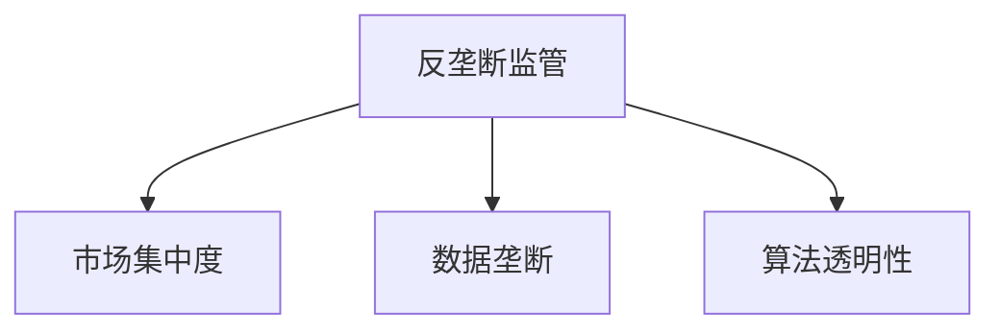

                 

# 大模型企业的反垄断合规

## 1. 背景介绍

### 1.1 问题由来
近年来，大模型企业在技术市场迅猛发展，人工智能技术逐渐应用于各个领域。但同时，企业间的竞争关系也愈加激烈，特别是在大模型、AI芯片等关键技术上。为了维护市场竞争的公平性，各国政府开始出台相关法律法规，对大模型企业进行反垄断监管。例如，美国司法部和联邦贸易委员会（FTC）已经对Google和Facebook等互联网巨头提出了反垄断调查。这些调查的目标是防止大企业滥用其市场优势，限制竞争对手的成长。

### 1.2 问题核心关键点
大模型企业的反垄断合规涉及以下几个核心问题：

1. **市场集中度**：是否存在一家或几家企业占据市场主导地位，从而限制了市场竞争。
2. **数据垄断**：是否存在企业通过垄断数据来提升自身模型的性能，从而形成数据垄断。
3. **知识产权问题**：企业在开发、使用大模型时是否侵犯了他人知识产权，是否存在技术转移滥用问题。
4. **算法透明性**：大模型的内部算法是否透明，企业是否遵守了相关法律法规，确保了模型的公平性和可解释性。

这些问题直接关系到企业的市场地位、竞争环境以及公众利益，需要得到妥善解决。

## 2. 核心概念与联系

### 2.1 核心概念概述

为更好地理解大模型企业的反垄断合规，本节将介绍几个密切相关的核心概念：

- **反垄断监管**：指政府通过法律法规对企业市场行为进行限制，防止企业滥用市场优势，限制竞争，以维护市场公平竞争。
- **市场集中度**：指市场中一家或几家企业所占的市场份额，是衡量市场竞争程度的重要指标。
- **数据垄断**：指企业通过垄断数据资源，获取竞争优势，限制其他企业获取数据，从而形成数据垄断。
- **算法透明性**：指企业开发的大模型算法是否公开透明，是否符合法律法规要求。

这些核心概念之间的逻辑关系可以通过以下Mermaid流程图来展示：

这个流程图展示了大模型企业反垄断合规的核心概念及其之间的关系：

1. 反垄断监管是政府对企业行为进行限制和约束的关键工具。
2. 市场集中度是衡量企业是否占据市场主导地位的指标。
3. 数据垄断指企业通过垄断数据资源获得竞争优势。
4. 算法透明性涉及企业开发的大模型算法是否公开透明。

这些概念共同构成了大模型企业反垄断合规的基础框架，是其合规行为的理论依据。

## 3. 核心算法原理 & 具体操作步骤
### 3.1 算法原理概述

大模型企业的反垄断合规主要涉及以下几个关键算法原理：

- **市场集中度计算算法**：计算市场上企业占据的市场份额，通常采用CR4或CR8等指标。
- **数据垄断检测算法**：检测企业是否通过垄断数据资源获取竞争优势。
- **算法透明性评估算法**：评估企业大模型的算法是否公开透明，是否符合法律法规要求。

### 3.2 算法步骤详解

#### 3.2.1 市场集中度计算

1. **数据收集**：收集市场相关数据，如企业销售额、市场份额等。
2. **数据处理**：对收集到的数据进行清洗和处理，如去除异常值，标准化数据等。
3. **集中度计算**：采用CR4或CR8等指标，计算市场集中度。
4. **结果分析**：分析市场集中度的变化趋势，判断是否存在市场集中度过高的现象。

#### 3.2.2 数据垄断检测

1. **数据收集**：收集企业在数据获取、使用方面的信息，如数据来源、数据使用方式等。
2. **数据分析**：分析企业是否存在通过垄断数据获取竞争优势的行为。
3. **检测方法**：采用数据流量分析、数据共享情况等方法进行数据垄断检测。
4. **结果分析**：判断企业是否存在数据垄断行为，并提出改进建议。

#### 3.2.3 算法透明性评估

1. **算法公开**：企业应公开其大模型的算法源码、算法流程等，确保算法透明。
2. **算法审查**：相关监管部门应对企业的算法进行审查，确保算法符合法律法规要求。
3. **算法使用**：企业在使用大模型时，应确保算法公平、公正，不歧视、不滥用。
4. **结果分析**：评估算法透明性，提出改进建议。

### 3.3 算法优缺点

大模型企业的反垄断合规涉及的算法具有以下优缺点：

**优点**：
1. **客观性**：通过计算和检测可以客观地评估企业的市场集中度和数据垄断情况。
2. **可操作性**：算法步骤明确，易于实现和执行。
3. **公正性**：通过透明的评估和审查，确保合规行为的公正性。

**缺点**：
1. **数据依赖**：算法的准确性依赖于数据的质量和完整性，数据收集和处理难度较大。
2. **算法复杂性**：部分算法如数据垄断检测较为复杂，需要综合多种方法进行评估。
3. **法律适用性**：算法的评估结果需要与法律条文结合，法律法规的适用性需进一步完善。

### 3.4 算法应用领域

大模型企业的反垄断合规涉及的算法在以下几个领域有广泛应用：

- **监管部门**：政府、司法部门等，用于市场集中度计算、数据垄断检测等。
- **企业内部**：企业内部审计、合规部门，用于算法透明性评估、数据合规审查等。
- **第三方机构**：审计事务所、律师事务所等，用于独立评估企业的合规情况。

这些算法在反垄断合规中具有重要地位，能够帮助企业和监管部门实现公平竞争、公正监管，确保市场环境的健康发展。

## 4. 数学模型和公式 & 详细讲解  
### 4.1 数学模型构建

大模型企业的反垄断合规涉及的数学模型主要包括以下几个方面：

- **市场集中度模型**：采用CR4或CR8等指标，计算市场集中度。
- **数据垄断检测模型**：采用数据流量分析、数据共享情况等方法进行数据垄断检测。
- **算法透明性评估模型**：采用算法公开、算法审查等方法进行算法透明性评估。

### 4.2 公式推导过程

#### 4.2.1 市场集中度计算公式

市场集中度通常采用CR4或CR8等指标计算，公式如下：

$$
CR4 = \sum_{i=1}^4 \frac{x_i^4}{\sum_{i=1}^4 x_i^4}
$$

$$
CR8 = \sum_{i=1}^8 \frac{x_i^8}{\sum_{i=1}^8 x_i^8}
$$

其中，$x_i$表示第i家企业的市场份额。

#### 4.2.2 数据垄断检测公式

数据垄断检测需要综合多种方法进行评估，包括数据流量分析、数据共享情况等，具体公式如下：

$$
D_M = \sum_{i=1}^n \frac{D_i}{\sum_{i=1}^n D_i}
$$

其中，$D_i$表示企业i获取数据的能力。

### 4.3 案例分析与讲解

假设某市场上有三家企业A、B、C，其市场份额分别为30%、20%、50%。

1. **市场集中度计算**：采用CR4指标，计算市场集中度如下：

$$
CR4 = \frac{30^4}{30^4 + 20^4 + 50^4} + \frac{20^4}{30^4 + 20^4 + 50^4} + \frac{50^4}{30^4 + 20^4 + 50^4} = 0.80
$$

2. **数据垄断检测**：假设企业C通过垄断数据获取了竞争优势，其获取数据的能力为70%，其他企业为30%。

$$
D_M = \frac{70}{70 + 30 + 30} = 0.70
$$

3. **算法透明性评估**：假设企业A公开其大模型的算法源码和流程，企业B和C未公开。

综上所述，企业C在数据垄断检测中存在问题，需进一步审查。

## 5. 项目实践：代码实例和详细解释说明
### 5.1 开发环境搭建

在进行反垄断合规实践前，我们需要准备好开发环境。以下是使用Python进行Pandas、NumPy等工具开发的环

