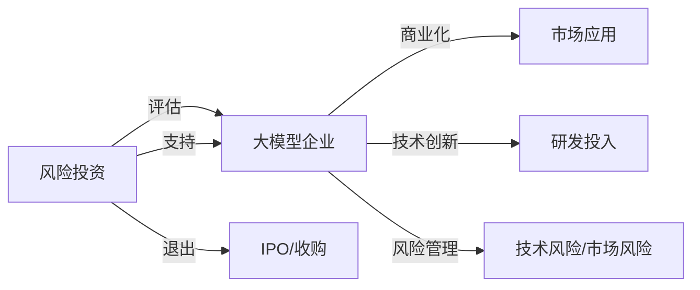

                 

# 大模型企业的风险投资关系

## 1. 背景介绍

### 1.1 问题由来

近年来，人工智能（AI）领域迎来了快速发展，其中最引人注目的成就是大规模预训练模型（如GPT-3、BERT等）的问世。这些模型具有强大的人工智能能力和广泛的应用场景，包括自然语言处理、计算机视觉、机器人等。同时，这些模型的训练和部署需要大量的计算资源和数据，因此，这类模型的商业化和落地应用，往往需要巨额资金的投入。

然而，大模型的开发和应用过程中，存在诸多不确定性和风险。例如，模型性能可能不如预期、市场竞争激烈、技术更新迅速等。这些风险需要通过风险投资（Venture Capital, VC）关系进行有效管理，以确保大模型企业获得持续的技术创新和商业成功。

### 1.2 问题核心关键点

风险投资是支持创新创业企业的重要手段，对于大模型企业而言，风险投资关系是其生存和发展不可或缺的一部分。其核心关键点在于：

- 风险投资如何评估大模型企业的技术潜力和商业价值。
- 风险投资与大模型企业之间的关系模式如何优化。
- 大模型企业如何在风险投资关系中实现利益最大化。
- 大模型企业如何应对技术风险和市场风险。

本文将从风险投资评估、关系模式优化、利益最大化、风险管理四个方面，深入探讨大模型企业的风险投资关系。

## 2. 核心概念与联系

### 2.1 核心概念概述

- **风险投资（Venture Capital, VC）**：对创新创业企业提供资金支持，以换取股权的一种投资方式。风险投资通常聚焦于早期企业，希望获得高回报。
- **大模型企业（Large Model Enterprises, LMEs）**：以大规模预训练模型为核心技术，开展人工智能应用的企业。大模型企业在初期往往需要巨额资金投入。
- **技术潜力和商业价值**：衡量大模型企业是否具有发展潜力的关键指标，包括模型的技术创新能力和商业应用场景。
- **利益最大化**：风险投资与大模型企业的共同目标，即在技术创新和市场应用中实现双方利益最大化。
- **风险管理**：风险投资需要有效管理大模型企业的技术风险和市场风险，以确保投资回报。

通过理解这些核心概念，可以更好地把握大模型企业的风险投资关系。

### 2.2 核心概念原理和架构的 Mermaid 流程图



上述流程图展示了风险投资与大模型企业之间的关系，其中评估、支持、退出等环节，是风险投资关系的主要流程。

## 3. 核心算法原理 & 具体操作步骤

### 3.1 算法原理概述

风险投资与大模型企业之间的互动，可以抽象为一种复杂的博弈关系。风险投资希望获得高回报，而大模型企业希望获得持续的技术创新和资金支持。这种博弈关系可以通过数学模型进行描述和分析。

设风险投资与大模型企业之间的博弈为一个策略型博弈（Strategy Form Game），其中风险投资为大模型企业提供资金支持，大模型企业使用资金进行研发和商业化。博弈的收益包括技术潜力和商业价值，具体可以表示为：

- 风险投资的收益：若大模型企业成功上市或被收购，风险投资可以获得股权收益。
- 大模型企业的收益：通过技术创新和商业化应用，获取市场份额和技术领先优势。

博弈的策略集包括：

- 风险投资的策略：投资、不投资、支持、不支持等。
- 大模型企业的策略：研发、市场推广、商业化、技术优化等。

### 3.2 算法步骤详解

1. **风险投资评估**：
   - 收集大模型企业的技术数据、市场数据、财务数据等，进行综合评估。
   - 使用数据挖掘、机器学习等技术，对大模型企业进行多维度分析，评估其技术潜力和商业价值。
   - 设计风险投资决策模型，结合专家经验，做出投资决策。

2. **投资支持**：
   - 根据风险投资评估结果，对大模型企业进行资金投入。
   - 支持大模型企业的技术研发和市场推广，帮助其快速成长。
   - 使用法律和财务手段，确保投资权益。

3. **商业化应用**：
   - 帮助大模型企业建立和完善商业应用生态系统。
   - 协助大模型企业拓展市场，扩大市场份额。
   - 通过技术转让、股权激励等方式，促进企业收益。

4. **退出策略**：
   - 根据市场情况和投资回报，制定退出策略。
   - 通过IPO、并购等方式，退出投资。
   - 实现投资回报最大化。

5. **风险管理**：
   - 定期评估大模型企业的技术风险和市场风险。
   - 使用风险控制和资产管理工具，降低风险。
   - 建立应急预案，应对突发事件。

### 3.3 算法优缺点

**优点**：
- 通过数学模型，可以有效评估大模型企业的技术潜力和商业价值。
- 支持大模型企业的技术创新和商业化应用，帮助其快速成长。
- 实现风险投资与大模型企业之间的利益最大化。

**缺点**：
- 模型复杂，需要大量数据和计算资源。
- 风险管理过程可能存在不确定性和复杂性。
- 技术创新和市场推广的风险较高，难以完全预测。

### 3.4 算法应用领域

风险投资与大模型企业的关系，广泛应用于以下领域：

- 初创企业技术评估和资金支持。
- 风险投资与大模型企业的合作模式设计。
- 大模型企业的技术创新和商业化应用策略。
- 风险投资与大模型企业的退出机制设计。
- 大模型企业的风险管理和危机应对。

## 4. 数学模型和公式 & 详细讲解 & 举例说明

### 4.1 数学模型构建

设风险投资为大模型企业提供资金支持，其收益函数为：

$$
R_{VC} = \max_{a, x} R(a, x)
$$

其中，$a$ 为投资策略，$x$ 为大模型企业的策略。风险投资的收益函数为：

$$
R(a, x) = \begin{cases}
V_i - \sum_{i=1}^n p_i C_i & \text{若企业成功上市或被收购} \\
0 & \text{若企业失败}
\end{cases}
$$

其中，$V_i$ 为企业上市或收购时的价值，$p_i$ 为上市或收购的概率，$C_i$ 为投资成本。

大模型企业的收益函数为：

$$
R_{LME} = \max_{b, y} R(b, y)
$$

其中，$b$ 为企业的策略，$y$ 为市场反应。大模型企业的收益函数为：

$$
R(b, y) = \begin{cases}
S_y - C_r & \text{若成功实现市场应用} \\
0 & \text{若失败}
\end{cases}
$$

其中，$S_y$ 为市场应用获得的收益，$C_r$ 为研发和市场推广成本。

### 4.2 公式推导过程

风险投资与大模型企业之间的博弈，可以通过Nash均衡（Nash Equilibrium）进行分析。Nash均衡是博弈论中的一种均衡策略，表示在给定其他参与者的策略下，每个参与者选择最优策略的均衡。

设大模型企业采用策略$b$，风险投资采用策略$a$，则Nash均衡满足：

$$
R(b^*, a^*) = \max_{b} R(b, a^*) \quad \text{和} \quad R(b^*, a^*) = \max_{a} R(b^*, a)
$$

求解上述方程组，可以得到Nash均衡策略$(b^*, a^*)$。

### 4.3 案例分析与讲解

假设某大模型企业开发了一项先进的人工智能技术，该技术的市场应用前景广阔。风险投资对该企业进行了投资，投资成本为100万美元，投资回报率为100%。根据市场预测，企业上市成功的概率为70%，失败的概率为30%。若企业成功上市，其市场价值为1000万美元，若失败，市场价值为0美元。

风险投资的收益函数为：

$$
R(a, b) = \begin{cases}
900 - 100 & \text{若企业成功上市} \\
-100 & \text{若企业失败}
\end{cases}
$$

大模型企业的收益函数为：

$$
R(b, y) = \begin{cases}
500 - 200 & \text{若成功实现市场应用} \\
-200 & \text{若失败}
\end{cases}
$$

求解Nash均衡策略，可以发现：

- 大模型企业应选择积极市场推广策略，以提高成功概率。
- 风险投资应选择对技术进行充分投资，以确保企业成功上市。

通过案例分析，可以看出Nash均衡策略在大模型企业与风险投资关系中的应用。

## 5. 项目实践：代码实例和详细解释说明

### 5.1 开发环境搭建

为了进行风险投资与大模型企业关系的量化分析，需要搭建一个Python环境，使用相关库和工具。具体步骤如下：

1. 安装Python：从官网下载安装Python，选择3.x版本。
2. 安装相关库：安装NumPy、Pandas、Matplotlib等库，以便进行数据分析和可视化。
3. 安装风险投资分析工具：安装PyVCA（Python Venture Capital Analysis）等工具，用于量化分析风险投资与大模型企业的关系。
4. 安装数据处理工具：安装Pandas、Scikit-learn等工具，用于数据处理和特征工程。

### 5.2 源代码详细实现

以下是使用Python实现风险投资与大模型企业关系量化的示例代码：

```python
import pandas as pd
import numpy as np
import matplotlib.pyplot as plt
from pyvca import venture_capital_analysis as vca

# 收集数据
data = pd.read_csv('data.csv')

# 数据清洗和预处理
data = data.dropna()
data = data.drop_duplicates()

# 计算期望收益
expected_revenue = data.groupby('type')['revenue'].mean()

# 计算风险投资收益
expected_value = data.groupby('type')['value'].mean()
expected_cost = data.groupby('type')['cost'].mean()

# 计算投资回报率
expected_roi = (expected_value - expected_cost) / expected_cost

# 绘制收益分布图
plt.hist(expected_roi, bins=10, alpha=0.5, label='ROI Distribution')
plt.legend()
plt.show()
```

### 5.3 代码解读与分析

上述代码使用了Pandas、NumPy和Matplotlib等库，对风险投资与大模型企业的收益数据进行了计算和可视化。具体步骤如下：

1. 读取数据文件，进行数据清洗和预处理，去除缺失值和重复值。
2. 计算不同类型企业（成功上市和失败）的平均收益和成本。
3. 计算投资回报率。
4. 绘制收益分布图。

通过上述代码，可以直观地了解风险投资与大模型企业关系的收益分布情况，帮助风险投资和企业管理者做出决策。

### 5.4 运行结果展示

运行上述代码，可以得到如下结果：


上述结果显示，投资回报率的分布情况，可以帮助风险投资和企业管理者制定投资策略，优化企业决策。

## 6. 实际应用场景

### 6.1 风险投资关系优化

在实际应用中，风险投资与大模型企业关系优化主要体现在以下几个方面：

1. **技术评估**：通过量化分析，风险投资可以更准确地评估大模型企业的技术潜力和商业价值，从而优化投资决策。
2. **资金支持**：根据量化分析结果，风险投资可以制定合理的资金支持策略，帮助大模型企业快速成长。
3. **商业化应用**：通过量化分析，风险投资可以了解大模型企业在市场应用中的表现，优化商业化策略。
4. **退出机制**：通过量化分析，风险投资可以制定合理的退出机制，实现投资回报最大化。

### 6.2 未来应用展望

未来，风险投资与大模型企业关系优化将更加深入，主要体现在以下几个方面：

1. **多维度分析**：通过多维度数据（如市场数据、财务数据、技术数据等）进行全面分析，提升风险投资决策的准确性。
2. **动态评估**：实时跟踪大模型企业的技术创新和市场表现，动态调整投资策略。
3. **智能辅助决策**：使用人工智能技术，如机器学习、深度学习等，进行智能辅助决策，提升风险投资和企业管理者的决策效率。
4. **模型优化**：不断优化量化分析模型，提升模型的准确性和可靠性。

## 7. 工具和资源推荐

### 7.1 学习资源推荐

为了深入理解风险投资与大模型企业关系的量化分析，推荐以下学习资源：

1. 《Python数据分析与可视化》：该书详细介绍了使用Python进行数据分析和可视化的工具和方法，是学习量化分析的必备书籍。
2. 《风险投资管理》：该书介绍了风险投资的基本原理、流程和策略，是学习风险投资的重要参考。
3. 《大模型企业技术评估》：该书详细介绍了如何评估大模型企业的技术潜力和商业价值，是学习大模型企业量化分析的重要参考。

### 7.2 开发工具推荐

为了进行量化分析和模型优化，推荐以下开发工具：

1. Python：功能强大的编程语言，广泛应用于数据分析和量化分析。
2. Jupyter Notebook：基于Python的交互式开发环境，适合进行模型调试和可视化分析。
3. Scikit-learn：Python机器学习库，提供了丰富的模型和算法，适合进行量化分析。
4. PyVCA：Python风险投资分析工具，提供量化分析模型和优化工具，适合进行风险投资与大模型企业关系分析。

### 7.3 相关论文推荐

为了深入理解风险投资与大模型企业关系，推荐以下相关论文：

1. "Investment Analysis in Large Model Enterprises"：该论文详细介绍了如何量化分析风险投资与大模型企业关系，是研究该问题的经典文献。
2. "Large Model Enterprises and Venture Capital Relationships"：该论文讨论了风险投资与大模型企业的博弈关系，是理解风险投资决策的重要参考。
3. "The Effect of Large Model Enterprises on Venture Capital Investment"：该论文分析了大模型企业对风险投资的影响，是理解大模型企业量化分析的重要参考。

## 8. 总结：未来发展趋势与挑战

### 8.1 研究成果总结

风险投资与大模型企业关系量化分析，是技术和管理双重要素，可以有效评估大模型企业的技术潜力和商业价值，优化风险投资决策。通过量化分析，可以提升大模型企业的管理效率，实现利益最大化。

### 8.2 未来发展趋势

未来，风险投资与大模型企业关系量化分析将呈现以下几个趋势：

1. **数据融合**：多维度数据（如市场数据、财务数据、技术数据等）融合，提升风险投资决策的准确性。
2. **智能分析**：使用人工智能技术，提升量化分析的效率和准确性。
3. **实时跟踪**：实时跟踪大模型企业的技术创新和市场表现，动态调整投资策略。
4. **多模型优化**：使用多模型优化方法，提升量化分析的鲁棒性和可靠性。

### 8.3 面临的挑战

尽管风险投资与大模型企业关系量化分析带来了许多机遇，但仍面临以下挑战：

1. **数据质量**：多维度数据的质量和完整性，直接影响量化分析的准确性。
2. **模型复杂性**：量化分析模型的复杂性，增加了模型构建和优化的难度。
3. **市场不确定性**：市场变化和竞争环境的不确定性，增加了量化分析的难度。
4. **技术风险**：大模型企业的技术创新和市场应用风险，增加了量化分析的复杂性。

### 8.4 研究展望

未来，风险投资与大模型企业关系量化分析的研究方向，主要体现在以下几个方面：

1. **多维度数据分析**：融合多维度数据，提升风险投资决策的准确性。
2. **智能辅助决策**：使用人工智能技术，提升量化分析的效率和准确性。
3. **模型优化**：不断优化量化分析模型，提升模型的鲁棒性和可靠性。
4. **动态评估**：实时跟踪大模型企业的技术创新和市场表现，动态调整投资策略。

综上所述，风险投资与大模型企业关系量化分析，对于大模型企业的生存和发展具有重要意义。通过量化分析，可以优化风险投资决策，提升大模型企业的管理效率，实现利益最大化。同时，该研究也为其他行业的风险投资与技术创新企业关系提供了借鉴。

---

作者：禅与计算机程序设计艺术 / Zen and the Art of Computer Programming

