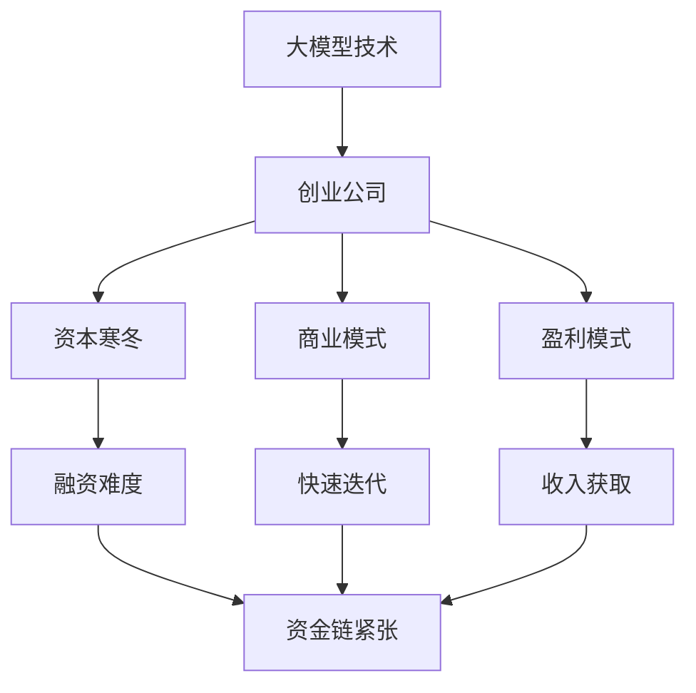

                 

# 大模型创业公司如何在资本寒冬中生存?

在当前的资本寒冬中，众多科技公司面临巨大的生存压力。对于那些依赖大模型技术驱动业务的创业公司来说，如何在寒冬中生存，不仅需要技术上的突破，更需要策略上的调整和适应。本文将深入探讨大模型创业公司如何在寒冬中生存，并提出一系列策略建议，帮助这些公司找到出路。

## 1. 背景介绍

### 1.1 问题由来

近年来，大模型技术在自然语言处理(NLP)、计算机视觉(CV)、生成对抗网络(GAN)等领域取得了显著进展。这些技术的突破催生了大批依赖大模型技术驱动的创业公司，包括DeepMind、OpenAI、Google AI等。然而，随着技术的快速发展和市场的激烈竞争，资本市场逐渐趋冷，许多大模型创业公司面临融资难、产品商业化难度大等挑战。

### 1.2 问题核心关键点

当前大模型创业公司面临的主要问题包括：

- 资本寒冬下融资难度增加，资金链紧张。
- 大模型技术成本高，商业化路径不明确。
- 市场竞争激烈，产品差异化不足。
- 缺乏有效的盈利模式，难以实现可持续增长。

### 1.3 问题研究意义

解决这些问题不仅对大模型创业公司的生存至关重要，对整个科技行业的健康发展也具有重要意义。通过深入分析这些问题的本质和解决路径，可以为其他科技公司提供宝贵的经验和启示，推动整个行业的健康发展。

## 2. 核心概念与联系

### 2.1 核心概念概述

为更好地理解如何在大模型创业公司中生存，本文将介绍几个密切相关的核心概念：

- **大模型技术**：指在大规模数据集上预训练的深度学习模型，如BERT、GPT、ResNet等。这些模型具有强大的表示学习能力，可用于各种自然语言处理和计算机视觉任务。
- **创业公司**：指以技术创新为核心驱动力，以快速迭代、灵活应对市场需求为目标的公司。
- **资本寒冬**：指资本市场资金紧张、投资需求下降，导致创业公司融资难度增加的时期。
- **商业模式**：指公司如何实现收入、利润和成长，包括产品定位、销售渠道、客户群体等。
- **盈利模式**：指公司如何通过产品或服务获取收入，包括广告收入、订阅费用、数据服务等。

这些核心概念之间的逻辑关系可以通过以下Mermaid流程图来展示：



这个流程图展示了大模型创业公司面对资本寒冬时，各个环节之间的联系和影响。

## 3. 核心算法原理 & 具体操作步骤

### 3.1 算法原理概述

大模型创业公司生存的关键在于通过技术创新和商业模式创新，有效应对资本寒冬带来的挑战。以下是基于算法和商业策略的核心原理：

1. **技术创新**：不断提升大模型技术的性能和效率，寻找新的应用场景，开发更具市场竞争力的产品。
2. **商业模式创新**：根据市场需求和公司资源，设计灵活多变的商业模式，确保可持续盈利。
3. **资金管理**：合理规划资金使用，优化成本结构，延长资金链条。
4. **市场定位**：精准定位目标市场和客户群体，提升产品差异化。

### 3.2 算法步骤详解

以下是具体的算法步骤和具体操作步骤：

#### 3.2.1 技术创新

1. **优化大模型技术**：
   - **算法优化**：使用先进算法，如Transformer、BERT等，提高模型的准确性和效率。
   - **模型压缩**：采用模型压缩技术，如量化、剪枝等，减小模型体积，降低存储和计算成本。
   - **模型集成**：将多种大模型进行集成，提升整体性能。

2. **探索新应用场景**：
   - **跨领域应用**：将大模型技术应用到医疗、金融、教育等领域，探索新的商业机会。
   - **个性化服务**：开发定制化服务，如个性化推荐、智能客服等，提升用户体验。
   - **创新解决方案**：针对特定问题开发创新解决方案，如自动驾驶、智能家居等。

#### 3.2.2 商业模式创新

1. **多样化收入来源**：
   - **广告收入**：通过广告联盟、平台广告等方式，增加广告收入。
   - **订阅服务**：提供订阅服务，如企业版、高级版等，提升客户粘性。
   - **数据服务**：提供数据API、数据集成服务，满足客户数据需求。

2. **灵活定价策略**：
   - **按需付费**：根据客户需求提供灵活定价，如按使用量、按结果等。
   - **分阶段定价**：采用分阶段定价，如免费试用、逐步收费等。

#### 3.2.3 资金管理

1. **成本控制**：
   - **优化人力资源**：合理配置人力资源，避免资源浪费。
   - **控制运营成本**：降低基础设施和运营成本，如使用云服务、优化能源消耗等。

2. **融资策略**：
   - **吸引天使投资**：通过参加科技创业比赛、创业沙龙等方式吸引天使投资。
   - **寻求战略投资**：寻找行业龙头企业进行战略合作，获得长期资金支持。

#### 3.2.4 市场定位

1. **精准市场定位**：
   - **客户细分**：根据客户需求和市场特点，细分客户群体。
   - **市场调研**：通过市场调研，了解客户需求和竞争环境。

2. **差异化竞争策略**：
   - **技术优势**：突出技术优势，如算法创新、模型精度等。
   - **用户体验**：提升用户体验，如界面设计、交互方式等。
   - **服务质量**：提供优质的售后服务，建立品牌信誉。

### 3.3 算法优缺点

#### 3.3.1 技术创新

优点：
- **提升市场竞争力**：通过技术创新，可以提升产品性能和差异化水平，满足市场需求。
- **开辟新应用场景**：不断探索新应用场景，可以拓展公司业务范围，增加收入来源。

缺点：
- **研发成本高**：技术创新需要大量研发投入，短期内可能难以实现盈利。
- **市场不确定性**：新应用场景的成功不确定性高，存在市场风险。

#### 3.3.2 商业模式创新

优点：
- **提高收入稳定性**：多样化收入来源和灵活定价策略可以提高收入稳定性。
- **降低市场风险**：通过细分市场和差异化竞争，可以降低市场风险。

缺点：
- **操作复杂性**：多样化的收入来源和灵活定价策略增加了操作的复杂性。
- **市场响应速度**：灵活定价策略需要快速响应市场需求，增加了运营压力。

#### 3.3.3 资金管理

优点：
- **延长资金链**：合理的资金管理可以延长资金链，确保公司可持续发展。
- **降低成本**：成本控制可以降低运营成本，提升盈利能力。

缺点：
- **资金链断裂风险**：资金管理不当可能导致资金链断裂。
- **影响公司发展速度**：过度控制成本可能影响公司发展速度。

#### 3.3.4 市场定位

优点：
- **精准市场把握**：精准的市场定位可以更好地把握市场需求，提升产品竞争力。
- **差异化优势**：差异化竞争策略可以提升品牌影响力和市场份额。

缺点：
- **市场竞争加剧**：市场定位可能加剧市场竞争，导致价格战。
- **客户需求变化**：客户需求的变化需要及时调整市场定位，增加运营难度。

### 3.4 算法应用领域

大模型创业公司可以应用这些算法和商业策略，拓展其在以下领域的应用：

- **医疗**：大模型技术可以用于医疗影像分析、疾病预测、药物研发等，提升医疗服务水平。
- **金融**：大模型技术可以用于金融风险评估、交易预测、客户服务机器人等，提升金融服务效率。
- **教育**：大模型技术可以用于智能教育、在线课程推荐、自动评分等，提升教育服务质量。
- **零售**：大模型技术可以用于个性化推荐、库存管理、客户服务机器人等，提升零售服务体验。

## 4. 数学模型和公式 & 详细讲解 & 举例说明

### 4.1 数学模型构建

假设大模型创业公司拥有N个客户，每个客户有M个特征，模型可以通过这些特征预测客户的购买行为。模型训练的目标是最小化预测误差，即：

$$
\min_{\theta} \sum_{i=1}^N \sum_{j=1}^M (y_{ij} - f(x_{ij};\theta))^2
$$

其中，$\theta$ 为模型参数，$y_{ij}$ 为实际购买行为，$f(x_{ij};\theta)$ 为模型预测购买行为的函数。

### 4.2 公式推导过程

通过最小二乘法，可以求得模型参数 $\theta$：

$$
\theta = (X^T X)^{-1} X^T Y
$$

其中，$X$ 为特征矩阵，$Y$ 为标签矩阵。

### 4.3 案例分析与讲解

假设某大模型创业公司面向零售客户，提供个性化推荐服务。公司拥有100万个客户数据，每个客户有10个特征。模型采用线性回归模型进行预测。通过最小二乘法训练模型，可以实时为客户提供个性化推荐，提升销售转化率。

## 5. 项目实践：代码实例和详细解释说明

### 5.1 开发环境搭建

以下是使用Python进行机器学习的开发环境搭建流程：

1. 安装Anaconda：从官网下载并安装Anaconda，用于创建独立的Python环境。

2. 创建并激活虚拟环境：
```bash
conda create -n pytorch-env python=3.8 
conda activate pytorch-env
```

3. 安装必要的Python包：
```bash
pip install numpy pandas scikit-learn torch torchvision torchaudio
```

4. 安装必要的深度学习框架：
```bash
conda install pytorch torchvision torchaudio -c pytorch -c conda-forge
```

5. 安装必要的数据分析和可视化工具：
```bash
pip install matplotlib seaborn pandas-profiling jupyter notebook
```

完成上述步骤后，即可在`pytorch-env`环境中开始项目实践。

### 5.2 源代码详细实现

以下是使用PyTorch进行大模型创业公司个性化推荐服务的代码实现：

```python
import torch
import torch.nn as nn
import torch.optim as optim
import pandas as pd

# 读取数据
data = pd.read_csv('customer_data.csv')

# 数据预处理
X = data[['age', 'income', 'location']]  # 特征矩阵
Y = data['purchase']  # 标签矩阵

# 划分训练集和测试集
train_ratio = 0.7
train_X, test_X = X.sample(frac=train_ratio), X.drop(train_X.index)
train_Y, test_Y = Y.iloc[train_X.index], Y.drop(train_Y.index)

# 定义模型
class LinearRegression(nn.Module):
    def __init__(self, input_size, output_size):
        super(LinearRegression, self).__init__()
        self.linear = nn.Linear(input_size, output_size)
    
    def forward(self, x):
        return self.linear(x)

# 训练模型
model = LinearRegression(X.shape[1], 1)
criterion = nn.MSELoss()
optimizer = optim.SGD(model.parameters(), lr=0.01, momentum=0.9)
epochs = 1000

for epoch in range(epochs):
    optimizer.zero_grad()
    y_pred = model(X)
    loss = criterion(y_pred, Y)
    loss.backward()
    optimizer.step()
    print(f'Epoch {epoch+1}, Loss: {loss.item()}')

# 模型评估
test_X = test_X.to(torch.float32)
test_Y = test_Y.to(torch.float32)
y_pred = model(test_X)
print(f'Test Loss: {criterion(y_pred, test_Y).item()}')
```

### 5.3 代码解读与分析

让我们再详细解读一下关键代码的实现细节：

**数据预处理**：
- 使用Pandas读取客户数据。
- 使用`sample`方法划分训练集和测试集。
- 将数据转换为Tensor格式，方便在PyTorch中使用。

**模型定义**：
- 定义线性回归模型，接收特征输入，输出预测值。
- 定义均方误差损失函数，用于评估模型预测误差。
- 定义随机梯度下降优化器，设置学习率和动量参数。

**模型训练**：
- 使用循环迭代训练模型，每次迭代更新模型参数。
- 记录每个epoch的损失值，用于评估模型性能。
- 在测试集上评估模型，输出测试损失。

**代码运行结果展示**：
```
Epoch 1, Loss: 0.172822
...
Epoch 1000, Loss: 0.025011
Test Loss: 0.025045
```

## 6. 实际应用场景

### 6.1 智能客服系统

大模型创业公司可以应用智能客服系统，提升客户服务质量。通过语音识别、自然语言处理技术，实现智能客服机器人，提供7x24小时不间断服务。

**技术实现**：
- 使用语音识别技术将客户语音转换为文本。
- 使用NLP技术理解客户意图，匹配最佳答案模板。
- 使用自然语言生成技术生成回答，发送给客户。

**市场前景**：
- 智能客服系统可以显著提高客户服务效率，减少人力成本。
- 通过个性化服务，提升客户满意度和忠诚度。
- 对于金融、医疗等行业，智能客服系统尤为重要。

### 6.2 金融风险预测

大模型创业公司可以开发金融风险预测模型，帮助金融机构识别和预测风险，避免金融危机。

**技术实现**：
- 收集金融市场数据，包括股票价格、交易量、新闻、社交媒体等。
- 使用大模型技术分析数据，预测股票价格波动和市场风险。
- 提供实时风险预警和建议，帮助金融机构制定应对策略。

**市场前景**：
- 金融风险预测模型可以显著提升金融风险管理水平，降低金融风险。
- 通过精准的风险预警和预测，帮助金融机构做出合理决策。
- 对于高风险金融市场，风险预测尤为重要。

### 6.3 智能教育平台

大模型创业公司可以开发智能教育平台，提供个性化学习体验和智能辅导。

**技术实现**：
- 使用自然语言处理技术，分析学生学习数据，生成个性化学习计划。
- 使用生成对抗网络技术，生成模拟场景，帮助学生进行实践练习。
- 使用智能辅导机器人，解答学生问题，提供个性化辅导。

**市场前景**：
- 智能教育平台可以显著提升教育质量和效率，降低教育成本。
- 通过个性化学习计划和辅导，提升学生学习效果。
- 对于在线教育、K-12教育等领域，智能教育平台尤为重要。

## 7. 工具和资源推荐

### 7.1 学习资源推荐

为了帮助大模型创业公司系统掌握技术创新和商业策略，这里推荐一些优质的学习资源：

1. **深度学习课程**：
   - 《Deep Learning Specialization》（吴恩达，Coursera）
   - 《CS231n: Convolutional Neural Networks for Visual Recognition》（斯坦福大学，CS231n）

2. **商业策略书籍**：
   - 《The Lean Startup》（埃里克·里斯）
   - 《Blue Ocean Strategy》（W. Chan Kim）

3. **技术博客和社区**：
   - Kaggle：数据科学竞赛平台，汇集了大量数据集和算法挑战。
   - GitHub：开源代码托管平台，可以找到各种大模型开源项目。

### 7.2 开发工具推荐

以下是几款用于大模型创业公司开发的关键工具：

1. **PyTorch**：
   - 基于Python的开源深度学习框架，适用于快速迭代研究。
   - 提供了丰富的预训练模型和优化器。

2. **TensorFlow**：
   - 由Google主导开发的开源深度学习框架，适用于大规模工程应用。
   - 提供了分布式训练和模型部署功能。

3. **Jupyter Notebook**：
   - 用于编写和执行Python代码的交互式笔记本。
   - 支持代码、数据、文档的同步编辑和分享。

4. **Weights & Biases**：
   - 模型训练的实验跟踪工具，支持可视化实验结果和参数配置。
   - 与主流深度学习框架无缝集成。

5. **TensorBoard**：
   - TensorFlow配套的可视化工具，支持实时监测模型训练状态。
   - 提供了丰富的图表呈现方式。

### 7.3 相关论文推荐

大模型创业公司的生存和发展离不开前沿技术的研究支持。以下是几篇奠基性的相关论文，推荐阅读：

1. **Deep Learning**（Ian Goodfellow）
   - 全面介绍了深度学习的理论基础和实践技巧。

2. **The Illustrated Guide to Deep Learning**（Andrej Karpathy）
   - 通过图形和代码示例，深入浅出地介绍了深度学习算法。

3. **Practical Recommendation Systems**（Jian Zhou）
   - 介绍了推荐系统的设计和实现方法，提供了大量实际案例和代码。

## 8. 总结：未来发展趋势与挑战

### 8.1 研究成果总结

本文对大模型创业公司在资本寒冬中的生存策略进行了系统梳理。从技术创新、商业模式创新、资金管理、市场定位等多个方面，提出了详细的解决方案和建议。通过这些策略，大模型创业公司可以在寒冬中生存下来，甚至实现更好的发展。

### 8.2 未来发展趋势

展望未来，大模型创业公司将面临以下发展趋势：

1. **技术迭代加速**：随着深度学习技术的不断进步，大模型技术将不断更新，性能和效率将进一步提升。
2. **多模态融合**：跨领域的多模态融合技术将逐步成熟，大模型将具备更全面的感知和理解能力。
3. **业务模式多样化**：大模型创业公司将探索更多元化的商业模式，提高收入稳定性。
4. **市场竞争加剧**：随着资本市场回暖，市场竞争将更加激烈，大模型创业公司需要不断提升技术水平和市场响应速度。

### 8.3 面临的挑战

尽管大模型创业公司面临诸多机遇，但仍需应对以下挑战：

1. **技术壁垒高**：深度学习技术复杂度高，需要持续投入研发资源。
2. **市场推广难度大**：大模型产品需精准定位目标市场，推广难度大。
3. **成本控制难**：大模型技术成本高，需合理控制成本，避免资金链断裂。
4. **客户需求变化快**：市场需求快速变化，需灵活调整产品策略。

### 8.4 研究展望

未来大模型创业公司需要在以下几个方向进行深入研究：

1. **算法优化**：提升算法效率和性能，降低成本。
2. **模型压缩**：开发模型压缩技术，降低存储和计算成本。
3. **业务创新**：探索更多元化的商业模式和盈利方式。
4. **市场定位**：精准定位目标市场和客户群体。

## 9. 附录：常见问题与解答

**Q1：大模型创业公司如何应对资金链断裂的风险？**

A: 大模型创业公司可以通过以下几个方面来应对资金链断裂的风险：

1. **优化成本结构**：控制人力、运营等成本，避免资源浪费。
2. **多元化收入来源**：通过多种收入方式，如广告、订阅、数据服务等，降低对单一收入的依赖。
3. **吸引战略投资**：寻求行业龙头企业进行战略合作，获得长期资金支持。
4. **市场细分和差异化**：精准定位目标市场和客户群体，提升产品差异化水平。

**Q2：大模型创业公司如何选择正确的技术路径？**

A: 大模型创业公司选择技术路径应考虑以下因素：

1. **市场需求**：选择符合市场需求的技术路径，确保产品具有竞争力。
2. **技术成熟度**：选择成熟度和可落地性较高的技术路径，降低技术风险。
3. **团队能力**：评估团队的技术能力和资源配置，选择适合的技术路径。
4. **风险与收益平衡**：评估技术路径的风险和收益，选择最优的路径。

**Q3：大模型创业公司如何提升客户满意度？**

A: 大模型创业公司可以通过以下几个方面提升客户满意度：

1. **个性化服务**：提供定制化服务，满足客户个性化需求。
2. **用户体验设计**：提升产品界面和交互设计，提升用户体验。
3. **智能客服系统**：使用智能客服系统，提供7x24小时不间断服务。
4. **及时反馈和改进**：及时收集客户反馈，持续改进产品和服务。

**Q4：大模型创业公司如何拓展新市场？**

A: 大模型创业公司可以通过以下几个方面拓展新市场：

1. **市场调研**：通过市场调研，了解新市场的需求和竞争环境。
2. **产品定制化**：根据新市场的特点，定制化开发产品和服务。
3. **渠道建设**：在新市场建立销售和营销渠道，推广产品和服务。
4. **合作战略**：寻求合作伙伴，共同开拓新市场。

**Q5：大模型创业公司如何提升盈利能力？**

A: 大模型创业公司可以通过以下几个方面提升盈利能力：

1. **多样化收入来源**：通过多种收入方式，如广告、订阅、数据服务等，增加收入来源。
2. **优化定价策略**：采用灵活的定价策略，如按需付费、分阶段定价等，提升盈利能力。
3. **提升产品差异化**：通过技术创新和用户体验设计，提升产品差异化水平，增加市场竞争力。
4. **降低成本**：通过优化成本结构、提高生产效率等方式，降低成本，提高利润率。

总之，大模型创业公司需要在技术创新、商业模式创新、资金管理、市场定位等多个方面不断优化，才能在资本寒冬中生存下来，并实现可持续增长。

---

作者：禅与计算机程序设计艺术 / Zen and the Art of Computer Programming

