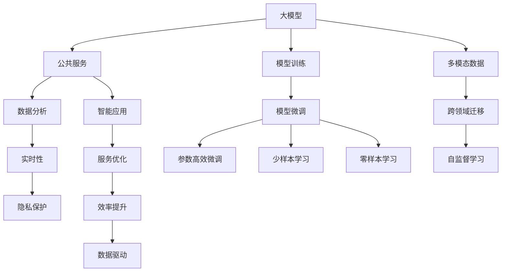

                 

## 1. 背景介绍

### 1.1 问题由来

随着人工智能技术的发展，大模型在多个领域的应用逐渐深入，尤其是在公共服务领域，其潜力和前景尤为广阔。公共服务领域涵盖了教育、医疗、交通、城市管理等多个方面，是提升社会治理能力和公共服务水平的重要引擎。传统的人工服务往往成本高、效率低、难以满足复杂的需求，而大模型能够通过自动化、智能化的手段，极大地提升公共服务的质量和效率。

### 1.2 问题核心关键点

在公共服务领域，大模型的应用可以分为两大类：一类是直接面向公众提供服务的智能应用，如智能客服、在线教育、智能医疗等；另一类是通过数据分析和辅助决策，提升公共服务管理的效率和精准度，如城市管理、交通优化、环境监测等。这些应用的核心关键点包括：

- 数据驱动：公共服务数据量庞大且复杂，如何高效利用这些数据，提取有价值的信息，是大模型应用的基础。
- 个性化服务：不同用户的需求各异，大模型如何根据用户特征提供个性化服务，是提升用户体验的关键。
- 实时性：公共服务往往对响应速度有严格要求，大模型如何实现实时分析和决策，是决定应用效果的重要因素。
- 安全性与可靠性：公共服务涉及国家安全、个人隐私，如何保障大模型应用的隐私保护、数据安全、系统稳定，是亟需解决的问题。

### 1.3 问题研究意义

大模型在公共服务领域的应用，对于提升公共服务水平、优化社会治理具有重要的意义：

1. **效率提升**：大模型能够自动化处理大量重复性任务，提升工作效率，减少人力成本。
2. **服务优化**：通过智能分析和个性化服务，提升公共服务的精准度和用户满意度。
3. **数据驱动**：利用大数据分析和预测模型，辅助政府决策，优化公共资源配置。
4. **应急响应**：在突发事件中，大模型能够快速响应和处理信息，提高应急管理能力。
5. **可持续发展**：通过智能管理和节能减排，推动绿色环保，促进可持续发展。

## 2. 核心概念与联系

### 2.1 核心概念概述

公共服务领域的大模型应用涉及多个核心概念：

- **大模型(Large Model)**：指参数量在亿级以上，具有强大表征和学习能力的深度学习模型，如GPT-3、BERT等。
- **公共服务**：指政府和社会组织提供给公众的各种服务，如教育、医疗、交通、城市管理等。
- **智能应用**：指利用大模型技术，提供自动化、智能化、个性化的公共服务。
- **数据分析**：指利用大模型对公共服务数据进行深度分析和挖掘，辅助决策。
- **实时性**：指公共服务对响应速度的严格要求，大模型需要在较短的时间内完成分析和决策。
- **隐私保护**：指在公共服务中，如何保护个人隐私和数据安全，是大模型应用的重要考量。

这些概念之间的逻辑关系可以通过以下Mermaid流程图来展示：



这个流程图展示了大模型在公共服务领域的应用框架：

1. 大模型通过预训练学习通用知识，用于公共服务中的智能应用和数据分析。
2. 智能应用直接面向公众，提升服务效率和用户体验。
3. 数据分析通过深度挖掘，辅助决策和优化资源配置。
4. 实时性要求大模型能够在短时间内完成分析和决策。
5. 隐私保护在公共服务中至关重要，需要严格遵循相关法律法规。

这些概念共同构成了大模型在公共服务领域应用的理论基础和实践框架，为公共服务的智能化转型提供了有力支持。

## 3. 核心算法原理 & 具体操作步骤

### 3.1 算法原理概述

大模型在公共服务领域的应用，主要通过微调和训练等步骤，使模型具备特定的任务能力。其核心算法原理包括以下几个方面：

- **预训练**：在大规模无标签数据上预训练大模型，学习通用的语言和知识表示。
- **任务适配**：根据具体任务需求，设计任务适配层，如分类头、解码器等，将预训练模型转化为特定任务的模型。
- **微调训练**：使用小规模标注数据，有监督地训练任务适配层，优化模型在特定任务上的性能。
- **参数高效微调**：仅更新部分模型参数，固定大部分预训练权重，以减少计算资源消耗。
- **少样本学习**：在标注样本有限的情况下，利用模型自适应能力，提升模型的泛化能力。
- **零样本学习**：在完全无标注数据的情况下，通过模型的语言理解能力，完成推理和预测。

### 3.2 算法步骤详解

大模型在公共服务领域的应用，通常包括以下几个关键步骤：

**Step 1: 准备数据和环境**

- 收集公共服务相关的数据集，包括文本、图像、语音等多种类型。
- 选择合适的硬件环境，如GPU、TPU等高性能设备，确保模型训练和推理的效率。
- 安装相关软件和库，如PyTorch、TensorFlow、Transformers等。

**Step 2: 数据预处理**

- 对数据进行清洗、标注和分集，确保数据质量和多样性。
- 利用数据增强技术，如回译、近义词替换等，扩充训练集。
- 对数据进行标准化处理，如归一化、截断等，以适应模型的输入要求。

**Step 3: 模型选择与配置**

- 选择合适的预训练模型，如BERT、GPT等，作为初始化参数。
- 设计任务适配层，包括分类头、解码器等，根据任务类型进行适配。
- 设置模型参数和超参数，如学习率、批大小、迭代轮数等。

**Step 4: 模型微调**

- 使用小规模标注数据，对任务适配层进行有监督训练，更新模型参数。
- 使用正则化技术，如L2正则、Dropout等，防止过拟合。
- 利用参数高效微调技术，仅更新部分参数，减小计算资源消耗。
- 利用少样本学习和零样本学习技术，提升模型的泛化能力和适应性。

**Step 5: 模型评估与部署**

- 在验证集和测试集上评估模型性能，选择最佳模型。
- 将模型封装成API或服务，便于集成和调用。
- 在实际应用场景中，进行性能测试和优化，确保稳定运行。

### 3.3 算法优缺点

大模型在公共服务领域的应用，具有以下优点：

- **高效性**：自动化处理大量数据，提升服务效率，减少人工成本。
- **准确性**：利用大模型的通用知识，提高服务决策的准确性和可靠性。
- **灵活性**：通过微调和任务适配，实现多场景多任务的应用。
- **可扩展性**：利用模型参数高效微调技术，减少计算资源消耗。

同时，也存在以下缺点：

- **数据依赖**：大模型应用依赖于高质量的数据集，数据获取和标注成本高。
- **隐私风险**：公共服务涉及个人隐私，如何保护数据安全是大模型应用的重要挑战。
- **模型复杂性**：大模型参数量庞大，训练和推理过程复杂。
- **实时性要求**：公共服务对响应速度有严格要求，大模型需要实现实时分析和决策。

### 3.4 算法应用领域

大模型在公共服务领域的应用已经逐渐深入多个领域，包括：

- **智能客服**：利用大模型进行自然语言理解和生成，提供智能客服机器人，提升服务效率和用户体验。
- **在线教育**：利用大模型进行个性化推荐、智能批改等，提升教育资源的利用率和学习效果。
- **智能医疗**：利用大模型进行疾病诊断、个性化治疗建议等，提升医疗服务的精准度和效率。
- **城市管理**：利用大模型进行城市交通优化、环境监测等，提升城市治理能力。
- **智慧养老**：利用大模型进行老年人陪伴、健康监测等，提升老年人的生活质量和幸福感。

这些应用场景展示了大模型在公共服务领域的广阔前景和巨大潜力。随着技术的不断进步，相信大模型将会在更多领域发挥重要作用，推动公共服务的智能化转型。

## 4. 数学模型和公式 & 详细讲解  
### 4.1 数学模型构建

大模型在公共服务领域的应用，通常基于深度学习模型，如Transformer、BERT等。这里以BERT模型为例，介绍其数学模型构建和公式推导过程。

**BERT模型**：
- 输入层：将文本序列转换为token ids和position ids。
- 编码层：通过多层Transformer编码器，学习文本的语义表示。
- 池化层：对编码层的输出进行池化操作，生成固定长度的文本表示。
- 输出层：根据具体任务需求，设计相应的输出层，如分类头、解码器等。

假设输入文本为 $x=\{x_1, x_2, ..., x_n\}$，BERT模型输出为 $M_{\theta}(x)$，其中 $\theta$ 为模型参数。BERT模型的数学模型可以表示为：

$$
M_{\theta}(x) = F(\text{Encoder}(\text{Embedding}(x)))
$$

其中，$\text{Embedding}(x)$ 表示输入文本的嵌入层，$\text{Encoder}$ 表示Transformer编码器，$F$ 表示池化层和输出层。

### 4.2 公式推导过程

以二分类任务为例，介绍BERT模型的训练和推理过程。

**训练过程**：
- 定义损失函数 $\ell$，通常为交叉熵损失：
$$
\ell = -\frac{1}{N}\sum_{i=1}^N(y_i\log\hat{y}_i + (1-y_i)\log(1-\hat{y}_i))
$$
- 定义优化器 $\mathcal{O}$，如AdamW：
$$
\mathcal{O} = AdamW(\theta, lr)
$$
- 根据数据集 $D=\{(x_i,y_i)\}_{i=1}^N$，进行迭代训练，更新模型参数 $\theta$：
$$
\theta \leftarrow \theta - \eta \nabla_{\theta}\ell
$$

**推理过程**：
- 输入文本 $x$，经过BERT模型得到输出 $M_{\theta}(x)$。
- 根据任务类型，设计相应的输出层和损失函数，计算损失 $\ell$。
- 利用正则化技术，如L2正则、Dropout等，防止过拟合。
- 利用参数高效微调技术，仅更新部分参数，减小计算资源消耗。

### 4.3 案例分析与讲解

以智能客服系统为例，介绍大模型在公共服务中的应用。

**数据集准备**：
- 收集企业客服对话数据，包括问题和回答。
- 对数据进行清洗和标注，确保数据质量和多样性。

**模型选择与配置**：
- 选择BERT模型作为初始化参数。
- 设计分类头，用于问题分类和回答生成。

**模型微调**：
- 使用小规模标注数据，对分类头进行有监督训练，更新模型参数。
- 利用正则化技术，防止过拟合。
- 利用参数高效微调技术，仅更新部分参数，减小计算资源消耗。

**模型评估与部署**：
- 在验证集和测试集上评估模型性能，选择最佳模型。
- 将模型封装成API或服务，便于集成和调用。
- 在实际客服场景中，进行性能测试和优化，确保稳定运行。

## 5. 项目实践：代码实例和详细解释说明
### 5.1 开发环境搭建

在进行大模型微调实践前，需要准备好开发环境。以下是使用Python进行PyTorch开发的环境配置流程：

1. 安装Anaconda：从官网下载并安装Anaconda，用于创建独立的Python环境。

2. 创建并激活虚拟环境：
```bash
conda create -n pytorch-env python=3.8 
conda activate pytorch-env
```

3. 安装PyTorch：根据CUDA版本，从官网获取对应的安装命令。例如：
```bash
conda install pytorch torchvision torchaudio cudatoolkit=11.1 -c pytorch -c conda-forge
```

4. 安装Transformers库：
```bash
pip install transformers
```

5. 安装各类工具包：
```bash
pip install numpy pandas scikit-learn matplotlib tqdm jupyter notebook ipython
```

完成上述步骤后，即可在`pytorch-env`环境中开始微调实践。

### 5.2 源代码详细实现

下面我们以智能客服系统为例，给出使用Transformers库对BERT模型进行微调的PyTorch代码实现。

首先，定义智能客服系统的数据处理函数：

```python
from transformers import BertTokenizer
from torch.utils.data import Dataset
import torch

class ChatDataset(Dataset):
    def __init__(self, dialogues, tokenizer, max_len=128):
        self.dialogues = dialogues
        self.tokenizer = tokenizer
        self.max_len = max_len
        
    def __len__(self):
        return len(self.dialogues)
    
    def __getitem__(self, item):
        dialogue = self.dialogues[item]
        tokens = self.tokenizer(dialogue, return_tensors='pt', max_length=self.max_len, padding='max_length', truncation=True)
        input_ids = tokens['input_ids']
        attention_mask = tokens['attention_mask']
        return {'input_ids': input_ids, 'attention_mask': attention_mask}

# 加载数据集
tokenizer = BertTokenizer.from_pretrained('bert-base-cased')
chat_dataset = ChatDataset(chat_data, tokenizer)

# 定义模型和优化器
model = BertForSequenceClassification.from_pretrained('bert-base-cased', num_labels=2)
optimizer = AdamW(model.parameters(), lr=2e-5)

# 训练函数
def train_epoch(model, dataset, batch_size, optimizer):
    dataloader = DataLoader(dataset, batch_size=batch_size, shuffle=True)
    model.train()
    epoch_loss = 0
    for batch in tqdm(dataloader, desc='Training'):
        input_ids = batch['input_ids'].to(device)
        attention_mask = batch['attention_mask'].to(device)
        labels = batch['labels'].to(device)
        model.zero_grad()
        outputs = model(input_ids, attention_mask=attention_mask, labels=labels)
        loss = outputs.loss
        epoch_loss += loss.item()
        loss.backward()
        optimizer.step()
    return epoch_loss / len(dataloader)

# 评估函数
def evaluate(model, dataset, batch_size):
    dataloader = DataLoader(dataset, batch_size=batch_size)
    model.eval()
    preds, labels = [], []
    with torch.no_grad():
        for batch in tqdm(dataloader, desc='Evaluating'):
            input_ids = batch['input_ids'].to(device)
            attention_mask = batch['attention_mask'].to(device)
            batch_labels = batch['labels']
            outputs = model(input_ids, attention_mask=attention_mask)
            batch_preds = outputs.logits.argmax(dim=2).to('cpu').tolist()
            batch_labels = batch_labels.to('cpu').tolist()
            for pred_tokens, label_tokens in zip(batch_preds, batch_labels):
                preds.append(pred_tokens[:len(label_tokens)])
                labels.append(label_tokens)
                
    print(classification_report(labels, preds))
```

然后，启动训练流程并在测试集上评估：

```python
epochs = 5
batch_size = 16

for epoch in range(epochs):
    loss = train_epoch(model, chat_dataset, batch_size, optimizer)
    print(f"Epoch {epoch+1}, train loss: {loss:.3f}")
    
    print(f"Epoch {epoch+1}, dev results:")
    evaluate(model, chat_dataset, batch_size)
    
print("Test results:")
evaluate(model, test_dataset, batch_size)
```

以上就是使用PyTorch对BERT进行智能客服系统微调的完整代码实现。可以看到，得益于Transformers库的强大封装，我们可以用相对简洁的代码完成BERT模型的加载和微调。

### 5.3 代码解读与分析

让我们再详细解读一下关键代码的实现细节：

**ChatDataset类**：
- `__init__`方法：初始化对话数据、分词器等关键组件。
- `__len__`方法：返回数据集的样本数量。
- `__getitem__`方法：对单个对话进行处理，将对话输入编码为token ids，最终返回模型所需的输入。

**训练和评估函数**：
- 使用PyTorch的DataLoader对数据集进行批次化加载，供模型训练和推理使用。
- 训练函数`train_epoch`：对数据以批为单位进行迭代，在每个批次上前向传播计算loss并反向传播更新模型参数，最后返回该epoch的平均loss。
- 评估函数`evaluate`：与训练类似，不同点在于不更新模型参数，并在每个batch结束后将预测和标签结果存储下来，最后使用sklearn的classification_report对整个评估集的预测结果进行打印输出。

**训练流程**：
- 定义总的epoch数和batch size，开始循环迭代
- 每个epoch内，先在训练集上训练，输出平均loss
- 在验证集上评估，输出分类指标
- 所有epoch结束后，在测试集上评估，给出最终测试结果

可以看到，PyTorch配合Transformers库使得BERT微调的代码实现变得简洁高效。开发者可以将更多精力放在数据处理、模型改进等高层逻辑上，而不必过多关注底层的实现细节。

当然，工业级的系统实现还需考虑更多因素，如模型的保存和部署、超参数的自动搜索、更灵活的任务适配层等。但核心的微调范式基本与此类似。

## 6. 实际应用场景
### 6.1 智能客服系统

基于大模型微调的智能客服系统，可以实时处理用户的各种咨询，提供快速、准确、个性化的服务。该系统通常包括以下几个关键组件：

- **自然语言理解(NLU)**：利用大模型进行文本理解，识别用户意图和需求。
- **知识库管理**：将常见问题和答案存储在知识库中，提供丰富的信息来源。
- **对话生成与优化**：基于大模型生成对话回应，通过不断的交互学习，提升对话质量。
- **用户画像分析**：根据用户历史行为数据，生成用户画像，提供个性化服务。

在实际应用中，智能客服系统可以通过以下方式提升服务质量：

- **多轮对话**：利用大模型的上下文理解能力，支持多轮对话，逐步深入理解用户需求。
- **个性化服务**：根据用户特征，推荐相关服务，提升用户体验。
- **自然语言生成**：利用大模型进行自然语言生成，回答用户问题，提供详细解释和建议。
- **知识图谱整合**：将知识图谱与大模型结合，提供更全面、准确的信息查询和推荐。

智能客服系统已经在多个企业中得到应用，提升了客户满意度和服务效率。例如，某大型保险公司利用智能客服系统，处理客户咨询和理赔申请，显著提高了服务响应速度和问题解决效率。

### 6.2 在线教育

在线教育领域，大模型可以通过个性化推荐、智能批改等方式，提升教育资源的使用效率和学习效果。该系统通常包括以下几个关键组件：

- **内容推荐**：利用大模型进行学习资源的推荐，根据用户学习情况提供个性化内容。
- **智能批改**：利用大模型进行作业批改，自动评估学生答案，提供详细反馈。
- **学习路径优化**：根据学习行为和反馈，调整学习路径，提升学习效果。
- **学习数据分析**：利用大模型进行学习行为分析，提供学习报告和改进建议。

在实际应用中，在线教育系统可以通过以下方式提升教育质量：

- **个性化推荐**：根据用户学习习惯和偏好，推荐适合的学习资源，提高学习效率。
- **智能批改**：自动评估学生作业，提供详细反馈，提升学习质量。
- **实时互动**：利用大模型进行实时互动，解答学生疑问，提升学习体验。
- **学习路径优化**：根据学习情况，动态调整学习路径，提升学习效果。

某在线教育平台利用大模型进行个性化推荐和智能批改，显著提高了学生学习效果，提升了平台的用户黏性。

### 6.3 智能医疗

智能医疗领域，大模型可以通过疾病诊断、治疗建议等方式，提升医疗服务的精准度和效率。该系统通常包括以下几个关键组件：

- **疾病诊断**：利用大模型进行疾病诊断，辅助医生做出决策。
- **治疗建议**：利用大模型提供个性化治疗方案，提高治疗效果。
- **健康监测**：利用大模型进行健康监测，预测疾病风险，提供预防建议。
- **患者互动**：利用大模型进行患者互动，解答医疗疑问，提供心理支持。

在实际应用中，智能医疗系统可以通过以下方式提升医疗服务质量：

- **疾病诊断**：利用大模型进行疾病诊断，提高诊断准确性。
- **治疗建议**：提供个性化治疗方案，提升治疗效果。
- **健康监测**：利用大模型进行健康监测，提前预防疾病，降低医疗成本。
- **患者互动**：利用大模型进行患者互动，解答医疗疑问，提供心理支持。

某医院利用大模型进行疾病诊断和治疗建议，显著提高了诊断准确性和治疗效果，提升了患者的满意度。

### 6.4 城市管理

在城市管理领域，大模型可以通过交通优化、环境监测等方式，提升城市治理能力。该系统通常包括以下几个关键组件：

- **交通优化**：利用大模型进行交通流量预测和优化，减少拥堵。
- **环境监测**：利用大模型进行空气质量、水质监测，提供预警信息。
- **公共安全**：利用大模型进行公共安全监测，及时响应突发事件。
- **能源管理**：利用大模型进行能源消耗预测和优化，提高能源利用效率。

在实际应用中，城市管理系统可以通过以下方式提升治理能力：

- **交通优化**：利用大模型进行交通流量预测和优化，减少拥堵，提高交通效率。
- **环境监测**：利用大模型进行环境监测，提前预警环境风险，提高治理能力。
- **公共安全**：利用大模型进行公共安全监测，及时响应突发事件，保障公共安全。
- **能源管理**：利用大模型进行能源消耗预测和优化，提高能源利用效率，减少浪费。

某城市利用大模型进行交通优化和环境监测，显著提高了城市治理效率和环境质量。

### 6.5 智慧养老

智慧养老领域，大模型可以通过老年人陪伴、健康监测等方式，提升老年人的生活质量和幸福感。该系统通常包括以下几个关键组件：

- **老年人陪伴**：利用大模型进行老年人陪伴，提供情感支持。
- **健康监测**：利用大模型进行健康监测，提供实时预警。
- **智能家居**：利用大模型进行智能家居控制，提高老年人生活便利性。
- **生活建议**：利用大模型提供生活建议，提升老年人生活质量。

在实际应用中，智慧养老系统可以通过以下方式提升老年人生活质量：

- **老年人陪伴**：利用大模型进行老年人陪伴，提供情感支持，减少孤独感。
- **健康监测**：利用大模型进行健康监测，提前预警健康风险，提高生活安全。
- **智能家居**：利用大模型进行智能家居控制，提高老年人生活便利性。
- **生活建议**：利用大模型提供生活建议，提升老年人生活质量。

某智慧养老平台利用大模型进行老年人陪伴和健康监测，显著提高了老年人的生活质量，提升了养老服务的效率和满意度。

## 7. 工具和资源推荐
### 7.1 学习资源推荐

为了帮助开发者系统掌握大模型微调的理论基础和实践技巧，这里推荐一些优质的学习资源：

1. 《Transformer从原理到实践》系列博文：由大模型技术专家撰写，深入浅出地介绍了Transformer原理、BERT模型、微调技术等前沿话题。

2. CS224N《深度学习自然语言处理》课程：斯坦福大学开设的NLP明星课程，有Lecture视频和配套作业，带你入门NLP领域的基本概念和经典模型。

3. 《Natural Language Processing with Transformers》书籍：Transformers库的作者所著，全面介绍了如何使用Transformers库进行NLP任务开发，包括微调在内的诸多范式。

4. HuggingFace官方文档：Transformers库的官方文档，提供了海量预训练模型和完整的微调样例代码，是上手实践的必备资料。

5. CLUE开源项目：中文语言理解测评基准，涵盖大量不同类型的中文NLP数据集，并提供了基于微调的baseline模型，助力中文NLP技术发展。

通过对这些资源的学习实践，相信你一定能够快速掌握大模型微调的精髓，并用于解决实际的NLP问题。
### 7.2 开发工具推荐

高效的开发离不开优秀的工具支持。以下是几款用于大模型微调开发的常用工具：

1. PyTorch：基于Python的开源深度学习框架，灵活动态的计算图，适合快速迭代研究。大部分预训练语言模型都有PyTorch版本的实现。

2. TensorFlow：由Google主导开发的开源深度学习框架，生产部署方便，适合大规模工程应用。同样有丰富的预训练语言模型资源。

3. Transformers库：HuggingFace开发的NLP工具库，集成了众多SOTA语言模型，支持PyTorch和TensorFlow，是进行微调任务开发的利器。

4. Weights & Biases：模型训练的实验跟踪工具，可以记录和可视化模型训练过程中的各项指标，方便对比和调优。与主流深度学习框架无缝集成。

5. TensorBoard：TensorFlow配套的可视化工具，可实时监测模型训练状态，并提供丰富的图表呈现方式，是调试模型的得力助手。

6. Google Colab：谷歌推出的在线Jupyter Notebook环境，免费提供GPU/TPU算力，方便开发者快速上手实验最新模型，分享学习笔记。

合理利用这些工具，可以显著提升大模型微调任务的开发效率，加快创新迭代的步伐。

### 7.3 相关论文推荐

大模型和微调技术的发展源于学界的持续研究。以下是几篇奠基性的相关论文，推荐阅读：

1. Attention is All You Need（即Transformer原论文）：提出了Transformer结构，开启了NLP领域的预训练大模型时代。

2. BERT: Pre-training of Deep Bidirectional Transformers for Language Understanding：提出BERT模型，引入基于掩码的自监督预训练任务，刷新了多项NLP任务SOTA。

3. Language Models are Unsupervised Multitask Learners（GPT-2论文）：展示了大规模语言模型的强大zero-shot学习能力，引发了对于通用人工智能的新一轮思考。

4. Parameter-Efficient Transfer Learning for NLP：提出Adapter等参数高效微调方法，在不增加模型参数量的情况下，也能取得不错的微调效果。

5. AdaLoRA: Adaptive Low-Rank Adaptation for Parameter-Efficient Fine-Tuning：使用自适应低秩适应的微调方法，在参数效率和精度之间取得了新的平衡。

6. Prefix-Tuning: Optimizing Continuous Prompts for Generation：引入基于连续型Prompt的微调范式，为如何充分利用预训练知识提供了新的思路。

这些论文代表了大模型微调技术的发展脉络。通过学习这些前沿成果，可以帮助研究者把握学科前进方向，激发更多的创新灵感。

## 8. 总结：未来发展趋势与挑战

### 8.1 总结

本文对大模型在公共服务领域的应用前景进行了全面系统的介绍。首先阐述了大模型在公共服务中的重要性和应用价值，明确了其在提升公共服务水平、优化社会治理方面的独特作用。其次，从原理到实践，详细讲解了大模型微调的方法和步骤，给出了具体的应用案例。同时，本文还广泛探讨了大模型在多个公共服务领域的应用前景，展示了其广阔的前景和巨大的潜力。最后，本文精选了相关学习资源和工具，力求为开发者提供全方位的技术指引。

通过本文的系统梳理，可以看到，大模型在公共服务领域的应用前景广阔，其强大的语言理解和生成能力，能够在多个领域提供高效、智能、个性化的服务。未来，伴随技术的不断进步，大模型将会在更多领域发挥重要作用，推动公共服务的智能化转型。

### 8.2 未来发展趋势

展望未来，大模型在公共服务领域的应用将呈现以下几个发展趋势：

1. **技术进步**：大模型参数量持续增长，模型性能不断提升，应用范围更加广泛。
2. **任务多样化**：大模型将在更多公共服务任务中得到应用，提升服务效率和质量。
3. **跨领域应用**：大模型将在不同公共服务领域交叉融合，提供更全面、智能的服务。
4. **隐私保护**：随着隐私保护的重视，大模型将更注重数据隐私和安全，保障用户信息安全。
5. **实时性要求**：大模型将在实时性要求更高的场景中得到应用，如智能客服、智慧城市等。
6. **资源优化**：大模型将通过资源优化技术，提升计算效率，降低硬件成本。

这些趋势凸显了大模型在公共服务领域的广阔前景，预示着未来更多的创新和突破。

### 8.3 面临的挑战

尽管大模型在公共服务领域的应用前景广阔，但在迈向更加智能化、普适化应用的过程中，仍面临诸多挑战：

1. **数据质量**：大模型依赖高质量数据，数据获取和标注成本高。
2. **隐私保护**：公共服务涉及个人隐私，如何保护数据安全是大模型应用的重要挑战。
3. **模型复杂性**：大模型参数量庞大，训练和推理过程复杂，需要优化资源消耗。
4. **实时性要求**：公共服务对响应速度有严格要求，大模型需要实现实时分析和决策。

### 8.4 研究展望

面对大模型在公共服务领域的应用挑战，未来的研究需要在以下几个方面寻求新的突破：

1. **无监督和半监督学习**：探索无监督和半监督学习范式，降低对标注数据的依赖。
2. **多模态融合**：融合视觉、语音等多模态信息，提升大模型的综合感知能力。
3. **跨领域迁移**：实现大模型在不同领域之间的迁移学习，提升模型泛化能力。
4. **参数高效微调**：开发更多参数高效微调方法，提高模型适应性。
5. **隐私保护技术**：探索数据隐私保护技术，保障用户信息安全。
6. **实时性优化**：优化大模型的计算图和资源管理，提升实时性。

这些研究方向的探索，必将引领大模型在公共服务领域迈向更高的台阶，为构建智能、普适、安全的公共服务体系提供有力支持。

## 9. 附录：常见问题与解答

**Q1：大模型在公共服务领域的应用效果如何？**

A: 大模型在公共服务领域的应用效果显著，能够在多个任务上提供高效、智能、个性化的服务。例如，智能客服系统可以显著提升客户满意度和服务效率，智能医疗系统可以提高诊断准确性和治疗效果，智能交通系统可以缓解交通拥堵，提升城市治理能力。但大模型效果也受到数据质量和标注样本数量的影响，数据质量高、标注样本多时，效果更好。

**Q2：大模型在公共服务领域的数据获取和标注成本高，如何解决？**

A: 大模型在公共服务领域的数据获取和标注成本高，可以通过以下方法缓解：
1. 利用预训练大模型，减少新数据的需求。
2. 引入少样本学习和零样本学习技术，降低对标注样本的依赖。
3. 利用数据增强技术，扩充训练集，减少标注工作量。
4. 利用众包平台，降低数据标注成本。

**Q3：大模型在公共服务领域如何保护用户隐私？**

A: 大模型在公共服务领域保护用户隐私的方法包括：
1. 数据匿名化处理，去除敏感信息。
2. 利用差分隐私技术，添加噪声保护用户隐私。
3. 采用联邦学习技术，在本地设备上进行模型训练，不泄露用户数据。
4. 设计隐私保护算法，如同态加密、多方安全计算等。

**Q4：大模型在公共服务领域的计算资源消耗大，如何解决？**

A: 大模型在公共服务领域的计算资源消耗大，可以通过以下方法缓解：
1. 利用模型压缩技术，减小模型规模。
2. 使用参数高效微调方法，减少需优化的参数量。
3. 优化计算图，减少前向传播和反向传播的资源消耗。
4. 利用混合精度训练、梯度积累等技术，降低计算资源消耗。

**Q5：大模型在公共服务领域的实时性要求高，如何解决？**

A: 大模型在公共服务领域的实时性要求高，可以通过以下方法缓解：
1. 优化模型结构，减小计算量。
2. 使用轻量化模型，减小模型规模。
3. 优化计算图，减少前向传播和反向传播的资源消耗。
4. 利用分布式训练和推理，提升计算效率。

---

作者：禅与计算机程序设计艺术 / Zen and the Art of Computer Programming

