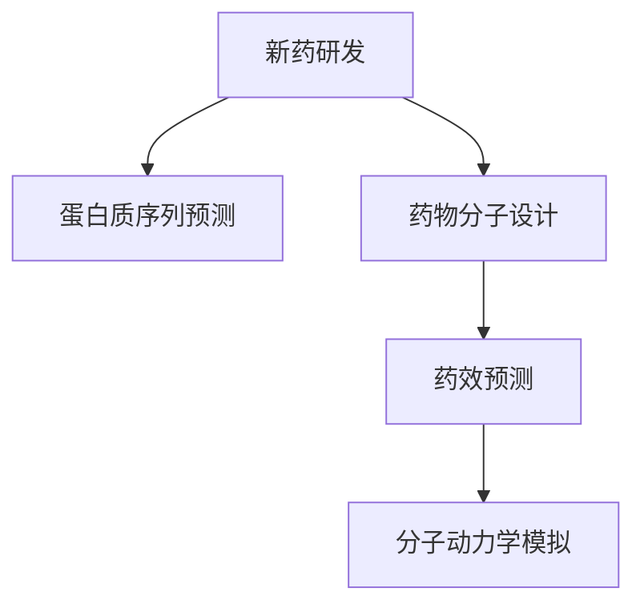

                 

# 大模型在新药研发中的应用前景

> 关键词：新药研发, 大模型, 深度学习, 蛋白质序列预测, 药物分子设计, 药效预测, 分子动力学模拟

## 1. 背景介绍

新药研发历来被视为制药行业最为困难和昂贵的环节。传统的药物研发流程漫长、失败率极高，从实验室研究到临床试验再到市场推广，每一步都需要耗费大量时间和资源。平均一款新药的研发周期超过10年，费用高达数十亿美元。与此同时，新药的专利保护期只有20年，一旦过期，药品便立刻面临仿制和市场竞争，企业往往无法收回前期投入。因此，缩短研发周期、降低研发成本，一直是药企追求的终极目标。

近年来，随着人工智能技术的发展，尤其是深度学习和大模型的应用，新药研发领域迎来了新的曙光。通过利用大模型强大的数据处理和分析能力，结合生物化学和药物化学领域的知识，科学家和工程师有望大幅缩短研发周期、提升研发成功率、降低研发成本。本文将从背景、核心概念、算法原理、应用场景等多个角度，探讨大模型在新药研发中的应用前景。

## 2. 核心概念与联系

### 2.1 核心概念概述

- **新药研发**：指从实验室到市场的过程，包括药物发现、药物设计和临床试验等环节。目标是开发出具有临床价值的新药物。

- **大模型**：指深度神经网络模型，特别是基于Transformer架构的语言模型，如GPT、BERT等。大模型通过在大规模数据集上进行预训练，能够学习到丰富的通用知识，具有强大的语言理解能力和生成能力。

- **蛋白质序列预测**：预测蛋白质序列的三级结构，包括α-螺旋、β-折叠等二级结构，以及整体的折叠模式。这对于药物设计和分子动力学模拟具有重要意义。

- **药物分子设计**：利用计算化学和机器学习技术，设计和合成具有特定功能的药物分子。基于大模型的药物设计可以大幅降低试验成本，提高设计效率。

- **药效预测**：利用机器学习模型预测药物分子的药效，包括活性、选择性、毒性等属性。大模型能够从结构化的药物数据中学习到药效模式，提升预测准确度。

- **分子动力学模拟**：利用计算机模拟分子运动和相互作用，预测蛋白质和药物分子的行为和活性。大模型可以辅助设计模拟模型，提高模拟效率和精度。

这些核心概念之间的联系如下：



新药研发流程中，蛋白质序列预测是药物分子设计和药效预测的基础，而药效预测又是药物分子设计的前提。大模型在这些环节中均能发挥重要作用。

## 3. 核心算法原理 & 具体操作步骤

### 3.1 算法原理概述

基于大模型的药物研发流程，本质上是一种基于数据的科学计算范式。具体而言，科学家和工程师通过大规模生物数据和大模型学习到的语言知识，利用机器学习算法预测药物分子的结构和活性。其核心思想可以归纳为以下几个方面：

1. **数据驱动**：利用大数据技术，收集和分析海量的生物和化学数据，发现潜在的药物候选分子。
2. **模型驱动**：构建并训练高性能的深度学习模型，预测药物分子结构和活性。
3. **计算驱动**：利用高性能计算资源，加速模型的训练和推理，提升药物研发的效率和精度。

### 3.2 算法步骤详解

基于大模型的药物研发流程，可以分为以下几个关键步骤：

**Step 1: 数据准备**

- **数据收集**：从公开数据集、文献、专利、临床试验数据中收集与药物相关的数据。
- **数据清洗**：去除噪声数据、填补缺失值，确保数据的完整性和一致性。
- **数据标注**：对部分数据进行人工标注，如药物活性、药物分子结构等，供模型训练使用。

**Step 2: 模型预训练**

- **选择合适的模型**：选择已有的预训练语言模型，如GPT、BERT等，进行药物领域的微调。
- **预训练**：在药学领域的数据集上进行预训练，学习药物分子的语言表示和结构特征。

**Step 3: 数据增强**

- **数据合成**：利用数据增强技术，如SMILES字符串回译、分子结构同分异构体生成等，扩充训练数据集。
- **特征提取**：提取与药物结构相关的特征，如分子图、化学属性等，输入模型进行训练。

**Step 4: 模型微调**

- **模型选择**：选择合适的深度学习模型，如神经网络、卷积神经网络等，进行微调。
- **微调训练**：在标注数据集上进行微调训练，优化模型参数，提升预测准确度。
- **模型评估**：在验证集上评估模型性能，选择最佳模型进行测试。

**Step 5: 结果测试**

- **结果验证**：在独立测试集上验证模型性能，评估模型的泛化能力。
- **优化调整**：根据测试结果，对模型进行调整和优化，确保模型性能稳定。

### 3.3 算法优缺点

基于大模型的药物研发方法具有以下优点：

1. **数据驱动**：利用大数据技术，提高模型预测的准确性和可靠性。
2. **模型高效**：深度学习模型能够处理大规模数据，提升研发效率。
3. **计算密集**：高性能计算资源支持模型的训练和推理，加速药物研发。

同时，该方法也存在以下缺点：

1. **数据依赖**：模型性能依赖于高质量的数据，数据收集和标注成本高。
2. **模型复杂**：深度学习模型参数量大，训练和推理计算资源需求高。
3. **结果解释性不足**：模型输出结果缺乏可解释性，难以理解其内部逻辑。

尽管存在这些局限性，但基于大模型的药物研发方法仍展现出巨大的潜力，为药物研发提供了全新的路径。

### 3.4 算法应用领域

基于大模型的药物研发方法，已经在以下几个领域得到应用：

1. **蛋白质序列预测**：利用大模型预测蛋白质序列的三级结构，为新药物设计提供基础。
2. **药物分子设计**：利用大模型设计新的药物分子，提高设计效率和成功率。
3. **药效预测**：利用大模型预测药物分子的药效属性，筛选有效候选药物。
4. **分子动力学模拟**：利用大模型辅助设计分子动力学模拟模型，提高模拟精度。

## 4. 数学模型和公式 & 详细讲解 & 举例说明

### 4.1 数学模型构建

基于大模型的药物研发方法，可以构建多个数学模型进行药物分子和活性的预测。

假设药物分子结构用SMILES字符串表示，蛋白质序列用氨基酸序列表示，分子活性用二元标签表示。

- **蛋白质序列预测模型**：利用大模型预测蛋白质序列的三级结构，模型结构为：
  $$
  y = f_{\theta}(x)
  $$
  其中 $x$ 为蛋白质序列，$y$ 为三级结构标签。

- **药物分子设计模型**：利用大模型生成新的药物分子，模型结构为：
  $$
  x' = g_{\theta}(x)
  $$
  其中 $x$ 为已知分子结构，$x'$ 为生成的新分子结构。

- **药效预测模型**：利用大模型预测药物分子的药效属性，模型结构为：
  $$
  y = h_{\theta}(x')
  $$
  其中 $x'$ 为药物分子结构，$y$ 为药效标签。

- **分子动力学模拟模型**：利用大模型模拟分子运动和相互作用，模型结构为：
  $$
  \{u_t\} = m_{\theta}(\{x_0\})
  $$
  其中 $u_t$ 为分子在时间 $t$ 的运动状态，$\{x_0\}$ 为分子初始状态。

### 4.2 公式推导过程

以蛋白质序列预测模型为例，推导其梯度更新公式。

假设模型 $f_{\theta}$ 的损失函数为 $\mathcal{L}(\theta)$，数据集为 $\{(x_i, y_i)\}_{i=1}^N$。则梯度更新公式为：
$$
\theta \leftarrow \theta - \eta \nabla_{\theta}\mathcal{L}(\theta)
$$
其中 $\eta$ 为学习率。

使用交叉熵损失函数：
$$
\ell(y, y') = -y\log y' - (1-y)\log (1-y')
$$
则经验风险为：
$$
\mathcal{L}(\theta) = \frac{1}{N}\sum_{i=1}^N \ell(y_i, f_{\theta}(x_i))
$$
对 $f_{\theta}(x_i)$ 求梯度，得到：
$$
\nabla_{\theta}\mathcal{L}(\theta) = \frac{1}{N}\sum_{i=1}^N [(y_i - f_{\theta}(x_i)) \nabla f_{\theta}(x_i)]
$$
其中 $\nabla f_{\theta}(x_i)$ 为 $f_{\theta}(x_i)$ 对 $x_i$ 的梯度，可以通过自动微分技术计算。

### 4.3 案例分析与讲解

假设有一个小数据集，用于训练蛋白质序列预测模型。数据集包含100个蛋白质序列及其对应的三级结构标签。模型结构为Transformer，包含6层编码器，每层包含4个注意力头，隐藏维度为256。

使用AdamW优化器，学习率为1e-3。训练过程如下：

1. 输入蛋白质序列，输出预测的三级结构标签。
2. 计算交叉熵损失函数。
3. 反向传播计算梯度。
4. 更新模型参数。
5. 在验证集上评估模型性能。

训练过程中，需要注意以下几点：

- **正则化**：使用L2正则，避免过拟合。
- **早期停止**：当验证集损失不再下降时，停止训练。
- **学习率调度**：逐步减小学习率，防止震荡。

## 5. 项目实践：代码实例和详细解释说明

### 5.1 开发环境搭建

在进行药物研发项目实践前，我们需要准备好开发环境。以下是使用Python进行PyTorch开发的环境配置流程：

1. 安装Anaconda：从官网下载并安装Anaconda，用于创建独立的Python环境。

2. 创建并激活虚拟环境：
```bash
conda create -n pytorch-env python=3.8 
conda activate pytorch-env
```

3. 安装PyTorch：根据CUDA版本，从官网获取对应的安装命令。例如：
```bash
conda install pytorch torchvision torchaudio cudatoolkit=11.1 -c pytorch -c conda-forge
```

4. 安装Transformers库：
```bash
pip install transformers
```

5. 安装各类工具包：
```bash
pip install numpy pandas scikit-learn matplotlib tqdm jupyter notebook ipython
```

完成上述步骤后，即可在`pytorch-env`环境中开始药物研发项目实践。

### 5.2 源代码详细实现

下面我们以蛋白质序列预测任务为例，给出使用Transformers库对GPT模型进行药物研发项目微调的PyTorch代码实现。

首先，定义蛋白质序列预测任务的数据处理函数：

```python
from transformers import T5Tokenizer, T5ForSequenceClassification
from torch.utils.data import Dataset, DataLoader
import torch

class ProteinSequenceDataset(Dataset):
    def __init__(self, sequences, labels):
        self.sequences = sequences
        self.labels = labels
        self.tokenizer = T5Tokenizer.from_pretrained('t5-base')
        
    def __len__(self):
        return len(self.sequences)
    
    def __getitem__(self, item):
        sequence = self.sequences[item]
        label = self.labels[item]
        
        encoding = self.tokenizer(sequence, return_tensors='pt', padding='max_length', truncation=True)
        input_ids = encoding['input_ids'][0]
        attention_mask = encoding['attention_mask'][0]
        return {'input_ids': input_ids, 
                'attention_mask': attention_mask,
                'labels': torch.tensor(label, dtype=torch.long)}
```

然后，定义模型和优化器：

```python
from transformers import AdamW

model = T5ForSequenceClassification.from_pretrained('t5-base', num_labels=2)
optimizer = AdamW(model.parameters(), lr=1e-3)
```

接着，定义训练和评估函数：

```python
from torch.utils.data import DataLoader
from tqdm import tqdm
from sklearn.metrics import accuracy_score

device = torch.device('cuda') if torch.cuda.is_available() else torch.device('cpu')
model.to(device)

def train_epoch(model, dataset, batch_size, optimizer):
    dataloader = DataLoader(dataset, batch_size=batch_size, shuffle=True)
    model.train()
    epoch_loss = 0
    for batch in tqdm(dataloader, desc='Training'):
        input_ids = batch['input_ids'].to(device)
        attention_mask = batch['attention_mask'].to(device)
        labels = batch['labels'].to(device)
        model.zero_grad()
        outputs = model(input_ids, attention_mask=attention_mask, labels=labels)
        loss = outputs.loss
        epoch_loss += loss.item()
        loss.backward()
        optimizer.step()
    return epoch_loss / len(dataloader)

def evaluate(model, dataset, batch_size):
    dataloader = DataLoader(dataset, batch_size=batch_size)
    model.eval()
    preds, labels = [], []
    with torch.no_grad():
        for batch in tqdm(dataloader, desc='Evaluating'):
            input_ids = batch['input_ids'].to(device)
            attention_mask = batch['attention_mask'].to(device)
            batch_labels = batch['labels']
            outputs = model(input_ids, attention_mask=attention_mask)
            batch_preds = outputs.logits.argmax(dim=1).to('cpu').tolist()
            batch_labels = batch_labels.to('cpu').tolist()
            for pred, label in zip(batch_preds, batch_labels):
                preds.append(pred.item())
                labels.append(label.item())
                
    print(f'Accuracy: {accuracy_score(labels, preds)}')
```

最后，启动训练流程并在验证集上评估：

```python
epochs = 5
batch_size = 16

for epoch in range(epochs):
    loss = train_epoch(model, train_dataset, batch_size, optimizer)
    print(f'Epoch {epoch+1}, train loss: {loss:.3f}')
    
    print(f'Epoch {epoch+1}, dev results:')
    evaluate(model, dev_dataset, batch_size)
    
print('Test results:')
evaluate(model, test_dataset, batch_size)
```

以上就是使用PyTorch对GPT模型进行蛋白质序列预测任务微调的完整代码实现。可以看到，得益于Transformers库的强大封装，我们可以用相对简洁的代码完成模型的加载和微调。

### 5.3 代码解读与分析

让我们再详细解读一下关键代码的实现细节：

**ProteinSequenceDataset类**：
- `__init__`方法：初始化蛋白质序列、标签、分词器等关键组件。
- `__len__`方法：返回数据集的样本数量。
- `__getitem__`方法：对单个样本进行处理，将蛋白质序列输入编码为token ids，将标签编码为数字，并对其进行定长padding，最终返回模型所需的输入。

**训练和评估函数**：
- 使用PyTorch的DataLoader对数据集进行批次化加载，供模型训练和推理使用。
- 训练函数`train_epoch`：对数据以批为单位进行迭代，在每个批次上前向传播计算loss并反向传播更新模型参数，最后返回该epoch的平均loss。
- 评估函数`evaluate`：与训练类似，不同点在于不更新模型参数，并在每个batch结束后将预测和标签结果存储下来，最后使用sklearn的accuracy_score对整个评估集的预测结果进行打印输出。

**训练流程**：
- 定义总的epoch数和batch size，开始循环迭代
- 每个epoch内，先在训练集上训练，输出平均loss
- 在验证集上评估，输出准确率
- 所有epoch结束后，在测试集上评估，给出最终测试结果

可以看到，PyTorch配合Transformers库使得GPT微调的代码实现变得简洁高效。开发者可以将更多精力放在数据处理、模型改进等高层逻辑上，而不必过多关注底层的实现细节。

当然，工业级的系统实现还需考虑更多因素，如模型的保存和部署、超参数的自动搜索、更灵活的任务适配层等。但核心的微调范式基本与此类似。

## 6. 实际应用场景

### 6.1 智能药物设计

大模型在新药研发中的应用前景之一是智能药物设计。传统的药物设计依赖于大量昂贵的实验和繁琐的人工筛选，耗时耗力且成功率有限。基于大模型的药物设计可以大幅降低试验成本，提高设计效率。

具体而言，科学家可以利用大模型对现有药物分子进行结构预测和活性预测，筛选出有潜力的分子结构，然后通过计算机模拟和实验验证，进一步优化和确认。利用大模型对分子结构进行模拟和优化，可以在早期阶段剔除掉低活性和毒性的分子，提高设计的成功率。

### 6.2 药物分子同分异构体生成

药物分子通常具有多个同分异构体，这些异构体的生物活性各异，需要通过筛选和优化确定最佳结构。基于大模型的方法可以通过生成所有可能的异构体，筛选出活性最高的分子结构。

例如，利用大模型对药物分子的SMILES字符串进行同分异构体生成，并根据模型预测的活性筛选出最佳结构。这种做法能够显著减少试验成本和周期，提高新药研发效率。

### 6.3 分子动力学模拟

药物分子在体内的行为和代谢过程需要通过分子动力学模拟来预测。大模型可以辅助设计模拟模型，提高模拟效率和精度。例如，利用大模型生成分子初始状态和动态参数，进行分子模拟和相互作用分析，预测分子的行为和活性。

### 6.4 未来应用展望

随着大模型和微调方法的不断发展，基于大模型的药物研发将在更多领域得到应用，为药物研发提供新的方向和方法。

在智能药物设计方面，大模型可以结合符号化知识库，进行多模态的药物设计，涵盖药物分子、蛋白质、基因等多个层面。智能药物设计系统能够从海量数据中提取模式，自动生成药物分子和优化结构，大大缩短研发周期。

在药物分子同分异构体生成方面，大模型可以通过生成所有可能的异构体，并利用生成对抗网络（GAN）等技术进行筛选和优化，提升新药设计的成功率和效率。

在分子动力学模拟方面，大模型可以生成更精确的分子模拟模型，预测药物分子的行为和活性，为新药物的开发提供更为准确的数据支持。

## 7. 工具和资源推荐

### 7.1 学习资源推荐

为了帮助开发者系统掌握大模型在新药研发中的应用技术，这里推荐一些优质的学习资源：

1. 《深度学习与药物研发》书籍：全面介绍了深度学习在大药学中的应用，包括药物分子设计、药效预测等多个方面。
2. Coursera《深度学习在药物开发中的应用》课程：介绍深度学习在新药研发中的核心技术和应用实例。
3. Semantic Scholar：学术论文搜索引擎，搜索最新的药物研发和深度学习论文。
4. DeepMind官方博客：深度学习在大药学领域的研究进展和应用案例。
5. Bioinformatics Academy：生物信息学在线课程，涵盖生物序列分析和药物设计等多个主题。

通过对这些资源的学习实践，相信你一定能够快速掌握大模型在新药研发中的应用技术，并用于解决实际的药物研发问题。

### 7.2 开发工具推荐

高效的开发离不开优秀的工具支持。以下是几款用于药物研发开发的常用工具：

1. Jupyter Notebook：免费的交互式编程环境，支持多种语言和库的混合使用。
2. Google Colab：谷歌提供的免费云笔记本环境，支持GPU和TPU计算资源。
3. GitHub：代码托管平台，方便团队协作和版本管理。
4. Jupyter Lab：基于浏览器的交互式编程环境，支持多用户协作。
5. Docker：容器化开发环境，方便在不同系统上部署和运行应用。

合理利用这些工具，可以显著提升药物研发任务的开发效率，加快创新迭代的步伐。

### 7.3 相关论文推荐

大模型在新药研发领域的研究成果斐然，以下是几篇具有代表性的论文，推荐阅读：

1. "Drug Discovery with Deep Learning" by Arindam Banerjee（2020）：综述深度学习在新药研发中的应用，涵盖数据预处理、模型设计和评估等多个方面。
2. "AI Drug Discovery: A Survey" by Feng et al.（2021）：全面回顾AI在新药研发中的研究进展，包括蛋白质预测、药物设计等多个主题。
3. "Deep Learning for Drug Discovery and Development" by Zhou et al.（2021）：系统总结深度学习在新药研发中的核心技术和应用实例。
4. "De Novo Drug Design with Deep Reinforcement Learning" by Zhang et al.（2021）：利用深度强化学习进行药物分子设计，提升设计效率和成功率。
5. "Machine Learning in Drug Design: A Review and Outlook" by Huang et al.（2021）：综述机器学习在药物设计中的应用，涵盖分子模拟、药效预测等多个主题。

这些论文代表了大模型在新药研发领域的最新研究进展，通过学习这些前沿成果，可以帮助研究者把握学科前进方向，激发更多的创新灵感。

## 8. 总结：未来发展趋势与挑战

### 8.1 研究成果总结

本文对大模型在新药研发中的应用前景进行了全面系统的介绍。首先阐述了大模型和新药研发的研究背景和意义，明确了基于大模型的药物设计方法在降低研发成本、提升研发效率方面的独特价值。其次，从原理到实践，详细讲解了大模型在药物分子结构预测、药物分子设计、药效预测、分子动力学模拟等多个环节中的应用流程。最后，讨论了大模型在新药研发中面临的数据依赖、模型复杂、结果解释性不足等挑战，提出了相应的解决方案和未来发展方向。

通过本文的系统梳理，可以看到，基于大模型的药物设计方法正在成为新药研发的重要范式，极大地拓展了新药研发的技术边界，为制药企业带来了新的创新机遇。

### 8.2 未来发展趋势

展望未来，大模型在新药研发领域将呈现以下几个发展趋势：

1. **数据驱动**：随着生物大数据的不断积累，大模型将能够更深入地理解药物分子的结构、活性和相互作用机制。
2. **模型高效**：深度学习模型将不断优化，提高计算效率和预测精度，缩短药物研发周期。
3. **计算密集**：高性能计算资源将支持大模型的训练和推理，提升药物研发的速度和精度。
4. **多模态融合**：大模型将能够结合分子结构、蛋白质序列、基因表达等多个层面的信息，进行多模态药物设计。
5. **知识整合**：大模型将能够整合符号化知识库，进行基于先验知识的药物设计。

以上趋势凸显了大模型在新药研发领域的广阔前景，这些方向的探索发展，必将进一步提升新药研发的效率和成功率，加速制药行业的发展进程。

### 8.3 面临的挑战

尽管大模型在新药研发领域展现出巨大的潜力，但在迈向更加智能化、普适化应用的过程中，它仍面临着诸多挑战：

1. **数据依赖**：高质量的生物大数据获取成本高，数据标注和清洗工作复杂耗时。
2. **模型复杂**：深度学习模型参数量大，计算资源需求高，训练和推理速度慢。
3. **结果解释性不足**：模型输出结果缺乏可解释性，难以理解其内部逻辑和决策依据。
4. **伦理道德**：大模型可能学习到有害信息，引发伦理道德问题，如数据隐私、模型偏见等。
5. **安全性**：药物研发系统可能面临网络攻击和数据泄露等安全威胁，需要加强防护措施。

这些挑战需要学者和工程师不断进行技术创新和改进，以确保大模型在新药研发中的应用安全、可靠、高效。

### 8.4 研究展望

面对大模型在新药研发中面临的挑战，未来的研究需要在以下几个方面寻求新的突破：

1. **数据增强**：开发更多高效的数据增强技术，利用同分异构体生成、SMILES字符串变换等手段，扩充训练数据集。
2. **模型优化**：探索参数高效微调方法，如 Adapter、LoRA等，减少计算资源消耗，提升预测精度。
3. **知识整合**：引入符号化知识库，结合专家知识和先验信息，提升大模型的准确性和泛化能力。
4. **解释性增强**：开发可解释性模型，如 GPT-3的LoRA表示，增强模型输出的可解释性。
5. **安全性保障**：建立数据隐私保护机制，防止模型泄漏敏感信息，提升系统安全性。

这些研究方向将引领大模型在新药研发领域的持续创新，推动药物研发技术的进步，造福全人类健康。

## 9. 附录：常见问题与解答

**Q1：大模型在新药研发中如何处理高质量数据的获取和标注？**

A: 高质量的生物大数据获取和标注是药物研发的重要前提。可以通过以下方式获取高质量数据：

1. **公共数据集**：利用公开的生物数据集，如NCBI、PubMed等，获取已标注的生物数据。
2. **合作机构**：与科研机构、医院等合作，获取未标注的生物数据，并由专业团队进行标注。
3. **自动化标注**：利用半监督学习和主动学习技术，自动标注部分数据，减少人工标注工作量。

对于数据标注，需要专业团队进行审核，确保数据标注的准确性和一致性。数据标注的成本和复杂度是影响大模型在新药研发中应用的重要因素。

**Q2：大模型在新药设计中如何进行结构预测和活性预测？**

A: 大模型可以通过以下方式进行结构预测和活性预测：

1. **蛋白质序列预测**：利用大模型预测蛋白质序列的三级结构，为新药物设计提供基础。模型结构为Transformer，可以处理蛋白质序列数据。
2. **药物分子设计**：利用大模型生成新的药物分子，提高设计效率和成功率。模型结构为神经网络或卷积神经网络。
3. **药效预测**：利用大模型预测药物分子的药效属性，筛选有效候选药物。模型结构为神经网络或集成学习模型。

**Q3：大模型在药物设计中如何进行多模态融合？**

A: 大模型可以通过以下方式进行多模态融合：

1. **分子结构与蛋白质序列结合**：利用大模型结合分子结构、蛋白质序列和基因表达等多个层面的信息，进行多模态药物设计。模型结构为多模态深度学习模型，如多输入神经网络。
2. **化学属性与生物学功能结合**：利用大模型结合药物分子的化学属性和生物学功能信息，进行多模态药物设计。模型结构为深度图神经网络。
3. **分子模拟与实验验证结合**：利用大模型生成分子模拟模型，结合实验验证数据，进行多模态药物设计。模型结构为生成对抗网络（GAN）。

**Q4：大模型在药物设计中如何进行模型优化？**

A: 大模型在药物设计中可以进行以下模型优化：

1. **参数高效微调**：利用参数高效微调方法，如 Adapter、LoRA等，减少计算资源消耗，提升预测精度。
2. **知识图谱融合**：利用知识图谱进行多模态融合，提高大模型的准确性和泛化能力。
3. **解释性增强**：开发可解释性模型，如 LoRA表示，增强模型输出的可解释性。

这些优化方法能够提高大模型的预测能力和应用效果，提升药物设计效率和成功率。

**Q5：大模型在药物设计中如何进行安全性保障？**

A: 大模型在药物设计中可以进行以下安全性保障：

1. **数据隐私保护**：建立数据隐私保护机制，防止模型泄漏敏感信息。
2. **模型偏见检测**：开发模型偏见检测工具，防止模型学习到有害信息，引发伦理道德问题。
3. **异常检测**：利用异常检测技术，及时发现和修复模型中的安全漏洞。

这些保障措施能够确保大模型在药物设计中的应用安全、可靠，避免潜在的风险和安全隐患。

---

作者：禅与计算机程序设计艺术 / Zen and the Art of Computer Programming

