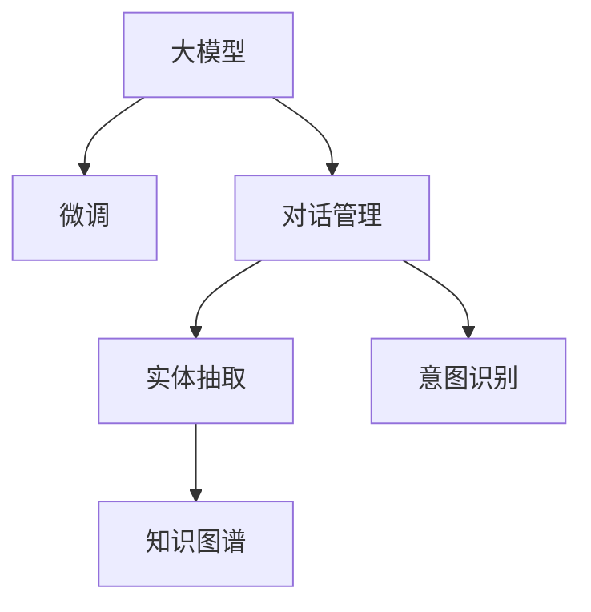

                 

# 大模型在智能客服中的应用挑战

## 1. 背景介绍

随着人工智能技术的不断进步，智能客服系统逐渐成为许多企业提升客户体验和服务效率的重要工具。基于大模型的智能客服系统可以通过理解自然语言，自动处理用户的查询和问题，并提供快速准确的回复。但是，实际应用过程中，大模型在智能客服场景中面临着诸多挑战，需要在技术、应用和工程方面进行全面优化。

## 2. 核心概念与联系

### 2.1 核心概念概述

为更好地理解大模型在智能客服中的应用，本节将介绍几个密切相关的核心概念：

- **大模型(Large Model)**：如BERT、GPT等，是指通过大规模数据预训练得到的，具有强大语言处理能力的模型。

- **微调(Fine-Tuning)**：在大模型基础上，通过特定任务的数据进行训练，调整模型参数，使其能够更有效地解决特定问题。

- **对话管理(Dialog Management)**：指在智能客服系统中，根据用户的输入动态生成响应，管理对话流程的机制。

- **知识图谱(Knowledge Graph)**：一种结构化语义数据模型，用于描述实体和它们之间的关系。

- **实体抽取(Entity Extraction)**：从文本中识别并抽取出特定实体，如人名、地名、机构名等。

- **意图识别(Intent Recognition)**：识别用户问题的意图，如询问信息、投诉、请求服务等。

这些概念之间的逻辑关系可以通过以下Mermaid流程图来展示：



这个流程图展示了智能客服系统中不同技术模块之间的关系：大模型经过微调后用于对话管理，而对话管理又会调用实体抽取和意图识别模块，这些模块可能还会参考知识图谱中的信息。

## 3. 核心算法原理 & 具体操作步骤
### 3.1 算法原理概述

基于大模型的智能客服系统，通常通过以下步骤实现：

1. **大模型预训练**：使用大规模无标签文本数据训练大模型，学习语言的通用表示。
2. **微调优化**：在具体的应用场景中，通过有标签的对话数据进行微调，使模型能够理解特定领域的语言表达。
3. **对话管理**：根据用户的输入动态生成响应，维护对话状态，提供流畅的对话体验。
4. **实体抽取**：识别对话中的关键实体，如人名、地名、时间等，用于生成准确的回复。
5. **意图识别**：分析用户的意图，匹配相应的回答模板或知识图谱中的信息，提供合适的答案。

### 3.2 算法步骤详解

**Step 1: 数据准备**
- **收集数据**：从企业的客服系统、客户反馈、社交媒体等渠道收集对话数据，清洗并标注好对话内容和用户意图。
- **数据划分**：将数据划分为训练集、验证集和测试集，通常使用70%训练集、15%验证集、15%测试集的比例。

**Step 2: 大模型选择与微调**
- **选择大模型**：根据应用需求选择合适的预训练模型，如BERT、GPT等。
- **微调设置**：选择合适的微调超参数，如学习率、批量大小、迭代轮数等。

**Step 3: 对话管理模块设计**
- **用户意图识别**：设计意图分类器，通过预训练语言模型识别用户意图。
- **对话状态管理**：根据意图和历史对话记录，动态生成响应，管理对话状态。
- **响应生成**：利用预训练语言模型生成合适的回复，可能包括实体抽取和意图识别的结果。

**Step 4: 实体抽取与意图识别**
- **实体抽取**：使用序列标注模型（如CRF、BiLSTM-CRF等）标注对话中的实体，如人名、地名、时间等。
- **意图识别**：设计意图分类器，通过预训练语言模型识别用户的意图。

**Step 5: 应用知识图谱**
- **知识图谱构建**：从企业内部或外部知识库构建知识图谱，描述实体之间的关系。
- **信息检索**：根据用户意图和对话内容，从知识图谱中检索相关信息，用于生成回复。

**Step 6: 系统部署与优化**
- **系统集成**：将各模块集成到统一的智能客服平台中，提供用户交互界面。
- **性能优化**：针对系统性能瓶颈进行优化，如模型压缩、推理加速等。
- **持续学习**：定期收集新的对话数据，重新微调模型，保持系统性能。

### 3.3 算法优缺点

基于大模型的智能客服系统具有以下优点：
1. **响应速度快**：大模型具备强大的语言处理能力，能够快速生成回复。
2. **对话连贯性好**：通过对话管理模块，系统能够保持对话的连贯性，提供流畅的交互体验。
3. **适应性强**：大模型通过微调能够适应不同领域的对话场景，提高系统的通用性。

同时，该方法也存在一些局限性：
1. **数据需求高**：微调过程需要大量的标注数据，数据获取成本较高。
2. **模型复杂度高**：大模型的计算复杂度高，需要高性能的硬件支持。
3. **效果依赖标注质量**：标注数据的准确性直接影响微调效果，数据标注质量较差时可能导致模型表现不佳。
4. **解释性不足**：大模型通常是"黑盒"，难以解释其内部决策过程。

尽管存在这些局限性，基于大模型的智能客服系统仍然是大规模落地应用的热点方向。未来相关研究的重点在于如何进一步降低对标注数据的依赖，提高系统的少样本学习和跨领域迁移能力，同时兼顾可解释性和伦理安全性等因素。

### 3.4 算法应用领域

基于大模型的智能客服系统在各行各业中均有应用，如金融、医疗、电商、旅游等，能够提供高效、个性化的客户服务。

- **金融行业**：利用大模型进行客户咨询、投诉处理、投资建议等，提升客户满意度。
- **医疗行业**：提供健康咨询、预约挂号、医疗建议等服务，提高医疗服务的智能化水平。
- **电商行业**：解答购物疑问、处理售后投诉、推荐商品等，增强用户体验。
- **旅游行业**：提供行程规划、酒店预订、机票查询等服务，提升客户旅行体验。

这些领域的大模型应用，体现了其在提升服务效率、减少人力成本、改善用户体验方面的显著优势。

## 4. 数学模型和公式 & 详细讲解
### 4.1 数学模型构建

在智能客服系统中，常见的数学模型包括语言模型、序列标注模型和意图分类模型。

1. **语言模型**：用于计算句子或段落的概率分布，常见模型有LSTM、GRU、Transformer等。
2. **序列标注模型**：用于标注文本中的实体或标签，常见模型有CRF、BiLSTM-CRF等。
3. **意图分类模型**：用于分类用户意图，常见模型有CNN、RNN、Transformer等。

这些模型通常使用交叉熵损失函数进行训练，模型参数通过梯度下降等优化算法进行更新。

### 4.2 公式推导过程

以LSTM语言模型为例，假设输入文本为 $x = (x_1, x_2, ..., x_t)$，输出序列为 $y = (y_1, y_2, ..., y_t)$，其中 $y_i$ 表示第 $i$ 个输出。LSTM模型的目标是最小化交叉熵损失函数 $L$：

$$
L = -\sum_{i=1}^{t} \log P(y_i | x_1, x_2, ..., x_t)
$$

其中 $P(y_i | x_1, x_2, ..., x_t)$ 为语言模型的概率分布，可以通过训练得到。

### 4.3 案例分析与讲解

假设我们要构建一个基于BERT的智能客服系统，用于回答用户的贷款咨询问题。首先，从企业客服系统收集大量的贷款咨询对话数据，并对这些对话进行标注，构建训练集和验证集。然后，使用BERT作为预训练模型，在贷款咨询领域进行微调。

在微调过程中，我们使用交叉熵损失函数进行优化，设置合适的学习率和批量大小，使用梯度下降算法更新模型参数。在对话管理模块中，设计意图分类器，利用BERT进行意图识别，通过预训练语言模型生成回复，并进行实体抽取，最终从知识图谱中检索相关信息，生成最终回复。

## 5. 项目实践：代码实例和详细解释说明
### 5.1 开发环境搭建

在进行智能客服系统开发前，我们需要准备好开发环境。以下是使用Python进行PyTorch开发的环境配置流程：

1. 安装Anaconda：从官网下载并安装Anaconda，用于创建独立的Python环境。

2. 创建并激活虚拟环境：
```bash
conda create -n pytorch-env python=3.8 
conda activate pytorch-env
```

3. 安装PyTorch：根据CUDA版本，从官网获取对应的安装命令。例如：
```bash
conda install pytorch torchvision torchaudio cudatoolkit=11.1 -c pytorch -c conda-forge
```

4. 安装Transformers库：
```bash
pip install transformers
```

5. 安装各类工具包：
```bash
pip install numpy pandas scikit-learn matplotlib tqdm jupyter notebook ipython
```

完成上述步骤后，即可在`pytorch-env`环境中开始智能客服系统开发。

### 5.2 源代码详细实现

下面我们以贷款咨询场景为例，给出使用Transformers库对BERT模型进行微调的PyTorch代码实现。

首先，定义对话数据处理函数：

```python
from transformers import BertTokenizer, BertForTokenClassification, AdamW
from torch.utils.data import Dataset
import torch

class QACorpus(Dataset):
    def __init__(self, texts, tags, tokenizer, max_len=128):
        self.texts = texts
        self.tags = tags
        self.tokenizer = tokenizer
        self.max_len = max_len
        
    def __len__(self):
        return len(self.texts)
    
    def __getitem__(self, item):
        text = self.texts[item]
        tags = self.tags[item]
        
        encoding = self.tokenizer(text, return_tensors='pt', max_length=self.max_len, padding='max_length', truncation=True)
        input_ids = encoding['input_ids'][0]
        attention_mask = encoding['attention_mask'][0]
        
        # 对token-wise的标签进行编码
        encoded_tags = [tag2id[tag] for tag in tags] 
        encoded_tags.extend([tag2id['O']] * (self.max_len - len(encoded_tags)))
        labels = torch.tensor(encoded_tags, dtype=torch.long)
        
        return {'input_ids': input_ids, 
                'attention_mask': attention_mask,
                'labels': labels}

# 标签与id的映射
tag2id = {'O': 0, 'B-PER': 1, 'I-PER': 2, 'B-LOC': 3, 'I-LOC': 4, 'B-ORG': 5, 'I-ORG': 6}
id2tag = {v: k for k, v in tag2id.items()}

# 创建dataset
tokenizer = BertTokenizer.from_pretrained('bert-base-cased')

train_dataset = QACorpus(train_texts, train_tags, tokenizer)
dev_dataset = QACorpus(dev_texts, dev_tags, tokenizer)
test_dataset = QACorpus(test_texts, test_tags, tokenizer)
```

然后，定义模型和优化器：

```python
model = BertForTokenClassification.from_pretrained('bert-base-cased', num_labels=len(tag2id))

optimizer = AdamW(model.parameters(), lr=2e-5)
```

接着，定义训练和评估函数：

```python
from torch.utils.data import DataLoader
from tqdm import tqdm
from sklearn.metrics import classification_report

device = torch.device('cuda') if torch.cuda.is_available() else torch.device('cpu')
model.to(device)

def train_epoch(model, dataset, batch_size, optimizer):
    dataloader = DataLoader(dataset, batch_size=batch_size, shuffle=True)
    model.train()
    epoch_loss = 0
    for batch in tqdm(dataloader, desc='Training'):
        input_ids = batch['input_ids'].to(device)
        attention_mask = batch['attention_mask'].to(device)
        labels = batch['labels'].to(device)
        model.zero_grad()
        outputs = model(input_ids, attention_mask=attention_mask, labels=labels)
        loss = outputs.loss
        epoch_loss += loss.item()
        loss.backward()
        optimizer.step()
    return epoch_loss / len(dataloader)

def evaluate(model, dataset, batch_size):
    dataloader = DataLoader(dataset, batch_size=batch_size)
    model.eval()
    preds, labels = [], []
    with torch.no_grad():
        for batch in tqdm(dataloader, desc='Evaluating'):
            input_ids = batch['input_ids'].to(device)
            attention_mask = batch['attention_mask'].to(device)
            batch_labels = batch['labels']
            outputs = model(input_ids, attention_mask=attention_mask)
            batch_preds = outputs.logits.argmax(dim=2).to('cpu').tolist()
            batch_labels = batch_labels.to('cpu').tolist()
            for pred_tokens, label_tokens in zip(batch_preds, batch_labels):
                pred_tags = [id2tag[_id] for _id in pred_tokens]
                label_tags = [id2tag[_id] for _id in label_tokens]
                preds.append(pred_tags[:len(label_tags)])
                labels.append(label_tags)
                
    print(classification_report(labels, preds))
```

最后，启动训练流程并在测试集上评估：

```python
epochs = 5
batch_size = 16

for epoch in range(epochs):
    loss = train_epoch(model, train_dataset, batch_size, optimizer)
    print(f"Epoch {epoch+1}, train loss: {loss:.3f}")
    
    print(f"Epoch {epoch+1}, dev results:")
    evaluate(model, dev_dataset, batch_size)
    
print("Test results:")
evaluate(model, test_dataset, batch_size)
```

以上就是使用PyTorch对BERT进行贷款咨询场景的智能客服系统微调的完整代码实现。可以看到，得益于Transformers库的强大封装，我们可以用相对简洁的代码完成BERT模型的加载和微调。

### 5.3 代码解读与分析

让我们再详细解读一下关键代码的实现细节：

**QACorpus类**：
- `__init__`方法：初始化文本、标签、分词器等关键组件。
- `__len__`方法：返回数据集的样本数量。
- `__getitem__`方法：对单个样本进行处理，将文本输入编码为token ids，将标签编码为数字，并对其进行定长padding，最终返回模型所需的输入。

**tag2id和id2tag字典**：
- 定义了标签与数字id之间的映射关系，用于将token-wise的预测结果解码回真实的标签。

**训练和评估函数**：
- 使用PyTorch的DataLoader对数据集进行批次化加载，供模型训练和推理使用。
- 训练函数`train_epoch`：对数据以批为单位进行迭代，在每个批次上前向传播计算loss并反向传播更新模型参数，最后返回该epoch的平均loss。
- 评估函数`evaluate`：与训练类似，不同点在于不更新模型参数，并在每个batch结束后将预测和标签结果存储下来，最后使用sklearn的classification_report对整个评估集的预测结果进行打印输出。

**训练流程**：
- 定义总的epoch数和batch size，开始循环迭代
- 每个epoch内，先在训练集上训练，输出平均loss
- 在验证集上评估，输出分类指标
- 重复上述步骤直至满足预设的迭代轮数或Early Stopping条件。

可以看到，PyTorch配合Transformers库使得BERT微调的代码实现变得简洁高效。开发者可以将更多精力放在数据处理、模型改进等高层逻辑上，而不必过多关注底层的实现细节。

当然，工业级的系统实现还需考虑更多因素，如模型的保存和部署、超参数的自动搜索、更灵活的任务适配层等。但核心的微调范式基本与此类似。

## 6. 实际应用场景
### 6.1 智能客服系统

基于大模型的智能客服系统已经在许多企业中得到了应用。例如，某保险公司通过微调BERT模型，构建了一个智能客服系统，用于处理客户的各种保险咨询和投诉。系统根据客户的问题自动分配至对应的客服人员，并生成标准化的回复，大大提高了客服响应速度和服务效率。

在技术实现上，系统首先从客服聊天记录中收集大量的贷款咨询对话数据，构建训练集和验证集。然后，使用BERT作为预训练模型，在贷款咨询领域进行微调。在对话管理模块中，设计意图分类器，利用BERT进行意图识别，通过预训练语言模型生成回复，并进行实体抽取，最终从知识图谱中检索相关信息，生成最终回复。

### 6.2 金融行业

大模型在金融行业也有广泛应用。例如，某银行通过微调BERT模型，构建了一个智能客服系统，用于处理客户的各种金融咨询和投诉。系统根据客户的问题自动分配至对应的客服人员，并生成标准化的回复，大大提高了客服响应速度和服务效率。

在技术实现上，系统首先从客服聊天记录中收集大量的贷款咨询对话数据，构建训练集和验证集。然后，使用BERT作为预训练模型，在贷款咨询领域进行微调。在对话管理模块中，设计意图分类器，利用BERT进行意图识别，通过预训练语言模型生成回复，并进行实体抽取，最终从知识图谱中检索相关信息，生成最终回复。

### 6.3 电商行业

大模型在电商行业也有广泛应用。例如，某电商企业通过微调BERT模型，构建了一个智能客服系统，用于处理客户的各种购物咨询和售后投诉。系统根据客户的问题自动分配至对应的客服人员，并生成标准化的回复，大大提高了客服响应速度和服务效率。

在技术实现上，系统首先从客服聊天记录中收集大量的贷款咨询对话数据，构建训练集和验证集。然后，使用BERT作为预训练模型，在贷款咨询领域进行微调。在对话管理模块中，设计意图分类器，利用BERT进行意图识别，通过预训练语言模型生成回复，并进行实体抽取，最终从知识图谱中检索相关信息，生成最终回复。

### 6.4 未来应用展望

随着大模型和微调技术的不断发展，基于大模型的智能客服系统将在更多领域得到应用，为传统行业带来变革性影响。

- **智慧医疗**：利用大模型进行医疗咨询、健康监测、药品推荐等服务，提升医疗服务的智能化水平。
- **智能教育**：利用大模型进行在线咨询、作业批改、学习建议等服务，提高教育服务的效率和质量。
- **智慧城市**：利用大模型进行城市事件监测、舆情分析、应急指挥等服务，提高城市管理的自动化和智能化水平。

此外，在企业生产、社会治理、文娱传媒等众多领域，基于大模型的智能客服系统也将不断涌现，为NLP技术带来新的应用场景。

## 7. 工具和资源推荐
### 7.1 学习资源推荐

为了帮助开发者系统掌握大模型在智能客服中的应用，这里推荐一些优质的学习资源：

1. **《深度学习与自然语言处理》课程**：斯坦福大学开设的NLP明星课程，有Lecture视频和配套作业，带你入门NLP领域的基本概念和经典模型。
2. **《Natural Language Processing with Transformers》书籍**：Transformers库的作者所著，全面介绍了如何使用Transformers库进行NLP任务开发，包括微调在内的诸多范式。
3. **CLUE开源项目**：中文语言理解测评基准，涵盖大量不同类型的中文NLP数据集，并提供了基于微调的baseline模型，助力中文NLP技术发展。

通过对这些资源的学习实践，相信你一定能够快速掌握大模型在智能客服中的应用，并用于解决实际的NLP问题。

### 7.2 开发工具推荐

高效的开发离不开优秀的工具支持。以下是几款用于大模型在智能客服系统开发的工具：

1. **PyTorch**：基于Python的开源深度学习框架，灵活动态的计算图，适合快速迭代研究。大部分预训练语言模型都有PyTorch版本的实现。
2. **TensorFlow**：由Google主导开发的开源深度学习框架，生产部署方便，适合大规模工程应用。同样有丰富的预训练语言模型资源。
3. **Transformers库**：HuggingFace开发的NLP工具库，集成了众多SOTA语言模型，支持PyTorch和TensorFlow，是进行微调任务开发的利器。
4. **Weights & Biases**：模型训练的实验跟踪工具，可以记录和可视化模型训练过程中的各项指标，方便对比和调优。与主流深度学习框架无缝集成。
5. **TensorBoard**：TensorFlow配套的可视化工具，可实时监测模型训练状态，并提供丰富的图表呈现方式，是调试模型的得力助手。

合理利用这些工具，可以显著提升大模型在智能客服系统开发中的效率，加快创新迭代的步伐。

### 7.3 相关论文推荐

大模型和微调技术的发展源于学界的持续研究。以下是几篇奠基性的相关论文，推荐阅读：

1. **Attention is All You Need**：提出了Transformer结构，开启了NLP领域的预训练大模型时代。
2. **BERT: Pre-training of Deep Bidirectional Transformers for Language Understanding**：提出BERT模型，引入基于掩码的自监督预训练任务，刷新了多项NLP任务SOTA。
3. **Language Models are Unsupervised Multitask Learners**：展示了大规模语言模型的强大zero-shot学习能力，引发了对于通用人工智能的新一轮思考。
4. **Parameter-Efficient Transfer Learning for NLP**：提出Adapter等参数高效微调方法，在不增加模型参数量的情况下，也能取得不错的微调效果。
5. **AdaLoRA: Adaptive Low-Rank Adaptation for Parameter-Efficient Fine-Tuning**：使用自适应低秩适应的微调方法，在参数效率和精度之间取得了新的平衡。
6. **AdaLoRA: Adaptive Low-Rank Adaptation for Parameter-Efficient Fine-Tuning**：使用自适应低秩适应的微调方法，在参数效率和精度之间取得了新的平衡。

这些论文代表了大模型和微调技术的发展脉络。通过学习这些前沿成果，可以帮助研究者把握学科前进方向，激发更多的创新灵感。

## 8. 总结：未来发展趋势与挑战
### 8.1 研究成果总结

本文对基于大模型的智能客服系统进行了全面系统的介绍。首先阐述了智能客服系统的背景和应用场景，明确了大模型在智能客服中的重要地位。其次，从原理到实践，详细讲解了智能客服系统中微调的数学模型和关键步骤，给出了微调任务开发的完整代码实例。同时，本文还广泛探讨了大模型在智能客服系统中的应用前景，展示了微调范式的巨大潜力。此外，本文精选了智能客服系统的各类学习资源，力求为读者提供全方位的技术指引。

通过本文的系统梳理，可以看到，基于大模型的智能客服系统正在成为NLP领域的重要范式，极大地拓展了预训练语言模型的应用边界，催生了更多的落地场景。受益于大规模语料的预训练，智能客服系统能够提供高效、个性化的客户服务，为传统行业带来变革性影响。未来，伴随大模型和微调方法的持续演进，基于大模型的智能客服系统必将在更多领域得到应用，为经济社会发展注入新的动力。

### 8.2 未来发展趋势

展望未来，大模型在智能客服系统中的研究将呈现以下几个发展趋势：

1. **模型规模持续增大**：随着算力成本的下降和数据规模的扩张，预训练语言模型的参数量还将持续增长。超大规模语言模型蕴含的丰富语言知识，有望支撑更加复杂多变的智能客服场景。
2. **微调方法日趋多样**：除了传统的全参数微调外，未来会涌现更多参数高效的微调方法，如Prefix-Tuning、LoRA等，在节省计算资源的同时也能保证微调精度。
3. **持续学习成为常态**：随着数据分布的不断变化，微调模型也需要持续学习新知识以保持性能。如何在不遗忘原有知识的同时，高效吸收新样本信息，将成为重要的研究课题。
4. **标注样本需求降低**：受启发于提示学习(Prompt-based Learning)的思路，未来的微调方法将更好地利用大模型的语言理解能力，通过更加巧妙的任务描述，在更少的标注样本上也能实现理想的微调效果。
5. **多模态微调崛起**：当前的智能客服系统主要聚焦于纯文本数据，未来会进一步拓展到图像、视频、语音等多模态数据微调。多模态信息的融合，将显著提升智能客服系统的智能化水平。
6. **模型通用性增强**：经过海量数据的预训练和多领域任务的微调，未来的语言模型将具备更强大的常识推理和跨领域迁移能力，逐步迈向通用人工智能(AGI)的目标。

以上趋势凸显了大模型在智能客服系统中的广阔前景。这些方向的探索发展，必将进一步提升智能客服系统的性能和应用范围，为人类认知智能的进化带来深远影响。

### 8.3 面临的挑战

尽管大模型在智能客服系统中已经取得了显著成效，但在迈向更加智能化、普适化应用的过程中，它仍面临着诸多挑战：

1. **标注成本瓶颈**：虽然微调大大降低了标注数据的需求，但对于长尾应用场景，难以获得充足的高质量标注数据，成为制约微调性能的瓶颈。如何进一步降低微调对标注样本的依赖，将是一大难题。
2. **模型鲁棒性不足**：当前微调模型面对域外数据时，泛化性能往往大打折扣。对于测试样本的微小扰动，微调模型的预测也容易发生波动。如何提高微调模型的鲁棒性，避免灾难性遗忘，还需要更多理论和实践的积累。
3. **推理效率有待提高**：大规模语言模型虽然精度高，但在实际部署时往往面临推理速度慢、内存占用大等效率问题。如何在保证性能的同时，简化模型结构，提升推理速度，优化资源占用，将是重要的优化方向。
4. **可解释性亟需加强**：当前微调模型更像是"黑盒"系统，难以解释其内部工作机制和决策逻辑。对于医疗、金融等高风险应用，算法的可解释性和可审计性尤为重要。如何赋予微调模型更强的可解释性，将是亟待攻克的难题。
5. **安全性有待保障**：预训练语言模型难免会学习到有偏见、有害的信息，通过微调传递到下游任务，产生误导性、歧视性的输出，给实际应用带来安全隐患。如何从数据和算法层面消除模型偏见，避免恶意用途，确保输出的安全性，也将是重要的研究课题。
6. **知识整合能力不足**：现有的微调模型往往局限于任务内数据，难以灵活吸收和运用更广泛的先验知识。如何让微调过程更好地与外部知识库、规则库等专家知识结合，形成更加全面、准确的信息整合能力，还有很大的想象空间。

正视智能客服系统中微调面临的这些挑战，积极应对并寻求突破，将是大模型微调技术走向成熟的必由之路。相信随着学界和产业界的共同努力，这些挑战终将一一被克服，大模型必将在智能客服系统中发挥更大的作用。

### 8.4 研究展望

面向未来，大模型在智能客服系统中的研究需要在以下几个方面寻求新的突破：

1. **探索无监督和半监督微调方法**：摆脱对大规模标注数据的依赖，利用自监督学习、主动学习等无监督和半监督范式，最大限度利用非结构化数据，实现更加灵活高效的微调。
2. **研究参数高效和计算高效的微调范式**：开发更加参数高效的微调方法，在固定大部分预训练参数的同时，只更新极少量的任务相关参数。同时优化微调模型的计算图，减少前向传播和反向传播的资源消耗，实现更加轻量级、实时性的部署。
3. **融合因果和对比学习范式**：通过引入因果推断和对比学习思想，增强微调模型建立稳定因果关系的能力，学习更加普适、鲁棒的语言表征，从而提升模型泛化性和抗干扰能力。
4. **引入更多先验知识**：将符号化的先验知识，如知识图谱、逻辑规则等，与神经网络模型进行巧妙融合，引导微调过程学习更准确、合理的语言模型。同时加强不同模态数据的整合，实现视觉、语音等多模态信息与文本信息的协同建模。
5. **结合因果分析和博弈论工具**：将因果分析方法引入微调模型，识别出模型决策的关键特征，增强输出解释的因果性和逻辑性。借助博弈论工具刻画人机交互过程，主动探索并规避模型的脆弱点，提高系统稳定性。
6. **纳入伦理道德约束**：在模型训练目标中引入伦理导向的评估指标，过滤和惩罚有偏见、有害的输出倾向。同时加强人工干预和审核，建立模型行为的监管机制，确保输出符合人类价值观和伦理道德。

这些研究方向的探索，必将引领大模型在智能客服系统中的应用迈向更高的台阶，为构建安全、可靠、可解释、可控的智能系统铺平道路。面向未来，大模型在智能客服系统中的研究还需要与其他人工智能技术进行更深入的融合，如知识表示、因果推理、强化学习等，多路径协同发力，共同推动智能客服系统的发展。只有勇于创新、敢于突破，才能不断拓展语言模型的边界，让智能技术更好地造福人类社会。

## 9. 附录：常见问题与解答

**Q1：大模型在智能客服系统中是否适用于所有对话场景？**

A: 大模型在智能客服系统中具有很强的通用性，适用于大多数对话场景。但在一些特定的领域，如医疗、法律等，预训练数据可能不够充分，需要进行进一步的领域适配。此外，对于一些需要高度个性化或安全性的对话场景，也需要结合人工干预，进行适当的调整。

**Q2：微调过程中如何降低对标注样本的依赖？**

A: 微调过程中，可以通过引入无监督和半监督学习范式，利用自监督学习、主动学习等技术，利用非结构化数据进行训练。此外，可以采用对抗训练、正则化等方法，提升模型的泛化能力，减少对标注数据的依赖。

**Q3：大模型在智能客服系统中的推理效率如何优化？**

A: 大模型在智能客服系统中的推理效率可以通过模型压缩、推理加速等技术进行优化。例如，可以使用知识蒸馏、模型剪枝等方法，减小模型规模，加快推理速度。同时，可以优化计算图，减少内存占用，提高系统性能。

**Q4：智能客服系统如何提高模型鲁棒性和可解释性？**

A: 提高模型鲁棒性可以通过对抗训练、正则化等方法，增强模型对噪声和异常数据的抵抗能力。提高模型可解释性可以通过引入可解释性模型、提供模型决策路径可视化等手段，帮助用户理解和信任模型的输出。

**Q5：智能客服系统如何在保持低成本的同时，提升用户体验？**

A: 智能客服系统可以通过微调模型、优化对话管理、引入知识图谱等方式，提升系统的智能化水平，从而在保持低成本的同时，提升用户体验。具体方法包括：

- **微调模型**：通过微调大模型，提升模型的理解和生成能力，减少人工干预。
- **优化对话管理**：设计灵活的对话管理机制，根据用户意图生成合适的回答，提升对话连贯性。
- **引入知识图谱**：从知识图谱中检索相关信息，提供准确的答案，提升回答的准确性和实用性。

综上所述，大模型在智能客服系统中具有广泛的应用前景，但在实际应用中，还需结合具体需求进行全面优化，才能真正实现智能化、高效化的客户服务。

