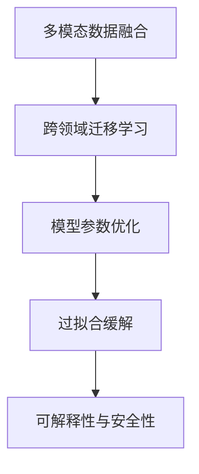

                 

## 1. 背景介绍

### 1.1 问题由来

随着深度学习技术的飞速发展，大模型在自然语言处理(NLP)、计算机视觉(CV)等领域的性能已经达到了令人瞩目的水平。然而，对于大模型在具体任务中的应用，尤其是其在多模态数据融合、跨领域迁移学习等方面的应用，仍然存在许多挑战。为了更好地利用大模型的能力，我们需要对其应用实践进行系统的总结与优化，以期在实际应用中取得更好的效果。

### 1.2 问题核心关键点

大模型的应用实践中，关键问题包括：

- 如何更高效地利用多模态数据，提升模型的泛化能力？
- 如何实现跨领域知识的迁移，提升模型的适应性？
- 如何在保证模型精度的同时，提高推理效率，优化计算资源？
- 如何应对模型的过拟合问题，提升模型的鲁棒性？
- 如何确保模型输出的可解释性和安全性？

本文将围绕以上关键问题，介绍大模型应用的最佳实践，包括多模态数据融合、跨领域迁移学习、模型参数优化、过拟合缓解、可解释性与安全性等。通过这些实践的探索与优化，我们可以更好地在大模型应用中取得成功。

## 2. 核心概念与联系

### 2.1 核心概念概述

为更好地理解大模型应用的最佳实践，本节将介绍几个密切相关的核心概念：

- **多模态数据融合**：利用图像、文本、音频等多种模态的信息，提高模型对复杂场景的理解和描述能力。
- **跨领域迁移学习**：将一个领域学习到的知识，迁移到另一个不同但相关的领域，以提升模型的泛化能力。
- **模型参数优化**：通过微调、迁移学习等方法，调整模型的参数结构，以适应特定任务的需求。
- **过拟合缓解**：采取一系列策略，如正则化、数据增强等，避免模型在训练数据上过拟合。
- **可解释性与安全性**：通过模型输出解释、模型审核等手段，确保模型输出的透明性和安全性。

这些核心概念之间的逻辑关系可以通过以下Mermaid流程图来展示：



这个流程图展示了大模型应用的核心概念及其之间的关系：

1. 多模态数据融合为模型提供了丰富的信息输入，提升其对复杂场景的建模能力。
2. 跨领域迁移学习使得模型能够利用其他领域的知识，进一步提升泛化能力。
3. 模型参数优化调整模型结构，适应特定任务的需求，提升模型效果。
4. 过拟合缓解防止模型在训练数据上过拟合，提升泛化能力。
5. 可解释性与安全性确保模型输出的透明性和安全性，增强用户信任。

## 3. 核心算法原理 & 具体操作步骤
### 3.1 算法原理概述

大模型的应用实践中，核心算法原理主要涉及以下几个方面：

- 多模态数据融合：通过编码器-解码器结构或联合训练的方式，将不同模态的数据融合到同一模型中进行处理。
- 跨领域迁移学习：在预训练模型基础上，通过微调或迁移学习，将其知识迁移到新领域的任务中。
- 模型参数优化：使用梯度下降等优化算法，调整模型参数以适应特定任务的需求。
- 过拟合缓解：通过正则化、数据增强等方法，防止模型在训练数据上过拟合。
- 可解释性与安全性：通过可解释性模型、安全审核等手段，确保模型输出的透明性和安全性。

### 3.2 算法步骤详解

1. **多模态数据融合**

   多模态数据融合的核心是设计一个能够同时处理多种数据类型的模型。例如，可以使用Transformer模型对图像和文本进行联合编码。

   **步骤**：
   - 收集图像、文本、音频等多种模态的数据。
   - 将数据进行预处理，如图像的归一化、文本的分词等。
   - 设计一个多模态编码器-解码器结构，对不同模态的数据进行编码。
   - 使用联合训练的方式，对编码后的数据进行融合，生成融合后的表示。

2. **跨领域迁移学习**

   跨领域迁移学习的关键是选择一个适当的预训练模型，并对其进行微调以适应新领域的任务。

   **步骤**：
   - 选择预训练模型，如BERT、ResNet等。
   - 收集新领域任务的标注数据。
   - 对预训练模型进行微调，以适应新领域的任务。
   - 在新领域任务上进行测试，评估微调后的模型效果。

3. **模型参数优化**

   模型参数优化主要涉及模型的微调和迁移学习。

   **步骤**：
   - 收集任务数据集，进行标注。
   - 选择预训练模型，如BERT、ResNet等。
   - 对预训练模型进行微调或迁移学习，以适应特定任务。
   - 使用梯度下降等优化算法，调整模型参数以提升模型效果。

4. **过拟合缓解**

   过拟合缓解主要通过正则化、数据增强等方法，防止模型在训练数据上过拟合。

   **步骤**：
   - 在模型训练中加入正则化项，如L2正则、Dropout等。
   - 对训练数据进行数据增强，如图像旋转、文本回译等。
   - 使用对抗训练等方法，提高模型的鲁棒性。

5. **可解释性与安全性**

   可解释性与安全性主要通过模型输出解释、模型审核等手段，确保模型输出的透明性和安全性。

   **步骤**：
   - 设计可解释性模型，如使用可解释性算法对模型输出进行解释。
   - 对模型输出进行审核，确保其符合伦理道德要求。
   - 使用模型监测工具，实时监控模型行为，及时发现问题。

### 3.3 算法优缺点

大模型应用的最佳实践具有以下优点：

- 提升模型的泛化能力：通过多模态数据融合和跨领域迁移学习，模型能够更好地适应不同领域和任务。
- 优化模型参数：通过微调和迁移学习，调整模型参数以适应特定任务的需求。
- 提高模型鲁棒性：通过正则化和数据增强等方法，防止模型在训练数据上过拟合。
- 增强模型输出解释性和安全性：通过可解释性模型和模型审核，确保模型输出的透明性和安全性。

同时，这些实践也存在一些局限性：

- 需要大量计算资源：多模态数据融合和跨领域迁移学习需要较大的计算资源，可能面临计算成本高昂的问题。
- 数据获取难度大：多模态数据融合和跨领域迁移学习需要大量的标注数据，获取这些数据可能较为困难。
- 模型复杂度高：使用多模态数据融合和跨领域迁移学习，模型的复杂度较高，可能影响模型的推理速度。

尽管存在这些局限性，但总体而言，这些最佳实践可以显著提升模型的效果和应用范围，是大模型应用中的重要手段。

### 3.4 算法应用领域

大模型应用的最佳实践已经在NLP、CV、金融、医疗等多个领域得到了广泛应用，以下是几个典型的应用案例：

- **NLP中的对话系统**：使用多模态数据融合和跨领域迁移学习，构建能够理解自然语言和图像的智能对话系统。
- **CV中的目标检测**：通过多模态数据融合和模型参数优化，提升目标检测的准确性和鲁棒性。
- **金融风控**：使用跨领域迁移学习和可解释性模型，对金融数据进行风险评估和预测。
- **医疗影像分析**：通过多模态数据融合和模型参数优化，对医疗影像进行分析和诊断。

## 4. 数学模型和公式 & 详细讲解 & 举例说明

### 4.1 数学模型构建

本节将使用数学语言对大模型应用的最佳实践进行更加严格的刻画。

设大模型为 $M(x_1, x_2, ..., x_n)$，其中 $x_i$ 为输入数据，$n$ 为输入数据的数量。多模态数据融合的数学模型可以表示为：

$$
M(x_1, x_2, ..., x_n) = F_{\theta}(D(x_1, x_2, ..., x_n))
$$

其中 $D$ 为多模态数据融合的解码器，$\theta$ 为解码器的参数。

### 4.2 公式推导过程

以多模态数据融合为例，进行公式推导。

假设输入数据 $x_1$ 为图像数据，$x_2$ 为文本数据，$x_3$ 为音频数据。多模态数据融合的解码器 $D$ 可以将这些数据转化为一个统一的表示 $D(x_1, x_2, x_3)$。

假设图像数据编码为 $I(x_1)$，文本数据编码为 $T(x_2)$，音频数据编码为 $A(x_3)$。则多模态数据融合的数学模型可以表示为：

$$
M(x_1, x_2, x_3) = F_{\theta}(I(x_1), T(x_2), A(x_3))
$$

其中 $F_{\theta}$ 为融合后的表示，$\theta$ 为解码器的参数。

### 4.3 案例分析与讲解

以一个简单的目标检测为例，介绍多模态数据融合和模型参数优化的应用。

假设目标检测任务中，输入数据为包含目标的图像和相应的文本描述。多模态数据融合可以表示为：

$$
M(x) = F_{\theta}(I(x), T(x))
$$

其中 $I(x)$ 为图像数据的表示，$T(x)$ 为文本数据的表示。

假设图像数据编码为 $I(x) = [I_1(x), I_2(x), ..., I_m(x)]$，文本数据编码为 $T(x) = [T_1(x), T_2(x), ..., T_n(x)]$。则多模态数据融合的解码器 $F_{\theta}$ 可以表示为：

$$
F_{\theta}(I(x), T(x)) = [f_{1\theta}(I_1(x)), f_{2\theta}(I_2(x)), ..., f_{m\theta}(I_m(x)), f_{1\theta}(T_1(x)), f_{2\theta}(T_2(x)), ..., f_{n\theta}(T_n(x))]
$$

其中 $f_{k\theta}$ 为解码器的第 $k$ 个输出，$\theta$ 为解码器的参数。

通过这种方式，将图像和文本数据融合到一个统一的表示中，提升了模型对目标的识别能力。

## 5. 项目实践：代码实例和详细解释说明

### 5.1 开发环境搭建

在进行多模态数据融合和跨领域迁移学习的实践前，我们需要准备好开发环境。以下是使用Python进行PyTorch开发的环境配置流程：

1. 安装Anaconda：从官网下载并安装Anaconda，用于创建独立的Python环境。

2. 创建并激活虚拟环境：
```bash
conda create -n pytorch-env python=3.8 
conda activate pytorch-env
```

3. 安装PyTorch：根据CUDA版本，从官网获取对应的安装命令。例如：
```bash
conda install pytorch torchvision torchaudio cudatoolkit=11.1 -c pytorch -c conda-forge
```

4. 安装Transformers库：
```bash
pip install transformers
```

5. 安装各类工具包：
```bash
pip install numpy pandas scikit-learn matplotlib tqdm jupyter notebook ipython
```

完成上述步骤后，即可在`pytorch-env`环境中开始多模态数据融合和跨领域迁移学习的实践。

### 5.2 源代码详细实现

下面以图像-文本融合的任务为例，给出使用Transformers库进行多模态数据融合和跨领域迁移学习的PyTorch代码实现。

首先，定义数据处理函数：

```python
from transformers import BertTokenizer, BertModel
from torch.utils.data import Dataset, DataLoader
import torch

class ImageTextDataset(Dataset):
    def __init__(self, images, texts, tokenizer):
        self.images = images
        self.texts = texts
        self.tokenizer = tokenizer

    def __len__(self):
        return len(self.images)

    def __getitem__(self, item):
        image = self.images[item]
        text = self.texts[item]
        
        # 图像数据编码
        image_features = image
        # 文本数据编码
        text = self.tokenizer(text, return_tensors='pt', max_length=128, padding='max_length', truncation=True)
        return {'image_features': image_features,
                'text': text['input_ids'],
                'text_labels': text['input_labels']}
```

然后，定义模型和优化器：

```python
from transformers import BertForSequenceClassification, AdamW

model = BertForSequenceClassification.from_pretrained('bert-base-cased', num_labels=2)
optimizer = AdamW(model.parameters(), lr=2e-5)
```

接着，定义训练和评估函数：

```python
from tqdm import tqdm

device = torch.device('cuda') if torch.cuda.is_available() else torch.device('cpu')
model.to(device)

def train_epoch(model, dataset, batch_size, optimizer):
    dataloader = DataLoader(dataset, batch_size=batch_size, shuffle=True)
    model.train()
    epoch_loss = 0
    for batch in tqdm(dataloader, desc='Training'):
        image_features = batch['image_features'].to(device)
        text = batch['text'].to(device)
        text_labels = batch['text_labels'].to(device)
        model.zero_grad()
        outputs = model(image_features, text)
        loss = outputs.loss
        epoch_loss += loss.item()
        loss.backward()
        optimizer.step()
    return epoch_loss / len(dataloader)

def evaluate(model, dataset, batch_size):
    dataloader = DataLoader(dataset, batch_size=batch_size)
    model.eval()
    preds, labels = [], []
    with torch.no_grad():
        for batch in tqdm(dataloader, desc='Evaluating'):
            image_features = batch['image_features'].to(device)
            text = batch['text'].to(device)
            batch_labels = batch['text_labels']
            outputs = model(image_features, text)
            batch_preds = outputs.logits.argmax(dim=2).to('cpu').tolist()
            batch_labels = batch_labels.to('cpu').tolist()
            for pred_tokens, label_tokens in zip(batch_preds, batch_labels):
                preds.append(pred_tokens[:len(label_tokens)])
                labels.append(label_tokens)
                
    print(classification_report(labels, preds))
```

最后，启动训练流程并在测试集上评估：

```python
epochs = 5
batch_size = 16

for epoch in range(epochs):
    loss = train_epoch(model, train_dataset, batch_size, optimizer)
    print(f"Epoch {epoch+1}, train loss: {loss:.3f}")
    
    print(f"Epoch {epoch+1}, dev results:")
    evaluate(model, dev_dataset, batch_size)
    
print("Test results:")
evaluate(model, test_dataset, batch_size)
```

以上就是使用PyTorch进行图像-文本融合任务的多模态数据融合和跨领域迁移学习的完整代码实现。可以看到，得益于Transformers库的强大封装，我们可以用相对简洁的代码完成模型训练和微调。

### 5.3 代码解读与分析

让我们再详细解读一下关键代码的实现细节：

**ImageTextDataset类**：
- `__init__`方法：初始化图像、文本和分词器等关键组件。
- `__len__`方法：返回数据集的样本数量。
- `__getitem__`方法：对单个样本进行处理，将图像和文本数据编码为token ids，并对其进行定长padding，最终返回模型所需的输入。

**训练和评估函数**：
- 使用PyTorch的DataLoader对数据集进行批次化加载，供模型训练和推理使用。
- 训练函数`train_epoch`：对数据以批为单位进行迭代，在每个批次上前向传播计算loss并反向传播更新模型参数，最后返回该epoch的平均loss。
- 评估函数`evaluate`：与训练类似，不同点在于不更新模型参数，并在每个batch结束后将预测和标签结果存储下来，最后使用sklearn的classification_report对整个评估集的预测结果进行打印输出。

**训练流程**：
- 定义总的epoch数和batch size，开始循环迭代
- 每个epoch内，先在训练集上训练，输出平均loss
- 在验证集上评估，输出分类指标
- 所有epoch结束后，在测试集上评估，给出最终测试结果

可以看到，PyTorch配合Transformers库使得图像-文本融合任务的代码实现变得简洁高效。开发者可以将更多精力放在数据处理、模型改进等高层逻辑上，而不必过多关注底层的实现细节。

当然，工业级的系统实现还需考虑更多因素，如模型的保存和部署、超参数的自动搜索、更灵活的任务适配层等。但核心的多模态数据融合和跨领域迁移学习的方法基本与此类似。

## 6. 实际应用场景

### 6.1 智慧城市

智慧城市是大模型应用的重要场景之一。通过多模态数据融合和跨领域迁移学习，智慧城市能够实时监测和管理城市运行，提高公共服务的效率和质量。

例如，智慧城市可以通过摄像头、传感器等设备收集城市运行数据，并通过自然语言处理技术分析城市事件。同时，利用多模态数据融合技术，将图像、文本和音频信息进行联合处理，提升城市事件的理解和预测能力。通过跨领域迁移学习，智慧城市能够将交通、环保、医疗等多个领域的知识进行整合，提供更全面、精准的公共服务。

### 6.2 医疗影像分析

医疗影像分析是大模型应用的另一个重要领域。通过多模态数据融合和模型参数优化，大模型能够对医疗影像进行精准诊断和分析。

例如，医疗影像分析可以通过X光、CT、MRI等多种模态的数据进行联合处理，提升对病变的识别和分类能力。通过跨领域迁移学习，医疗影像分析能够将不同领域的知识进行整合，如将病理学的知识应用于影像分析中，提高诊断的准确性和可靠性。

### 6.3 金融风险评估

金融风险评估是大模型应用的重要应用之一。通过多模态数据融合和跨领域迁移学习，金融风险评估能够更好地理解金融市场，进行风险预测和控制。

例如，金融风险评估可以通过金融新闻、社交媒体等多种模态的数据进行联合处理，提升对市场变化的感知能力。通过跨领域迁移学习，金融风险评估能够将不同领域的知识进行整合，如将经济学的知识应用于风险评估中，提高预测的准确性和及时性。

## 7. 工具和资源推荐

### 7.1 学习资源推荐

为了帮助开发者系统掌握大模型应用的理论基础和实践技巧，这里推荐一些优质的学习资源：

1. 《Transformer从原理到实践》系列博文：由大模型技术专家撰写，深入浅出地介绍了Transformer原理、BERT模型、多模态数据融合等前沿话题。

2. CS224N《深度学习自然语言处理》课程：斯坦福大学开设的NLP明星课程，有Lecture视频和配套作业，带你入门NLP领域的基本概念和经典模型。

3. 《Natural Language Processing with Transformers》书籍：Transformers库的作者所著，全面介绍了如何使用Transformers库进行NLP任务开发，包括多模态数据融合在内的诸多范式。

4. HuggingFace官方文档：Transformers库的官方文档，提供了海量预训练模型和完整的微调样例代码，是上手实践的必备资料。

5. CLUE开源项目：中文语言理解测评基准，涵盖大量不同类型的中文NLP数据集，并提供了基于多模态数据融合的baseline模型，助力中文NLP技术发展。

通过对这些资源的学习实践，相信你一定能够快速掌握大模型应用的最佳实践，并用于解决实际的NLP问题。

### 7.2 开发工具推荐

高效的开发离不开优秀的工具支持。以下是几款用于大模型应用开发的常用工具：

1. PyTorch：基于Python的开源深度学习框架，灵活动态的计算图，适合快速迭代研究。大部分预训练语言模型都有PyTorch版本的实现。

2. TensorFlow：由Google主导开发的开源深度学习框架，生产部署方便，适合大规模工程应用。同样有丰富的预训练语言模型资源。

3. Transformers库：HuggingFace开发的NLP工具库，集成了众多SOTA语言模型，支持PyTorch和TensorFlow，是进行多模态数据融合和跨领域迁移学习开发的利器。

4. Weights & Biases：模型训练的实验跟踪工具，可以记录和可视化模型训练过程中的各项指标，方便对比和调优。与主流深度学习框架无缝集成。

5. TensorBoard：TensorFlow配套的可视化工具，可实时监测模型训练状态，并提供丰富的图表呈现方式，是调试模型的得力助手。

6. Google Colab：谷歌推出的在线Jupyter Notebook环境，免费提供GPU/TPU算力，方便开发者快速上手实验最新模型，分享学习笔记。

合理利用这些工具，可以显著提升大模型应用的开发效率，加快创新迭代的步伐。

### 7.3 相关论文推荐

大模型应用的研究源于学界的持续研究。以下是几篇奠基性的相关论文，推荐阅读：

1. Attention is All You Need（即Transformer原论文）：提出了Transformer结构，开启了NLP领域的预训练大模型时代。

2. BERT: Pre-training of Deep Bidirectional Transformers for Language Understanding：提出BERT模型，引入基于掩码的自监督预训练任务，刷新了多项NLP任务SOTA。

3. Multimodal Language Representation Learning for Image Captioning：提出了一种多模态语言表示学习的方法，用于图像描述生成任务。

4. A Comprehensive Survey on Multimodal Feature Learning for Video Understanding：对多模态特征学习进行了全面综述，介绍了多种多模态数据融合的方法。

5. Multimodal Fusion Frameworks for Video Understanding：提出了一种多模态融合框架，用于视频理解任务。

6. Transfer Learning in NLP：对NLP中的迁移学习进行了全面综述，介绍了多种迁移学习的方法。

这些论文代表了大模型应用的最新进展。通过学习这些前沿成果，可以帮助研究者把握学科前进方向，激发更多的创新灵感。

## 8. 总结：未来发展趋势与挑战

### 8.1 总结

本文对大模型应用的最佳实践进行了全面系统的介绍。首先阐述了大模型应用的理论基础和实际意义，明确了大模型在多模态数据融合、跨领域迁移学习等方向的应用价值。其次，从原理到实践，详细讲解了多模态数据融合、跨领域迁移学习、模型参数优化、过拟合缓解、可解释性与安全性等核心算法原理和具体操作步骤，给出了多模态数据融合任务的完整代码实现。同时，本文还广泛探讨了多模态数据融合在智慧城市、医疗影像分析、金融风险评估等领域的实际应用，展示了多模态数据融合的广阔前景。

通过本文的系统梳理，可以看到，大模型应用的最佳实践在大模型应用中具有重要的指导意义。这些实践不仅可以提升模型的泛化能力和性能，还能有效缓解模型过拟合的问题，增强模型输出的可解释性和安全性，是大模型应用中的重要手段。

### 8.2 未来发展趋势

展望未来，大模型应用的最佳实践将呈现以下几个发展趋势：

1. 多模态数据融合和跨领域迁移学习：随着技术的进步，多模态数据融合和跨领域迁移学习将更加普及，能够更好地提升模型的泛化能力和性能。

2. 模型参数优化和计算高效性：未来将开发更多参数高效和计算高效的微调方法，如自适应低秩适应的微调方法，在保证模型效果的同时，减少计算资源消耗。

3. 模型鲁棒性和可解释性：未来将更加重视模型的鲁棒性和可解释性，通过正则化、数据增强等方法，防止模型在训练数据上过拟合，增强模型的透明性和安全性。

4. 多模态数据融合与跨领域迁移学习：未来将进一步探索多模态数据融合与跨领域迁移学习的结合，提升模型对复杂场景的建模能力。

5. 智能城市的建设：随着智慧城市的发展，多模态数据融合和跨领域迁移学习将在城市管理、公共服务等领域发挥更大的作用。

6. 金融风险评估：未来将探索多模态数据融合在金融风险评估中的应用，提升金融市场的预测和控制能力。

以上趋势凸显了大模型应用的最佳实践的广阔前景。这些方向的探索发展，必将进一步提升大模型的效果和应用范围，为智能城市的建设、金融风险评估等领域带来新的突破。

### 8.3 面临的挑战

尽管大模型应用的最佳实践已经取得了显著成果，但在迈向更加智能化、普适化应用的过程中，它仍面临着诸多挑战：

1. 计算资源需求高：多模态数据融合和跨领域迁移学习需要大量的计算资源，可能面临计算成本高昂的问题。

2. 数据获取难度大：多模态数据融合和跨领域迁移学习需要大量的标注数据，获取这些数据可能较为困难。

3. 模型复杂度高：使用多模态数据融合和跨领域迁移学习，模型的复杂度较高，可能影响模型的推理速度。

4. 模型鲁棒性不足：模型在训练数据上过拟合，泛化能力有待提升。

5. 可解释性不足：模型输出的可解释性和安全性有待加强，用户对模型输出的理解和使用存在障碍。

尽管存在这些挑战，但总体而言，这些最佳实践可以显著提升模型的效果和应用范围，是大模型应用中的重要手段。

### 8.4 未来突破

面对大模型应用的最佳实践所面临的种种挑战，未来的研究需要在以下几个方面寻求新的突破：

1. 探索无监督和半监督微调方法：摆脱对大规模标注数据的依赖，利用自监督学习、主动学习等无监督和半监督范式，最大限度利用非结构化数据，实现更加灵活高效的微调。

2. 研究参数高效和计算高效的微调范式：开发更加参数高效和计算高效的微调方法，在保证模型效果的同时，减少计算资源消耗。

3. 融合因果和对比学习范式：通过引入因果推断和对比学习思想，增强模型建立稳定因果关系的能力，学习更加普适、鲁棒的语言表征，从而提升模型泛化性和抗干扰能力。

4. 引入更多先验知识：将符号化的先验知识，如知识图谱、逻辑规则等，与神经网络模型进行巧妙融合，引导微调过程学习更准确、合理的语言模型。同时加强不同模态数据的整合，实现视觉、语音等多模态信息与文本信息的协同建模。

5. 结合因果分析和博弈论工具：将因果分析方法引入微调模型，识别出模型决策的关键特征，增强输出解释的因果性和逻辑性。借助博弈论工具刻画人机交互过程，主动探索并规避模型的脆弱点，提高系统稳定性。

6. 纳入伦理道德约束：在模型训练目标中引入伦理导向的评估指标，过滤和惩罚有偏见、有害的输出倾向。同时加强人工干预和审核，建立模型行为的监管机制，确保输出符合人类价值观和伦理道德。

这些研究方向的探索，必将引领大模型应用的最佳实践迈向更高的台阶，为构建安全、可靠、可解释、可控的智能系统铺平道路。面向未来，大模型应用的最佳实践还需要与其他人工智能技术进行更深入的融合，如知识表示、因果推理、强化学习等，多路径协同发力，共同推动自然语言理解和智能交互系统的进步。只有勇于创新、敢于突破，才能不断拓展大模型的边界，让智能技术更好地造福人类社会。

## 9. 附录：常见问题与解答

**Q1：如何更好地进行多模态数据融合？**

A: 多模态数据融合的核心是设计一个能够同时处理多种数据类型的模型。常用的方法是使用Transformer模型对图像和文本进行联合编码。具体步骤包括：

1. 收集图像、文本、音频等多种模态的数据。
2. 将数据进行预处理，如图像的归一化、文本的分词等。
3. 设计一个多模态编码器-解码器结构，对不同模态的数据进行编码。
4. 使用联合训练的方式，对编码后的数据进行融合，生成融合后的表示。

**Q2：如何进行跨领域迁移学习？**

A: 跨领域迁移学习的关键是选择一个适当的预训练模型，并对其进行微调以适应新领域的任务。具体步骤包括：

1. 选择预训练模型，如BERT、ResNet等。
2. 收集新领域任务的标注数据。
3. 对预训练模型进行微调，以适应新领域的任务。
4. 在新领域任务上进行测试，评估微调后的模型效果。

**Q3：如何进行模型参数优化？**

A: 模型参数优化主要涉及模型的微调和迁移学习。具体步骤包括：

1. 收集任务数据集，进行标注。
2. 选择预训练模型，如BERT、ResNet等。
3. 对预训练模型进行微调或迁移学习，以适应特定任务。
4. 使用梯度下降等优化算法，调整模型参数以提升模型效果。

**Q4：如何缓解模型过拟合问题？**

A: 缓解模型过拟合问题主要通过正则化、数据增强等方法。具体步骤包括：

1. 在模型训练中加入正则化项，如L2正则、Dropout等。
2. 对训练数据进行数据增强，如图像旋转、文本回译等。
3. 使用对抗训练等方法，提高模型的鲁棒性。

**Q5：如何确保模型输出的可解释性和安全性？**

A: 确保模型输出的可解释性和安全性主要通过可解释性模型、安全审核等手段。具体步骤包括：

1. 设计可解释性模型，如使用可解释性算法对模型输出进行解释。
2. 对模型输出进行审核，确保其符合伦理道德要求。
3. 使用模型监测工具，实时监控模型行为，及时发现问题。

---

作者：禅与计算机程序设计艺术 / Zen and the Art of Computer Programming

