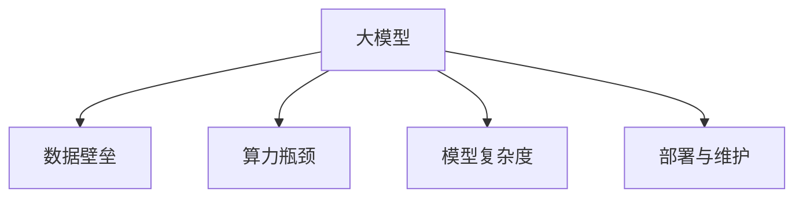

                 

# 大模型时代创业新挑战：数据壁垒与算力瓶颈

在当前的大模型时代，AI技术正以前所未有的速度改变各行各业的面貌。从自然语言处理到计算机视觉，从语音识别到机器人学习，AI在各个领域的创新突破不仅改变了产品的核心竞争力，也重塑了商业模式的边界。然而，随着大模型技术的发展，数据壁垒和算力瓶颈成为了创业者不得不面对的新挑战。本文将深入探讨这些问题，并提供一些解决方案，帮助创业团队在大模型时代取得成功。

## 1. 背景介绍

### 1.1 问题由来
随着深度学习和大模型的发展，越来越多的AI初创公司涌现出来。这些公司依赖于高性能的AI算法和模型来驱动业务增长。然而，在大模型时代，数据和算力成为了新一轮的“创富密码”。尽管AI技术本身可以极大地提升工作效率，但获取高质量数据和高效能算力却成为了初创公司面临的首要挑战。

### 1.2 问题核心关键点
数据壁垒和算力瓶颈主要体现在以下几个方面：
- **数据获取难度**：高质量的标注数据对模型的训练至关重要。但数据获取成本高、隐私保护要求严格，使得许多创业公司难以获取足够的数据。
- **算力成本高昂**：大模型的训练和推理需要强大的计算资源，高性能GPU、TPU等设备价格昂贵，使用成本高。
- **模型复杂度增加**：随着大模型的发展，模型的复杂度不断增加，对计算资源的要求也随之提升。
- **部署与维护困难**：大模型部署到实际应用环境中，需要考虑模型的可解释性、可维护性、可扩展性等综合因素，增加了部署和维护的复杂度。

这些问题的存在，不仅影响了创业公司的盈利能力，也限制了AI技术的广泛应用。因此，创业者在构建AI系统时，必须从数据和算力入手，进行全面的规划和优化。

## 2. 核心概念与联系

### 2.1 核心概念概述

为更好地理解大模型时代的数据壁垒与算力瓶颈问题，本节将介绍几个核心概念：

- **大模型(Large Model)**：以BERT、GPT、T5等深度学习模型为代表的大规模预训练模型。大模型具有强大的表征学习能力，但需要大量数据和计算资源进行训练和推理。
- **数据壁垒(Data Barrier)**：指由于数据获取难度大、数据质量要求高、数据隐私保护等问题，导致数据难以有效获取和使用的现象。
- **算力瓶颈(Computational Bottleneck)**：指由于高性能计算资源（如GPU、TPU）价格昂贵、计算能力有限、能耗问题等，导致模型训练和推理速度受限的问题。
- **模型复杂度(Complexity)**：指模型的参数量、结构复杂度等。大模型的复杂度提升通常会导致计算资源需求的增加。
- **部署与维护(DevOps)**：指将大模型部署到实际应用环境中，并对其进行有效的管理和维护。

这些核心概念之间的逻辑关系可以通过以下Mermaid流程图来展示：



这个流程图展示了数据、算力、复杂度和部署维护在大模型中的应用关系：

1. 大模型的预训练和微调需要大量的数据和计算资源。
2. 数据壁垒和算力瓶颈限制了数据获取和计算资源的获取，进而影响了模型训练的效率和质量。
3. 模型的复杂度决定了对计算资源的需求。
4. 部署与维护的复杂度随模型复杂度的提升而增加。

这些概念共同构成了大模型时代的创业挑战，需要我们深入研究和解决。

## 3. 核心算法原理 & 具体操作步骤
### 3.1 算法原理概述

在大模型时代，数据壁垒和算力瓶颈的核心在于如何解决数据获取难和计算资源昂贵的问题。为此，我们提出了基于分布式计算和数据生成的方法，通过优化数据和算力的获取方式，来降低创业的门槛。

### 3.2 算法步骤详解

#### 3.2.1 数据获取优化

1. **公共数据集的使用**：积极利用公开的NLP、计算机视觉等领域的标准数据集，如GLUE、ImageNet等，进行模型训练和验证。
2. **半监督学习**：在标注数据不足的情况下，采用半监督学习方法，通过少量标注数据和大量未标注数据共同训练模型。
3. **数据增强**：对已有数据进行各种变换，如旋转、平移、缩放等，生成更多的训练样本。
4. **众包平台**：利用众包平台（如Amazon Mechanical Turk），从大众获取标注数据，降低标注成本。

#### 3.2.2 算力获取优化

1. **云计算平台**：利用亚马逊AWS、谷歌云等云服务平台提供的GPU、TPU等计算资源，按需使用，降低硬件成本。
2. **分布式训练**：将模型分布到多台机器上进行并行训练，提高训练速度。
3. **模型压缩**：采用模型压缩技术（如知识蒸馏、剪枝等），减小模型参数量，降低计算资源需求。
4. **混合精度训练**：使用混合精度训练技术，降低计算资源消耗。

### 3.3 算法优缺点

**基于分布式计算和数据生成的方法，具有以下优点：**
1. **降低成本**：通过共享公共数据集和云计算平台资源，降低了数据和算力的获取成本。
2. **提高效率**：通过数据增强、分布式训练等技术，提高了模型训练的效率。
3. **可扩展性**：可以灵活调整数据和算力的使用规模，适应不同的业务需求。

**但该方法也存在以下缺点：**
1. **数据质量不稳定**：依赖公开数据集和众包平台，数据质量可能存在不稳定因素。
2. **算力利用率低**：分布式训练中，硬件资源的利用率可能较低。
3. **模型压缩效果有限**：模型压缩技术的实际效果与模型的复杂度和参数量密切相关。

尽管存在这些局限性，但通过合理利用分布式计算和数据生成技术，可以在很大程度上缓解数据壁垒和算力瓶颈，提升创业公司的竞争力。

### 3.4 算法应用领域

基于分布式计算和数据生成的方法，已在多个领域得到了广泛应用：

1. **自然语言处理**：利用公共语料库进行模型预训练和微调，如BERT、GPT-2等。
2. **计算机视觉**：通过ImageNet等公开数据集进行模型训练，显著提升图像识别和分类性能。
3. **医疗影像**：结合医疗机构的数据资源，进行医学影像的自动分析诊断，提高医疗效率。
4. **金融风控**：利用公共数据集进行信用评分模型训练，提升风险评估的准确性。
5. **智能制造**：通过物联网设备采集数据，进行智能化的生产线管理和质量检测。

这些应用领域展示了基于分布式计算和数据生成方法的强大潜力，为初创公司提供了丰富的业务方向。

## 4. 数学模型和公式 & 详细讲解  
### 4.1 数学模型构建

在大模型时代，创业公司需要构建高性能的AI系统，以便在大数据和计算资源的驱动下，提升业务表现。

设大模型为 $M_\theta$，其中 $\theta$ 为模型参数。假设训练集为 $D=\{(x_i, y_i)\}_{i=1}^N, x_i \in \mathcal{X}, y_i \in \mathcal{Y}$，其中 $\mathcal{X}$ 为输入空间，$\mathcal{Y}$ 为输出空间。

模型在大规模数据集上的损失函数为 $\mathcal{L}(\theta) = \frac{1}{N} \sum_{i=1}^N \ell(M_{\theta}(x_i),y_i)$，其中 $\ell$ 为损失函数，如交叉熵损失。

### 4.2 公式推导过程

假设在训练集中每个样本 $x_i$ 的损失为 $\ell_i$，则经验风险为：

$$
\mathcal{L}(\theta) = \frac{1}{N} \sum_{i=1}^N \ell_i(M_{\theta}(x_i))
$$

模型的优化目标是寻找最优参数 $\hat{\theta}$，使得 $\mathcal{L}(\hat{\theta})$ 最小。通过梯度下降等优化算法，模型参数更新公式为：

$$
\theta \leftarrow \theta - \eta \nabla_{\theta}\mathcal{L}(\theta)
$$

其中 $\eta$ 为学习率，$\nabla_{\theta}\mathcal{L}(\theta)$ 为损失函数对模型参数的梯度。

### 4.3 案例分析与讲解

以BERT模型为例，其基于Transformer架构，通过掩码语言模型和下一句预测任务进行预训练。假设训练集为 $\{(x_i, y_i)\}_{i=1}^N$，其中 $x_i$ 为输入文本，$y_i$ 为掩码或下一句预测标签。

BERT的损失函数定义为：

$$
\mathcal{L}(\theta) = \frac{1}{N} \sum_{i=1}^N \ell_i(BERT_\theta(x_i))
$$

其中 $\ell_i$ 为掩码或下一句预测任务的损失函数。在实际应用中，BERT通常用于下游任务，如文本分类、命名实体识别等，通过在预训练模型的基础上微调特定输出层，获得更好的性能。

## 5. 项目实践：代码实例和详细解释说明
### 5.1 开发环境搭建

在进行大模型项目开发前，需要准备以下开发环境：

1. **环境准备**：安装Python和PyTorch等深度学习框架，准备必要的开发环境。
2. **数据准备**：收集并标注训练集、验证集和测试集，保证数据质量。
3. **硬件准备**：配置高性能计算资源，如GPU、TPU等，以满足大模型的计算需求。

### 5.2 源代码详细实现

以下是利用PyTorch实现BERT模型的代码示例：

```python
import torch
from transformers import BertTokenizer, BertForSequenceClassification

# 数据准备
tokenizer = BertTokenizer.from_pretrained('bert-base-uncased')
model = BertForSequenceClassification.from_pretrained('bert-base-uncased', num_labels=2)

# 模型训练
device = torch.device("cuda" if torch.cuda.is_available() else "cpu")
model.to(device)
optimizer = torch.optim.Adam(model.parameters(), lr=2e-5)

# 训练过程
for epoch in range(3):
    for batch in train_loader:
        input_ids = batch['input_ids'].to(device)
        attention_mask = batch['attention_mask'].to(device)
        labels = batch['labels'].to(device)
        model.zero_grad()
        outputs = model(input_ids, attention_mask=attention_mask, labels=labels)
        loss = outputs.loss
        loss.backward()
        optimizer.step()
```

### 5.3 代码解读与分析

**数据准备**：
- `BertTokenizer.from_pretrained`：从预训练模型中加载分词器。
- `BertForSequenceClassification.from_pretrained`：从预训练模型中加载分类器，指定标签数。

**模型训练**：
- `device`：判断是否使用GPU进行训练，并设置训练设备。
- `optimizer`：定义优化器，如AdamW。
- `for loop`：遍历训练集，进行前向传播和反向传播，更新模型参数。

**训练过程**：
- `model.zero_grad()`：清零梯度，准备进行新的前向传播。
- `model(input_ids, attention_mask=attention_mask, labels=labels)`：前向传播计算输出。
- `loss`：计算损失函数，如交叉熵。
- `loss.backward()`：反向传播计算梯度。
- `optimizer.step()`：更新模型参数。

通过上述代码，我们可以快速搭建一个简单的BERT分类器，并进行训练。在实际应用中，还需要进一步优化训练过程，如引入数据增强、分布式训练等技术。

### 5.4 运行结果展示

在训练完成后，可以使用以下代码进行验证和测试：

```python
# 验证过程
model.eval()
with torch.no_grad():
    eval_loss = 0
    for batch in dev_loader:
        input_ids = batch['input_ids'].to(device)
        attention_mask = batch['attention_mask'].to(device)
        labels = batch['labels'].to(device)
        outputs = model(input_ids, attention_mask=attention_mask)
        eval_loss += outputs.loss
    print(f"Validation Loss: {eval_loss/len(dev_loader):.4f}")

# 测试过程
model.eval()
with torch.no_grad():
    test_loss = 0
    correct = 0
    for batch in test_loader:
        input_ids = batch['input_ids'].to(device)
        attention_mask = batch['attention_mask'].to(device)
        labels = batch['labels'].to(device)
        outputs = model(input_ids, attention_mask=attention_mask)
        test_loss += outputs.loss
        predictions = outputs.logits.argmax(dim=1)
        correct += (predictions == labels).sum().item()
    print(f"Test Loss: {test_loss/len(test_loader):.4f}")
    print(f"Accuracy: {correct/len(test_loader):.4f}")
```

以上代码展示了验证和测试的过程，可以评估模型的性能和泛化能力。

## 6. 实际应用场景
### 6.1 智能客服系统

智能客服系统在大模型时代具有广阔的应用前景。传统客服模式存在响应时间长、人力资源成本高、问题解答质量参差不齐等问题。基于大模型的微调技术，可以构建7x24小时不间断的智能客服系统，快速响应客户咨询，并提供更精准的解答。

**数据获取**：
- 收集客服对话记录，标注问题和答案，构建监督数据集。
- 利用众包平台获取更多的标注数据，提高数据质量。

**算力获取**：
- 利用云平台提供的GPU资源，进行分布式训练。
- 使用知识蒸馏技术，压缩模型参数，减少计算资源需求。

**部署与维护**：
- 将模型部署到服务器上，使用微服务架构进行系统扩展和优化。
- 建立完善的监控和维护机制，确保系统的稳定性和可靠性。

### 6.2 金融风控

金融行业对风险评估的需求日益增加，传统的基于规则的信用评分系统已经无法满足日益复杂化的业务需求。大模型技术在金融风控领域具有广阔的应用前景。

**数据获取**：
- 收集用户的各类交易数据、信用记录、行为数据等，构建数据集。
- 利用半监督学习技术，提高数据质量，降低标注成本。

**算力获取**：
- 利用高性能计算资源，进行大规模模型的训练和推理。
- 使用分布式训练技术，提高训练速度。

**部署与维护**：
- 将模型部署到云平台上，进行实时计算和推理。
- 建立模型更新机制，定期重新训练模型，保持模型的性能。

### 6.3 医疗影像分析

医疗影像分析是大模型在医疗领域的重要应用之一。传统的影像分析依赖于医生的经验和专业知识，耗时长、成本高。大模型技术可以自动化地进行影像诊断，提高医疗效率。

**数据获取**：
- 收集大量的医疗影像数据，并标注相应的诊断结果。
- 利用众包平台获取更多的标注数据，提高数据质量。

**算力获取**：
- 利用高性能计算资源，进行大规模模型的训练和推理。
- 使用分布式训练技术，提高训练速度。

**部署与维护**：
- 将模型部署到医院服务器上，进行实时计算和推理。
- 建立模型更新机制，定期重新训练模型，保持模型的性能。

### 6.4 未来应用展望

随着大模型技术的不断进步，未来在更多领域将会出现新的应用场景，具体包括：

1. **智能制造**：结合物联网设备采集的数据，进行智能化的生产线管理和质量检测。
2. **智慧城市**：利用传感器和大数据，进行城市事件的监测和应急响应。
3. **农业智能化**：通过无人机和传感器采集的数据，进行智能化的农业管理。
4. **教育培训**：结合教育领域的数据，进行个性化学习和智能辅导。
5. **智慧物流**：利用传感器和大数据，进行智能化的物流管理和配送。

这些应用场景展示了大模型技术的广泛应用潜力，为初创公司提供了丰富的业务方向。

## 7. 工具和资源推荐
### 7.1 学习资源推荐

为了帮助创业者系统掌握大模型时代的技术和方法，这里推荐一些优质的学习资源：

1. **Coursera的深度学习课程**：斯坦福大学、MIT等知名高校提供的深度学习课程，涵盖从基础到高级的深度学习知识，适合初学者和进阶者学习。
2. **GitHub上的开源项目**：通过GitHub上的开源项目，了解大模型的最新研究进展和实现细节。
3. **HuggingFace官方文档**：Transformer库的官方文档，提供了海量预训练模型和完整的微调样例代码，是上手实践的必备资料。
4. **书籍**：《深度学习》《Python深度学习》《TensorFlow实战》等经典书籍，详细介绍了深度学习的基础知识和实践技巧。
5. **在线课程**：Udacity、edX等平台上的深度学习课程，提供系统化的学习路径和实战项目。

### 7.2 开发工具推荐

高效的开发离不开优秀的工具支持。以下是几款用于大模型开发和微调推荐的工具：

1. **PyTorch**：基于Python的开源深度学习框架，灵活动态的计算图，适合快速迭代研究。
2. **TensorFlow**：由Google主导开发的开源深度学习框架，生产部署方便，适合大规模工程应用。
3. **Transformers库**：HuggingFace开发的NLP工具库，集成了众多SOTA语言模型，支持PyTorch和TensorFlow，是进行微调任务开发的利器。
4. **Jupyter Notebook**：支持Python代码的交互式编程，适合进行研究和实验。
5. **Git**：版本控制系统，方便团队协作和代码管理。

### 7.3 相关论文推荐

大模型时代的研究前沿不断涌现，以下是几篇奠基性的相关论文，推荐阅读：

1. **Attention is All You Need**：提出Transformer结构，开启了NLP领域的预训练大模型时代。
2. **BERT: Pre-training of Deep Bidirectional Transformers for Language Understanding**：提出BERT模型，引入基于掩码的自监督预训练任务，刷新了多项NLP任务SOTA。
3. **Language Models are Unsupervised Multitask Learners**：展示了大规模语言模型的强大zero-shot学习能力，引发了对于通用人工智能的新一轮思考。
4. **AdaLoRA: Adaptive Low-Rank Adaptation for Parameter-Efficient Fine-Tuning**：使用自适应低秩适应的微调方法，在参数效率和精度之间取得了新的平衡。
5. **A Survey on Transfer Learning with Multi-Task Learning for NLP**：总结了多任务学习在大模型微调中的应用，提供了丰富的研究方向和实现技巧。

这些论文代表了大模型微调技术的发展脉络。通过学习这些前沿成果，可以帮助研究者把握学科前进方向，激发更多的创新灵感。

## 8. 总结：未来发展趋势与挑战
### 8.1 研究成果总结

大模型时代的数据壁垒和算力瓶颈问题，虽然给创业者带来了挑战，但也提供了新的机遇。通过优化数据获取和算力使用，可以在很大程度上降低创业成本，提升模型的性能和效率。

### 8.2 未来发展趋势

展望未来，大模型时代的数据壁垒和算力瓶颈问题将得到进一步解决：

1. **开源数据集的丰富**：更多的开源数据集和标准将进一步降低数据获取成本。
2. **云平台的发展**：云计算平台提供的计算资源将越来越丰富，使用成本将不断降低。
3. **分布式计算的普及**：分布式计算技术将进一步成熟，支持更大规模模型的训练和推理。
4. **模型压缩和优化**：新的模型压缩和优化技术将不断提高模型的计算效率和资源利用率。
5. **智能基础设施建设**：智能基础设施的建设将为AI技术提供更加高效的运行环境。

### 8.3 面临的挑战

尽管大模型时代的数据壁垒和算力瓶颈问题正在逐步得到解决，但仍面临以下挑战：

1. **数据隐私和安全性**：高质量的数据获取和保护面临着隐私泄露和安全性的风险。
2. **计算资源的不均衡**：计算资源的分布不均衡将导致大模型的训练和推理不平衡。
3. **模型复杂度与效率的平衡**：如何在大模型的复杂度和计算效率之间找到平衡点，仍需不断探索。
4. **算力资源的高成本**：高性能计算资源的获取和维护成本仍然较高。
5. **模型的可解释性**：大模型的黑盒特性给其可解释性带来了挑战。

### 8.4 研究展望

为了应对大模型时代的数据壁垒和算力瓶颈问题，未来的研究需要在以下几个方面寻求新的突破：

1. **分布式计算**：进一步优化分布式计算框架，提高资源利用率和训练速度。
2. **模型压缩**：开发更加高效的模型压缩技术，减小模型参数量和计算资源需求。
3. **数据生成**：利用生成对抗网络等技术，生成高质量的训练数据。
4. **计算资源优化**：研究新的计算资源优化技术，降低使用成本。
5. **模型可解释性**：开发可解释性强的模型，提高模型的透明度和可信度。

这些研究方向的探索，必将引领大模型微调技术迈向更高的台阶，为构建安全、可靠、可解释、可控的智能系统铺平道路。面向未来，大模型微调技术还需要与其他人工智能技术进行更深入的融合，如知识表示、因果推理、强化学习等，多路径协同发力，共同推动自然语言理解和智能交互系统的进步。只有勇于创新、敢于突破，才能不断拓展语言模型的边界，让智能技术更好地造福人类社会。

## 9. 附录：常见问题与解答

**Q1：大模型微调是否适用于所有NLP任务？**

A: 大模型微调在大多数NLP任务上都能取得不错的效果，特别是对于数据量较小的任务。但对于一些特定领域的任务，如医学、法律等，仅仅依靠通用语料预训练的模型可能难以很好地适应。此时需要在特定领域语料上进一步预训练，再进行微调，才能获得理想效果。此外，对于一些需要时效性、个性化很强的任务，如对话、推荐等，微调方法也需要针对性的改进优化。

**Q2：如何缓解微调过程中的过拟合问题？**

A: 过拟合是微调面临的主要挑战，尤其是在标注数据不足的情况下。常见的缓解策略包括：
1. 数据增强：通过回译、近义替换等方式扩充训练集
2. 正则化：使用L2正则、Dropout、Early Stopping等避免过拟合
3. 对抗训练：引入对抗样本，提高模型鲁棒性
4. 参数高效微调：只调整少量参数(如Adapter、Prefix等)，减小过拟合风险
5. 多模型集成：训练多个微调模型，取平均输出，抑制过拟合

这些策略往往需要根据具体任务和数据特点进行灵活组合。只有在数据、模型、训练、推理等各环节进行全面优化，才能最大限度地发挥大模型微调的威力。

**Q3：大模型在部署时需要注意哪些问题？**

A: 将大模型部署到实际应用环境中，还需要考虑以下因素：
1. 模型裁剪：去除不必要的层和参数，减小模型尺寸，加快推理速度
2. 量化加速：将浮点模型转为定点模型，压缩存储空间，提高计算效率
3. 服务化封装：将模型封装为标准化服务接口，便于集成调用
4. 弹性伸缩：根据请求流量动态调整资源配置，平衡服务质量和成本
5. 监控告警：实时采集系统指标，设置异常告警阈值，确保服务稳定性
6. 安全防护：采用访问鉴权、数据脱敏等措施，保障数据和模型安全

大模型微调为NLP应用开启了广阔的想象空间，但如何将强大的性能转化为稳定、高效、安全的业务价值，还需要工程实践的不断打磨。唯有从数据、算法、工程、业务等多个维度协同发力，才能真正实现人工智能技术在垂直行业的规模化落地。

总之，在大模型时代，创业者需要深入理解数据壁垒和算力瓶颈问题，积极探索分布式计算、数据生成、模型压缩等技术，才能在激烈的竞争中脱颖而出。未来，随着大模型技术的不断进步，数据壁垒和算力瓶颈问题将得到进一步解决，为人工智能技术的普及和发展提供更加坚实的基础。

---

作者：禅与计算机程序设计艺术 / Zen and the Art of Computer Programming

