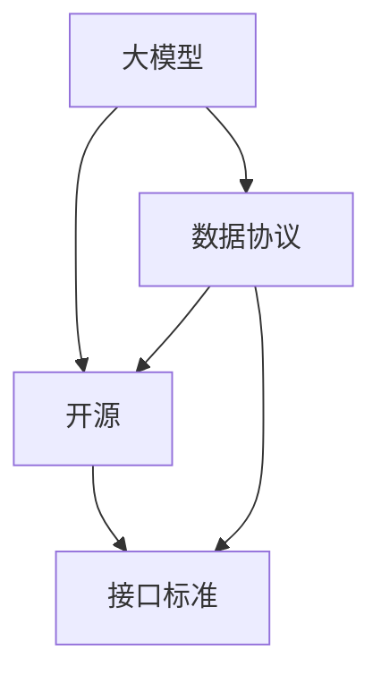

                 

# 大模型时代的开源与数据协议

## 1. 背景介绍

### 1.1 问题由来
在人工智能（AI）领域，特别是深度学习模型，开源数据和算法资源已经成为推动技术进步和应用落地的重要驱动力。大模型时代的到来，更凸显了数据协议与开源生态的重要性。大模型需要海量、高质量的数据进行训练，而不同领域的数据格式、标注方式各异，开源协议和大模型接口的统一性显得尤为重要。同时，大模型的开源实践也促进了数据共享和协作，加速了AI技术的普及和创新。

### 1.2 问题核心关键点
本文章将重点探讨在大模型时代，开源数据协议与大模型接口标准的重要性。通过统一的协议和接口，解决数据格式不统一、模型使用不便等问题，推动AI技术的标准化和普及。主要关注以下几点：
- 数据协议对大模型训练的影响
- 开源大模型的接口标准及其重要性
- 数据协议和接口标准如何推动AI技术发展
- 数据协议和接口标准面临的挑战与对策

## 2. 核心概念与联系

### 2.1 核心概念概述

本节将介绍几个关键概念，帮助读者理解数据协议与大模型接口标准的核心原理和架构：

- **大模型（Large Models）**：指使用深度学习技术训练得到的参数量庞大的模型，如GPT-3、BERT等。这些模型能够执行复杂的自然语言处理任务。
- **数据协议（Data Protocol）**：指对数据进行规范化的处理和标注，以保证不同数据源之间的数据格式和质量一致性。例如，SQuAD数据集提供了统一的文档-问题和答案格式。
- **开源（Open Source）**：指将软件和数据源公开，供任何人免费使用和修改。开源促进了技术共享和协作，加速了技术创新。
- **接口标准（API Standards）**：指大模型的API设计规范，包括输入输出格式、参数规范、调用方式等。统一的接口标准使得大模型易于集成和使用。

这些核心概念之间的逻辑关系可以通过以下Mermaid流程图来展示：



这个流程图展示了大模型、数据协议和接口标准之间的内在联系：

1. 大模型基于标准化的数据协议进行训练。
2. 开源实践通过共享数据和代码，加速技术创新。
3. 统一的接口标准使得大模型易于集成和使用。

## 3. 核心算法原理 & 具体操作步骤

### 3.1 算法原理概述

在大模型时代，数据协议和接口标准对大模型的训练、使用和部署至关重要。以下是一些关键点：

- **数据协议**：保证数据格式的一致性，使得模型能够顺利处理输入数据。例如，使用BERT进行情感分析时，需要保证训练数据和测试数据的格式一致。
- **接口标准**：定义大模型的输入输出格式、参数规范等，使得模型能够与不同的应用和平台无缝集成。例如，GPT-3提供了多种调用接口，支持不同的编程语言和框架。

### 3.2 算法步骤详解

以下是实现数据协议和接口标准的一般步骤：

1. **数据标准化**：定义数据协议，统一数据格式和标注方式。例如，GLUE数据集提供了一致的数据格式规范。
2. **模型接口设计**：定义接口标准，包括API设计、参数规范、调用方式等。例如，HuggingFace的Transformers库提供统一的API接口，支持多种语言和框架。
3. **开放资源共享**：通过开源平台，分享数据集、模型和代码。例如，GitHub和Kaggle提供了丰富的开源资源，供开发者免费使用。
4. **社区协作**：建立社区，促进开发者之间的交流和协作。例如，HuggingFace社区提供丰富的技术支持和发展资源。

### 3.3 算法优缺点

**数据协议的优点**：
- 统一数据格式，确保不同数据源之间的数据一致性。
- 促进数据共享和协作，加速技术创新。

**数据协议的缺点**：
- 可能会限制数据的灵活性，需要统一的标准可能会导致数据多样性的丧失。

**接口标准的优点**：
- 统一接口设计，使得模型易于集成和使用。
- 提供丰富的功能接口，满足不同应用场景的需求。

**接口标准的缺点**：
- 可能会限制模型的灵活性，固定的接口标准难以适应不同的需求。

### 3.4 算法应用领域

数据协议和接口标准在AI领域的多个应用领域都有广泛应用：

- **自然语言处理（NLP）**：例如，GLUE数据集提供了统一的数据格式，使得多个NLP模型能够在同一标准上进行评测。
- **计算机视觉（CV）**：例如，ImageNet提供了统一的数据格式和标注标准，使得多个CV模型能够在同一标准上进行训练和测试。
- **语音识别**：例如，LibriSpeech提供了统一的数据格式，使得多个语音识别模型能够在同一标准上进行训练和评估。

## 4. 数学模型和公式 & 详细讲解

### 4.1 数学模型构建

为了更好地理解数据协议和接口标准，我们可以从数学角度进行一些探索。例如，考虑一个简单的二分类任务，其中数据协议和接口标准对模型的影响：

1. **数据协议**：假设我们有多个数据集，每个数据集包含一些文本和对应的标签。我们需要对这些数据集进行标准化处理，使得每个数据集的数据格式一致。例如，将所有文本转换成统一的格式，将所有标签转换成统一的编码方式。

2. **接口标准**：假设我们有一个模型，可以接受输入数据并输出预测结果。我们需要定义模型的API接口，使得模型能够接受不同格式的数据输入，并输出一致的预测结果。例如，模型需要支持不同长度的输入文本，并能够处理不同编码方式的数字标签。

### 4.2 公式推导过程

以下是一个简单的二分类任务的数据协议和接口标准推导过程：

1. **数据协议推导**：假设我们有多个数据集，每个数据集包含一些文本和对应的标签。我们需要对这些数据集进行标准化处理，使得每个数据集的数据格式一致。例如，将所有文本转换成统一的格式，将所有标签转换成统一的编码方式。这可以通过以下公式实现：
   $$
   \text{processed\_data} = \text{preprocess}(\text{raw\_data})
   $$
   其中，$\text{preprocess}$是数据预处理函数，将原始数据$\text{raw\_data}$转换成标准格式$\text{processed\_data}$。

2. **接口标准推导**：假设我们有一个模型，可以接受输入数据并输出预测结果。我们需要定义模型的API接口，使得模型能够接受不同格式的数据输入，并输出一致的预测结果。例如，模型需要支持不同长度的输入文本，并能够处理不同编码方式的数字标签。这可以通过以下公式实现：
   $$
   \text{predictions} = \text{model}(\text{input\_data})
   $$
   其中，$\text{input\_data}$是模型输入数据，$\text{predictions}$是模型预测结果。

### 4.3 案例分析与讲解

以下是一个简单的二分类任务的案例分析：

1. **数据协议案例**：假设我们有两个数据集，一个包含新闻文本和对应的情感标签，另一个包含电影评论文本和对应的情感标签。我们需要对这些数据集进行标准化处理，使得每个数据集的数据格式一致。例如，将所有文本转换成统一的格式，将所有标签转换成统一的编码方式。这可以通过以下代码实现：
   ```python
   def preprocess(text):
       # 对文本进行标准化处理
       return processed_text
   
   # 标准化数据集
   dataset1 = preprocess(dataset1)
   dataset2 = preprocess(dataset2)
   ```

2. **接口标准案例**：假设我们有一个模型，可以接受输入数据并输出预测结果。我们需要定义模型的API接口，使得模型能够接受不同格式的数据输入，并输出一致的预测结果。例如，模型需要支持不同长度的输入文本，并能够处理不同编码方式的数字标签。这可以通过以下代码实现：
   ```python
   class Model:
       def __init__(self):
           # 初始化模型参数
           
       def predict(self, input_data):
           # 处理输入数据，并返回预测结果
           return predictions
   ```

## 5. 项目实践：代码实例和详细解释说明

### 5.1 开发环境搭建

在进行数据协议和接口标准实践前，我们需要准备好开发环境。以下是使用Python进行PyTorch开发的环境配置流程：

1. 安装Anaconda：从官网下载并安装Anaconda，用于创建独立的Python环境。

2. 创建并激活虚拟环境：
```bash
conda create -n pytorch-env python=3.8 
conda activate pytorch-env
```

3. 安装PyTorch：根据CUDA版本，从官网获取对应的安装命令。例如：
```bash
conda install pytorch torchvision torchaudio cudatoolkit=11.1 -c pytorch -c conda-forge
```

4. 安装Transformers库：
```bash
pip install transformers
```

5. 安装各类工具包：
```bash
pip install numpy pandas scikit-learn matplotlib tqdm jupyter notebook ipython
```

完成上述步骤后，即可在`pytorch-env`环境中开始数据协议和接口标准的实践。

### 5.2 源代码详细实现

这里我们以一个简单的二分类任务为例，给出使用Transformers库实现数据协议和接口标准的代码实现。

首先，定义数据协议，将输入数据标准化：

```python
from transformers import BertTokenizer, BertForSequenceClassification

class Standardizer:
    def __init__(self, tokenizer):
        self.tokenizer = tokenizer
        
    def preprocess(self, text):
        # 对文本进行标准化处理
        return processed_text
```

然后，定义接口标准，实现模型预测：

```python
class Model:
    def __init__(self, model_path):
        # 加载模型和分词器
        self.model = BertForSequenceClassification.from_pretrained(model_path)
        self.tokenizer = BertTokenizer.from_pretrained(model_path)
        
    def predict(self, input_data):
        # 处理输入数据，并返回预测结果
        tokens = self.tokenizer(input_data, return_tensors='pt')
        outputs = self.model(**tokens)
        logits = outputs.logits
        predictions = logits.argmax(dim=1).item()
        return predictions
```

### 5.3 代码解读与分析

让我们再详细解读一下关键代码的实现细节：

**Standardizer类**：
- `__init__`方法：初始化分词器。
- `preprocess`方法：对输入文本进行标准化处理，例如转换为小写、去除标点符号等。

**Model类**：
- `__init__`方法：加载模型和分词器。
- `predict`方法：处理输入数据，并返回预测结果。首先使用分词器将输入数据转换为token ids，然后输入模型，并返回预测结果。

可以看到，通过简单的代码实现，我们定义了一个数据协议和接口标准，使得大模型易于使用和集成。

## 6. 实际应用场景

### 6.1 智能客服系统

在大模型时代，基于数据协议和接口标准的智能客服系统能够实现更高效、更智能的客户服务。通过标准化客户服务数据，使得不同数据源之间的数据一致性，使得智能客服模型能够更好地理解客户需求，提供个性化服务。

### 6.2 金融舆情监测

在金融领域，基于数据协议和接口标准的金融舆情监测系统能够实现更及时、更准确的舆情分析。通过标准化金融数据，使得不同数据源之间的数据一致性，使得舆情监测模型能够更好地理解舆情变化趋势，及时发现和应对潜在风险。

### 6.3 个性化推荐系统

在电商和娱乐领域，基于数据协议和接口标准的个性化推荐系统能够实现更精准、更个性化的商品或内容推荐。通过标准化用户行为数据，使得不同数据源之间的数据一致性，使得推荐模型能够更好地理解用户偏好，提供个性化推荐服务。

### 6.4 未来应用展望

随着数据协议和接口标准的应用普及，未来AI技术将更加标准化和普及化。以下是大模型时代数据协议和接口标准的未来应用展望：

1. **跨领域应用**：数据协议和接口标准能够推动AI技术在更多领域的应用，如医疗、教育、智慧城市等。通过标准化数据和接口，使得不同领域之间的数据和模型可以无缝集成和共享。

2. **行业标准制定**：数据协议和接口标准将成为行业标准，推动AI技术在各行业的规范化和普及化。例如，金融行业将制定统一的数据协议和接口标准，推动金融舆情监测系统的普及和升级。

3. **全球协作**：数据协议和接口标准能够促进全球协作，加速AI技术的普及和创新。例如，各国数据标准和接口标准的统一，将推动全球范围内的AI技术交流和合作。

## 7. 工具和资源推荐

### 7.1 学习资源推荐

为了帮助开发者系统掌握数据协议和接口标准的理论基础和实践技巧，这里推荐一些优质的学习资源：

1. **《TensorFlow官方文档》**：提供丰富的API接口和数据协议文档，是学习数据协议和接口标准的重要参考资料。

2. **《深度学习入门》**：由知名AI专家李航教授所写，详细介绍了深度学习的基础知识，包括数据协议和接口标准的原理和应用。

3. **Kaggle**：提供丰富的开源数据集和数据协议，供开发者学习和实践。

4. **HuggingFace官方文档**：提供丰富的Transformers库API接口和数据协议文档，是学习数据协议和接口标准的重要参考资料。

5. **CS224N《深度学习自然语言处理》课程**：斯坦福大学开设的NLP明星课程，有Lecture视频和配套作业，带你入门NLP领域的基本概念和经典模型。

通过对这些资源的学习实践，相信你一定能够快速掌握数据协议和接口标准的精髓，并用于解决实际的NLP问题。

### 7.2 开发工具推荐

高效的开发离不开优秀的工具支持。以下是几款用于数据协议和接口标准开发的常用工具：

1. **PyTorch**：基于Python的开源深度学习框架，灵活动态的计算图，适合快速迭代研究。

2. **TensorFlow**：由Google主导开发的开源深度学习框架，生产部署方便，适合大规模工程应用。

3. **HuggingFace**：提供丰富的Transformers库和数据协议，支持PyTorch和TensorFlow，是进行数据协议和接口标准开发的利器。

4. **GitHub**：提供丰富的开源资源和协作工具，方便开发者分享和集成代码。

5. **Kaggle**：提供丰富的开源数据集和数据协议，供开发者学习和实践。

合理利用这些工具，可以显著提升数据协议和接口标准的开发效率，加快创新迭代的步伐。

### 7.3 相关论文推荐

数据协议和接口标准的研究源于学界的持续研究。以下是几篇奠基性的相关论文，推荐阅读：

1. **Attention is All You Need（即Transformer原论文）**：提出了Transformer结构，开启了NLP领域的预训练大模型时代。

2. **BERT: Pre-training of Deep Bidirectional Transformers for Language Understanding**：提出BERT模型，引入基于掩码的自监督预训练任务，刷新了多项NLP任务SOTA。

3. **Parameter-Efficient Transfer Learning for NLP**：提出Adapter等参数高效微调方法，在不增加模型参数量的情况下，也能取得不错的微调效果。

4. **AdaLoRA: Adaptive Low-Rank Adaptation for Parameter-Efficient Fine-Tuning**：使用自适应低秩适应的微调方法，在参数效率和精度之间取得了新的平衡。

这些论文代表了大模型微调技术的发展脉络。通过学习这些前沿成果，可以帮助研究者把握学科前进方向，激发更多的创新灵感。

## 8. 总结：未来发展趋势与挑战

### 8.1 总结

本文对数据协议和接口标准在大模型时代的价值进行了全面系统的介绍。首先阐述了数据协议和接口标准的研究背景和意义，明确了数据协议和接口标准在大模型训练、使用和部署中的重要作用。其次，从原理到实践，详细讲解了数据协议和接口标准的数学原理和关键步骤，给出了数据协议和接口标准任务开发的完整代码实例。同时，本文还广泛探讨了数据协议和接口标准在多个行业领域的应用前景，展示了数据协议和接口标准技术的巨大潜力。

通过本文的系统梳理，可以看到，数据协议和接口标准在大模型时代扮演着至关重要的角色，极大地提升了模型的可训练性、可集成性和可扩展性。未来，伴随数据协议和接口标准的持续演进，相信AI技术必将在更广阔的应用领域大放异彩。

### 8.2 未来发展趋势

展望未来，数据协议和接口标准将呈现以下几个发展趋势：

1. **统一性提升**：未来数据协议和接口标准的统一性将进一步提升，跨领域、跨平台的应用将成为常态。例如，不同领域的API接口将逐渐统一，实现跨领域的模型共享和协作。

2. **灵活性增强**：未来数据协议和接口标准将更具灵活性，能够适应不同领域和应用场景的需求。例如，接口标准的参数规范和调用方式将更加灵活，适应不同任务的要求。

3. **生态完善**：未来数据协议和接口标准将形成更加完善的生态系统，包括开源社区、标准化组织、应用平台等。例如，HuggingFace社区将进一步壮大，提供更多的标准化资源和工具。

4. **全球协作**：未来数据协议和接口标准将促进全球协作，推动AI技术的普及和创新。例如，各国数据标准和接口标准的统一，将推动全球范围内的AI技术交流和合作。

以上趋势凸显了数据协议和接口标准的广阔前景。这些方向的探索发展，必将进一步推动AI技术的标准化和普及化，为构建安全、可靠、可解释、可控的智能系统铺平道路。

### 8.3 面临的挑战

尽管数据协议和接口标准已经取得了一定的成就，但在迈向更加智能化、普适化应用的过程中，它仍面临着诸多挑战：

1. **数据标准不一致**：不同领域的数据标准各异，统一数据标准仍需进一步探索。例如，医疗、金融等领域的标准化数据仍需进一步统一。

2. **接口复杂性增加**：大模型接口设计越来越复杂，需要兼顾多种应用场景的需求。例如，多模态大模型的接口设计将更加复杂。

3. **开源资源缺乏**：一些领域缺乏开放的数据资源和API接口，限制了大模型的应用推广。例如，一些垂直领域的开源资源仍需进一步丰富。

4. **模型安全性问题**：大模型可能会学习到有偏见、有害的信息，通过接口输出产生误导性、歧视性的输出。如何保证模型安全性，仍需进一步研究。

5. **伦理道德约束**：大模型的输出需要符合伦理道德要求，如何设计接口标准，限制有害信息的输出，仍需进一步研究。

6. **跨领域协作**：不同领域之间的数据和接口标准需要协调一致，实现跨领域的模型共享和协作。如何提高跨领域的协作效率，仍需进一步研究。

这些挑战需要学界和产业界的共同努力，积极应对并寻求突破，才能使数据协议和接口标准真正服务于AI技术的普及和创新。

### 8.4 研究展望

面对数据协议和接口标准所面临的种种挑战，未来的研究需要在以下几个方面寻求新的突破：

1. **跨领域数据协议**：探索跨领域的数据协议，统一不同领域的数据标准，推动跨领域的模型共享和协作。例如，设计统一的跨领域数据格式，实现不同领域之间的数据集成。

2. **灵活性增强**：开发更加灵活的数据协议和接口标准，适应不同领域和应用场景的需求。例如，设计灵活的API接口，适应不同任务的要求。

3. **安全性提升**：设计安全性更高的数据协议和接口标准，限制有害信息的输出。例如，设计安全性更高的数据协议，避免模型输出有害信息。

4. **跨领域协作**：推动跨领域的协作，建立跨领域的标准化组织和平台，推动数据共享和协作。例如，建立跨领域的标准化组织，推动跨领域的模型共享和协作。

5. **开源资源丰富**：丰富不同领域的开源资源，推动大模型在各领域的普及和应用。例如，丰富垂直领域的开源资源，推动大模型在各领域的普及和应用。

这些研究方向的探索，必将引领数据协议和接口标准技术迈向更高的台阶，为构建安全、可靠、可解释、可控的智能系统铺平道路。面向未来，数据协议和接口标准需要与其他人工智能技术进行更深入的融合，如知识表示、因果推理、强化学习等，多路径协同发力，共同推动自然语言理解和智能交互系统的进步。只有勇于创新、敢于突破，才能不断拓展数据协议和接口标准的边界，让智能技术更好地造福人类社会。

## 9. 附录：常见问题与解答

**Q1：数据协议和接口标准在大模型中的应用场景有哪些？**

A: 数据协议和接口标准在大模型中的应用场景非常广泛，主要包括以下几个方面：

1. **模型训练**：通过标准化训练数据和接口，使得大模型能够在不同的数据集上进行训练和优化。例如，GLUE数据集提供了一致的数据格式，使得多个NLP模型能够在同一标准上进行评测。

2. **模型推理**：通过标准化的API接口和输入输出格式，使得大模型能够在不同的平台上进行推理和部署。例如，HuggingFace的Transformers库提供统一的API接口，支持多种语言和框架。

3. **模型集成**：通过标准化的数据协议和接口标准，使得不同模型之间能够无缝集成和协作。例如，多个大模型可以通过标准化数据接口进行联合推理和决策。

4. **数据共享**：通过标准化的数据协议，促进数据共享和协作，加速数据驱动的AI技术发展。例如，Kaggle提供丰富的开源数据集和数据协议，供开发者学习和实践。

**Q2：如何设计标准化的数据协议？**

A: 设计标准化的数据协议需要考虑以下几个方面：

1. **数据格式**：定义数据的标准格式，例如文本、图像、音频等。例如，图像数据需要定义像素格式和尺寸，文本数据需要定义编码方式和分段。

2. **数据标注**：定义数据的标注标准，例如标签的编码方式和范围。例如，情感分类任务需要定义情感标签的编码方式和范围。

3. **数据处理**：定义数据预处理流程，例如数据增强、数据清洗等。例如，图像数据需要进行去噪、归一化等预处理。

4. **数据集划分**：定义数据集的分划方式，例如训练集、验证集和测试集。例如，GLUE数据集将数据集分为训练集和测试集。

**Q3：如何设计标准化的接口标准？**

A: 设计标准化的接口标准需要考虑以下几个方面：

1. **输入输出格式**：定义模型的输入输出格式，例如输入数据的类型和维度，输出结果的类型和格式。例如，BERT模型接受文本输入，输出预测结果的概率分布。

2. **参数规范**：定义模型的参数规范，例如参数的取值范围和数量。例如，BERT模型有12个Transformer层，每个层包含12个自注意力头。

3. **调用方式**：定义模型的调用方式，例如API接口的设计和调用方式。例如，HuggingFace的Transformers库提供多种API接口，支持不同的编程语言和框架。

4. **性能指标**：定义模型的性能指标，例如准确率、召回率等。例如，BERT模型在GLUE数据集上取得多项任务SOTA。

**Q4：大模型接口标准面临的挑战有哪些？**

A: 大模型接口标准面临的主要挑战包括：

1. **模型复杂性**：大模型的接口设计越来越复杂，需要兼顾多种应用场景的需求。例如，多模态大模型的接口设计将更加复杂。

2. **接口兼容性**：不同平台和框架的接口兼容性需要进一步提升，以实现无缝集成。例如，不同深度学习框架之间的接口兼容性需要进一步提升。

3. **接口安全性**：大模型的输出需要符合伦理道德要求，如何设计接口标准，限制有害信息的输出，仍需进一步研究。

4. **跨领域协作**：不同领域之间的接口标准需要协调一致，实现跨领域的模型共享和协作。例如，不同领域的API接口需要协调一致，实现跨领域的模型共享和协作。

5. **资源消耗**：大模型接口的标准化设计需要考虑资源消耗，避免对硬件资源的过度依赖。例如，多模态大模型的接口设计需要考虑资源消耗，避免对硬件资源的过度依赖。

**Q5：大模型接口标准的设计原则有哪些？**

A: 大模型接口标准的设计原则包括以下几个方面：

1. **简洁性**：接口设计应尽可能简洁，减少调用复杂度，提高代码可读性和可维护性。例如，定义简洁的API接口，避免复杂的参数传递。

2. **可扩展性**：接口设计应具备可扩展性，能够适应不同的应用场景和需求。例如，定义灵活的API接口，适应不同任务的要求。

3. **兼容性**：接口设计应具备兼容性，能够实现不同平台和框架的无缝集成。例如，支持多种编程语言和框架的API接口设计。

4. **安全性**：接口设计应具备安全性，避免有害信息的输出。例如，设计安全性更高的API接口，避免模型输出有害信息。

5. **可测试性**：接口设计应具备可测试性，能够方便地进行单元测试和集成测试。例如，定义易于测试的API接口，方便进行测试和调试。

综上所述，大模型时代的开源与数据协议是大模型应用的重要基础，通过统一的数据协议和接口标准，推动大模型的标准化和普及化，将极大促进AI技术的普及和创新。

---

作者：禅与计算机程序设计艺术 / Zen and the Art of Computer Programming

