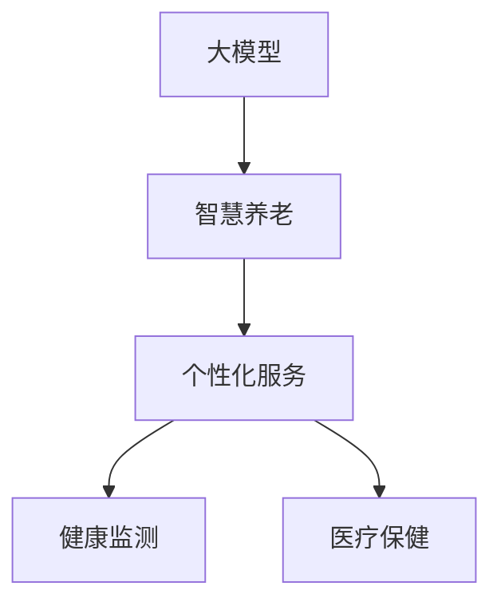

                 

# 大模型赋能智慧养老，创业者如何提供个性化的智能养老服务？

## 1. 背景介绍

### 1.1 人口老龄化趋势

全球人口老龄化趋势日益显著。根据联合国的预测，到2050年，全球65岁以上人口占比将从2020年的9%上升到16%。中国作为世界上人口最多的国家，人口老龄化形势同样严峻，65岁以上人口将达到3.2亿，占总人口的22%。

老龄人口的健康、护理和生活保障问题日益凸显，对社会经济资源和医疗服务系统的压力也随之增大。据统计，中国60岁及以上老年群体中，有近四分之一患有慢性病，且医疗支出占家庭收入的26%。应对人口老龄化，不仅需要投入大量的公共卫生资源，也需要借助科技进步，提供高效、经济、个性化的养老服务。

### 1.2 智慧养老需求

智慧养老是利用信息技术和物联网技术，实现对老年人的健康监测、生活辅助、医疗保健等全方位服务的现代化养老模式。随着科技的进步和5G、AI等技术的成熟，智慧养老服务正迎来发展良机。

智慧养老需要高效便捷的交互界面、全面的健康监测、精准的个人护理、定制化的服务方案。在满足基本需求的基础上，智慧养老还需提供情感陪伴、娱乐休闲等多元化服务，提升老年人的生活质量。

## 2. 核心概念与联系

### 2.1 核心概念概述

为更好地理解基于大模型的智慧养老服务，本节将介绍几个密切相关的核心概念：

- **大模型**：如BERT、GPT等预训练语言模型，通过海量的无标签文本数据进行自监督学习，获得强大的语言理解和生成能力。
- **智慧养老**：利用信息技术和物联网技术，为老年人提供健康监测、生活辅助、医疗保健等全方位服务的现代化养老模式。
- **个性化服务**：针对老年人的身体状况、兴趣爱好、生活需求等个性化特征，提供定制化的服务方案，提升养老服务的针对性和满意度。
- **健康监测**：通过传感器、穿戴设备等技术手段，实时监测老年人的健康状况，及时发现潜在的健康风险。
- **医疗保健**：利用医疗AI技术，提供精准的诊断和治疗建议，降低医疗成本，提升服务质量。

这些核心概念之间的逻辑关系可以通过以下Mermaid流程图来展示：



这个流程图展示了大模型在智慧养老服务中的核心作用：

1. 大模型通过预训练学习语言表示，具备强大的理解力和生成力，可以为智慧养老提供自然语言交互、情感分析等基础能力。
2. 个性化服务利用大模型，根据老年人的个性化需求，提供定制化的养老方案，提升服务满意度。
3. 健康监测和大模型结合，可以实时生成健康报告，帮助医生和护理人员对老年人健康状况进行监控和干预。
4. 医疗保健利用大模型，提供精准的诊断和治疗建议，提升医疗服务质量和效率。

## 3. 核心算法原理 & 具体操作步骤
### 3.1 算法原理概述

基于大模型的智慧养老服务，主要基于以下核心算法原理：

- **自监督预训练**：利用大规模无标签文本数据对语言模型进行预训练，学习语言的基本规律和上下文关系。
- **微调**：在预训练模型基础上，针对具体的养老服务需求进行微调，使模型具备特定的服务功能。
- **个性化推理**：利用大模型对老年人的个性化数据进行分析，推导出个性化的服务方案。
- **多模态融合**：将文本、图像、语音等多模态数据进行融合，提升服务智能化水平。

这些算法共同构成了基于大模型的智慧养老服务的核心技术框架，使得服务能够具备高度的智能化和个性化。

### 3.2 算法步骤详解

基于大模型的智慧养老服务主要包括以下几个关键步骤：

**Step 1: 准备数据集和预训练模型**

- 收集老年人健康数据、生活习惯、医疗记录等数据，构建养老服务数据集。
- 选择合适的预训练语言模型，如BERT、GPT等，作为基础模型。

**Step 2: 数据预处理和特征提取**

- 对养老数据进行清洗、标注和标准化处理，提取关键特征。
- 将数据转化为模型可接受的格式，如文本、图像、语音等。

**Step 3: 微调模型**

- 在预训练模型基础上，添加任务适配层，如分类、生成等层。
- 使用标注数据对模型进行微调，优化模型参数，使其能够适应特定的养老服务任务。

**Step 4: 个性化推理**

- 利用大模型对老年人的个性化数据进行分析，推导出个性化的养老服务方案。
- 根据老年人的健康状况、兴趣爱好和生活习惯，生成定制化的健康管理、护理服务和生活建议。

**Step 5: 多模态融合**

- 将文本、图像、语音等多模态数据进行融合，提升服务智能化水平。
- 通过多模态融合技术，实时监测老年人的健康状况，提供精准的医疗保健建议。

**Step 6: 模型评估与优化**

- 对微调后的模型进行评估，使用预设的评价指标（如准确率、召回率、F1值等）进行性能评估。
- 根据评估结果，调整模型参数和超参数，优化模型性能。

### 3.3 算法优缺点

基于大模型的智慧养老服务具有以下优点：

1. **高度智能化**：利用大模型的语言理解和生成能力，实现自然语言交互、情感分析等功能，提升服务智能化水平。
2. **个性化服务**：根据老年人的个性化需求，提供定制化的养老方案，提升服务针对性和满意度。
3. **高效性**：利用多模态融合技术，实时监测老年人的健康状况，提供精准的医疗保健建议，提升服务效率。

同时，该方法也存在一定的局限性：

1. **数据隐私和安全**：收集和使用老年人数据时，需要严格遵守数据隐私和安全规定，防止数据泄露和滥用。
2. **模型泛化能力**：模型在不同数据集和不同场景下泛化能力不足，可能导致服务质量下降。
3. **资源消耗**：大模型的训练和推理需要消耗大量的计算资源，增加了服务的成本。
4. **计算复杂性**：多模态融合等复杂算法增加了计算复杂性，需要较高的技术门槛和计算资源。

尽管存在这些局限性，但就目前而言，基于大模型的智慧养老服务仍是大数据和人工智能技术在养老领域的经典应用范式。未来相关研究的重点在于如何进一步提高模型泛化能力，优化多模态融合算法，同时兼顾数据隐私和安全等伦理问题。

### 3.4 算法应用领域

基于大模型的智慧养老服务已经在多个领域得到了广泛应用，例如：

- **健康监测**：通过传感器和穿戴设备，实时监测老年人的健康状况，如心率、血压、血糖等指标。
- **医疗保健**：利用医疗AI技术，提供精准的诊断和治疗建议，降低医疗成本，提升服务质量。
- **情感陪伴**：通过自然语言交互和情感分析，提供情感陪伴和心理健康支持，提升老年人的生活质量。
- **生活辅助**：提供生活提醒、娱乐休闲等辅助服务，帮助老年人更好地应对日常生活中的各种挑战。

除了上述这些经典应用外，基于大模型的智慧养老服务还在智能家居、社区服务等多个领域得到创新性应用，为老年人提供更全面、更个性化的养老服务。

## 4. 数学模型和公式 & 详细讲解  
### 4.1 数学模型构建

本节将使用数学语言对基于大模型的智慧养老服务进行更加严格的刻画。

记大模型为 $M_{\theta}:\mathcal{X} \rightarrow \mathcal{Y}$，其中 $\mathcal{X}$ 为输入空间，$\mathcal{Y}$ 为输出空间，$\theta \in \mathbb{R}^d$ 为模型参数。假设养老服务的数据集为 $D=\{(x_i,y_i)\}_{i=1}^N, x_i \in \mathcal{X}, y_i \in \mathcal{Y}$。

定义模型 $M_{\theta}$ 在数据样本 $(x,y)$ 上的损失函数为 $\ell(M_{\theta}(x),y)$，则在数据集 $D$ 上的经验风险为：

$$
\mathcal{L}(\theta) = \frac{1}{N} \sum_{i=1}^N \ell(M_{\theta}(x_i),y_i)
$$

微调的目标是最小化经验风险，即找到最优参数：

$$
\theta^* = \mathop{\arg\min}_{\theta} \mathcal{L}(\theta)
$$

在实践中，我们通常使用基于梯度的优化算法（如SGD、Adam等）来近似求解上述最优化问题。设 $\eta$ 为学习率，$\lambda$ 为正则化系数，则参数的更新公式为：

$$
\theta \leftarrow \theta - \eta \nabla_{\theta}\mathcal{L}(\theta) - \eta\lambda\theta
$$

其中 $\nabla_{\theta}\mathcal{L}(\theta)$ 为损失函数对参数 $\theta$ 的梯度，可通过反向传播算法高效计算。

### 4.2 公式推导过程

以下我们以健康监测任务为例，推导损失函数及其梯度的计算公式。

假设模型 $M_{\theta}$ 在输入 $x$ 上的输出为 $\hat{y}=M_{\theta}(x) \in [0,1]$，表示样本属于某个健康状态的预测概率。真实标签 $y \in \{0,1\}$。则二分类交叉熵损失函数定义为：

$$
\ell(M_{\theta}(x),y) = -[y\log \hat{y} + (1-y)\log (1-\hat{y})]
$$

将其代入经验风险公式，得：

$$
\mathcal{L}(\theta) = -\frac{1}{N}\sum_{i=1}^N [y_i\log M_{\theta}(x_i)+(1-y_i)\log(1-M_{\theta}(x_i))]
$$

根据链式法则，损失函数对参数 $\theta_k$ 的梯度为：

$$
\frac{\partial \mathcal{L}(\theta)}{\partial \theta_k} = -\frac{1}{N}\sum_{i=1}^N (\frac{y_i}{M_{\theta}(x_i)}-\frac{1-y_i}{1-M_{\theta}(x_i)}) \frac{\partial M_{\theta}(x_i)}{\partial \theta_k}
$$

其中 $\frac{\partial M_{\theta}(x_i)}{\partial \theta_k}$ 可进一步递归展开，利用自动微分技术完成计算。

在得到损失函数的梯度后，即可带入参数更新公式，完成模型的迭代优化。重复上述过程直至收敛，最终得到适应健康监测任务的最优模型参数 $\theta^*$。

## 5. 项目实践：代码实例和详细解释说明
### 5.1 开发环境搭建

在进行智慧养老服务开发前，我们需要准备好开发环境。以下是使用Python进行PyTorch开发的环境配置流程：

1. 安装Anaconda：从官网下载并安装Anaconda，用于创建独立的Python环境。

2. 创建并激活虚拟环境：
```bash
conda create -n pytorch-env python=3.8 
conda activate pytorch-env
```

3. 安装PyTorch：根据CUDA版本，从官网获取对应的安装命令。例如：
```bash
conda install pytorch torchvision torchaudio cudatoolkit=11.1 -c pytorch -c conda-forge
```

4. 安装Transformers库：
```bash
pip install transformers
```

5. 安装各类工具包：
```bash
pip install numpy pandas scikit-learn matplotlib tqdm jupyter notebook ipython
```

完成上述步骤后，即可在`pytorch-env`环境中开始智慧养老服务开发。

### 5.2 源代码详细实现

下面我们以健康监测任务为例，给出使用Transformers库对BERT模型进行微调的PyTorch代码实现。

首先，定义健康监测任务的数据处理函数：

```python
from transformers import BertTokenizer
from torch.utils.data import Dataset
import torch

class HealthDataset(Dataset):
    def __init__(self, data, tokenizer, max_len=128):
        self.data = data
        self.tokenizer = tokenizer
        self.max_len = max_len
        
    def __len__(self):
        return len(self.data)
    
    def __getitem__(self, idx):
        text = self.data[idx]['text']
        label = self.data[idx]['label']
        
        encoding = self.tokenizer(text, return_tensors='pt', max_length=self.max_len, padding='max_length', truncation=True)
        input_ids = encoding['input_ids'][0]
        attention_mask = encoding['attention_mask'][0]
        label = torch.tensor(label, dtype=torch.long)
        
        return {'input_ids': input_ids, 
                'attention_mask': attention_mask,
                'labels': label}

# 创建dataset
tokenizer = BertTokenizer.from_pretrained('bert-base-cased')

train_dataset = HealthDataset(train_data, tokenizer)
dev_dataset = HealthDataset(dev_data, tokenizer)
test_dataset = HealthDataset(test_data, tokenizer)
```

然后，定义模型和优化器：

```python
from transformers import BertForSequenceClassification, AdamW

model = BertForSequenceClassification.from_pretrained('bert-base-cased', num_labels=2)

optimizer = AdamW(model.parameters(), lr=2e-5)
```

接着，定义训练和评估函数：

```python
from torch.utils.data import DataLoader
from tqdm import tqdm
from sklearn.metrics import classification_report

device = torch.device('cuda') if torch.cuda.is_available() else torch.device('cpu')
model.to(device)

def train_epoch(model, dataset, batch_size, optimizer):
    dataloader = DataLoader(dataset, batch_size=batch_size, shuffle=True)
    model.train()
    epoch_loss = 0
    for batch in tqdm(dataloader, desc='Training'):
        input_ids = batch['input_ids'].to(device)
        attention_mask = batch['attention_mask'].to(device)
        labels = batch['labels'].to(device)
        model.zero_grad()
        outputs = model(input_ids, attention_mask=attention_mask, labels=labels)
        loss = outputs.loss
        epoch_loss += loss.item()
        loss.backward()
        optimizer.step()
    return epoch_loss / len(dataloader)

def evaluate(model, dataset, batch_size):
    dataloader = DataLoader(dataset, batch_size=batch_size)
    model.eval()
    preds, labels = [], []
    with torch.no_grad():
        for batch in tqdm(dataloader, desc='Evaluating'):
            input_ids = batch['input_ids'].to(device)
            attention_mask = batch['attention_mask'].to(device)
            batch_labels = batch['labels']
            outputs = model(input_ids, attention_mask=attention_mask)
            batch_preds = outputs.logits.argmax(dim=2).to('cpu').tolist()
            batch_labels = batch_labels.to('cpu').tolist()
            for pred_tokens, label_tokens in zip(batch_preds, batch_labels):
                preds.append(pred_tokens[:len(label_tokens)])
                labels.append(label_tokens)
                
    print(classification_report(labels, preds))
```

最后，启动训练流程并在测试集上评估：

```python
epochs = 5
batch_size = 16

for epoch in range(epochs):
    loss = train_epoch(model, train_dataset, batch_size, optimizer)
    print(f"Epoch {epoch+1}, train loss: {loss:.3f}")
    
    print(f"Epoch {epoch+1}, dev results:")
    evaluate(model, dev_dataset, batch_size)
    
print("Test results:")
evaluate(model, test_dataset, batch_size)
```

以上就是使用PyTorch对BERT进行健康监测任务微调的完整代码实现。可以看到，得益于Transformers库的强大封装，我们可以用相对简洁的代码完成BERT模型的加载和微调。

### 5.3 代码解读与分析

让我们再详细解读一下关键代码的实现细节：

**HealthDataset类**：
- `__init__`方法：初始化数据集和分词器等关键组件。
- `__len__`方法：返回数据集的样本数量。
- `__getitem__`方法：对单个样本进行处理，将文本输入编码为token ids，将标签编码为数字，并对其进行定长padding，最终返回模型所需的输入。

**训练和评估函数**：
- 使用PyTorch的DataLoader对数据集进行批次化加载，供模型训练和推理使用。
- 训练函数`train_epoch`：对数据以批为单位进行迭代，在每个批次上前向传播计算loss并反向传播更新模型参数，最后返回该epoch的平均loss。
- 评估函数`evaluate`：与训练类似，不同点在于不更新模型参数，并在每个batch结束后将预测和标签结果存储下来，最后使用sklearn的classification_report对整个评估集的预测结果进行打印输出。

**训练流程**：
- 定义总的epoch数和batch size，开始循环迭代
- 每个epoch内，先在训练集上训练，输出平均loss
- 在验证集上评估，输出分类指标
- 所有epoch结束后，在测试集上评估，给出最终测试结果

可以看到，PyTorch配合Transformers库使得BERT微调的代码实现变得简洁高效。开发者可以将更多精力放在数据处理、模型改进等高层逻辑上，而不必过多关注底层的实现细节。

当然，工业级的系统实现还需考虑更多因素，如模型的保存和部署、超参数的自动搜索、更灵活的任务适配层等。但核心的微调范式基本与此类似。

## 6. 实际应用场景
### 6.1 健康监测

利用大模型对老年人的健康数据进行实时监测，是智慧养老的重要应用之一。通过穿戴设备，实时收集老年人的心率、血压、血糖等生理数据，并结合历史健康数据进行建模，预测健康风险，提前干预。

例如，某智能手环收集老年人的心率、血压等生理数据，并上传至云端。通过BERT模型对这些生理数据进行编码，学习其中的健康模式，预测老年人是否处于亚健康状态。一旦模型检测到异常情况，自动发送预警信息给护理人员，及时提供医疗建议和救助。

### 6.2 医疗保健

医疗保健是智慧养老的核心服务之一，利用大模型可以为老年人提供精准的诊断和治疗建议，提升医疗服务质量和效率。

例如，某智能医疗系统收集老年人的病历、检查结果等数据，通过BERT模型对这些数据进行编码，学习其中的病情模式。结合医生给出的诊断，模型能够生成个性化的治疗方案，并提供精准的疗效预测，帮助医生优化诊疗流程，提升治疗效果。

### 6.3 情感陪伴

老年人情感孤寂问题日益严重，利用大模型可以提供情感陪伴和心理健康支持，提升老年人的生活质量。

例如，某智能聊天机器人利用BERT模型对老年人的对话内容进行编码，学习其中的情感状态和心理需求。结合预设的情绪知识库，机器人能够提供针对性的情感支持和心理健康建议，帮助老年人缓解孤独和压力。

### 6.4 未来应用展望

随着大模型和智慧养老技术的不断发展，未来在多领域的应用前景将更加广阔：

1. **智能家居**：利用大模型对老年人行为进行智能分析和预测，提升家居环境的舒适性和安全性。例如，通过自然语言交互，自动调整室内温度、光线和音乐等，提升老年人的生活体验。
2. **社区服务**：利用大模型对老年人社区活动进行智能推荐和引导，丰富老年人的社交活动，提升生活质量。例如，根据老年人的兴趣爱好，推荐社区活动和兴趣小组，促进老年人互动交流。
3. **移动服务**：利用大模型对老年人的出行需求进行智能分析，提供个性化的出行建议和服务。例如，根据老年人的健康状况和出行目的地，生成安全的出行路线和建议，减少出行风险。

大模型在智慧养老领域的应用前景广阔，未来随着技术的进一步发展，必将带来更多的创新和突破，为老年人提供更加智能化、个性化的养老服务。

## 7. 工具和资源推荐
### 7.1 学习资源推荐

为了帮助开发者系统掌握基于大模型的智慧养老服务技术，这里推荐一些优质的学习资源：

1. 《Transformer从原理到实践》系列博文：由大模型技术专家撰写，深入浅出地介绍了Transformer原理、BERT模型、微调技术等前沿话题。

2. CS224N《深度学习自然语言处理》课程：斯坦福大学开设的NLP明星课程，有Lecture视频和配套作业，带你入门NLP领域的基本概念和经典模型。

3. 《Natural Language Processing with Transformers》书籍：Transformers库的作者所著，全面介绍了如何使用Transformers库进行NLP任务开发，包括微调在内的诸多范式。

4. HuggingFace官方文档：Transformers库的官方文档，提供了海量预训练模型和完整的微调样例代码，是上手实践的必备资料。

5. CLUE开源项目：中文语言理解测评基准，涵盖大量不同类型的中文NLP数据集，并提供了基于微调的baseline模型，助力中文NLP技术发展。

通过对这些资源的学习实践，相信你一定能够快速掌握基于大模型的智慧养老服务技术，并用于解决实际的NLP问题。
###  7.2 开发工具推荐

高效的开发离不开优秀的工具支持。以下是几款用于基于大模型的智慧养老服务开发的常用工具：

1. PyTorch：基于Python的开源深度学习框架，灵活动态的计算图，适合快速迭代研究。大部分预训练语言模型都有PyTorch版本的实现。

2. TensorFlow：由Google主导开发的开源深度学习框架，生产部署方便，适合大规模工程应用。同样有丰富的预训练语言模型资源。

3. Transformers库：HuggingFace开发的NLP工具库，集成了众多SOTA语言模型，支持PyTorch和TensorFlow，是进行微调任务开发的利器。

4. Weights & Biases：模型训练的实验跟踪工具，可以记录和可视化模型训练过程中的各项指标，方便对比和调优。与主流深度学习框架无缝集成。

5. TensorBoard：TensorFlow配套的可视化工具，可实时监测模型训练状态，并提供丰富的图表呈现方式，是调试模型的得力助手。

6. Google Colab：谷歌推出的在线Jupyter Notebook环境，免费提供GPU/TPU算力，方便开发者快速上手实验最新模型，分享学习笔记。

合理利用这些工具，可以显著提升智慧养老服务开发的效率，加快创新迭代的步伐。

### 7.3 相关论文推荐

大模型和智慧养老技术的发展源于学界的持续研究。以下是几篇奠基性的相关论文，推荐阅读：

1. Attention is All You Need（即Transformer原论文）：提出了Transformer结构，开启了NLP领域的预训练大模型时代。

2. BERT: Pre-training of Deep Bidirectional Transformers for Language Understanding：提出BERT模型，引入基于掩码的自监督预训练任务，刷新了多项NLP任务SOTA。

3. Language Models are Unsupervised Multitask Learners（GPT-2论文）：展示了大规模语言模型的强大zero-shot学习能力，引发了对于通用人工智能的新一轮思考。

4. Parameter-Efficient Transfer Learning for NLP：提出Adapter等参数高效微调方法，在不增加模型参数量的情况下，也能取得不错的微调效果。

5. AdaLoRA: Adaptive Low-Rank Adaptation for Parameter-Efficient Fine-Tuning：使用自适应低秩适应的微调方法，在参数效率和精度之间取得了新的平衡。

这些论文代表了大模型和智慧养老技术的最新进展，通过学习这些前沿成果，可以帮助研究者把握学科前进方向，激发更多的创新灵感。

## 8. 总结：未来发展趋势与挑战

### 8.1 总结

本文对基于大模型的智慧养老服务进行了全面系统的介绍。首先阐述了智慧养老的需求和挑战，明确了大模型在智慧养老服务中的核心作用。其次，从原理到实践，详细讲解了基于大模型的智慧养老服务的核心技术框架，包括微调、个性化推理和多模态融合等算法原理。最后，展示了大模型在智慧养老领域的多样化应用场景，包括健康监测、医疗保健、情感陪伴等。

通过本文的系统梳理，可以看到，基于大模型的智慧养老服务正在成为智慧养老领域的重要范式，通过自然语言交互、情感分析等技术，提升了养老服务的智能化和个性化水平。未来随着技术的进一步发展，智慧养老服务将涵盖更多领域，为老年人提供更加全面、个性化的服务，提升其生活质量。

### 8.2 未来发展趋势

展望未来，基于大模型的智慧养老服务将呈现以下几个发展趋势：

1. **多模态融合**：将文本、图像、语音等多模态数据进行融合，提升服务智能化水平。例如，结合视频监控和语音识别，实时监测老年人的行为和情绪状态，提供精准的情感陪伴和健康管理。
2. **多领域协同**：智慧养老服务将与医疗、社区、家庭等多领域协同，构建一体化的养老生态系统。例如，结合医疗AI和社区服务，为老年人提供全面的健康管理和生活支持。
3. **个性化服务**：利用大模型对老年人的个性化数据进行分析，推导出个性化的服务方案，提升服务针对性和满意度。例如，通过自然语言交互，收集老年人的个性化需求和反馈，不断优化养老服务。
4. **智能化升级**：随着计算资源的增加，大模型将具备更加强大的推理能力和计算效率，智慧养老服务将更加智能化和高效化。例如，结合GPU/TPU等高性能设备，提升模型的推理速度和处理能力。

以上趋势凸显了基于大模型的智慧养老服务的广阔前景。这些方向的探索发展，必将进一步提升智慧养老服务的性能和应用范围，为老年人提供更全面、更个性化的养老服务。

### 8.3 面临的挑战

尽管基于大模型的智慧养老服务取得了显著成果，但在迈向更加智能化、普适化应用的过程中，仍面临诸多挑战：

1. **数据隐私和安全**：收集和使用老年人数据时，需要严格遵守数据隐私和安全规定，防止数据泄露和滥用。如何保护老年人的隐私权，确保数据安全，是一大挑战。
2. **模型泛化能力**：模型在不同数据集和不同场景下泛化能力不足，可能导致服务质量下降。如何提高模型的泛化能力，适应不同的养老场景，是一大挑战。
3. **资源消耗**：大模型的训练和推理需要消耗大量的计算资源，增加了服务的成本。如何优化模型结构和算法，减少资源消耗，是一大挑战。
4. **计算复杂性**：多模态融合等复杂算法增加了计算复杂性，需要较高的技术门槛和计算资源。如何简化算法，提高计算效率，是一大挑战。
5. **人机交互体验**：老年人对智能设备的接受度和使用习惯存在差异，如何提供简单直观、易用易懂的人机交互体验，是一大挑战。

尽管存在这些挑战，但随着技术的不断进步和算力资源的增加，这些问题终将逐渐得到解决。未来，智慧养老服务将更加智能化、普适化和个性化，为老年人提供更加全面的养老保障。

### 8.4 研究展望

面向未来，基于大模型的智慧养老服务需要从以下几个方面寻求新的突破：

1. **多模态融合技术**：探索更加高效的多模态融合算法，提高智慧养老服务的智能化水平。例如，结合深度学习、机器视觉等技术，提升老年人行为和情绪的精准监测和分析能力。
2. **知识表示和推理**：利用符号化的知识表示和逻辑推理，提升智慧养老服务的可解释性和可靠性。例如，结合知识图谱和逻辑推理，提供更加精准的医疗诊断和治疗建议。
3. **自然语言交互**：探索更加自然流畅、易于理解的人机交互方式，提升老年人对智能设备的接受度和使用体验。例如，结合自然语言处理和情感分析，提供个性化的情感陪伴和健康管理。
4. **个性化服务**：利用大模型对老年人的个性化数据进行分析，推导出个性化的服务方案，提升服务针对性和满意度。例如，通过自然语言交互，收集老年人的个性化需求和反馈，不断优化养老服务。
5. **伦理和安全**：探索如何在大模型应用中引入伦理和安全约束，确保服务的公正性和安全性。例如，结合伦理导向的评估指标和模型监控机制，保护老年人的权益和隐私。

这些研究方向将推动基于大模型的智慧养老服务走向更加成熟和智能化，为老年人提供更全面、更个性化的养老服务，提升其生活质量和幸福感。

## 9. 附录：常见问题与解答

**Q1：如何选择合适的预训练模型？**

A: 选择合适的预训练模型需要考虑多个因素，如模型的规模、任务适配能力、计算资源等。一般建议从以下几个方面入手：
1. **模型规模**：选择规模适中的模型，避免过大过小。过大可能导致资源消耗大，过小可能无法满足任务需求。例如，BERT和GPT等大模型适合复杂任务，BERT-base和GPT-small等小模型适合资源受限的场景。
2. **任务适配能力**：选择适配当前任务的模型，确保模型具备任务相关的能力。例如，BERT适合文本分类、命名实体识别等任务，RoBERTa适合长文本理解和生成任务。
3. **计算资源**：考虑模型的计算资源需求，选择适合当前硬件环境的模型。例如，BERT、RoBERTa等模型需要较大的GPU内存，适用于高性能设备；BERT-small等小模型适用于资源受限的设备。

**Q2：微调过程中如何处理数据隐私问题？**

A: 数据隐私和安全是智慧养老服务中需要重点考虑的问题。为保障老年人的隐私权，可以采取以下措施：
1. **匿名化处理**：对数据进行匿名化处理，去除个人信息和隐私标识。例如，将姓名、身份证号等隐私信息替换为匿名ID，避免数据泄露。
2. **差分隐私**：使用差分隐私技术，对数据进行加噪处理，保护个体隐私。例如，在训练模型时加入噪声，防止模型学习到敏感信息。
3. **访问控制**：对数据进行严格的访问控制，确保只有授权人员能够访问和处理数据。例如，使用加密技术保护数据传输和存储，防止数据泄露和篡改。
4. **隐私保护算法**：采用隐私保护算法，确保数据隐私在模型训练过程中得到保护。例如，利用联邦学习等技术，在本地设备上训练模型，避免数据集中存储和传输。

**Q3：如何评估智慧养老服务的性能？**

A: 智慧养老服务的性能评估需要综合考虑多个指标，如准确率、召回率、F1值、用户体验等。一般建议从以下几个方面进行评估：
1. **任务准确率**：评估模型在特定任务上的准确率，如健康监测、医疗保健、情感陪伴等。使用预设的评价指标（如准确率、召回率、F1值等）进行评估。
2. **用户体验**：评估老年人对智能设备的接受度和使用体验。例如，通过用户调研、满意度问卷等形式，了解老年人对服务的使用感受和满意度。
3. **系统可靠性**：评估系统的稳定性和可靠性。例如，通过系统运行时间、故障率、响应时间等指标，衡量系统的运行状态和性能。
4. **经济效益**：评估服务带来的经济效益。例如，通过成本效益分析，比较不同方案的经济性和可行性，选择最优的实施方案。

**Q4：如何优化智慧养老服务的算法和模型？**

A: 优化智慧养老服务的算法和模型需要从多个方面入手，如模型结构、训练策略、数据处理等。一般建议从以下几个方面进行优化：
1. **模型结构**：优化模型结构，减少冗余参数，提高计算效率。例如，使用参数高效微调方法（如Adapter、LoRA等），在不增加模型参数量的情况下，提升模型性能。
2. **训练策略**：调整训练策略，优化模型性能。例如，使用AdamW等优化器，调整学习率、批大小等超参数，提升模型收敛速度和泛化能力。
3. **数据处理**：优化数据处理流程，提升数据质量和模型性能。例如，对数据进行清洗、标注和标准化处理，提取关键特征，减少数据噪音。
4. **多模态融合**：优化多模态融合算法，提高智慧养老服务的智能化水平。例如，结合深度学习、机器视觉等技术，提升老年人行为和情绪的精准监测和分析能力。

通过这些优化措施，可以显著提升智慧养老服务的性能和应用效果，为老年人提供更加全面、个性化的服务。

**Q5：如何结合伦理和安全约束，确保智慧养老服务的公平性？**

A: 结合伦理和安全约束，确保智慧养老服务的公平性需要从多个方面入手，如算法设计、模型监控等。一般建议从以下几个方面进行优化：
1. **算法设计**：在设计算法时，考虑伦理和安全约束，避免模型产生偏见和歧视。例如，引入公平性指标（如均方误差、等距度等），确保模型在不同人群中表现一致。
2. **模型监控**：对模型进行实时监控，防止模型输出出现偏见和歧视。例如，结合伦理导向的评估指标和模型监控机制，保护老年人的权益和隐私。
3. **人机交互**：优化人机交互界面，确保老年人能够理解和接受服务。例如，使用自然语言处理和情感分析，提供简单直观、易用易懂的人机交互方式。
4. **用户体验**：通过用户调研和反馈，不断优化服务体验。例如，收集老年人的使用感受和建议，持续改进服务方案，确保服务的公正性和安全性。

通过这些措施，可以确保智慧养老服务的公平性和安全性，为老年人提供更加公正、可靠的养老服务。

---

作者：禅与计算机程序设计艺术 / Zen and the Art of Computer Programming

