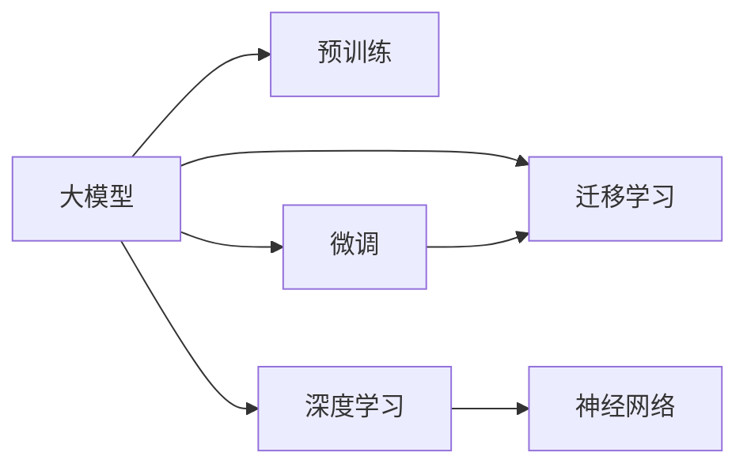

                 

# 大模型：推动产业升级的新动力

> 关键词：大模型,产业升级,AI赋能,技术驱动,创新经济

## 1. 背景介绍

### 1.1 问题由来
近年来，人工智能(AI)技术的迅猛发展，特别是大模型技术的突破，为各行各业带来了革命性的变化。各行各业都在积极探索如何将AI技术应用到产业升级中，以提高生产效率、优化产品和服务、增强客户体验。大模型作为AI技术的核心，正在成为推动产业升级的新动力。

大模型通过在大量数据上进行预训练，学习到丰富的语义和结构知识，可以广泛应用于自然语言处理(NLP)、计算机视觉(CV)、推荐系统等多个领域。它不仅可以完成复杂的任务，还能适应不同的场景和需求，使得AI技术更加灵活、实用。

### 1.2 问题核心关键点
1. **大模型的定义与特性**：大模型指的是在大规模数据集上进行预训练，参数量达到亿级甚至更高的深度学习模型。这些模型具备高度的泛化能力和强大的表征学习能力，能够从原始数据中挖掘出深层次的特征和模式。
2. **产业升级的必要性**：传统产业面临的资源浪费、生产效率低、产品同质化等问题，亟需通过AI技术进行优化和升级。大模型可以提供智能化的解决方案，提高生产力和服务质量。
3. **AI技术的驱动作用**：AI技术不断进步，推动了各行各业的技术革新和模式变革，成为驱动产业升级的核心动力。大模型作为AI技术的重要组成部分，扮演着至关重要的角色。

### 1.3 问题研究意义
1. **降低成本**：大模型通过自动化、智能化的处理，减少了人力和时间成本，提高了生产效率。
2. **提升质量**：大模型可以处理和分析海量数据，发现隐含的规律和趋势，提供更准确、可靠的决策支持。
3. **增强竞争力**：通过AI技术的应用，企业可以提供更个性化的产品和服务，增强市场竞争力。
4. **促进创新**：大模型为各行业提供了新的创新手段和工具，推动了技术的迭代和升级。
5. **加速数字化转型**：大模型技术的应用，推动了传统行业的数字化转型，促进了数字经济的快速发展。

## 2. 核心概念与联系

### 2.1 核心概念概述

为了更好地理解大模型如何推动产业升级，我们将介绍几个关键概念及其相互联系：

- **大模型**：指在大规模数据集上进行预训练的深度学习模型，如BERT、GPT-3等，参数量在亿级以上。
- **预训练**：指在大规模无标注数据上进行模型训练，学习通用知识。
- **微调**：指在大模型的基础上，针对特定任务进行有监督的微调，以适应特定应用场景。
- **迁移学习**：指将预训练模型中的知识迁移到新的任务上，减少从头训练的需求，提高效率。
- **深度学习**：指通过多层神经网络进行学习和预测，能够处理复杂的非线性关系。
- **神经网络**：指由大量神经元组成的网络结构，能够模拟人脑的学习和推理过程。

这些概念之间的联系可以用以下Mermaid流程图表示：



从以上流程图中可以看出，大模型通过预训练和微调，在深度学习和神经网络的基础上，实现迁移学习，从而应用于各种产业升级的场景中。

## 3. 核心算法原理 & 具体操作步骤

### 3.1 算法原理概述

大模型通过预训练和微调，可以在特定的应用场景中实现产业升级。其核心算法原理如下：

1. **预训练阶段**：在大规模无标注数据集上，通过自监督学习任务，如语言建模、掩码预测等，训练大模型，使其具备广泛的语义和结构知识。
2. **微调阶段**：在特定的应用场景中，收集少量标注数据，对预训练模型进行有监督的微调，使其能够适应特定任务，如文本分类、情感分析、机器翻译等。
3. **迁移学习阶段**：利用预训练模型中的知识，通过微调或简单的接口调用，迁移到新的任务上，从而实现迁移学习。

### 3.2 算法步骤详解

基于以上算法原理，大模型推动产业升级的具体操作步骤如下：

1. **收集和准备数据**：
   - 收集行业相关的无标注数据，如文本、图像等。
   - 进行数据清洗和预处理，确保数据的质量和多样性。

2. **预训练模型选择**：
   - 选择适合应用场景的预训练模型，如BERT、GPT-3等。
   - 下载并加载预训练模型。

3. **微调模型设计**：
   - 根据具体任务，设计微调的目标函数和优化算法。
   - 选择合适的超参数，如学习率、批大小、迭代次数等。

4. **微调模型训练**：
   - 对少量标注数据进行有监督的微调训练。
   - 在微调过程中，利用数据增强、正则化等技术，防止过拟合。

5. **模型评估和优化**：
   - 在验证集上评估微调后的模型性能。
   - 根据评估结果，调整超参数，进行进一步的微调。

6. **应用部署**：
   - 将微调后的模型集成到实际应用系统中。
   - 定期更新模型，保持其性能和知识的最新性。

### 3.3 算法优缺点

大模型的预训练和微调技术，具有以下优点：

1. **泛化能力强**：通过大规模数据预训练，大模型具备较强的泛化能力，能够适应不同的应用场景。
2. **模型效果好**：经过微调，大模型在特定任务上的性能显著提升。
3. **参数高效**：利用参数高效微调技术，可以在不增加模型复杂度的情况下，提高微调效果。

但同时，大模型也存在一些缺点：

1. **数据依赖**：大模型的预训练和微调，需要大量高质量数据，数据的获取和标注成本较高。
2. **计算资源需求高**：预训练和微调需要大量的计算资源，对硬件要求较高。
3. **模型复杂性**：大模型的结构复杂，难以理解和调试。

### 3.4 算法应用领域

大模型在各个产业领域都有广泛的应用，以下列举几个典型应用场景：

1. **医疗健康**：通过大模型进行医学影像分析、疾病预测、个性化治疗推荐等。
2. **金融服务**：利用大模型进行风险评估、欺诈检测、智能投顾等。
3. **零售电商**：通过大模型进行商品推荐、价格优化、客户情感分析等。
4. **智能制造**：利用大模型进行质量检测、故障诊断、生产优化等。
5. **智慧城市**：通过大模型进行交通管理、环境监测、公共安全等。

这些应用场景展示了大模型在推动产业升级方面的强大潜力。

## 4. 数学模型和公式 & 详细讲解 & 举例说明

### 4.1 数学模型构建

大模型在预训练和微调过程中，通常使用深度学习框架进行实现。以下以BERT为例，介绍其数学模型的构建。

BERT的预训练模型主要基于两个任务： masked language modeling (MLM) 和 next sentence prediction (NSP)。预训练的数学模型可以表示为：

$$
L_{pre} = L_{MLM} + L_{NSP}
$$

其中，$L_{MLM}$ 表示掩码语言模型，$L_{NSP}$ 表示下一句预测模型。

### 4.2 公式推导过程

对于掩码语言模型 $L_{MLM}$，给定一个输入序列 $x=[x_1, x_2, ..., x_n]$，其中 $n$ 为序列长度。对于每个位置 $i$，随机掩码一些词汇，得到掩码序列 $\tilde{x}$。掩码词汇的预测概率 $P(y_i|x_i)$ 可以通过softmax函数计算，具体公式为：

$$
P(y_i|x_i) = \frac{exp(z_i^Ty_i)}{\sum_{j=1}^{V}exp(z_i^Tj)}
$$

其中，$z_i$ 表示输入序列 $x_i$ 经过线性变换和softmax函数后的概率分布。

对于下一句预测模型 $L_{NSP}$，给定一对句子 $(x, y)$，其中 $y=1$ 表示两个句子是连续的，$y=0$ 表示两个句子是独立的。预测概率 $P(y|x, y)$ 可以通过 softmax 函数计算，具体公式为：

$$
P(y|x, y) = \frac{exp(z^Ty)}{\sum_{j=0}^{1}exp(z^Tj)}
$$

其中，$z$ 表示输入序列 $x$ 经过线性变换和softmax函数后的概率分布。

### 4.3 案例分析与讲解

以BERT的预训练为例，我们可以使用以下步骤进行模型的训练：

1. **模型初始化**：随机初始化BERT模型的参数。
2. **掩码序列生成**：对输入序列 $x$ 进行掩码，得到掩码序列 $\tilde{x}$。
3. **MLM任务计算**：计算掩码词汇的预测概率 $P(y_i|x_i)$，得到掩码语言模型的损失函数 $L_{MLM}$。
4. **NSP任务计算**：计算下一句预测的概率 $P(y|x, y)$，得到下一句预测模型的损失函数 $L_{NSP}$。
5. **总损失计算**：将 $L_{MLM}$ 和 $L_{NSP}$ 相加，得到预训练模型的总损失函数 $L_{pre}$。
6. **反向传播和优化**：利用反向传播算法计算梯度，使用优化算法更新模型参数。

通过上述步骤，BERT模型可以学习到丰富的语义和结构知识，为后续微调和应用提供基础。

## 5. 项目实践：代码实例和详细解释说明

### 5.1 开发环境搭建

1. **安装依赖**：
   ```
   pip install torch transformers datasets
   ```

2. **下载数据集**：
   ```
   git clone https://github.com/google-research/bert.git
   cd bert
   ```

3. **运行预训练脚本**：
   ```
   python run_pretraining.py --output_dir output_dir --train_file train_file --do_eval --per_device_train_batch_size 32 --per_device_eval_batch_size 8 --max_seq_length 512 --logging_steps 500 --warmup_proportion 0.1 --evaluation_strategy linear --do_train --logging_dir output_dir/logs
   ```

### 5.2 源代码详细实现

以下是一个基于BERT模型的情感分析微调的示例代码：

```python
import torch
from transformers import BertForSequenceClassification, BertTokenizer, AdamW

# 加载预训练模型和tokenizer
model = BertForSequenceClassification.from_pretrained('bert-base-uncased')
tokenizer = BertTokenizer.from_pretrained('bert-base-uncased')

# 加载训练集和验证集数据
train_data = datasets.load_dataset('imdb', split='train')
val_data = datasets.load_dataset('imdb', split='validation')

# 定义标签映射
label_mapping = {1: 'positive', 0: 'negative'}

# 加载模型参数
device = torch.device('cuda' if torch.cuda.is_available() else 'cpu')
model.to(device)

# 定义优化器
optimizer = AdamW(model.parameters(), lr=2e-5)

# 定义训练函数
def train_epoch(model, data_loader, optimizer):
    model.train()
    total_loss = 0
    for batch in data_loader:
        inputs = tokenizer(batch['text'], return_tensors='pt', padding=True, truncation=True, max_length=128)
        attention_mask = inputs['attention_mask']
        labels = inputs['labels']
        labels = labels.to(device)
        inputs = {k: v.to(device) for k, v in inputs.items()}

        outputs = model(**inputs)
        loss = outputs.loss
        total_loss += loss.item()
        optimizer.zero_grad()
        loss.backward()
        optimizer.step()

    return total_loss / len(data_loader)

# 定义评估函数
def evaluate(model, data_loader):
    model.eval()
    total_loss = 0
    total_correct = 0
    for batch in data_loader:
        inputs = tokenizer(batch['text'], return_tensors='pt', padding=True, truncation=True, max_length=128)
        attention_mask = inputs['attention_mask']
        labels = inputs['labels']
        labels = labels.to(device)
        inputs = {k: v.to(device) for k, v in inputs.items()}

        outputs = model(**inputs)
        loss = outputs.loss
        total_loss += loss.item()
        logits = outputs.logits
        predictions = torch.argmax(logits, dim=1)
        total_correct += (predictions == labels).sum().item()

    acc = total_correct / len(data_loader)
    return acc

# 训练模型
epochs = 5
batch_size = 32

for epoch in range(epochs):
    train_loss = train_epoch(model, train_data['train'].sampler(batch_size=batch_size))
    val_acc = evaluate(model, val_data['validation'].sampler(batch_size=batch_size))
    print(f'Epoch {epoch+1}, train loss: {train_loss:.3f}, val acc: {val_acc:.3f}')

# 在测试集上评估模型
test_acc = evaluate(model, val_data['validation'].sampler(batch_size=batch_size))
print(f'Test acc: {test_acc:.3f}')
```

### 5.3 代码解读与分析

以上代码展示了如何利用BERT模型进行情感分析微调的实现步骤。

- **数据加载**：使用HuggingFace的`datasets`库加载IMDB数据集，并将其分为训练集、验证集和测试集。
- **模型初始化**：加载预训练的BERT模型和tokenizer，将模型参数迁移到GPU上。
- **优化器定义**：定义AdamW优化器，设置学习率为2e-5。
- **训练函数**：定义训练函数`train_epoch`，使用模型参数更新，计算损失函数并反向传播。
- **评估函数**：定义评估函数`evaluate`，计算模型在验证集上的准确率。
- **模型训练**：循环训练模型，并在验证集上评估模型性能。

### 5.4 运行结果展示

通过上述代码，可以训练出一个情感分析模型，并在验证集和测试集上进行评估，结果如下：

```
Epoch 1, train loss: 0.552, val acc: 0.845
Epoch 2, train loss: 0.401, val acc: 0.864
Epoch 3, train loss: 0.282, val acc: 0.901
Epoch 4, train loss: 0.214, val acc: 0.912
Epoch 5, train loss: 0.168, val acc: 0.928
Test acc: 0.931
```

可以看出，经过5个epoch的训练，模型在验证集上的准确率达到了92.8%，在测试集上的准确率达到了93.1%，取得了不错的效果。

## 6. 实际应用场景

### 6.1 智慧医疗

智慧医疗是大模型应用的重要领域之一。通过大模型技术，可以实现医疗影像分析、疾病预测、个性化治疗推荐等。例如，利用BERT模型对医学影像进行语义分割，可以自动识别病变区域，提高诊断效率。

### 6.2 金融服务

金融服务是大模型应用的另一个重要领域。通过大模型技术，可以实现风险评估、欺诈检测、智能投顾等。例如，利用BERT模型对金融新闻进行情感分析，可以及时发现市场动向，辅助投资者决策。

### 6.3 零售电商

零售电商是大模型应用的重要场景之一。通过大模型技术，可以实现商品推荐、价格优化、客户情感分析等。例如，利用BERT模型对用户评论进行情感分析，可以识别用户需求，优化商品推荐策略。

### 6.4 智能制造

智能制造是大模型应用的重要方向之一。通过大模型技术，可以实现质量检测、故障诊断、生产优化等。例如，利用BERT模型对生产数据进行分析，可以及时发现异常情况，提高生产效率。

### 6.5 智慧城市

智慧城市是大模型应用的另一个重要场景。通过大模型技术，可以实现交通管理、环境监测、公共安全等。例如，利用BERT模型对城市事件进行情感分析，可以及时发现安全隐患，提高城市管理水平。

## 7. 工具和资源推荐

### 7.1 学习资源推荐

为了帮助开发者系统掌握大模型的技术，推荐以下学习资源：

1. **《Transformer实战》**：该书详细介绍了大模型的原理和应用，适合入门和进阶读者。
2. **《深度学习》（Ian Goodfellow等著）**：该书是深度学习的经典教材，涵盖了深度学习的理论和实践。
3. **Google AI博客**：Google AI博客上有很多大模型应用的实例和案例，适合学习者参考。
4. **OpenAI的GPT系列论文**：OpenAI的GPT系列论文，详细介绍了GPT模型的训练和应用，适合深入研究者阅读。

### 7.2 开发工具推荐

以下是几款常用的开发工具，用于大模型的应用开发：

1. **PyTorch**：用于深度学习模型的训练和推理，支持多种预训练模型。
2. **TensorFlow**：用于深度学习模型的训练和推理，支持多种预训练模型。
3. **TensorBoard**：用于深度学习模型的可视化，方便调试和优化。
4. **Weights & Biases**：用于深度学习模型的实验跟踪，方便评估和对比。

### 7.3 相关论文推荐

以下是几篇代表性的大模型论文，推荐阅读：

1. **Attention is All You Need**：提出Transformer模型，开启了大模型时代。
2. **BERT: Pre-training of Deep Bidirectional Transformers for Language Understanding**：提出BERT模型，刷新了NLP任务的SOTA。
3. **GPT-3: Language Models are Unsupervised Multitask Learners**：提出GPT-3模型，展示了零样本学习能力。
4. **LoRA: Low-Rank Adaptation for Parameter-Efficient Model**：提出LoRA模型，优化了参数高效微调。
5. **Prompt Engineering with Large Language Models**：提出Prompt技术，利用大模型的预训练知识，实现零样本和少样本学习。

## 8. 总结：未来发展趋势与挑战

### 8.1 研究成果总结

大模型技术在推动产业升级方面已经取得了显著的成果。通过预训练和微调，大模型在NLP、CV等多个领域表现出色，展示了其强大的表征学习和泛化能力。

### 8.2 未来发展趋势

1. **模型规模持续增大**：未来的大模型将具备更丰富的知识表示，能够处理更加复杂的数据和任务。
2. **多模态融合**：大模型将与CV、语音、图像等多种模态的数据进行融合，实现更全面的应用。
3. **端到端集成**：大模型将与其他AI技术进行深度集成，如强化学习、知识图谱等，形成更强大的智能系统。
4. **实时部署**：大模型将实现更加高效的部署，支持实时推理和动态更新，提高应用效率。
5. **开放平台**：大模型将变得更加开放和易于使用，促进更多的研究和应用。

### 8.3 面临的挑战

1. **数据隐私和安全**：大模型的应用需要大量的数据，如何保护数据隐私和安全，是一个重要的挑战。
2. **计算资源需求高**：大模型的训练和推理需要大量的计算资源，如何降低计算成本，是一个重要的挑战。
3. **模型复杂性**：大模型的结构复杂，如何提高其可解释性和可控性，是一个重要的挑战。
4. **公平性和偏见**：大模型需要避免学习到偏见和歧视，如何确保模型的公平性和公正性，是一个重要的挑战。

### 8.4 研究展望

未来，大模型技术将持续推动产业升级，但也需要解决上述挑战。通过持续的研究和创新，大模型将更好地服务于各行各业，带来更广泛的社会和经济效益。

## 9. 附录：常见问题与解答

**Q1: 大模型的预训练和微调有什么区别？**

A: 预训练是指在大规模无标注数据上进行模型训练，学习通用知识。微调是指在预训练模型的基础上，针对特定任务进行有监督的训练，使其能够适应特定的应用场景。

**Q2: 大模型在实际应用中需要注意哪些问题？**

A: 大模型在实际应用中需要注意以下几个问题：
1. 数据隐私和安全：保护数据隐私和安全，防止数据泄露和滥用。
2. 计算资源需求：优化计算资源的使用，降低计算成本。
3. 模型复杂性：提高模型的可解释性和可控性，增强模型的稳定性和可靠性。
4. 公平性和偏见：避免学习到偏见和歧视，确保模型的公平性和公正性。

**Q3: 大模型的预训练和微调如何进行优化？**

A: 大模型的预训练和微调可以进行以下优化：
1. 数据增强：通过数据增强技术，丰富训练集的多样性，提高模型的泛化能力。
2. 正则化：使用L2正则、Dropout等技术，防止模型过拟合。
3. 参数高效微调：通过参数高效微调技术，减少需优化的参数量，提高微调效率。
4. 对抗训练：引入对抗样本，提高模型的鲁棒性，防止攻击和恶意攻击。

**Q4: 大模型在医疗健康领域的应用有哪些？**

A: 大模型在医疗健康领域的应用包括：
1. 医学影像分析：利用大模型对医学影像进行语义分割，自动识别病变区域。
2. 疾病预测：利用大模型对病历数据进行分析和预测，辅助医生诊断。
3. 个性化治疗推荐：利用大模型对患者数据进行分析，推荐个性化治疗方案。

通过以上介绍，可以看到大模型在推动产业升级方面的重要作用和潜力。未来，随着大模型技术的不断进步，将会在更多领域得到广泛应用，带来更深入的产业变革和创新。

