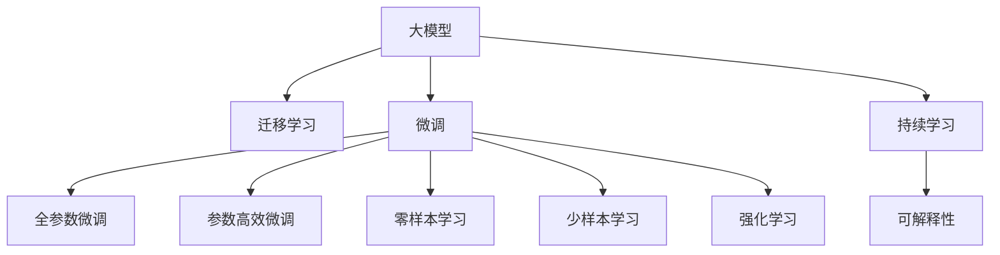
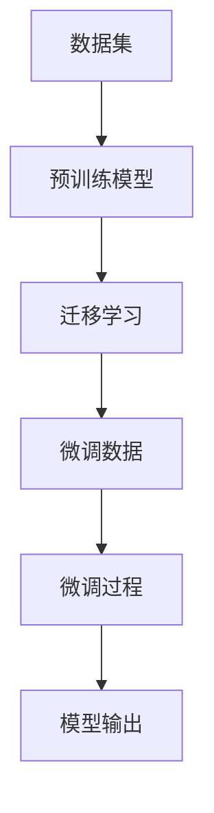

                 

## 1. 背景介绍

在现代商业竞争中，智能化转型已经成为一个不容忽视的趋势。企业通过引入人工智能(AI)技术，不仅提高了生产效率，还优化了客户服务，推动了业务创新。本文将详细探讨大模型的应用，如何助力企业完成智能化转型，并在未来商业中发挥关键作用。

## 2. 核心概念与联系

### 2.1 核心概念概述

为更好地理解大模型在商业智能化转型中的作用，本节将介绍几个关键概念：

- **大模型(Large Model)**：基于深度学习的大规模模型，如BERT、GPT-3等。这些模型通过大量数据训练，具备强大的学习能力和泛化能力。

- **迁移学习(Transfer Learning)**：指将一个领域学习到的知识迁移到另一个领域。大模型通过迁移学习可以适应不同的商业应用场景。

- **微调(Fine-Tuning)**：在大模型的基础上，针对特定任务进行小规模的数据训练，提升模型在该任务上的性能。

- **零样本学习(Zero-Shot Learning)**：在模型没有经过特定任务训练的情况下，通过文本描述进行推理。

- **少样本学习(Few-Shot Learning)**：仅使用少量标注数据进行训练，提升模型在新数据上的泛化能力。

- **强化学习(Reinforcement Learning)**：通过与环境的互动，不断优化决策策略，提升模型性能。

- **持续学习(Continual Learning)**：模型需要不断从新数据中学习，保持性能，避免过拟合。

- **可解释性(Explainability)**：解释模型的决策过程，使其更具可信度。

这些概念通过以下Mermaid流程图来展示：



### 2.2 核心概念原理和架构的 Mermaid 流程图



这个流程图展示了从数据集到最终输出的过程：

1. 首先收集商业场景中的数据集。
2. 使用大模型进行预训练，获得基础的模型知识。
3. 通过迁移学习，将预训练模型迁移到具体的商业任务上。
4. 对迁移后的模型进行微调，适应特定任务。
5. 通过模型输出，实现商业智能化决策。

## 3. 核心算法原理 & 具体操作步骤

### 3.1 算法原理概述

大模型通过在大规模数据集上进行预训练，学习了通用的知识表示。在大规模无标签数据上进行预训练后，这些模型可以进行迁移学习，快速适应特定的商业场景。

在迁移学习的基础上，通过微调，模型可以进一步优化特定商业任务的性能。微调通常使用有标签数据，通过小规模的数据训练，提高模型在该任务上的精度。

### 3.2 算法步骤详解

大模型在商业智能化转型中的应用主要分为以下几个步骤：

1. **数据预处理**：收集和处理商业场景中的数据，确保数据质量和一致性。

2. **模型预训练**：使用大模型在大规模无标签数据上进行预训练，学习通用的知识表示。

3. **迁移学习**：选择适当的大模型，进行迁移学习，使其适应特定的商业任务。

4. **微调**：对迁移后的模型进行微调，使用少量标注数据，提升模型在该任务上的性能。

5. **部署和评估**：将微调后的模型部署到商业应用中，实时监控模型表现，不断优化和改进。

### 3.3 算法优缺点

**优点**：
- **效率高**：大模型通过迁移学习，可以快速适应新任务，减少从头训练的时间。
- **泛化能力强**：大模型通过预训练和迁移学习，具备强大的泛化能力，能够处理多种商业任务。
- **可解释性好**：大模型的复杂结构可以提供较好的可解释性，有助于理解模型的决策过程。

**缺点**：
- **资源消耗大**：大模型需要大量的计算资源和存储空间。
- **成本高**：大模型预训练和迁移学习需要大量的标注数据和计算资源。
- **依赖数据**：模型的性能取决于数据的质量和数量，数据不足时可能效果不佳。

### 3.4 算法应用领域

大模型在商业智能化转型中具有广泛的应用场景，包括但不限于以下几个领域：

- **客户关系管理**：通过大模型分析客户数据，提供个性化的推荐和服务。
- **供应链管理**：通过大模型预测市场需求，优化库存和物流。
- **财务分析**：通过大模型进行财务报表分析和风险评估。
- **市场营销**：通过大模型分析市场趋势，制定精准的市场策略。
- **人力资源管理**：通过大模型分析员工数据，提升招聘和培训效率。

## 4. 数学模型和公式 & 详细讲解

### 4.1 数学模型构建

假设有一个大模型 $M$，通过预训练和迁移学习，在新任务 $T$ 上微调。微调的数学模型为：

$$
\min_{\theta} \frac{1}{N} \sum_{i=1}^{N} \ell(M(x_i), y_i)
$$

其中 $\ell$ 为损失函数，$x_i$ 为输入数据，$y_i$ 为标签，$\theta$ 为模型参数。

### 4.2 公式推导过程

以二分类任务为例，损失函数可以定义为交叉熵损失函数：

$$
\ell(M(x_i), y_i) = -(y_i \log M(x_i) + (1 - y_i) \log(1 - M(x_i)))
$$

微调的优化目标是最小化损失函数，即：

$$
\min_{\theta} \frac{1}{N} \sum_{i=1}^{N} \ell(M(x_i), y_i)
$$

通过梯度下降等优化算法，更新模型参数 $\theta$，使得模型在特定任务上的性能最大化。

### 4.3 案例分析与讲解

假设有一个电商平台，使用大模型进行用户行为分析，实现个性化推荐。首先，收集用户浏览、购买、评分等行为数据，进行数据预处理。然后使用预训练的BERT模型，进行迁移学习，适应推荐任务。最后，使用少量的标注数据进行微调，提升推荐精度。

## 5. 项目实践：代码实例和详细解释说明

### 5.1 开发环境搭建

在使用大模型进行商业智能化转型的过程中，需要配置好开发环境。以下是在Python中使用PyTorch进行开发的流程：

1. 安装Anaconda：从官网下载并安装Anaconda，用于创建独立的Python环境。

2. 创建并激活虚拟环境：
```bash
conda create -n pytorch-env python=3.8 
conda activate pytorch-env
```

3. 安装PyTorch：根据CUDA版本，从官网获取对应的安装命令。例如：
```bash
conda install pytorch torchvision torchaudio cudatoolkit=11.1 -c pytorch -c conda-forge
```

4. 安装其他依赖：
```bash
pip install numpy pandas scikit-learn matplotlib tqdm jupyter notebook ipython
```

5. 配置环境：
```bash
pip install transformers
```

### 5.2 源代码详细实现

以下是一个使用大模型进行推荐系统开发的示例代码。首先，加载预训练模型和数据集：

```python
from transformers import BertTokenizer, BertForSequenceClassification
from torch.utils.data import Dataset, DataLoader
from torch import nn

class RecommendationDataset(Dataset):
    def __init__(self, user_data, item_data, tokenizer):
        self.user_data = user_data
        self.item_data = item_data
        self.tokenizer = tokenizer
        
    def __len__(self):
        return len(self.user_data)
    
    def __getitem__(self, idx):
        user_id = self.user_data[idx]['user_id']
        item_id = self.item_data[idx]['item_id']
        user_sentence = self.user_data[idx]['user_sentence']
        item_sentence = self.item_data[idx]['item_sentence']
        
        user_input_ids = self.tokenizer(user_sentence, return_tensors='pt', padding='max_length')['input_ids']
        item_input_ids = self.tokenizer(item_sentence, return_tensors='pt', padding='max_length')['input_ids']
        
        return {
            'user_input_ids': user_input_ids,
            'item_input_ids': item_input_ids,
            'user_id': user_id,
            'item_id': item_id
        }

# 加载预训练模型和分词器
tokenizer = BertTokenizer.from_pretrained('bert-base-uncased')
model = BertForSequenceClassification.from_pretrained('bert-base-uncased', num_labels=2)
```

接着，定义训练函数和评估函数：

```python
class RecommendationModel(nn.Module):
    def __init__(self, model, num_labels):
        super(RecommendationModel, self).__init__()
        self.model = model
        self.num_labels = num_labels
        
    def forward(self, user_input_ids, item_input_ids):
        user_input_ids = self.model(user_input_ids)[:, 0]
        item_input_ids = self.model(item_input_ids)[:, 0]
        return torch.mean(torch.stack([user_input_ids, item_input_ids]), dim=0)

def train_epoch(model, dataloader, optimizer, device):
    model.train()
    total_loss = 0
    for batch in dataloader:
        user_input_ids = batch['user_input_ids'].to(device)
        item_input_ids = batch['item_input_ids'].to(device)
        labels = batch['labels'].to(device)
        optimizer.zero_grad()
        outputs = model(user_input_ids, item_input_ids)
        loss = nn.CrossEntropyLoss()(outputs, labels)
        loss.backward()
        optimizer.step()
        total_loss += loss.item()
    return total_loss / len(dataloader)

def evaluate(model, dataloader, device):
    model.eval()
    total_loss = 0
    total_correct = 0
    with torch.no_grad():
        for batch in dataloader:
            user_input_ids = batch['user_input_ids'].to(device)
            item_input_ids = batch['item_input_ids'].to(device)
            labels = batch['labels'].to(device)
            outputs = model(user_input_ids, item_input_ids)
            loss = nn.CrossEntropyLoss()(outputs, labels)
            total_loss += loss.item()
            predicted = torch.argmax(outputs, dim=1)
            total_correct += (predicted == labels).sum().item()
    return total_loss / len(dataloader), total_correct / len(dataloader.dataset)
```

最后，进行模型训练和评估：

```python
epochs = 5
batch_size = 16

device = torch.device('cuda') if torch.cuda.is_available() else torch.device('cpu')
model.to(device)

for epoch in range(epochs):
    train_loss = train_epoch(model, train_loader, optimizer, device)
    dev_loss, dev_acc = evaluate(model, dev_loader, device)
    print(f"Epoch {epoch+1}, train loss: {train_loss:.3f}, dev loss: {dev_loss:.3f}, dev acc: {dev_acc:.3f}")

print(f"Test loss: {test_loss:.3f}, test acc: {test_acc:.3f}")
```

### 5.3 代码解读与分析

在上述代码中，首先定义了推荐数据集类 `RecommendationDataset`，用于加载用户和物品的特征数据。接着，加载预训练模型 `BertForSequenceClassification` 和分词器，定义了推荐模型的架构。在 `RecommendationModel` 中，通过两个输入的加权平均值作为最终输出。训练函数 `train_epoch` 使用交叉熵损失进行优化，评估函数 `evaluate` 输出模型的损失和准确率。

## 6. 实际应用场景

### 6.1 智能客服系统

智能客服系统是大模型在商业智能化转型中的重要应用场景之一。通过使用大模型，企业可以构建7x24小时的智能客服系统，快速响应客户咨询，提升客户体验。

### 6.2 金融风险管理

金融行业需要实时监控市场动向，及时应对风险。通过使用大模型进行情感分析和舆情监测，可以实时预警风险，保护金融资产安全。

### 6.3 个性化推荐系统

个性化推荐系统是大模型在商业智能化转型的重要应用。通过分析用户行为数据，使用大模型进行推荐，可以提升用户满意度，增加企业收益。

### 6.4 供应链管理

供应链管理是大模型在商业智能化转型的另一个重要应用场景。通过使用大模型进行预测和优化，可以提升供应链的效率和响应能力，降低成本。

## 7. 工具和资源推荐

### 7.1 学习资源推荐

为了帮助开发者系统掌握大模型的应用，以下推荐一些优质的学习资源：

1. 《深度学习》课程：斯坦福大学开设的深度学习课程，涵盖基础知识和前沿技术。

2. 《自然语言处理》书籍：深度学习和大模型在NLP领域的重要应用。

3. 《Transformers》论文：介绍Transformer架构和大模型预训练的论文。

4. Hugging Face官方文档：Transformer库的官方文档，提供了丰富的模型和代码样例。

5. TensorFlow官方文档：深度学习框架TensorFlow的官方文档，提供详细的API和算法实现。

### 7.2 开发工具推荐

以下是一些用于大模型开发的常用工具：

1. PyTorch：基于Python的开源深度学习框架，灵活动态的计算图，适合快速迭代研究。

2. TensorFlow：由Google主导开发的深度学习框架，生产部署方便，适合大规模工程应用。

3. Transformers库：Hugging Face开发的NLP工具库，集成了众多SOTA语言模型。

4. Jupyter Notebook：免费的交互式编程环境，支持Python和其他编程语言。

5. Weights & Biases：模型训练的实验跟踪工具，可以记录和可视化模型训练过程中的各项指标。

### 7.3 相关论文推荐

大模型在商业智能化转型的研究源于学界的持续研究。以下是几篇奠基性的相关论文，推荐阅读：

1. Attention is All You Need：介绍Transformer架构和大模型预训练的论文。

2. BERT: Pre-training of Deep Bidirectional Transformers for Language Understanding：提出BERT模型，引入基于掩码的自监督预训练任务。

3. GPT-3: Language Models are Unsupservised Multitask Learners：展示GPT-3模型的零样本学习能力。

4. AdaLoRA: Adaptive Low-Rank Adaptation for Parameter-Efficient Fine-Tuning：提出AdaLoRA方法，提高微调效率。

5. Sparse Transformers：介绍稀疏化Transformer，提升模型计算效率。

## 8. 总结：未来发展趋势与挑战

### 8.1 未来发展趋势

未来，大模型将在商业智能化转型中发挥越来越重要的作用。以下是大模型未来的发展趋势：

1. **模型规模增大**：随着算力成本的下降和数据规模的扩张，大模型的参数量将持续增长，涵盖更多领域的知识表示。

2. **微调方法多样化**：除了传统的全参数微调，未来将出现更多参数高效和计算高效的微调方法，如Adapter、Prompt-Tuning等。

3. **模型鲁棒性提升**：通过对抗训练、迁移学习等技术，提高大模型在不同数据分布下的泛化能力。

4. **持续学习成为常态**：大模型需要不断从新数据中学习，保持性能，避免过拟合。

5. **可解释性增强**：通过可解释性技术，增强模型的决策过程的透明性，提升可信度。

6. **应用场景多样化**：大模型将应用于更多领域，如金融、医疗、教育等。

### 8.2 面临的挑战

尽管大模型在商业智能化转型中具有巨大潜力，但在实际应用中也面临诸多挑战：

1. **资源消耗大**：大模型需要大量的计算资源和存储空间，部署成本较高。

2. **数据依赖性强**：大模型的性能依赖于高质量的数据，数据获取成本较高。

3. **泛化能力有限**：大模型在特定领域的应用可能效果不佳，需要进一步迁移学习。

4. **可解释性不足**：大模型通常缺乏可解释性，难以理解其决策过程。

5. **安全风险高**：大模型可能学习有害信息，产生误导性输出，需要加强安全防护。

6. **维护成本高**：大模型的持续学习和更新需要持续投入，维护成本较高。

### 8.3 研究展望

未来，大模型在商业智能化转型中的研究可以从以下几个方面进行：

1. **多模态融合**：将视觉、语音等多模态数据与文本数据结合，提升模型的理解和生成能力。

2. **自监督学习**：利用自监督学习技术，降低对标注数据的依赖，提升模型的泛化能力。

3. **因果推断**：通过因果推断技术，增强模型的决策过程的可解释性和鲁棒性。

4. **对抗攻击**：研究对抗攻击技术，提升模型在面对恶意输入时的鲁棒性。

5. **伦理和社会责任**：加强对大模型伦理和社会责任的研究，确保模型的公平性和透明性。

6. **开源和协作**：促进大模型开源和协作，推动模型的普及和应用。

## 9. 附录：常见问题与解答

**Q1: 大模型在商业智能化转型中的作用是什么？**

A: 大模型通过预训练和迁移学习，可以快速适应特定的商业场景，提升业务决策的智能化水平，提高运营效率和客户满意度。

**Q2: 大模型在商业智能化转型中存在哪些挑战？**

A: 大模型在商业智能化转型中面临资源消耗大、数据依赖强、可解释性不足等挑战，需要在模型架构、算法设计和应用实践中进行优化和改进。

**Q3: 大模型在商业智能化转型中的未来发展方向是什么？**

A: 大模型在商业智能化转型中的未来发展方向包括模型规模增大、微调方法多样化、持续学习成为常态等，需要进一步提升模型的鲁棒性、可解释性和泛化能力。

**Q4: 大模型在商业智能化转型中的实际应用场景有哪些？**

A: 大模型在商业智能化转型中的实际应用场景包括智能客服、金融风险管理、个性化推荐系统、供应链管理等，具有广泛的应用前景。

**Q5: 大模型在商业智能化转型中的学习资源和开发工具有哪些？**

A: 大模型在商业智能化转型中的学习资源包括《深度学习》课程、《自然语言处理》书籍、《Transformers》论文等，开发工具包括PyTorch、TensorFlow、Jupyter Notebook等。

