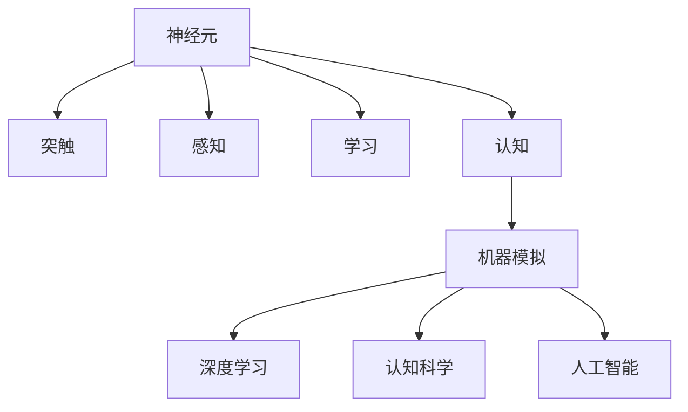

                 

# 大脑工作原理与机器模拟的探讨

> 关键词：大脑工作原理, 机器模拟, 神经网络, 深度学习, 认知科学, 人工智能

## 1. 背景介绍

### 1.1 问题由来
人类大脑是自然界最为复杂的器官之一，其工作原理至今仍有许多未解之谜。近年来，随着认知科学、神经科学和人工智能技术的快速发展，科学家们开始尝试通过机器模拟大脑来揭示其内部机制。机器模拟不仅能够帮助我们理解大脑的工作方式，还为人工智能、认知计算等前沿领域提供了新的研究范式。

### 1.2 问题核心关键点
- **神经元与突触**：大脑的基本功能单元是神经元和突触，它们通过电信号和化学信号传递信息。
- **感知与学习**：大脑如何感知外界刺激，并将信息转化为认知活动？
- **认知计算**：如何通过机器模拟大脑的认知过程，实现复杂的计算和决策？
- **伦理与隐私**：机器模拟大脑可能带来的伦理和隐私问题。

这些关键点构成了研究大脑工作原理与机器模拟的核心框架，为理解大脑和设计机器智能提供了重要的理论基础。

### 1.3 问题研究意义
研究大脑工作原理与机器模拟具有深远的意义：

1. **揭示认知本质**：通过模拟大脑的运作，可以揭示人类认知的生物学基础，为认知科学研究提供新视角。
2. **推动人工智能**：理解和模拟大脑的认知过程，可以推动人工智能向更加智能化、泛化能力更强的方向发展。
3. **促进健康医疗**：机器模拟大脑可以帮助我们理解神经疾病的发病机制，为医疗干预提供新思路。
4. **拓展认知计算**：模拟大脑的认知过程，可以拓展认知计算的新领域，如增强认知功能、认知辅助系统等。
5. **引发伦理思考**：机器模拟大脑可能会引发一系列伦理问题，如隐私保护、人工智能决策的透明性等。

总之，研究大脑工作原理与机器模拟，对于推动认知科学、人工智能和健康医疗等领域的发展具有重要价值。

## 2. 核心概念与联系

### 2.1 核心概念概述

为更好地理解大脑工作原理与机器模拟，本节将介绍几个密切相关的核心概念：

- **神经元(Neuron)**：大脑的基本功能单元，接收输入信号，通过电信号传递信息。
- **突触(Synapse)**：神经元之间的连接点，负责传递化学信号。
- **感知(Sensory Perception)**：大脑如何感知外界刺激，并将其转化为电信号。
- **学习(Learning)**：大脑如何通过神经元之间的连接和突触可塑性来存储和提取信息。
- **认知(Cognition)**：大脑如何理解语言、执行决策等复杂认知活动。
- **机器模拟(Machine Simulation)**：通过计算模型模拟大脑的运作，以实现对认知过程的模拟和理解。
- **深度学习(Deep Learning)**：一种强大的机器学习方法，通过多层神经网络模拟大脑的认知过程。
- **认知科学(Cognitive Science)**：研究认知过程的科学，结合神经科学、心理学、人工智能等多个领域。
- **人工智能(Artificial Intelligence)**：旨在创建智能系统的技术，包括机器学习、自然语言处理、计算机视觉等。

这些核心概念之间的逻辑关系可以通过以下Mermaid流程图来展示：



这个流程图展示了大脑工作原理与机器模拟的核心概念及其之间的关系：

1. 神经元和突触是大脑的基础组成部分，负责传递和处理信息。
2. 感知和学习是大脑的基本功能，使大脑能够从外界环境中提取信息并进行存储和提取。
3. 认知是大脑的高层功能，使大脑能够理解和执行复杂的认知任务。
4. 机器模拟通过计算模型来模拟大脑的运作，以实现对认知过程的理解和模拟。
5. 深度学习作为机器模拟的一种方法，通过多层神经网络来模拟大脑的认知过程。
6. 认知科学与人工智能紧密相关，旨在通过研究大脑的认知过程，推动认知计算和智能技术的发展。

这些概念共同构成了研究大脑工作原理与机器模拟的理论基础，有助于理解大脑和设计机器智能。

## 3. 核心算法原理 & 具体操作步骤
### 3.1 算法原理概述

机器模拟大脑的运作，主要依赖于神经网络和深度学习技术。其核心思想是通过计算模型模拟大脑的神经元、突触和连接机制，实现对感知、学习、认知等认知过程的模拟。

具体而言，神经网络由多个神经元组成，每个神经元接收输入信号，通过加权求和和激活函数进行计算，并将结果传递给下一层神经元。每个神经元之间通过突触进行连接，突触的强度和权重决定了神经元之间的信息传递效率。

深度学习通过多层神经网络模拟大脑的认知过程，每一层神经元负责处理不同的特征，并通过反向传播算法调整权重和偏差，以最小化预测误差。这种模拟方式可以处理复杂的非线性关系，并在大量数据上进行有效学习。

### 3.2 算法步骤详解

机器模拟大脑的运作，主要包括以下几个关键步骤：

**Step 1: 构建计算模型**
- 选择合适的神经网络结构，如多层感知器(MLP)、卷积神经网络(CNN)、递归神经网络(RNN)等。
- 定义神经元、突触和连接机制，设计合适的激活函数和损失函数。

**Step 2: 收集和准备数据**
- 收集与大脑认知过程相关的数据，如大脑的神经元活动记录、行为数据、影像数据等。
- 对数据进行预处理和标注，确保数据的质量和可用性。

**Step 3: 训练和优化模型**
- 使用反向传播算法，通过训练数据调整神经网络的权重和偏差，最小化预测误差。
- 使用正则化技术，如L2正则、Dropout等，防止模型过拟合。
- 使用超参数调优技术，如网格搜索、贝叶斯优化等，寻找最优的模型配置。

**Step 4: 测试和评估模型**
- 在测试数据集上评估模型的性能，使用指标如准确率、召回率、F1值等进行评估。
- 分析模型在感知、学习、认知等不同任务上的表现，识别模型的不足之处。

**Step 5: 模拟和应用**
- 使用训练好的模型进行机器模拟，模拟大脑的认知过程。
- 将模拟结果应用于实际问题中，如认知计算、人工智能决策、健康医疗等。

以上是机器模拟大脑运作的一般流程。在实际应用中，还需要针对具体任务的特点，对模型进行优化设计，如改进网络结构、引入更多先验知识、优化训练策略等，以进一步提升模型的性能。

### 3.3 算法优缺点

机器模拟大脑的运作具有以下优点：
1. 可解释性：神经网络模型通过权重和偏差的调整，可以解释其内部工作机制，帮助理解大脑的认知过程。
2. 泛化能力：深度学习模型具有强大的泛化能力，可以处理复杂的非线性关系，适用于各种认知任务。
3. 高效性：通过并行计算和分布式训练，深度学习模型可以高效处理大量数据，加速研究进程。
4. 可扩展性：神经网络模型可以根据需要灵活扩展，适应不同复杂度的认知任务。

同时，该方法也存在一些局限性：
1. 模型复杂性：神经网络模型的复杂度较高，训练和推理所需计算资源较多。
2. 数据需求：训练神经网络模型需要大量标注数据，数据获取和处理成本较高。
3. 参数调优：神经网络模型的参数调优需要大量的实验和验证，寻找最优的超参数配置。
4. 模型鲁棒性：神经网络模型容易受到输入噪声和数据偏差的影响，鲁棒性不足。
5. 模型透明性：深度学习模型的内部运作机制复杂，难以进行直观解释和调试。

尽管存在这些局限性，但就目前而言，神经网络模型在机器模拟大脑的运作中仍是最主流的方法。未来相关研究的重点在于如何进一步降低模型的复杂性，提高数据利用率，优化训练策略，并增强模型的透明性和鲁棒性。

### 3.4 算法应用领域

机器模拟大脑的运作，已经在多个领域得到了广泛应用，包括但不限于：

- **认知计算**：通过模拟大脑的认知过程，实现复杂认知任务的计算和推理。
- **人工智能**：应用于语音识别、图像识别、自然语言处理等人工智能任务中，提升模型性能。
- **健康医疗**：应用于脑功能障碍诊断、神经疾病治疗等医疗领域，提供新的干预手段。
- **心理学研究**：通过模拟大脑的认知过程，研究人类行为和心理机制。
- **教育和培训**：应用于教育游戏、虚拟实验室、智能辅导系统等，提升学习效果。
- **娱乐和游戏**：应用于虚拟现实、增强现实等娱乐应用中，提供沉浸式体验。

这些应用领域展示了机器模拟大脑的运作在各个方面的广泛影响，展示了其巨大的潜力和应用前景。

## 4. 数学模型和公式 & 详细讲解  
### 4.1 数学模型构建

机器模拟大脑的运作，可以通过数学模型来描述和分析。以下是一个简单的神经网络模型，其数学表达式如下：

$$
h_i = f(w_i^T x + b_i)
$$

$$
y = h_i
$$

其中，$x$ 为输入向量，$h_i$ 为第 $i$ 个神经元的输出，$w_i$ 和 $b_i$ 为第 $i$ 个神经元的权重和偏差，$f$ 为激活函数。

一个简单的两层神经网络模型如下：

```
       x------> w1------> f1------> w2------> f2------> y
```

其中，$f$ 为激活函数，如 sigmoid 或 ReLU 函数。该模型可以处理输入向量和输出向量之间的关系，并通过反向传播算法调整权重和偏差，最小化预测误差。

### 4.2 公式推导过程

下面以 sigmoid 激活函数为例，推导神经网络的前向传播和反向传播过程。

前向传播过程如下：

$$
h_i = \frac{1}{1 + e^{-w_i^T x - b_i}}
$$

其中，$e$ 为自然常数，$h_i$ 为第 $i$ 个神经元的输出。

反向传播过程如下：

$$
\frac{\partial L}{\partial w_i} = \sum_j \frac{\partial L}{\partial y_j} \frac{\partial y_j}{\partial h_j} \frac{\partial h_j}{\partial w_i}
$$

其中，$L$ 为损失函数，$y_j$ 为第 $j$ 个神经元的输出，$h_j$ 为第 $j$ 个神经元的输入，$\frac{\partial L}{\partial y_j}$ 为损失函数对第 $j$ 个神经元输出的偏导数，$\frac{\partial y_j}{\partial h_j}$ 为激活函数对第 $j$ 个神经元输入的偏导数，$\frac{\partial h_j}{\partial w_i}$ 为第 $i$ 个神经元对第 $j$ 个神经元输出的偏导数。

通过反向传播算法，可以计算每个神经元对损失函数的贡献，并据此调整权重和偏差，最小化预测误差。

### 4.3 案例分析与讲解

以手写数字识别为例，以下是神经网络模型在手写数字识别任务上的实现：

**Step 1: 数据准备**
- 收集手写数字图片和标注数据，将每张图片转换为向量形式。
- 对数据进行预处理，如归一化、数据增强等。

**Step 2: 构建模型**
- 选择多层感知器(MLP)作为模型架构，定义神经元、突触和连接机制。
- 设置激活函数为 sigmoid 函数，定义损失函数为交叉熵损失函数。

**Step 3: 训练模型**
- 使用反向传播算法，调整神经网络的权重和偏差，最小化预测误差。
- 使用正则化技术，如 L2 正则、Dropout 等，防止模型过拟合。
- 使用超参数调优技术，如网格搜索、贝叶斯优化等，寻找最优的超参数配置。

**Step 4: 测试和评估**
- 在测试数据集上评估模型的性能，使用指标如准确率、召回率、F1 值等进行评估。
- 分析模型在手写数字识别任务上的表现，识别模型的不足之处。

**Step 5: 应用**
- 使用训练好的模型进行手写数字识别，输出识别结果。
- 将识别结果应用于实际问题中，如自动文档识别、自动驾驶等。

通过以上步骤，可以看出神经网络模型在手写数字识别任务上的实现过程。需要注意的是，实际应用中还需要根据具体任务的特点，对模型进行优化设计，如改进网络结构、引入更多先验知识、优化训练策略等，以进一步提升模型的性能。

## 5. 项目实践：代码实例和详细解释说明
### 5.1 开发环境搭建

在进行机器模拟大脑的运作实践前，我们需要准备好开发环境。以下是使用 Python 进行 TensorFlow 开发的环境配置流程：

1. 安装 Anaconda：从官网下载并安装 Anaconda，用于创建独立的 Python 环境。

2. 创建并激活虚拟环境：
```bash
conda create -n tf-env python=3.8 
conda activate tf-env
```

3. 安装 TensorFlow：根据 GPU 版本，从官网获取对应的安装命令。例如：
```bash
conda install tensorflow-gpu -c conda-forge -c pytorch
```

4. 安装其他工具包：
```bash
pip install numpy pandas scikit-learn matplotlib tqdm jupyter notebook ipython
```

完成上述步骤后，即可在 `tf-env` 环境中开始机器模拟大脑的运作实践。

### 5.2 源代码详细实现

下面我们以手写数字识别为例，给出使用 TensorFlow 对神经网络模型进行训练的 PyTorch 代码实现。

首先，定义数据处理函数：

```python
import numpy as np
from tensorflow.keras.datasets import mnist
from tensorflow.keras.utils import to_categorical

def load_data():
    (x_train, y_train), (x_test, y_test) = mnist.load_data()
    x_train = x_train.reshape(-1, 28 * 28).astype('float32') / 255.0
    x_test = x_test.reshape(-1, 28 * 28).astype('float32') / 255.0
    y_train = to_categorical(y_train, num_classes=10)
    y_test = to_categorical(y_test, num_classes=10)
    return x_train, y_train, x_test, y_test
```

然后，定义神经网络模型：

```python
import tensorflow as tf
from tensorflow.keras import layers

model = tf.keras.Sequential([
    layers.Dense(128, activation='relu', input_shape=(784,)),
    layers.Dropout(0.2),
    layers.Dense(10, activation='softmax')
])
```

接着，定义损失函数和优化器：

```python
loss_fn = tf.keras.losses.CategoricalCrossentropy(from_logits=True)
optimizer = tf.keras.optimizers.Adam(learning_rate=0.001)
```

最后，定义训练和评估函数：

```python
def train_epoch(model, x_train, y_train, batch_size=32):
    dataset = tf.data.Dataset.from_tensor_slices((x_train, y_train)).shuffle(1000).batch(batch_size)
    model.fit(dataset, epochs=10, batch_size=batch_size, verbose=0)
    
def evaluate(model, x_test, y_test):
    dataset = tf.data.Dataset.from_tensor_slices((x_test, y_test)).batch(32)
    loss = loss_fn(model(x_test, training=False)).numpy()
    acc = np.mean(np.argmax(model(x_test, training=False), axis=1) == np.argmax(y_test, axis=1))
    return loss, acc
```

启动训练流程并在测试集上评估：

```python
x_train, y_train, x_test, y_test = load_data()
train_epoch(model, x_train, y_train)
loss, acc = evaluate(model, x_test, y_test)
print('Test Loss:', loss)
print('Test Accuracy:', acc)
```

以上就是使用 TensorFlow 对神经网络模型进行手写数字识别的完整代码实现。可以看到，得益于 TensorFlow 的强大封装，我们可以用相对简洁的代码完成神经网络模型的加载和训练。

### 5.3 代码解读与分析

让我们再详细解读一下关键代码的实现细节：

**load_data() 函数**：
- 从 MNIST 数据集中加载手写数字图片和标注数据。
- 对数据进行归一化和重构，使其适合输入神经网络。
- 对标签进行 one-hot 编码，使其适合计算交叉熵损失。

**神经网络模型定义**：
- 使用 TensorFlow 的 Sequential 模型构建神经网络，包括一个全连接层、一个 Dropout 层和一个输出层。
- 全连接层的激活函数为 ReLU，Dropout 层的概率为 0.2，防止过拟合。
- 输出层的激活函数为 softmax，用于多分类任务。

**损失函数和优化器**：
- 使用交叉熵损失函数，并设置为 from_logits=True，因为 TensorFlow 的 loss_fn 默认期望输出为 logits。
- 使用 Adam 优化器，学习率为 0.001，优化过程较为高效。

**训练和评估函数**：
- 使用 TensorFlow 的 Data API 将数据集转换为可迭代的数据集，并进行 shuffle 和 batch 操作。
- 使用 fit 函数训练模型，并使用 evaluate 函数评估模型在测试集上的性能。
- 输出测试集上的损失和准确率。

可以看到，TensorFlow 使得神经网络模型的实现变得非常简洁和高效，开发者可以将更多精力放在数据处理、模型改进等高层逻辑上，而不必过多关注底层的实现细节。

当然，工业级的系统实现还需考虑更多因素，如模型的保存和部署、超参数的自动搜索、更灵活的任务适配层等。但核心的机器模拟大脑的运作过程基本与此类似。

## 6. 实际应用场景
### 6.1 认知计算

机器模拟大脑的运作，已经广泛应用于认知计算领域。通过模拟大脑的认知过程，可以解决复杂的认知问题，如推理、决策、规划等。

例如，在机器翻译任务中，机器模拟大脑的运作可以帮助模型理解上下文，生成更加流畅和准确的翻译结果。在自然语言理解任务中，机器模拟大脑的运作可以帮助模型理解语言的语义和语用，生成更加合理的推理结果。

### 6.2 人工智能

机器模拟大脑的运作，广泛应用于各种人工智能任务中，如语音识别、图像识别、自然语言处理等。通过模拟大脑的认知过程，可以提升这些任务的性能，拓展其应用范围。

例如，在语音识别任务中，机器模拟大脑的运作可以帮助模型理解语音的声学特征和语言语义，生成更加准确和自然的识别结果。在图像识别任务中，机器模拟大脑的运作可以帮助模型理解图像的视觉特征和语义信息，生成更加精准的识别结果。

### 6.3 健康医疗

机器模拟大脑的运作，也广泛应用于健康医疗领域。通过模拟大脑的认知过程，可以研究神经疾病的机理，开发新的治疗手段。

例如，在脑功能障碍诊断任务中，机器模拟大脑的运作可以帮助医生理解神经元的异常活动，诊断病情。在神经疾病治疗任务中，机器模拟大脑的运作可以帮助医生设计个性化的治疗方案，提高治疗效果。

### 6.4 未来应用展望

随着机器模拟大脑的运作技术的发展，其在更多领域的应用前景广阔：

- **增强认知功能**：通过机器模拟大脑的运作，可以增强人类的认知功能，如记忆力、注意力、学习能力等，提升智力水平。
- **智能辅助系统**：基于机器模拟大脑的运作，可以开发各种智能辅助系统，如智能教育、智能训练、智能决策等，提高生产效率和生活质量。
- **认知增强设备**：基于机器模拟大脑的运作，可以开发各种认知增强设备，如智能眼镜、智能手表、智能头盔等，提升人类感知和决策能力。

未来，机器模拟大脑的运作技术将不断突破，在更广泛的领域产生深远影响。

## 7. 工具和资源推荐
### 7.1 学习资源推荐

为了帮助开发者系统掌握机器模拟大脑的运作的理论基础和实践技巧，这里推荐一些优质的学习资源：

1. **《深度学习》书籍**：Ian Goodfellow、Yoshua Bengio 和 Aaron Courville 所著，系统介绍了深度学习的基础理论和应用实践。
2. **CS231n《深度学习与计算机视觉》课程**：斯坦福大学开设的深度学习课程，涵盖图像识别、自然语言处理等多个领域。
3. **DeepMind 论文**：DeepMind 研究团队发布的大量深度学习论文，涵盖了深度学习的各个方向和前沿技术。
4. **ArXiv 预印本**：ArXiv 上的深度学习预印本，涵盖了最新的深度学习研究成果和前沿技术。
5. **Google AI 博客**：Google AI 团队发布的深度学习博客，涵盖深度学习的各种应用和前沿技术。

通过对这些资源的学习实践，相信你一定能够快速掌握机器模拟大脑的运作的精髓，并用于解决实际的机器学习和人工智能问题。

### 7.2 开发工具推荐

高效的开发离不开优秀的工具支持。以下是几款用于机器模拟大脑的运作开发的常用工具：

1. TensorFlow：由 Google 主导开发的深度学习框架，功能强大、易用性高，支持分布式训练和模型部署。
2. PyTorch：由 Facebook 主导开发的深度学习框架，灵活性高、易于调试，支持动态计算图。
3. Keras：基于 TensorFlow 和 PyTorch 的高层 API，简单易用，适合快速迭代研究。
4. Jupyter Notebook：Python 的交互式开发环境，支持代码运行、结果展示和实验记录，是研究和开发的重要工具。
5. Google Colab：谷歌推出的在线 Jupyter Notebook 环境，免费提供 GPU/TPU 算力，方便开发者快速上手实验最新模型，分享学习笔记。

合理利用这些工具，可以显著提升机器模拟大脑的运作的开发效率，加快创新迭代的步伐。

### 7.3 相关论文推荐

机器模拟大脑的运作技术的发展，源于学界的持续研究。以下是几篇奠基性的相关论文，推荐阅读：

1. **《人工神经网络》**：Hinton、Rumelhart 和 Williams 所著，系统介绍了人工神经网络的基础理论和应用实践。
2. **《神经网络与深度学习》**：Goodfellow、Bengio 和 Courville 所著，涵盖了神经网络、深度学习的基础理论和应用实践。
3. **《深度学习与认知科学》**：Rumelhart、McClelland 和 Parallel 所著，探讨了深度学习与认知科学的结合。
4. **《人类心智计算中的深度学习》**：Ian Goodfellow 所著，探讨了深度学习在人类心智计算中的应用。
5. **《深度学习与人工智能》**：Kurzweil 所著，探讨了深度学习与人工智能的未来发展趋势。

这些论文代表了大规模机器模拟大脑的运作的发展脉络。通过学习这些前沿成果，可以帮助研究者把握学科前进方向，激发更多的创新灵感。

## 8. 总结：未来发展趋势与挑战

### 8.1 总结

本文对机器模拟大脑的运作进行了全面系统的介绍。首先阐述了机器模拟大脑的运作的研究背景和意义，明确了其在大规模认知计算、人工智能和健康医疗等领域的重要价值。其次，从原理到实践，详细讲解了神经网络模型的构建和训练过程，给出了机器模拟大脑的运作的完整代码实例。同时，本文还广泛探讨了机器模拟大脑的运作在多个领域的应用前景，展示了其巨大的潜力和应用前景。

通过本文的系统梳理，可以看到，机器模拟大脑的运作在认知计算、人工智能和健康医疗等领域的应用前景广阔，有助于推动相关领域的发展和进步。未来，随着神经网络技术的不断进步，机器模拟大脑的运作必将在更多的领域中发挥重要作用，为人类认知智能的进化带来深远影响。

### 8.2 未来发展趋势

展望未来，机器模拟大脑的运作技术将呈现以下几个发展趋势：

1. **模型复杂度提升**：神经网络模型的复杂度将进一步提升，处理更加复杂和多样化的认知任务。
2. **多模态融合**：机器模拟大脑的运作将越来越多地融合视觉、听觉、触觉等多模态信息，提升认知能力。
3. **认知计算增强**：通过机器模拟大脑的运作，可以开发更加智能和自适应的认知计算系统。
4. **人机协同**：机器模拟大脑的运作将与人类认知能力进行协同，实现更加高效和灵活的智能系统。
5. **隐私保护**：在机器模拟大脑的运作中，隐私保护和安全防范将受到更多关注，确保数据和模型的安全性。

这些趋势凸显了机器模拟大脑的运作技术的广阔前景。这些方向的探索发展，必将进一步提升认知计算和人工智能技术的发展水平，为人类认知智能的进化带来深远影响。

### 8.3 面临的挑战

尽管机器模拟大脑的运作技术已经取得了重要进展，但在迈向更加智能化、泛化能力更强的应用过程中，它仍面临着诸多挑战：

1. **数据获取难度**：获取大规模标注数据仍然是一个难题，特别是对于一些特殊领域的任务。
2. **计算资源需求**：神经网络模型的计算资源需求较高，对硬件配置提出了更高的要求。
3. **模型可解释性**：神经网络模型的内部工作机制复杂，难以进行直观解释和调试。
4. **模型鲁棒性**：神经网络模型容易受到输入噪声和数据偏差的影响，鲁棒性不足。
5. **伦理和隐私**：机器模拟大脑的运作可能会引发一系列伦理和隐私问题，需要慎重对待。

尽管存在这些挑战，但通过不断的研究和探索，未来机器模拟大脑的运作技术必将取得突破，推动认知计算和人工智能技术的发展。

### 8.4 研究展望

未来，机器模拟大脑的运作技术需要在以下几个方面寻求新的突破：

1. **无监督和半监督学习**：摆脱对大规模标注数据的依赖，利用自监督学习、主动学习等无监督和半监督范式，最大限度利用非结构化数据，实现更加灵活高效的机器模拟大脑的运作。
2. **参数高效优化**：开发更加参数高效的优化方法，在固定大部分预训练参数的同时，只更新极少量的任务相关参数，提高模型的计算效率。
3. **多模态融合**：通过融合视觉、听觉、触觉等多模态信息，提升机器模拟大脑的运作的感知和理解能力。
4. **认知增强**：结合符号化的先验知识，如知识图谱、逻辑规则等，引导机器模拟大脑的运作过程，提升其认知能力。
5. **伦理和隐私保护**：在机器模拟大脑的运作中，引入伦理导向的评估指标，过滤和惩罚有偏见、有害的输出倾向，确保输出的安全性。

这些研究方向的探索，必将引领机器模拟大脑的运作技术迈向更高的台阶，为构建安全、可靠、可解释、可控的智能系统铺平道路。面向未来，机器模拟大脑的运作技术还需要与其他人工智能技术进行更深入的融合，如知识表示、因果推理、强化学习等，多路径协同发力，共同推动自然语言理解和智能交互系统的进步。

## 9. 附录：常见问题与解答

**Q1: 什么是机器模拟大脑的运作？**

A: 机器模拟大脑的运作是指通过计算模型模拟大脑的神经元、突触和连接机制，实现对感知、学习、认知等认知过程的模拟。这一过程可以借助神经网络模型、深度学习技术等方法来实现。

**Q2: 机器模拟大脑的运作有哪些应用场景？**

A: 机器模拟大脑的运作已经在多个领域得到了广泛应用，包括但不限于认知计算、人工智能、健康医疗、心理学研究、教育和培训、娱乐和游戏等。

**Q3: 机器模拟大脑的运作面临哪些挑战？**

A: 机器模拟大脑的运作面临数据获取难度高、计算资源需求大、模型可解释性不足、模型鲁棒性差、伦理和隐私保护问题等挑战。

**Q4: 未来机器模拟大脑的运作的发展趋势是什么？**

A: 未来机器模拟大脑的运作将朝着模型复杂度提升、多模态融合、认知计算增强、人机协同、隐私保护等方向发展。

**Q5: 机器模拟大脑的运作需要哪些资源支持？**

A: 机器模拟大脑的运作需要强大的计算资源、大量标注数据、高质量的算法模型、合适的工具和平台支持。

---

作者：禅与计算机程序设计艺术 / Zen and the Art of Computer Programming

