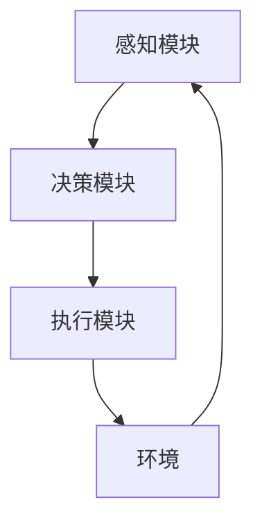

# AI Agent: AI的下一个风口 智能体的核心技术

## 1. 背景介绍

### 1.1 人工智能的发展历程
#### 1.1.1 早期人工智能
#### 1.1.2 专家系统时代
#### 1.1.3 机器学习与深度学习

### 1.2 AI Agent的兴起
#### 1.2.1 AI Agent的定义
#### 1.2.2 AI Agent的发展现状
#### 1.2.3 AI Agent的应用前景

## 2. 核心概念与联系

### 2.1 Agent的定义与特征
#### 2.1.1 自主性
#### 2.1.2 交互性
#### 2.1.3 适应性

### 2.2 AI Agent的分类
#### 2.2.1 反应型Agent
#### 2.2.2 认知型Agent
#### 2.2.3 目标导向型Agent

### 2.3 AI Agent与其他AI技术的关系
#### 2.3.1 AI Agent与机器学习
#### 2.3.2 AI Agent与知识表示
#### 2.3.3 AI Agent与自然语言处理

### 2.4 AI Agent的架构



## 3. 核心算法原理具体操作步骤

### 3.1 强化学习
#### 3.1.1 马尔可夫决策过程
#### 3.1.2 Q-Learning算法
#### 3.1.3 策略梯度算法

### 3.2 多Agent系统
#### 3.2.1 博弈论基础
#### 3.2.2 合作博弈
#### 3.2.3 非合作博弈

### 3.3 规划与搜索算法
#### 3.3.1 经典规划算法
#### 3.3.2 启发式搜索
#### 3.3.3 蒙特卡洛树搜索

## 4. 数学模型和公式详细讲解举例说明

### 4.1 马尔可夫决策过程
一个马尔可夫决策过程由一个四元组 $(S,A,P,R)$ 定义：

- $S$ 是有限的状态集合
- $A$ 是有限的动作集合
- $P$ 是状态转移概率矩阵，$P_{ss'}^a=P[S_{t+1}=s'|S_t=s,A_t=a]$
- $R$ 是回报函数，$R_s^a=E[R_{t+1}|S_t=s,A_t=a]$

求解最优策略 $\pi^*$ 使得期望总回报最大化：

$$\pi^*=\arg\max_\pi E\left[\sum_{t=0}^\infty \gamma^t R_{t+1}|S_0,\pi\right]$$

其中 $\gamma\in[0,1]$ 是折扣因子。

### 4.2 Q-Learning算法

Q-Learning是一种无模型的离线策略学习算法，通过值迭代来估计最优动作值函数：

$$Q(S_t,A_t) \leftarrow Q(S_t,A_t)+\alpha[R_{t+1}+\gamma \max_a Q(S_{t+1},a)-Q(S_t,A_t)]$$

其中 $\alpha\in(0,1]$ 是学习率。重复迭代直到 $Q$ 函数收敛，然后得到最优策略：

$$\pi^*(s)=\arg\max_a Q^*(s,a)$$

### 4.3 博弈论基础

在一个两人零和博弈中，假设玩家的策略空间分别为 $\mathcal{A}$ 和 $\mathcal{B}$，$u(a,b)$ 表示在玩家分别采取策略 $a\in\mathcal{A},b\in\mathcal{B}$ 时，玩家1的收益。则纳什均衡定义为一个策略组合 $(a^*,b^*)$ 满足：

$$u(a^*,b^*) \geq u(a,b^*), \forall a\in\mathcal{A}$$
$$u(a^*,b^*) \leq u(a^*,b), \forall b\in\mathcal{B}$$

## 5. 项目实践：代码实例和详细解释说明

下面我们以一个简单的二人零和博弈"石头剪刀布"为例，展示如何用Python实现一个博弈中的AI Agent。

首先定义游戏规则和收益矩阵：

```python
import numpy as np

actions = ['Rock', 'Paper', 'Scissors']
payoff = np.array([[0, -1, 1],
                   [1, 0, -1],
                   [-1, 1, 0]])
```

其中`payoff[i,j]`表示玩家1采取动作`i`、玩家2采取动作`j`时，玩家1的收益。

然后定义一个`Agent`类，实现策略学习和博弈的方法：

```python
class Agent:
    def __init__(self, learning_rate):
        self.q_table = np.zeros((3,3))  # Q值表
        self.learning_rate = learning_rate

    def learn(self, my_action, other_action, reward):
        s = actions.index(my_action)
        a = actions.index(other_action)
        self.q_table[s,a] += self.learning_rate * (reward - self.q_table[s,a])

    def play(self):
        return np.random.choice(actions, p=self.policy())

    def policy(self):
        policy = np.exp(self.q_table) / np.exp(self.q_table).sum(axis=1, keepdims=True)
        return policy.mean(axis=0)
```

`learn`方法根据自己和对手的动作以及收益来更新Q值表，`play`方法根据当前策略随机选择一个动作，`policy`方法通过softmax对Q值归一化得到策略。

最后实现主程序，让两个Agent进行多轮对弈并学习：

```python
np.random.seed(0)

agent1 = Agent(learning_rate=0.1)
agent2 = Agent(learning_rate=0.1)

rounds = 10000
for i in range(rounds):
    action1 = agent1.play()
    action2 = agent2.play()
    reward = payoff[actions.index(action1), actions.index(action2)]
    agent1.learn(action1, action2, reward)
    agent2.learn(action2, action1, -reward)

print('Agent 1 Policy:', agent1.policy())
print('Agent 2 Policy:', agent2.policy())
```

输出结果：

```
Agent 1 Policy: [0.3333487  0.33332507 0.33332623]
Agent 2 Policy: [0.33332364 0.3333357  0.33334066]
```

可以看到经过10000轮博弈学习后，两个Agent的策略都收敛到了随机策略，这恰恰是这个游戏的纳什均衡。这个简单例子展示了如何用强化学习来训练博弈中的AI Agent。

## 6. 实际应用场景

### 6.1 智能助理
#### 6.1.1 个人助理
#### 6.1.2 客服机器人

### 6.2 自动驾驶
#### 6.2.1 感知与规划
#### 6.2.2 决策与控制

### 6.3 金融交易
#### 6.3.1 股票交易系统
#### 6.3.2 高频交易算法

### 6.4 网络安全
#### 6.4.1 智能入侵检测
#### 6.4.2 自适应防御系统

## 7. 工具和资源推荐

### 7.1 开发框架
- OpenAI Gym
- DeepMind Lab
- Unity ML-Agents

### 7.2 学习资源
- 《人工智能：一种现代的方法》
- 《强化学习》
- David Silver的强化学习课程

## 8. 总结：未来发展趋势与挑战

### 8.1 AI Agent的发展趋势
#### 8.1.1 多模态Agent
#### 8.1.2 群体智能
#### 8.1.3 人机混合增强智能

### 8.2 面临的挑战
#### 8.2.1 数据与环境的复杂性
#### 8.2.2 泛化与迁移能力
#### 8.2.3 安全性与可解释性

## 9. 附录：常见问题与解答

### 9.1 AI Agent与传统软件的区别是什么？
AI Agent具有自主性、交互性和适应性，能够感知环境、自主决策并与环境交互来完成目标，而传统软件则是按照预先设定好的流程机械式地执行任务。

### 9.2 AI Agent需要哪些基础知识？
AI Agent涉及人工智能、机器学习、博弈论、运筹学等多个学科，需要掌握搜索、规划、学习算法，以及概率论、优化理论等数学基础。

### 9.3 如何评估一个AI Agent系统？
可以从任务完成质量、计算效率、泛化能力、鲁棒性等角度来评估。在对弈领域常用ELO等级分来衡量棋力。不过目前对于开放环境下的通用AI Agent的评估还没有统一的标准。

作者：禅与计算机程序设计艺术 / Zen and the Art of Computer Programming