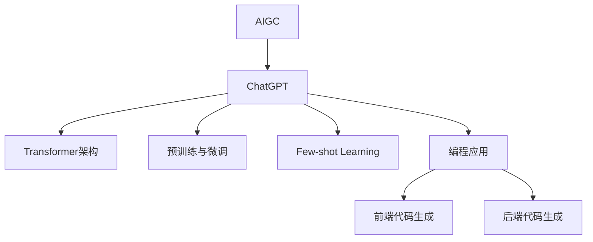

# AIGC从入门到实战：利用 ChatGPT 来生成前后端代码

## 1. 背景介绍
### 1.1 AIGC的兴起
#### 1.1.1 人工智能技术的快速发展
#### 1.1.2 AIGC在各行各业的应用
#### 1.1.3 AIGC对软件开发的影响

### 1.2 ChatGPT的出现
#### 1.2.1 ChatGPT的起源与发展
#### 1.2.2 ChatGPT的强大能力
#### 1.2.3 ChatGPT在编程领域的应用前景

## 2. 核心概念与联系
### 2.1 AIGC的定义与分类
#### 2.1.1 AIGC的定义
#### 2.1.2 AIGC的分类
#### 2.1.3 AIGC与传统编程的区别

### 2.2 ChatGPT的工作原理
#### 2.2.1 Transformer架构
#### 2.2.2 预训练与微调
#### 2.2.3 Few-shot Learning

### 2.3 ChatGPT与编程的关系
#### 2.3.1 ChatGPT在编程中的应用
#### 2.3.2 ChatGPT生成代码的优势
#### 2.3.3 ChatGPT生成代码的局限性



## 3. 核心算法原理具体操作步骤
### 3.1 Transformer架构详解
#### 3.1.1 Self-Attention机制
#### 3.1.2 Multi-Head Attention
#### 3.1.3 位置编码

### 3.2 预训练与微调过程
#### 3.2.1 无监督预训练
#### 3.2.2 有监督微调
#### 3.2.3 迁移学习

### 3.3 Few-shot Learning原理
#### 3.3.1 In-context Learning
#### 3.3.2 Prompt Engineering
#### 3.3.3 Few-shot Learning的优势

## 4. 数学模型和公式详细讲解举例说明
### 4.1 Self-Attention的数学表示
#### 4.1.1 查询、键值的计算
#### 4.1.2 注意力权重的计算
#### 4.1.3 Self-Attention的矩阵运算

$$
Attention(Q,K,V) = softmax(\frac{QK^T}{\sqrt{d_k}})V
$$

其中，$Q$表示查询，$K$表示键，$V$表示值，$d_k$为键值向量的维度。

### 4.2 Multi-Head Attention的数学表示
#### 4.2.1 多头注意力的并行计算
#### 4.2.2 多头注意力的拼接与线性变换
#### 4.2.3 Multi-Head Attention的优势

$$
MultiHead(Q,K,V) = Concat(head_1, ..., head_h)W^O \
head_i = Attention(QW_i^Q, KW_i^K, VW_i^V)
$$

其中，$W_i^Q$、$W_i^K$、$W_i^V$分别表示第$i$个头的查询、键、值的线性变换矩阵，$W^O$为多头注意力的线性变换矩阵。

### 4.3 位置编码的数学表示
#### 4.3.1 正弦位置编码
#### 4.3.2 学习位置编码
#### 4.3.3 相对位置编码

$$
PE_{(pos,2i)} = sin(pos/10000^{2i/d_{model}}) \
PE_{(pos,2i+1)} = cos(pos/10000^{2i/d_{model}})
$$

其中，$pos$表示位置，$i$为维度索引，$d_{model}$为模型的维度。

## 5. 项目实践：代码实例和详细解释说明
### 5.1 利用ChatGPT生成前端代码
#### 5.1.1 生成HTML代码
#### 5.1.2 生成CSS代码
#### 5.1.3 生成JavaScript代码

```html
<!-- 使用ChatGPT生成的HTML代码示例 -->
<div class="container">
  <h1>Welcome to My Website</h1>
  <p>This is a sample webpage generated by ChatGPT.</p>
  <button id="myButton">Click Me</button>
</div>
```

```css
/* 使用ChatGPT生成的CSS代码示例 */
.container {
  max-width: 800px;
  margin: 0 auto;
  padding: 20px;
  text-align: center;
}

h1 {
  font-size: 36px;
  color: #333;
}

p {
  font-size: 18px;
  color: #666;
}

button {
  padding: 10px 20px;
  font-size: 16px;
  background-color: #007bff;
  color: #fff;
  border: none;
  cursor: pointer;
}
```

```javascript
// 使用ChatGPT生成的JavaScript代码示例
document.getElementById("myButton").addEventListener("click", function() {
  alert("Button clicked!");
});
```

### 5.2 利用ChatGPT生成后端代码
#### 5.2.1 生成Python代码
#### 5.2.2 生成Java代码
#### 5.2.3 生成Node.js代码

```python
# 使用ChatGPT生成的Python代码示例
def fibonacci(n):
    if n <= 0:
        return []
    elif n == 1:
        return [0]
    elif n == 2:
        return [0, 1]
    else:
        fib = [0, 1]
        for i in range(2, n):
            fib.append(fib[i-1] + fib[i-2])
        return fib

print(fibonacci(10))
```

```java
// 使用ChatGPT生成的Java代码示例
public class BubbleSort {
    public static void bubbleSort(int[] arr) {
        int n = arr.length;
        for (int i = 0; i < n-1; i++) {
            for (int j = 0; j < n-i-1; j++) {
                if (arr[j] > arr[j+1]) {
                    int temp = arr[j];
                    arr[j] = arr[j+1];
                    arr[j+1] = temp;
                }
            }
        }
    }

    public static void main(String[] args) {
        int[] arr = {64, 34, 25, 12, 22, 11, 90};
        bubbleSort(arr);
        System.out.println(Arrays.toString(arr));
    }
}
```

```javascript
// 使用ChatGPT生成的Node.js代码示例
const express = require('express');
const app = express();

app.get('/', (req, res) => {
  res.send('Hello, World!');
});

app.listen(3000, () => {
  console.log('Server is running on port 3000');
});
```

## 6. 实际应用场景
### 6.1 Web开发
#### 6.1.1 快速生成网页原型
#### 6.1.2 自动化生成前端组件
#### 6.1.3 辅助后端API开发

### 6.2 移动应用开发
#### 6.2.1 生成跨平台应用代码
#### 6.2.2 自动化生成UI布局
#### 6.2.3 辅助实现应用功能

### 6.3 数据分析与可视化
#### 6.3.1 自动生成数据处理代码
#### 6.3.2 辅助生成数据可视化图表
#### 6.3.3 优化数据分析流程

## 7. 工具和资源推荐
### 7.1 ChatGPT接口与API
#### 7.1.1 OpenAI API
#### 7.1.2 第三方ChatGPT API
#### 7.1.3 本地部署ChatGPT

### 7.2 代码编辑器与IDE插件
#### 7.2.1 Visual Studio Code插件
#### 7.2.2 IntelliJ IDEA插件
#### 7.2.3 Sublime Text插件

### 7.3 其他AIGC工具与资源
#### 7.3.1 GitHub Copilot
#### 7.3.2 Codex
#### 7.3.3 AIGC社区与论坛

## 8. 总结：未来发展趋势与挑战
### 8.1 AIGC在编程领域的发展趋势
#### 8.1.1 智能化代码生成
#### 8.1.2 个性化代码推荐
#### 8.1.3 自动化代码优化

### 8.2 AIGC面临的挑战
#### 8.2.1 代码质量与安全性
#### 8.2.2 知识产权与版权问题
#### 8.2.3 人机协作与伦理考量

### 8.3 展望AIGC的未来
#### 8.3.1 AIGC与传统编程的融合
#### 8.3.2 AIGC在软件开发中的角色定位
#### 8.3.3 AIGC技术的不断进步与突破

## 9. 附录：常见问题与解答
### 9.1 ChatGPT生成的代码是否可靠？
### 9.2 如何提高ChatGPT生成代码的质量？
### 9.3 使用ChatGPT生成代码是否侵犯版权？
### 9.4 ChatGPT能否完全替代人工编程？
### 9.5 如何平衡ChatGPT生成代码的效率与创新？

作者：禅与计算机程序设计艺术 / Zen and the Art of Computer Programming