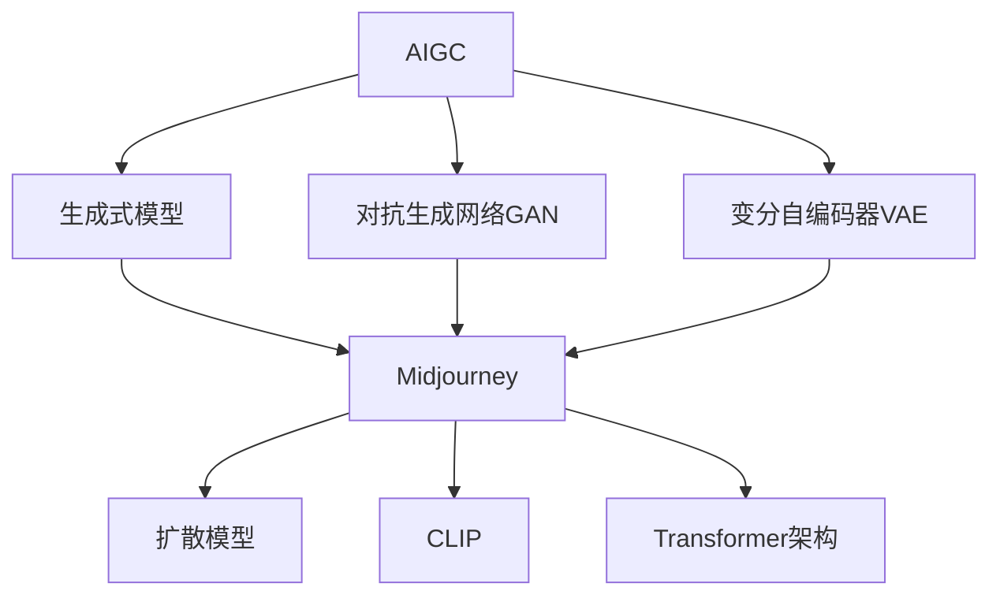

# AIGC从入门到实战：变化：活用 Midjourney，你也能成为神笔马良

## 1. 背景介绍
### 1.1 AIGC的兴起
#### 1.1.1 人工智能技术的发展
#### 1.1.2 生成式AI的出现
#### 1.1.3 AIGC的概念和应用

### 1.2 Midjourney的诞生
#### 1.2.1 Midjourney的起源和发展历程
#### 1.2.2 Midjourney的特点和优势
#### 1.2.3 Midjourney在AIGC领域的地位

## 2. 核心概念与联系
### 2.1 AIGC的核心概念
#### 2.1.1 生成式模型
#### 2.1.2 对抗生成网络（GAN）
#### 2.1.3 变分自编码器（VAE）

### 2.2 Midjourney的核心技术
#### 2.2.1 扩散模型（Diffusion Model）
#### 2.2.2 CLIP（Contrastive Language-Image Pre-training）
#### 2.2.3 Transformer架构

### 2.3 AIGC与Midjourney的关系
#### 2.3.1 Midjourney在AIGC领域的应用
#### 2.3.2 Midjourney与其他AIGC工具的比较
#### 2.3.3 Midjourney在AIGC生态中的角色



## 3. 核心算法原理具体操作步骤
### 3.1 扩散模型（Diffusion Model）
#### 3.1.1 扩散过程
#### 3.1.2 逆扩散过程
#### 3.1.3 噪声调度策略

### 3.2 CLIP（Contrastive Language-Image Pre-training）
#### 3.2.1 视觉编码器
#### 3.2.2 文本编码器
#### 3.2.3 对比学习目标

### 3.3 Transformer架构
#### 3.3.1 自注意力机制
#### 3.3.2 多头注意力
#### 3.3.3 位置编码

## 4. 数学模型和公式详细讲解举例说明
### 4.1 扩散模型的数学表示
#### 4.1.1 前向扩散过程
$$ q(x_t|x_{t-1}) = \mathcal{N}(x_t; \sqrt{1-\beta_t} x_{t-1}, \beta_t \mathbf{I}) $$
#### 4.1.2 逆扩散过程
$$ p_\theta(x_{t-1}|x_t) = \mathcal{N}(x_{t-1}; \mu_\theta(x_t, t), \Sigma_\theta(x_t, t)) $$
#### 4.1.3 训练目标
$$ \mathcal{L}_{vlb} = \mathbb{E}_{q(x_{0:T})} \left[ -\log \frac{p_\theta(x_{0:T})}{q(x_{1:T}|x_0)} \right] $$

### 4.2 CLIP的数学表示
#### 4.2.1 视觉编码器
$$ v = E_v(x) $$
#### 4.2.2 文本编码器
$$ t = E_t(y) $$
#### 4.2.3 对比学习目标
$$ \mathcal{L}_{clip} = -\frac{1}{N} \sum_{i=1}^N \log \frac{\exp(v_i \cdot t_i / \tau)}{\sum_{j=1}^N \exp(v_i \cdot t_j / \tau)} $$

## 5. 项目实践：代码实例和详细解释说明
### 5.1 安装和配置Midjourney
#### 5.1.1 注册Midjourney账号
#### 5.1.2 加入Midjourney Discord服务器
#### 5.1.3 配置Midjourney Bot

### 5.2 使用Midjourney生成图像
#### 5.2.1 基本的图像生成命令
```
/imagine prompt: A beautiful sunset over the ocean
```
#### 5.2.2 调整图像生成参数
```
/imagine prompt: A beautiful sunset over the ocean --ar 16:9 --q 2 --stylize 1000
```
#### 5.2.3 图像变体和上传图像
```
/imagine prompt: A beautiful sunset over the ocean --seed 1234 --v 4
/imagine prompt: [uploaded image] A beautiful sunset over the ocean
```

### 5.3 高级技巧和最佳实践
#### 5.3.1 提示工程（Prompt Engineering）
#### 5.3.2 多步骤生成和迭代优化
#### 5.3.3 结合其他工具和技术

## 6. 实际应用场景
### 6.1 创意设计
#### 6.1.1 概念艺术和插画
#### 6.1.2 游戏设计和场景生成
#### 6.1.3 产品设计和原型制作

### 6.2 营销和广告
#### 6.2.1 社交媒体图像和视频
#### 6.2.2 广告创意和视觉效果
#### 6.2.3 品牌设计和视觉识别

### 6.3 教育和科普
#### 6.3.1 教学材料和课件制作
#### 6.3.2 科学可视化和数据可视化
#### 6.3.3 虚拟现实和增强现实应用

## 7. 工具和资源推荐
### 7.1 Midjourney相关工具
#### 7.1.1 Midjourney Prompt Generator
#### 7.1.2 Midjourney Gallery
#### 7.1.3 Midjourney Community

### 7.2 其他AIGC工具和平台
#### 7.2.1 DALL-E 2
#### 7.2.2 Stable Diffusion
#### 7.2.3 Runway ML

### 7.3 学习资源和社区
#### 7.3.1 官方文档和教程
#### 7.3.2 在线课程和学习资源
#### 7.3.3 AIGC社区和论坛

## 8. 总结：未来发展趋势与挑战
### 8.1 AIGC的发展趋势
#### 8.1.1 多模态生成和跨领域应用
#### 8.1.2 个性化和交互式生成
#### 8.1.3 AIGC与传统创作的融合

### 8.2 Midjourney的未来发展
#### 8.2.1 技术迭代和性能提升
#### 8.2.2 新功能和应用场景拓展
#### 8.2.3 生态系统建设和合作伙伴

### 8.3 AIGC面临的挑战
#### 8.3.1 版权和知识产权问题
#### 8.3.2 伦理和社会影响
#### 8.3.3 创作者的角色定位和价值重塑

## 9. 附录：常见问题与解答
### 9.1 Midjourney的使用问题
#### 9.1.1 如何优化Midjourney生成的图像质量？
#### 9.1.2 Midjourney生成图像的版权归属？
#### 9.1.3 如何处理Midjourney生成的不适当内容？

### 9.2 AIGC的一般问题
#### 9.2.1 AIGC会取代人类创作者吗？
#### 9.2.2 如何平衡AIGC的创新性和伦理性？
#### 9.2.3 AIGC对创意产业的影响和未来发展？

作者：禅与计算机程序设计艺术 / Zen and the Art of Computer Programming

人工智能生成内容（AIGC）正在掀起一场创作革命，Midjourney作为其中的佼佼者，以其强大的图像生成能力和友好的用户体验，吸引了众多创作者的目光。本文将深入探讨Midjourney的核心技术原理，并通过实践案例和应用场景，为读者提供一份全面的Midjourney入门指南，帮助大家成为AIGC时代的"神笔马良"。

AIGC的崛起得益于人工智能技术的长足进步，特别是生成式模型的出现，使得计算机能够自主创作出高质量的图像、文本、音频等内容。Midjourney正是建立在扩散模型、CLIP等前沿技术之上，通过对大规模数据的学习和优化，实现了令人惊叹的图像生成效果。

本文将首先介绍AIGC和Midjourney的核心概念和技术原理，包括生成式模型、对抗生成网络、变分自编码器等，并通过数学公式和示例代码，深入剖析Midjourney的算法实现。读者将了解到扩散模型如何逐步去噪，CLIP如何实现图文对齐，以及Transformer架构如何捕捉全局信息。

在实践部分，本文将手把手教读者如何安装和配置Midjourney，并通过丰富的案例演示如何使用Midjourney生成各种风格的图像。从简单的文本提示，到参数调优和图像变换，再到提示工程和迭代优化，读者将掌握Midjourney的各项技能，成为一名出色的AIGC创作者。

本文还将展望AIGC和Midjourney的未来发展趋势和挑战，讨论多模态生成、个性化创作、版权伦理等前沿话题，引发读者对AIGC的深度思考。在AIGC时代，创作者如何借助AI工具提升创造力，如何在人机协作中找到自己的定位，将是每一位读者需要面对的课题。

相信通过本文的学习和实践，读者将对AIGC和Midjourney有一个全面的认识，并掌握活用Midjourney进行创作的技能。在AIGC的赋能下，人人都可以成为"神笔马良"，用想象力和创造力描绘出心中的图景。让我们一起拥抱AIGC，开启创作新纪元！