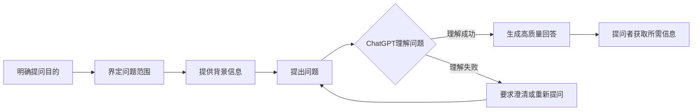

# AIGC从入门到实战：如何向 ChatGPT 提问以获得高质量答案

## 1. 背景介绍
### 1.1 人工智能生成内容(AIGC)概述
#### 1.1.1 AIGC的定义与内涵
#### 1.1.2 AIGC的发展历程
#### 1.1.3 AIGC的应用领域

### 1.2 ChatGPT的崛起
#### 1.2.1 ChatGPT的诞生背景
#### 1.2.2 ChatGPT的技术原理
#### 1.2.3 ChatGPT带来的影响与变革

### 1.3 高质量提问的重要性
#### 1.3.1 提问质量对ChatGPT回答的影响
#### 1.3.2 提问技巧的学习必要性
#### 1.3.3 高质量提问对个人成长的意义

## 2. 核心概念与联系
### 2.1 提问的核心要素
#### 2.1.1 明确提问目的
#### 2.1.2 界定问题范围
#### 2.1.3 提供必要的背景信息

### 2.2 ChatGPT的理解能力
#### 2.2.1 ChatGPT对自然语言的理解
#### 2.2.2 ChatGPT知识库的广度与深度
#### 2.2.3 ChatGPT对语境的把握

### 2.3 提问与回答的关系
#### 2.3.1 提问质量对回答质量的决定性作用
#### 2.3.2 提问与回答之间的互动与反馈
#### 2.3.3 优化提问以获得更佳回答



## 3. 核心算法原理具体操作步骤
### 3.1 明确提问目的的方法
#### 3.1.1 确定提问的主题领域
#### 3.1.2 明晰提问的具体问题
#### 3.1.3 设定期望的回答形式

### 3.2 界定问题范围的技巧
#### 3.2.1 缩小问题的覆盖面
#### 3.2.2 划分问题的子领域
#### 3.2.3 明确问题的约束条件

### 3.3 提供背景信息的要点
#### 3.3.1 交代问题的来龙去脉
#### 3.3.2 说明已知的相关信息
#### 3.3.3 阐明对回答的具体要求

### 3.4 优化问题表述的策略
#### 3.4.1 使用简洁明了的语言
#### 3.4.2 避免歧义和模棱两可
#### 3.4.3 逻辑清晰、条理分明

## 4. 数学模型和公式详细讲解举例说明
### 4.1 提问质量评估模型
假设我们定义提问质量 $Q$ 为:
$$Q = f(C,B,R)$$
其中，$C$ 表示问题的明确程度，$B$ 表示背景信息的充分程度，$R$ 表示问题表述的优化程度。$f$ 为一个综合考虑各因素的函数。

举例而言，如果一个问题的明确程度为 $C=0.8$，背景信息的充分程度为 $B=0.7$，问题表述的优化程度为 $R=0.9$，那么其提问质量可以用下面的公式来计算:
$$Q = 0.8 \times 0.7 \times 0.9 = 0.504$$
可见，提问质量是由多个因素共同决定的，每个因素都有提升的空间。

### 4.2 ChatGPT回答质量预测模型
我们可以建立一个简单的线性模型来预测ChatGPT的回答质量 $A$:
$$A = \alpha \times Q + \beta$$
其中，$Q$ 为提问质量，$\alpha$ 和 $\beta$ 为模型参数，需要通过实验数据进行拟合。

假设通过实验我们得到 $\alpha=0.8$, $\beta=0.1$, 那么对于上述例子中的提问质量 $Q=0.504$，我们可以预测ChatGPT的回答质量为:
$$A = 0.8 \times 0.504 + 0.1 = 0.5032$$
这表明，提问质量的提升可以带来回答质量的线性增长。当然，实际情况可能更加复杂，需要更精细的建模。

### 4.3 提问-回答优化循环模型
我们可以将提问和回答看作一个循环优化的过程:
$$Q_{n+1} = Q_n + \Delta Q_n$$
$$A_{n+1} = A_n + \Delta A_n$$
其中，$Q_n$ 和 $A_n$ 分别表示第 $n$ 轮提问的质量和回答的质量，$\Delta Q_n$ 和 $\Delta A_n$ 表示第 $n$ 轮优化带来的提升。

这个模型启示我们，提问和回答的质量可以通过不断的交互和优化来逐步提升，关键在于每一轮优化要有针对性和有效性。

## 5. 项目实践：代码实例和详细解释说明
下面我们用Python代码来实现一个简单的提问质量评估器：

```python
def evaluate_question_quality(clarity, background, refinement):
    """
    评估提问质量
    :param clarity: 问题明确程度, 0到1之间的浮点数
    :param background: 背景信息充分程度, 0到1之间的浮点数
    :param refinement: 问题表述优化程度, 0到1之间的浮点数
    :return: 提问质量, 0到1之间的浮点数
    """
    quality = clarity * background * refinement
    return quality

# 测试
clarity = 0.8
background = 0.7
refinement = 0.9
quality = evaluate_question_quality(clarity, background, refinement)
print(f"提问质量: {quality}")
```

输出结果:
```
提问质量: 0.504
```

这个简单的评估器可以帮助我们量化提问质量，识别提问中的薄弱环节。在实践中，我们可以针对性地改进提问的各个方面，如增加背景信息、简化问题表述等，从而不断提升提问质量，获得更加满意的回答。

当然，这只是一个玩具示例，实际应用中需要更加全面和精细的质量评估方法。但核心思路是一致的：通过量化分析和优化迭代，不断提升提问质量，从而获得高质量的ChatGPT回答。

## 6. 实际应用场景
### 6.1 学术研究中的应用
#### 6.1.1 快速了解领域背景知识
#### 6.1.2 获取研究灵感与思路
#### 6.1.3 辅助撰写学术论文

### 6.2 企业决策中的应用
#### 6.2.1 行业趋势与竞争分析
#### 6.2.2 市场调研与用户需求挖掘
#### 6.2.3 辅助制定企业发展战略

### 6.3 个人学习与成长中的应用
#### 6.3.1 快速学习新知识领域
#### 6.3.2 解决学习中的疑难问题
#### 6.3.3 拓展知识面与思维方式

## 7. 工具和资源推荐
### 7.1 提问辅助工具
#### 7.1.1 问题模板与生成器
#### 7.1.2 背景信息搜集与整理工具
#### 7.1.3 问题表述优化与润色工具

### 7.2 ChatGPT使用技巧资源
#### 7.2.1 ChatGPT官方文档与博客
#### 7.2.2 ChatGPT使用技巧社区与论坛
#### 7.2.3 ChatGPT使用案例与经验分享

### 7.3 其他AIGC工具与资源
#### 7.3.1 文本生成工具
#### 7.3.2 图像生成工具
#### 7.3.3 音视频生成工具

## 8. 总结：未来发展趋势与挑战
### 8.1 AIGC的发展趋势
#### 8.1.1 模型能力的持续提升
#### 8.1.2 应用场景的不断拓展
#### 8.1.3 人机协作的深入融合

### 8.2 ChatGPT的未来展望
#### 8.2.1 知识获取与更新能力的提升
#### 8.2.2 推理与决策能力的增强
#### 8.2.3 个性化与定制化服务的实现

### 8.3 高质量提问所面临的挑战
#### 8.3.1 领域知识与经验的积累
#### 8.3.2 批判性思维与提问意识的培养
#### 8.3.3 提问技巧与方法的持续迭代

## 9. 附录：常见问题与解答
### 9.1 ChatGPT无法理解我的问题，怎么办？
分析问题表述中的歧义、专业术语，尝试用更通俗的语言重新描述问题。必要时提供更多背景信息帮助ChatGPT理解问题。

### 9.2 ChatGPT给出的回答不够具体，如何改进？
尝试缩小问题的范围，将大问题拆解为若干个小问题。明确告知ChatGPT你期望的回答形式，如举例说明、步骤列表等。

### 9.3 ChatGPT产生了事实性错误，如何避免？
要意识到ChatGPT并非全知全能，对于关键信息，尤其是数据和事实，要主动求证与核实。如有必要，可以要求ChatGPT列出回答的信息来源。

### 9.4 面对开放性问题，如何引导ChatGPT给出有见地的回答？
提供你对问题的初步思考，抛出一些可能的讨论角度，让ChatGPT在此基础上展开分析。必要时，可以就某些观点提出质疑，激发更多思考火花。

### 9.5 如何提升ChatGPT对问题背景的理解？
除了提供必要的背景信息外，还可以主动向ChatGPT提问，确认它是否准确理解了背景。必要时，可以请ChatGPT复述对背景的理解，然后再行修正。

高质量提问是一个需要持续学习和练习的过程。提问者需要在实践中不断总结经验，调整策略，才能充分发挥ChatGPT的智能，获得理想的回答。相信通过不懈的努力，每个人都可以成为优秀的提问者，与ChatGPT展开高效愉悦的智慧交流。

作者：禅与计算机程序设计艺术 / Zen and the Art of Computer Programming