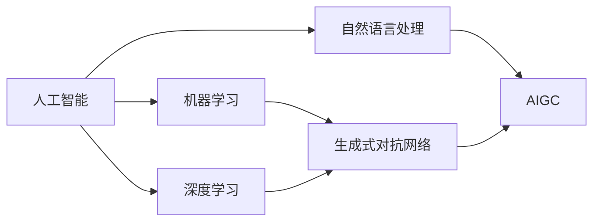

# AIGC从入门到实战：带上 AI 化身，开启全球"大冒险"，燃爆朋友圈

## 1. 背景介绍
### 1.1 AIGC的兴起
#### 1.1.1 人工智能技术的快速发展
#### 1.1.2 AIGC的概念与定义
#### 1.1.3 AIGC的潜力与前景

### 1.2 AIGC在社交媒体中的应用
#### 1.2.1 个性化内容生成
#### 1.2.2 智能助手与聊天机器人
#### 1.2.3 虚拟形象与数字人

## 2. 核心概念与联系
### 2.1 人工智能(AI)
#### 2.1.1 机器学习
#### 2.1.2 深度学习
#### 2.1.3 自然语言处理(NLP)

### 2.2 生成式对抗网络(GAN)
#### 2.2.1 GAN的基本原理
#### 2.2.2 GAN在图像生成中的应用
#### 2.2.3 GAN在文本生成中的应用

### 2.3 AIGC与传统内容生成方式的区别
#### 2.3.1 效率与规模化生产
#### 2.3.2 个性化与定制化
#### 2.3.3 创意与多样性



## 3. 核心算法原理具体操作步骤
### 3.1 文本生成算法
#### 3.1.1 基于RNN的文本生成
#### 3.1.2 基于Transformer的文本生成
#### 3.1.3 GPT系列模型

### 3.2 图像生成算法
#### 3.2.1 DCGAN
#### 3.2.2 StyleGAN
#### 3.2.3 DALL-E

### 3.3 音频生成算法
#### 3.3.1 WaveNet
#### 3.3.2 SampleRNN
#### 3.3.3 Jukebox

## 4. 数学模型和公式详细讲解举例说明
### 4.1 GAN的数学模型
#### 4.1.1 生成器与判别器
#### 4.1.2 损失函数与优化目标
#### 4.1.3 纳什均衡与收敛性

生成器的目标是最小化下面的损失函数：

$$\min_{G} \max_{D} V(D,G) = \mathbb{E}_{x \sim p_{data}(x)}[\log D(x)] + \mathbb{E}_{z \sim p_z(z)}[\log (1 - D(G(z)))]$$

其中，$D(x)$表示判别器将真实样本$x$判断为真实样本的概率，$D(G(z))$表示判别器将生成样本$G(z)$判断为真实样本的概率。

### 4.2 Transformer的数学模型
#### 4.2.1 自注意力机制
#### 4.2.2 多头注意力
#### 4.2.3 位置编码

自注意力机制可以表示为：

$$Attention(Q,K,V) = softmax(\frac{QK^T}{\sqrt{d_k}})V$$

其中，$Q$，$K$，$V$分别表示查询向量、键向量和值向量，$d_k$为向量维度。

## 5. 项目实践：代码实例和详细解释说明
### 5.1 使用GPT-2生成文本
#### 5.1.1 数据准备与预处理
#### 5.1.2 模型训练与微调
#### 5.1.3 文本生成与后处理

以下是使用GPT-2生成文本的简要代码示例：

```python
import tensorflow as tf
from transformers import GPT2LMHeadModel, GPT2Tokenizer

# 加载预训练模型与分词器
model = GPT2LMHeadModel.from_pretrained('gpt2')
tokenizer = GPT2Tokenizer.from_pretrained('gpt2')

# 生成文本
input_text = "Once upon a time"
input_ids = tokenizer.encode(input_text, return_tensors='tf')
output = model.generate(input_ids, max_length=100, num_return_sequences=1)
generated_text = tokenizer.decode(output[0], skip_special_tokens=True)

print(generated_text)
```

### 5.2 使用StyleGAN生成人脸图像
#### 5.2.1 数据集准备与预处理
#### 5.2.2 模型训练与优化
#### 5.2.3 图像生成与后处理

### 5.3 使用Jukebox生成音乐
#### 5.3.1 数据集准备与预处理
#### 5.3.2 模型训练与优化
#### 5.3.3 音乐生成与后处理

## 6. 实际应用场景
### 6.1 社交媒体营销
#### 6.1.1 个性化推荐与广告投放
#### 6.1.2 用户画像与行为分析
#### 6.1.3 虚拟网红与KOL营销

### 6.2 虚拟助手与客服
#### 6.2.1 智能客服与问答系统
#### 6.2.2 情感分析与用户情绪识别
#### 6.2.3 个性化服务与用户体验优化

### 6.3 娱乐与游戏
#### 6.3.1 游戏角色与场景生成
#### 6.3.2 互动式故事与剧情生成
#### 6.3.3 虚拟主播与直播互动

## 7. 工具和资源推荐
### 7.1 开源框架与库
#### 7.1.1 TensorFlow与Keras
#### 7.1.2 PyTorch
#### 7.1.3 Hugging Face Transformers

### 7.2 预训练模型与数据集
#### 7.2.1 GPT系列模型
#### 7.2.2 BERT与RoBERTa
#### 7.2.3 ImageNet与CIFAR

### 7.3 学习资源与社区
#### 7.3.1 在线课程与教程
#### 7.3.2 学术论文与研究报告
#### 7.3.3 开发者社区与论坛

## 8. 总结：未来发展趋势与挑战
### 8.1 AIGC的发展趋势
#### 8.1.1 多模态融合与跨领域应用
#### 8.1.2 实时交互与动态生成
#### 8.1.3 个性化与定制化程度不断提升

### 8.2 AIGC面临的挑战
#### 8.2.1 伦理与隐私问题
#### 8.2.2 版权与知识产权保护
#### 8.2.3 算法偏见与公平性

### 8.3 AIGC的未来展望
#### 8.3.1 人机协作与增强创造力
#### 8.3.2 虚拟世界与数字孪生
#### 8.3.3 颠覆性创新与产业变革

## 9. 附录：常见问题与解答
### 9.1 如何选择合适的AIGC模型与框架？
### 9.2 如何处理AIGC生成内容的质量与合规性问题？
### 9.3 如何平衡AIGC的创新性与实用性？
### 9.4 如何应对AIGC可能带来的就业冲击与社会影响？
### 9.5 如何把握AIGC的商业化机会与发展方向？

作者：禅与计算机程序设计艺术 / Zen and the Art of Computer Programming