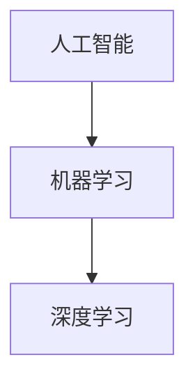

# AI人工智能深度学习算法：在精准医疗中的应用

## 1. 背景介绍
### 1.1 人工智能与医疗健康行业
#### 1.1.1 人工智能在医疗健康领域的发展历程
#### 1.1.2 人工智能技术给医疗健康行业带来的机遇与挑战
### 1.2 精准医疗概述  
#### 1.2.1 精准医疗的定义与内涵
#### 1.2.2 精准医疗的发展现状
#### 1.2.3 人工智能深度学习在精准医疗中的应用前景

## 2. 核心概念与联系
### 2.1 人工智能
#### 2.1.1 人工智能的定义与分类
#### 2.1.2 人工智能的发展历程
### 2.2 机器学习
#### 2.2.1 机器学习的概念与原理 
#### 2.2.2 机器学习的分类
#### 2.2.3 机器学习常用算法
### 2.3 深度学习
#### 2.3.1 深度学习的概念与原理
#### 2.3.2 深度学习的网络结构
#### 2.3.3 深度学习的优势
### 2.4 人工智能、机器学习和深度学习三者间的关系



## 3. 核心算法原理具体操作步骤
### 3.1 卷积神经网络CNN
#### 3.1.1 卷积神经网络的基本结构
#### 3.1.2 卷积层与池化层
#### 3.1.3 卷积神经网络的训练过程
### 3.2 循环神经网络RNN
#### 3.2.1 循环神经网络的基本结构  
#### 3.2.2 长短期记忆网络LSTM
#### 3.2.3 门控循环单元GRU
### 3.3 生成对抗网络GAN
#### 3.3.1 生成对抗网络的基本原理
#### 3.3.2 生成器与判别器
#### 3.3.3 生成对抗网络的训练过程

## 4. 数学模型和公式详细讲解举例说明
### 4.1 反向传播算法
反向传播算法是训练深度神经网络的核心，其目标是最小化损失函数$J(\theta)$。假设神经网络有$L$层，第$l$层的权重和偏置分别为$W^{[l]}$和$b^{[l]}$。反向传播算法的核心公式为：

$$
\begin{aligned}
dZ^{[L]} &= A^{[L]} - Y \
dW^{[l]} &= \frac{1}{m} dZ^{[l+1]} (A^{[l]})^T \  
db^{[l]} &= \frac{1}{m} \sum_{i=1}^{m} dZ^{[l+1]} \
dZ^{[l]} &= W^{[l+1]T} dZ^{[l+1]} * g^{[l]'}(Z^{[l]}) \
\end{aligned}
$$

其中，$dZ^{[l]}$表示第$l$层的误差，$A^{[L]}$为输出层的激活值，$Y$为真实标签，$m$为样本数量，$g^{[l]}$为第$l$层的激活函数。

### 4.2 损失函数
深度学习中常用的损失函数包括均方误差损失(MSE)和交叉熵损失(Cross-entropy)。

均方误差损失：
$$
J(\theta) = \frac{1}{2m} \sum_{i=1}^{m} (h_{\theta}(x^{(i)}) - y^{(i)})^2
$$

交叉熵损失：
$$
J(\theta) = -\frac{1}{m} \sum_{i=1}^{m} [y^{(i)}\log h_{\theta}(x^{(i)}) + (1-y^{(i)})\log (1-h_{\theta}(x^{(i)}))]
$$

其中，$h_{\theta}(x^{(i)})$表示模型对第$i$个样本的预测输出，$y^{(i)}$为真实标签。

## 5. 项目实践：代码实例和详细解释说明
下面是一个使用Keras实现卷积神经网络进行医学图像分类的示例代码：

```python
from keras.models import Sequential
from keras.layers import Conv2D, MaxPooling2D, Flatten, Dense

# 构建CNN模型
model = Sequential()
model.add(Conv2D(32, (3, 3), activation='relu', input_shape=(64, 64, 3)))
model.add(MaxPooling2D((2, 2)))
model.add(Conv2D(64, (3, 3), activation='relu'))
model.add(MaxPooling2D((2, 2)))
model.add(Conv2D(64, (3, 3), activation='relu'))
model.add(Flatten())
model.add(Dense(64, activation='relu'))
model.add(Dense(10, activation='softmax'))

# 编译模型
model.compile(optimizer='adam',
              loss='categorical_crossentropy',
              metrics=['accuracy'])

# 训练模型
model.fit(train_images, train_labels, epochs=10, batch_size=64)

# 评估模型
test_loss, test_acc = model.evaluate(test_images, test_labels)
print('Test accuracy:', test_acc)
```

这个示例代码构建了一个包含三个卷积层和两个全连接层的卷积神经网络。首先使用`Sequential`定义模型，然后通过`add`方法添加卷积层(`Conv2D`)、池化层(`MaxPooling2D`)和全连接层(`Dense`)。`compile`方法指定优化器、损失函数和评估指标。最后，使用`fit`方法在训练数据上训练模型，并用`evaluate`方法在测试集上评估模型性能。

## 6. 实际应用场景
### 6.1 医学影像分析
#### 6.1.1 医学图像分类
#### 6.1.2 病变区域检测与分割
#### 6.1.3 影像组学特征提取
### 6.2 疾病诊断与预测
#### 6.2.1 疾病风险预测
#### 6.2.2 疾病早期筛查
#### 6.2.3 疾病分型与亚型识别
### 6.3 药物研发与个性化治疗
#### 6.3.1 药物虚拟筛选
#### 6.3.2 药物反应预测
#### 6.3.3 个性化治疗方案优化

## 7. 工具和资源推荐
### 7.1 深度学习框架
- TensorFlow
- PyTorch
- Keras
### 7.2 医学影像数据集
- ChestX-ray14
- BraTS
- ISIC 2018
### 7.3 开源项目与代码库
- NiftyNet
- DeepMedic
- MedicalTorch

## 8. 总结：未来发展趋势与挑战
### 8.1 人工智能深度学习在精准医疗中的发展趋势
#### 8.1.1 多模态数据融合分析
#### 8.1.2 可解释性与可信性
#### 8.1.3 联邦学习与隐私保护
### 8.2 面临的挑战
#### 8.2.1 医学大数据的标注与质控
#### 8.2.2 模型的泛化能力与鲁棒性
#### 8.2.3 伦理与法律问题

## 9. 附录：常见问题与解答
### 9.1 深度学习模型如何处理医学数据的不平衡问题？
### 9.2 如何评估深度学习模型在医学应用中的性能？
### 9.3 深度学习模型在临床决策支持中如何与医生配合？

人工智能深度学习算法在精准医疗领域有着广阔的应用前景。深度学习凭借其强大的特征学习能力，可以从海量的医学数据中自动提取有效的特征表示，并建立高精度的预测模型。在医学影像分析、疾病诊断预测、药物研发等方面，深度学习均取得了显著的进展，有望推动精准医疗的发展，造福人类健康。

然而，将深度学习技术应用于医学领域仍面临诸多挑战。医学数据的获取与标注成本高昂，数据的质量参差不齐；模型的可解释性与可信性有待加强；如何在保护患者隐私的前提下开展数据驱动的研究也是一个难题。未来，多模态数据的融合分析、联邦学习、迁移学习等技术有望缓解数据不足的问题；将先验医学知识引入深度学习模型，有助于提升模型的可解释性；同时，加强伦理道德与法律法规的研究和约束，确保人工智能造福人类健康事业。

人工智能深度学习在精准医疗中虽然大有可为，但仍处于起步阶段。未来仍需产学研医各界通力合作，攻克技术、伦理等各种挑战，推动人工智能深度学习在医疗健康领域的创新发展，让智能医疗造福人类。

作者：禅与计算机程序设计艺术 / Zen and the Art of Computer Programming