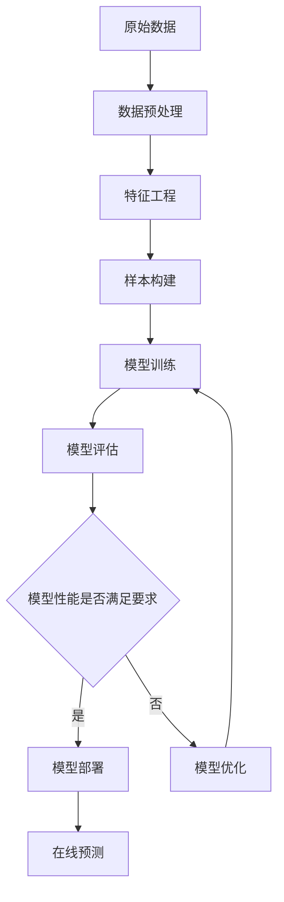

# AI人工智能深度学习算法：在诈骗侦测中的应用

## 1. 背景介绍
### 1.1 诈骗犯罪现状
#### 1.1.1 诈骗犯罪案件数量激增
#### 1.1.2 诈骗犯罪手段日益高明
#### 1.1.3 诈骗犯罪给社会和个人带来巨大损失
### 1.2 传统诈骗侦测方法的局限性
#### 1.2.1 规则引擎方法的局限
#### 1.2.2 传统机器学习方法的不足
#### 1.2.3 对海量异构数据的处理能力有限
### 1.3 人工智能深度学习在诈骗侦测中的应用前景
#### 1.3.1 强大的特征学习和表示能力
#### 1.3.2 处理海量异构数据的能力
#### 1.3.3 模型的自适应和持续学习能力

## 2. 核心概念与联系
### 2.1 人工智能与机器学习
#### 2.1.1 人工智能的定义和发展历程
#### 2.1.2 机器学习的概念和分类
#### 2.1.3 人工智能与机器学习的关系
### 2.2 深度学习
#### 2.2.1 深度学习的概念和特点
#### 2.2.2 深度学习与传统机器学习的区别
#### 2.2.3 深度学习的典型网络架构
### 2.3 诈骗侦测
#### 2.3.1 诈骗侦测的定义和目标
#### 2.3.2 诈骗侦测的数据类型和来源
#### 2.3.3 诈骗侦测的评估指标

## 3. 核心算法原理具体操作步骤
### 3.1 基于深度学习的诈骗侦测算法框架
#### 3.1.1 算法框架概述
#### 3.1.2 离线训练阶段
#### 3.1.3 在线预测阶段
### 3.2 数据预处理
#### 3.2.1 数据清洗
#### 3.2.2 特征工程
#### 3.2.3 数据增强
### 3.3 深度学习模型设计
#### 3.3.1 输入层设计
#### 3.3.2 隐藏层设计
#### 3.3.3 输出层设计
### 3.4 模型训练
#### 3.4.1 损失函数选择
#### 3.4.2 优化算法选择
#### 3.4.3 超参数调优
### 3.5 模型评估与优化
#### 3.5.1 离线评估
#### 3.5.2 在线A/B测试
#### 3.5.3 持续优化

## 4. 数学模型和公式详细讲解举例说明
### 4.1 深度神经网络
#### 4.1.1 前向传播
$$ z^{[l]} = W^{[l]}a^{[l-1]} + b^{[l]} $$
$$ a^{[l]} = g^{[l]}(z^{[l]}) $$
#### 4.1.2 反向传播
$$ dz^{[l]} = da^{[l]} * g'^{[l]}(z^{[l]}) $$
$$ dW^{[l]} = \frac{1}{m} dz^{[l]}a^{[l-1]T} $$
$$ db^{[l]} = \frac{1}{m} \sum_{i=1}^{m} dz^{[l](i)} $$
$$ da^{[l-1]} = W^{[l]T}dz^{[l]} $$
### 4.2 卷积神经网络
#### 4.2.1 卷积层
$$ a^{[l]} = g(W^{[l]} * a^{[l-1]} + b^{[l]}) $$
#### 4.2.2 池化层
$$ a^{[l]} = pool(a^{[l-1]}) $$
### 4.3 循环神经网络
#### 4.3.1 基本RNN
$$ a^{<t>} = g(W_{aa}a^{<t-1>} + W_{ax}x^{<t>} + b_a) $$
#### 4.3.2 LSTM
$$ \Gamma_u = \sigma(W_u[a^{<t-1>}, x^{<t>}] + b_u) $$
$$ \Gamma_f = \sigma(W_f[a^{<t-1>}, x^{<t>}] + b_f) $$
$$ \Gamma_o = \sigma(W_o[a^{<t-1>}, x^{<t>}] + b_o) $$
$$ \tilde{c}^{<t>} = \tanh(W_c[a^{<t-1>}, x^{<t>}] + b_c) $$
$$ c^{<t>} = \Gamma_u * \tilde{c}^{<t>} + \Gamma_f * c^{<t-1>} $$
$$ a^{<t>} = \Gamma_o * \tanh(c^{<t>}) $$

## 5. 项目实践：代码实例和详细解释说明
### 5.1 开发环境搭建
#### 5.1.1 硬件环境
#### 5.1.2 软件环境
#### 5.1.3 深度学习框架选择
### 5.2 数据集准备
#### 5.2.1 数据集选择
#### 5.2.2 数据探索与分析
#### 5.2.3 数据预处理
### 5.3 模型构建与训练
#### 5.3.1 模型构建
```python
class FraudDetector(nn.Module):
    def __init__(self):
        super(FraudDetector, self).__init__()
        self.embedding = nn.Embedding(num_embeddings, embedding_dim)
        self.lstm = nn.LSTM(embedding_dim, hidden_size, num_layers, batch_first=True)
        self.fc = nn.Linear(hidden_size, num_classes)

    def forward(self, x):
        x = self.embedding(x)
        _, (h_n, _) = self.lstm(x)
        output = self.fc(h_n[-1])
        return output
```
#### 5.3.2 模型训练
```python
model = FraudDetector()
criterion = nn.CrossEntropyLoss()
optimizer = optim.Adam(model.parameters(), lr=learning_rate)

for epoch in range(num_epochs):
    for i, (sequences, labels) in enumerate(train_loader):
        optimizer.zero_grad()
        outputs = model(sequences)
        loss = criterion(outputs, labels)
        loss.backward()
        optimizer.step()
```
#### 5.3.3 模型评估
```python
model.eval()
with torch.no_grad():
    correct = 0
    total = 0
    for sequences, labels in test_loader:
        outputs = model(sequences)
        _, predicted = torch.max(outputs.data, 1)
        total += labels.size(0)
        correct += (predicted == labels).sum().item()

    print('Accuracy: %d %%' % (100 * correct / total))
```
### 5.4 模型部署与优化
#### 5.4.1 模型导出
#### 5.4.2 模型部署
#### 5.4.3 模型优化

## 6. 实际应用场景
### 6.1 信用卡诈骗检测
#### 6.1.1 业务背景
#### 6.1.2 数据准备
#### 6.1.3 模型应用
### 6.2 电信诈骗检测
#### 6.2.1 业务背景
#### 6.2.2 数据准备
#### 6.2.3 模型应用
### 6.3 保险欺诈检测
#### 6.3.1 业务背景
#### 6.3.2 数据准备
#### 6.3.3 模型应用

## 7. 工具和资源推荐
### 7.1 深度学习框架
#### 7.1.1 TensorFlow
#### 7.1.2 PyTorch
#### 7.1.3 Keras
### 7.2 开源项目
#### 7.2.1 Fraud Detection Using Deep Learning
#### 7.2.2 Credit Card Fraud Detection using Autoencoders in Keras
#### 7.2.3 Fraud-detection-using-deep-learning
### 7.3 学习资源
#### 7.3.1 Deep Learning (deeplearningbook.org)
#### 7.3.2 CS230 Deep Learning
#### 7.3.3 Coursera Deep Learning Specialization

## 8. 总结：未来发展趋势与挑战
### 8.1 人工智能在诈骗侦测中的应用前景
#### 8.1.1 提高诈骗侦测的准确率和效率
#### 8.1.2 实现诈骗侦测的智能化和自动化
#### 8.1.3 与其他技术的结合应用
### 8.2 技术挑战和未来研究方向
#### 8.2.1 数据质量和标注成本
#### 8.2.2 模型的可解释性
#### 8.2.3 对抗样本攻击
### 8.3 结语

## 9. 附录：常见问题与解答
### 9.1 深度学习和传统机器学习方法在诈骗侦测中有何区别？
### 9.2 如何处理诈骗侦测中的不平衡数据问题？
### 9.3 如何权衡模型的准确率和误报率？
### 9.4 模型的泛化能力和过拟合问题如何解决？
### 9.5 如何进行模型的在线学习和更新？



作者：禅与计算机程序设计艺术 / Zen and the Art of Computer Programming