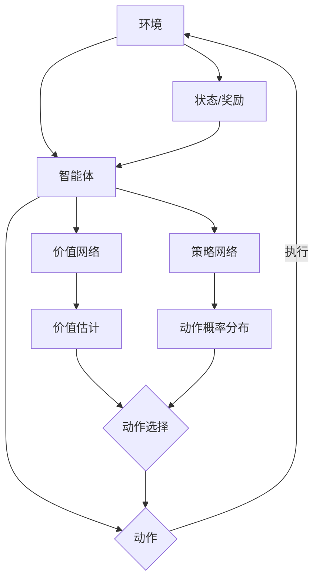

# AI人工智能深度学习算法：深度学习代理的深度强化学习策略

## 1. 背景介绍
### 1.1 人工智能的发展历程
#### 1.1.1 早期人工智能
#### 1.1.2 专家系统时代
#### 1.1.3 机器学习崛起
### 1.2 深度学习的兴起
#### 1.2.1 深度学习的起源
#### 1.2.2 深度学习的突破
#### 1.2.3 深度学习的应用
### 1.3 强化学习的发展
#### 1.3.1 强化学习的基本概念
#### 1.3.2 强化学习的发展历程
#### 1.3.3 强化学习的挑战

## 2. 核心概念与联系
### 2.1 深度学习
#### 2.1.1 人工神经网络
#### 2.1.2 卷积神经网络
#### 2.1.3 循环神经网络
### 2.2 强化学习
#### 2.2.1 马尔可夫决策过程
#### 2.2.2 值函数与策略
#### 2.2.3 探索与利用
### 2.3 深度强化学习
#### 2.3.1 深度Q网络（DQN）
#### 2.3.2 深度确定性策略梯度（DDPG）
#### 2.3.3 异步优势Actor-Critic（A3C）

## 3. 核心算法原理具体操作步骤
### 3.1 深度Q网络（DQN）
#### 3.1.1 Q-learning基础
#### 3.1.2 DQN算法流程
#### 3.1.3 DQN改进与变体
### 3.2 深度确定性策略梯度（DDPG）
#### 3.2.1 确定性策略梯度
#### 3.2.2 DDPG算法流程
#### 3.2.3 DDPG改进与变体
### 3.3 异步优势Actor-Critic（A3C）
#### 3.3.1 Actor-Critic基础
#### 3.3.2 A3C算法流程
#### 3.3.3 A3C改进与变体



## 4. 数学模型和公式详细讲解举例说明
### 4.1 马尔可夫决策过程
#### 4.1.1 状态转移概率
$P(s'|s,a) = P(S_{t+1}=s'|S_t=s, A_t=a)$
#### 4.1.2 奖励函数
$R(s,a) = E[R_{t+1}|S_t=s, A_t=a]$
#### 4.1.3 贝尔曼方程
$V^{\pi}(s) = \sum_{a} \pi(a|s) \sum_{s',r} P(s',r|s,a)[r + \gamma V^{\pi}(s')]$
### 4.2 Q-learning
#### 4.2.1 Q函数更新
$Q(s,a) \leftarrow Q(s,a) + \alpha[r + \gamma \max_{a'} Q(s',a') - Q(s,a)]$
#### 4.2.2 DQN损失函数
$L(\theta) = E[(r + \gamma \max_{a'} Q(s',a';\theta^-) - Q(s,a;\theta))^2]$
### 4.3 策略梯度
#### 4.3.1 策略梯度定理
$\nabla_{\theta} J(\theta) = E_{\tau \sim \pi_{\theta}}[\sum_{t=0}^{T-1} \nabla_{\theta} \log \pi_{\theta}(a_t|s_t) Q^{\pi}(s_t,a_t)]$
#### 4.3.2 确定性策略梯度
$\nabla_{\theta} J(\theta) = E_{s \sim \rho^{\beta}}[\nabla_{\theta} \mu_{\theta}(s) \nabla_{a} Q(s,a)|_{a=\mu_{\theta}(s)}]$

## 5. 项目实践：代码实例和详细解释说明
### 5.1 DQN在Atari游戏中的应用
#### 5.1.1 游戏环境搭建
#### 5.1.2 DQN网络结构设计
#### 5.1.3 训练过程与结果分析
### 5.2 DDPG在连续控制任务中的应用
#### 5.2.1 连续控制环境介绍
#### 5.2.2 DDPG算法实现
#### 5.2.3 实验结果与分析
### 5.3 A3C在多智能体环境中的应用
#### 5.3.1 多智能体环境搭建
#### 5.3.2 A3C算法并行化实现
#### 5.3.3 实验结果与分析

```python
import torch
import torch.nn as nn
import torch.optim as optim

class DQN(nn.Module):
    def __init__(self, state_dim, action_dim):
        super(DQN, self).__init__()
        self.fc1 = nn.Linear(state_dim, 64)
        self.fc2 = nn.Linear(64, 64)
        self.fc3 = nn.Linear(64, action_dim)

    def forward(self, x):
        x = torch.relu(self.fc1(x))
        x = torch.relu(self.fc2(x))
        x = self.fc3(x)
        return x

def train(model, env, optimizer, gamma, epsilon, num_episodes):
    for episode in range(num_episodes):
        state = env.reset()
        done = False
        while not done:
            if random.uniform(0, 1) < epsilon:
                action = env.action_space.sample()
            else:
                state_tensor = torch.FloatTensor(state).unsqueeze(0)
                q_values = model(state_tensor)
                action = torch.argmax(q_values).item()

            next_state, reward, done, _ = env.step(action)

            state_tensor = torch.FloatTensor(state).unsqueeze(0)
            next_state_tensor = torch.FloatTensor(next_state).unsqueeze(0)
            q_values = model(state_tensor)
            next_q_values = model(next_state_tensor)

            target = reward + gamma * torch.max(next_q_values)
            loss = nn.MSELoss()(q_values[0, action], target)

            optimizer.zero_grad()
            loss.backward()
            optimizer.step()

            state = next_state

        if episode % 100 == 0:
            print(f"Episode: {episode}, Loss: {loss.item()}")

    return model
```

## 6. 实际应用场景
### 6.1 自动驾驶
#### 6.1.1 感知与决策
#### 6.1.2 路径规划与控制
#### 6.1.3 端到端学习方法
### 6.2 智能推荐系统
#### 6.2.1 用户行为建模
#### 6.2.2 在线推荐策略学习
#### 6.2.3 离线策略评估
### 6.3 智能助理与对话系统
#### 6.3.1 自然语言理解
#### 6.3.2 对话管理与策略学习
#### 6.3.3 语言生成与交互优化

## 7. 工具和资源推荐
### 7.1 深度学习框架
#### 7.1.1 TensorFlow
#### 7.1.2 PyTorch
#### 7.1.3 Keras
### 7.2 强化学习库
#### 7.2.1 OpenAI Gym
#### 7.2.2 Stable Baselines
#### 7.2.3 RLlib
### 7.3 学习资源
#### 7.3.1 在线课程
#### 7.3.2 教材与书籍
#### 7.3.3 研究论文与综述

## 8. 总结：未来发展趋势与挑战
### 8.1 深度强化学习的局限性
#### 8.1.1 样本效率问题
#### 8.1.2 探索与利用困境
#### 8.1.3 奖励稀疏问题
### 8.2 未来研究方向
#### 8.2.1 元学习与迁移学习
#### 8.2.2 层次化强化学习
#### 8.2.3 安全与鲁棒的强化学习
### 8.3 深度强化学习的应用前景
#### 8.3.1 智慧城市与交通管理
#### 8.3.2 智能医疗与健康管理
#### 8.3.3 金融投资与风险控制

## 9. 附录：常见问题与解答
### 9.1 深度强化学习与监督学习、无监督学习的区别？
### 9.2 深度强化学习算法的收敛性如何保证？
### 9.3 如何平衡探索与利用？
### 9.4 深度强化学习在实际应用中面临哪些挑战？
### 9.5 深度强化学习的未来发展方向有哪些？

深度强化学习作为人工智能领域的前沿方向，融合了深度学习和强化学习的优势，为智能体提供了一种从环境中自主学习、适应与决策的能力。通过深度神经网络对环境状态的表征学习，以及策略梯度等算法对最优策略的搜索，深度强化学习在连续状态空间和高维动作空间上展现出了卓越的性能，在游戏、机器人、自动驾驶等领域取得了瞩目的成果。

然而，深度强化学习仍然面临着样本效率低、探索困难、奖励稀疏等挑战。未来的研究方向包括元学习与迁移学习，以提高样本效率和泛化能力；层次化强化学习，以应对复杂任务的分解与规划；安全与鲁棒的强化学习，以增强算法的可解释性和稳定性。此外，深度强化学习在智慧城市、智能医疗、金融投资等实际应用场景中也存在广阔的前景。

随着计算能力的提升、数据规模的扩大以及算法的不断创新，深度强化学习有望在未来实现更加智能、高效、安全的自主决策系统，为人类社会的发展注入新的动力。让我们携手探索这一充满想象力和挑战的领域，共同开创人工智能的美好未来。

作者：禅与计算机程序设计艺术 / Zen and the Art of Computer Programming