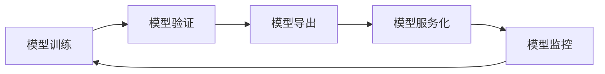

## 1.背景介绍

在当今的数据驱动的世界中，人工智能（AI）已经渗透到我们生活的各个方面。然而，将AI模型从实验室转化为实际应用并不是一件容易的事情。模型部署是这个过程中的一个重要环节。本文将深入探讨AI模型部署的原理，并通过一个代码实战案例进行详细讲解。

## 2.核心概念与联系

AI模型部署是将训练好的AI模型集成到应用程序或系统中，使其可以处理实际问题的过程。这涉及到以下几个核心概念：

- **模型训练**：使用数据集和特定的算法来训练AI模型。
- **模型验证**：在模型训练完成后，使用验证集检验模型的性能。
- **模型导出**：将训练好的模型导出为特定的格式，以便在其他系统或平台上使用。
- **模型服务化**：将模型封装为服务，使其能够处理实时的或批量的请求。
- **模型监控**：在模型部署后，持续监控模型的性能，并在需要时进行调整。

这些概念之间的联系可以通过下面的Mermaid流程图进行展示：



## 3.核心算法原理具体操作步骤

AI模型部署的过程可以分为以下几个步骤：

1. **模型训练**：首先，我们需要使用训练数据集和特定的算法来训练我们的AI模型。这个过程可能会涉及到优化模型的参数，以获取最好的模型性能。
2. **模型验证**：在模型训练完成后，我们需要使用验证数据集来检验模型的性能。这个过程可以帮助我们发现模型的问题，并进行调整。
3. **模型导出**：当我们对模型的性能满意后，我们可以将模型导出为特定的格式，如ONNX或PMML，以便在其他系统或平台上使用。
4. **模型服务化**：接下来，我们需要将模型封装为服务，使其能够处理实时的或批量的请求。这个过程可能会涉及到使用框架如TensorFlow Serving或TorchServe。
5. **模型监控**：最后，我们需要在模型部署后，持续监控模型的性能，并在需要时进行调整。这可以通过各种监控工具来实现。

## 4.数学模型和公式详细讲解举例说明

在AI模型部署的过程中，我们可能会遇到一些需要使用数学模型和公式来解决的问题。例如，在模型训练的过程中，我们通常会使用损失函数来评估模型的性能。常见的损失函数包括均方误差（MSE）和交叉熵损失（Cross Entropy Loss）。

- **均方误差**：对于回归问题，我们通常会使用均方误差作为损失函数。它的公式为：

$$
MSE = \frac{1}{n}\sum_{i=1}^{n}(Y_i - \hat{Y_i})^2
$$

其中，$Y_i$是真实值，$\hat{Y_i}$是预测值，$n$是样本数量。

- **交叉熵损失**：对于分类问题，我们通常会使用交叉熵损失作为损失函数。它的公式为：

$$
CE = -\sum_{i=1}^{n}Y_i\log(\hat{Y_i})
$$

其中，$Y_i$是真实值，$\hat{Y_i}$是预测值，$n$是样本数量。

理解这些数学模型和公式对于理解AI模型部署的过程是非常重要的。

## 5.项目实践：代码实例和详细解释说明

在这个部分，我们将通过一个简单的代码实战案例来讲解AI模型部署的过程。我们将使用Python和TensorFlow框架来实现这个案例。

首先，我们需要训练一个简单的AI模型。这里，我们使用TensorFlow的Keras API来创建一个简单的全连接神经网络，并使用MNIST数据集进行训练。

```python
import tensorflow as tf
from tensorflow.keras.datasets import mnist
from tensorflow.keras.models import Sequential
from tensorflow.keras.layers import Dense, Dropout, Flatten

# Load MNIST dataset
(x_train, y_train), (x_test, y_test) = mnist.load_data()
x_train, x_test = x_train / 255.0, x_test / 255.0

# Create a model
model = Sequential([
  Flatten(input_shape=(28, 28)),
  Dense(128, activation='relu'),
  Dropout(0.2),
  Dense(10)
])

# Compile the model
model.compile(optimizer='adam',
              loss=tf.keras.losses.SparseCategoricalCrossentropy(from_logits=True),
              metrics=['accuracy'])

# Train the model
model.fit(x_train, y_train, epochs=5)

# Validate the model
model.evaluate(x_test, y_test, verbose=2)
```

在模型训练和验证完成后，我们可以将模型导出为TensorFlow的SavedModel格式。

```python
# Export the model
model.save('my_model')
```

接下来，我们可以使用TensorFlow Serving来部署这个模型。

```bash
# Start TensorFlow Serving
tensorflow_model_server --port=8501 --rest_api_port=8501 --model_name=my_model --model_base_path=/path/to/my_model
```

最后，我们可以使用任何支持HTTP的客户端来发送请求到这个模型服务。

```python
import requests
import numpy as np

# Prepare a request
data = np.random.rand(1, 28, 28).tolist()
headers = {"content-type": "application/json"}
json_response = requests.post('http://localhost:8501/v1/models/my_model:predict', json={"instances": data}, headers=headers)

# Print the response
predictions = json.loads(json_response.text)['predictions']
print(predictions)
```

通过这个案例，我们可以看到AI模型部署的整个过程并不复杂，但需要注意的是，在实际应用中，我们可能需要处理更复杂的模型和数据，以及更复杂的部署环境。

## 6.实际应用场景

AI模型部署广泛应用于各种场景，包括但不限于：

- **图像识别**：例如，我们可以部署一个人脸识别模型，用于监控系统或社交网络的人脸识别功能。
- **语音识别**：例如，我们可以部署一个语音识别模型，用于智能助手或语音输入系统。
- **自然语言处理**：例如，我们可以部署一个情感分析模型，用于分析用户的评论或反馈。
- **推荐系统**：例如，我们可以部署一个推荐模型，用于电商或媒体网站的商品或内容推荐。

## 7.工具和资源推荐

以下是一些在AI模型部署过程中可能会用到的工具和资源：

- **TensorFlow Serving**：Google开源的一个用于部署TensorFlow模型的系统。
- **TorchServe**：PyTorch官方提供的一个用于部署PyTorch模型的服务。
- **ONNX Runtime**：用于运行ONNX模型的跨平台库。
- **Kubeflow**：一个基于Kubernetes的机器学习平台，可以用于部署和管理模型服务。
- **Seldon Core**：一个开源的机器学习部署框架，支持多种模型格式和部署策略。

## 8.总结：未来发展趋势与挑战

随着AI技术的快速发展，AI模型部署也面临着许多新的挑战和机遇。一方面，随着模型和数据的复杂性的增加，如何有效地部署和管理这些模型成为了一个重要的问题。另一方面，随着边缘计算和云计算的发展，如何将模型部署到各种设备和平台上也成为了一个热门的话题。

未来，我们期待看到更多的工具和框架来帮助我们解决这些问题，并推动AI模型部署的发展。

## 9.附录：常见问题与解答

**问题1：我可以使用什么工具来部署我的AI模型？**

答：你可以使用多种工具来部署你的AI模型，例如TensorFlow Serving、TorchServe、ONNX Runtime、Kubeflow和Seldon Core等。

**问题2：我应该如何选择模型部署的工具？**

答：你应该根据你的需求来选择模型部署的工具，例如你的模型的格式、你的部署环境、你的性能需求等。

**问题3：我应该如何监控我的模型服务？**

答：你可以使用多种工具来监控你的模型服务，例如Prometheus和Grafana等。你应该监控你的模型服务的性能指标，例如延迟、吞吐量和错误率等。

作者：禅与计算机程序设计艺术 / Zen and the Art of Computer Programming