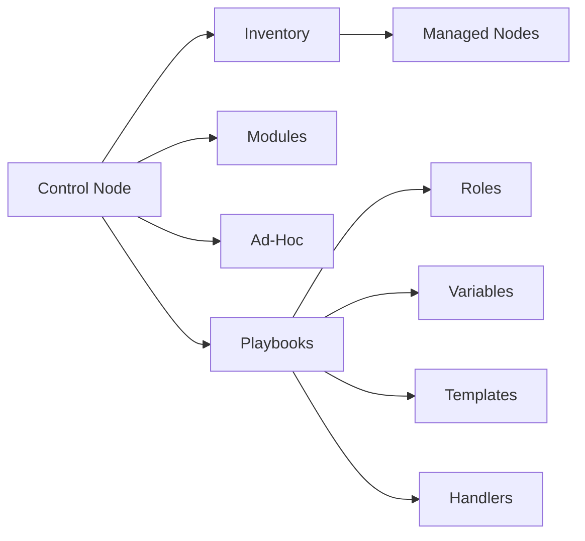

# AI系统Ansible原理与代码实战案例讲解

## 1.背景介绍

在当今快速发展的IT世界中,自动化运维已经成为了一个非常重要的话题。而在众多自动化运维工具中,Ansible以其简单易用、无需客户端、配置语法简洁等特点脱颖而出,成为了许多企业和组织首选的自动化运维工具之一。作为一款强大的IT自动化工具,Ansible可以帮助系统管理员自动化日常任务,提高工作效率。本文将深入探讨Ansible的原理,并通过实际的代码案例来讲解如何使用Ansible进行自动化运维。

### 1.1 Ansible的诞生背景

### 1.2 Ansible在自动化运维领域的地位

### 1.3 Ansible的主要特点和优势

## 2.核心概念与联系

要深入理解Ansible,首先需要了解其中的一些核心概念。本章节将介绍Ansible的核心组件,以及它们之间的关系。

### 2.1 Control Node与Managed Node

### 2.2 Inventory清单

### 2.3 Modules模块

### 2.4 Ad-Hoc命令

### 2.5 Playbooks剧本

### 2.6 Roles角色

### 2.7 Variables变量

### 2.8 Templates模板

### 2.9 Handlers处理程序

下图展示了Ansible的核心组件之间的关系:



## 3.核心算法原理具体操作步骤

Ansible的工作原理可以简单概括为:通过SSH协议在Control Node上发送命令或Playbook到Managed Node执行并返回结果。具体步骤如下:

### 3.1 通过Inventory定位到要管理的主机或主机组

### 3.2 通过Ad-Hoc命令或Playbook定义要执行的任务

### 3.3 根据任务找到对应的Module并传入参数

### 3.4 通过SSH连接到对应的主机执行Module

### 3.5 获取执行的返回结果并根据返回码判断执行状态

### 3.6 根据Handler定义的触发器执行相应任务

### 3.7 继续执行下一个任务,直到所有任务执行完毕

## 4.数学模型和公式详细讲解举例说明

虽然Ansible本身并不涉及太多数学模型,但我们可以用数学的思维来理解Ansible的工作方式。例如,我们可以将一个Playbook看作一个有向无环图(DAG),每个任务都是图中的一个节点,任务之间的依赖关系则是有向边。Ansible会根据这个DAG的拓扑结构来决定任务的执行顺序。

设Playbook中有$n$个任务,第$i$个任务记为$T_i$,如果任务$T_i$依赖于任务$T_j$,则记为$T_i \rightarrow T_j$。所有任务及其依赖关系构成一个DAG图$G=(V,E)$:

$$
V=\lbrace T_1,T_2,...,T_n \rbrace \
E=\lbrace (T_i,T_j) | T_i \rightarrow T_j \rbrace
$$

Ansible的任务调度器会根据这个DAG图来生成一个拓扑排序,将任务划分到不同的层级,保证每个任务的依赖任务都在其前面执行。

## 5.项目实践:代码实例和详细解释说明

下面我们通过一个实际的Ansible Playbook例子,来演示如何使用Ansible进行自动化运维。这个Playbook的目标是在一组服务器上安装并配置Nginx。

### 5.1 准备Inventory清单

### 5.2 编写Playbook

```yaml
---
- hosts: web
  vars:
    nginx_port: 80
    nginx_root: /var/www/html

  tasks:
    - name: Install Nginx
      yum: name=nginx state=present
      
    - name: Configure Nginx
      template: 
        src: nginx.conf.j2
        dest: /etc/nginx/nginx.conf
      notify: 
        - Restart Nginx
        
    - name: Start Nginx service
      service: name=nginx state=started enabled=yes
      
  handlers:
    - name: Restart Nginx
      service: name=nginx state=restarted
```

### 5.3 编写Template文件

### 5.4 执行Playbook

### 5.5 验证结果

## 6.实际应用场景

Ansible在实际运维工作中有非常广泛的应用,下面列举了一些常见的使用场景:

### 6.1 批量系统配置管理

### 6.2 应用程序部署

### 6.3 持续交付与持续部署

### 6.4 云资源管理与配置

### 6.5 网络设备配置管理

## 7.工具和资源推荐

### 7.1 Ansible Galaxy

### 7.2 Ansible Tower

### 7.3 Molecule

### 7.4 Ansible Container

### 7.5 推荐书籍与学习资源

## 8.总结:未来发展趋势与挑战

随着IT基础架构的日益复杂,自动化运维已经成为大势所趋。而Ansible凭借其简单灵活的特点,必将在未来的自动化运维领域扮演越来越重要的角色。未来Ansible的发展趋势可能包括:

### 8.1 与容器、Kubernetes等新兴技术深度整合 

### 8.2 利用AI、机器学习等技术实现智能化运维

### 8.3 在网络、安全等更多领域拓展应用

当然,Ansible也面临着一些挑战,例如:

### 8.4 大规模场景下的性能问题

### 8.5 复杂系统的配置管理难度

### 8.6 团队成员的学习与协作成本

## 9.附录:常见问题与解答

### 9.1 Ansible是否支持二次开发?

### 9.2 Ansible是否支持Windows?

### 9.3 Ansible如何实现幂等性?

### 9.4 Ansible的并发控制机制是什么?

### 9.5 Ansible如何保证敏感数据的安全?

作者:禅与计算机程序设计艺术 / Zen and the Art of Computer Programming