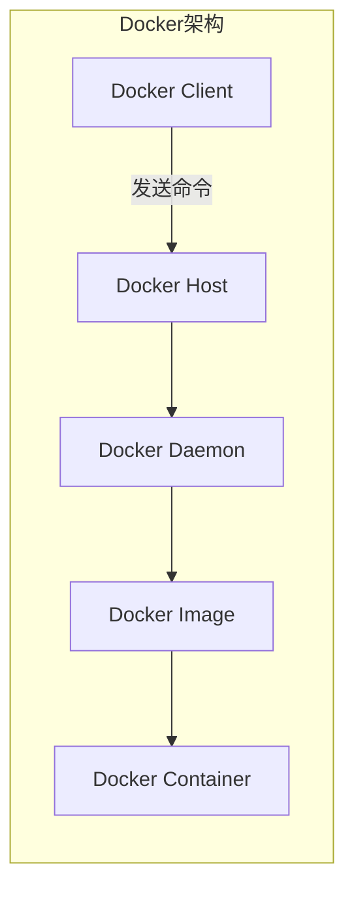
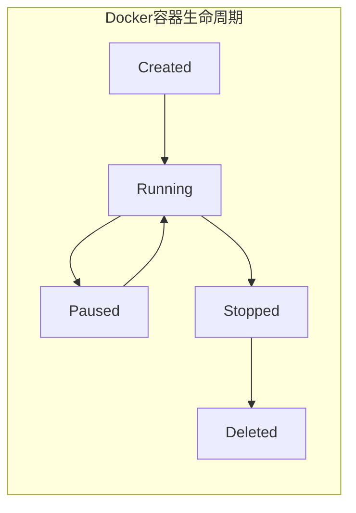
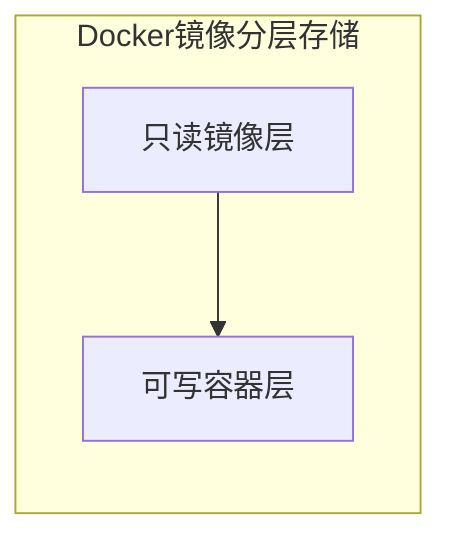
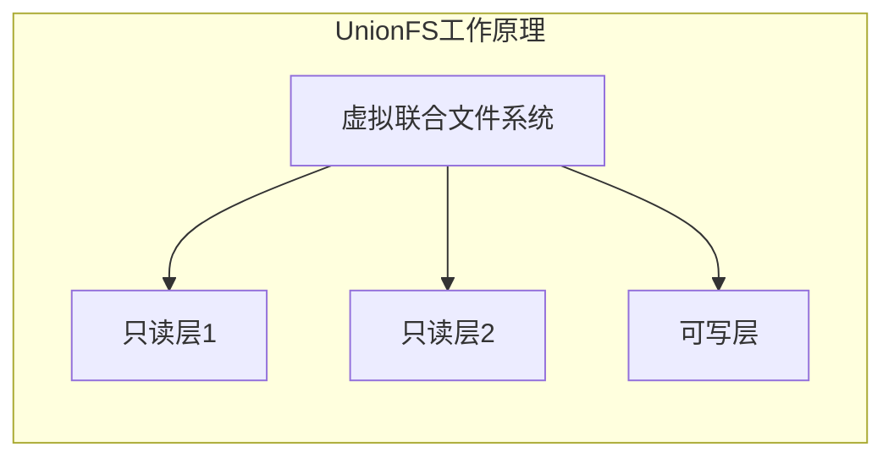

# AI系统Docker原理与代码实战案例讲解

## 1.背景介绍

### 1.1 什么是Docker?

Docker是一种开源的应用容器引擎,使用沙盒机制在主机里运行多个独立的应用容器。Docker采用了Linux容器(LXC)等同类技术,可以让应用程序在资源隔离的进程中运行,并提供一个虚拟化的文件系统。

### 1.2 为什么要使用Docker?

Docker可以让开发者打包应用以及依赖包到一个可移植的容器中,然后发布到任何流行的 Linux 操作系统的机器上,也可以实现虚拟化。容器是完全使用沙箱机制,相互之间不会有任何接口。

Docker优势:

- 更高效的利用系统资源
- 更快速的启动时间 
- 一致的运行环境
- 持续交付和部署
- 更轻松的迁移

### 1.3 Docker与虚拟机的区别

虚拟机是通过模拟一个完整的操作系统运行。而Docker通过对进程进行隔离,被隔离的进程独立于宿主操作系统和其它隔离的进程运行。


## 2.核心概念与联系

### 2.1 Docker架构

Docker使用客户端-服务器架构模式,使用远程API来管理和创建Docker容器。Docker容器通过Docker镜像来创建。

Docker的主要组件:

- Docker Client客户端
- Docker Host主机
- Docker Daemon
- Docker Image 
- Docker Container



### 2.2 Docker镜像

Docker镜像是一个只读模板,用于创建Docker容器实例。一个镜像可以基于另一个镜像,并增加一些新的功能。

Docker镜像由多层文件系统UnionFS构成,允许共享重复的数据,使镜像体积非常小。

### 2.3 Docker容器

Docker容器是一个正在运行的镜像实例。我们可以创建、启动、停止、移除容器。容器提供了标准化的运行应用程序的环境。



## 3.核心算法原理具体操作步骤

### 3.1 Docker镜像分层存储

Docker镜像由多层文件系统组成,这种分层存储的理念允许复用资源、节省空间。



每一个镜像层都是只读的,容器层在镜像层之外,所有对容器的修改都写入容器层。

### 3.2 UnionFS联合文件系统

Docker通过使用UnionFS技术将不同的目录联合到一个虚拟文件系统,实现了分层存储的概念。

UnionFS的工作原理:

1. 多个目录作为输入源
2. 将多个目录联合到一个虚拟文件系统
3. 读操作:从上往下查找,直到找到第一个匹配的文件
4. 写操作:只发生在最上层,其他层保持不变



### 3.3 Docker镜像构建

Docker镜像通过Dockerfile脚本创建,Dockerfile定义了一条条指令,每条指令对应一层镜像。

主要的Dockerfile指令:

- FROM: 指定基础镜像
- RUN: 执行命令创建新层
- COPY: 复制文件
- ENV: 设置环境变量
- CMD: 设置容器启动命令
- ...

```docker
FROM ubuntu:18.04
COPY . /app
RUN make /app
CMD python /app/app.py
```

## 4.数学模型和公式详细讲解举例说明

Docker镜像分层存储可以用集合的数学模型来表示:

设有n个只读层,标记为$L_1, L_2, ..., L_n$,最上层是可写层$L_w$。

Docker虚拟文件系统$V$是所有层的并集:

$$V = L_w \cup L_n \cup ... \cup L_2 \cup L_1$$

读操作$read(f)$查找文件$f$的过程:

$$read(f) = \begin{cases}
f & \text{if } f \in L_w\
f & \text{if } f \in L_n\
... \
f & \text{if } f \in L_2\
f & \text{if } f \in L_1\
\text{FileNotFound} & \text{otherwise}
\end{cases}$$

写操作$write(f)$只发生在最上层$L_w$:

$$L_w' = L_w \cup \{f\}$$

其他层保持不变。

## 5.项目实践：代码实例和详细解释说明

### 5.1 Docker安装

```bash
# 更新apt包索引
sudo apt-get update

# 安装依赖包
sudo apt-get install apt-transport-https ca-certificates curl software-properties-common

# 添加Docker官方GPG密钥
curl -fsSL https://download.docker.com/linux/ubuntu/gpg | sudo apt-key add -

# 添加Docker稳定版本的APT源
sudo add-apt-repository "deb [arch=amd64] https://download.docker.com/linux/ubuntu $(lsb_release -cs) stable"

# 再次更新apt包索引
sudo apt-get update

# 安装最新版Docker CE
sudo apt-get install docker-ce

# 测试Docker是否安装成功
sudo docker run hello-world
```

### 5.2 Docker镜像操作

```bash
# 查看本地镜像
docker images

# 从DockerHub拉取镜像
docker pull ubuntu:18.04 

# 运行容器并进入bash
docker run -it ubuntu:18.04 bash

# 基于容器创建新镜像
docker commit <container-id> myubuntu:v1

# 查看镜像构建历史
docker history myubuntu:v1
```

### 5.3 Dockerfile构建镜像

假设我们有一个Python应用app.py,需要构建Docker镜像:

```docker
# Dockerfile

# 基础镜像
FROM python:3.7

# 将当前目录复制到容器的/app目录
COPY . /app

# 设置工作目录
WORKDIR /app  

# 安装依赖
RUN pip install -r requirements.txt

# 设置环境变量
ENV NAME World

# 容器启动命令
CMD ["python", "app.py"]
```

```python
# app.py
import os

name = os.environ.get('NAME', 'Docker')
print(f'Hello {name}!')
```

```bash
# 构建镜像
docker build -t myapp .

# 运行容器
docker run myapp
```

## 6.实际应用场景

Docker在以下场景中得到了广泛应用:

- **服务部署**: Docker可以将应用程序及其依赖打包到一个可移植的容器中,简化了应用程序在不同环境中的部署。
- **持续集成/持续交付(CI/CD)**: Docker可以自动构建、测试和部署应用程序,支持敏捷开发。
- **微服务架构**: Docker非常适合微服务架构,每个微服务运行在一个独立的容器中,易于横向扩展和管理。
- **大数据/机器学习**: Docker可以封装复杂的数据处理管道和机器学习模型,确保一致的运行环境。

## 7.工具和资源推荐  

- **Docker Hub**: Docker官方的公共镜像仓库,拥有海量的预构建镜像。
- **Docker Compose**: 用于定义和运行多容器Docker应用程序。
- **Kubernetes**: 用于自动部署、扩展和管理容器化应用程序。
- **Docker官方文档**: https://docs.docker.com/
- **Docker入门教程**: https://docker-curriculum.com/

## 8.总结:未来发展趋势与挑战

Docker作为容器技术的代表,正在改变软件交付和运维的方式。未来发展趋势包括:

- **云原生应用**:Docker与Kubernetes等技术相结合,支持云原生应用的开发和部署。
- **边缘计算**:Docker有望在物联网和边缘计算领域发挥重要作用。
- **安全性增强**:Docker安全性持续加强,以满足企业级应用的需求。

Docker仍面临一些挑战:

- **监控和可观测性**:需要更好的工具来监控和管理容器化的分布式应用。
- **存储和网络**:需要更好地支持持久化存储和复杂网络拓扑。
- **操作系统接口**:Docker与宿主操作系统的更深度集成。

## 9.附录:常见问题与解答

**1. Docker容器与虚拟机的主要区别是什么?**

Docker容器直接运行在宿主机的内核上,而虚拟机需要通过虚拟化层模拟硬件环境。容器更加轻量级,启动速度快,占用资源少。

**2. Docker镜像与容器的关系是什么?**

Docker镜像是一个只读模板,用于创建Docker容器实例。容器是镜像的一个运行实例,可以在其中运行应用程序。

**3. Docker是如何实现镜像分层存储的?**

Docker使用UnionFS联合文件系统技术,将不同的只读镜像层和可写容器层联合到一个虚拟文件系统中,实现了分层存储。

**4. Dockerfile中的主要指令有哪些?**

常见的Dockerfile指令包括:FROM(指定基础镜像)、RUN(执行命令)、COPY(复制文件)、ENV(设置环境变量)、CMD(设置容器启动命令)等。

**5. Docker在微服务架构中有什么作用?**

Docker非常适合微服务架构,每个微服务可以运行在一个独立的容器中,易于横向扩展和管理。Docker还简化了微服务的构建、测试和部署。

作者: 禅与计算机程序设计艺术 / Zen and the Art of Computer Programming