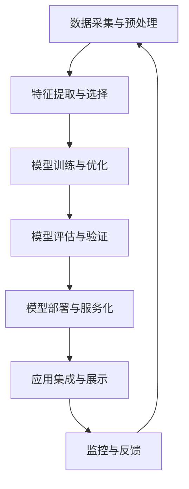

# AI系统架构原理与代码实战案例讲解

## 1. 背景介绍
### 1.1 人工智能的发展历程
#### 1.1.1 人工智能的起源与早期发展
#### 1.1.2 人工智能的黄金时期
#### 1.1.3 人工智能的低谷期与复兴
### 1.2 人工智能的应用现状
#### 1.2.1 人工智能在各行业的应用概览
#### 1.2.2 人工智能技术的成熟度分析
#### 1.2.3 人工智能应用的机遇与挑战
### 1.3 人工智能系统架构的重要性
#### 1.3.1 系统架构在人工智能项目中的作用
#### 1.3.2 良好的系统架构设计对AI项目成败的影响
#### 1.3.3 系统架构设计面临的难点与挑战

## 2. 核心概念与联系
### 2.1 人工智能的核心概念
#### 2.1.1 机器学习
#### 2.1.2 深度学习
#### 2.1.3 自然语言处理
#### 2.1.4 计算机视觉
### 2.2 AI系统架构的关键组件
#### 2.2.1 数据处理与特征工程
#### 2.2.2 模型训练与优化
#### 2.2.3 模型部署与服务化
#### 2.2.4 监控与反馈机制
### 2.3 AI系统架构的分层视图
#### 2.3.1 数据层
#### 2.3.2 算法层
#### 2.3.3 服务层
#### 2.3.4 应用层

## 3. 核心算法原理具体操作步骤
### 3.1 监督学习算法
#### 3.1.1 线性回归与逻辑回归
#### 3.1.2 决策树与随机森林
#### 3.1.3 支持向量机
#### 3.1.4 神经网络与深度学习
### 3.2 无监督学习算法
#### 3.2.1 聚类算法
#### 3.2.2 降维算法
#### 3.2.3 关联规则挖掘
### 3.3 强化学习算法
#### 3.3.1 Q-learning
#### 3.3.2 SARSA
#### 3.3.3 Policy Gradient
### 3.4 深度学习模型
#### 3.4.1 卷积神经网络(CNN)
#### 3.4.2 循环神经网络(RNN)
#### 3.4.3 长短期记忆网络(LSTM)
#### 3.4.4 生成对抗网络(GAN)

## 4. 数学模型和公式详细讲解举例说明
### 4.1 线性回归的数学模型
#### 4.1.1 简单线性回归
$y = w_0 + w_1x$
#### 4.1.2 多元线性回归
$y = w_0 + w_1x_1 + w_2x_2 + ... + w_nx_n$
#### 4.1.3 正则化线性回归
$$J(w) = \frac{1}{2m}\sum_{i=1}^{m}(h_w(x^{(i)}) - y^{(i)})^2 + \frac{\lambda}{2m}\sum_{j=1}^{n}w_j^2$$
### 4.2 逻辑回归的数学模型
#### 4.2.1 Sigmoid函数
$g(z) = \frac{1}{1+e^{-z}}$
#### 4.2.2 逻辑回归的假设函数
$h_\theta(x) = g(\theta^Tx) = \frac{1}{1+e^{-\theta^Tx}}$
#### 4.2.3 逻辑回归的代价函数
$$J(\theta) = -\frac{1}{m}\sum_{i=1}^{m}[y^{(i)}log(h_\theta(x^{(i)})) + (1-y^{(i)})log(1-h_\theta(x^{(i)}))]$$
### 4.3 支持向量机的数学模型
#### 4.3.1 函数间隔与几何间隔
#### 4.3.2 最优化问题
$$\min \frac{1}{2}||w||^2 \quad s.t. \quad y_i(w \cdot x_i + b) \geq 1, i=1,2,...,N$$
#### 4.3.3 核函数
$K(x,z) = \phi(x) \cdot \phi(z)$
### 4.4 神经网络的数学模型
#### 4.4.1 前向传播
$a^{(l)} = g(z^{(l)}) = g(W^{(l)}a^{(l-1)} + b^{(l)})$
#### 4.4.2 反向传播
$\delta^{(L)} = \nabla_{a^{(L)}} J \odot \sigma'(z^{(L)})$
$\delta^{(l)} = ((W^{(l+1)})^T \delta^{(l+1)}) \odot \sigma'(z^{(l)})$
#### 4.4.3 参数更新
$W^{(l)} := W^{(l)} - \alpha \frac{\partial J}{\partial W^{(l)}}$
$b^{(l)} := b^{(l)} - \alpha \frac{\partial J}{\partial b^{(l)}}$

## 5. 项目实践：代码实例和详细解释说明
### 5.1 实例1：基于逻辑回归的垃圾邮件分类
#### 5.1.1 数据预处理
#### 5.1.2 特征提取
#### 5.1.3 模型训练
#### 5.1.4 模型评估
### 5.2 实例2：基于卷积神经网络的手写数字识别
#### 5.2.1 数据加载与预处理
#### 5.2.2 构建CNN模型
#### 5.2.3 模型训练与优化
#### 5.2.4 模型预测与评估
### 5.3 实例3：基于LSTM的股票价格预测
#### 5.3.1 数据获取与处理
#### 5.3.2 构建LSTM模型
#### 5.3.3 模型训练与调优
#### 5.3.4 模型预测与回测
### 5.4 实例4：基于强化学习的智能走迷宫
#### 5.4.1 环境搭建
#### 5.4.2 Q-learning算法实现
#### 5.4.3 训练智能体
#### 5.4.4 测试与结果分析

## 6. 实际应用场景
### 6.1 智能客服系统
#### 6.1.1 客户意图识别
#### 6.1.2 问答系统与知识库
#### 6.1.3 情感分析与个性化服务
### 6.2 智能推荐系统
#### 6.2.1 用户画像与行为分析
#### 6.2.2 基于内容的推荐
#### 6.2.3 协同过滤推荐
#### 6.2.4 混合推荐
### 6.3 智能医疗诊断
#### 6.3.1 医学影像分析
#### 6.3.2 电子病历处理
#### 6.3.3 辅助诊断与治疗决策
### 6.4 自动驾驶系统
#### 6.4.1 环境感知与建模
#### 6.4.2 路径规划与决策
#### 6.4.3 车辆控制与执行

## 7. 工具和资源推荐
### 7.1 机器学习与深度学习框架
#### 7.1.1 TensorFlow
#### 7.1.2 PyTorch
#### 7.1.3 Scikit-learn
#### 7.1.4 Keras
### 7.2 数据处理与可视化工具
#### 7.2.1 Pandas
#### 7.2.2 NumPy
#### 7.2.3 Matplotlib
#### 7.2.4 Seaborn
### 7.3 开发环境与工具
#### 7.3.1 Jupyter Notebook
#### 7.3.2 Google Colab
#### 7.3.3 Anaconda
### 7.4 学习资源
#### 7.4.1 在线课程平台
#### 7.4.2 学术论文与会议
#### 7.4.3 开源项目与社区

## 8. 总结：未来发展趋势与挑战
### 8.1 人工智能技术的发展趋势
#### 8.1.1 模型的轻量化与移动端部署
#### 8.1.2 联邦学习与隐私保护
#### 8.1.3 跨模态学习与多任务学习
#### 8.1.4 可解释性与可信赖的人工智能
### 8.2 人工智能面临的挑战
#### 8.2.1 数据质量与标注成本
#### 8.2.2 模型泛化能力与鲁棒性
#### 8.2.3 算力与能耗问题
#### 8.2.4 伦理与安全问题
### 8.3 人工智能的未来展望
#### 8.3.1 人机协作与增强智能
#### 8.3.2 知识图谱与常识推理
#### 8.3.3 类脑智能与通用人工智能
#### 8.3.4 人工智能赋能产业升级

## 9. 附录：常见问题与解答
### 9.1 如何选择合适的模型与算法？
### 9.2 如何处理不平衡数据集？
### 9.3 如何进行特征工程？
### 9.4 如何调整超参数？
### 9.5 如何评估模型性能？
### 9.6 如何部署机器学习模型？
### 9.7 如何进行模型压缩与加速？
### 9.8 如何应对数据隐私与安全问题？

人工智能技术正在飞速发展,深刻影响和改变着我们的生活。构建高效、可靠、安全的AI系统架构是实现人工智能应用落地的关键。本文从背景介绍、核心概念、算法原理、数学模型、代码实践、应用场景等方面对AI系统架构进行了全面的阐述与讲解。未来,人工智能将与更多领域深度融合,不断突破技术瓶颈,创造更多价值。让我们携手并进,共同探索人工智能的无限可能,创造智能时代的美好未来。

作者：禅与计算机程序设计艺术 / Zen and the Art of Computer Programming