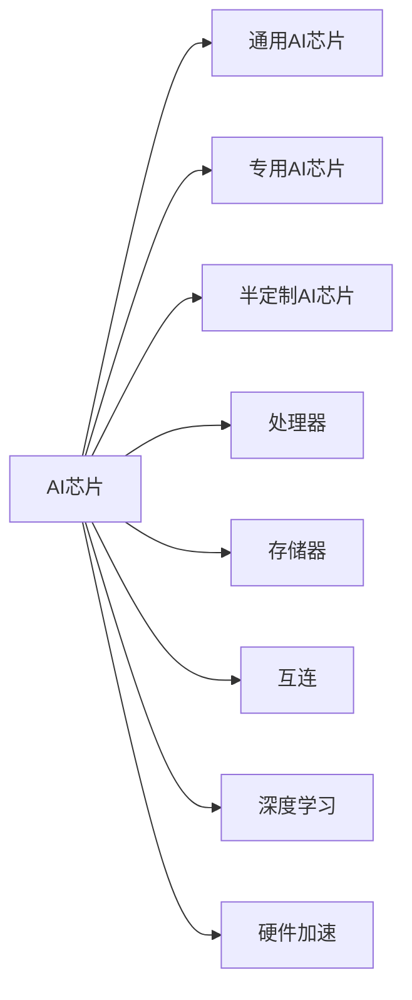

# AI芯片与硬件加速原理与代码实战案例讲解

## 1. 背景介绍
### 1.1 AI芯片的发展历程
### 1.2 AI芯片的重要性和应用领域
### 1.3 AI芯片面临的机遇与挑战

## 2. 核心概念与联系
### 2.1 AI芯片的定义和分类
#### 2.1.1 通用AI芯片
#### 2.1.2 专用AI芯片
#### 2.1.3 半定制AI芯片
### 2.2 AI芯片的核心组件
#### 2.2.1 处理器(Processor)
#### 2.2.2 存储器(Memory)
#### 2.2.3 互连(Interconnect)
### 2.3 AI芯片与深度学习的关系
### 2.4 AI芯片与硬件加速的关系



## 3. 核心算法原理具体操作步骤
### 3.1 卷积神经网络(CNN)加速
#### 3.1.1 卷积(Convolution)操作加速
#### 3.1.2 池化(Pooling)操作加速 
#### 3.1.3 激活(Activation)函数加速
### 3.2 循环神经网络(RNN)加速
#### 3.2.1 门控循环单元(GRU)加速
#### 3.2.2 长短期记忆(LSTM)网络加速
### 3.3 Transformer模型加速
#### 3.3.1 自注意力(Self-Attention)机制加速
#### 3.3.2 前馈(Feed Forward)网络加速

## 4. 数学模型和公式详细讲解举例说明
### 4.1 卷积操作的数学原理
卷积操作可以表示为：

$$
\begin{aligned}
\operatorname{Conv}(I, K)_{x, y} &=\sum_{i} \sum_{j} I(x+i, y+j) K(i, j) \
&=\sum_{i} \sum_{j} I(i, j) K(x-i, y-j)
\end{aligned}
$$

其中，$I$表示输入，$K$表示卷积核，$\operatorname{Conv}(I, K)_{x, y}$表示卷积结果在$(x,y)$位置的值。

### 4.2 池化操作的数学原理
最大池化可以表示为：

$$
\operatorname{MaxPool}(I)_{x, y}=\max _{i, j \in R(x, y)} I(i, j)
$$

其中，$R(x,y)$表示以$(x,y)$为中心的池化窗口区域。

平均池化可以表示为：

$$
\operatorname{AvgPool}(I)_{x, y}=\frac{1}{|R(x, y)|} \sum_{i, j \in R(x, y)} I(i, j)
$$

### 4.3 门控循环单元(GRU)的数学原理
GRU的数学公式如下：

$$
\begin{aligned}
z_t &=\sigma\left(W_z \cdot\left[h_{t-1}, x_t\right]\right) \
r_t &=\sigma\left(W_r \cdot\left[h_{t-1}, x_t\right]\right) \
\tilde{h}_t &=\tanh \left(W \cdot\left[r_t * h_{t-1}, x_t\right]\right) \
h_t &=\left(1-z_t\right) * h_{t-1}+z_t * \tilde{h}_t
\end{aligned}
$$

其中，$z_t$是更新门，$r_t$是重置门，$\tilde{h}_t$是候选隐藏状态，$h_t$是最终的隐藏状态。

## 5. 项目实践：代码实例和详细解释说明
### 5.1 基于NVIDIA GPU的卷积加速实现
```python
import torch
import torch.nn as nn

class ConvLayer(nn.Module):
    def __init__(self, in_channels, out_channels, kernel_size, stride=1, padding=0):
        super(ConvLayer, self).__init__()
        self.conv = nn.Conv2d(in_channels, out_channels, kernel_size, stride, padding)
    
    def forward(self, x):
        x = self.conv(x)
        return x

# 创建卷积层
conv_layer = ConvLayer(3, 64, 3, 1, 1)

# 将卷积层移动到GPU上
conv_layer = conv_layer.cuda()

# 创建输入数据并移动到GPU上
input_data = torch.randn(1, 3, 224, 224).cuda()

# 前向传播
output = conv_layer(input_data)
```

在上面的代码中，我们定义了一个简单的卷积层`ConvLayer`，它继承自`nn.Module`。在`forward`函数中，我们使用`nn.Conv2d`进行卷积操作。

通过将卷积层和输入数据移动到GPU上，可以利用GPU的并行计算能力加速卷积操作。在前向传播时，卷积操作会在GPU上执行，从而提高计算效率。

### 5.2 基于FPGA的Transformer加速实现
```verilog
module TransformerLayer #(
    parameter INPUT_SIZE = 512,
    parameter HIDDEN_SIZE = 2048,
    parameter NUM_HEADS = 8
)(
    input  wire                     clk,
    input  wire                     rst_n,
    input  wire [INPUT_SIZE-1:0]    input_data,
    output wire [HIDDEN_SIZE-1:0]   output_data
);

// 自注意力机制
SelfAttention #(
    .INPUT_SIZE(INPUT_SIZE),
    .HIDDEN_SIZE(HIDDEN_SIZE),
    .NUM_HEADS(NUM_HEADS)
) self_attention (
    .clk(clk),
    .rst_n(rst_n),
    .input_data(input_data),
    .output_data(attention_output)
);

// 前馈网络
FeedForward #(
    .INPUT_SIZE(HIDDEN_SIZE),
    .HIDDEN_SIZE(HIDDEN_SIZE)
) feed_forward (
    .clk(clk),
    .rst_n(rst_n),
    .input_data(attention_output),
    .output_data(output_data)
);

endmodule
```

在上面的Verilog代码中，我们定义了一个Transformer层的模块`TransformerLayer`。它包含了自注意力机制和前馈网络两个子模块。

自注意力机制通过`SelfAttention`模块实现，它接收输入数据，并计算自注意力的结果。前馈网络通过`FeedForward`模块实现，它接收自注意力的输出，并计算最终的输出。

通过在FPGA上实现Transformer层，可以利用FPGA的并行计算和流水线能力，加速Transformer模型的推理过程。

## 6. 实际应用场景
### 6.1 智能手机中的AI芯片应用
### 6.2 自动驾驶中的AI芯片应用
### 6.3 医疗影像分析中的AI芯片应用
### 6.4 自然语言处理中的AI芯片应用

## 7. 工具和资源推荐
### 7.1 深度学习框架
- TensorFlow
- PyTorch
- MXNet
### 7.2 AI芯片设计工具
- Xilinx Vivado
- Cadence Virtuoso
- Synopsys Design Compiler
### 7.3 AI芯片开发板
- NVIDIA Jetson系列
- Google Coral
- Intel Neural Compute Stick

## 8. 总结：未来发展趋势与挑战
### 8.1 AI芯片的发展趋势
#### 8.1.1 异构计算的发展
#### 8.1.2 新型存储器的应用
#### 8.1.3 芯片互连技术的创新
### 8.2 AI芯片面临的挑战
#### 8.2.1 功耗和散热问题
#### 8.2.2 芯片设计复杂度增加
#### 8.2.3 软硬件协同优化

## 9. 附录：常见问题与解答
### 9.1 如何选择合适的AI芯片？
### 9.2 如何评估AI芯片的性能？
### 9.3 如何进行AI芯片的软硬件协同设计？
### 9.4 如何优化AI芯片的功耗和散热？

作者：禅与计算机程序设计艺术 / Zen and the Art of Computer Programming