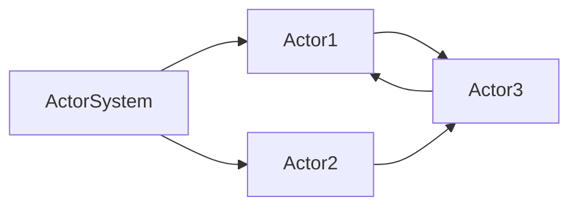

# Akka原理与代码实例讲解

## 1. 背景介绍
### 1.1 Akka的诞生背景
### 1.2 Akka的发展历程
### 1.3 Akka在分布式系统中的应用现状

## 2. 核心概念与联系
### 2.1 Actor模型
#### 2.1.1 Actor的定义
#### 2.1.2 Actor的特点
#### 2.1.3 Actor的生命周期
### 2.2 消息传递
#### 2.2.1 消息的定义与类型
#### 2.2.2 消息的发送与接收
#### 2.2.3 消息的可靠性保证
### 2.3 监督机制
#### 2.3.1 监督者与被监督者
#### 2.3.2 错误处理策略
#### 2.3.3 监督树与应用层级
### 2.4 Actor系统
#### 2.4.1 ActorSystem的创建与层级
#### 2.4.2 调度器与线程模型
#### 2.4.3 配置与日志

## 3. 核心算法原理具体操作步骤
### 3.1 Actor的创建与启动
### 3.2 消息的发送与处理
### 3.3 状态的管理与更新
### 3.4 Actor的停止与终止
### 3.5 Actor系统的启动与关闭

## 4. 数学模型和公式详细讲解举例说明
### 4.1 Akka中的并发模型
#### 4.1.1 基于消息传递的并发
#### 4.1.2 Actor模型的数学表示
#### 4.1.3 消息投递的时序图与过程分析
### 4.2 Actor系统的容错性数学分析
#### 4.2.1 失败检测与传播模型
#### 4.2.2 Let It Crash容错哲学的数学解释
#### 4.2.3 监督机制的数学建模与分析
### 4.3 消息投递的可靠性数学证明
#### 4.3.1 At-Most-Once投递模型
#### 4.3.2 At-Least-Once投递模型
#### 4.3.3 Exactly-Once投递模型

## 5. 项目实践：代码实例和详细解释说明
### 5.1 创建Actor系统和Actor
### 5.2 定义消息类型和处理逻辑
### 5.3 消息的发送与接收示例
### 5.4 状态管理与更新的代码实现
### 5.5 错误处理与监督策略示例
### 5.6 Actor的生命周期管理
### 5.7 Actor系统的配置与部署

## 6. 实际应用场景
### 6.1 高并发Web应用的设计与实现
### 6.2 分布式计算框架的构建
### 6.3 实时流处理系统的开发
### 6.4 物联网与实时控制系统
### 6.5 游戏服务器的架构设计

## 7. 工具和资源推荐
### 7.1 Akka官方文档与资源库
### 7.2 Lightbend公司提供的商业支持
### 7.3 社区贡献的第三方类库
### 7.4 Akka生态系统中的其他工具
### 7.5 学习Akka的书籍与教程推荐

## 8. 总结：未来发展趋势与挑战
### 8.1 反应式编程范式的兴起
### 8.2 Akka在云原生时代的机遇
### 8.3 Akka面临的技术挑战
### 8.4 Akka社区的发展与未来规划

## 9. 附录：常见问题与解答
### 9.1 为什么要选择Akka来构建分布式应用？
### 9.2 Akka相比其他分布式框架有何优势？
### 9.3 如何平滑地将传统应用迁移到Akka？
### 9.4 Akka能否与其他JVM语言集成？
### 9.5 Akka项目的学习路线图是怎样的？

Akka是一个用于构建高度并发、分布式和容错应用程序的开源工具包和运行时。它采用了Actor模型，提供了一种更高层次的抽象来处理并发和分布式系统中的复杂性。Akka使开发人员能够专注于业务逻辑，而不必过多关注底层的线程管理和并发控制。

Akka的核心概念是Actor，它是一个轻量级的实体，封装了状态和行为，通过异步消息传递与其他Actor进行通信。每个Actor都有自己的邮箱，用于接收消息。当一个Actor接收到消息时，它会根据消息的类型和内容执行相应的操作，并可以改变自己的内部状态，发送消息给其他Actor，或者创建新的Actor。

下面是一个简单的Akka Actor系统的Mermaid流程图：



在这个图中，ActorSystem是整个Actor系统的顶层容器，它管理着所有的Actor。Actor1和Actor2是顶层Actor，它们直接由ActorSystem管理。Actor3是Actor1和Actor2的子Actor，它由它们创建和监督。

Akka采用了"Let It Crash"的错误处理哲学。这意味着当一个Actor遇到错误时，它会被其监督者重新启动或终止，而不是试图在Actor内部处理错误。这种方式可以防止错误状态的扩散，并使系统能够在部分组件失效的情况下继续运行。

Akka提供了多种消息投递语义，包括At-Most-Once、At-Least-Once和Exactly-Once。这些语义保证了在不同的失败场景下，消息能够被可靠地传递给目标Actor。

下面是一个简单的Akka Actor示例，演示了如何定义一个Actor并处理消息：

```scala
import akka.actor.{Actor, ActorSystem, Props}

case class Greeting(message: String)

class GreetingActor extends Actor {
  def receive = {
    case Greeting(message) => println(s"Received message: $message")
  }
}

object Main extends App {
  val system = ActorSystem("GreetingSystem")
  val greetingActor = system.actorOf(Props[GreetingActor], "greetingActor")
  greetingActor ! Greeting("Hello, Akka!")
  system.terminate()
}
```

在这个例子中，我们定义了一个`GreetingActor`，它能够处理`Greeting`消息。在`Main`对象中，我们创建了一个`ActorSystem`，并使用`Props`创建了一个`GreetingActor`实例。然后，我们使用`!`操作符向`greetingActor`发送了一个`Greeting`消息。

Akka已经在许多大规模分布式系统中得到了成功应用，如在线游戏、金融交易系统、物联网平台等。它提供了一种构建高度可扩展和容错系统的强大工具。

随着反应式编程范式的兴起和云原生架构的发展，Akka面临着新的机遇和挑战。Akka社区正在不断地改进和扩展Akka，以适应不断变化的技术环境。

总之，Akka是一个成熟而强大的工具包，用于构建高度并发和分布式的应用程序。它提供了一种基于Actor模型的高层次抽象，使开发人员能够更加专注于业务逻辑的实现。Akka的容错性、可扩展性和性能，使其成为构建大规模分布式系统的理想选择。

作者：禅与计算机程序设计艺术 / Zen and the Art of Computer Programming