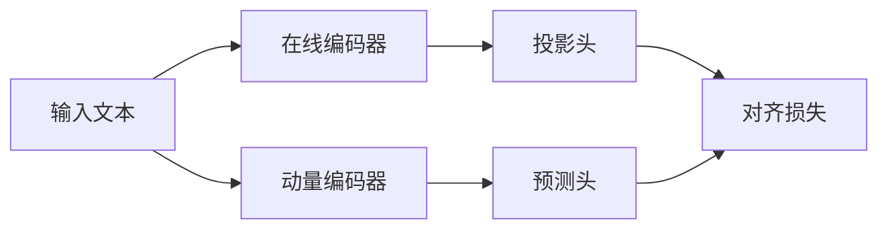

# BYOL在自然语言处理的应用进展

## 1. 背景介绍
### 1.1 自然语言处理的发展历程
#### 1.1.1 早期的统计学方法
#### 1.1.2 深度学习的兴起
#### 1.1.3 预训练语言模型的发展
### 1.2 无监督学习在NLP中的重要性
#### 1.2.1 标注数据的局限性
#### 1.2.2 无监督学习的优势
#### 1.2.3 自监督学习的崛起
### 1.3 BYOL的提出背景
#### 1.3.1 对比学习的局限性
#### 1.3.2 BYOL的创新之处
#### 1.3.3 BYOL在计算机视觉领域的成功应用

## 2. 核心概念与联系
### 2.1 Bootstrap Your Own Latent (BYOL)
#### 2.1.1 自监督学习范式
#### 2.1.2 Bootstrapping机制
#### 2.1.3 对比学习 vs BYOL
### 2.2 Transformer架构
#### 2.2.1 自注意力机制
#### 2.2.2 位置编码
#### 2.2.3 前馈神经网络
### 2.3 动量编码器
#### 2.3.1 动量更新机制
#### 2.3.2 编码器权重共享
#### 2.3.3 防止模型坍塌



## 3. 核心算法原理具体操作步骤
### 3.1 文本预处理
#### 3.1.1 分词
#### 3.1.2 小写化
#### 3.1.3 去除停用词
### 3.2 数据增强
#### 3.2.1 词删除
#### 3.2.2 词替换
#### 3.2.3 句子重排
### 3.3 模型训练
#### 3.3.1 前向传播
#### 3.3.2 损失函数计算
#### 3.3.3 反向传播与优化
### 3.4 模型推理
#### 3.4.1 特征提取
#### 3.4.2 下游任务微调
#### 3.4.3 Zero-shot与Few-shot学习

## 4. 数学模型和公式详细讲解举例说明
### 4.1 对齐损失函数
$$ \mathcal{L}_{\text{align}} = 2-2\cdot\frac{\left\langle q_{\theta}(z), k_{\xi}(z^{\prime})\right\rangle}{\left\|q_{\theta}(z)\right\|_{2} \cdot\left\|k_{\xi}(z^{\prime})\right\|_{2}} $$

其中，$q_{\theta}$和$k_{\xi}$分别表示在线编码器的投影头和动量编码器的预测头，$z$和$z^{\prime}$是同一个文本经过两次不同数据增强后的隐表示。

### 4.2 均方误差损失函数
$$ \mathcal{L}_{\text{MSE}} = \left\|q_{\theta}(z)-\operatorname{sg}\left(k_{\xi}(z^{\prime})\right)\right\|_{2}^{2} $$

其中，$\operatorname{sg}$表示阻止梯度回传的停止梯度操作。

### 4.3 动量更新公式
$$ \xi \leftarrow m \xi+(1-m) \theta $$

其中，$m$是动量系数，控制了动量编码器更新的速度。

## 5. 项目实践：代码实例和详细解释说明
### 5.1 数据准备
```python
import torch
from transformers import BertTokenizer, BertModel

tokenizer = BertTokenizer.from_pretrained('bert-base-uncased')
model = BertModel.from_pretrained('bert-base-uncased')

texts = [
    "This is the first sentence.",
    "Here comes the second sentence.",
    "And this is the last one."
]

inputs = tokenizer(texts, return_tensors='pt', padding=True, truncation=True, max_length=64)
```

### 5.2 BYOL模型定义
```python
class BYOL(torch.nn.Module):
    def __init__(self, hidden_size, projection_size, prediction_size, m=0.996):
        super().__init__()
        self.online_encoder = BertModel.from_pretrained('bert-base-uncased')
        self.momentum_encoder = BertModel.from_pretrained('bert-base-uncased')
        self.projection_head = torch.nn.Sequential(
            torch.nn.Linear(hidden_size, projection_size),
            torch.nn.ReLU(),
            torch.nn.Linear(projection_size, projection_size)
        )
        self.prediction_head = torch.nn.Sequential(
            torch.nn.Linear(projection_size, prediction_size),
            torch.nn.ReLU(),
            torch.nn.Linear(prediction_size, projection_size)
        )
        self.m = m

    def forward(self, x1, x2):
        z1 = self.online_encoder(x1)[1]
        z2 = self.momentum_encoder(x2)[1]
        p1 = self.projection_head(z1)
        p2 = self.projection_head(z2)
        q1 = self.prediction_head(p1)
        q2 = self.prediction_head(p2)
        return p1, p2, q1, q2

    @torch.no_grad()
    def update_momentum_encoder(self):
        for param_q, param_k in zip(self.online_encoder.parameters(), self.momentum_encoder.parameters()):
            param_k.data = self.m * param_k.data + (1 - self.m) * param_q.data
```

### 5.3 模型训练
```python
byol = BYOL(hidden_size=768, projection_size=256, prediction_size=128)
optimizer = torch.optim.Adam(byol.parameters(), lr=3e-4)

for _ in range(1000):
    x1, x2 = augment(inputs), augment(inputs)
    p1, p2, q1, q2 = byol(x1, x2)
    loss = align_loss(q1, p2) + align_loss(q2, p1)
    optimizer.zero_grad()
    loss.backward()
    optimizer.step()
    byol.update_momentum_encoder()
```

## 6. 实际应用场景
### 6.1 情感分析
#### 6.1.1 基于BYOL的情感分类器
#### 6.1.2 情感倾向性判断
#### 6.1.3 情感强度评估
### 6.2 文本分类
#### 6.2.1 新闻主题分类
#### 6.2.2 垃圾邮件检测
#### 6.2.3 用户意图识别
### 6.3 语义相似度计算
#### 6.3.1 文本匹配
#### 6.3.2 重复文本检测
#### 6.3.3 语义搜索

## 7. 工具和资源推荐
### 7.1 预训练模型
- [BERT](https://github.com/google-research/bert)
- [RoBERTa](https://github.com/pytorch/fairseq/tree/master/examples/roberta)
- [XLNet](https://github.com/zihangdai/xlnet)
### 7.2 开源框架
- [Transformers](https://github.com/huggingface/transformers)
- [Fairseq](https://github.com/pytorch/fairseq)
- [Flair](https://github.com/flairNLP/flair)
### 7.3 数据集
- [GLUE](https://gluebenchmark.com/)
- [SQuAD](https://rajpurkar.github.io/SQuAD-explorer/)
- [MultiNLI](https://cims.nyu.edu/~sbowman/multinli/)

## 8. 总结：未来发展趋势与挑战
### 8.1 BYOL在NLP领域的优势
#### 8.1.1 无需负样本的自监督学习
#### 8.1.2 更稳定的训练过程
#### 8.1.3 更好的泛化能力
### 8.2 未来研究方向
#### 8.2.1 更大规模的预训练模型
#### 8.2.2 更高效的训练方法
#### 8.2.3 更广泛的应用场景
### 8.3 面临的挑战
#### 8.3.1 计算资源的限制
#### 8.3.2 模型解释性不足
#### 8.3.3 数据隐私与安全问题

## 9. 附录：常见问题与解答
### 9.1 BYOL与SimCLR的区别是什么？
BYOL不需要负样本，而SimCLR需要通过对比学习来最大化正样本对之间的相似度，同时最小化负样本对之间的相似度。BYOL通过引入动量编码器和预测头，实现了更稳定、更高效的自监督学习。

### 9.2 BYOL能否应用于其他模态的数据，如图像和语音？
是的，BYOL最初是在计算机视觉领域提出的，但其思想可以推广到其他模态的数据。事实上，已经有研究者将BYOL应用于语音识别和图像分类等任务，取得了不错的效果。

### 9.3 BYOL的训练需要多少计算资源？
BYOL的训练对计算资源要求较高，特别是在使用大规模预训练模型时。一般需要多个GPU并行训练，同时需要大量的内存和存储空间。但与其他自监督学习方法相比，BYOL的训练效率还是比较高的。

作者：禅与计算机程序设计艺术 / Zen and the Art of Computer Programming