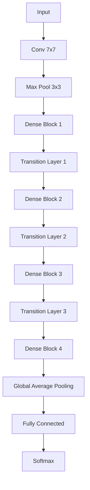

# DenseNet原理与代码实例讲解

## 1. 背景介绍
### 1.1 卷积神经网络的发展历程
#### 1.1.1 早期卷积神经网络
#### 1.1.2 AlexNet的突破
#### 1.1.3 VGG和Inception系列网络
### 1.2 ResNet的提出
#### 1.2.1 ResNet的动机
#### 1.2.2 ResNet的核心思想
#### 1.2.3 ResNet的影响
### 1.3 DenseNet的诞生
#### 1.3.1 DenseNet的创新点
#### 1.3.2 DenseNet的优势

## 2. 核心概念与联系
### 2.1 卷积神经网络基本构成
#### 2.1.1 卷积层
#### 2.1.2 池化层
#### 2.1.3 全连接层
### 2.2 残差网络ResNet
#### 2.2.1 残差块
#### 2.2.2 恒等映射
### 2.3 密集连接网络DenseNet
#### 2.3.1 密集块
#### 2.3.2 过渡层
#### 2.3.3 DenseNet整体架构



## 3. 核心算法原理具体操作步骤
### 3.1 密集连接机制
#### 3.1.1 前向密集连接
#### 3.1.2 特征重用
### 3.2 密集块内部结构
#### 3.2.1 BN-ReLU-Conv(1x1)-BN-ReLU-Conv(3x3)
#### 3.2.2 特征图连接
### 3.3 过渡层作用
#### 3.3.1 降低特征图尺寸
#### 3.3.2 减少特征图数量

## 4. 数学模型和公式详细讲解举例说明
### 4.1 前向密集连接公式
$$ x_l = H_l([x_0,x_1,...,x_{l-1}]) $$
其中 $H_l$ 代表第 $l$ 层的非线性变换，$[x_0,x_1,...,x_{l-1}]$ 表示前面所有层输出的级联。

### 4.2 密集块中的复合函数
$$ H_l(\cdot) = Conv_{3x3}(ReLU(BN(Conv_{1x1}(ReLU(BN(\cdot)))))) $$

### 4.3 过渡层公式
$$ Transition(x) = Conv_{1x1}(BN(x)) $$
$$ Pooling(Transition(x)) $$

## 5. 项目实践：代码实例和详细解释说明
### 5.1 DenseNet代码实现
#### 5.1.1 导入必要的库
```python
import torch
import torch.nn as nn
import torch.nn.functional as F
```

#### 5.1.2 定义DenseLayer
```python
class DenseLayer(nn.Module):
    def __init__(self, in_channels, growth_rate, bn_size):
        super(DenseLayer, self).__init__()
        self.bn1 = nn.BatchNorm2d(in_channels)
        self.conv1 = nn.Conv2d(in_channels, bn_size*growth_rate, kernel_size=1, bias=False)
        self.bn2 = nn.BatchNorm2d(bn_size*growth_rate)
        self.conv2 = nn.Conv2d(bn_size*growth_rate, growth_rate, kernel_size=3, padding=1, bias=False)

    def forward(self, x):
        out = self.conv1(F.relu(self.bn1(x)))
        out = self.conv2(F.relu(self.bn2(out)))
        out = torch.cat([x, out], 1)
        return out
```

#### 5.1.3 定义DenseBlock
```python
class DenseBlock(nn.Module):
    def __init__(self, num_layers, in_channels, bn_size, growth_rate):
        super(DenseBlock, self).__init__()
        self.layers = nn.ModuleList([DenseLayer(in_channels+i*growth_rate, growth_rate, bn_size) for i in range(num_layers)])

    def forward(self, x):
        for layer in self.layers:
            x = layer(x)
        return x
```

#### 5.1.4 定义Transition Layer
```python
class TransitionLayer(nn.Module):
    def __init__(self, in_channels, out_channels):
        super(TransitionLayer, self).__init__()
        self.bn = nn.BatchNorm2d(in_channels)
        self.conv = nn.Conv2d(in_channels, out_channels, kernel_size=1, bias=False)
        self.pool = nn.AvgPool2d(2)

    def forward(self, x):
        out = self.pool(self.conv(F.relu(self.bn(x))))
        return out
```

#### 5.1.5 定义DenseNet
```python
class DenseNet(nn.Module):
    def __init__(self, growth_rate=12, block_config=(6,12,24,16), num_init_features=64, bn_size=4, num_classes=10):
        super(DenseNet, self).__init__()

        self.features = nn.Sequential(OrderedDict([
            ('conv0', nn.Conv2d(3, num_init_features, kernel_size=7, stride=2, padding=3, bias=False)),
            ('norm0', nn.BatchNorm2d(num_init_features)),
            ('relu0', nn.ReLU(inplace=True)),
            ('pool0', nn.MaxPool2d(kernel_size=3, stride=2, padding=1)),
        ]))

        num_features = num_init_features
        for i, num_layers in enumerate(block_config):
            block = DenseBlock(num_layers, num_features, bn_size, growth_rate)
            self.features.add_module('denseblock%d' % (i + 1), block)
            num_features += num_layers * growth_rate
            if i != len(block_config) - 1:
                trans = TransitionLayer(num_features, num_features // 2)
                self.features.add_module('transition%d' % (i + 1), trans)
                num_features = num_features // 2

        self.bn = nn.BatchNorm2d(num_features)
        self.classifier = nn.Linear(num_features, num_classes)

    def forward(self, x):
        features = self.features(x)
        out = F.relu(self.bn(features))
        out = F.adaptive_avg_pool2d(out, (1, 1))
        out = torch.flatten(out, 1)
        out = self.classifier(out)
        return out
```

### 5.2 代码详解
- DenseLayer实现了DenseNet的基本组成单元，由BN-ReLU-Conv(1x1)-BN-ReLU-Conv(3x3)构成，最后将输入与输出在通道维度上连接。
- DenseBlock由多个DenseLayer串联而成，每个DenseLayer的输入是前面所有层的输出的级联。
- TransitionLayer用于连接两个相邻的DenseBlock，并降低特征图的尺寸和数量。包含BN-ReLU-Conv(1x1)-AvgPool。
- DenseNet的主体部分由多个DenseBlock和TransitionLayer交替堆叠而成，最后接一个全局池化和全连接层进行分类。

## 6. 实际应用场景
### 6.1 图像分类
#### 6.1.1 CIFAR数据集
#### 6.1.2 ImageNet数据集
### 6.2 目标检测
#### 6.2.1 基于DenseNet的SSD
#### 6.2.2 基于DenseNet的FPN
### 6.3 语义分割
#### 6.3.1 基于DenseNet的FCN
#### 6.3.2 基于DenseNet的U-Net

## 7. 工具和资源推荐
### 7.1 DenseNet官方实现
- [DenseNet官方Torch实现](https://github.com/liuzhuang13/DenseNet)
- [DenseNet官方Caffe实现](https://github.com/liuzhuang13/DenseNetCaffe)
### 7.2 DenseNet在PyTorch中的实现
- [PyTorch官方实现](https://github.com/pytorch/vision/blob/master/torchvision/models/densenet.py)
- [DenseNet-PyTorch](https://github.com/andreasveit/densenet-pytorch)
### 7.3 相关论文
- [Densely Connected Convolutional Networks](https://arxiv.org/abs/1608.06993)
- [Memory-Efficient Implementation of DenseNets](https://arxiv.org/abs/1707.06990)

## 8. 总结：未来发展趋势与挑战
### 8.1 DenseNet的优势
#### 8.1.1 缓解梯度消失
#### 8.1.2 加强特征复用
#### 8.1.3 减少参数量
### 8.2 DenseNet的局限性
#### 8.2.1 内存占用问题
#### 8.2.2 计算效率问题
### 8.3 未来研究方向
#### 8.3.1 改进密集连接拓扑
#### 8.3.2 设计更高效的密集块
#### 8.3.3 结合其他先进技术

## 9. 附录：常见问题与解答
### 9.1 DenseNet与ResNet的区别是什么？
DenseNet和ResNet都采用了短路连接，但DenseNet是通过级联所有前面层的输出作为后面层的输入，而ResNet是将前面层的输出与后面层的输出相加。DenseNet的密集连接方式使得网络可以实现特征重用，并且大大减少了参数量。

### 9.2 DenseNet能否任意增加网络的深度？
理论上DenseNet可以通过增加密集块的数量和每个密集块中层的数量来构建任意深度的网络。但是网络层数增加到一定程度后，会出现退化问题，这需要在训练过程中采取一定的优化和正则化措施。

### 9.3 DenseNet的密集连接会不会导致过拟合？
密集连接会使得网络更容易拟合训练数据，但DenseNet在一定程度上可以缓解过拟合问题。这是因为DenseNet在密集块内部采用了较小的卷积核（1x1和3x3），并且在不同密集块之间使用过渡层降低了特征图的尺寸和数量。此外，在训练时使用数据增强和正则化技术也可以进一步减轻过拟合。

作者：禅与计算机程序设计艺术 / Zen and the Art of Computer Programming