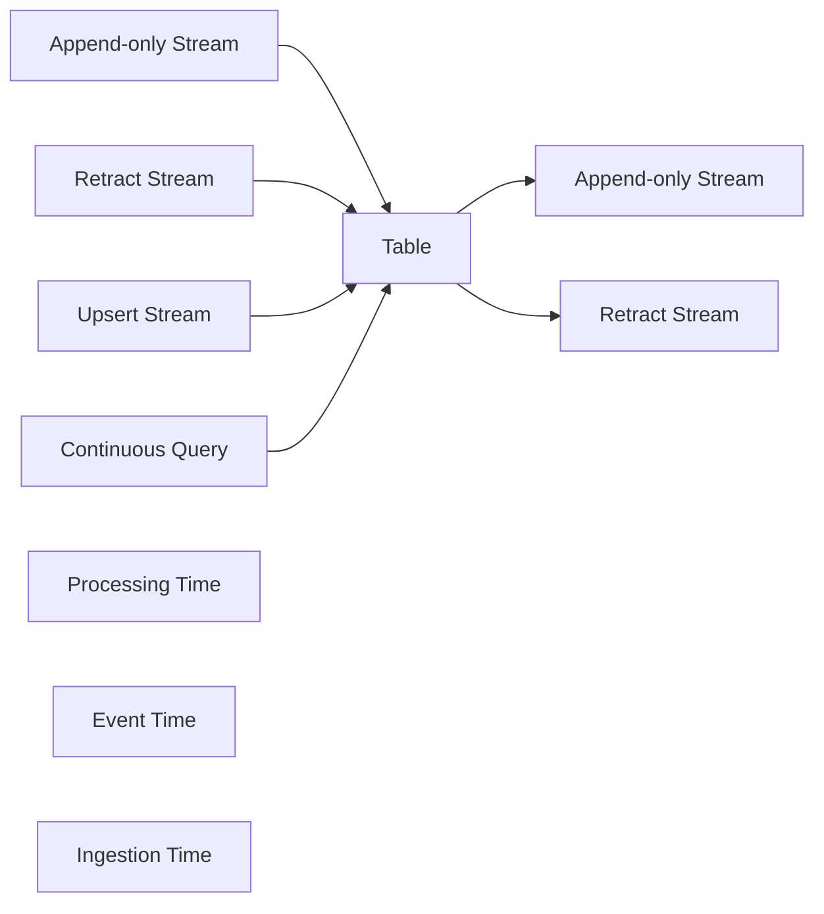

# FlinkTableAPI:声明式流处理新范式

## 1.背景介绍

### 1.1 流处理的发展历程
#### 1.1.1 传统批处理的局限性
#### 1.1.2 实时流处理的兴起
#### 1.1.3 流批一体化趋势

### 1.2 Apache Flink的崛起
#### 1.2.1 Flink的核心特性
#### 1.2.2 Flink在流处理领域的优势
#### 1.2.3 Flink社区生态发展

### 1.3 声明式API的诞生
#### 1.3.1 命令式API vs 声明式API
#### 1.3.2 SQL的回归与发展
#### 1.3.3 Table API的设计理念

## 2.核心概念与联系

### 2.1 动态表(Dynamic Table)
#### 2.1.1 动态表的定义
#### 2.1.2 动态表与流、关系表的关系
#### 2.1.3 动态表的特性

### 2.2 连续查询(Continuous Query)
#### 2.2.1 连续查询的概念
#### 2.2.2 连续查询的执行模型
#### 2.2.3 连续查询的优化挑战

### 2.3 流与表的双向转换
#### 2.3.1 Append-only Stream 到 Table
#### 2.3.2 Retract Stream 到 Table
#### 2.3.3 Upsert Stream 到 Table
#### 2.3.4 Table 到 Append-only Stream
#### 2.3.5 Table 到 Retract Stream

### 2.4 时间属性(Time Attribute)
#### 2.4.1 处理时间(Processing Time)
#### 2.4.2 事件时间(Event Time)
#### 2.4.3 摄入时间(Ingestion Time)

### 2.5 关键概念之间的联系



## 3.核心算法原理具体操作步骤

### 3.1 动态表的实现原理
#### 3.1.1 动态表的状态管理
#### 3.1.2 动态表的物化视图
#### 3.1.3 动态表的维表JOIN

### 3.2 连续查询的执行流程
#### 3.2.1 查询语法树的构建
#### 3.2.2 逻辑计划的优化
#### 3.2.3 物理执行计划的生成
#### 3.2.4 算子的动态编译

### 3.3 窗口操作的实现
#### 3.3.1 滚动窗口(Tumbling Window)
#### 3.3.2 滑动窗口(Sliding Window)
#### 3.3.3 会话窗口(Session Window)

### 3.4 时间语义的处理
#### 3.4.1 Watermark的生成与传播
#### 3.4.2 事件时间窗口的触发
#### 3.4.3 迟到数据的处理

## 4.数学模型和公式详细讲解举例说明

### 4.1 数据流模型
#### 4.1.1 数据流DAG图
#### 4.1.2 Source、Transformation和Sink
#### 4.1.3 并行数据流

### 4.2 窗口计算公式
#### 4.2.1 滚动窗口计算
$$ W_t = [t,t+size) $$
#### 4.2.2 滑动窗口计算
$$ W_t = [t,t+size) $$
$$ S_t = [t,t+slide) $$
#### 4.2.3 会话窗口计算
$$ W_t(s) = [t,t+s) $$

### 4.3 Watermark计算公式
$$ W_t = E_t - t - l $$
其中，$W_t$表示时间t的Watermark，$E_t$表示时间t接收到的最大事件时间，$l$表示允许的最大延迟时间。

## 5.项目实践：代码实例和详细解释说明

### 5.1 环境准备
#### 5.1.1 Flink环境搭建
#### 5.1.2 Table API依赖引入
#### 5.1.3 数据源准备

### 5.2 Table API基本使用
#### 5.2.1 创建表环境
```java
StreamExecutionEnvironment env = StreamExecutionEnvironment.getExecutionEnvironment();
StreamTableEnvironment tEnv = StreamTableEnvironment.create(env);
```
#### 5.2.2 创建表
```java
// 从DataStream创建表
DataStream<Order> orderDataStream = env.addSource(new OrderSource());
Table orderTable = tEnv.fromDataStream(orderDataStream);

// 从Kafka创建表
tEnv.executeSql("CREATE TABLE KafkaTable (
  `user_id` BIGINT,
  `item_id` BIGINT,
  `behavior` STRING
) WITH (
  'connector' = 'kafka',
  'topic' = 'user_behavior',
  'properties.bootstrap.servers' = 'localhost:9092',
  'properties.group.id' = 'testGroup',
  'scan.startup.mode' = 'latest-offset',
  'format' = 'csv'
)");
```
#### 5.2.3 查询转换
```java
// Table API风格查询
Table resultTable = orderTable
  .groupBy($("user_id"), $("item_id"))
  .select($("user_id"), $("item_id"), $("amount").sum().as("total_amount"));

// SQL风格查询
Table resultTable2 = tEnv.sqlQuery(
  "SELECT user_id, item_id, SUM(amount) AS total_amount " +
  "FROM KafkaTable " +
  "GROUP BY user_id, item_id"
);
```
#### 5.2.4 输出表结果
```java
// 输出到DataStream
DataStream<Tuple2<Boolean, Order>> resultStream = tEnv.toRetractStream(resultTable, Order.class);
resultStream.print();

// 输出到Kafka
tEnv.executeSql("CREATE TABLE KafkaOutputTable (
  `user_id` BIGINT,
  `item_id` BIGINT,
  `total_amount` BIGINT
) WITH (
  'connector' = 'kafka',
  'topic' = 'output_topic',
  'properties.bootstrap.servers' = 'localhost:9092',
  'format' = 'csv'
)");

resultTable.executeInsert("KafkaOutputTable");
```

### 5.3 窗口操作示例
```java
// Tumbling Window
Table tumbleResult = orderTable
  .window(Tumble.over(lit(10).minutes()).on($("order_time")).as("w"))
  .groupBy($("user_id"), $("w"))
  .select($("user_id"), $("w").start(), $("w").end(), $("amount").sum());

// Sliding Window
Table slideResult = orderTable
  .window(Slide.over(lit(10).minutes())
               .every(lit(5).minutes())
               .on($("order_time"))
               .as("w"))
  .groupBy($("user_id"), $("w"))
  .select($("user_id"), $("w").start(), $("w").end(), $("amount").sum());

// Session Window
Table sessionResult = orderTable
  .window(Session.withGap(lit(30).minutes()).on($("order_time")).as("w"))
  .groupBy($("user_id"), $("w"))
  .select($("user_id"), $("w").start(), $("w").end(), $("amount").sum());
```

### 5.4 时间属性使用
```java
// 定义事件时间属性
tEnv.executeSql("CREATE TABLE KafkaTable (
  `user_id` BIGINT,
  `item_id` BIGINT,
  `behavior` STRING,
  `ts` TIMESTAMP(3),
  WATERMARK FOR `ts` AS `ts` - INTERVAL '5' SECOND
) WITH (
  'connector' = 'kafka',
  'topic' = 'user_behavior',
  'properties.bootstrap.servers' = 'localhost:9092',
  'properties.group.id' = 'testGroup',
  'scan.startup.mode' = 'latest-offset',
  'format' = 'csv'
)");

// 基于事件时间的窗口查询
Table eventTimeResult = tEnv.sqlQuery(
  "SELECT user_id, COUNT(behavior) AS cnt, " +
  "  TUMBLE_START(ts, INTERVAL '10' MINUTE) AS window_start, " +
  "  TUMBLE_END(ts, INTERVAL '10' MINUTE) AS window_end " +
  "FROM KafkaTable " +
  "GROUP BY user_id, TUMBLE(ts, INTERVAL '10' MINUTE)"
);
```

## 6.实际应用场景

### 6.1 实时ETL
#### 6.1.1 数据清洗与转换
#### 6.1.2 数据规范化
#### 6.1.3 数据富化

### 6.2 实时数仓
#### 6.2.1 实时数据接入
#### 6.2.2 维度关联
#### 6.2.3 指标计算

### 6.3 实时风控
#### 6.3.1 实时特征提取
#### 6.3.2 实时规则计算
#### 6.3.3 实时预警

### 6.4 实时推荐
#### 6.4.1 用户行为采集
#### 6.4.2 实时用户画像
#### 6.4.3 实时召回与排序

## 7.工具和资源推荐

### 7.1 开发工具
#### 7.1.1 IntelliJ IDEA
#### 7.1.2 Flink SQL Client

### 7.2 学习资源
#### 7.2.1 Flink官方文档
#### 7.2.2 《Stream Processing with Apache Flink》
#### 7.2.3 Ververica 博客

### 7.3 社区与交流
#### 7.3.1 Flink 邮件列表
#### 7.3.2 Flink Meetup
#### 7.3.3 Flink Forward大会

## 8.总结：未来发展趋势与挑战

### 8.1 流批一体化
#### 8.1.1 API层面的统一
#### 8.1.2 SQL标准的扩展
#### 8.1.3 状态一致性语义

### 8.2 云原生
#### 8.2.1 无状态到有状态
#### 8.2.2 容器化部署
#### 8.2.3 自动弹性伸缩

### 8.3 机器学习
#### 8.3.1 实时特征工程
#### 8.3.2 在线学习
#### 8.3.3 流式预测服务

### 8.4 挑战与机遇
#### 8.4.1 端到端的一致性保证
#### 8.4.2 流式 SQL 优化
#### 8.4.3 与其他生态系统的集成

## 9.附录：常见问题与解答

### 9.1 如何选择使用 Table API 还是 SQL ？
### 9.2 如何实现自定义函数(UDF)？
### 9.3 如何处理数据倾斜问题？
### 9.4 如何实现流与维表的 JOIN ？
### 9.5 如何保证端到端的 Exactly-Once 语义？

作者：禅与计算机程序设计艺术 / Zen and the Art of Computer Programming