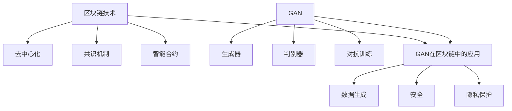

# GAN在区块链技术中的应用

## 1. 背景介绍
### 1.1 区块链技术概述
#### 1.1.1 区块链的定义与特点
#### 1.1.2 区块链的发展历程
#### 1.1.3 区块链的应用领域

### 1.2 生成对抗网络(GAN)概述
#### 1.2.1 GAN的基本原理
#### 1.2.2 GAN的发展历程
#### 1.2.3 GAN的应用领域

### 1.3 GAN与区块链结合的意义
#### 1.3.1 GAN在区块链领域的潜力
#### 1.3.2 GAN与区块链结合的优势
#### 1.3.3 GAN与区块链结合面临的挑战

## 2. 核心概念与联系
### 2.1 区块链的核心概念
#### 2.1.1 去中心化
#### 2.1.2 共识机制
#### 2.1.3 智能合约

### 2.2 GAN的核心概念
#### 2.2.1 生成器
#### 2.2.2 判别器
#### 2.2.3 对抗训练

### 2.3 GAN与区块链的联系
#### 2.3.1 GAN在区块链数据生成中的应用
#### 2.3.2 GAN在区块链安全中的应用
#### 2.3.3 GAN在区块链隐私保护中的应用

## 3. 核心算法原理具体操作步骤
### 3.1 GAN的训练过程
#### 3.1.1 生成器的训练
#### 3.1.2 判别器的训练
#### 3.1.3 生成器和判别器的交替训练

### 3.2 GAN在区块链数据生成中的应用步骤
#### 3.2.1 数据预处理
#### 3.2.2 GAN模型设计
#### 3.2.3 GAN模型训练
#### 3.2.4 生成区块链合成数据

### 3.3 GAN在区块链安全中的应用步骤
#### 3.3.1 区块链安全威胁分析
#### 3.3.2 GAN模型设计
#### 3.3.3 GAN模型训练
#### 3.3.4 区块链安全威胁检测

### 3.4 GAN在区块链隐私保护中的应用步骤
#### 3.4.1 隐私数据识别
#### 3.4.2 GAN模型设计
#### 3.4.3 GAN模型训练
#### 3.4.4 隐私数据保护

## 4. 数学模型和公式详细讲解举例说明
### 4.1 GAN的数学模型
#### 4.1.1 生成器的目标函数
$$ \min_{G} \mathbb{E}_{z \sim p_z(z)}[\log(1 - D(G(z)))] $$
其中，$G$ 表示生成器，$D$ 表示判别器，$z$ 表示随机噪声，$p_z(z)$ 表示噪声的分布。

#### 4.1.2 判别器的目标函数
$$ \max_{D} \mathbb{E}_{x \sim p_{data}(x)}[\log D(x)] + \mathbb{E}_{z \sim p_z(z)}[\log(1 - D(G(z)))] $$
其中，$x$ 表示真实数据，$p_{data}(x)$ 表示真实数据的分布。

#### 4.1.3 GAN的目标函数
$$ \min_{G} \max_{D} V(D, G) = \mathbb{E}_{x \sim p_{data}(x)}[\log D(x)] + \mathbb{E}_{z \sim p_z(z)}[\log(1 - D(G(z)))] $$

### 4.2 GAN在区块链数据生成中的数学模型
#### 4.2.1 区块链数据的特征表示
#### 4.2.2 生成器的设计
#### 4.2.3 判别器的设计

### 4.3 GAN在区块链安全中的数学模型
#### 4.3.1 区块链安全威胁的特征表示
#### 4.3.2 生成器的设计
#### 4.3.3 判别器的设计

### 4.4 GAN在区块链隐私保护中的数学模型
#### 4.4.1 隐私数据的特征表示
#### 4.4.2 生成器的设计
#### 4.4.3 判别器的设计

## 5. 项目实践：代码实例和详细解释说明
### 5.1 GAN在区块链数据生成中的代码实例
#### 5.1.1 数据预处理代码
#### 5.1.2 GAN模型定义代码
#### 5.1.3 GAN模型训练代码
#### 5.1.4 区块链合成数据生成代码

### 5.2 GAN在区块链安全中的代码实例
#### 5.2.1 区块链安全威胁数据预处理代码
#### 5.2.2 GAN模型定义代码
#### 5.2.3 GAN模型训练代码
#### 5.2.4 区块链安全威胁检测代码

### 5.3 GAN在区块链隐私保护中的代码实例
#### 5.3.1 隐私数据预处理代码
#### 5.3.2 GAN模型定义代码
#### 5.3.3 GAN模型训练代码
#### 5.3.4 隐私数据保护代码

## 6. 实际应用场景
### 6.1 供应链金融中的应用
#### 6.1.1 供应链金融中的痛点
#### 6.1.2 GAN在供应链金融中的应用
#### 6.1.3 GAN在供应链金融中的优势

### 6.2 医疗健康领域的应用
#### 6.2.1 医疗健康领域的痛点
#### 6.2.2 GAN在医疗健康领域的应用
#### 6.2.3 GAN在医疗健康领域的优势

### 6.3 数字版权保护中的应用
#### 6.3.1 数字版权保护中的痛点
#### 6.3.2 GAN在数字版权保护中的应用
#### 6.3.3 GAN在数字版权保护中的优势

## 7. 工具和资源推荐
### 7.1 GAN开发框架
#### 7.1.1 TensorFlow
#### 7.1.2 PyTorch
#### 7.1.3 Keras

### 7.2 区块链开发平台
#### 7.2.1 Ethereum
#### 7.2.2 Hyperledger Fabric
#### 7.2.3 EOS

### 7.3 学习资源
#### 7.3.1 在线课程
#### 7.3.2 书籍推荐
#### 7.3.3 论文推荐

## 8. 总结：未来发展趋势与挑战
### 8.1 GAN在区块链领域的发展趋势
#### 8.1.1 GAN与区块链的深度融合
#### 8.1.2 GAN在区块链领域的创新应用
#### 8.1.3 GAN在区块链领域的标准化

### 8.2 GAN在区块链领域面临的挑战
#### 8.2.1 GAN模型的稳定性和收敛性
#### 8.2.2 GAN生成数据的真实性和多样性
#### 8.2.3 GAN在区块链领域的可解释性

### 8.3 未来研究方向
#### 8.3.1 GAN与区块链的理论基础研究
#### 8.3.2 GAN在区块链领域的性能优化
#### 8.3.3 GAN在区块链领域的安全与隐私保护

## 9. 附录：常见问题与解答
### 9.1 GAN和区块链结合的必要性是什么？
### 9.2 GAN在区块链领域应用的局限性有哪些？
### 9.3 如何评估GAN生成的区块链数据的质量？
### 9.4 GAN在区块链安全中的应用是否会引入新的安全风险？
### 9.5 GAN在区块链隐私保护中的应用如何平衡效用和隐私？

作者：禅与计算机程序设计艺术 / Zen and the Art of Computer Programming