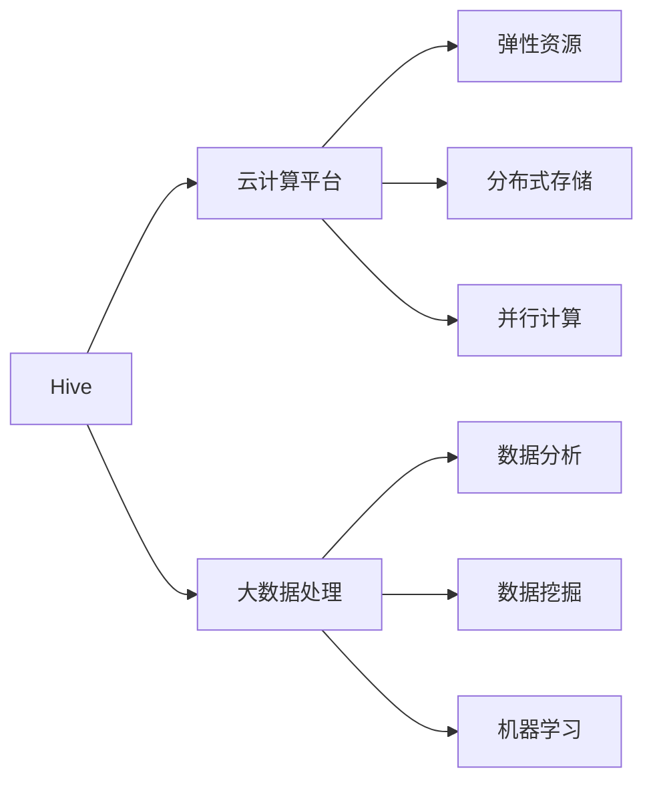

# Hive与云计算：拥抱云时代

## 1.背景介绍
### 1.1 大数据时代的挑战
#### 1.1.1 数据量爆炸式增长
#### 1.1.2 传统数据处理方式的局限性
#### 1.1.3 大数据技术的兴起

### 1.2 云计算的发展
#### 1.2.1 云计算的定义与特点
#### 1.2.2 云计算的服务模式
#### 1.2.3 云计算平台的发展现状

### 1.3 Hive与云计算的结合
#### 1.3.1 Hive在大数据处理中的地位
#### 1.3.2 云计算为Hive带来的机遇
#### 1.3.3 Hive与云计算结合的意义

## 2.核心概念与联系
### 2.1 Hive的核心概念
#### 2.1.1 Hive的架构与组件
#### 2.1.2 HiveQL与SQL的异同
#### 2.1.3 Hive的数据模型与存储格式

### 2.2 云计算的核心概念
#### 2.2.1 虚拟化技术
#### 2.2.2 分布式存储与计算
#### 2.2.3 弹性伸缩与负载均衡

### 2.3 Hive与云计算的关系
#### 2.3.1 Hive在云环境下的部署模式
#### 2.3.2 云计算为Hive提供的资源与服务
#### 2.3.3 Hive与云原生技术的集成



## 3.核心算法原理具体操作步骤
### 3.1 Hive的查询执行流程
#### 3.1.1 语法解析与语义分析
#### 3.1.2 逻辑计划生成与优化
#### 3.1.3 物理计划生成与执行

### 3.2 Hive的数据分区与分桶
#### 3.2.1 分区表的创建与管理
#### 3.2.2 分桶表的原理与使用
#### 3.2.3 分区与分桶的性能优化

### 3.3 Hive的数据倾斜处理
#### 3.3.1 数据倾斜的原因与危害
#### 3.3.2 数据倾斜的检测与定位
#### 3.3.3 数据倾斜的解决方案

## 4.数学模型和公式详细讲解举例说明
### 4.1 Hive的成本模型
#### 4.1.1 I/O成本估算
Hive的I/O成本可以用以下公式估算：

$Cost_{IO} = \sum_{i=1}^{n} size(input_i) + \sum_{j=1}^{m} size(output_j)$

其中，$input_i$表示第$i$个输入表，$output_j$表示第$j$个输出表，$size()$函数计算表的大小。

#### 4.1.2 CPU成本估算
Hive的CPU成本可以用以下公式估算：

$Cost_{CPU} = \sum_{i=1}^{n} (record_i \times cpu_i) $

其中，$record_i$表示第$i$个算子处理的记录数，$cpu_i$表示第$i$个算子的单记录CPU处理时间。

#### 4.1.3 网络传输成本估算
Hive的网络传输成本可以用以下公式估算：

$Cost_{Network} = \sum_{i=1}^{n} (size(shuffle_i) + size(broadcast_i))$

其中，$shuffle_i$表示第$i$次shuffle过程传输的数据量，$broadcast_i$表示第$i$次广播变量传输的数据量。

### 4.2 Hive的查询优化模型
#### 4.2.1 RBO（基于规则的优化）
Hive使用一系列启发式规则对查询进行优化，如谓词下推、列剪枝、分区剪枝等。优化后的查询执行计划可以大大减少不必要的I/O和计算开销。

#### 4.2.2 CBO（基于成本的优化）
Hive的CBO基于统计信息和成本模型，评估不同查询计划的代价，选择执行代价最小的计划。CBO需要收集表和列的统计信息，并使用动态规划算法搜索最优计划。

设查询计划空间为$P$，第$i$个查询计划为$p_i$，则最优查询计划$p_{opt}$满足：

$$p_{opt} = \arg\min_{p_i \in P} Cost(p_i)$$

其中，$Cost(p_i)$表示查询计划$p_i$的估算执行代价。

## 5.项目实践：代码实例和详细解释说明
### 5.1 在云平台上部署Hive
#### 5.1.1 创建EMR集群
使用AWS EMR或阿里云EMR等云服务，可以快速创建一个Hive集群。以下是使用AWS CLI创建EMR集群的示例代码：

```bash
aws emr create-cluster --name "Hive Cluster" \
--release-label emr-5.32.0 --applications Name=Hive \
--ec2-attributes KeyName=myKey --instance-type m5.xlarge \
--instance-count 3 --use-default-roles
```

#### 5.1.2 配置Hive元数据库
在EMR主节点上，编辑Hive配置文件`hive-site.xml`，设置元数据库的连接信息：

```xml
<property>
  <name>javax.jdo.option.ConnectionURL</name>
  <value>jdbc:mysql://metastore-db:3306/hive?createDatabaseIfNotExist=true</value>
</property>
<property>
  <name>javax.jdo.option.ConnectionDriverName</name>
  <value>com.mysql.jdbc.Driver</value>
</property>
<property>
  <name>javax.jdo.option.ConnectionUserName</name>
  <value>hive</value>
</property>
<property>
  <name>javax.jdo.option.ConnectionPassword</name>
  <value>hive-password</value>
</property>
```

### 5.2 Hive数据分析实例
#### 5.2.1 创建表并加载数据
创建销售数据表`sales`，并从HDFS加载CSV格式的数据文件：

```sql
CREATE TABLE sales(
  date STRING,
  product STRING,
  category STRING,
  amount DOUBLE
)
ROW FORMAT DELIMITED FIELDS TERMINATED BY ',';

LOAD DATA INPATH '/data/sales.csv' INTO TABLE sales;
```

#### 5.2.2 数据分析查询
统计每个产品类别的销售总额，并按金额降序排列：

```sql
SELECT category, SUM(amount) AS total_amount
FROM sales
GROUP BY category
ORDER BY total_amount DESC;
```

查询结果如下：

```
category   total_amount
电子产品    8923718.22
服装        5038292.01
家居用品    3256119.84
```

#### 5.2.3 数据可视化展示
使用BI工具如Tableau或QuickSight连接Hive，可以实现销售数据的可视化分析与展示。下图是一个按产品类别统计销售额的饼图：


## 6.实际应用场景
### 6.1 电商用户行为分析
#### 6.1.1 用户购买偏好挖掘
#### 6.1.2 用户流失预警
#### 6.1.3 个性化推荐

### 6.2 金融风险管控
#### 6.2.1 反欺诈模型构建
#### 6.2.2 信用评分与授信额度
#### 6.2.3 客户流失预测

### 6.3 工业设备故障诊断
#### 6.3.1 设备运行状态监测
#### 6.3.2 异常工况检测与定位
#### 6.3.3 预测性维护决策

## 7.工具和资源推荐
### 7.1 Hive相关学习资源
#### 7.1.1 官方文档与Wiki
#### 7.1.2 经典书籍推荐
#### 7.1.3 视频教程与公开课

### 7.2 Hive开发工具
#### 7.2.1 HUE（Hadoop User Experience）
#### 7.2.2 Zeppelin Notebook
#### 7.2.3 DataGrip等IDE插件

### 7.3 云平台Hive服务
#### 7.3.1 AWS EMR
#### 7.3.2 阿里云EMR
#### 7.3.3 Azure HDInsight

## 8.总结：未来发展趋势与挑战
### 8.1 Hive的发展方向
#### 8.1.1 Hive 3.0新特性与改进
#### 8.1.2 Hive on Spark/Tez
#### 8.1.3 Hive与流处理的集成

### 8.2 云原生大数据平台的趋势
#### 8.2.1 Serverless大数据服务
#### 8.2.2 云数据湖与数据仓库
#### 8.2.3 大数据即服务（BDaaS）

### 8.3 Hive面临的挑战
#### 8.3.1 实时性与低延迟
#### 8.3.2 数据治理与元数据管理
#### 8.3.3 与新兴技术的融合创新

## 9.附录：常见问题与解答
### 9.1 Hive与HBase的区别与联系？
### 9.2 如何优化Hive查询性能？
### 9.3 Hive适合哪些使用场景？
### 9.4 如何处理Hive中的数据倾斜问题？
### 9.5 Hive与Presto、Impala等SQL on Hadoop引擎的对比？

作者：禅与计算机程序设计艺术 / Zen and the Art of Computer Programming